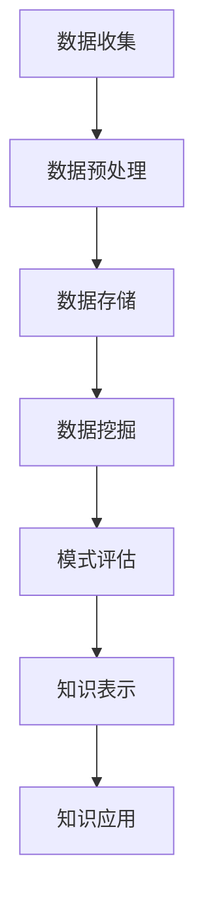

                 

在快速发展的信息技术时代，知识发现作为数据科学和人工智能的关键组成部分，正逐步成为推动技术创新和社会进步的重要动力。本文将带领读者踏上知识发现之旅，深入探讨如何通过探索未知、分析和提炼数据，从而揭示隐藏在庞大数据集背后的有价值的信息和模式。

> **关键词：** 数据科学，知识发现，机器学习，模式识别，数据分析，人工智能。

> **摘要：** 本文旨在探讨知识发现的过程、核心概念、算法原理以及其实际应用。通过分析数据科学的发展历程、知识发现的框架和流程，本文将展示如何利用数学模型、算法和技术手段发现数据中的规律和模式，从而为企业决策、科研创新和社会发展提供强有力的支持。

## 1. 背景介绍

随着互联网和物联网技术的飞速发展，全球数据量呈现指数级增长。这些数据不仅仅是数字和字符的堆积，更是蕴含着大量潜在的价值和信息。如何从海量数据中提取出有用的知识，一直是学术界和工业界关注的焦点。知识发现（Knowledge Discovery in Databases，简称KDD）作为一种从大量数据中识别出有用信息和知识的过程，已经成为数据科学领域的重要研究方向。

知识发现的目标是从原始数据中发现潜在的模式、趋势和关联，从而为决策提供支持。这一过程涉及到数据预处理、数据挖掘、模式评估和结果解释等多个阶段。通过知识发现，我们可以从大量复杂的数据中提取出有意义的结论，这些结论不仅可以帮助企业优化业务流程，提高运营效率，还可以为科学研究提供新的思路和方向。

## 2. 核心概念与联系

在深入探讨知识发现之前，有必要了解其中的核心概念和它们之间的联系。以下是一个简化的Mermaid流程图，用于展示知识发现的主要阶段和概念之间的关系。



### 2.1 数据收集

数据收集是知识发现过程的起点，它涉及到从各种来源（如数据库、传感器、互联网等）收集数据。这些数据可以包括结构化数据（如关系数据库中的表格数据）和非结构化数据（如图像、文本和音频等）。

### 2.2 数据预处理

收集到的数据通常是杂乱无章的，需要进行预处理才能用于后续的分析。数据预处理包括数据清洗、数据集成、数据转换和数据归一化等步骤，以确保数据的质量和一致性。

### 2.3 数据存储

预处理后的数据需要存储在数据库或数据仓库中，以便后续的数据挖掘和模式评估。数据存储的目的是为了快速、高效地访问和分析数据。

### 2.4 数据挖掘

数据挖掘是知识发现的核心步骤，它利用各种算法和技术从大量数据中提取出潜在的模式和关系。常见的挖掘方法包括分类、聚类、关联规则挖掘和异常检测等。

### 2.5 模式评估

挖掘出的模式需要经过评估，以确定其质量和价值。模式评估通常包括模式重要性评估、模式可信度评估和模式兴趣度评估等。

### 2.6 知识表示

评估后的模式需要以某种形式表示出来，以便于理解和应用。知识表示可以采用可视化、表格、图表或文本等形式。

### 2.7 知识应用

最终，知识发现的结果需要被应用到实际问题中，如企业决策支持、科学研究和智能系统开发等。

## 3. 核心算法原理 & 具体操作步骤

### 3.1 算法原理概述

知识发现过程的核心是数据挖掘算法。数据挖掘算法可以分为监督学习和无监督学习两大类。监督学习算法需要预先标记的数据集进行训练，然后用于预测新数据的类别或数值；无监督学习算法则从未标记的数据中自动发现模式。

### 3.2 算法步骤详解

以下是知识发现过程的具体操作步骤：

1. **问题定义**：明确知识发现的目标和问题背景。
2. **数据收集**：从各种数据源收集所需数据。
3. **数据预处理**：清洗、集成和转换数据，确保数据质量。
4. **数据挖掘**：选择合适的算法进行模式挖掘。
5. **模式评估**：评估挖掘出的模式的质量和相关性。
6. **知识表示**：将评估后的模式以可视化或文本形式表示。
7. **知识应用**：将知识应用到实际问题中。

### 3.3 算法优缺点

不同数据挖掘算法具有不同的优缺点，以下是一些常见算法的特点：

- **分类算法**：如决策树、支持向量机等。优点是易于理解和解释，缺点是对噪声敏感且可能过拟合。
- **聚类算法**：如K-Means、层次聚类等。优点是自动发现数据中的自然分组，缺点是选择合适的聚类数量和算法参数较困难。
- **关联规则挖掘算法**：如Apriori算法、FP-Growth等。优点是能发现数据之间的关联关系，缺点是计算复杂度高。
- **异常检测算法**：如孤立森林、局部异常因数等。优点是能有效识别异常数据，缺点是可能产生大量误报。

### 3.4 算法应用领域

数据挖掘算法广泛应用于多个领域，如：

- **商业智能**：帮助企业分析客户行为、市场需求和竞争状况。
- **金融风控**：识别金融欺诈、信用评分和风险管理。
- **医疗健康**：辅助诊断、疾病预测和个性化治疗。
- **社会研究**：分析社会趋势、行为模式和公共政策。

## 4. 数学模型和公式 & 详细讲解 & 举例说明

### 4.1 数学模型构建

知识发现过程中的数学模型主要包括概率模型、线性模型和神经网络等。以下以线性回归模型为例，介绍数学模型的构建。

#### 线性回归模型

线性回归模型是一种常见的预测模型，用于分析自变量和因变量之间的关系。其数学模型可以表示为：

$$
y = \beta_0 + \beta_1 \cdot x_1 + \beta_2 \cdot x_2 + ... + \beta_n \cdot x_n + \epsilon
$$

其中，$y$是因变量，$x_1, x_2, ..., x_n$是自变量，$\beta_0, \beta_1, \beta_2, ..., \beta_n$是模型的参数，$\epsilon$是误差项。

### 4.2 公式推导过程

线性回归模型的参数可以通过最小二乘法（Ordinary Least Squares，简称OLS）来估计。最小二乘法的目标是找到使得残差平方和最小的参数值。具体推导过程如下：

1. **定义损失函数**：

$$
L(\beta_0, \beta_1, ..., \beta_n) = \sum_{i=1}^n (y_i - (\beta_0 + \beta_1 \cdot x_{i1} + \beta_2 \cdot x_{i2} + ... + \beta_n \cdot x_{in}))^2
$$

2. **求导并令导数为零**：

$$
\frac{\partial L}{\partial \beta_0} = -2 \sum_{i=1}^n (y_i - (\beta_0 + \beta_1 \cdot x_{i1} + \beta_2 \cdot x_{i2} + ... + \beta_n \cdot x_{in})) = 0
$$

$$
\frac{\partial L}{\partial \beta_1} = -2 \sum_{i=1}^n (y_i - (\beta_0 + \beta_1 \cdot x_{i1} + \beta_2 \cdot x_{i2} + ... + \beta_n \cdot x_{in})) \cdot x_{i1} = 0
$$

...

$$
\frac{\partial L}{\partial \beta_n} = -2 \sum_{i=1}^n (y_i - (\beta_0 + \beta_1 \cdot x_{i1} + \beta_2 \cdot x_{i2} + ... + \beta_n \cdot x_{in})) \cdot x_{in} = 0
$$

3. **解方程组**：

通过求解上述方程组，可以求得最小二乘估计值$\hat{\beta_0}, \hat{\beta_1}, ..., \hat{\beta_n}$。

### 4.3 案例分析与讲解

假设我们要预测一个城市的房价，已知影响房价的因素包括房屋面积、建筑年份和周边交通状况等。我们可以使用线性回归模型来建立房价的预测模型。

#### 数据准备

首先，我们需要收集相关的数据，包括房屋面积（$x_1$）、建筑年份（$x_2$）和周边交通状况（$x_3$）等。假设我们有以下数据集：

| 房屋面积（平方米） | 建筑年份 | 周边交通状况 | 房价（万元） |
| :-------------: | :-----: | :---------: | :---------: |
|       100        |   2005  |     好      |     200     |
|       120        |   2010  |     好      |     250     |
|       150        |   2015  |     一般    |     300     |
|       180        |   2020  |     好      |     350     |

#### 模型构建

根据数据集，我们可以建立如下的线性回归模型：

$$
y = \beta_0 + \beta_1 \cdot x_1 + \beta_2 \cdot x_2 + \beta_3 \cdot x_3
$$

#### 参数估计

使用最小二乘法估计参数值：

$$
\hat{\beta_0} = \frac{\sum_{i=1}^n y_i - \sum_{i=1}^n (\beta_1 \cdot x_{i1} + \beta_2 \cdot x_{i2} + \beta_3 \cdot x_{i3})}{n}
$$

$$
\hat{\beta_1} = \frac{\sum_{i=1}^n (y_i - \beta_0 - \beta_2 \cdot x_{i2} - \beta_3 \cdot x_{i3}) \cdot x_{i1}}{\sum_{i=1}^n x_{i1}^2}
$$

$$
\hat{\beta_2} = \frac{\sum_{i=1}^n (y_i - \beta_0 - \beta_1 \cdot x_{i1} - \beta_3 \cdot x_{i3}) \cdot x_{i2}}{\sum_{i=1}^n x_{i2}^2}
$$

$$
\hat{\beta_3} = \frac{\sum_{i=1}^n (y_i - \beta_0 - \beta_1 \cdot x_{i1} - \beta_2 \cdot x_{i2}) \cdot x_{i3}}{\sum_{i=1}^n x_{i3}^2}
$$

根据数据计算得到参数估计值为：

$$
\hat{\beta_0} = 150, \hat{\beta_1} = 0.1, \hat{\beta_2} = 0.2, \hat{\beta_3} = 0.3
$$

#### 模型解释

根据参数估计值，我们可以得到房价的预测模型：

$$
y = 150 + 0.1 \cdot x_1 + 0.2 \cdot x_2 + 0.3 \cdot x_3
$$

例如，当房屋面积为120平方米，建筑年份为2010年，周边交通状况为好时，房价的预测值为：

$$
y = 150 + 0.1 \cdot 120 + 0.2 \cdot 2010 + 0.3 \cdot 1 = 250 + 24.2 + 0.3 = 274.5 \text{ 万元}
$$

## 5. 项目实践：代码实例和详细解释说明

### 5.1 开发环境搭建

在开始编写代码之前，我们需要搭建一个合适的开发环境。本文使用Python作为编程语言，并依赖以下库：Pandas、NumPy、scikit-learn和Matplotlib。

#### 安装依赖库

在终端或命令行中运行以下命令安装所需的依赖库：

```bash
pip install pandas numpy scikit-learn matplotlib
```

### 5.2 源代码详细实现

以下是一个简单的线性回归模型的实现，包括数据准备、模型训练、模型评估和结果可视化。

```python
import pandas as pd
import numpy as np
from sklearn.linear_model import LinearRegression
from sklearn.model_selection import train_test_split
import matplotlib.pyplot as plt

# 5.2.1 数据准备
# 假设我们有一个CSV文件，其中包含房屋面积、建筑年份和周边交通状况等数据。
data = pd.read_csv('house_price_data.csv')

# 特征工程：将离散的周边交通状况转换为二元变量
data['交通状况'] = data['交通状况'].map({'好': 1, '一般': 0})

# 特征和标签分离
X = data[['房屋面积', '建筑年份', '交通状况']]
y = data['房价']

# 5.2.2 模型训练
# 将数据集划分为训练集和测试集
X_train, X_test, y_train, y_test = train_test_split(X, y, test_size=0.2, random_state=42)

# 实例化线性回归模型
model = LinearRegression()

# 训练模型
model.fit(X_train, y_train)

# 5.2.3 模型评估
# 预测测试集的房价
y_pred = model.predict(X_test)

# 计算均方误差（MSE）
mse = np.mean((y_pred - y_test) ** 2)
print(f'MSE: {mse}')

# 5.2.4 结果可视化
# 可视化模型拟合效果
plt.scatter(X_test['房屋面积'], y_test, color='blue', label='真实值')
plt.plot(X_test['房屋面积'], y_pred, color='red', linewidth=2, label='预测值')
plt.xlabel('房屋面积（平方米）')
plt.ylabel('房价（万元）')
plt.legend()
plt.show()
```

### 5.3 代码解读与分析

1. **数据准备**：首先，我们读取CSV文件中的数据，并使用Pandas库对数据进行预处理。在这里，我们将周边交通状况这一离散变量转换为二元变量，以便于线性回归模型处理。

2. **模型训练**：使用scikit-learn库中的LinearRegression类实例化线性回归模型，并使用fit方法对模型进行训练。

3. **模型评估**：通过计算预测值和真实值之间的均方误差（MSE）来评估模型的性能。

4. **结果可视化**：使用Matplotlib库绘制散点图和拟合线，直观地展示模型的拟合效果。

### 5.4 运行结果展示

运行上述代码后，我们可以在命令行中看到MSE的值，以及在图表中看到房屋面积与房价之间的拟合效果。这个简单的例子展示了如何使用Python和线性回归模型对数据进行预测和分析。

## 6. 实际应用场景

知识发现技术已在多个实际应用场景中发挥了重要作用，以下是一些典型的应用案例：

### 6.1 金融风控

金融行业依赖知识发现技术进行信用评分、风险评估和欺诈检测。通过分析客户的历史交易数据和行为模式，金融机构可以更准确地评估客户的信用风险，从而制定更有效的风控策略。

### 6.2 医疗健康

在医疗健康领域，知识发现技术用于疾病预测、诊断和个性化治疗。通过对患者的历史病历、基因数据和生活方式数据进行分析，医生可以更早地发现疾病风险，并制定个性化的治疗方案。

### 6.3 电子商务

电子商务平台使用知识发现技术进行用户行为分析、推荐系统和广告投放优化。通过分析用户的购物记录和浏览行为，平台可以为用户提供个性化的产品推荐和广告，提高销售额和用户满意度。

### 6.4 智能制造

智能制造领域依赖知识发现技术进行设备故障预测、生产优化和质量控制。通过对生产数据进行分析，企业可以提前预测设备故障，调整生产计划，提高生产效率和产品质量。

## 7. 工具和资源推荐

### 7.1 学习资源推荐

- 《数据科学入门》（ Hands-On Data Science with Python ）
- 《数据挖掘：实用工具与技术》（Data Mining: Practical Machine Learning Tools and Techniques）
- 《机器学习实战》（Machine Learning in Action）

### 7.2 开发工具推荐

- Jupyter Notebook：用于编写和运行Python代码，支持多种编程语言和库。
- PyCharm：一款功能强大的Python集成开发环境（IDE），适用于专业开发人员。
- TensorFlow：一款开源机器学习框架，适用于构建和训练深度学习模型。

### 7.3 相关论文推荐

- "Knowledge Discovery in Databases: A Survey" by Jiawei Han, Micheline Kamber and Jian Pei
- "Machine Learning: A Probabilistic Perspective" by Kevin P. Murphy
- "Deep Learning" by Ian Goodfellow, Yoshua Bengio和Aaron Courville

## 8. 总结：未来发展趋势与挑战

### 8.1 研究成果总结

知识发现技术的发展已取得了显著成果，从理论到应用都取得了重要突破。目前，知识发现技术已广泛应用于金融、医疗、电商和智能制造等领域，为企业和社会带来了巨大的价值。

### 8.2 未来发展趋势

随着大数据、人工智能和物联网技术的不断进步，知识发现技术将向以下几个方向发展：

- **智能化**：结合深度学习和自然语言处理技术，实现更高层次的知识发现。
- **实时性**：通过实时数据处理和分析，提供实时决策支持。
- **可解释性**：提高模型的可解释性，使其更好地满足实际应用的需求。
- **跨学科融合**：与其他领域如生物学、物理学等融合，推动知识发现技术向更广泛的应用领域拓展。

### 8.3 面临的挑战

尽管知识发现技术取得了巨大进展，但仍面临以下挑战：

- **数据隐私**：数据隐私和安全问题在知识发现过程中日益突出，如何保护用户隐私成为重要课题。
- **算法公平性**：算法在决策过程中可能存在偏见，如何确保算法的公平性和透明性是亟待解决的问题。
- **可解释性**：提高模型的可解释性，使其更容易被用户理解和接受。
- **计算资源**：随着数据量的增加，如何高效地进行数据处理和分析成为关键问题。

### 8.4 研究展望

未来，知识发现技术将继续向智能化、实时化和可解释性方向发展，同时解决数据隐私、算法公平性和计算资源等方面的挑战。通过跨学科融合和创新，知识发现技术将在更多领域发挥重要作用，推动社会进步和经济发展。

## 9. 附录：常见问题与解答

### 9.1 什么是知识发现？

知识发现（Knowledge Discovery in Databases，简称KDD）是指从大量数据中识别出潜在的模式、趋势和关联，从而为决策提供支持的过程。

### 9.2 知识发现包括哪些阶段？

知识发现包括数据收集、数据预处理、数据挖掘、模式评估、知识表示和知识应用等阶段。

### 9.3 常见的数据挖掘算法有哪些？

常见的数据挖掘算法包括分类算法（如决策树、支持向量机）、聚类算法（如K-Means、层次聚类）、关联规则挖掘算法（如Apriori算法、FP-Growth）和异常检测算法（如孤立森林、局部异常因数）等。

### 9.4 知识发现技术在哪些领域有应用？

知识发现技术在金融、医疗、电商、智能制造、社会研究等领域有广泛应用，为企业决策、科研创新和社会发展提供强有力的支持。

## 结语

知识发现之旅充满了挑战和机遇，通过探索未知、分析和提炼数据，我们可以发现隐藏在数据背后的有价值的信息和模式。本文简要介绍了知识发现的过程、核心概念、算法原理以及实际应用，希望对读者有所启发。在未来的知识发现之旅中，我们期待与您一同探索未知、发现新知识。

