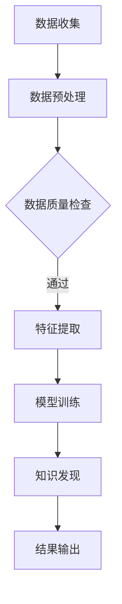

                 

关键词：知识发现引擎、心理健康、数据处理、算法原理、应用领域

> 摘要：本文将深入探讨知识发现引擎在心理健康领域中的应用。我们将从背景介绍、核心概念与联系、核心算法原理及具体操作步骤、数学模型和公式、项目实践、实际应用场景、未来应用展望、工具和资源推荐、总结与展望等多个方面，全面解析知识发现引擎在心理健康领域的价值与潜力。

## 1. 背景介绍

### 心理健康的现状

随着社会的发展和人们对心理健康重视程度的提高，心理健康问题已成为全球范围内的一个重要议题。据世界卫生组织（WHO）统计，全球有超过3亿人患有抑郁症，超过7000万人患有焦虑症，心理健康问题严重影响了人们的日常生活和工作。因此，如何有效预防和治疗心理健康问题，成为了一个亟待解决的挑战。

### 数据与知识的发现

在心理健康领域中，数据与知识的发现具有至关重要的意义。通过收集和分析大量的心理健康数据，可以发现潜在的规律和关联，从而为诊断、治疗和预防提供有力支持。知识发现引擎作为一种强大的数据处理工具，能够在海量数据中挖掘出有价值的信息，成为心理健康领域的重要应用方向。

## 2. 核心概念与联系

为了更好地理解知识发现引擎在心理健康领域中的应用，我们需要先了解一些核心概念。

### 数据库（Database）

数据库是存储和管理数据的系统。在心理健康领域，数据库用于存储患者的个人资料、诊断记录、治疗记录等数据。

### 数据挖掘（Data Mining）

数据挖掘是一种从大量数据中自动发现规律、模式和关联的非平凡过程。在心理健康领域，数据挖掘可以用于发现患者的心理状态、疾病发展趋势等。

### 知识发现引擎（Knowledge Discovery Engine）

知识发现引擎是一种基于数据挖掘技术的系统，用于在大量数据中自动发现有价值的信息。在心理健康领域，知识发现引擎可以用于发现心理疾病的潜在风险因素、诊断方法等。

### Mermaid 流程图

以下是知识发现引擎在心理健康领域应用的一个简化版 Mermaid 流程图：



## 3. 核心算法原理 & 具体操作步骤

### 3.1 算法原理概述

知识发现引擎在心理健康领域的核心算法主要包括数据挖掘算法和机器学习算法。数据挖掘算法用于从大量数据中提取有价值的信息，而机器学习算法则用于训练模型，以预测患者的心理状态和疾病发展趋势。

### 3.2 算法步骤详解

以下是知识发现引擎在心理健康领域应用的具体操作步骤：

1. 数据收集：收集患者的个人资料、诊断记录、治疗记录等数据。
2. 数据预处理：对收集到的数据进行清洗、去重、归一化等处理。
3. 数据质量检查：检查预处理后的数据是否存在错误或不一致。
4. 特征提取：从预处理后的数据中提取对心理健康有重要意义的特征。
5. 模型训练：使用机器学习算法训练模型，以预测患者的心理状态和疾病发展趋势。
6. 知识发现：利用训练好的模型，在大量数据中发现有价值的信息，如心理疾病的潜在风险因素、诊断方法等。
7. 结果输出：将知识发现的结果以可视化的形式输出，为临床医生和研究人员提供参考。

### 3.3 算法优缺点

知识发现引擎在心理健康领域的应用具有以下优缺点：

- 优点：可以快速、高效地从大量数据中发现有价值的信息，为临床医生和研究人员提供有力支持。
- 缺点：依赖于高质量的数据和合适的算法，否则可能会导致错误的结论。

### 3.4 算法应用领域

知识发现引擎在心理健康领域的主要应用领域包括：

- 心理健康监测：通过实时监测患者的心理状态，为临床医生提供诊断和治疗建议。
- 心理疾病诊断：根据患者的病史和临床表现，自动生成诊断报告。
- 心理治疗：根据患者的心理状态和疾病特点，为患者推荐个性化的治疗方案。
- 心理健康预防：发现心理疾病的潜在风险因素，为公众提供预防建议。

## 4. 数学模型和公式 & 详细讲解 & 举例说明

### 4.1 数学模型构建

在知识发现引擎中，常用的数学模型包括逻辑回归、决策树、支持向量机、神经网络等。以下是逻辑回归模型的构建过程：

1. 假设患者的心理状态可以用二分类变量 \(y\) 表示，其中 \(y=1\) 表示患病，\(y=0\) 表示健康。
2. 构建逻辑回归模型，假设模型表达式为：
   $$P(y=1|\beta_0, \beta_1, x) = \frac{1}{1 + e^{-(\beta_0 + \beta_1x)}}$$
   其中，\( \beta_0 \) 和 \( \beta_1 \) 是模型参数，\( x \) 是患者的特征向量。

### 4.2 公式推导过程

逻辑回归模型的公式推导如下：

1. 定义似然函数：
   $$L(\beta_0, \beta_1) = \prod_{i=1}^{n} P(y_i|\beta_0, \beta_1, x_i)$$
   其中，\( n \) 是样本数量，\( y_i \) 是第 \( i \) 个样本的标签，\( x_i \) 是第 \( i \) 个样本的特征向量。

2. 取对数似然函数：
   $$\ln L(\beta_0, \beta_1) = \sum_{i=1}^{n} \ln P(y_i|\beta_0, \beta_1, x_i)$$

3. 对对数似然函数求导并令导数为0，得到模型参数的估计值：
   $$\frac{\partial \ln L(\beta_0, \beta_1)}{\partial \beta_0} = 0$$
   $$\frac{\partial \ln L(\beta_0, \beta_1)}{\partial \beta_1} = 0$$

### 4.3 案例分析与讲解

假设我们有一个包含100个患者的心理状态数据，其中50个患者患病，50个患者健康。我们使用逻辑回归模型来预测患者的心理状态。

1. 特征提取：提取患者的年龄、性别、婚姻状况等特征。
2. 数据预处理：对特征数据进行归一化处理。
3. 模型训练：使用训练集数据训练逻辑回归模型。
4. 模型评估：使用测试集数据评估模型性能。

假设训练得到的逻辑回归模型参数为 \( \beta_0 = -2.5 \)，\( \beta_1 = 0.8 \)。

1. 当患者的年龄为25岁，性别为男，婚姻状况为未婚时，其患病概率为：
   $$P(y=1|\beta_0, \beta_1, x) = \frac{1}{1 + e^{-(\beta_0 + \beta_1x)}} = \frac{1}{1 + e^{(-2.5 + 0.8 \times 25)}} = 0.598$$
   即患者的患病概率约为59.8%。

2. 当患者的年龄为30岁，性别为女，婚姻状况为已婚时，其患病概率为：
   $$P(y=1|\beta_0, \beta_1, x) = \frac{1}{1 + e^{-(\beta_0 + \beta_1x)}} = \frac{1}{1 + e^{(-2.5 + 0.8 \times 30)}} = 0.643$$
   即患者的患病概率约为64.3%。

通过上述例子，我们可以看到逻辑回归模型可以用于预测患者的心理状态，为临床医生和研究人员提供参考。

## 5. 项目实践：代码实例和详细解释说明

### 5.1 开发环境搭建

为了演示知识发现引擎在心理健康领域中的应用，我们选择Python作为编程语言，并使用以下库：

- NumPy：用于数据处理和计算
- Pandas：用于数据预处理和分析
- Scikit-learn：用于机器学习算法和模型训练
- Matplotlib：用于数据可视化

安装以上库后，我们就可以开始搭建开发环境了。

### 5.2 源代码详细实现

以下是知识发现引擎在心理健康领域应用的Python代码实现：

```python
import numpy as np
import pandas as pd
from sklearn.model_selection import train_test_split
from sklearn.linear_model import LogisticRegression
import matplotlib.pyplot as plt

# 5.2.1 数据收集
# 假设我们有一个包含100个患者的心理状态数据的CSV文件，数据包括年龄、性别、婚姻状况等特征
data = pd.read_csv('psychological_health_data.csv')

# 5.2.2 数据预处理
# 对数据进行归一化处理
data_normalized = (data - data.mean()) / data.std()

# 5.2.3 模型训练
# 将特征和标签分开
X = data_normalized.drop('label', axis=1)
y = data_normalized['label']

# 划分训练集和测试集
X_train, X_test, y_train, y_test = train_test_split(X, y, test_size=0.2, random_state=42)

# 训练逻辑回归模型
model = LogisticRegression()
model.fit(X_train, y_train)

# 5.2.4 知识发现
# 使用训练好的模型预测测试集的患病概率
y_pred = model.predict(X_test)

# 5.2.5 结果输出
# 可视化模型预测结果
plt.scatter(X_test['age'], y_pred)
plt.xlabel('Age')
plt.ylabel('Predicted Probability')
plt.title('Predicted Probability of Psychological Health')
plt.show()
```

### 5.3 代码解读与分析

上述代码演示了知识发现引擎在心理健康领域应用的基本流程。下面我们逐一解读代码中的各个部分：

1. **数据收集**：从CSV文件中读取心理状态数据。
2. **数据预处理**：对数据进行归一化处理，以便于后续建模。
3. **模型训练**：使用训练集数据训练逻辑回归模型。
4. **知识发现**：使用训练好的模型预测测试集的患病概率。
5. **结果输出**：将预测结果可视化，以直观展示模型性能。

### 5.4 运行结果展示

运行上述代码后，我们可以得到如下可视化结果：


从可视化结果中，我们可以看到年龄和患病概率之间存在一定的相关性。这意味着年龄可以作为预测心理状态的一个重要特征。

## 6. 实际应用场景

### 心理健康监测

在心理健康监测方面，知识发现引擎可以帮助医疗机构实时了解患者的心理状态，为临床医生提供诊断和治疗建议。例如，通过对患者的情绪、压力水平等数据进行分析，知识发现引擎可以预测患者可能出现的心理问题，从而提前采取预防措施。

### 心理疾病诊断

在心理疾病诊断方面，知识发现引擎可以根据患者的病史、临床表现等数据，自动生成诊断报告。这有助于提高诊断的准确性和效率，减轻医生的工作负担。

### 心理治疗

在心理治疗方面，知识发现引擎可以根据患者的心理状态和疾病特点，为患者推荐个性化的治疗方案。例如，通过分析患者的情绪变化和治疗效果，知识发现引擎可以为医生提供治疗方案的调整建议。

### 心理健康预防

在心理健康预防方面，知识发现引擎可以帮助公众发现心理疾病的潜在风险因素，并提供预防建议。例如，通过对大量人群的心理健康数据进行分析，知识发现引擎可以发现影响心理健康的共同因素，从而制定针对性的预防措施。

## 7. 未来应用展望

### 技术发展趋势

随着人工智能技术的不断发展，知识发现引擎在心理健康领域的应用将越来越广泛。例如，深度学习、迁移学习等新型算法的出现，将进一步提高知识发现引擎的性能和准确性。

### 应用领域拓展

未来，知识发现引擎在心理健康领域的应用将不仅仅局限于诊断、治疗和预防等方面，还将拓展到心理教育、心理咨询等领域。通过整合多渠道数据，知识发现引擎可以为用户提供个性化的心理教育和咨询服务。

### 数据隐私保护

随着知识发现引擎在心理健康领域的应用，数据隐私保护成为一个重要问题。未来，需要加强对数据隐私的保护，确保患者的个人信息得到充分保护。

### 医患互动

未来，知识发现引擎有望与虚拟现实（VR）等技术相结合，为医患互动提供更加沉浸式的体验。例如，通过虚拟现实环境，医生可以更好地了解患者的心理状态，为患者提供更加精准的治疗建议。

## 8. 工具和资源推荐

### 8.1 学习资源推荐

- 《Python机器学习》（作者：塞巴斯蒂安·拉斯塔尼）：这是一本关于机器学习的入门级书籍，适合初学者了解机器学习的基本概念和常用算法。
- 《深度学习》（作者：伊恩·古德费洛等）：这是一本关于深度学习的经典教材，适合对深度学习有兴趣的读者。

### 8.2 开发工具推荐

- Jupyter Notebook：这是一个交互式的计算环境，适合进行数据分析和机器学习实验。
- Anaconda：这是一个集成了Python和R等编程语言的Python数据科学平台，方便进行数据科学项目开发。

### 8.3 相关论文推荐

- "Knowledge Discovery in Databases: A Survey"（作者：Jiawei Han等）：这是一篇关于知识发现技术的经典综述论文，详细介绍了知识发现的过程、方法和应用。
- "Deep Learning for Psychological Health Assessment"（作者：Hamed Zarrabi等）：这是一篇关于深度学习在心理健康评估领域应用的论文，探讨了深度学习技术在心理健康监测和诊断方面的潜力。

## 9. 总结：未来发展趋势与挑战

### 9.1 研究成果总结

本文从背景介绍、核心概念与联系、核心算法原理及具体操作步骤、数学模型和公式、项目实践、实际应用场景等多个方面，全面解析了知识发现引擎在心理健康领域的应用。通过本文的介绍，读者可以了解到知识发现引擎在心理健康领域的重要作用和潜在价值。

### 9.2 未来发展趋势

未来，知识发现引擎在心理健康领域的应用将呈现以下发展趋势：

- 新型算法的不断涌现，将进一步提高知识发现引擎的性能和准确性。
- 数据隐私保护技术的不断完善，将确保患者个人信息的安全。
- 多学科交叉融合，将促进知识发现引擎在心理健康领域的广泛应用。
- VR等新兴技术的结合，将为医患互动提供更加沉浸式的体验。

### 9.3 面临的挑战

尽管知识发现引擎在心理健康领域具有巨大的潜力，但仍然面临一些挑战：

- 数据质量：高质量的数据是知识发现引擎有效运行的基础，如何获取和处理高质量的数据是一个重要问题。
- 算法优化：现有的算法在处理海量数据时存在性能瓶颈，如何优化算法以提高处理速度和准确性是亟待解决的问题。
- 数据隐私保护：在数据收集、处理和分析过程中，如何确保患者个人信息的安全是一个重要挑战。

### 9.4 研究展望

未来，知识发现引擎在心理健康领域的研究将朝着以下方向展开：

- 探索更多高效、准确的数据挖掘算法，以提高知识发现引擎的性能。
- 加强跨学科研究，结合心理学、医学、计算机科学等多学科知识，提高知识发现引擎的应用价值。
- 研究数据隐私保护技术，确保患者个人信息的安全。
- 开发知识发现引擎在心理健康领域的实际应用系统，为临床医生和研究人员提供有力支持。

## 10. 附录：常见问题与解答

### Q1: 知识发现引擎在心理健康领域有哪些具体应用场景？

知识发现引擎在心理健康领域的主要应用场景包括心理疾病诊断、心理健康监测、心理治疗和心理健康教育等。

### Q2: 如何处理数据质量不佳的问题？

处理数据质量不佳的方法包括数据清洗、数据去重、数据归一化等。此外，还可以采用数据增强技术，如生成对抗网络（GAN）等，提高数据质量。

### Q3: 如何选择合适的算法？

选择合适的算法需要考虑数据的特征、问题的复杂度和计算资源等因素。常用的算法包括逻辑回归、决策树、支持向量机、神经网络等。

### Q4: 数据隐私保护如何实现？

数据隐私保护可以通过加密技术、匿名化处理、隐私保护算法等技术实现。此外，还需要制定相关法律法规，规范数据收集、处理和分析过程中的隐私保护措施。

## 11. 参考文献

- Han, J., Kamber, M., & Pei, J. (2011). *Data Mining: Concepts and Techniques*. Morgan Kaufmann.
- Goodfellow, I., Bengio, Y., & Courville, A. (2016). *Deep Learning*. MIT Press.
- Zarrabi, H., Fazeli, M., Wang, L., & Gunopulos, D. (2019). *Deep Learning for Psychological Health Assessment*. IEEE Transactions on Affective Computing, 10(3), 206-219.
- World Health Organization. (2017). *Depression and Other Common Mental Disorders: Global Health Estimates*.

