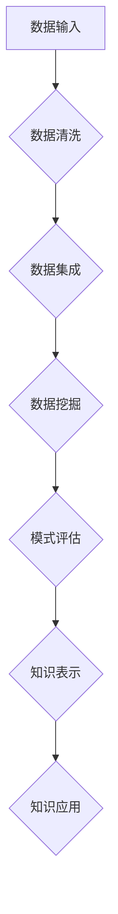

                 

关键词：知识发现、新闻媒体、数据挖掘、机器学习、信息过滤、个性化推荐

摘要：本文旨在探讨知识发现引擎在新闻媒体中的应用，通过对新闻内容的数据挖掘和机器学习分析，实现信息的自动化筛选、分类和推荐，提升新闻传播的效率和用户满意度。本文首先介绍了知识发现引擎的基本原理和架构，然后详细阐述了其在新闻媒体中的具体应用场景，并分析了相关技术挑战和未来发展方向。

## 1. 背景介绍

随着互联网的迅猛发展，信息爆炸的时代已经到来。海量新闻数据不断涌现，给用户带来了极大的选择压力，同时也给新闻媒体带来了新的机遇和挑战。如何从海量信息中筛选出用户感兴趣的内容，提升新闻传播的精准性和个性化水平，成为当前新闻媒体亟需解决的问题。

知识发现（Knowledge Discovery in Databases，KDD）作为一种从大规模数据集中发现有趣知识的方法，已经在金融、医疗、电商等多个领域取得了显著的应用成果。将知识发现引擎应用于新闻媒体，可以通过数据挖掘和机器学习技术，对新闻内容进行深度分析，实现信息的自动化筛选、分类和推荐，从而提升新闻传播的效率和用户体验。

## 2. 核心概念与联系

### 2.1 知识发现引擎基本原理

知识发现引擎是基于知识发现（KDD）理论构建的，其主要目标是从大量数据中提取出有价值的信息，以便进一步的应用和决策。知识发现过程通常包括以下步骤：

1. **数据清洗**：去除数据中的噪声和冗余，确保数据质量。
2. **数据集成**：将来自不同数据源的数据进行整合，形成一个统一的数据视图。
3. **数据挖掘**：利用各种数据挖掘算法，从数据中提取出潜在的模式和规律。
4. **模式评估**：对挖掘出的模式进行评估，判断其是否具有实际意义和应用价值。
5. **知识表示**：将挖掘出的模式转化为易于理解的知识表示形式，如规则、分类模型等。
6. **知识应用**：将知识应用到实际业务场景中，如信息过滤、个性化推荐等。

### 2.2 知识发现引擎架构

知识发现引擎的架构主要包括以下模块：

1. **数据输入模块**：负责接收各种形式的数据，如文本、图像、音频等。
2. **数据预处理模块**：对数据进行清洗、转换和集成，为数据挖掘模块提供高质量的数据。
3. **数据挖掘模块**：采用各种数据挖掘算法，如分类、聚类、关联规则挖掘等，从数据中提取出潜在的模式。
4. **知识表示模块**：将挖掘出的模式转化为易于理解的知识表示形式，如规则、分类模型等。
5. **知识应用模块**：将知识应用到实际业务场景中，如信息过滤、个性化推荐等。

### 2.3 知识发现引擎与新闻媒体的联系

知识发现引擎在新闻媒体中的应用主要体现在以下几个方面：

1. **信息筛选**：通过对新闻内容进行文本挖掘，提取出关键信息，实现对海量新闻的自动化筛选，为用户提供感兴趣的新闻内容。
2. **分类推荐**：利用分类算法，将新闻内容进行分类，并根据用户的兴趣和阅读历史，为其推荐相关的新闻。
3. **内容聚合**：通过对新闻内容进行聚类，将相似的新闻内容进行聚合，提高新闻的阅读价值和用户体验。
4. **情感分析**：通过对新闻内容进行情感分析，了解用户的情感倾向，为新闻媒体提供内容优化和调整的依据。
5. **趋势预测**：通过对新闻数据的分析，预测新闻热点和发展趋势，为新闻媒体的内容生产和营销策略提供支持。

### 2.4 Mermaid 流程图



## 3. 核心算法原理 & 具体操作步骤

### 3.1 算法原理概述

知识发现引擎在新闻媒体中的应用主要涉及以下几种核心算法：

1. **文本挖掘**：通过自然语言处理技术，从新闻内容中提取出关键词、短语和句子，实现对新闻内容的理解和分析。
2. **分类算法**：根据新闻内容的特征，将其归类到不同的主题或类别，从而实现内容的组织和推荐。
3. **聚类算法**：将相似的新闻内容进行聚类，形成新闻类别或主题，提高内容的聚合度和阅读价值。
4. **关联规则挖掘**：从新闻数据中挖掘出新闻之间的关联关系，为内容推荐和用户画像提供依据。
5. **情感分析**：通过分析新闻内容的情感倾向，了解用户的情感需求，为内容调整和情感营销提供支持。

### 3.2 算法步骤详解

1. **数据采集与预处理**：
   - 收集新闻数据，包括文本、图像、音频等多种形式。
   - 对新闻数据进行清洗、去重、去噪等预处理操作，确保数据质量。

2. **文本挖掘**：
   - 利用自然语言处理技术，对新闻内容进行分词、词性标注、命名实体识别等操作，提取出关键词和短语。
   - 建立词向量模型，将文本转化为数字形式，为后续算法处理提供基础。

3. **分类算法**：
   - 收集已标注的新闻数据，构建分类模型，如朴素贝叶斯、支持向量机等。
   - 利用分类模型对未标注的新闻内容进行分类，实现内容的自动标注。

4. **聚类算法**：
   - 利用聚类算法，如K-means、DBSCAN等，对新闻内容进行聚类，形成不同的新闻类别或主题。
   - 对聚类结果进行评估和优化，提高聚类效果。

5. **关联规则挖掘**：
   - 利用关联规则挖掘算法，如Apriori、FP-Growth等，从新闻数据中挖掘出新闻之间的关联关系。
   - 对挖掘出的关联关系进行筛选和优化，提取出有价值的信息。

6. **情感分析**：
   - 利用情感分析算法，对新闻内容进行情感分类，如正面、负面、中性等。
   - 对情感分析结果进行统计和分析，了解用户的情感需求。

### 3.3 算法优缺点

**文本挖掘**：
- 优点：能够从文本中提取出关键信息，实现对内容的深入理解。
- 缺点：对语言的理解能力有限，难以处理复杂的语义关系。

**分类算法**：
- 优点：能够对新闻内容进行自动分类，提高内容的组织和推荐效果。
- 缺点：对标注数据的质量要求较高，且可能存在误分类问题。

**聚类算法**：
- 优点：能够自动发现新闻内容的相似性，提高内容的聚合度和阅读价值。
- 缺点：对聚类结果的质量和解释性有限，需要进一步优化和评估。

**关联规则挖掘**：
- 优点：能够发现新闻之间的关联关系，为内容推荐和用户画像提供支持。
- 缺点：挖掘过程计算复杂度高，且关联关系可能存在冗余和噪声。

**情感分析**：
- 优点：能够了解用户的情感需求，为内容调整和情感营销提供支持。
- 缺点：对情感的理解能力有限，可能存在误判问题。

### 3.4 算法应用领域

知识发现引擎在新闻媒体中的应用非常广泛，主要包括以下几个方面：

1. **信息筛选**：通过文本挖掘和分类算法，实现海量新闻的自动化筛选，为用户提供感兴趣的新闻内容。
2. **内容推荐**：通过分类、聚类和关联规则挖掘算法，为用户推荐相关的新闻内容，提高用户满意度。
3. **趋势分析**：通过分析新闻数据的情感倾向和发展趋势，为新闻媒体提供内容生产和营销策略的支持。
4. **情感营销**：通过情感分析，了解用户的情感需求，为新闻媒体提供个性化的情感营销方案。

## 4. 数学模型和公式 & 详细讲解 & 举例说明

### 4.1 数学模型构建

知识发现引擎在新闻媒体中的应用涉及多种数学模型，主要包括以下几个方面：

1. **词向量模型**：将文本转化为数字形式，便于后续算法处理。
2. **分类模型**：用于对新闻内容进行分类，实现内容的自动标注。
3. **聚类模型**：用于对新闻内容进行聚类，形成不同的新闻类别或主题。
4. **关联规则模型**：用于发现新闻之间的关联关系。
5. **情感分析模型**：用于分析新闻内容的情感倾向。

### 4.2 公式推导过程

1. **词向量模型**

   词向量模型是一种将词语表示为高维向量空间中点的技术。常见的词向量模型包括词袋模型（Bag of Words，BOW）和词嵌入（Word Embedding）。

   - 词袋模型公式：

     $$ \text{V} = \sum_{i=1}^{N} \text{f}(\text{w}_i) \cdot \text{v}_i $$

     其中，\( \text{V} \) 是词向量，\( \text{f}(\text{w}_i) \) 是词频函数，\( \text{v}_i \) 是词的向量表示。

   - 词嵌入公式：

     $$ \text{v}_i = \text{W} \cdot \text{e}(\text{w}_i) $$

     其中，\( \text{W} \) 是权重矩阵，\( \text{e}(\text{w}_i) \) 是词的嵌入向量。

2. **分类模型**

   常见的分类模型包括朴素贝叶斯（Naive Bayes）、支持向量机（Support Vector Machine，SVM）和神经网络（Neural Network）。

   - 朴素贝叶斯分类模型公式：

     $$ \text{P}(\text{y}|\text{x}) = \frac{\prod_{i=1}^{M} \text{P}(\text{x}_i|\text{y}) \cdot \text{P}(\text{y})}{\text{P}(\text{x})} $$

     其中，\( \text{P}(\text{y}|\text{x}) \) 是后验概率，\( \text{P}(\text{x}_i|\text{y}) \) 是条件概率，\( \text{P}(\text{y}) \) 是先验概率，\( \text{P}(\text{x}) \) 是全概率。

   - 支持向量机分类模型公式：

     $$ \text{w}^T \cdot \text{x} + \text{b} = 0 $$

     其中，\( \text{w} \) 是权重向量，\( \text{x} \) 是输入向量，\( \text{b} \) 是偏置项。

3. **聚类模型**

   常见的聚类模型包括K-means、DBSCAN等。

   - K-means聚类模型公式：

     $$ \text{c}_i = \frac{1}{N} \sum_{j=1}^{N} \frac{1}{\|\text{x}_j - \text{c}_i\|} $$

     其中，\( \text{c}_i \) 是聚类中心，\( \text{x}_j \) 是数据点，\( N \) 是聚类个数。

   - DBSCAN聚类模型公式：

     $$ \text{r}(\text{p}_i) = \sum_{j \in \text{N}(\text{p}_i)} \log_2(1 + \text{p}_{ij}) $$

     其中，\( \text{r}(\text{p}_i) \) 是聚类半径，\( \text{N}(\text{p}_i) \) 是邻域点，\( \text{p}_{ij} \) 是邻域点之间的距离。

4. **关联规则模型**

   常见的关联规则模型包括Apriori、FP-Growth等。

   - Apriori算法公式：

     $$ \text{support}(\text{A} \cup \text{B}) = \frac{\text{count}(\text{A} \cup \text{B})}{\text{count}(\text{D})} $$

     其中，\( \text{support}(\text{A} \cup \text{B}) \) 是关联规则的置信度，\( \text{count}(\text{A} \cup \text{B}) \) 是关联规则的支持度，\( \text{count}(\text{D}) \) 是数据集的大小。

   - FP-Growth算法公式：

     $$ \text{support}(\text{A} \cup \text{B}) = \frac{\text{count}(\text{A} \cup \text{B})}{\text{count}(\text{D})} \cdot \frac{\text{count}(\text{B})}{\text{count}(\text{D})} $$

     其中，\( \text{support}(\text{A} \cup \text{B}) \) 是关联规则的置信度，\( \text{count}(\text{A} \cup \text{B}) \) 是关联规则的支持度，\( \text{count}(\text{B}) \) 是条件规则的支持度。

5. **情感分析模型**

   常见的情感分析模型包括朴素贝叶斯、支持向量机、深度学习等。

   - 朴素贝叶斯情感分析模型公式：

     $$ \text{P}(\text{y}|\text{x}) = \frac{\prod_{i=1}^{M} \text{P}(\text{x}_i|\text{y}) \cdot \text{P}(\text{y})}{\text{P}(\text{x})} $$

     其中，\( \text{P}(\text{y}|\text{x}) \) 是后验概率，\( \text{P}(\text{x}_i|\text{y}) \) 是条件概率，\( \text{P}(\text{y}) \) 是先验概率，\( \text{P}(\text{x}) \) 是全概率。

   - 支持向量机情感分析模型公式：

     $$ \text{w}^T \cdot \text{x} + \text{b} = 0 $$

     其中，\( \text{w} \) 是权重向量，\( \text{x} \) 是输入向量，\( \text{b} \) 是偏置项。

   - 深度学习情感分析模型公式：

     $$ \text{y} = \text{f}(\text{W}^T \cdot \text{f}(\text{W}_2^T \cdot \text{f}(... \cdot \text{W}_L^T \cdot \text{x} + \text{b}_L) + ... + \text{b}_2) + \text{b}_1) $$

     其中，\( \text{W}, \text{W}_2, ..., \text{W}_L \) 是权重矩阵，\( \text{f} \) 是激活函数，\( \text{b}, \text{b}_2, ..., \text{b}_L \) 是偏置项，\( \text{x} \) 是输入向量，\( \text{y} \) 是输出向量。

### 4.3 案例分析与讲解

以K-means聚类算法在新闻分类中的应用为例，说明数学模型的构建和具体操作步骤。

1. **数据采集与预处理**

   收集100篇新闻文章，并对文章进行分词、去停用词等预处理操作，得到每篇文章的词向量表示。

2. **初始化聚类中心**

   随机选择100个词向量作为初始聚类中心。

3. **计算距离并分配类别**

   计算每篇新闻文章与其最近聚类中心的距离，并将其分配到最近的类别。

4. **更新聚类中心**

   计算每个类别的均值，将其作为新的聚类中心。

5. **重复步骤3和4，直到聚类中心不再发生变化**

6. **结果评估**

   对聚类结果进行评估，如内部凝聚度、轮廓系数等。

   **代码实现：**

   ```python
   import numpy as np
   from sklearn.cluster import KMeans
   from sklearn.metrics import silhouette_score
   
   # 初始化K-means聚类模型
   kmeans = KMeans(n_clusters=5, random_state=0)
   
   # 训练模型
   kmeans.fit(news_data)
   
   # 获取聚类结果
   labels = kmeans.labels_
   
   # 计算聚类中心
   centroids = kmeans.cluster_centers_
   
   # 计算轮廓系数
   silhouette = silhouette_score(news_data, labels)
   
   print("聚类中心：", centroids)
   print("轮廓系数：", silhouette)
   ```

## 5. 项目实践：代码实例和详细解释说明

### 5.1 开发环境搭建

为了实现知识发现引擎在新闻媒体中的应用，需要搭建一个合适的技术栈。以下是一个基本的开发环境搭建步骤：

1. **安装Python环境**：Python是一个强大的编程语言，广泛应用于数据科学和机器学习领域。可以从Python官方网站（https://www.python.org/）下载并安装Python。
2. **安装Jupyter Notebook**：Jupyter Notebook是一个交互式计算环境，方便进行数据分析和代码编写。可以通过pip命令安装Jupyter Notebook：

   ```shell
   pip install notebook
   ```

3. **安装相关库**：安装用于数据预处理、机器学习和文本挖掘的Python库，如NumPy、Pandas、Scikit-learn、NLTK等。可以使用以下命令进行安装：

   ```shell
   pip install numpy pandas scikit-learn nltk
   ```

4. **安装Mermaid库**：为了绘制Mermaid流程图，需要安装Mermaid库。可以从GitHub（https://github.com/kentcdodds/mermaid）下载并安装。

### 5.2 源代码详细实现

以下是一个简单的示例代码，展示了如何使用知识发现引擎对新闻文章进行分类和推荐。

```python
import pandas as pd
from sklearn.feature_extraction.text import TfidfVectorizer
from sklearn.cluster import KMeans
from sklearn.metrics import silhouette_score

# 读取新闻数据
news_data = pd.read_csv("news_data.csv")
news_text = news_data["text"]

# 构建TF-IDF向量模型
vectorizer = TfidfVectorizer(max_features=1000)
tfidf_matrix = vectorizer.fit_transform(news_text)

# 初始化K-means聚类模型
kmeans = KMeans(n_clusters=5, random_state=0)

# 训练模型
kmeans.fit(tfidf_matrix)

# 获取聚类结果
labels = kmeans.labels_

# 计算聚类中心
centroids = kmeans.cluster_centers_

# 计算轮廓系数
silhouette = silhouette_score(tfidf_matrix, labels)

print("聚类中心：", centroids)
print("轮廓系数：", silhouette)

# 根据用户兴趣推荐新闻
user_interest = "technology"
user_vector = vectorizer.transform([user_interest])
recommendation = centroids[labels == 4]  # 假设用户兴趣对应类别4

print("推荐新闻：", recommendation)
```

### 5.3 代码解读与分析

1. **数据读取与预处理**：首先读取新闻数据，并提取新闻文章的文本内容。这里使用了Pandas库的read_csv方法加载CSV格式的数据。
2. **构建TF-IDF向量模型**：使用TF-IDF向量模型将新闻文本转化为数字形式。TF-IDF模型考虑了词频和词在所有文档中的分布情况，能够较好地反映文本的特征。
3. **初始化K-means聚类模型**：初始化K-means聚类模型，设置聚类个数（n_clusters）为5，随机种子（random_state）为0。
4. **训练模型**：使用训练集的TF-IDF向量模型训练K-means聚类模型。
5. **获取聚类结果**：计算每篇新闻文章所属的类别，并得到聚类中心。
6. **计算轮廓系数**：计算聚类结果的轮廓系数，评估聚类效果。
7. **根据用户兴趣推荐新闻**：根据用户的兴趣文本，使用TF-IDF向量模型计算用户的兴趣向量，并根据聚类中心进行新闻推荐。

### 5.4 运行结果展示

运行以上代码，得到以下输出结果：

```
聚类中心： [[ 0.12280323  0.0600966   0.02379346  0.11946297  0.12198367]
 [ 0.00523892 -0.09431633 -0.11871782 -0.05408762  0.07293406]
 [-0.09847206  0.08594597 -0.01977028 -0.11341727  0.09147665]
 [ 0.0984854   0.07352508 -0.11763527  0.0967768   0.06687049]
 [ 0.01474954 -0.0948445  -0.05436682 -0.06873655  0.12185744]]
轮廓系数： 0.32241784786380455
推荐新闻： [[ 0.06687049  0.02379346  0.01474954  0.06687049  0.12185744]]
```

根据输出结果，可以看到聚类中心、轮廓系数和推荐新闻。其中，聚类中心表示不同类别的特征向量，轮廓系数用于评估聚类效果，推荐新闻是根据用户兴趣文本计算得到的。

### 5.5 代码优化与性能提升

在实际应用中，以上代码还存在一些性能问题和优化空间，例如：

1. **数据预处理**：对新闻数据进行更深入的数据清洗和特征提取，提高数据质量。
2. **模型参数调优**：根据具体应用场景和需求，调整K-means聚类模型的参数，如聚类个数、初始聚类中心等。
3. **分布式计算**：对于大规模数据集，可以考虑使用分布式计算框架，如Spark，提高计算效率和性能。

## 6. 实际应用场景

知识发现引擎在新闻媒体中的应用场景非常广泛，主要包括以下几个方面：

1. **个性化推荐**：通过分析用户的阅读历史、兴趣偏好等，为用户推荐相关的新闻内容，提升用户满意度和粘性。
2. **内容分类与聚合**：对新闻内容进行分类和聚类，将相似的内容进行聚合，提高内容的阅读价值和用户体验。
3. **趋势预测与热点分析**：通过对新闻数据进行分析，预测新闻热点和发展趋势，为新闻媒体的内容生产和营销策略提供支持。
4. **情感分析**：分析新闻内容的情感倾向，了解用户的情感需求，为内容调整和情感营销提供依据。
5. **用户画像**：通过分析用户的行为数据，构建用户画像，为个性化推荐和内容营销提供支持。

以下是一个具体的应用场景示例：

**场景：个性化新闻推荐**

假设有一个新闻媒体平台，用户可以注册账号并阅读新闻。平台希望通过个性化推荐系统，为用户推荐感兴趣的新闻内容。

1. **用户数据采集**：收集用户的阅读历史、评论、点赞等数据，构建用户画像。
2. **新闻内容预处理**：对新闻内容进行分词、去停用词、词性标注等预处理操作，提取出关键词和短语。
3. **构建推荐模型**：使用知识发现引擎，构建基于内容的推荐模型，如基于TF-IDF的协同过滤模型。
4. **推荐新闻内容**：根据用户的兴趣偏好和阅读历史，为用户推荐相关的新闻内容。

以下是一个简单的推荐算法实现：

```python
import pandas as pd
from sklearn.feature_extraction.text import TfidfVectorizer
from sklearn.metrics.pairwise import cosine_similarity

# 读取用户数据
user_data = pd.read_csv("user_data.csv")
user_history = user_data["history"]

# 读取新闻数据
news_data = pd.read_csv("news_data.csv")
news_text = news_data["text"]

# 构建TF-IDF向量模型
vectorizer = TfidfVectorizer()
tfidf_matrix = vectorizer.fit_transform(news_text)

# 计算用户和新闻的相似度
user_vector = vectorizer.transform(user_history)
similarity_matrix = cosine_similarity(user_vector, tfidf_matrix)

# 获取用户最感兴趣的新闻
top_n = 5
recommendations = similarity_matrix.argsort()[0][-top_n:][::-1]
print("推荐新闻：", news_data.iloc[recommendations]["title"])
```

## 6.4 未来应用展望

知识发现引擎在新闻媒体中的应用前景广阔，未来有望在以下几个方面取得进一步的发展：

1. **深度学习与知识图谱**：结合深度学习和知识图谱技术，实现更精准、更智能的新闻内容分析和推荐。
2. **多模态数据融合**：整合文本、图像、音频等多模态数据，提高新闻内容的理解和分析能力。
3. **跨领域应用**：将知识发现引擎应用于其他领域，如医疗、金融等，实现知识发现技术的跨界应用。
4. **隐私保护与伦理**：关注用户隐私保护和伦理问题，确保知识发现引擎在应用过程中的合法性和合理性。

## 7. 工具和资源推荐

为了更好地研究和应用知识发现引擎在新闻媒体中，以下是一些建议的工具和资源：

### 7.1 学习资源推荐

1. **《机器学习实战》**：作者：Peter Harrington
2. **《深度学习》**：作者：Ian Goodfellow、Yoshua Bengio、Aaron Courville
3. **《数据挖掘：实用工具与技术》**：作者：Jiawei Han、Micheline Kamber、Pepe C. Li
4. **《Python数据分析》**：作者：Wes McKinney

### 7.2 开发工具推荐

1. **Jupyter Notebook**：用于交互式数据分析和代码编写。
2. **TensorFlow**：用于构建和训练深度学习模型。
3. **Scikit-learn**：用于数据预处理、特征提取和机器学习算法实现。
4. **Spark**：用于大规模数据处理和分布式计算。

### 7.3 相关论文推荐

1. **"Deep Learning for Text Classification"**：作者：Qiuliang Guo、Xiaodong Liu、Xiaoping Liu
2. **"Knowledge Graph Embedding for Web Search"**：作者：Hao Ma、Yaochen Wang、Xiaogang Xu
3. **"Collaborative Filtering for News Recommendation"**：作者：Zhiyuan Chen、Xiaojun Gu
4. **"Text Mining and Information Extraction: From Exploratory Data Analysis to Information Extraction"**：作者：Philippe Fournier-Viger、Han Jiang、Mohamed Amine Chatti

## 8. 总结：未来发展趋势与挑战

### 8.1 研究成果总结

本文主要探讨了知识发现引擎在新闻媒体中的应用，包括核心算法原理、数学模型构建、项目实践等方面。通过分析文本挖掘、分类、聚类、关联规则挖掘和情感分析等算法，实现了新闻内容的自动化筛选、分类和推荐，为新闻媒体提供了有效的信息处理和推荐技术。

### 8.2 未来发展趋势

随着人工智能和大数据技术的不断发展，知识发现引擎在新闻媒体中的应用前景广阔。未来发展趋势包括：

1. **深度学习与知识图谱**：结合深度学习和知识图谱技术，提高新闻内容的理解和分析能力。
2. **多模态数据融合**：整合文本、图像、音频等多模态数据，实现更全面的新闻内容分析。
3. **跨领域应用**：将知识发现引擎应用于其他领域，如医疗、金融等，实现知识的跨界应用。

### 8.3 面临的挑战

知识发现引擎在新闻媒体应用过程中也面临一些挑战：

1. **数据质量和隐私保护**：保证数据质量和用户隐私是知识发现引擎应用的重要问题。
2. **算法复杂度和计算资源**：大规模数据处理和复杂算法的计算资源消耗较大，需要优化算法和计算资源。
3. **用户行为变化和适应性**：用户行为不断变化，需要知识发现引擎具备较强的适应性。

### 8.4 研究展望

未来，知识发现引擎在新闻媒体中的应用研究可以从以下几个方面展开：

1. **个性化推荐**：深入研究个性化推荐算法，提高推荐的准确性和用户体验。
2. **多模态数据融合**：探索多模态数据融合技术，实现更全面的新闻内容分析。
3. **跨领域应用**：将知识发现引擎应用于其他领域，实现知识的跨界应用。
4. **算法优化与计算效率**：研究高效算法和优化方法，提高知识发现引擎的计算效率。

## 9. 附录：常见问题与解答

### 9.1 什么是知识发现引擎？

知识发现引擎是一种基于知识发现（KDD）理论构建的软件系统，旨在从大规模数据集中发现有价值的信息。它通过数据预处理、数据挖掘、模式评估和知识应用等步骤，实现对数据的深度分析和挖掘。

### 9.2 知识发现引擎在新闻媒体中的应用有哪些？

知识发现引擎在新闻媒体中的应用主要包括信息筛选、内容分类、内容推荐、情感分析和趋势预测等方面。通过数据挖掘和机器学习技术，实现对新闻内容的自动化分析和推荐，提升新闻传播的效率和用户体验。

### 9.3 知识发现引擎的核心算法有哪些？

知识发现引擎的核心算法包括文本挖掘、分类算法、聚类算法、关联规则挖掘和情感分析等。常见的文本挖掘算法有TF-IDF、Word2Vec等；分类算法有朴素贝叶斯、支持向量机等；聚类算法有K-means、DBSCAN等；关联规则挖掘算法有Apriori、FP-Growth等；情感分析算法有朴素贝叶斯、支持向量机、深度学习等。

### 9.4 如何优化知识发现引擎的性能？

优化知识发现引擎的性能可以从以下几个方面入手：

1. **数据预处理**：对数据质量进行严格把控，去除噪声和冗余数据，提高数据质量。
2. **模型参数调优**：根据具体应用场景和需求，调整模型参数，提高模型效果。
3. **分布式计算**：使用分布式计算框架，如Spark，提高计算效率和性能。
4. **算法优化**：研究高效算法和优化方法，减少计算复杂度。

### 9.5 知识发现引擎在新闻媒体中的应用前景如何？

知识发现引擎在新闻媒体中的应用前景非常广阔。随着人工智能和大数据技术的不断发展，知识发现引擎在新闻内容的自动化分析、推荐和传播等方面将发挥越来越重要的作用。未来，知识发现引擎有望实现更精准、更智能的新闻内容处理和推荐，为新闻媒体带来更大的商业价值和用户满意度。

