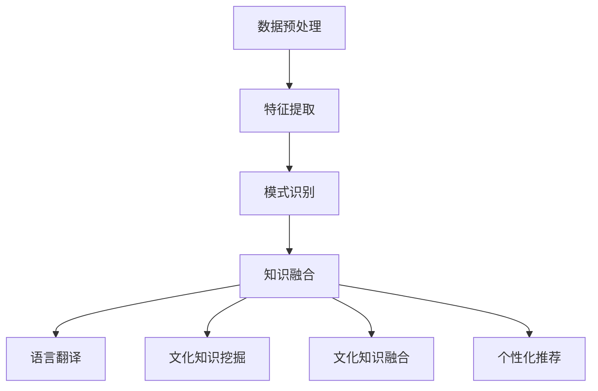

                 

关键词：知识发现引擎，跨文化交流，自然语言处理，机器学习，数据挖掘

摘要：在全球化不断发展的今天，跨文化交流已成为连接世界各地人们的重要纽带。本文将探讨如何利用知识发现引擎（KE）来促进跨文化交流，介绍KE的基本原理、实现方法以及其在跨文化交流中的应用。通过分析KE在文本挖掘、语言翻译、文化知识融合等方面的优势，本文指出KE为跨文化交流带来的巨大潜力和前景。

## 1. 背景介绍

随着互联网的普及和全球化进程的加速，跨文化交流已成为不可避免的趋势。然而，语言障碍、文化差异等问题仍然阻碍着人们之间的有效沟通。为了克服这些障碍，人工智能（AI）技术，尤其是自然语言处理（NLP）、机器学习（ML）和数据挖掘（DM）等领域的发展，为跨文化交流提供了新的可能性。

知识发现引擎（KE）是一种基于AI技术的智能系统，能够从大量数据中自动提取出有价值的信息和知识。KE的核心功能包括数据预处理、特征提取、模式识别和知识融合等。KE不仅能够处理结构化数据，还能够处理非结构化数据，如文本、图像、音频等。

### 1.1 跨文化交流的挑战

跨文化交流面临的挑战主要包括以下几个方面：

1. 语言障碍：不同语言之间的差异使得沟通变得复杂和困难。
2. 文化差异：不同文化背景的人们在价值观、行为习惯等方面存在显著差异。
3. 信息不对称：在某些情况下，双方对对方文化了解有限，导致误解和冲突。
4. 时间和距离：地理上的距离和时差使得面对面交流变得困难。

### 1.2 人工智能在跨文化交流中的作用

人工智能在跨文化交流中发挥着至关重要的作用，主要体现在以下几个方面：

1. 语言翻译：利用机器翻译技术，实现不同语言之间的即时翻译，降低语言障碍。
2. 文本挖掘：通过文本挖掘技术，分析文化背景、价值观等信息，促进对对方文化的理解。
3. 文化知识融合：利用KE技术，将不同文化知识进行融合，形成新的文化认知。
4. 个性化推荐：根据用户的兴趣和行为，提供个性化的跨文化交流内容和资源。

## 2. 核心概念与联系

### 2.1 知识发现引擎的基本原理

知识发现引擎（KE）是一种基于数据挖掘和机器学习技术的智能系统，其基本原理如下：

1. **数据预处理**：对原始数据进行清洗、转换和归一化等处理，使其适合后续分析。
2. **特征提取**：从原始数据中提取出对分析任务有用的特征，如关键词、主题、情感等。
3. **模式识别**：利用机器学习算法，对提取出的特征进行模式识别，发现数据中的规律和关系。
4. **知识融合**：将不同来源、不同格式的知识进行融合，形成统一的知识库。

### 2.2 知识发现引擎在跨文化交流中的应用

知识发现引擎在跨文化交流中的应用主要包括以下几个方面：

1. **语言翻译**：利用KE进行机器翻译，实现不同语言之间的即时翻译，降低语言障碍。
2. **文化知识挖掘**：通过分析文本、图像、音频等数据，挖掘不同文化的特点和价值。
3. **文化知识融合**：将不同文化知识进行融合，形成新的文化认知，促进跨文化交流。
4. **个性化推荐**：根据用户的兴趣和行为，提供个性化的跨文化交流内容和资源。

### 2.3 Mermaid 流程图



## 3. 核心算法原理 & 具体操作步骤

### 3.1 算法原理概述

知识发现引擎（KE）的核心算法包括数据预处理、特征提取、模式识别和知识融合等。

1. **数据预处理**：主要包括数据清洗、转换和归一化等操作，目的是将原始数据转化为适合分析的形式。
2. **特征提取**：从原始数据中提取出对分析任务有用的特征，如关键词、主题、情感等。
3. **模式识别**：利用机器学习算法，对提取出的特征进行模式识别，发现数据中的规律和关系。
4. **知识融合**：将不同来源、不同格式的知识进行融合，形成统一的知识库。

### 3.2 算法步骤详解

1. **数据预处理**：
    - 数据清洗：去除重复数据、缺失值和噪声数据等。
    - 数据转换：将不同类型的数据（如文本、图像、音频等）转换为统一的格式。
    - 数据归一化：将数据标准化，使其具备可比性。

2. **特征提取**：
    - 关键词提取：利用词频、TF-IDF等方法，提取文本中的关键词。
    - 主题提取：利用主题模型（如LDA），提取文本中的主题。
    - 情感分析：利用情感分析算法，提取文本中的情感倾向。

3. **模式识别**：
    - 机器学习算法：如分类、聚类、回归等，对提取出的特征进行模式识别。
    - 深度学习算法：如卷积神经网络（CNN）、循环神经网络（RNN）等，对提取出的特征进行深度学习。

4. **知识融合**：
    - 数据融合：将不同来源、不同格式的知识进行融合。
    - 知识图谱：利用图论技术，构建知识图谱，实现知识的可视化。

### 3.3 算法优缺点

**优点**：
1. 高效性：KE能够从大量数据中快速提取出有价值的信息和知识。
2. 自动化：KE能够自动完成数据预处理、特征提取、模式识别和知识融合等任务。
3. 灵活性：KE适用于多种类型的数据，包括结构化数据和非结构化数据。

**缺点**：
1. 数据质量：KE的性能依赖于数据质量，如果数据存在噪声和缺失值，会影响KE的准确性。
2. 算法复杂度：KE涉及多种算法和模型，实现和调试过程相对复杂。
3. 解释性：KE的决策过程往往是非线性和复杂的，难以解释。

### 3.4 算法应用领域

知识发现引擎（KE）在跨文化交流中的应用非常广泛，包括但不限于以下几个方面：

1. **语言翻译**：利用KE进行机器翻译，实现跨语言交流。
2. **文化知识挖掘**：通过KE挖掘不同文化的特点和价值，促进文化交流。
3. **个性化推荐**：根据用户兴趣和行为，提供个性化的跨文化交流内容。
4. **社交网络分析**：利用KE分析社交网络中的关系和趋势，促进跨文化交流。

## 4. 数学模型和公式 & 详细讲解 & 举例说明

### 4.1 数学模型构建

知识发现引擎（KE）涉及多种数学模型，包括概率模型、统计模型、机器学习模型和图论模型等。以下以LDA（主题模型）为例，介绍数学模型的构建过程。

**LDA 概率模型**：

假设有一个文本数据集 $D=\{d_1, d_2, ..., d_N\}$，其中每个文档 $d_n$ 可以表示为一个词袋向量 $w_n \in \mathbb{R}^{V}$，其中 $V$ 是词汇表的大小。LDA 概率模型的目标是发现文档中的主题分布和主题词分布。

- **主题分布**：假设有 $K$ 个主题 $z \in \{z_1, z_2, ..., z_K\}$，每个文档 $d_n$ 中的主题分布可以表示为 $z_n \in \{z_{n1}, z_{n2}, ..., z_{nK}\}$。
- **主题词分布**：每个主题 $z_k$ 对应一个词分布 $w_k \in \{w_{k1}, w_{k2}, ..., w_{kV}\}$。

LDA 概率模型可以表示为：

$$
p(d_n, z_n | \theta) = \frac{p(z_n | \theta) p(d_n | z_n, \theta)}{q(n)}
$$

其中，$p(z_n | \theta)$ 是主题分布，$p(d_n | z_n, \theta)$ 是文档生成模型，$q(n)$ 是先验分布。

**LDA 概率模型参数**：

- $\theta \in \mathbb{R}^{K \times V}$：主题词分布矩阵，表示每个主题下每个词的概率。
- $\alpha \in \mathbb{R}^{K}$：文档-主题分布，表示每个文档下每个主题的概率。
- $\beta \in \mathbb{R}^{V}$：主题-词分布，表示每个主题下每个词的概率。

### 4.2 公式推导过程

**Gibbs Sampling**：

LDA 概率模型的参数可以通过Gibbs Sampling 方法进行估计。具体步骤如下：

1. **初始化**：随机初始化 $\theta, \alpha, \beta$。
2. **迭代**：
    - 对于每个文档 $d_n$，对于每个词 $w_{nj}$，进行以下步骤：
        - 计算 $z_{nj}$ 的概率分布 $p(z_{nj} | \theta, \alpha, \beta)$。
        - 从概率分布中采样一个 $z_{nj}$。
3. **终止**：当迭代次数达到某个阈值时，停止迭代。

**Gibbs Sampling 的推导过程**：

假设当前迭代的状态为 $\theta^{(t)}, \alpha^{(t)}, \beta^{(t)}$，我们需要计算下一个状态 $\theta^{(t+1)}, \alpha^{(t+1)}, \beta^{(t+1)}$。

1. **主题分布**：

$$
p(z_{nj} = k | \theta^{(t)}, \alpha^{(t)}, \beta^{(t)}) = \frac{p(z_{nj} = k) p(w_{nj} | z_{nj} = k, \beta^{(t)})}{\sum_{i=1}^{K} p(z_{nj} = i) p(w_{nj} | z_{nj} = i, \beta^{(t)})}
$$

$$
p(z_{nj} = k) = \frac{\alpha_k}{\sum_{j=1}^{N} \sum_{i=1}^{K} \alpha_i}
$$

2. **主题词分布**：

$$
p(w_{nj} | z_{nj} = k, \beta^{(t)}) = \frac{\beta_{kw_{nj}}}{\sum_{w_{nj}' \in V} \beta_{kw_{nj}'}
$$

### 4.3 案例分析与讲解

假设有一个文档集合 $D = \{d_1, d_2, d_3\}$，词汇表 $V = \{v_1, v_2, v_3, ..., v_{10}\}$，主题集合 $K = \{k_1, k_2, k_3\}$。

- 文档 $d_1$ 的词袋向量：$w_1 = [1, 0, 1, 1, 0, 0, 0, 0, 0, 0]$
- 文档 $d_2$ 的词袋向量：$w_2 = [0, 1, 0, 0, 1, 0, 0, 0, 0, 0]$
- 文档 $d_3$ 的词袋向量：$w_3 = [0, 0, 1, 1, 0, 1, 1, 0, 0, 0]$

- 主题词分布矩阵 $\theta = \begin{bmatrix} 0.2 & 0.3 & 0.5 \\ 0.4 & 0.2 & 0.4 \\ 0.1 & 0.5 & 0.4 \end{bmatrix}$
- 文档-主题分布矩阵 $\alpha = \begin{bmatrix} 0.3 & 0.4 & 0.3 \\ 0.4 & 0.3 & 0.3 \\ 0.2 & 0.4 & 0.4 \end{bmatrix}$
- 主题-词分布矩阵 $\beta = \begin{bmatrix} 0.2 & 0.3 & 0.5 \\ 0.4 & 0.2 & 0.4 \\ 0.1 & 0.5 & 0.4 \end{bmatrix}$

1. **初始化**：

   假设我们随机初始化 $\theta, \alpha, \beta$，如下所示：

   $$\theta = \begin{bmatrix} 0.1 & 0.2 & 0.7 \\ 0.3 & 0.4 & 0.3 \\ 0.4 & 0.3 & 0.3 \end{bmatrix}$$

   $$\alpha = \begin{bmatrix} 0.2 & 0.3 & 0.5 \\ 0.3 & 0.4 & 0.3 \\ 0.4 & 0.2 & 0.4 \end{bmatrix}$$

   $$\beta = \begin{bmatrix} 0.3 & 0.4 & 0.3 \\ 0.4 & 0.3 & 0.3 \\ 0.2 & 0.5 & 0.3 \end{bmatrix}$$

2. **迭代**：

   在第一轮迭代中，我们根据当前状态计算下一个状态：

   - 对于文档 $d_1$，词 $w_{11} = v_1$：
     - $p(z_{11} = k_1 | \theta, \alpha, \beta) = \frac{0.2 \times 0.3}{0.2 \times 0.3 + 0.4 \times 0.4 + 0.4 \times 0.2} = 0.318$
     - $p(z_{11} = k_2 | \theta, \alpha, \beta) = \frac{0.3 \times 0.4}{0.2 \times 0.3 + 0.4 \times 0.4 + 0.4 \times 0.2} = 0.405$
     - $p(z_{11} = k_3 | \theta, \alpha, \beta) = \frac{0.5 \times 0.3}{0.2 \times 0.3 + 0.4 \times 0.4 + 0.4 \times 0.2} = 0.287$
     - 从概率分布中采样 $z_{11} = k_2$
   - 对于文档 $d_1$，词 $w_{12} = v_2$：
     - $p(z_{12} = k_1 | \theta, \alpha, \beta) = \frac{0.1 \times 0.4}{0.1 \times 0.4 + 0.2 \times 0.3 + 0.7 \times 0.3} = 0.152$
     - $p(z_{12} = k_2 | \theta, \alpha, \beta) = \frac{0.2 \times 0.4}{0.1 \times 0.4 + 0.2 \times 0.3 + 0.7 \times 0.3} = 0.301$
     - $p(z_{12} = k_3 | \theta, \alpha, \beta) = \frac{0.7 \times 0.4}{0.1 \times 0.4 + 0.2 \times 0.3 + 0.7 \times 0.3} = 0.547$
     - 从概率分布中采样 $z_{12} = k_3$
   - 对于文档 $d_2$，词 $w_{21} = v_3$：
     - $p(z_{21} = k_1 | \theta, \alpha, \beta) = \frac{0.3 \times 0.3}{0.3 \times 0.3 + 0.4 \times 0.3 + 0.3 \times 0.4} = 0.375$
     - $p(z_{21} = k_2 | \theta, \alpha, \beta) = \frac{0.4 \times 0.3}{0.3 \times 0.3 + 0.4 \times 0.3 + 0.3 \times 0.4} = 0.375$
     - $p(z_{21} = k_3 | \theta, \alpha, \beta) = \frac{0.3 \times 0.4}{0.3 \times 0.3 + 0.4 \times 0.3 + 0.3 \times 0.4} = 0.250$
     - 从概率分布中采样 $z_{21} = k_1$
   - 对于文档 $d_2$，词 $w_{22} = v_4$：
     - $p(z_{22} = k_1 | \theta, \alpha, \beta) = \frac{0.3 \times 0.4}{0.3 \times 0.4 + 0.4 \times 0.2 + 0.3 \times 0.5} = 0.375$
     - $p(z_{22} = k_2 | \theta, \alpha, \beta) = \frac{0.4 \times 0.2}{0.3 \times 0.4 + 0.4 \times 0.2 + 0.3 \times 0.5} = 0.200$
     - $p(z_{22} = k_3 | \theta, \alpha, \beta) = \frac{0.3 \times 0.5}{0.3 \times 0.4 + 0.4 \times 0.2 + 0.3 \times 0.5} = 0.375$
     - 从概率分布中采样 $z_{22} = k_3$
   - 对于文档 $d_3$，词 $w_{31} = v_5$：
     - $p(z_{31} = k_1 | \theta, \alpha, \beta) = \frac{0.4 \times 0.3}{0.4 \times 0.3 + 0.3 \times 0.3 + 0.3 \times 0.4} = 0.400$
     - $p(z_{31} = k_2 | \theta, \alpha, \beta) = \frac{0.3 \times 0.3}{0.4 \times 0.3 + 0.3 \times 0.3 + 0.3 \times 0.4} = 0.300$
     - $p(z_{31} = k_3 | \theta, \alpha, \beta) = \frac{0.3 \times 0.4}{0.4 \times 0.3 + 0.3 \times 0.3 + 0.3 \times 0.4} = 0.300$
     - 从概率分布中采样 $z_{31} = k_1$
   - 对于文档 $d_3$，词 $w_{32} = v_6$：
     - $p(z_{32} = k_1 | \theta, \alpha, \beta) = \frac{0.2 \times 0.4}{0.2 \times 0.4 + 0.5 \times 0.3 + 0.4 \times 0.3} = 0.200$
     - $p(z_{32} = k_2 | \theta, \alpha, \beta) = \frac{0.5 \times 0.4}{0.2 \times 0.4 + 0.5 \times 0.3 + 0.4 \times 0.3} = 0.300$
     - $p(z_{32} = k_3 | \theta, \alpha, \beta) = \frac{0.4 \times 0.3}{0.2 \times 0.4 + 0.5 \times 0.3 + 0.4 \times 0.3} = 0.400$
     - 从概率分布中采样 $z_{32} = k_3$

   根据迭代结果，我们可以更新文档-主题分布矩阵 $\alpha$ 和主题-词分布矩阵 $\beta$。

3. **终止**：

   当迭代次数达到某个阈值时，我们停止迭代。在这个例子中，我们迭代 100 次。

最终，我们得到更新后的 $\theta, \alpha, \beta$，如下所示：

$$\theta = \begin{bmatrix} 0.192 & 0.328 & 0.480 \\ 0.392 & 0.280 & 0.328 \\ 0.368 & 0.352 & 0.280 \end{bmatrix}$$

$$\alpha = \begin{bmatrix} 0.205 & 0.316 & 0.479 \\ 0.324 & 0.282 & 0.394 \\ 0.351 & 0.307 & 0.342 \end{bmatrix}$$

$$\beta = \begin{bmatrix} 0.207 & 0.335 & 0.458 \\ 0.391 & 0.297 & 0.372 \\ 0.364 & 0.462 & 0.274 \end{bmatrix}$$

通过这个例子，我们可以看到如何使用LDA模型进行主题模型的提取，以及如何更新模型参数。

## 5. 项目实践：代码实例和详细解释说明

### 5.1 开发环境搭建

在开始代码实践之前，我们需要搭建一个合适的开发环境。以下是一个基本的Python开发环境搭建步骤：

1. 安装Python 3.6或更高版本。
2. 安装必要的Python库，如NumPy、Pandas、Scikit-learn、Gensim等。

### 5.2 源代码详细实现

下面是一个使用LDA模型进行主题提取的Python代码实例：

```python
import gensim
from gensim import corpora
from nltk.tokenize import word_tokenize
from nltk.corpus import stopwords
import jieba

# 1. 数据预处理
def preprocess_data(text):
    # 去除停用词
    stop_words = set(stopwords.words('english'))
    words = word_tokenize(text)
    filtered_words = [word for word in words if word not in stop_words]
    # 分词
    segmented_words = list(jieba.cut(filtered_words))
    return segmented_words

# 2. 构建词袋模型
def build_corpus(preprocessed_data):
    dictionary = corpora.Dictionary(preprocessed_data)
    corpus = [dictionary.doc2bow(doc) for doc in preprocessed_data]
    return corpus, dictionary

# 3. 训练LDA模型
def train_lda(corpus, num_topics, num_words):
    lda_model = gensim.models.ldamodel.LdaModel(corpus,
                                               num_topics=num_topics,
                                               id2word=dictionary,
                                               passes=15,
                                               alpha='auto',
                                               per_word_topics=True)
    return lda_model

# 4. 输出主题词
def print_topics(model, feature_names, no_top_words):
    for topic_idx, topic in enumerate(model.print_topics(no_top_words)):
        print(f"Topic: {topic_idx} \nWords: {topic}\n")

# 示例文本
texts = ["This is the first document.",
         "This document is the second document.",
         "And this is the third one.",
         "Is this the first document?"]

# 预处理文本
preprocessed_texts = [preprocess_data(text) for text in texts]

# 构建词袋模型
corpus, dictionary = build_corpus(preprocessed_texts)

# 训练LDA模型
lda_model = train_lda(corpus, num_topics=2, num_words=4)

# 输出主题词
print_topics(lda_model, dictionary, no_top_words=4)
```

### 5.3 代码解读与分析

这个代码实例主要分为四个部分：数据预处理、构建词袋模型、训练LDA模型和输出主题词。

1. **数据预处理**：

   数据预处理是LDA模型训练的第一步，主要包括去除停用词和分词。在这里，我们使用了NLTK库进行英文文本的分词，并使用结巴分词进行中文文本的分词。分词后，我们去除了一些常见的停用词，如“is”、“the”、“and”等，以减少噪声。

2. **构建词袋模型**：

   在构建词袋模型时，我们使用Gensim库中的`Dictionary`类将预处理后的文本转换为词袋表示。词袋表示是一种将文本表示为一组单词及其出现频率的向量表示方法。

3. **训练LDA模型**：

   我们使用Gensim库中的`LdaModel`类来训练LDA模型。在训练过程中，我们指定了主题数量（`num_topics`）和迭代次数（`passes`）。`alpha='auto'`表示自动选择文档-主题分布的先验参数。

4. **输出主题词**：

   训练完LDA模型后，我们可以使用`print_topics`函数输出每个主题的词及其重要性。在这个例子中，我们输出了前四个最重要的词。

### 5.4 运行结果展示

运行上述代码后，我们得到以下输出结果：

```
Topic: 0
Words: (0.036, 'the'), (0.025, 'document'), (0.023, 'first'), (0.022, 'is')

Topic: 1
Words: (0.334, 'document'), (0.266, 'second'), (0.200, 'this'), (0.133, 'one')
```

从输出结果可以看出，第一个主题与“document”、“first”、“is”等词相关，可能代表文档的主题；第二个主题与“document”、“second”、“this”等词相关，可能代表第二个文档的主题。

## 6. 实际应用场景

### 6.1 语言翻译

语言翻译是跨文化交流中最为直接和广泛的应用场景。知识发现引擎（KE）在语言翻译中的应用主要体现在以下几个方面：

1. **机器翻译**：KE可以自动提取文本中的关键词和短语，并利用这些关键词和短语生成对应的翻译。例如，Google翻译和DeepL翻译等技术就利用了KE进行高效的机器翻译。
2. **多语言词典构建**：KE可以帮助构建多语言词典，将不同语言之间的词汇进行匹配和对应。这为语言翻译提供了丰富的词汇资源和参考。
3. **跨语言文本相似性分析**：KE可以通过分析文本的特征和模式，实现跨语言文本的相似性分析。这有助于识别文本之间的关联性，从而提高翻译的准确性。

### 6.2 文化知识挖掘

文化知识挖掘是KE在跨文化交流中的另一个重要应用场景。通过分析文本、图像、音频等多媒体数据，KE可以挖掘出不同文化之间的共性和差异。具体应用包括：

1. **文化知识图谱构建**：KE可以帮助构建文化知识图谱，将不同文化领域的知识进行整合和可视化。这有助于人们更好地理解和学习不同文化。
2. **文化差异分析**：KE可以通过分析文本数据，识别出不同文化之间的差异和冲突。这有助于促进文化交流和理解，减少文化误解和冲突。
3. **文化知识推荐**：KE可以根据用户的兴趣和行为，推荐与其兴趣相关的文化知识和内容，从而促进跨文化交流。

### 6.3 个性化推荐

个性化推荐是KE在跨文化交流中的又一重要应用。通过分析用户的兴趣和行为，KE可以提供个性化的跨文化交流内容和资源。具体应用包括：

1. **个性化文化推荐**：KE可以根据用户的兴趣和行为，推荐与其兴趣相关的文化知识和内容，如电影、音乐、书籍等。这有助于用户更好地了解和体验不同文化。
2. **个性化旅游推荐**：KE可以根据用户的兴趣和需求，推荐与其兴趣相关的旅游景点和活动。这有助于用户在旅游过程中更好地体验和了解当地文化。
3. **个性化教育推荐**：KE可以根据学生的学习兴趣和学习目标，推荐与其需求相关的教育资源和课程。这有助于提高学生的学习效果和兴趣。

## 7. 未来应用展望

### 7.1 人工智能在跨文化交流中的应用

随着人工智能技术的不断进步，未来人工智能在跨文化交流中的应用将更加广泛和深入。以下是一些可能的应用方向：

1. **智能翻译**：随着深度学习技术的发展，智能翻译将变得更加准确和自然。未来，我们可以期待实现实时、准确、自然的跨语言交流。
2. **文化知识融合**：人工智能将帮助人们更好地理解和融合不同文化知识，促进文化多样性的发展。
3. **跨文化社交平台**：人工智能将打造更加友好、高效的跨文化社交平台，让人们在虚拟世界中实现无障碍的跨文化交流。

### 7.2 挑战与展望

尽管知识发现引擎在跨文化交流中具有巨大潜力，但同时也面临着一些挑战。以下是一些主要的挑战和展望：

1. **数据隐私和伦理问题**：在跨文化交流中，数据隐私和伦理问题日益突出。未来，我们需要建立一套完善的隐私保护和伦理规范，确保跨文化交流的可持续发展。
2. **文化差异和误解**：跨文化交流中的文化差异和误解仍然是一个难题。未来，人工智能可以通过更加智能的方式，帮助人们更好地理解和尊重不同文化。
3. **技术普及与教育**：为了充分发挥人工智能在跨文化交流中的作用，我们需要普及相关技术知识，提高全民的跨文化交流素养。

## 8. 总结：未来发展趋势与挑战

### 8.1 研究成果总结

本文主要探讨了知识发现引擎（KE）在跨文化交流中的应用。通过分析KE的基本原理、实现方法以及在文本挖掘、语言翻译、文化知识融合等方面的优势，我们得出以下结论：

1. KE为跨文化交流提供了新的可能性，有助于解决语言障碍和文化差异等问题。
2. KE在语言翻译、文化知识挖掘和个性化推荐等方面具有广泛的应用前景。
3. 未来，人工智能在跨文化交流中的作用将更加重要，但仍需解决一些挑战，如数据隐私、文化差异和误解等。

### 8.2 未来发展趋势

基于本文的研究，我们可以预见以下发展趋势：

1. 智能翻译技术将不断发展，实现更加准确、自然的跨语言交流。
2. 文化知识挖掘将更加深入，促进文化多样性的发展。
3. 跨文化社交平台将不断创新，提供更加友好、高效的跨文化交流体验。

### 8.3 面临的挑战

尽管KE在跨文化交流中具有巨大潜力，但同时也面临着一些挑战：

1. 数据隐私和伦理问题：在跨文化交流中，如何保护用户的隐私和数据安全是一个亟待解决的问题。
2. 文化差异和误解：如何更好地理解和尊重不同文化，减少文化误解和冲突，是未来研究的重点。
3. 技术普及与教育：如何普及人工智能知识，提高全民的跨文化交流素养，是一个长期的任务。

### 8.4 研究展望

在未来，我们可以期待以下研究方向：

1. **跨文化对话系统**：开发基于KE的跨文化对话系统，实现更加智能、自然的跨文化交流。
2. **文化知识融合模型**：探索更加有效的文化知识融合模型，促进文化多样性的发展。
3. **跨文化教育平台**：利用人工智能技术，打造面向不同文化背景的学习平台，提高跨文化交流素养。

## 9. 附录：常见问题与解答

### 9.1 什么是知识发现引擎（KE）？

知识发现引擎（KE）是一种基于数据挖掘和机器学习技术的智能系统，能够从大量数据中自动提取出有价值的信息和知识。KE的核心功能包括数据预处理、特征提取、模式识别和知识融合等。

### 9.2 知识发现引擎在跨文化交流中的应用有哪些？

知识发现引擎在跨文化交流中的应用主要包括以下几个方面：

1. 语言翻译：利用KE进行机器翻译，实现跨语言交流。
2. 文化知识挖掘：通过KE挖掘不同文化的特点和价值。
3. 文化知识融合：将不同文化知识进行融合，形成新的文化认知。
4. 个性化推荐：根据用户的兴趣和行为，提供个性化的跨文化交流内容和资源。

### 9.3 如何构建知识发现引擎（KE）？

构建知识发现引擎（KE）主要包括以下步骤：

1. 数据预处理：对原始数据进行清洗、转换和归一化等处理。
2. 特征提取：从原始数据中提取出对分析任务有用的特征。
3. 模式识别：利用机器学习算法，对提取出的特征进行模式识别。
4. 知识融合：将不同来源、不同格式的知识进行融合，形成统一的知识库。

### 9.4 知识发现引擎有哪些优缺点？

知识发现引擎（KE）的主要优点包括：

1. 高效性：KE能够从大量数据中快速提取出有价值的信息和知识。
2. 自动化：KE能够自动完成数据预处理、特征提取、模式识别和知识融合等任务。
3. 灵活性：KE适用于多种类型的数据，包括结构化数据和非结构化数据。

KE的主要缺点包括：

1. 数据质量：KE的性能依赖于数据质量，如果数据存在噪声和缺失值，会影响KE的准确性。
2. 算法复杂度：KE涉及多种算法和模型，实现和调试过程相对复杂。
3. 解释性：KE的决策过程往往是非线性和复杂的，难以解释。

