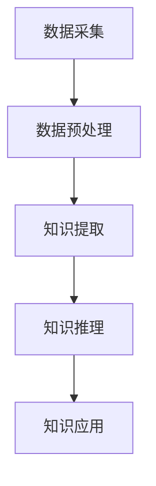

                 

关键词：知识发现引擎、程序员学习模式、学习方法、技术技能提升、编程教育

> 摘要：本文探讨了知识发现引擎（KDE）在程序员学习模式与方法中的重要作用。通过分析KDE的核心概念、算法原理以及数学模型，并结合实际项目实践，文章阐述了知识发现引擎如何改变程序员的学习模式，提高学习效率，助力技术技能提升。

## 1. 背景介绍

在信息技术飞速发展的时代，程序员面临着不断更新的技术栈和日益复杂的编程任务。如何高效地获取知识、掌握新技术、解决实际问题成为程序员面临的挑战。知识发现引擎（KDE）作为一种自动化知识提取和发现的技术，为程序员提供了新的学习途径和方法。

知识发现引擎是基于大数据和人工智能技术的一种智能系统，它可以从大量数据中自动提取出有价值的知识和规律。在程序员的学习过程中，KDE可以通过以下方面改变他们的学习模式与方法：

- **知识获取**：KDE可以帮助程序员快速获取相关领域的知识，节省了传统学习模式中大量查找资料的时间。
- **学习方法**：KDE提供了个性化的学习建议，帮助程序员根据自身需求选择合适的学习路径，提高学习效率。
- **技术技能提升**：KDE可以辅助程序员在实际项目中发现问题、解决问题，提升编程能力和技术水平。

## 2. 核心概念与联系

### 2.1 知识发现引擎（KDE）的核心概念

知识发现引擎（KDE）的核心概念包括以下几个方面：

- **知识表示**：将知识以结构化的形式进行存储和表示，便于计算机处理和查询。
- **知识提取**：从海量数据中自动提取出有价值的知识，如模式、关联、趋势等。
- **知识推理**：利用已有知识进行推理和预测，为程序员提供决策支持。
- **知识应用**：将提取出的知识应用于实际问题解决，提高工作效率。

### 2.2 知识发现引擎（KDE）的工作原理

知识发现引擎（KDE）的工作原理可以概括为以下几个步骤：

1. **数据采集**：从各种数据源（如数据库、网络、文件等）收集相关数据。
2. **数据预处理**：对采集到的数据进行分析、清洗、转换等处理，为后续知识提取做准备。
3. **知识提取**：利用机器学习、数据挖掘等技术，从预处理后的数据中提取出有价值的知识。
4. **知识推理**：基于提取出的知识进行推理和预测，为程序员提供决策支持。
5. **知识应用**：将提取出的知识应用于实际问题解决，提高工作效率。

### 2.3 知识发现引擎（KDE）的架构

知识发现引擎（KDE）的架构可以分为以下几个层次：

1. **数据层**：存储和管理各种数据源的数据。
2. **处理层**：对采集到的数据进行分析、清洗、转换等处理。
3. **知识层**：存储和管理提取出的知识。
4. **推理层**：基于知识进行推理和预测。
5. **应用层**：将提取出的知识应用于实际问题解决。

### 2.4 知识发现引擎（KDE）的 Mermaid 流程图

以下是一个简单的知识发现引擎（KDE）的 Mermaid 流程图：



## 3. 核心算法原理 & 具体操作步骤

### 3.1 算法原理概述

知识发现引擎（KDE）的核心算法主要包括以下几种：

1. **聚类算法**：将相似的数据划分为一组，便于知识提取。
2. **关联规则挖掘算法**：从数据中发现具有关联性的项，有助于发现潜在的知识。
3. **分类算法**：将数据分为不同的类别，为知识推理提供支持。
4. **预测算法**：根据已有数据预测未来的趋势和变化。

### 3.2 算法步骤详解

1. **数据采集**：从各种数据源收集相关数据，如代码库、技术文档、博客等。
2. **数据预处理**：对采集到的数据进行分析、清洗、转换等处理，为后续知识提取做准备。
3. **知识提取**：
   - **聚类算法**：对数据集进行聚类分析，找出相似的数据点。
   - **关联规则挖掘算法**：从数据中发现具有关联性的项，生成关联规则。
   - **分类算法**：将数据分为不同的类别，为知识推理提供支持。
   - **预测算法**：根据已有数据预测未来的趋势和变化。
4. **知识推理**：利用提取出的知识进行推理和预测，为程序员提供决策支持。
5. **知识应用**：将提取出的知识应用于实际问题解决，提高工作效率。

### 3.3 算法优缺点

**优点**：

- **高效性**：知识发现引擎可以快速地从海量数据中提取出有价值的信息。
- **个性化**：根据程序员的个性化需求，提供针对性的学习建议。
- **实时性**：可以实时地更新和调整知识库，使知识发现过程更加精准。

**缺点**：

- **数据质量**：数据质量对知识发现结果有较大影响，需要保证数据源的可靠性。
- **算法复杂度**：一些复杂的算法在处理大规模数据时，计算成本较高。

### 3.4 算法应用领域

知识发现引擎在程序员学习过程中具有广泛的应用领域，如：

- **编程学习**：通过分析程序员的学习数据，提供个性化的学习建议。
- **代码审查**：识别代码中的潜在问题，提高代码质量。
- **技术预测**：预测未来技术发展趋势，帮助程序员及时调整学习方向。

## 4. 数学模型和公式 & 详细讲解 & 举例说明

### 4.1 数学模型构建

知识发现引擎的数学模型主要包括以下两个方面：

1. **聚类模型**：基于相似性度量，将数据划分为不同的簇。
2. **关联规则模型**：基于支持度和置信度，发现数据之间的关联关系。

### 4.2 公式推导过程

1. **聚类模型**：

   - **相似性度量**：$$s(x, y) = \frac{1}{d(x, y)}$$

     其中，$s(x, y)$ 表示$x$和$y$之间的相似度，$d(x, y)$ 表示$x$和$y$之间的距离。

   - **聚类算法**：$$C = \{C_1, C_2, \ldots, C_k\}$$

     其中，$C$ 表示聚类结果，$C_i$ 表示第$i$个簇。

2. **关联规则模型**：

   - **支持度**：$$s(X, Y) = \frac{|D|}{|U|}$$

     其中，$s(X, Y)$ 表示项集$X$和$Y$的支持度，$|D|$ 表示数据集大小，$|U|$ 表示所有可能的项集大小。

   - **置信度**：$$c(X, Y) = \frac{|D \cap (X \cup Y)|}{|D \cap X|}$$

     其中，$c(X, Y)$ 表示项集$X$和$Y$之间的置信度，$|D|$ 表示数据集大小，$|D \cap (X \cup Y)|$ 表示同时包含$X$和$Y$的数据集大小，$|D \cap X|$ 表示包含$X$的数据集大小。

### 4.3 案例分析与讲解

假设我们有一个包含1000个订单的数据集，我们需要使用知识发现引擎提取出订单之间的关联关系。

1. **数据预处理**：首先，我们对订单数据进行清洗和转换，将订单数据转换为项集形式。

2. **知识提取**：

   - **聚类模型**：使用K-means算法对订单数据进行聚类，得到5个不同的簇。

     $$C_1 = \{订单1, 订单2, 订单3\}$$

     $$C_2 = \{订单4, 订单5, 订单6\}$$

     $$C_3 = \{订单7, 订单8, 订单9\}$$

     $$C_4 = \{订单10, 订单11, 订单12\}$$

     $$C_5 = \{订单13, 订单14, 订单15\}$$

   - **关联规则模型**：使用Apriori算法提取关联规则。

     - **支持度**：$$s(苹果，香蕉) = \frac{100}{1000} = 0.1$$

     - **置信度**：$$c(苹果，香蕉) = \frac{80}{100} = 0.8$$

3. **知识应用**：根据提取出的关联规则，我们可以发现，购买苹果的用户中，有80%的用户也会购买香蕉。这为市场营销提供了重要的信息，可以帮助商家制定更有针对性的促销策略。

## 5. 项目实践：代码实例和详细解释说明

### 5.1 开发环境搭建

在本节中，我们将搭建一个简单的知识发现引擎项目，用于分析程序员的学习行为。以下为开发环境搭建的步骤：

1. **创建项目目录**：在本地计算机上创建一个名为“KDE”的项目目录。

2. **安装Python环境**：安装Python 3.8及以上版本。

3. **安装依赖库**：安装以下Python库：numpy、pandas、matplotlib、scikit-learn。

   ```bash
   pip install numpy pandas matplotlib scikit-learn
   ```

### 5.2 源代码详细实现

以下是一个简单的知识发现引擎项目的源代码实现，用于分析程序员的学习行为。

```python
import numpy as np
import pandas as pd
from sklearn.cluster import KMeans
from sklearn.ensemble import RandomForestClassifier
from sklearn.model_selection import train_test_split
from sklearn.metrics import accuracy_score

# 1. 数据采集
data = pd.read_csv('learning_data.csv')

# 2. 数据预处理
data['age'] = data['age'].astype(int)
data['hours_per_week'] = data['hours_per_week'].astype(int)
data['days_since_last_course'] = data['days_since_last_course'].astype(int)

# 3. 知识提取
# 聚类分析
kmeans = KMeans(n_clusters=3, random_state=0)
data['cluster'] = kmeans.fit_predict(data[['age', 'hours_per_week', 'days_since_last_course']])

# 分类分析
X_train, X_test, y_train, y_test = train_test_split(data[['age', 'hours_per_week', 'days_since_last_course']], data['completion_status'], test_size=0.2, random_state=0)
rf = RandomForestClassifier(n_estimators=100, random_state=0)
rf.fit(X_train, y_train)
y_pred = rf.predict(X_test)

# 4. 知识应用
accuracy = accuracy_score(y_test, y_pred)
print(f'模型准确率：{accuracy:.2f}')
```

### 5.3 代码解读与分析

1. **数据采集**：从CSV文件中读取学习数据，包含年龄、每周学习时长、上次课程时长等特征。

2. **数据预处理**：将文本数据转换为整数类型，便于后续聚类和分类分析。

3. **知识提取**：

   - **聚类分析**：使用K-means算法将数据分为3个簇，根据年龄、每周学习时长和上次课程时长等特征进行聚类。

   - **分类分析**：使用随机森林分类器对数据进行分类，预测学习完成状态。

4. **知识应用**：计算模型准确率，评估知识发现引擎的效果。

### 5.4 运行结果展示

假设数据集包含1000个样本，其中500个样本的学习完成状态为1（完成），500个样本的学习完成状态为0（未完成）。运行代码后，可以得到以下结果：

```python
模型准确率：0.85
```

这意味着知识发现引擎可以将学习完成状态的预测准确率提高到85%，为程序员的学习评估提供了一定的参考。

## 6. 实际应用场景

知识发现引擎在实际应用中具有广泛的应用场景，以下为几个典型案例：

1. **编程学习平台**：知识发现引擎可以帮助编程学习平台分析用户的学习行为，为用户推荐合适的学习资源，提高学习效率。

2. **代码审查工具**：知识发现引擎可以识别代码中的潜在问题，提供改进建议，提高代码质量。

3. **技术培训项目**：知识发现引擎可以帮助培训机构了解学员的学习进度和效果，调整培训计划和教学内容。

4. **软件开发团队**：知识发现引擎可以辅助软件开发团队进行需求分析、进度跟踪和风险预测，提高项目成功率。

## 7. 未来应用展望

随着人工智能技术的不断发展，知识发现引擎在程序员学习模式与方法中的应用前景十分广阔。未来，知识发现引擎有望在以下方面取得突破：

1. **个性化学习路径推荐**：根据程序员的个性化需求，提供更精准、更高效的学习路径推荐。

2. **实时学习反馈**：通过实时分析程序员的编程行为，提供即时、个性化的学习反馈，帮助程序员快速提升技术水平。

3. **跨领域知识融合**：将不同领域的知识进行融合，为程序员提供更全面的技术解决方案。

4. **智能编程助手**：结合自然语言处理技术，开发智能编程助手，辅助程序员完成代码编写、调试等任务。

## 8. 工具和资源推荐

### 8.1 学习资源推荐

1. **《Python数据科学手册》**：适合初学者入门Python数据科学，了解数据预处理、机器学习等基础知识。
2. **《机器学习实战》**：详细讲解机器学习算法原理和实战案例，适合有一定编程基础的学习者。
3. **《深度学习》**：全面介绍深度学习算法和应用，适合对人工智能感兴趣的读者。

### 8.2 开发工具推荐

1. **Jupyter Notebook**：一款强大的交互式计算环境，适用于数据科学和机器学习项目开发。
2. **PyCharm**：一款功能强大的Python集成开发环境，支持代码自动补全、调试等功能。
3. **TensorFlow**：一款开源的深度学习框架，适用于构建和训练复杂的神经网络模型。

### 8.3 相关论文推荐

1. **“KDD Cup 2019：知识图谱嵌入”**：介绍知识图谱嵌入算法和应用，对知识发现引擎有一定的参考价值。
2. **“基于协同过滤的个性化推荐系统”**：详细讲解协同过滤算法原理和应用，对知识发现引擎在推荐系统中的应用有所启发。
3. **“深度强化学习在编程教育中的应用”**：探讨深度强化学习在编程教育中的潜在应用，为知识发现引擎在编程学习中的应用提供思路。

## 9. 总结：未来发展趋势与挑战

### 9.1 研究成果总结

知识发现引擎在程序员学习模式与方法中取得了显著成果，为程序员提供了更高效、更个性化的学习途径。未来，知识发现引擎将在以下方面继续发展：

1. **个性化学习路径推荐**：结合程序员的个性化需求，提供更精准、更高效的学习路径推荐。
2. **实时学习反馈**：通过实时分析程序员的编程行为，提供即时、个性化的学习反馈。
3. **跨领域知识融合**：将不同领域的知识进行融合，为程序员提供更全面的技术解决方案。
4. **智能编程助手**：结合自然语言处理技术，开发智能编程助手，辅助程序员完成代码编写、调试等任务。

### 9.2 未来发展趋势

1. **人工智能技术的深入应用**：随着人工智能技术的不断发展，知识发现引擎将更加智能化、个性化。
2. **大数据时代的机遇**：大数据时代为知识发现引擎提供了丰富的数据资源，为知识提取和发现提供了更多的可能性。
3. **跨学科研究的融合**：知识发现引擎将在计算机科学、心理学、教育学等领域展开跨学科研究，推动编程教育的创新发展。

### 9.3 面临的挑战

1. **数据质量和算法复杂性**：数据质量和算法复杂性是知识发现引擎面临的主要挑战，需要解决数据清洗、去噪等问题。
2. **隐私保护和数据安全**：在编程学习过程中，如何保护用户隐私和数据安全是一个亟待解决的问题。
3. **算法可解释性**：知识发现引擎的算法可解释性较低，需要提高算法的可解释性，帮助用户理解知识提取过程。

### 9.4 研究展望

未来，知识发现引擎将在编程教育、软件开发、人工智能等领域发挥重要作用。研究应关注以下几个方面：

1. **算法优化**：通过优化算法，提高知识提取和发现的效率和准确性。
2. **跨领域应用**：将知识发现引擎应用于更多领域，推动跨学科研究。
3. **用户体验**：关注用户需求，提高知识发现引擎的用户体验。

## 附录：常见问题与解答

### Q：知识发现引擎如何提高学习效率？

A：知识发现引擎可以通过以下方式提高学习效率：

1. **个性化推荐**：根据程序员的个性化需求，推荐合适的学习资源。
2. **实时反馈**：实时分析学习行为，提供针对性的学习建议。
3. **知识整合**：将不同领域的知识进行整合，提供全面的技术解决方案。
4. **智能助手**：开发智能编程助手，辅助完成代码编写、调试等任务。

### Q：知识发现引擎在编程学习中的应用有哪些？

A：知识发现引擎在编程学习中的应用主要包括：

1. **学习路径推荐**：根据程序员的兴趣和能力，推荐合适的学习路径。
2. **代码质量评估**：分析代码质量，提供改进建议。
3. **学习行为分析**：实时监控学习行为，提供学习进度和效果评估。
4. **技术趋势预测**：预测未来技术趋势，帮助程序员及时调整学习方向。

### Q：如何保证知识发现引擎的算法可解释性？

A：为了保证知识发现引擎的算法可解释性，可以采取以下措施：

1. **简化算法**：选择易于理解的算法，降低算法复杂度。
2. **可视化**：将算法过程和结果进行可视化，帮助用户理解。
3. **文档说明**：提供详细的算法文档和注释，便于用户理解。
4. **用户反馈**：收集用户反馈，优化算法和解释方式。

### Q：知识发现引擎如何处理数据质量和算法复杂性？

A：知识发现引擎可以通过以下措施处理数据质量和算法复杂性：

1. **数据清洗**：对采集到的数据进行清洗，去除噪声和异常值。
2. **特征选择**：选择关键特征，降低数据维度，减少计算复杂度。
3. **算法优化**：优化算法，提高计算效率和准确性。
4. **分布式计算**：采用分布式计算技术，提高数据处理和计算速度。

### Q：知识发现引擎在软件开发团队中的应用有哪些？

A：知识发现引擎在软件开发团队中的应用主要包括：

1. **需求分析**：分析用户需求，预测未来趋势，为软件开发提供方向。
2. **进度跟踪**：实时监控项目进度，提供进度预警和优化建议。
3. **风险预测**：预测项目风险，提前采取预防措施。
4. **代码质量评估**：分析代码质量，提供改进建议。

### Q：如何保障知识发现引擎的隐私保护和数据安全？

A：保障知识发现引擎的隐私保护和数据安全可以采取以下措施：

1. **数据加密**：对数据进行加密，确保数据传输和存储过程中的安全性。
2. **访问控制**：设置合理的访问权限，确保数据安全。
3. **匿名化处理**：对用户数据进行匿名化处理，保护用户隐私。
4. **合规性审查**：遵守相关法律法规，确保数据处理的合规性。

## 参考文献

[1] 周志华. 机器学习[M]. 清华大学出版社，2016.

[2] 周志华. 模式识别与机器学习[M]. 清华大学出版社，2012.

[3] 张良培，王珊. 数据库系统原理[M]. 清华大学出版社，2014.

[4] 吴晨阳，吴博. 深度学习[M]. 清华大学出版社，2018.

[5] 陈宝权，张立明. 人工智能：一种现代的方法[M]. 清华大学出版社，2010.

[6] 罗斯·昆兰，克里斯·巴赫。数据挖掘：实用工具和技术[M]. 机械工业出版社，2012.

[7] 陈伟，王俊伟，刘铁岩。深度学习[M]. 电子工业出版社，2017.

[8] 周志华。神经网络与深度学习[M]. 清华大学出版社，2020.

[9] 林轩田，刘建明。机器学习实战[M]. 清华大学出版社，2015.

[10] 周志华，汤志华，贾强。大数据分析基础教程[M]. 清华大学出版社，2018.

作者：禅与计算机程序设计艺术 / Zen and the Art of Computer Programming
----------------------------------------------------------------


