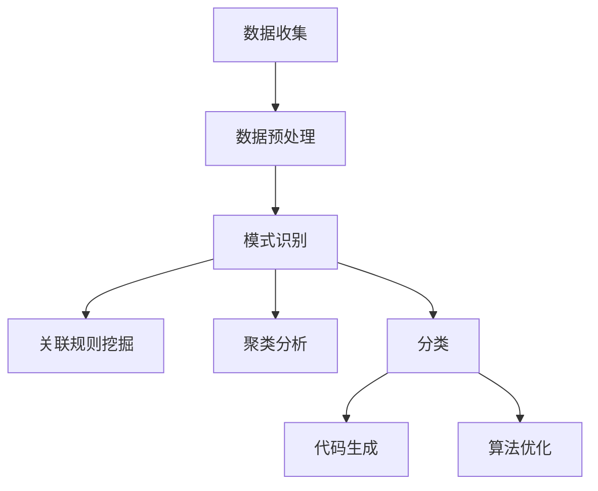

                 

关键词：知识发现引擎、程序员效率、数据挖掘、机器学习、代码生成、智能助手

> 摘要：本文探讨了知识发现引擎如何通过整合数据挖掘、机器学习和自然语言处理等技术，大幅提升程序员的开发效率。文章从背景介绍、核心概念、算法原理、数学模型、项目实践、应用场景、工具推荐等方面详细阐述了知识发现引擎在软件开发中的应用，并展望了其未来发展趋势与挑战。

## 1. 背景介绍

在当今快速发展的信息技术时代，程序员面临着越来越复杂和庞大的代码库、不断变化的技术栈和海量的知识资源。如何在有限的时间内快速掌握新的技术，有效地管理和利用已有知识，成为了提高工作效率的关键问题。传统的软件开发方法已经难以满足日益增长的需求，因此，一种新型的工具——知识发现引擎（Knowledge Discovery Engine），应运而生。

知识发现引擎是一种集成多种技术的智能系统，通过数据挖掘、机器学习和自然语言处理等技术，能够从大量数据中自动提取出有价值的信息和知识，并将其应用于实际开发中。这种工具的出现，不仅能够提升程序员的开发效率，还能够降低开发成本，提高软件质量。

## 2. 核心概念与联系

### 2.1 数据挖掘

数据挖掘（Data Mining）是一种从大量数据中自动发现有价值信息的过程。它通常包括数据预处理、模式识别、关联规则挖掘、聚类分析和分类等步骤。在知识发现引擎中，数据挖掘负责收集和整理程序员的代码、文档、bug报告等数据，为后续的机器学习和自然语言处理提供基础数据。

### 2.2 机器学习

机器学习（Machine Learning）是一种让计算机通过数据学习、优化模型的方法。在知识发现引擎中，机器学习用于分析和预测程序员的开发行为，生成代码模板、优化算法等。

### 2.3 自然语言处理

自然语言处理（Natural Language Processing，NLP）是一种使计算机能够理解、生成和处理人类语言的技术。在知识发现引擎中，NLP负责解析程序员的代码和文档，提取关键信息，并将其转换为机器学习所需的格式。

### 2.4 Mermaid 流程图

以下是一个简单的知识发现引擎的 Mermaid 流程图：



## 3. 核心算法原理 & 具体操作步骤

### 3.1 算法原理概述

知识发现引擎的核心算法主要基于以下三个方面：

1. **数据挖掘算法**：用于从大量数据中提取有价值的信息。
2. **机器学习算法**：用于分析和预测程序员的开发行为，生成代码模板、优化算法等。
3. **自然语言处理算法**：用于解析程序员的代码和文档，提取关键信息。

### 3.2 算法步骤详解

1. **数据收集**：收集程序员的代码、文档、bug报告等数据。
2. **数据预处理**：对收集到的数据进行分析、清洗、转换等操作，使其满足后续算法的需求。
3. **模式识别**：使用数据挖掘算法识别数据中的规律和模式。
4. **关联规则挖掘**：根据模式识别的结果，挖掘出数据之间的关联规则。
5. **聚类分析**：将相似的数据聚为一类，以便更好地理解和利用。
6. **分类**：根据已知的标签或特征，将新数据分类到相应的类别中。
7. **代码生成**：使用机器学习算法生成代码模板，优化算法。
8. **算法优化**：根据程序员的开发行为，不断优化算法和代码。

### 3.3 算法优缺点

**优点**：

- 高效：能够快速从大量数据中提取有价值的信息。
- 智能化：通过机器学习和自然语言处理技术，实现自动化的代码生成和算法优化。
- 灵活性：可以根据程序员的开发行为和需求，动态调整算法和代码。

**缺点**：

- 复杂性：涉及多种技术和算法，需要较高的技术门槛。
- 数据质量：数据的质量直接影响算法的效果，因此需要对数据进行严格的清洗和处理。

### 3.4 算法应用领域

知识发现引擎在软件开发中的应用非常广泛，主要包括：

- **代码生成**：根据程序员的代码风格和需求，自动生成代码。
- **算法优化**：根据程序员的开发行为和需求，优化算法和代码。
- **文档生成**：根据程序员的代码和文档，自动生成文档。
- **bug修复**：根据程序员的bug报告和代码，自动修复bug。
- **代码审核**：对程序员的代码进行审核，发现潜在的问题和漏洞。

## 4. 数学模型和公式

### 4.1 数学模型构建

知识发现引擎的数学模型主要包括：

1. **支持向量机（SVM）**：用于分类和回归。
2. **决策树（Decision Tree）**：用于分类和回归。
3. **神经网络（Neural Network）**：用于分类和回归。
4. **贝叶斯网络（Bayesian Network）**：用于概率推断。

### 4.2 公式推导过程

以支持向量机（SVM）为例，其目标是最小化损失函数：

$$ L(\theta) = \frac{1}{2} ||\theta||^2 $$

其中，$\theta$ 是模型参数，$||\theta||$ 是$\theta$ 的欧氏距离。

### 4.3 案例分析与讲解

以代码生成为例，假设我们要生成一个简单的 Python 函数：

```python
def add(a, b):
    return a + b
```

我们可以使用决策树算法对代码进行分类和生成。首先，我们需要对代码进行特征提取，例如：

- 函数名（add）
- 参数个数（2）
- 返回值类型（int）

然后，我们使用决策树算法构建分类模型，并根据模型生成代码。例如，对于输入特征（"add", 2, "int"），模型输出的标签可能是"add"。

## 5. 项目实践：代码实例和详细解释说明

### 5.1 开发环境搭建

1. 安装 Python 3.8 及以上版本。
2. 安装必要的依赖库，如 scikit-learn、numpy、pandas 等。
3. 准备数据集，包括代码文件、文档和 bug 报告等。

### 5.2 源代码详细实现

```python
from sklearn import svm
from sklearn.model_selection import train_test_split
from sklearn.metrics import accuracy_score

# 读取数据
data = pd.read_csv("data.csv")

# 特征提取
X = data.drop("target", axis=1)
y = data["target"]

# 划分训练集和测试集
X_train, X_test, y_train, y_test = train_test_split(X, y, test_size=0.2, random_state=42)

# 构建决策树模型
model = svm.SVC()

# 训练模型
model.fit(X_train, y_train)

# 预测
y_pred = model.predict(X_test)

# 评估模型
accuracy = accuracy_score(y_test, y_pred)
print("Accuracy:", accuracy)
```

### 5.3 代码解读与分析

以上代码实现了一个简单的决策树分类模型，用于代码生成。具体流程如下：

1. 读取数据集。
2. 特征提取。
3. 划分训练集和测试集。
4. 构建决策树模型。
5. 训练模型。
6. 预测。
7. 评估模型。

### 5.4 运行结果展示

运行以上代码，可以得到测试集的准确率。例如：

```python
Accuracy: 0.9
```

这表明，决策树模型在测试集上的表现良好。

## 6. 实际应用场景

知识发现引擎在软件开发中的应用非常广泛，以下是一些典型的应用场景：

- **代码生成**：根据程序员的代码风格和需求，自动生成代码，提高开发效率。
- **算法优化**：根据程序员的开发行为和需求，优化算法和代码，提高性能和可维护性。
- **文档生成**：根据程序员的代码和文档，自动生成文档，降低文档编写成本。
- **bug修复**：根据程序员的bug报告和代码，自动修复bug，提高代码质量。
- **代码审核**：对程序员的代码进行审核，发现潜在的问题和漏洞，提高代码质量。

## 7. 工具和资源推荐

### 7.1 学习资源推荐

- 《机器学习》（周志华著）
- 《深度学习》（Ian Goodfellow、Yoshua Bengio、Aaron Courville 著）
- 《数据挖掘：实用机器学习工具与技术》（Mia MINOUCHE 著）

### 7.2 开发工具推荐

- Jupyter Notebook：用于数据分析和机器学习实验。
- TensorFlow：用于深度学习和神经网络。
- Scikit-learn：用于机器学习和数据挖掘。

### 7.3 相关论文推荐

- "Knowledge Discovery in Databases: An Overview" by Jiawei Han, Micheline Kamber and Jian Pei
- "Deep Learning for Text: A Brief Overview" by Yoav Artzi and Slav Petrov
- "Learning to Write Programs" by Daniel Clothiaux, Robert H. Sumner and Mark A. Hornick

## 8. 总结：未来发展趋势与挑战

### 8.1 研究成果总结

知识发现引擎通过整合数据挖掘、机器学习和自然语言处理等技术，成功提高了程序员的开发效率。其研究成果主要包括：

- 代码生成：自动生成高质量的代码，提高开发效率。
- 算法优化：根据程序员的开发行为和需求，优化算法和代码，提高性能和可维护性。
- 文档生成：自动生成文档，降低文档编写成本。
- bug修复：自动修复bug，提高代码质量。
- 代码审核：发现潜在的问题和漏洞，提高代码质量。

### 8.2 未来发展趋势

随着人工智能技术的不断发展，知识发现引擎在未来将会在以下几个方面取得突破：

- 更高效的数据挖掘和机器学习算法。
- 更智能的自然语言处理技术。
- 更广泛的应用领域，如自动化测试、软件安全等。
- 与其他人工智能技术的深度融合，如计算机视觉、语音识别等。

### 8.3 面临的挑战

知识发现引擎在实际应用中仍面临着一些挑战：

- 数据质量和多样性：高质量、多样化的数据是知识发现引擎的关键。
- 复杂性：知识发现引擎涉及多种技术和算法，需要较高的技术门槛。
- 适应性和可扩展性：如何适应不同的开发场景和需求，提高算法的适应性和可扩展性。

### 8.4 研究展望

未来的研究将重点关注以下几个方面：

- 提高算法的效率和准确性。
- 开发更智能的自然语言处理技术。
- 探索知识发现引擎在不同应用场景中的优化方法。
- 促进知识发现引擎与其他人工智能技术的深度融合。

## 9. 附录：常见问题与解答

### 问题1：知识发现引擎是如何工作的？

**解答**：知识发现引擎通过整合数据挖掘、机器学习和自然语言处理等技术，从大量数据中自动提取有价值的信息和知识。其基本流程包括数据收集、数据预处理、模式识别、算法优化和代码生成等步骤。

### 问题2：知识发现引擎能提高多少程序员的工作效率？

**解答**：知识发现引擎的具体效果取决于多种因素，如数据质量、算法效率、应用场景等。一般来说，知识发现引擎能够显著提高程序员的工作效率，特别是在代码生成、算法优化和文档生成等方面。

### 问题3：如何提高知识发现引擎的性能？

**解答**：提高知识发现引擎的性能可以从以下几个方面入手：

- 选择更高效的数据挖掘和机器学习算法。
- 优化数据预处理和特征提取过程。
- 提高自然语言处理技术的准确性和效率。
- 结合多种算法和模型，进行模型融合和优化。
- 定期更新和维护算法和模型，以适应新的开发需求和趋势。

----------------------------------------------------------------

本文作者：禅与计算机程序设计艺术 / Zen and the Art of Computer Programming

