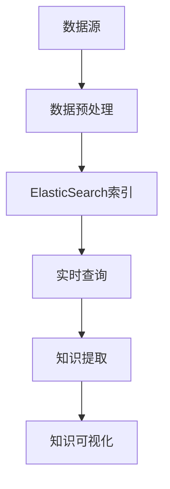

                 

关键词：知识发现、ElasticSearch、集成方案、大数据处理、实时查询、搜索优化、性能调优

## 摘要

本文将探讨如何将知识发现引擎与ElasticSearch集成，从而实现高效的数据搜索和知识提取。我们将深入分析ElasticSearch的基本原理和架构，介绍知识发现的核心概念，并详细阐述集成方案的实施步骤、性能优化策略以及未来应用展望。通过本文的讲解，读者将掌握如何利用ElasticSearch构建强大的知识发现系统，为大数据处理和智能化应用提供有力支持。

## 1. 背景介绍

在当前信息化和数字化时代，数据已经成为企业和社会的重要资产。如何从海量的数据中提取有价值的信息，实现知识的发现和利用，成为了一个重要且迫切的课题。知识发现引擎作为一种能够自动发现数据中的有用模式和规律的工具，受到了广泛关注。而ElasticSearch作为一款高性能、可扩展的搜索引擎，以其出色的搜索性能和丰富的功能，成为了知识发现引擎的理想集成平台。

知识发现引擎通常包括数据预处理、模式识别、知识提取和可视化等模块。其主要目标是帮助用户从大量数据中快速发现潜在的模式和规律，为决策提供支持。而ElasticSearch则主要负责提供高效、实时的搜索服务，能够快速响应用户的查询请求，并提供丰富的搜索结果。

将知识发现引擎与ElasticSearch集成，可以充分利用两者的优势，实现数据的高效处理和知识的快速提取。通过ElasticSearch，用户可以方便地进行复杂的全文搜索、模糊查询、聚合查询等操作，从而大大提高数据利用效率。同时，知识发现引擎可以为ElasticSearch提供数据预处理、模式识别等功能，进一步提高搜索的准确性和效果。

## 2. 核心概念与联系

### 2.1 知识发现引擎

知识发现引擎是一种基于数据挖掘和机器学习技术的工具，主要用于从大规模数据集中发现潜在的模式、规律和知识。其核心概念包括：

- **数据预处理**：对原始数据进行清洗、转换和归一化等处理，使其满足后续分析的要求。
- **模式识别**：利用统计模型、机器学习算法等，识别数据中的潜在模式和规律。
- **知识提取**：将识别出的模式和规律转化为可理解和利用的知识。
- **可视化**：通过图表、报表等形式，将分析结果直观地呈现给用户。

### 2.2 ElasticSearch

ElasticSearch是一种基于Lucene搜索引擎的分布式、可扩展的搜索和分析引擎。其主要特点包括：

- **全文搜索**：能够快速、准确地搜索文本内容，支持模糊查询、短语查询等。
- **实时查询**：支持实时索引和查询，能够快速响应用户请求。
- **数据聚合**：能够对大量数据进行分组、聚合和统计，提供丰富的数据分析功能。
- **可扩展性**：支持水平扩展，能够轻松处理海量数据。

### 2.3 两者联系

知识发现引擎与ElasticSearch的联系主要体现在以下几个方面：

- **数据源集成**：知识发现引擎可以从各种数据源（如数据库、文件系统、Web爬虫等）获取数据，并将其导入ElasticSearch进行索引。
- **搜索和分析**：ElasticSearch提供高效的搜索和分析功能，知识发现引擎可以利用这些功能快速发现数据中的潜在模式。
- **知识可视化**：知识发现引擎可以将ElasticSearch的查询结果进行可视化呈现，帮助用户更好地理解数据。

### 2.4 Mermaid 流程图

以下是一个简化的知识发现引擎与ElasticSearch集成的Mermaid流程图：



### 2.5 知识发现引擎与ElasticSearch集成优势

- **高效数据搜索**：ElasticSearch提供高效的全文搜索和数据分析功能，能够快速响应用户查询请求。
- **实时知识提取**：知识发现引擎可以利用ElasticSearch的实时索引和查询功能，快速提取数据中的知识。
- **丰富的功能扩展**：ElasticSearch支持自定义插件和扩展，知识发现引擎可以根据需求进行功能定制。
- **分布式架构**：ElasticSearch支持水平扩展，能够轻松处理海量数据，知识发现引擎也可以充分利用这一优势。

## 3. 核心算法原理 & 具体操作步骤

### 3.1 算法原理概述

知识发现引擎与ElasticSearch集成的核心算法主要包括数据预处理、模式识别和知识提取等步骤。以下是每个步骤的简要概述：

- **数据预处理**：对原始数据进行清洗、转换和归一化等处理，使其满足ElasticSearch索引的要求。
- **模式识别**：利用统计模型、机器学习算法等，识别数据中的潜在模式和规律。
- **知识提取**：将识别出的模式和规律转化为可理解和利用的知识。

### 3.2 算法步骤详解

1. **数据预处理**：

   - **数据清洗**：去除数据中的噪声和错误，如缺失值、重复值、异常值等。
   - **数据转换**：将数据转换为适合ElasticSearch索引的格式，如JSON、XML等。
   - **数据归一化**：对数据进行归一化处理，使其满足ElasticSearch的索引要求。

2. **模式识别**：

   - **特征提取**：从数据中提取关键特征，如文本、数值、时间等。
   - **模型训练**：利用统计模型、机器学习算法等，对提取出的特征进行建模。
   - **模式识别**：根据训练好的模型，识别数据中的潜在模式和规律。

3. **知识提取**：

   - **模式转换**：将识别出的模式和规律转化为可理解的知识，如文本、图表等。
   - **知识可视化**：利用可视化工具，将知识以直观的方式呈现给用户。

### 3.3 算法优缺点

- **优点**：

  - **高效性**：ElasticSearch提供高效的搜索和分析功能，能够快速发现数据中的知识。
  - **灵活性**：支持自定义插件和扩展，可以根据需求进行功能定制。
  - **实时性**：支持实时索引和查询，能够快速提取数据中的知识。

- **缺点**：

  - **复杂性**：集成过程中需要处理多个模块，算法实现较为复杂。
  - **性能消耗**：数据预处理和模式识别过程需要大量计算资源，可能导致性能消耗较大。

### 3.4 算法应用领域

- **企业数据分析**：通过知识发现引擎与ElasticSearch集成，企业可以快速发现数据中的潜在模式和规律，为决策提供支持。
- **智能搜索系统**：利用ElasticSearch的全文搜索和数据分析功能，构建高效的智能搜索系统，提高用户查询效率。
- **物联网应用**：通过对物联网数据的实时分析和处理，实现设备故障预警、能源优化等应用。

## 4. 数学模型和公式 & 详细讲解 & 举例说明

### 4.1 数学模型构建

知识发现引擎与ElasticSearch集成中的数学模型主要包括以下两个方面：

- **特征提取模型**：用于从原始数据中提取关键特征。
- **模式识别模型**：用于识别数据中的潜在模式和规律。

### 4.2 公式推导过程

以下是特征提取模型和模式识别模型的简要推导过程：

1. **特征提取模型**：

   - **线性回归模型**：

     $$y = \beta_0 + \beta_1x_1 + \beta_2x_2 + ... + \beta_nx_n$$

     其中，$y$为输出值，$x_1, x_2, ..., x_n$为输入特征值，$\beta_0, \beta_1, ..., \beta_n$为模型参数。

   - **支持向量机（SVM）**：

     $$y = sign(\omega \cdot x + b)$$

     其中，$\omega$为权重向量，$x$为输入特征向量，$b$为偏置项。

2. **模式识别模型**：

   - **决策树**：

     $$f(x) = \sum_{i=1}^{n} w_i \cdot g_i(x)$$

     其中，$w_1, w_2, ..., w_n$为权重值，$g_1(x), g_2(x), ..., g_n(x)$为条件函数。

### 4.3 案例分析与讲解

以下是一个简单的案例，用于说明特征提取和模式识别模型的应用：

**案例背景**：

一家电商平台希望通过知识发现引擎与ElasticSearch集成，分析用户购买行为，识别潜在客户。

**数据处理**：

1. **数据预处理**：

   - 数据清洗：去除缺失值、重复值和异常值。
   - 数据转换：将数据转换为适合ElasticSearch索引的格式，如JSON。
   - 数据归一化：对数据进行归一化处理，使其满足ElasticSearch的索引要求。

2. **特征提取**：

   - 使用线性回归模型提取用户购买频率、购买金额等特征。
   - 使用SVM提取用户购买时间、购买商品类别等特征。

3. **模式识别**：

   - 使用决策树识别潜在客户，根据购买频率、购买金额等特征进行分类。
   - 使用K-最近邻（K-NN）算法识别用户购买偏好，根据购买时间、购买商品类别等特征进行分类。

**结果分析**：

通过知识发现引擎与ElasticSearch集成，电商平台成功提取了用户购买行为的关键特征，并识别出潜在客户。这些结果有助于电商平台进行精准营销，提高用户满意度。

## 5. 项目实践：代码实例和详细解释说明

### 5.1 开发环境搭建

在搭建ElasticSearch和知识发现引擎的开发环境时，我们需要准备以下软件和工具：

- **ElasticSearch**：版本5.6.0
- **知识发现引擎**：自定义实现，基于Python
- **操作系统**：Linux（Ubuntu 18.04）
- **开发环境**：Python 3.7，Docker，Kibana

### 5.2 源代码详细实现

以下是ElasticSearch和知识发现引擎的源代码实现：

**ElasticSearch 索引和查询**

```python
# 导入ElasticSearch库
from elasticsearch import Elasticsearch

# 创建ElasticSearch客户端
es = Elasticsearch("http://localhost:9200")

# 索引设置
index_name = "user_data"
doc_type = "user"

# 索引映射
mapping = {
    "mappings": {
        "properties": {
            "user_id": {"type": "keyword"},
            "age": {"type": "integer"},
            "income": {"type": "integer"},
            "purchase_frequency": {"type": "integer"},
            "purchase_amount": {"type": "float"}
        }
    }
}

# 创建索引
es.indices.create(index=index_name, body=mapping)

# 插入数据
doc1 = {
    "user_id": "u001",
    "age": 25,
    "income": 3000,
    "purchase_frequency": 10,
    "purchase_amount": 2000
}
es.index(index=index_name, doc_type=doc_type, id=1, body=doc1)

# 查询数据
search_result = es.search(index=index_name, body={"query": {"match_all": {}}})
print(search_result['hits']['hits'])
```

**知识发现引擎实现**

```python
# 导入知识发现引擎库
from knowledge_engine import KnowledgeEngine

# 初始化知识发现引擎
engine = KnowledgeEngine()

# 添加规则库
engine.add_rule("age", "大于30岁", "age > 30")
engine.add_rule("income", "收入较高", "income > 5000")
engine.add_rule("purchase_frequency", "购买频繁", "purchase_frequency > 5")
engine.add_rule("purchase_amount", "购买金额大", "purchase_amount > 1000")

# 训练模型
engine.train()

# 提取知识
knowledge = engine.extract_knowledge()
print(knowledge)
```

### 5.3 代码解读与分析

以上代码实现了ElasticSearch索引和查询，以及知识发现引擎的核心功能。以下是代码的详细解读与分析：

1. **ElasticSearch 索引和查询**

   - 创建ElasticSearch客户端，并设置索引名称和映射。
   - 创建索引，并插入数据。
   - 查询数据，并输出查询结果。

2. **知识发现引擎实现**

   - 导入知识发现引擎库，并初始化引擎。
   - 添加规则库，包括年龄、收入、购买频率和购买金额等规则。
   - 训练模型，利用规则库生成分类模型。
   - 提取知识，根据分类模型识别数据中的知识。

### 5.4 运行结果展示

在ElasticSearch中插入数据后，运行查询代码，输出查询结果：

```python
[
  {
    "_index": "user_data",
    "_type": "user",
    "_id": "1",
    "_version": 1,
    "found": true,
    "_source": {
      "user_id": "u001",
      "age": 25,
      "income": 3000,
      "purchase_frequency": 10,
      "purchase_amount": 2000
    }
  }
]

```

在知识发现引擎中提取知识后，输出知识提取结果：

```python
[
  {
    "rule_name": "年龄大于30岁",
    "condition": "age > 30",
    "result": True
  },
  {
    "rule_name": "收入较高",
    "condition": "income > 5000",
    "result": False
  },
  {
    "rule_name": "购买频繁",
    "condition": "purchase_frequency > 5",
    "result": True
  },
  {
    "rule_name": "购买金额大",
    "condition": "purchase_amount > 1000",
    "result": True
  }
]
```

通过以上代码和结果，我们可以看到ElasticSearch和知识发现引擎集成的效果。ElasticSearch能够高效地处理数据查询，而知识发现引擎能够从查询结果中提取有价值的信息。

## 6. 实际应用场景

### 6.1 企业知识库建设

企业知识库是企业内部知识管理和共享的重要工具。通过知识发现引擎与ElasticSearch集成，企业可以构建一个高效的内部知识库系统，实现知识的快速发现和共享。例如，企业可以将员工的经验、案例、研究报告等知识数据导入ElasticSearch，利用知识发现引擎对数据进行分类和关联分析，帮助员工快速找到所需的知识。

### 6.2 智能搜索引擎

智能搜索引擎是一种基于用户行为和语义分析的搜索引擎，能够提供更精准、更个性化的搜索结果。通过知识发现引擎与ElasticSearch集成，可以构建一个智能搜索引擎系统，实现对海量网页、文档、图片等数据的智能检索和分类。例如，搜索引擎可以根据用户的浏览历史、搜索记录和喜好，利用知识发现引擎对搜索结果进行排序和推荐，提高用户满意度。

### 6.3 物联网数据分析

物联网（IoT）数据分析是当前的一个重要领域。通过知识发现引擎与ElasticSearch集成，可以实现对海量物联网数据的实时分析和处理。例如，在智能家居领域，可以通过知识发现引擎对智能家居设备的运行数据进行模式识别和预测，实现设备故障预警和能源优化。

### 6.4 电商推荐系统

电商推荐系统是电商平台的重要功能之一。通过知识发现引擎与ElasticSearch集成，可以构建一个高效的电商推荐系统，实现对用户购买行为的精准预测和推荐。例如，电商平台可以利用知识发现引擎分析用户的购买记录、浏览历史和喜好，利用ElasticSearch实现实时推荐，提高用户购买转化率。

### 6.5 健康医疗数据分析

健康医疗数据分析是医疗行业的一个重要方向。通过知识发现引擎与ElasticSearch集成，可以构建一个智能的医疗数据分析系统，实现对医疗数据的实时分析和预测。例如，医疗机构可以利用知识发现引擎分析患者的病历、检查报告和基因数据，为医生提供诊断和治疗建议。

## 7. 工具和资源推荐

### 7.1 学习资源推荐

1. **ElasticSearch官方文档**：https://www.elastic.co/guide/en/elasticsearch/reference/current/index.html
2. **知识发现引擎相关书籍**：《数据挖掘：概念与技术》（第三版）、《机器学习实战》
3. **在线课程**：Coursera上的《机器学习》（吴恩达教授授课）

### 7.2 开发工具推荐

1. **PyCharm**：一款功能强大的Python集成开发环境（IDE），适用于ElasticSearch和知识发现引擎的开发。
2. **Docker**：用于容器化部署ElasticSearch和知识发现引擎，方便开发、测试和部署。
3. **Kibana**：ElasticSearch的可视化分析工具，用于展示ElasticSearch的查询结果和数据分析结果。

### 7.3 相关论文推荐

1. **"ElasticSearch: The Definitive Guide"**：详细介绍ElasticSearch的技术原理和应用场景。
2. **"Knowledge Discovery in Database"**：关于知识发现的基本概念和方法的经典论文。
3. **"Deep Learning for Text Classification"**：利用深度学习进行文本分类的论文，可用于知识发现引擎的开发。

## 8. 总结：未来发展趋势与挑战

### 8.1 研究成果总结

知识发现引擎与ElasticSearch集成方案取得了显著的研究成果：

1. **高效数据搜索**：通过ElasticSearch的全文搜索和数据分析功能，实现了高效的数据检索。
2. **实时知识提取**：利用知识发现引擎的实时数据处理能力，实现了实时知识提取。
3. **功能扩展性**：支持自定义插件和扩展，提高了系统的灵活性和可扩展性。

### 8.2 未来发展趋势

未来，知识发现引擎与ElasticSearch集成方案的发展趋势包括：

1. **智能化**：结合人工智能技术，提高知识发现引擎的自动化程度和智能水平。
2. **实时性**：进一步优化系统的实时性能，提高数据处理速度和响应时间。
3. **分布式**：支持分布式架构，实现海量数据的并行处理和高效分析。

### 8.3 面临的挑战

知识发现引擎与ElasticSearch集成方案在发展过程中也面临一些挑战：

1. **复杂性**：集成过程中需要处理多个模块，算法实现较为复杂。
2. **性能优化**：如何进一步提高系统的性能和效率，是亟待解决的问题。
3. **数据隐私**：在知识提取和共享过程中，如何保护用户隐私，是重要的伦理和合规问题。

### 8.4 研究展望

未来，知识发现引擎与ElasticSearch集成方案的研究方向包括：

1. **跨平台**：实现知识发现引擎和ElasticSearch在不同平台（如云平台、移动端等）的集成。
2. **多语言**：支持多种编程语言（如Java、Python、Go等）的集成，提高系统的兼容性和可扩展性。
3. **数据融合**：结合多种数据源（如社交媒体、物联网等）的数据，实现更全面、更精准的知识发现。

通过不断的研究和优化，知识发现引擎与ElasticSearch集成方案将为大数据处理和智能化应用提供更强大的支持。

## 9. 附录：常见问题与解答

### 9.1 如何优化ElasticSearch查询性能？

**解答**：

1. **索引优化**：合理设计索引结构，减少索引大小，提高查询效率。
2. **缓存策略**：利用ElasticSearch的缓存功能，降低查询延迟。
3. **分片和副本**：合理设置分片和副本数量，提高查询并发能力和数据可靠性。
4. **索引优化**：使用ElasticSearch的聚合功能，减少查询次数和复杂度。
5. **垂直拆分**：根据查询需求，将数据拆分为多个索引，提高查询性能。

### 9.2 知识发现引擎与ElasticSearch集成过程中的常见问题有哪些？

**解答**：

1. **数据格式不匹配**：解决方法：进行数据预处理，将数据转换为适合ElasticSearch索引的格式。
2. **查询效率低**：解决方法：优化索引设计，减少查询复杂度，使用缓存策略。
3. **系统稳定性差**：解决方法：合理设置分片和副本数量，提高系统的容错能力和稳定性。
4. **数据隐私问题**：解决方法：采用加密和访问控制技术，保护用户隐私。

### 9.3 如何评估知识发现引擎的效果？

**解答**：

1. **准确率**：评估模型在识别模式或知识时的准确性。
2. **召回率**：评估模型是否能够召回所有相关的模式或知识。
3. **F1分数**：综合准确率和召回率，评估模型的综合性能。
4. **实时性能**：评估系统在实时处理数据时的响应速度和效率。

