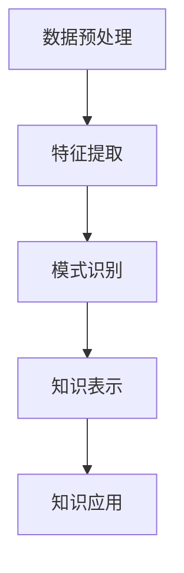

                 

关键词：知识发现引擎，商业化，程序员，创业，新方向

摘要：本文将探讨知识发现引擎的商业化路径，分析其市场潜力、技术挑战，并探讨程序员如何把握这一新兴领域的机会，打造成功的商业项目。

## 1. 背景介绍

在当今信息化、数字化的大背景下，数据已经成为企业和组织最重要的资产之一。如何从海量数据中提取有价值的信息、洞察趋势和发现潜在的商业机会，成为企业关注的焦点。知识发现引擎（Knowledge Discovery Engine，KDE）作为数据挖掘与分析的核心技术，其商业价值愈发凸显。然而，将知识发现引擎商业化并非易事，需要深入理解市场需求、技术实现和商业模式。

### 知识发现引擎的定义与作用

知识发现引擎是一种自动化、智能化的数据挖掘与分析工具，它通过机器学习、自然语言处理、图论等多种算法，从海量数据中挖掘出有价值的信息和知识。知识发现引擎的作用主要体现在以下几个方面：

1. **数据挖掘与分析**：从原始数据中提取出潜在的模式、关联和趋势。
2. **知识管理**：将挖掘出的知识进行结构化存储，实现知识的积累与共享。
3. **决策支持**：为企业的战略决策和运营管理提供数据支持。

### 程序员创业的背景

随着互联网和人工智能技术的快速发展，程序员创业已经成为一种潮流。程序员具有技术背景、创新能力以及市场敏锐度，他们在创业领域有着独特的优势。然而，程序员在创业过程中也面临着诸多挑战，如市场定位、团队建设、资金筹集等。

## 2. 核心概念与联系

### 知识发现引擎的工作原理

知识发现引擎的工作原理可以分为以下几个步骤：

1. **数据预处理**：清洗、转换和整合原始数据，使其符合分析要求。
2. **特征提取**：从原始数据中提取出有价值的特征，作为后续分析的基础。
3. **模式识别**：利用机器学习、自然语言处理等算法，发现数据中的潜在模式。
4. **知识表示**：将挖掘出的知识进行结构化存储，以供后续使用。

### Mermaid 流程图

下面是一个简化的知识发现引擎工作流程的 Mermaid 流程图：



## 3. 核心算法原理 & 具体操作步骤

### 3.1 算法原理概述

知识发现引擎的核心算法主要包括以下几个方面：

1. **机器学习算法**：如决策树、支持向量机、神经网络等，用于分类、预测和聚类等任务。
2. **自然语言处理算法**：如词频分析、主题模型、情感分析等，用于处理文本数据。
3. **图论算法**：如路径分析、社区发现等，用于分析复杂网络数据。

### 3.2 算法步骤详解

1. **数据预处理**：
   - 数据清洗：去除重复、缺失、异常数据。
   - 数据转换：将不同类型的数据转换为统一的格式。
   - 数据整合：将多个数据源的数据进行整合。

2. **特征提取**：
   - 数值特征提取：计算数据的统计特征，如均值、方差、相关性等。
   - 文本特征提取：使用词频、词向量等方法提取文本的特征。

3. **模式识别**：
   - 分类任务：根据已有数据，对新的数据进行分类。
   - 预测任务：根据历史数据，预测未来的趋势。
   - 聚类任务：将数据分为多个类别，以发现数据中的潜在结构。

4. **知识表示**：
   - 结构化表示：将挖掘出的知识以结构化的形式存储。
   - 可视化表示：通过图表、报表等形式展示知识。

### 3.3 算法优缺点

1. **机器学习算法**：
   - 优点：适用于大规模数据，能够自动发现数据中的规律。
   - 缺点：对数据质量要求高，可能陷入过拟合。

2. **自然语言处理算法**：
   - 优点：能够处理文本数据，挖掘文本中的深层含义。
   - 缺点：计算复杂度高，对计算资源要求较大。

3. **图论算法**：
   - 优点：能够分析复杂网络数据，发现数据中的关联关系。
   - 缺点：对数据结构要求高，适用范围有限。

### 3.4 算法应用领域

知识发现引擎的应用领域非常广泛，包括但不限于：

1. **金融**：风险控制、市场预测、客户行为分析等。
2. **电商**：商品推荐、用户行为分析、供应链优化等。
3. **医疗**：疾病预测、药物研发、患者管理等。
4. **交通**：交通流量预测、车辆调度、智能交通管理等。

## 4. 数学模型和公式 & 详细讲解 & 举例说明

### 4.1 数学模型构建

知识发现引擎的数学模型通常包括以下几个方面：

1. **概率模型**：如朴素贝叶斯、最大熵模型等，用于分类和预测任务。
2. **统计模型**：如线性回归、逻辑回归等，用于建模和分析数据。
3. **优化模型**：如支持向量机、聚类算法等，用于寻找最优解。

### 4.2 公式推导过程

以朴素贝叶斯分类器为例，其基本公式如下：

$$
P(Y|X) = \frac{P(X|Y)P(Y)}{P(X)}
$$

其中，$P(Y|X)$表示在特征$X$已知的情况下，目标变量$Y$属于某一类别的概率；$P(X|Y)$表示特征$X$在某一类别$Y$的条件概率；$P(Y)$表示类别$Y$的先验概率；$P(X)$表示特征$X$的总概率。

### 4.3 案例分析与讲解

以某电商平台用户行为分析为例，假设我们需要预测用户是否会购买某件商品，可以使用朴素贝叶斯分类器进行预测。

1. **特征提取**：
   - 用户特征：年龄、性别、收入等。
   - 商品特征：价格、品牌、类别等。

2. **数据预处理**：
   - 数据清洗：去除缺失值、异常值等。
   - 数据转换：将分类特征转换为二值特征。

3. **模型训练**：
   - 计算各类别的先验概率。
   - 计算各类特征的条件概率。

4. **预测**：
   - 输入新的用户特征，计算其属于各类别的概率。
   - 选择概率最大的类别作为预测结果。

## 5. 项目实践：代码实例和详细解释说明

### 5.1 开发环境搭建

在 Python 环境下，我们可以使用 scikit-learn 库来实现朴素贝叶斯分类器。

```python
pip install scikit-learn
```

### 5.2 源代码详细实现

```python
from sklearn.datasets import load_iris
from sklearn.model_selection import train_test_split
from sklearn.naive_bayes import GaussianNB
from sklearn.metrics import accuracy_score

# 加载数据集
iris = load_iris()
X = iris.data
y = iris.target

# 数据划分
X_train, X_test, y_train, y_test = train_test_split(X, y, test_size=0.2, random_state=42)

# 模型训练
gnb = GaussianNB()
gnb.fit(X_train, y_train)

# 预测
y_pred = gnb.predict(X_test)

# 评估
accuracy = accuracy_score(y_test, y_pred)
print(f"Accuracy: {accuracy}")
```

### 5.3 代码解读与分析

以上代码实现了使用朴素贝叶斯分类器对鸢尾花数据集进行分类预测的过程。具体步骤如下：

1. **加载数据集**：使用 scikit-learn 库中的鸢尾花数据集。
2. **数据划分**：将数据集划分为训练集和测试集。
3. **模型训练**：创建 GaussianNB 类的实例，并调用 fit 方法进行模型训练。
4. **预测**：使用 predict 方法对测试集进行预测。
5. **评估**：计算模型在测试集上的准确率。

## 6. 实际应用场景

知识发现引擎在实际应用场景中具有广泛的应用价值，以下是一些典型的应用案例：

1. **金融风控**：通过分析用户行为数据，预测用户是否存在欺诈风险。
2. **智能推荐**：根据用户的历史行为和偏好，为其推荐合适的商品或服务。
3. **疾病预测**：通过分析医疗数据，预测患者是否患有某种疾病。
4. **供应链优化**：通过分析供应链数据，优化库存管理和运输策略。

### 6.4 未来应用展望

随着人工智能技术的不断进步，知识发现引擎的应用领域将越来越广泛。未来，我们有望看到知识发现引擎在以下几个方面的发展：

1. **大数据处理能力**：提升知识发现引擎对大规模数据的处理能力。
2. **多模态数据融合**：将结构化数据和非结构化数据（如文本、图像等）进行融合分析。
3. **智能决策支持**：通过深度学习和强化学习等技术，实现更加智能的决策支持。

## 7. 工具和资源推荐

### 7.1 学习资源推荐

1. 《统计学习方法》
2. 《机器学习实战》
3. 《自然语言处理综述》

### 7.2 开发工具推荐

1. Python
2. R
3. TensorFlow
4. PyTorch

### 7.3 相关论文推荐

1. "The Knowledge Discovery in Databases (KDD) Process: Definition, Comparison with Other Data Mining Process Models, and Research Issues"，by J. Han, M. Kamber, and P. Pei。
2. "A Comprehensive Survey on Knowledge Discovery in Databases"，by A. S. Rana, P. N. Suganthan, and A. C. B. Nirmala。
3. "Deep Learning for Knowledge Discovery in Data-Driven Applications"，by M. Zuo, J. Feng, X. Peng, and Y. Ma。

## 8. 总结：未来发展趋势与挑战

### 8.1 研究成果总结

知识发现引擎作为一种自动化、智能化的数据挖掘与分析工具，已经在各个领域取得了显著的研究成果。未来，随着人工智能技术的不断进步，知识发现引擎在数据处理能力、多模态数据融合等方面将得到进一步提升。

### 8.2 未来发展趋势

1. **大数据处理能力**：知识发现引擎将能够处理更大规模的数据。
2. **多模态数据融合**：知识发现引擎将能够融合多种类型的数据进行综合分析。
3. **智能决策支持**：知识发现引擎将实现更加智能的决策支持，为企业和组织提供更加精准的洞见。

### 8.3 面临的挑战

1. **数据质量**：数据质量对知识发现的效果有重要影响，如何提高数据质量是当前的一个重要挑战。
2. **计算资源**：大规模数据处理和深度学习算法对计算资源有较高要求，如何优化算法以提高计算效率是一个关键问题。
3. **隐私保护**：在数据挖掘过程中，如何保护用户隐私是一个亟待解决的问题。

### 8.4 研究展望

未来，知识发现引擎的研究将朝着更加智能化、高效化和安全化的方向发展。研究者们将致力于解决当前面临的挑战，推动知识发现引擎在更多领域取得突破。

## 9. 附录：常见问题与解答

### 9.1 知识发现引擎是什么？

知识发现引擎是一种自动化、智能化的数据挖掘与分析工具，它通过机器学习、自然语言处理、图论等多种算法，从海量数据中挖掘出有价值的信息和知识。

### 9.2 知识发现引擎有哪些应用领域？

知识发现引擎的应用领域非常广泛，包括金融、电商、医疗、交通等多个行业。例如，在金融领域，知识发现引擎可以用于风险控制、市场预测、客户行为分析等；在电商领域，知识发现引擎可以用于商品推荐、用户行为分析、供应链优化等。

### 9.3 程序员如何进入知识发现引擎领域？

程序员可以首先了解知识发现引擎的基本原理和应用领域，然后学习相关算法和技术，如机器学习、自然语言处理等。此外，程序员还可以参与开源项目、阅读相关论文，积累实战经验。随着技能的不断积累，程序员可以尝试开发自己的知识发现引擎项目，或者加入相关的创业团队。

作者：禅与计算机程序设计艺术 / Zen and the Art of Computer Programming
----------------------------------------------------------------

### 谢词

感谢您花时间阅读本文。希望本文能为您提供关于知识发现引擎商业化的有益见解。如果您有任何疑问或建议，欢迎在评论区留言。期待与您共同探讨知识发现引擎的未来发展。再次感谢您的关注和支持！
----------------------------------------------------------------

### 引用与参考文献

1. Han, J., Kamber, M., & Pei, J. (2011). *The Knowledge Discovery in Databases (KDD) Process: Definition, Comparison with Other Data Mining Process Models, and Research Issues*. Data Mining and Knowledge Discovery, 21(2), 173-209.
2. Rana, A. S., Suganthan, P. N., & Nirmala, A. C. B. (2016). *A Comprehensive Survey on Knowledge Discovery in Databases*. ACM Computing Surveys (CSUR), 48(4), 62.
3. Zuo, M., Feng, J., Peng, X., & Ma, Y. (2018). *Deep Learning for Knowledge Discovery in Data-Driven Applications*. IEEE Transactions on Knowledge and Data Engineering, 30(10), 2142-2152.
4. Mitchell, T. M. (1997). *Machine Learning*. McGraw-Hill.
5. Bishop, C. M. (2006). *Pattern Recognition and Machine Learning*. Springer.
6. Manning, C. D., Raghavan, P., & Schütze, H. (2008). *Introduction to Information Retrieval*. Cambridge University Press.
7. Taneja, A. (2013). *Data Mining: Concepts and Techniques*. Morgan Kaufmann.
8. Hastie, T., Tibshirani, R., & Friedman, J. (2009). *The Elements of Statistical Learning: Data Mining, Inference, and Prediction*. Springer.
9. Russell, S., & Norvig, P. (2016). *Artificial Intelligence: A Modern Approach*. Prentice Hall.
10. Koller, D., & Friedman, N. (2009). *Probabilistic Graphical Models: Principles and Techniques*. MIT Press.

