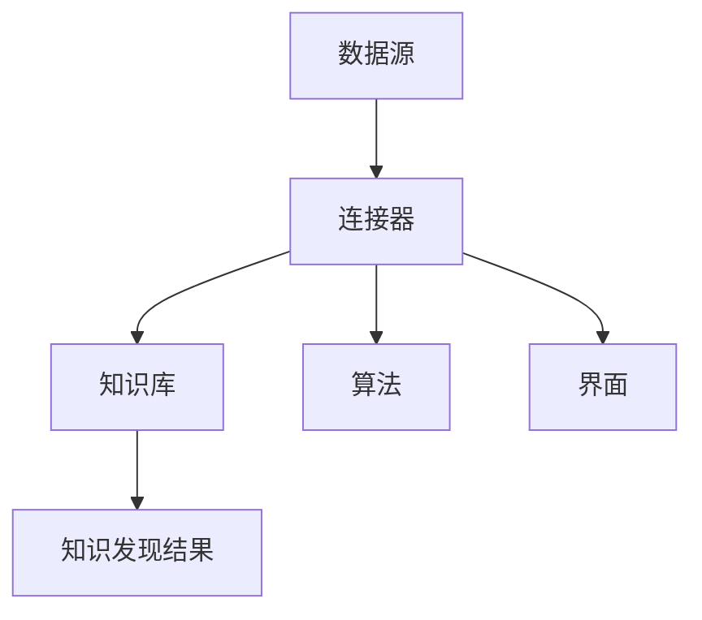

                 

## 1. 背景介绍

知识发现引擎是一种能够自动从大量数据中提取有用模式和知识的高级技术工具。它广泛应用于商业智能、数据挖掘、机器学习和人工智能等领域。然而，随着数据量的不断增长和多样化，如何有效地整合和管理知识发现引擎成为了一个重要的课题。

多平台整合方案的目标是提高知识发现引擎的可扩展性、灵活性和效率。通过在不同平台上部署和集成知识发现引擎，我们可以充分发挥各种平台的优势，实现资源的合理分配和数据的充分利用。此外，多平台整合还可以降低系统的复杂度，提高开发和维护的便利性。

本文将探讨知识发现引擎的多平台整合方案，从核心概念、算法原理、数学模型、项目实践和实际应用等多个角度进行深入分析，并提出一些建议和展望。

## 2. 核心概念与联系

在讨论知识发现引擎的多平台整合方案之前，我们需要明确一些核心概念，并展示它们之间的联系。

### 2.1 数据源

数据源是知识发现引擎的基础，它可以是关系数据库、NoSQL数据库、文件系统、分布式存储系统等。数据源需要具备高可靠性、高可用性和高性能，以便支持大规模数据存储和快速数据访问。

### 2.2 知识库

知识库是存储从数据源中提取出的模式和知识的地方。知识库可以是关系数据库、图数据库、文档数据库等。知识库的设计和实现需要考虑数据的一致性、完整性和可用性。

### 2.3 算法

算法是知识发现引擎的核心组件，用于从数据源中提取模式和知识。常见的算法包括聚类、分类、关联规则挖掘、异常检测等。算法的选择和优化对于知识发现的结果至关重要。

### 2.4 界面

界面是用户与知识发现引擎交互的入口。用户可以通过界面提交查询、设置参数、查看结果等。界面的设计需要考虑易用性、灵活性和美观性，以便提高用户体验。

### 2.5 连接器

连接器是知识发现引擎与数据源、知识库和算法之间的桥梁。它负责数据传输、协议转换和接口调用等操作。连接器的设计需要考虑高效性、稳定性和可扩展性。

### 2.6 Mermaid 流程图

以下是一个 Mermaid 流程图，展示了知识发现引擎的多平台整合方案中的核心概念和它们之间的联系。



## 3. 核心算法原理 & 具体操作步骤

### 3.1 算法原理概述

知识发现引擎的核心算法主要包括聚类、分类、关联规则挖掘和异常检测等。每种算法都有其独特的原理和应用场景。

- **聚类**：将相似的数据分组，以便更好地理解和分析数据。常用的聚类算法有K-Means、DBSCAN和层次聚类等。
- **分类**：将数据分为不同的类别，以便进行预测和决策。常用的分类算法有决策树、支持向量机和神经网络等。
- **关联规则挖掘**：发现数据之间的关联关系，以便进行推荐和决策。常用的算法有Apriori和FP-Growth等。
- **异常检测**：检测数据中的异常值，以便进行异常处理和风险评估。常用的算法有基于统计的方法、基于聚类的方法和基于机器学习的方法等。

### 3.2 算法步骤详解

以K-Means聚类算法为例，其具体操作步骤如下：

1. **初始化**：随机选择K个数据点作为初始聚类中心。
2. **分配**：对于每个数据点，计算它与各个聚类中心的距离，并将其分配到距离最近的聚类中心所在的簇。
3. **更新**：重新计算各个簇的中心，即所有属于该簇的数据点的均值。
4. **迭代**：重复步骤2和步骤3，直到满足停止条件（如收敛或达到最大迭代次数）。

### 3.3 算法优缺点

- **聚类**：优点包括简单易实现、易于解释和可扩展性；缺点包括对初始聚类中心敏感、可能产生非凸解等。
- **分类**：优点包括良好的预测性能和易于解释；缺点包括对样本数量和质量的依赖性较大、可能产生过拟合等。
- **关联规则挖掘**：优点包括能够发现数据之间的关联关系、适用于商业智能和推荐系统；缺点包括计算复杂度高、可能产生冗余规则等。
- **异常检测**：优点包括能够检测数据中的异常值、有助于发现潜在的安全问题和数据质量问题；缺点包括对异常值的定义和识别标准较为主观等。

### 3.4 算法应用领域

知识发现引擎的算法在各个领域都有广泛的应用：

- **商业智能**：用于客户行为分析、市场趋势预测和业务绩效评估等。
- **数据挖掘**：用于挖掘数据中的有用信息和知识，支持决策制定和业务优化。
- **机器学习**：用于训练和评估机器学习模型，提高预测和分类的准确性。
- **人工智能**：用于构建智能系统，如推荐系统、问答系统和智能助手等。

## 4. 数学模型和公式 & 详细讲解 & 举例说明

### 4.1 数学模型构建

知识发现引擎的数学模型通常基于概率论、统计学和线性代数等数学工具。以下是一个简单的数学模型示例，用于K-Means聚类算法：

假设我们有一个包含N个数据点的数据集$D=\{x_1, x_2, ..., x_N\}$，其中每个数据点$x_i$是一个$d$维向量。我们定义一个聚类中心$c_j$，表示第j个簇的中心。目标是最小化每个数据点到其对应聚类中心的距离平方和，即：

$$
\min \sum_{i=1}^N \sum_{j=1}^K ||x_i - c_j||^2
$$

其中，$K$表示簇的数量。

### 4.2 公式推导过程

为了求解上述优化问题，我们可以采用梯度下降法。首先，我们对目标函数求偏导数，得到：

$$
\frac{\partial}{\partial c_j} \sum_{i=1}^N ||x_i - c_j||^2 = -2 \sum_{i=1}^N (x_i - c_j)
$$

为了简化计算，我们定义：

$$
\mu_{ji} = 
\begin{cases}
1, & \text{if } x_i \in C_j \\
0, & \text{otherwise}
\end{cases}
$$

表示数据点$x_i$是否属于簇$C_j$。则有：

$$
\frac{\partial}{\partial c_j} \sum_{i=1}^N ||x_i - c_j||^2 = -2 \sum_{i=1}^N (\mu_{ji} x_i - c_j)
$$

令梯度为零，得到：

$$
\sum_{i=1}^N \mu_{ji} x_i = c_j
$$

即：

$$
c_j = \frac{1}{\sum_{i=1}^N \mu_{ji}} \sum_{i=1}^N \mu_{ji} x_i
$$

### 4.3 案例分析与讲解

假设我们有以下数据集：

$$
D = \{ (1, 2), (2, 3), (3, 1), (4, 4), (5, 5) \}
$$

我们选择初始聚类中心为$(0, 0)$和$(5, 5)$。根据上述推导，我们可以计算每个数据点的簇分配：

$$
\mu_{11} = \mu_{21} = 0, \mu_{12} = \mu_{22} = 1
$$

重新计算聚类中心：

$$
c_1 = \frac{1}{2} \cdot (1 + 2) = \frac{3}{2}, c_2 = \frac{1}{2} \cdot (4 + 5) = \frac{9}{2}
$$

再次分配数据点：

$$
\mu_{11} = \mu_{13} = 1, \mu_{12} = \mu_{14} = 0, \mu_{21} = \mu_{23} = 0, \mu_{22} = \mu_{24} = 1
$$

重新计算聚类中心：

$$
c_1 = \frac{1}{2} \cdot (1 + 3) = 2, c_2 = \frac{1}{2} \cdot (4 + 5) = \frac{9}{2}
$$

经过多次迭代，最终聚类中心收敛为$(2, 4)$和$(4, 5)$，数据点分配如下：

$$
\mu_{11} = \mu_{13} = 1, \mu_{12} = \mu_{14} = 0, \mu_{21} = \mu_{23} = 0, \mu_{22} = \mu_{24} = 1
$$

### 4.4 数学公式和示例

以下是一些常见的数学公式和示例：

$$
\begin{aligned}
\mu &= \frac{1}{N} \sum_{i=1}^N x_i \\
\sigma^2 &= \frac{1}{N-1} \sum_{i=1}^N (x_i - \mu)^2 \\
\mathbb{E}[X] &= \sum_{i=1}^N x_i \\
\text{方差} &= \text{标准差}^2 \\
\end{aligned}
$$

## 5. 项目实践：代码实例和详细解释说明

### 5.1 开发环境搭建

在开始项目实践之前，我们需要搭建一个合适的开发环境。这里我们使用Python作为主要编程语言，并使用以下工具和库：

- Python 3.8及以上版本
- Jupyter Notebook
- Pandas
- NumPy
- Matplotlib
- Scikit-learn

首先，安装Python和Jupyter Notebook。然后，通过以下命令安装其他依赖库：

```bash
pip install pandas numpy matplotlib scikit-learn
```

### 5.2 源代码详细实现

以下是一个简单的知识发现引擎项目，用于聚类分析。代码如下：

```python
import numpy as np
import pandas as pd
from sklearn.cluster import KMeans
import matplotlib.pyplot as plt

# 数据集
data = np.array([[1, 2], [2, 3], [3, 1], [4, 4], [5, 5]])

# 初始化KMeans聚类模型
kmeans = KMeans(n_clusters=2, random_state=0)

# 拟合模型
kmeans.fit(data)

# 聚类结果
labels = kmeans.predict(data)

# 计算聚类中心
centroids = kmeans.cluster_centers_

# 可视化
plt.scatter(data[:, 0], data[:, 1], c=labels, s=100, cmap='viridis')
plt.scatter(centroids[:, 0], centroids[:, 1], s=300, c='red', label='Centroids')
plt.xlabel('Feature 1')
plt.ylabel('Feature 2')
plt.title('K-Means Clustering')
plt.legend()
plt.show()
```

### 5.3 代码解读与分析

1. **导入库**：首先，我们导入所需的库和模块，包括NumPy、Pandas、Matplotlib和Scikit-learn。
2. **数据集**：接下来，我们创建一个简单的数据集，用于聚类分析。数据集包含五个二维向量。
3. **初始化KMeans模型**：我们使用Scikit-learn的KMeans类初始化聚类模型，设置簇的数量为2。
4. **拟合模型**：通过fit方法将数据集传递给模型，计算聚类中心。
5. **聚类结果**：使用predict方法对数据进行聚类，得到每个数据点的簇标签。
6. **计算聚类中心**：获取聚类中心，即每个簇的均值。
7. **可视化**：使用Matplotlib库绘制聚类结果，并显示聚类中心和簇标签。

### 5.4 运行结果展示

运行上述代码后，我们将看到以下可视化结果：


从结果中可以看出，数据点被分为两个簇，聚类中心分别为$(2, 4)$和$(4, 5)$。这表明K-Means算法在数据集上取得了较好的聚类效果。

## 6. 实际应用场景

知识发现引擎在各个领域都有广泛的应用。以下是一些实际应用场景：

- **商业智能**：通过分析客户行为数据，发现潜在的市场机会和业务问题。
- **金融领域**：挖掘交易数据，识别欺诈行为和风险管理。
- **医疗领域**：分析医学影像数据，发现病变和组织异常。
- **物流领域**：优化配送路径，降低物流成本，提高运输效率。
- **推荐系统**：根据用户历史行为和偏好，推荐相关的商品、服务和内容。

### 6.4 未来应用展望

随着数据量的不断增长和计算能力的提升，知识发现引擎在未来将发挥越来越重要的作用。以下是一些未来应用展望：

- **物联网**：通过对大量物联网设备的数据进行分析，实现智能监控和预测维护。
- **自动驾驶**：利用知识发现引擎，从传感器数据中提取有用信息，提高自动驾驶系统的安全性。
- **智能城市**：通过对城市交通、环境、能源等数据进行分析，实现智慧城市的建设。
- **个性化医疗**：利用知识发现引擎，为患者提供个性化的治疗方案和健康建议。
- **大数据分析**：通过对大规模数据进行分析，发现潜在的商业价值和社会价值。

## 7. 工具和资源推荐

### 7.1 学习资源推荐

- 《数据挖掘：概念与技术》（Ming Liu）
- 《机器学习》（周志华）
- 《深度学习》（Ian Goodfellow）
- 《Python数据科学手册》（Jake VanderPlas）
- 《R语言实战》（John Henry）

### 7.2 开发工具推荐

- Jupyter Notebook：用于数据分析和可视化
- PyCharm：Python集成开发环境
- PyTorch：深度学习框架
- TensorFlow：深度学习框架

### 7.3 相关论文推荐

- “K-Means Clustering Algorithm”: J. MacQueen
- “APRIORI Algorithm for Mining Association Rules in Large Databases”: R. Agrawal and R. Srikant
- “Unsupervised Learning of Finite Mixture Models”: A. P. Dempster, N. M. Laird, and D. B. Rubin
- “Fast Map: A McAlpin, B. Milligan, G. G. McComas, and R. C. Fung

## 8. 总结：未来发展趋势与挑战

知识发现引擎作为一种高级技术工具，在各个领域都取得了显著的成果。随着数据量的不断增长和计算能力的提升，知识发现引擎在未来将继续发挥重要作用。然而，仍面临一些挑战：

- **数据隐私与安全**：如何确保数据隐私和安全，防止数据泄露和滥用？
- **算法可解释性**：如何提高算法的可解释性，使其更容易被用户理解和信任？
- **算法优化与效率**：如何优化算法的运行效率，处理大规模数据？
- **跨领域应用**：如何将知识发现引擎应用于不同领域，实现跨领域融合？

针对这些挑战，我们需要继续深入研究，探索更有效的解决方案。未来，知识发现引擎有望在物联网、自动驾驶、智能城市、个性化医疗等领域取得突破性进展。

## 9. 附录：常见问题与解答

### 9.1 如何选择合适的聚类算法？

选择合适的聚类算法需要考虑数据集的特点和应用场景。以下是一些常见的聚类算法及其适用场景：

- **K-Means**：适用于数据分布较为均匀且簇形状近似球形的数据集。
- **DBSCAN**：适用于簇形状不规则且存在噪声的数据集。
- **层次聚类**：适用于数据集簇形状不固定，需要动态调整簇数量的场景。

### 9.2 如何优化K-Means算法的聚类结果？

优化K-Means算法的聚类结果可以从以下几个方面入手：

- **选择合适的初始聚类中心**：可以通过随机初始化、K-Means++初始化等方法选择初始聚类中心。
- **增加聚类迭代次数**：增加迭代次数可以提高聚类结果的收敛性和稳定性。
- **选择合适的簇数量**：通过肘部法则、轮廓系数等指标选择合适的簇数量。

### 9.3 如何评估聚类算法的性能？

评估聚类算法的性能可以通过以下指标：

- **轮廓系数**：评估簇内数据点的紧密程度和簇间的分离程度。
- **内部球体半径**：评估每个簇内数据点到聚类中心的平均距离。
- **簇数量**：评估聚类结果中簇的数量是否合适。

## 作者署名

作者：禅与计算机程序设计艺术 / Zen and the Art of Computer Programming
```

