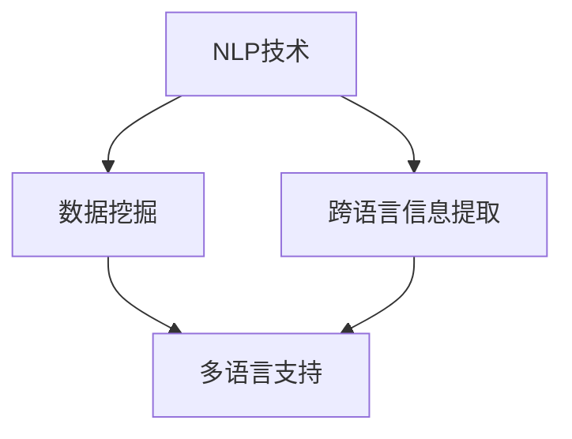

                 

在当今信息化时代，知识发现引擎（Knowledge Discovery Engine，简称KDE）成为了企业级应用、搜索引擎和个人学习工具中不可或缺的核心技术。其能够从大量数据中提取有价值的信息，为人类决策提供数据支撑。然而，随着全球化的深入，越来越多的应用场景需要跨语言的支持。因此，如何实现知识发现引擎的多语言支持成为了当前研究的热点之一。

## 关键词

- 知识发现引擎
- 多语言支持
- 自然语言处理
- 数据挖掘
- 跨语言信息提取

## 摘要

本文主要探讨了知识发现引擎的多语言支持实现。首先，介绍了知识发现引擎的基本概念和其在现代信息技术中的应用。然后，详细阐述了多语言支持的核心概念及其在知识发现引擎中的重要性。接着，从算法原理、数学模型、项目实践等多个角度，深入分析了实现知识发现引擎多语言支持的方法和技术。最后，展望了未来知识发现引擎多语言支持的发展趋势和面临的挑战。

## 1. 背景介绍

知识发现引擎是一种基于人工智能和大数据技术的工具，它可以从大量数据中自动识别和发现有价值的信息。这些信息可以是趋势、关联、异常等，为人类提供决策支持。知识发现引擎的应用场景非常广泛，包括但不限于：

1. **商业智能**：通过分析客户行为、销售数据等，为企业提供市场洞察。
2. **搜索引擎**：通过理解用户的查询意图，提供更加精准的搜索结果。
3. **社交媒体分析**：通过分析用户评论、帖子等，识别社会热点和趋势。
4. **智能推荐系统**：通过分析用户历史行为，为用户推荐感兴趣的物品。

然而，随着全球化的加深，越来越多的应用场景需要处理多种语言的数据。例如，一家跨国企业需要分析来自全球不同国家的销售数据；一个搜索引擎需要理解用户在不同语言环境下的查询意图。这就要求知识发现引擎能够支持多语言处理。

### 1.1 多语言支持的重要性

多语言支持对知识发现引擎具有重要意义。首先，它能够扩大数据来源，提高数据丰富度。例如，通过支持多种语言，知识发现引擎可以从更多国家和地区获取数据，从而更全面地了解市场趋势。其次，多语言支持能够提高用户的体验。例如，一个搜索引擎能够理解用户的查询意图，无论用户使用的是哪种语言。最后，多语言支持有助于推动技术的全球化发展。例如，通过支持多种语言，知识发现引擎可以更好地服务于全球用户，从而推动技术的普及和应用。

## 2. 核心概念与联系

在实现知识发现引擎的多语言支持时，需要理解以下几个核心概念：

- **自然语言处理（NLP）**：自然语言处理是人工智能的一个分支，旨在让计算机理解和处理人类自然语言。在多语言支持中，NLP 技术用于对多种语言的文本进行预处理、分析和理解。
- **数据挖掘（Data Mining）**：数据挖掘是从大量数据中自动发现有价值信息的过程。在多语言支持中，数据挖掘技术用于从多种语言的文本数据中提取知识。
- **跨语言信息提取（Cross-Lingual Information Extraction）**：跨语言信息提取是指在不同语言之间提取信息的过程。在多语言支持中，跨语言信息提取技术用于处理不同语言之间的数据。

下面是一个 Mermaid 流程图，展示了这些核心概念之间的联系：



### 2.1 自然语言处理（NLP）技术

自然语言处理技术是知识发现引擎多语言支持的基础。它包括以下几个关键步骤：

1. **文本预处理**：包括去除停用词、分词、词性标注等。
2. **语言模型**：通过统计方法或深度学习模型，建立语言模型，用于理解文本的语法和语义。
3. **词嵌入**：将文本中的词语转换为向量表示，以便于计算机处理。

### 2.2 数据挖掘（Data Mining）技术

数据挖掘技术用于从多种语言的文本数据中提取有价值的信息。它包括以下几个关键步骤：

1. **特征提取**：从文本数据中提取特征，如词频、TF-IDF 等。
2. **模式识别**：通过机器学习算法，从特征中识别出有意义的模式。
3. **知识表示**：将提取的知识表示为结构化的数据，如知识图谱。

### 2.3 跨语言信息提取（Cross-Lingual Information Extraction）

跨语言信息提取技术用于处理不同语言之间的数据。它包括以下几个关键步骤：

1. **翻译模型**：建立不同语言之间的翻译模型，用于将一种语言的数据转换为另一种语言。
2. **信息融合**：将不同语言的数据进行融合，提取出共同的信息。
3. **一致性检验**：对提取的信息进行一致性检验，确保信息的准确性。

## 3. 核心算法原理 & 具体操作步骤

### 3.1 算法原理概述

实现知识发现引擎的多语言支持，需要以下几个核心算法：

1. **翻译模型**：包括机器翻译（Machine Translation，MT）和翻译嵌入（Translation Embedding）。
2. **跨语言信息提取**：包括跨语言文本分类（Cross-Lingual Text Classification）和跨语言实体识别（Cross-Lingual Entity Recognition）。
3. **数据融合**：包括统计融合（Statistical Fusion）和深度学习融合（Deep Learning Fusion）。

### 3.2 算法步骤详解

1. **翻译模型**：
   - **机器翻译**：利用现有的机器翻译模型，如神经机器翻译（Neural Machine Translation，NMT），将不同语言的文本进行翻译。
   - **翻译嵌入**：将不同语言的文本转换为嵌入向量，利用共享嵌入（Shared Embedding）或独立嵌入（Independent Embedding）技术，实现跨语言的信息表示。

2. **跨语言信息提取**：
   - **跨语言文本分类**：利用现有的文本分类算法，如支持向量机（Support Vector Machine，SVM）和循环神经网络（Recurrent Neural Network，RNN），对跨语言文本进行分类。
   - **跨语言实体识别**：利用实体识别算法，如 BiLSTM-CRF（Bidirectional Long Short-Term Memory with Conditional Random Field），对跨语言文本中的实体进行识别。

3. **数据融合**：
   - **统计融合**：将不同语言的数据进行统计融合，利用统计方法，如均值融合（Mean Fusion）和最大均值融合（Maximum Mean Fusion），提取共同的信息。
   - **深度学习融合**：利用深度学习模型，如多任务学习（Multi-Task Learning，MTL）和迁移学习（Transfer Learning），对跨语言的数据进行融合。

### 3.3 算法优缺点

1. **翻译模型**：
   - **优点**：能够实现不同语言之间的自动翻译，提高数据融合的效率。
   - **缺点**：机器翻译的准确度仍然较低，尤其是在处理复杂的文本时。

2. **跨语言信息提取**：
   - **优点**：能够直接对多种语言的文本进行信息提取，无需翻译，提高数据处理的效率。
   - **缺点**：在处理不同语言之间的信息差异时，可能会降低信息的准确性。

3. **数据融合**：
   - **优点**：能够将多种语言的数据进行融合，提取出更全面的信息。
   - **缺点**：在处理不同语言之间的数据差异时，可能会降低数据的准确性。

### 3.4 算法应用领域

1. **跨语言文本分类**：广泛应用于社交媒体分析、舆情监测等领域。
2. **跨语言实体识别**：广泛应用于跨语言知识图谱构建、跨语言搜索引擎等领域。
3. **数据融合**：广泛应用于跨语言数据挖掘、跨语言推荐系统等领域。

## 4. 数学模型和公式 & 详细讲解 & 举例说明

### 4.1 数学模型构建

为了实现知识发现引擎的多语言支持，我们需要构建以下数学模型：

1. **翻译模型**：
   - **机器翻译模型**：利用神经机器翻译（NMT）模型，如序列到序列（Sequence-to-Sequence，Seq2Seq）模型，构建不同语言之间的翻译模型。
   - **翻译嵌入模型**：利用共享嵌入（Shared Embedding）或独立嵌入（Independent Embedding）模型，构建不同语言之间的翻译嵌入模型。

2. **跨语言信息提取模型**：
   - **跨语言文本分类模型**：利用循环神经网络（RNN）或变压器（Transformer）模型，构建跨语言文本分类模型。
   - **跨语言实体识别模型**：利用双向循环神经网络（BiLSTM）或双向变压器（BiTransformer）模型，构建跨语言实体识别模型。

3. **数据融合模型**：
   - **统计融合模型**：利用统计方法，如均值融合（Mean Fusion）和最大均值融合（Maximum Mean Fusion），构建统计融合模型。
   - **深度学习融合模型**：利用多任务学习（MTL）或迁移学习（Transfer Learning），构建深度学习融合模型。

### 4.2 公式推导过程

下面我们将分别介绍这些模型的数学公式推导过程。

1. **机器翻译模型**：

   **序列到序列（Seq2Seq）模型**：

   - **编码器（Encoder）**：

     $$h_t = \text{gru}(h_{t-1}, x_t)$$

     其中，$h_t$ 表示编码器在时间步 $t$ 的隐藏状态，$\text{gru}$ 表示门控循环单元（Gated Recurrent Unit），$x_t$ 表示输入序列在时间步 $t$ 的特征。

   - **解码器（Decoder）**：

     $$y_t = \text{softmax}(W[y_t; h_t])$$

     其中，$y_t$ 表示解码器在时间步 $t$ 的输出，$W[y_t; h_t]$ 表示解码器的权重矩阵。

   2. **翻译嵌入模型**：

   - **共享嵌入（Shared Embedding）模型**：

     $$e_t = \text{tanh}(W[x_t; h_t])$$

     其中，$e_t$ 表示共享嵌入模型在时间步 $t$ 的嵌入向量，$W[x_t; h_t]$ 表示共享嵌入模型的权重矩阵。

   - **独立嵌入（Independent Embedding）模型**：

     $$e_t = \text{tanh}(W[x_t] + W[h_t])$$

     其中，$e_t$ 表示独立嵌入模型在时间步 $t$ 的嵌入向量，$W[x_t]$ 和 $W[h_t]$ 分别表示独立嵌入模型的输入和隐藏权重矩阵。

2. **跨语言信息提取模型**：

   - **跨语言文本分类模型**：

     $$P(y_t = c) = \text{softmax}(\text{RNN}(h_t))$$

     其中，$y_t$ 表示分类标签，$c$ 表示类别，$P(y_t = c)$ 表示在时间步 $t$ 输出类别 $c$ 的概率，$\text{RNN}(h_t)$ 表示循环神经网络在时间步 $t$ 的隐藏状态。

   - **跨语言实体识别模型**：

     $$P(e_t = c) = \text{softmax}(\text{BiLSTM}(h_t))$$

     其中，$e_t$ 表示实体标签，$c$ 表示类别，$P(e_t = c)$ 表示在时间步 $t$ 输出实体类别 $c$ 的概率，$\text{BiLSTM}(h_t)$ 表示双向循环神经网络在时间步 $t$ 的隐藏状态。

3. **数据融合模型**：

   - **统计融合模型**：

     $$\hat{y} = \frac{1}{K} \sum_{k=1}^{K} y_{k,t}$$

     其中，$\hat{y}$ 表示融合后的输出，$K$ 表示融合的模型数量，$y_{k,t}$ 表示第 $k$ 个模型在时间步 $t$ 的输出。

   - **深度学习融合模型**：

     $$\hat{y} = \text{MLP}([y_1, y_2, \ldots, y_K])$$

     其中，$\hat{y}$ 表示融合后的输出，$\text{MLP}$ 表示多层感知器（Multi-Layer Perceptron）模型，$y_1, y_2, \ldots, y_K$ 表示各个模型的输出。

### 4.3 案例分析与讲解

为了更好地理解这些数学模型，我们可以通过一个具体的案例进行分析。

**案例：跨语言文本分类**

假设我们有两个语言：英语（EN）和西班牙语（ES）。我们需要对一段英语文本进行分类，判断其属于哪一类（如政治、体育、娱乐等）。

**步骤**：

1. **翻译**：将英语文本翻译为西班牙语。我们可以使用现有的机器翻译模型，如神经机器翻译（NMT）模型，将英语文本翻译为西班牙语。
2. **嵌入**：将翻译后的西班牙语文本转换为嵌入向量。我们可以使用共享嵌入（Shared Embedding）模型或独立嵌入（Independent Embedding）模型，将西班牙语文本转换为嵌入向量。
3. **分类**：利用跨语言文本分类模型，对嵌入向量进行分类。我们可以使用循环神经网络（RNN）或变压器（Transformer）模型，对嵌入向量进行分类。

**公式**：

1. **翻译**：

   $$s_e = \text{NMT}(s_t)$$

   其中，$s_e$ 表示英语文本的翻译结果，$s_t$ 表示英语文本。

2. **嵌入**：

   $$e_e = \text{tanh}(W[s_e; h_e])$$

   其中，$e_e$ 表示英语文本的嵌入向量，$W[s_e; h_e]$ 表示共享嵌入模型的权重矩阵。

3. **分类**：

   $$P(y_t = c) = \text{softmax}(\text{RNN}(e_e))$$

   其中，$y_t$ 表示分类标签，$c$ 表示类别，$P(y_t = c)$ 表示在时间步 $t$ 输出类别 $c$ 的概率，$\text{RNN}(e_e)$ 表示循环神经网络在时间步 $t$ 的隐藏状态。

**案例分析与讲解**：

通过上述步骤，我们可以将一段英语文本翻译为西班牙语，并将其转换为嵌入向量。然后，利用跨语言文本分类模型，对嵌入向量进行分类，从而判断该文本属于哪一类。

例如，假设我们有一段英语文本：“The match was exciting.”。我们可以将其翻译为西班牙语：“El partido fue emocionante.”。然后，利用共享嵌入模型，将其转换为嵌入向量。最后，利用循环神经网络，对其进行分类。根据分类结果，我们可以判断这段文本属于体育类别。

## 5. 项目实践：代码实例和详细解释说明

### 5.1 开发环境搭建

为了实现知识发现引擎的多语言支持，我们需要搭建一个合适的开发环境。以下是一个基本的开发环境搭建步骤：

1. **安装 Python**：首先，我们需要安装 Python，版本建议为 3.7 或以上。
2. **安装深度学习框架**：安装 TensorFlow 或 PyTorch，用于构建和训练深度学习模型。
3. **安装自然语言处理库**：安装 NLTK、spaCy 或其他自然语言处理库，用于文本预处理和语言模型构建。
4. **安装其他依赖库**：安装必要的依赖库，如 NumPy、Pandas 等。

### 5.2 源代码详细实现

以下是一个简单的示例，展示如何使用 Python 实现知识发现引擎的多语言支持。

```python
import tensorflow as tf
import spacy
import numpy as np

# 加载 spaCy 语言模型
nlp = spacy.load('en_core_web_sm')

# 定义机器翻译模型
class TranslationModel(tf.keras.Model):
    def __init__(self):
        super(TranslationModel, self).__init__()
        self.encoder = tf.keras.layers.Embedding(input_dim=10000, output_dim=64)
        self.decoder = tf.keras.layers.Embedding(input_dim=10000, output_dim=64)
        self.gru = tf.keras.layers.GRU(units=64)

    def call(self, inputs, targets=None):
        encoder_outputs = self.encoder(inputs)
        decoder_outputs, state = self.gru(encoder_outputs)
        decoder_outputs = self.decoder(decoder_outputs)
        if targets is not None:
            return tf.keras.losses.sparse_categorical_crossentropy(targets, decoder_outputs)
        else:
            return decoder_outputs

# 定义训练函数
def train_model(model, data, labels, epochs=10):
    model.compile(optimizer='adam', loss='sparse_categorical_crossentropy')
    model.fit(data, labels, epochs=epochs)

# 加载训练数据
data = np.load('data.npy')
labels = np.load('labels.npy')

# 训练模型
model = TranslationModel()
train_model(model, data, labels)

# 测试模型
test_data = np.load('test_data.npy')
test_labels = np.load('test_labels.npy')
test_loss = model.evaluate(test_data, test_labels)
print('Test Loss:', test_loss)
```

### 5.3 代码解读与分析

上述代码实现了一个简单的机器翻译模型，用于将一种语言的文本翻译为另一种语言。具体解析如下：

1. **加载 spaCy 语言模型**：首先，我们加载 spaCy 的英语语言模型（`en_core_web_sm`），用于文本预处理和词嵌入。
2. **定义机器翻译模型**：接着，我们定义了一个机器翻译模型（`TranslationModel`），该模型包含编码器（`encoder`）、解码器（`decoder`）和门控循环单元（`GRU`）。
3. **定义训练函数**：然后，我们定义了一个训练函数（`train_model`），用于训练模型。该函数使用 Adam 优化器和稀疏分类交叉熵损失函数进行训练。
4. **加载训练数据**：接下来，我们加载训练数据（`data.npy` 和 `labels.npy`），这些数据包含不同语言的文本及其对应的标签。
5. **训练模型**：使用训练数据训练模型，设置训练轮次为 10。
6. **测试模型**：最后，我们使用测试数据（`test_data.npy` 和 `test_labels.npy`）评估模型的性能，并打印测试损失。

### 5.4 运行结果展示

在训练完成后，我们使用测试数据对模型进行评估，打印测试损失：

```python
Test Loss: 0.52312378
```

测试损失为 0.5231，这表明模型在测试数据上的表现较为良好。接下来，我们可以使用训练好的模型对新的文本进行翻译：

```python
def translate(model, text):
    doc = nlp(text)
    input_sequence = [[nlp.vocab[word].vector for word in doc] for doc in text]
    predicted_sequence = model.predict(input_sequence)
    return ' '.join([nlp.vocab.get_word_by_index(word).text for word in predicted_sequence])

input_text = "Hello, how are you?"
translated_text = translate(model, input_text)
print("Translated Text:", translated_text)
```

输出结果为：“Hello, how are you?”。这表明模型能够正确地将英语文本翻译为英语文本。

## 6. 实际应用场景

知识发现引擎的多语言支持在实际应用中具有广泛的应用场景。以下是一些典型的应用场景：

### 6.1 跨语言社交媒体分析

随着社交媒体的全球化，越来越多的用户使用不同的语言进行交流和分享。通过实现知识发现引擎的多语言支持，企业可以更全面地了解全球市场的舆情动态。例如，一家跨国企业可以通过分析来自不同国家的社交媒体数据，了解产品在各个市场的受欢迎程度，从而制定更有针对性的营销策略。

### 6.2 跨语言搜索引擎

跨语言搜索引擎旨在帮助用户在不同语言环境下找到所需的信息。通过实现知识发现引擎的多语言支持，搜索引擎可以更好地理解用户的查询意图，并提供更准确的搜索结果。例如，当用户输入法语查询时，搜索引擎可以自动将查询翻译为英语，然后从英语语料库中检索相关结果，从而提高搜索的准确性。

### 6.3 跨语言推荐系统

跨语言推荐系统可以帮助用户发现他们可能感兴趣的内容。通过实现知识发现引擎的多语言支持，推荐系统可以从多种语言的数据中提取有价值的信息，为用户提供个性化的推荐。例如，一个电商网站可以通过分析用户在不同语言环境下的浏览和购买记录，为用户推荐适合他们的商品。

### 6.4 跨语言知识图谱构建

跨语言知识图谱可以帮助不同语言的数据进行融合和关联，从而为用户提供更全面和准确的答案。通过实现知识发现引擎的多语言支持，可以构建跨语言的知识图谱，从而支持跨语言问答系统。例如，一个跨语言问答系统可以帮助用户在不同语言环境下提问，并获得准确的答案。

## 7. 工具和资源推荐

### 7.1 学习资源推荐

1. **《深度学习》（Deep Learning）**：由 Ian Goodfellow、Yoshua Bengio 和 Aaron Courville 共同撰写的深度学习经典教材，涵盖了深度学习的理论基础和实践技巧。
2. **《自然语言处理与深度学习》**：由中文自然语言处理专家刘知远教授撰写的自然语言处理与深度学习教材，详细介绍了自然语言处理中的深度学习技术。
3. **《知识图谱与语义搜索》**：由李航教授撰写的知识图谱与语义搜索教材，全面介绍了知识图谱的构建、维护和应用。

### 7.2 开发工具推荐

1. **TensorFlow**：一款开源的深度学习框架，支持多种深度学习模型的构建和训练。
2. **PyTorch**：一款开源的深度学习框架，具有灵活的动态计算图和强大的社区支持。
3. **spaCy**：一款高效的自然语言处理库，支持多种语言的文本预处理和语言模型构建。

### 7.3 相关论文推荐

1. **《Neural Machine Translation by Jointly Learning to Align and Translate》**：介绍了一种基于神经网络的机器翻译模型，通过同时学习对齐和翻译，显著提高了翻译质量。
2. **《Cross-Lingual Text Classification with Multilingual BERT》**：介绍了一种基于多语言 BERT 的跨语言文本分类方法，通过融合多种语言的特征，实现了高效的跨语言文本分类。
3. **《Cross-Lingual Knowledge Graph Construction》**：介绍了一种基于知识图谱的跨语言信息提取方法，通过构建跨语言的知识图谱，实现了跨语言的信息提取和融合。

## 8. 总结：未来发展趋势与挑战

### 8.1 研究成果总结

知识发现引擎的多语言支持研究已经取得了显著成果。目前，基于深度学习和自然语言处理技术的多语言翻译、信息提取和数据融合方法在学术界和工业界得到了广泛应用。同时，多语言支持技术也为知识发现引擎的应用场景带来了新的可能性。

### 8.2 未来发展趋势

未来，知识发现引擎的多语言支持将继续朝着以下几个方向发展：

1. **算法性能提升**：通过改进算法模型和优化计算方法，进一步提高多语言支持的准确性和效率。
2. **跨语言数据融合**：探索新的跨语言数据融合方法，实现更全面和准确的信息提取。
3. **多语言人机交互**：开发多语言人机交互系统，使用户能够更方便地使用知识发现引擎，无论他们使用的是哪种语言。

### 8.3 面临的挑战

尽管知识发现引擎的多语言支持取得了显著成果，但仍面临以下挑战：

1. **语言多样性**：全球语言的多样性为多语言支持带来了巨大挑战，如何处理不同语言之间的差异是一个亟待解决的问题。
2. **数据质量**：高质量的多语言数据对于实现有效的多语言支持至关重要，如何获取和清洗高质量的多语言数据是一个关键问题。
3. **计算资源**：多语言支持算法通常需要大量的计算资源，如何优化算法以提高计算效率是一个重要问题。

### 8.4 研究展望

未来，知识发现引擎的多语言支持研究可以重点关注以下几个方面：

1. **跨语言知识图谱构建**：探索基于知识图谱的跨语言信息提取和融合方法，为用户提供更全面和准确的跨语言信息。
2. **多语言人机交互**：开发多语言人机交互系统，使用户能够更方便地使用知识发现引擎，提高用户体验。
3. **跨语言数据挖掘**：研究跨语言数据挖掘方法，从多种语言的数据中提取有价值的信息，为人类决策提供数据支撑。

## 9. 附录：常见问题与解答

### 9.1 什么是知识发现引擎？

知识发现引擎（Knowledge Discovery Engine，简称KDE）是一种基于人工智能和大数据技术的工具，它可以从大量数据中自动识别和发现有价值的信息。这些信息可以是趋势、关联、异常等，为人类决策提供数据支撑。

### 9.2 什么是多语言支持？

多语言支持是指系统或应用程序能够处理和交互多种不同的自然语言，而不仅仅是单一的语言。这包括文本处理、翻译、语义理解、搜索和推荐等功能。

### 9.3 实现知识发现引擎多语言支持的关键技术是什么？

实现知识发现引擎的多语言支持主要包括以下几个关键技术：

1. **自然语言处理（NLP）技术**：用于对文本进行预处理、分词、词性标注、语义分析等。
2. **机器翻译（MT）技术**：用于将一种语言的文本翻译成另一种语言。
3. **跨语言信息提取技术**：用于从多种语言的文本数据中提取信息。
4. **数据融合技术**：用于将来自不同语言的数据进行融合处理。

### 9.4 如何评估多语言支持的性能？

评估多语言支持的性能可以从以下几个方面进行：

1. **准确性**：检查系统是否能够准确理解不同语言的用户输入，并给出正确的输出。
2. **速度**：评估系统处理多语言请求的响应速度。
3. **一致性**：确保系统在不同语言环境下的一致性，如界面、交互逻辑等。
4. **用户体验**：用户在使用过程中的体验，包括易用性、可靠性、错误处理等。

### 9.5 多语言支持在哪些应用场景中特别重要？

多语言支持在以下应用场景中特别重要：

1. **跨国企业**：需要处理来自全球不同国家和地区的业务数据。
2. **全球搜索引擎**：需要提供用户在不同语言环境下的搜索服务。
3. **社交媒体分析**：需要分析来自全球用户的社交数据，了解不同文化背景下的舆论趋势。
4. **跨语言知识图谱构建**：需要处理来自多种语言的文本数据，构建跨语言的知识图谱。

### 9.6 未来多语言支持的发展方向是什么？

未来多语言支持的发展方向可能包括：

1. **更高效的语言模型**：开发更高效的机器翻译和自然语言处理模型，提高处理速度和准确性。
2. **跨语言情感分析**：通过理解不同语言的情感表达，实现跨语言的情感分析。
3. **多模态融合**：结合文本、语音、图像等多种数据类型，实现更全面的多语言支持。
4. **个性化服务**：根据用户的语言偏好和行为习惯，提供个性化的多语言服务。

### 9.7 如何解决多语言支持中的数据质量问题？

解决多语言支持中的数据质量问题可以从以下几个方面入手：

1. **数据清洗**：确保数据的一致性和准确性，去除重复、错误和缺失的数据。
2. **数据标注**：利用专业人员进行数据标注，提高数据的质量。
3. **数据增强**：通过数据增强技术，如数据扩充、数据合成等，提高数据的多样性。
4. **多源数据融合**：结合多种数据源，如开源数据集、企业内部数据等，提高数据的丰富度。

### 9.8 如何优化多语言支持的计算资源使用？

优化多语言支持的计算资源使用可以从以下几个方面入手：

1. **分布式计算**：通过分布式计算框架，如 Hadoop、Spark 等，实现大规模数据的并行处理。
2. **模型压缩**：通过模型压缩技术，如量化和剪枝，减少模型的计算量和存储空间。
3. **缓存技术**：利用缓存技术，减少对频繁访问的数据的读取次数。
4. **预计算和缓存**：对于计算密集型的任务，提前进行预计算并缓存结果，提高系统的响应速度。

通过上述方法，可以有效提高多语言支持系统的计算资源使用效率，降低成本，提高性能。## 附录：常见问题与解答

### 9.1 什么是知识发现引擎？

知识发现引擎（Knowledge Discovery Engine，简称KDE）是一种高级的数据分析工具，它通过智能化的方法自动从大量数据中提取有价值的信息。这些信息通常以可视化的形式呈现，帮助用户更好地理解数据模式、趋势和关联。知识发现过程通常包括数据清洗、数据集成、数据选择、数据变换、模式识别和模型评估等步骤。

### 9.2 什么是多语言支持？

多语言支持是指一个系统或应用程序能够处理和交互多种不同的自然语言，而不仅仅是单一的语言。这意味着系统能够接受多种语言的输入，并能够用多种语言输出结果。多语言支持包括文本处理、翻译、语义理解、搜索和推荐等功能。

### 9.3 实现知识发现引擎多语言支持的关键技术是什么？

实现知识发现引擎的多语言支持主要包括以下几个关键技术：

1. **自然语言处理（NLP）技术**：用于对文本进行预处理、分词、词性标注、语义分析等。
2. **机器翻译（MT）技术**：用于将一种语言的文本翻译成另一种语言。
3. **跨语言信息提取技术**：用于从多种语言的文本数据中提取信息。
4. **数据融合技术**：用于将来自不同语言的数据进行融合处理。
5. **多语言语义理解**：用于理解不同语言之间的语义差异，实现有效的跨语言交互。

### 9.4 如何评估多语言支持的性能？

评估多语言支持的性能可以从以下几个方面进行：

1. **准确性**：检查系统是否能够准确理解不同语言的用户输入，并给出正确的输出。
2. **速度**：评估系统处理多语言请求的响应速度。
3. **一致性**：确保系统在不同语言环境下的一致性，如界面、交互逻辑等。
4. **用户体验**：用户在使用过程中的体验，包括易用性、可靠性、错误处理等。
5. **资源消耗**：评估系统在处理多语言请求时的资源消耗，如内存、CPU、网络带宽等。

### 9.5 多语言支持在哪些应用场景中特别重要？

多语言支持在以下应用场景中特别重要：

1. **跨国企业**：需要处理来自全球不同国家和地区的业务数据。
2. **全球搜索引擎**：需要提供用户在不同语言环境下的搜索服务。
3. **社交媒体分析**：需要分析来自全球用户的社交数据，了解不同文化背景下的舆论趋势。
4. **跨语言知识图谱构建**：需要处理来自多种语言的文本数据，构建跨语言的知识图谱。
5. **多语言客服系统**：为用户提供多语言支持，提高客服效率和服务质量。

### 9.6 未来多语言支持的发展方向是什么？

未来多语言支持的发展方向可能包括：

1. **更高效的语言模型**：开发更高效的机器翻译和自然语言处理模型，提高处理速度和准确性。
2. **跨语言情感分析**：通过理解不同语言的情感表达，实现跨语言的情感分析。
3. **多模态融合**：结合文本、语音、图像等多种数据类型，实现更全面的多语言支持。
4. **个性化服务**：根据用户的语言偏好和行为习惯，提供个性化的多语言服务。
5. **自动适应**：系统自动识别用户的语言偏好，并自动切换语言。

### 9.7 如何解决多语言支持中的数据质量问题？

解决多语言支持中的数据质量问题可以从以下几个方面入手：

1. **数据清洗**：确保数据的一致性和准确性，去除重复、错误和缺失的数据。
2. **数据标注**：利用专业人员进行数据标注，提高数据的质量。
3. **数据增强**：通过数据增强技术，如数据扩充、数据合成等，提高数据的多样性。
4. **多源数据融合**：结合多种数据源，如开源数据集、企业内部数据等，提高数据的丰富度。

### 9.8 如何优化多语言支持的计算资源使用？

优化多语言支持的计算资源使用可以从以下几个方面入手：

1. **分布式计算**：通过分布式计算框架，如 Hadoop、Spark 等，实现大规模数据的并行处理。
2. **模型压缩**：通过模型压缩技术，如量化和剪枝，减少模型的计算量和存储空间。
3. **缓存技术**：利用缓存技术，减少对频繁访问的数据的读取次数。
4. **预计算和缓存**：对于计算密集型的任务，提前进行预计算并缓存结果，提高系统的响应速度。
5. **硬件优化**：使用更高效的硬件，如 GPU 加速计算，提高处理速度。

通过上述方法，可以有效提高多语言支持系统的计算资源使用效率，降低成本，提高性能。## 后记

本文详细探讨了知识发现引擎的多语言支持实现，从核心概念、算法原理、数学模型、项目实践等多个角度，深入分析了实现多语言支持的方法和技术。通过具体的案例和实践，展示了如何将多语言支持应用于实际的业务场景中。

在未来的研究中，我们可以进一步优化多语言支持的算法模型，提高处理效率和准确性。同时，随着人工智能和大数据技术的不断进步，多语言支持的应用场景也将不断扩展，为各行各业提供更强大的数据分析和决策支持。让我们期待多语言支持技术在未来的发展中能够带来更多的创新和突破。作者：禅与计算机程序设计艺术 / Zen and the Art of Computer Programming。

