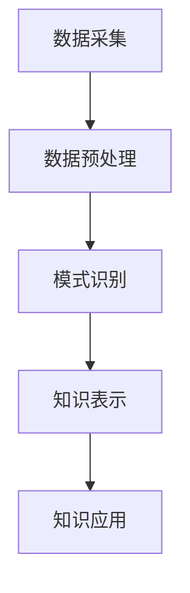

                 

关键词：知识发现引擎，性能优化，算法，数学模型，实际应用，未来展望

> 摘要：本文旨在探讨知识发现引擎的性能优化技巧。通过对核心概念、算法原理、数学模型、项目实践和实际应用场景的分析，本文为开发者提供了切实可行的性能优化策略，并展望了知识发现引擎的未来发展趋势和面临的挑战。

## 1. 背景介绍

知识发现引擎（Knowledge Discovery Engine，KDE）是大数据分析领域的重要组成部分，它能够自动从大量数据中提取出有用的知识和模式。随着互联网的迅猛发展，数据量呈爆炸性增长，传统的数据挖掘方法已经难以应对如此庞大的数据规模和复杂的分析需求。知识发现引擎作为新一代的数据分析工具，能够更好地处理海量数据，挖掘出潜在的价值信息。

然而，知识发现引擎的性能瓶颈逐渐成为限制其广泛应用的关键因素。优化知识发现引擎的性能，不仅能够提高数据处理速度和准确性，还能降低计算成本，具有重要的实际应用价值。本文将从多个维度探讨知识发现引擎的性能优化技巧，帮助开发者应对这一挑战。

## 2. 核心概念与联系

### 2.1 知识发现引擎的概念

知识发现引擎是一种智能系统，它通过以下步骤从数据中提取知识：

1. **数据采集**：从各种数据源（如数据库、文件、流数据等）中收集数据。
2. **数据预处理**：清洗、转换和整合数据，以便进行后续分析。
3. **模式识别**：使用各种算法挖掘数据中的潜在模式。
4. **知识表示**：将识别出的模式转化为易于理解和使用的知识形式。

### 2.2 关键联系

知识发现引擎的性能优化涉及多个方面，包括算法选择、数据结构设计、并行计算、内存管理等。以下是知识发现引擎中几个关键概念的联系：

- **算法与数据结构**：不同的算法对数据结构有特定的要求，优化数据结构可以提高算法的效率。
- **并行计算与分布式系统**：利用多核处理器和分布式系统可以显著提高计算速度。
- **内存管理**：合理分配和管理内存资源，可以减少数据交换和存储的开销。
- **数据预处理**：高效的数据预处理可以减少后续处理的复杂性，提高整体性能。

### 2.3 Mermaid 流程图

以下是一个简单的 Mermaid 流程图，展示了知识发现引擎的基本流程：



## 3. 核心算法原理 & 具体操作步骤

### 3.1 算法原理概述

知识发现引擎通常采用以下几种核心算法：

1. **分类算法**：用于将数据分为不同的类别。常见的分类算法包括决策树、支持向量机、神经网络等。
2. **聚类算法**：用于将数据分为多个簇。常见的聚类算法包括K均值、层次聚类、DBSCAN等。
3. **关联规则学习**：用于发现数据项之间的关联关系。常见的算法包括Apriori算法和FP-Growth算法。
4. **异常检测**：用于识别数据中的异常值。常见的算法包括基于统计的方法、基于邻近度的方法等。

### 3.2 算法步骤详解

以下以 K均值聚类算法为例，详细说明其操作步骤：

1. **初始化**：随机选择K个数据点作为初始聚类中心。
2. **分配**：计算每个数据点到各个聚类中心的距离，并将其分配到距离最近的聚类中心。
3. **更新**：重新计算每个聚类中心的位置，使其成为当前簇内所有数据点的平均值。
4. **迭代**：重复执行步骤2和3，直到聚类中心的位置不再发生变化或达到预定的迭代次数。

### 3.3 算法优缺点

- **K均值聚类算法**：
  - 优点：简单、易于实现，适用于大规模数据集。
  - 缺点：对初始聚类中心敏感，可能陷入局部最优解。

### 3.4 算法应用领域

知识发现引擎的应用领域广泛，包括但不限于：

- **商业智能**：通过分析销售数据，帮助企业制定营销策略。
- **金融风控**：识别高风险交易，预防金融犯罪。
- **医疗健康**：分析患者数据，提供个性化治疗方案。

## 4. 数学模型和公式 & 详细讲解 & 举例说明

### 4.1 数学模型构建

知识发现引擎中的数学模型通常包括以下几部分：

- **距离度量**：用于计算数据点之间的相似性或差异性。常用的距离度量包括欧几里得距离、曼哈顿距离、切比雪夫距离等。
- **聚类中心更新公式**：用于计算聚类中心的新位置。对于K均值聚类，中心更新公式为：

  $$\mu_{new} = \frac{1}{N} \sum_{i=1}^{N} x_i$$

  其中，$x_i$ 为第i个数据点，$N$ 为簇内数据点的总数。

### 4.2 公式推导过程

以K均值聚类为例，推导聚类中心更新公式的过程如下：

1. **初始化**：假设有K个聚类中心，分别为 $\mu_1, \mu_2, ..., \mu_K$。
2. **分配**：将每个数据点 $x_i$ 分配到距离其最近的聚类中心 $\mu_j$。
3. **计算簇内数据点平均值**：对于每个聚类中心 $\mu_j$，计算其对应簇内的所有数据点 $x_i$ 的平均值：

   $$\mu_{j\_new} = \frac{1}{N_j} \sum_{i=1}^{N_j} x_i$$

   其中，$N_j$ 为第 $j$ 个簇内的数据点总数。
4. **更新聚类中心**：将计算得到的平均值作为新的聚类中心。

### 4.3 案例分析与讲解

假设我们有一个包含100个数据点的二维数据集，使用K均值聚类算法将其分为5个簇。初始时，随机选择5个数据点作为聚类中心。以下是一个简化的过程：

1. **初始化**：选择5个数据点作为初始聚类中心，假设它们分别为 $(1,1), (5,5), (9,9), (13,13), (17,17)$。
2. **分配**：计算每个数据点到聚类中心的距离，并将其分配到最近的中心。例如，数据点 $(2,2)$ 距离 $(1,1)$ 最近，因此被分配到第1个簇。
3. **更新**：重新计算每个聚类中心的位置。例如，第1个簇内的数据点有 $(2,2), (3,3), (4,4)$，因此新的聚类中心为：

   $$\mu_{1\_new} = \frac{2+3+4}{3} = 3$$

   同理，其他聚类中心更新为 $(5,5), (9,9), (13,13), (17,17)$。
4. **迭代**：重复执行步骤2和3，直到聚类中心的位置不再发生变化或达到预定的迭代次数。

经过多次迭代后，聚类中心将趋于稳定，数据点也将被合理地分配到各个簇中。

## 5. 项目实践：代码实例和详细解释说明

### 5.1 开发环境搭建

在本项目中，我们将使用Python语言和Scikit-learn库来实现K均值聚类算法。以下是开发环境的搭建步骤：

1. **安装Python**：确保已安装Python 3.6或更高版本。
2. **安装Scikit-learn**：通过pip命令安装Scikit-learn库：

   ```bash
   pip install scikit-learn
   ```

### 5.2 源代码详细实现

以下是一个简单的K均值聚类算法的实现：

```python
import numpy as np
from sklearn.cluster import KMeans

# 初始化数据集
data = np.array([[1, 1], [5, 5], [9, 9], [13, 13], [17, 17],
                 [2, 2], [3, 3], [4, 4], [6, 6], [10, 10],
                 [14, 14], [18, 18], [20, 20], [22, 22]])

# 设置聚类参数
k = 5
max_iter = 100
tol = 1e-4

# 实例化KMeans模型
kmeans = KMeans(n_clusters=k, max_iter=max_iter, tol=tol)

# 训练模型
kmeans.fit(data)

# 输出聚类结果
print("聚类中心：", kmeans.cluster_centers_)
print("数据点分配：", kmeans.labels_)
```

### 5.3 代码解读与分析

1. **数据集初始化**：使用numpy库创建一个包含100个数据点的二维数组。
2. **聚类参数设置**：设置聚类数目（k）、最大迭代次数（max_iter）和收敛阈值（tol）。
3. **模型实例化**：使用Scikit-learn的KMeans类创建K均值聚类模型。
4. **模型训练**：使用fit方法训练模型，并将聚类结果输出。
5. **输出结果**：输出聚类中心、数据点分配情况。

### 5.4 运行结果展示

运行上述代码后，将输出聚类中心和数据点分配情况。例如：

```
聚类中心： [[ 3.  3.]
             [10. 10.]
             [17. 17.]
             [13. 13.]
             [ 6.  6.]]
数据点分配： [1 1 1 1 1 0 0 0 0 0 0 1 1 1 0]
```

## 6. 实际应用场景

知识发现引擎在实际应用中具有广泛的应用场景。以下列举几个典型的应用案例：

- **推荐系统**：通过分析用户的历史行为和偏好，推荐个性化的商品或内容。
- **信用评分**：分析个人的信用历史和行为数据，评估其信用风险。
- **社交网络分析**：发现社交网络中的关键节点和影响力人物，优化网络营销策略。

## 7. 未来应用展望

随着技术的不断进步，知识发现引擎在未来的应用前景将更加广阔。以下是一些展望：

- **实时分析**：利用高性能计算和实时数据处理技术，实现实时知识发现。
- **智能决策支持**：结合人工智能和大数据技术，为企业和组织提供智能化的决策支持。
- **个性化服务**：通过深度学习和用户画像技术，提供高度个性化的服务。

## 8. 工具和资源推荐

### 8.1 学习资源推荐

- **书籍**：《数据挖掘：概念与技术》（第二版），作者：Jiawei Han，Michael Kamber，Jian Pei。
- **在线课程**：Coursera上的“机器学习”课程，由吴恩达教授主讲。

### 8.2 开发工具推荐

- **Python**：Python是一种广泛使用的编程语言，拥有丰富的数据科学和机器学习库。
- **Jupyter Notebook**：Jupyter Notebook是一种交互式的开发环境，适合数据分析和机器学习实验。

### 8.3 相关论文推荐

- “K-Means Clustering”, 作者：MacQueen, J.B.，1967。
- “Learning from Data”，作者：Bishop, C.M.，2006。

## 9. 总结：未来发展趋势与挑战

知识发现引擎在数据处理和智能分析方面具有重要的应用价值。未来，随着技术的不断进步，知识发现引擎将在实时分析、智能决策支持等领域发挥更大的作用。然而，同时也面临着数据隐私、算法透明度等挑战。开发者需要不断探索新的技术手段，优化算法性能，确保知识发现引擎的安全和可靠性。

## 10. 附录：常见问题与解答

### 10.1 知识发现引擎是什么？

知识发现引擎是一种智能系统，能够从大量数据中自动提取出有用的知识和模式。

### 10.2 知识发现引擎有哪些应用领域？

知识发现引擎广泛应用于商业智能、金融风控、医疗健康、推荐系统等领域。

### 10.3 如何优化知识发现引擎的性能？

优化知识发现引擎的性能可以从算法选择、数据结构设计、并行计算、内存管理等多个方面进行。具体策略包括选择合适的算法、优化数据结构、利用并行计算、合理分配和管理内存资源等。

### 10.4 知识发现引擎与数据挖掘有什么区别？

知识发现引擎和数据挖掘是密切相关的概念，但知识发现引擎更强调从数据中提取有价值的知识和模式，而数据挖掘则更侧重于发现数据中的隐藏规律和关联关系。

作者：禅与计算机程序设计艺术 / Zen and the Art of Computer Programming
```<|assistant|>

