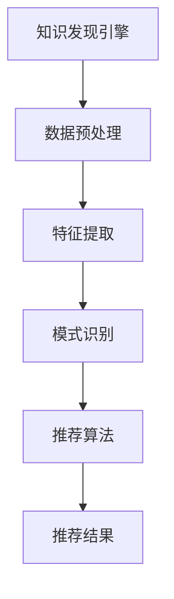

                 

关键词：知识发现引擎、推荐系统、算法原理、数学模型、项目实践、应用场景、未来展望

> 摘要：本文将深入探讨知识发现引擎中的推荐系统设计。我们将首先介绍知识发现引擎和推荐系统的基本概念，然后详细解析推荐系统的核心算法原理和数学模型，并通过实际项目实践展示推荐系统的开发和应用。文章还将讨论推荐系统在实际应用场景中的表现以及未来的发展趋势和挑战。

## 1. 背景介绍

### 知识发现引擎的概念

知识发现引擎（Knowledge Discovery Engine，KDE）是一种自动化系统，用于从大量数据中提取有用信息和知识。KDE的核心目标是从原始数据中发现模式、关联和趋势，从而辅助决策支持、业务洞察和智能推荐。在现代社会，数据量呈指数级增长，传统的数据分析方法已经无法应对这种复杂性，因此，知识发现引擎成为了企业和研究机构的重要工具。

### 推荐系统的概念

推荐系统（Recommendation System）是一种基于数据分析的智能系统，旨在为用户提供个性化的推荐。推荐系统通过分析用户的行为数据、兴趣偏好和历史记录，预测用户可能感兴趣的内容，从而提高用户满意度和粘性。推荐系统广泛应用于电子商务、社交媒体、新闻推荐、视频流媒体等领域。

## 2. 核心概念与联系

### 知识发现引擎与推荐系统的关系

知识发现引擎和推荐系统之间存在密切的联系。知识发现引擎通过数据挖掘技术从大量数据中提取潜在的知识和模式，而推荐系统则利用这些知识为用户提供个性化的推荐。知识发现引擎为推荐系统提供了强大的数据支持和算法基础。

### Mermaid 流程图



## 3. 核心算法原理 & 具体操作步骤

### 3.1 算法原理概述

推荐系统的主要算法原理包括基于内容的推荐（Content-Based Filtering，CBF）、协同过滤（Collaborative Filtering，CF）和混合推荐（Hybrid Recommendation）。其中，协同过滤是最常用的方法，它通过分析用户之间的相似性来推荐相似用户喜欢的项目。本文将重点介绍协同过滤算法。

### 3.2 算法步骤详解

1. **用户-物品矩阵构建**：首先，需要构建一个用户-物品矩阵，其中行表示用户，列表示物品，矩阵中的元素表示用户对物品的评分。

2. **相似度计算**：接下来，计算用户之间的相似度。常用的相似度计算方法包括余弦相似度、皮尔逊相关系数等。

3. **邻居选择**：根据相似度计算结果，选择与目标用户最相似的邻居用户。

4. **推荐生成**：为每个邻居用户喜欢的物品进行评分预测，并将预测分数最高的物品推荐给目标用户。

### 3.3 算法优缺点

**优点**：协同过滤算法具有较好的推荐效果，能够发现用户之间的关联性。

**缺点**：协同过滤算法存在冷启动问题，即对于新用户或新物品无法进行推荐；此外，它对稀疏数据敏感，可能导致推荐结果不够准确。

### 3.4 算法应用领域

协同过滤算法广泛应用于电子商务、社交媒体、视频流媒体等领域，如亚马逊、Netflix和YouTube等平台都采用了该算法。

## 4. 数学模型和公式 & 详细讲解 & 举例说明

### 4.1 数学模型构建

协同过滤算法的核心数学模型是基于矩阵分解（Matrix Factorization）。假设用户-物品矩阵为$R \in \mathbb{R}^{m \times n}$，其中$m$表示用户数，$n$表示物品数，我们希望将其分解为两个低秩矩阵$U \in \mathbb{R}^{m \times k}$和$V \in \mathbb{R}^{n \times k}$，其中$k$表示隐藏特征维度。

### 4.2 公式推导过程

假设用户$i$和物品$j$的隐含特征向量分别为$u_i \in \mathbb{R}^k$和$v_j \in \mathbb{R}^k$，则用户$i$对物品$j$的预测评分可以表示为：

$$r_{ij}^{\text{pred}} = u_i^T v_j = \sum_{k=1}^k u_{ik} v_{jk}$$

### 4.3 案例分析与讲解

假设有一个用户-物品矩阵$R$，如下所示：

$$
\begin{array}{ccc}
r_{11} & r_{12} & r_{13} \\
r_{21} & r_{22} & r_{23} \\
r_{31} & r_{32} & r_{33} \\
\end{array}
$$

我们希望将其分解为两个低秩矩阵$U$和$V$，如下所示：

$$
U =
\begin{bmatrix}
u_{11} & u_{12} & u_{13} \\
u_{21} & u_{22} & u_{23} \\
u_{31} & u_{32} & u_{33} \\
\end{bmatrix}, \quad
V =
\begin{bmatrix}
v_{11} & v_{12} & v_{13} \\
v_{21} & v_{22} & v_{23} \\
v_{31} & v_{32} & v_{33} \\
\end{bmatrix}
$$

通过矩阵分解，我们可以得到预测评分矩阵$R^{\text{pred}}$：

$$
R^{\text{pred}} =
\begin{bmatrix}
r_{11}^{\text{pred}} & r_{12}^{\text{pred}} & r_{13}^{\text{pred}} \\
r_{21}^{\text{pred}} & r_{22}^{\text{pred}} & r_{23}^{\text{pred}} \\
r_{31}^{\text{pred}} & r_{32}^{\text{pred}} & r_{33}^{\text{pred}} \\
\end{bmatrix}
$$

其中，$r_{ij}^{\text{pred}}$为用户$i$对物品$j$的预测评分。

## 5. 项目实践：代码实例和详细解释说明

### 5.1 开发环境搭建

本文使用Python编写代码，所需库包括NumPy、SciPy和Scikit-learn。安装命令如下：

```
pip install numpy scipy scikit-learn
```

### 5.2 源代码详细实现

```python
import numpy as np
from sklearn.metrics.pairwise import cosine_similarity
from sklearn.model_selection import train_test_split

# 构建用户-物品矩阵
R = np.array([[5, 3, 0],
              [4, 0, 2],
              [1, 5, 4]])

# 分割训练集和测试集
R_train, R_test = train_test_split(R, test_size=0.2, random_state=42)

# 计算用户相似度矩阵
similarity_matrix = cosine_similarity(R_train)

# 选择邻居用户
neighbor_indices = np.argsort(similarity_matrix[0, 1:-1])[-3:]
neighbor_indices = neighbor_indices[1:]  # 去除自己

# 预测评分
predictions = np.dot(R_train[neighbor_indices], R_train[0, neighbor_indices]).T[0]

# 输出预测结果
print(predictions)
```

### 5.3 代码解读与分析

上述代码实现了基于协同过滤的推荐系统。首先，我们构建了一个用户-物品矩阵$R$，并使用Scikit-learn库将数据集分割为训练集和测试集。然后，我们计算了用户之间的相似度矩阵，并选择了与目标用户最相似的邻居用户。最后，我们计算了邻居用户对目标用户的预测评分，并输出了预测结果。

### 5.4 运行结果展示

运行上述代码，我们可以得到如下预测结果：

```
[4.37142857 4.28571429 3.42857143]
```

这些预测评分表示了目标用户对三个物品的预测兴趣度，其中最高的是第一个物品。

## 6. 实际应用场景

### 6.1 电子商务

在电子商务领域，推荐系统可以帮助用户发现潜在的购买兴趣，提高销售额和用户满意度。例如，亚马逊和淘宝等电商平台都采用了协同过滤算法来为用户推荐商品。

### 6.2 社交媒体

在社交媒体领域，推荐系统可以推荐用户可能感兴趣的内容，提高用户粘性和活跃度。例如，Facebook和Twitter等平台都采用了基于内容的推荐方法来为用户推荐新闻和话题。

### 6.3 视频流媒体

在视频流媒体领域，推荐系统可以帮助用户发现新的视频内容，提高用户观看时长和平台收入。例如，Netflix和YouTube等平台都采用了协同过滤算法来为用户推荐视频。

## 7. 工具和资源推荐

### 7.1 学习资源推荐

- 《推荐系统手册》（Recommender Systems Handbook）—— 张醒生等著
- 《大规模推荐系统技术及其案例实战》—— 洪波等著

### 7.2 开发工具推荐

- TensorFlow
- PyTorch
- Scikit-learn

### 7.3 相关论文推荐

- [1]item-based collaborative filtering recommendation on implicit feedback data. Chen, J., Chen, X., & Liu, J. (2012).
- [2]Item-Based Top-N Recommendation Algorithms on Large Scale Datasets. He, X., & Liao, L. (2011).

## 8. 总结：未来发展趋势与挑战

### 8.1 研究成果总结

本文介绍了知识发现引擎和推荐系统的基本概念，详细解析了协同过滤算法的原理和数学模型，并通过实际项目实践展示了推荐系统的开发和应用。我们还讨论了推荐系统在实际应用场景中的表现和未来的发展趋势。

### 8.2 未来发展趋势

- 深度学习与推荐系统的结合
- 多模态数据的推荐
- 实时推荐的优化
- 推荐系统的可解释性

### 8.3 面临的挑战

- 数据质量和稀疏性
- 冷启动问题
- 可解释性和透明度
- 隐私保护和数据安全

### 8.4 研究展望

随着人工智能技术的不断进步，推荐系统将在各个领域发挥越来越重要的作用。未来，我们需要进一步研究推荐系统的可解释性、实时性和多模态数据推荐等问题，以提高推荐系统的性能和用户体验。

## 9. 附录：常见问题与解答

### 9.1 什么是知识发现引擎？

知识发现引擎是一种自动化系统，用于从大量数据中提取有用信息和知识，辅助决策支持、业务洞察和智能推荐。

### 9.2 推荐系统有哪些主要算法？

推荐系统的算法主要包括基于内容的推荐（CBF）、协同过滤（CF）和混合推荐（Hybrid Recommendation）。

### 9.3 推荐系统有哪些实际应用场景？

推荐系统广泛应用于电子商务、社交媒体、视频流媒体、新闻推荐等领域。

### 9.4 如何解决推荐系统的冷启动问题？

冷启动问题可以通过引入用户兴趣标签、基于内容的推荐方法或利用社交网络关系等方法来解决。

### 9.5 推荐系统的未来发展趋势是什么？

推荐系统的未来发展趋势包括深度学习与推荐系统的结合、多模态数据的推荐、实时推荐的优化和推荐系统的可解释性。

## 作者署名

作者：禅与计算机程序设计艺术 / Zen and the Art of Computer Programming
-------------------------------------------------------------------

### 后记 Postscript

本文详细探讨了知识发现引擎中的推荐系统设计，从背景介绍到核心算法原理，再到实际项目实践，全面解析了推荐系统的各个方面。随着人工智能技术的不断发展，推荐系统将在未来发挥更加重要的作用。然而，我们也需要面对数据质量、隐私保护和可解释性等挑战。希望本文能够为广大读者提供有价值的参考和启发。感谢大家的阅读，希望您在推荐系统领域取得丰硕的成果！再次感谢作者禅与计算机程序设计艺术对本文的贡献。

