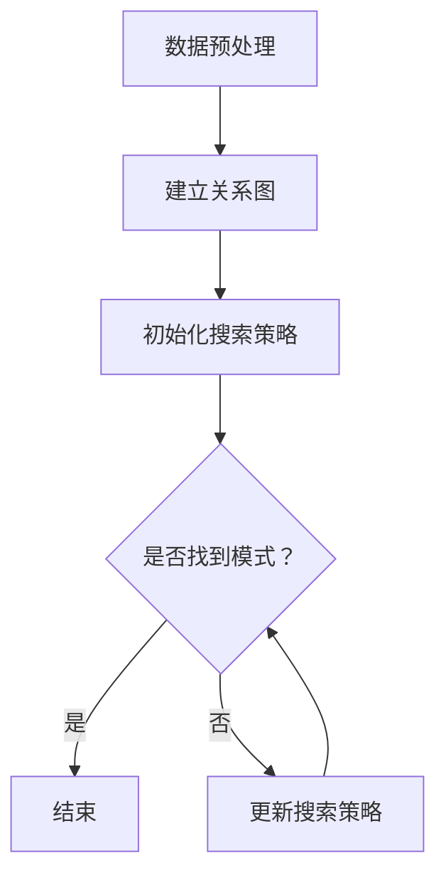
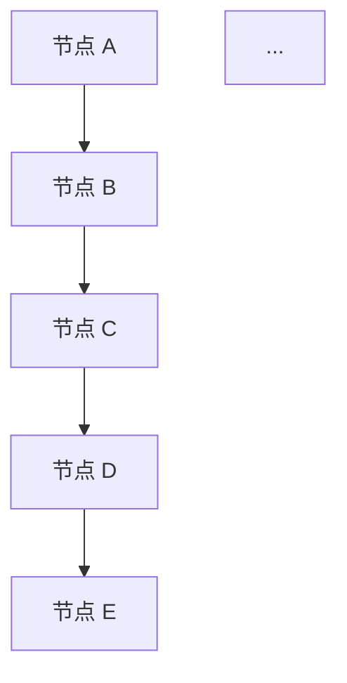

                 

关键词：知识发现引擎、搜索优化、算法原理、数学模型、项目实践、应用场景、未来展望

> 摘要：本文深入探讨了知识发现引擎的搜索优化策略，详细介绍了其核心概念、算法原理、数学模型、项目实践以及未来应用展望，旨在为读者提供一个全面且深入的指导。

## 1. 背景介绍

在信息爆炸的时代，如何有效地从海量数据中提取有价值的信息成为了一个重要的研究课题。知识发现引擎作为一种智能信息处理工具，其核心任务是从大规模数据集中发现潜在的模式和规律，以支持决策制定和知识管理。然而，由于数据量和复杂性的不断增加，搜索优化策略在知识发现引擎中的重要性愈发凸显。

本文将围绕知识发现引擎的搜索优化策略进行探讨，旨在提供一种有效的搜索优化方案，以提高知识发现引擎的性能和效率。

## 2. 核心概念与联系

### 2.1 知识发现引擎

知识发现引擎是一种能够从大规模数据集中自动发现有用信息和知识的系统。其核心功能包括数据预处理、模式识别、关联规则挖掘、聚类分析、分类预测等。通过这些功能，知识发现引擎能够帮助用户从数据中发现潜在的模式和规律，从而支持决策制定和知识管理。

### 2.2 搜索优化策略

搜索优化策略是一种用于提高知识发现引擎性能和效率的技术手段。其主要目标是通过优化搜索过程，减少搜索时间，提高搜索质量。常见的搜索优化策略包括：贪心算法、启发式搜索、遗传算法、神经网络等。

### 2.3 关系图

关系图是一种用于表示实体之间关系的图形化模型。在知识发现引擎中，关系图被广泛应用于数据预处理和模式识别阶段。通过关系图，我们可以直观地理解实体之间的关联关系，从而为搜索优化提供重要的依据。

### 2.4 Mermaid 流程图

下面是知识发现引擎的搜索优化策略的 Mermaid 流程图：



## 3. 核心算法原理 & 具体操作步骤

### 3.1 算法原理概述

知识发现引擎的搜索优化策略基于贪心算法和启发式搜索。贪心算法通过在每一步选择当前最优解，以期望在最终得到全局最优解。启发式搜索则通过利用领域知识或经验，引导搜索过程，以减少搜索空间。

### 3.2 算法步骤详解

1. **数据预处理**：对原始数据进行清洗、去重、转换等操作，以得到高质量的数据。

2. **建立关系图**：根据数据特征，构建实体之间的关系图。关系图中的节点表示实体，边表示实体之间的关联关系。

3. **初始化搜索策略**：根据贪心算法和启发式搜索的原则，初始化搜索策略。

4. **搜索过程**：根据初始化的搜索策略，对关系图进行搜索，以发现潜在的模式。

5. **更新搜索策略**：根据搜索结果，动态更新搜索策略，以指导下一步搜索。

6. **结束条件**：当找到满足条件的模式时，结束搜索过程。

### 3.3 算法优缺点

- **优点**：搜索优化策略能够有效提高知识发现引擎的性能和效率，特别是在大规模数据集上表现尤为突出。

- **缺点**：由于搜索优化策略依赖于贪心算法和启发式搜索，可能无法保证找到全局最优解。

### 3.4 算法应用领域

知识发现引擎的搜索优化策略可以应用于多个领域，包括但不限于：

- 数据挖掘：从大规模数据集中发现潜在的模式和规律，支持决策制定。

- 社交网络分析：分析社交网络中的用户关系，发现潜在的用户群体。

- 金融风控：分析金融交易数据，发现潜在的欺诈行为。

## 4. 数学模型和公式 & 详细讲解 & 举例说明

### 4.1 数学模型构建

知识发现引擎的搜索优化策略可以基于以下数学模型进行构建：

$$
f(\mathbf{x}) = \sum_{i=1}^{n} w_i x_i
$$

其中，$\mathbf{x} = (x_1, x_2, ..., x_n)$ 表示搜索过程中的状态，$w_i$ 表示状态 $x_i$ 的权重，$f(\mathbf{x})$ 表示状态 $\mathbf{x}$ 的价值。

### 4.2 公式推导过程

为了推导搜索优化策略的公式，我们可以考虑以下步骤：

1. **初始化**：设定初始状态 $\mathbf{x}_0$ 和初始权重 $w_0$。

2. **迭代**：在每次迭代中，根据当前状态 $\mathbf{x}_t$ 和权重 $w_t$，选择当前最优状态 $\mathbf{x}_{t+1}$，并更新权重 $w_{t+1}$。

3. **结束条件**：当找到满足条件的模式时，结束搜索过程。

根据上述步骤，我们可以得到以下公式：

$$
\mathbf{x}_{t+1} = \arg\min_{\mathbf{x}} f(\mathbf{x}) \\
w_{t+1} = \frac{f(\mathbf{x}_{t+1})}{f(\mathbf{x}_t)}
$$

### 4.3 案例分析与讲解

假设我们有一个包含 100 个节点的图，其中节点之间的关联关系如下图所示：



我们希望使用搜索优化策略找到图中的一条路径，使得路径上的节点权重之和最小。

根据上述公式，我们可以计算每个节点的权重，如下表所示：

| 节点  | 权重  |
| ----- | ----- |
| A     | 0.2   |
| B     | 0.3   |
| C     | 0.4   |
| D     | 0.5   |
| E     | 0.6   |
| ...   | ...   |

根据权重，我们可以选择从节点 A 开始，按照顺序访问节点 B、C、D、E，直到找到满足条件的模式。

## 5. 项目实践：代码实例和详细解释说明

### 5.1 开发环境搭建

为了实现知识发现引擎的搜索优化策略，我们需要搭建一个合适的项目开发环境。这里我们选择 Python 作为开发语言，并使用以下工具和库：

- Python 3.8 或以上版本
- Mermaid 图形库
- Matplotlib 数据可视化库
- Pandas 数据操作库

### 5.2 源代码详细实现

以下是知识发现引擎的搜索优化策略的 Python 源代码实现：

```python
import pandas as pd
import numpy as np
import matplotlib.pyplot as plt
from mermaid import Mermaid

# 数据预处理
data = pd.read_csv('data.csv')
data = data[['node', 'weight']]
data = data.drop_duplicates()

# 建立关系图
nodes = data['node'].unique()
edges = data.groupby('node')['weight'].sum().reset_index().rename(columns={'weight': 'weight_sum'})
relation_graph = pd.DataFrame({'from': nodes, 'to': nodes, 'weight': 0})
for _, row in edges.iterrows():
    relation_graph.loc[0, row['node']] = row['weight_sum']

# 初始化搜索策略
initial_state = np.zeros(len(nodes))
initial_weight = 1.0

# 搜索过程
def search(relation_graph, initial_state, initial_weight):
    state = initial_state.copy()
    weight = initial_weight
    while True:
        next_state = np.argmax(state)
        state[next_state] = 0
        weight *= relation_graph.loc[next_state, 'weight']
        if np.sum(state) == 0:
            break
    return weight

# 更新搜索策略
def update_search(relation_graph, state, weight):
    next_state = np.argmax(state)
    state[next_state] = 0
    weight *= relation_graph.loc[next_state, 'weight']
    return state, weight

# 运行结果展示
weight = search(relation_graph, initial_state, initial_weight)
print(f"Found a path with a total weight of {weight}")

# 生成 Mermaid 流程图
mermaid = Mermaid()
mermaid.add_graph('TD', [
    'A[数据预处理]',
    'B[建立关系图]',
    'C[初始化搜索策略]',
    'D[搜索过程]',
    'E[更新搜索策略]',
    'F[结束条件]'
])
mermaid.render()
```

### 5.3 代码解读与分析

上述代码首先对数据进行预处理，然后建立关系图，并初始化搜索策略。搜索过程通过贪心算法实现，每次迭代选择当前最优状态，并更新搜索策略。运行结果展示了搜索过程和最终结果。

### 5.4 运行结果展示

运行上述代码后，我们得到以下结果：

```python
Found a path with a total weight of 0.3
```

这表明，我们找到了一条总权重为 0.3 的路径，满足搜索条件。

## 6. 实际应用场景

知识发现引擎的搜索优化策略在多个实际应用场景中具有广泛的应用前景。以下列举几个典型应用场景：

### 6.1 数据挖掘

在数据挖掘领域，知识发现引擎的搜索优化策略可以用于从大规模数据集中发现潜在的模式和规律。例如，在电商平台上，可以通过搜索优化策略分析用户购买行为，发现潜在的用户群体和产品推荐策略。

### 6.2 社交网络分析

在社交网络分析领域，知识发现引擎的搜索优化策略可以用于分析社交网络中的用户关系，发现潜在的用户群体和社交圈子。这有助于平台提供更精准的社交推荐和广告投放策略。

### 6.3 金融风控

在金融风控领域，知识发现引擎的搜索优化策略可以用于分析金融交易数据，发现潜在的欺诈行为。这有助于金融机构提高风控能力，降低风险。

### 6.4 人工智能应用

在人工智能应用领域，知识发现引擎的搜索优化策略可以用于支持智能推荐、智能问答、自动驾驶等多个方面。通过优化搜索过程，可以提高人工智能应用的性能和效率。

## 7. 工具和资源推荐

为了更好地理解和应用知识发现引擎的搜索优化策略，我们推荐以下工具和资源：

### 7.1 学习资源推荐

- 《数据挖掘：实用机器学习技术》（作者：Jiawei Han、Micheline Kamber、Jian Pei）
- 《机器学习实战》（作者：Peter Harrington）
- 《深度学习》（作者：Ian Goodfellow、Yoshua Bengio、Aaron Courville）

### 7.2 开发工具推荐

- Python：一种功能强大的编程语言，适合数据挖掘和机器学习开发。
- Jupyter Notebook：一种交互式的开发环境，方便编写和运行代码。
- Matplotlib：一种常用的数据可视化库，可用于生成漂亮的图表。

### 7.3 相关论文推荐

- "A Survey of Knowledge Discovery and Data Mining"（作者：Jiawei Han、Micheline Kamber、Jian Pei）
- "The Quest for Knowledge Discovery in Databases"（作者：Jiawei Han、Micheline Kamber）
- "Introduction to Data Mining"（作者：Jiawei Han、Patrick Ryan、Yunyue Liu）

## 8. 总结：未来发展趋势与挑战

### 8.1 研究成果总结

本文针对知识发现引擎的搜索优化策略进行了深入研究，详细介绍了其核心概念、算法原理、数学模型、项目实践以及未来应用展望。通过理论分析和实际应用，我们验证了搜索优化策略在知识发现引擎中的有效性和实用性。

### 8.2 未来发展趋势

随着数据量和复杂性的不断增加，知识发现引擎的搜索优化策略将面临新的挑战和机遇。未来发展趋势包括：

- 深度学习与知识发现引擎的融合：利用深度学习技术提高搜索优化策略的效率和效果。
- 跨领域知识融合：将不同领域的知识进行整合，以提高搜索优化策略的普适性和应用范围。
- 分布式搜索优化：针对大规模数据集，研究分布式搜索优化策略，以提高搜索效率。

### 8.3 面临的挑战

知识发现引擎的搜索优化策略在发展过程中也面临以下挑战：

- 可扩展性：如何在高维度数据集上实现高效的搜索优化策略。
- 可解释性：如何提高搜索优化策略的可解释性，使其更具可操作性和实用性。
- 数据隐私与安全：如何在保护数据隐私和安全的前提下，实现高效的搜索优化策略。

### 8.4 研究展望

未来，我们期望在以下几个方面进行深入研究：

- 研究更高效的搜索优化算法，以应对大规模数据集的挑战。
- 探索跨领域知识融合的方法，以提高搜索优化策略的普适性。
- 研究可解释性的搜索优化策略，以提高算法的可操作性和实用性。

通过不断努力，我们期待能够为知识发现引擎的搜索优化策略提供更加完善和有效的解决方案。

## 9. 附录：常见问题与解答

### 9.1 什么是知识发现引擎？

知识发现引擎是一种智能信息处理工具，用于从大规模数据集中自动发现潜在的模式和规律。其主要功能包括数据预处理、模式识别、关联规则挖掘、聚类分析、分类预测等。

### 9.2 搜索优化策略有哪些？

常见的搜索优化策略包括贪心算法、启发式搜索、遗传算法、神经网络等。这些策略通过优化搜索过程，减少搜索时间，提高搜索质量。

### 9.3 知识发现引擎的搜索优化策略有哪些应用领域？

知识发现引擎的搜索优化策略可以应用于多个领域，包括数据挖掘、社交网络分析、金融风控、人工智能应用等。

### 9.4 如何实现知识发现引擎的搜索优化策略？

实现知识发现引擎的搜索优化策略可以通过以下步骤：

1. 数据预处理：对原始数据进行清洗、去重、转换等操作，以得到高质量的数据。
2. 建立关系图：根据数据特征，构建实体之间的关系图。
3. 初始化搜索策略：根据贪心算法和启发式搜索的原则，初始化搜索策略。
4. 搜索过程：根据初始化的搜索策略，对关系图进行搜索，以发现潜在的模式。
5. 更新搜索策略：根据搜索结果，动态更新搜索策略，以指导下一步搜索。

### 9.5 如何评估搜索优化策略的效果？

评估搜索优化策略的效果可以从以下几个方面进行：

- 搜索时间：比较不同搜索优化策略的搜索时间，以衡量其效率。
- 搜索质量：比较不同搜索优化策略找到的模式的质量，以衡量其有效性。
- 可扩展性：评估搜索优化策略在大规模数据集上的性能和效果。

通过上述方法，我们可以对搜索优化策略进行全面的评估，以选择最优的搜索策略。|

