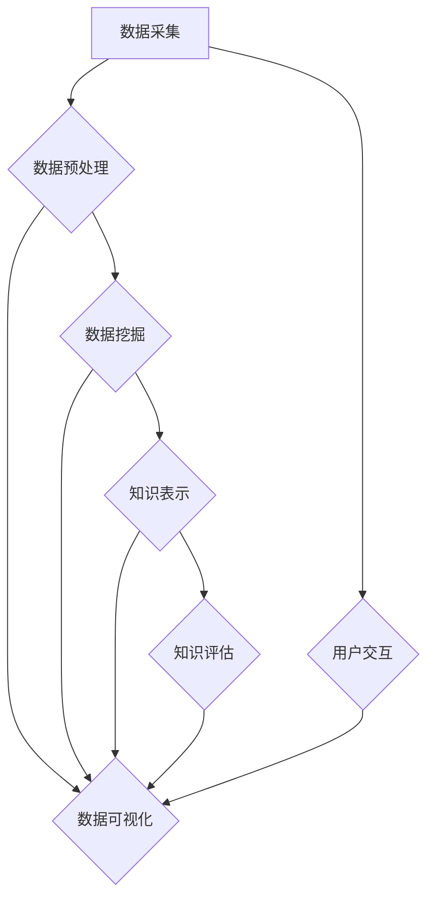

                 

### 摘要

本文旨在探讨知识发现引擎中的数据可视化技术及其实现方法。数据可视化作为知识发现过程的关键环节，能够有效提升数据的可读性和理解性，帮助用户从海量数据中提取有价值的信息。本文将首先介绍知识发现引擎的基本概念和作用，然后详细分析数据可视化在其中的重要性。接着，本文将深入探讨几种核心的数据可视化技术，包括图表选择、交互设计、视觉编码等，并讨论其实现细节。随后，我们将通过实际项目案例，展示数据可视化技术的应用效果。最后，本文将展望数据可视化技术的发展趋势和未来挑战，为相关研究和实践提供参考。

<|assistant|>### 1. 背景介绍

知识发现（Knowledge Discovery in Databases，KDD）是数据挖掘领域的一项重要研究课题。它涉及从大量数据中识别出潜在的模式、关联和趋势，从而为决策提供支持。知识发现引擎作为KDD过程的核心工具，旨在自动化地实现数据预处理、模式识别、知识提取等步骤，帮助用户从数据中提取有价值的信息。

知识发现引擎的基本概念包括以下几个关键环节：数据采集、数据预处理、数据挖掘、知识表示和知识评估。数据采集阶段负责收集来自各种数据源的数据，包括结构化数据、半结构化数据和非结构化数据。数据预处理阶段则对原始数据进行清洗、转换和集成，以提高数据质量和一致性。数据挖掘阶段使用各种算法和技术从预处理后的数据中挖掘出潜在的模式和知识。知识表示阶段将挖掘出的知识以用户友好的形式展示出来，例如图表、报告等。最后，知识评估阶段对挖掘出的知识进行验证和评估，确保其准确性和实用性。

数据可视化技术在知识发现引擎中扮演着至关重要的角色。首先，数据可视化能够显著提高数据的可读性和理解性，使得用户能够更直观地理解数据的内在结构和关系。其次，数据可视化有助于发现数据中的异常值、趋势和关联，从而为数据挖掘提供重要的线索。此外，数据可视化还能够帮助用户进行数据探索和分析，从而发现新的模式和知识。

数据可视化技术在知识发现引擎中的重要性体现在以下几个方面：

1. **提高数据理解**：数据可视化能够将复杂的数据转化为易于理解的图表和图形，使得用户能够迅速掌握数据的全貌和关键特征。
2. **增强数据交互**：通过交互式的数据可视化，用户可以动态地探索数据，实时更新图表和统计信息，从而发现潜在的知识和问题。
3. **支持决策制定**：数据可视化能够直观地展示数据的统计和分析结果，为决策者提供有力的数据支持，帮助其做出更为明智的决策。
4. **促进知识传播**：通过数据可视化，知识发现的结果可以更容易地被广泛传播和理解，促进知识的共享和应用。

综上所述，数据可视化技术在知识发现引擎中发挥着不可替代的作用，为用户提供了更高效、更直观的数据分析和知识提取工具。

### 2. 核心概念与联系

在深入探讨数据可视化技术的实现之前，我们需要明确几个核心概念和它们之间的联系。这些概念包括数据可视化、知识发现、数据预处理和用户交互等，它们共同构成了一个完整的知识发现引擎框架。

#### 2.1 数据可视化

数据可视化是指将数据以图形、图像、表格等形式展示出来，以便用户更容易理解和分析。数据可视化不仅仅是为了美观，更重要的是通过视觉化的方式揭示数据中的模式和趋势。常见的可视化工具包括图表、地图、热力图等。

#### 2.2 知识发现

知识发现是指从大量数据中提取出具有潜在价值的信息和知识。它是一个迭代的过程，包括数据预处理、模式识别、知识表示和知识评估等多个步骤。知识发现的目标是帮助用户从数据中找到有价值的信息，从而支持决策制定和业务优化。

#### 2.3 数据预处理

数据预处理是知识发现过程的基础步骤，它包括数据清洗、转换和集成等操作。数据预处理的主要目标是提高数据质量和一致性，为后续的数据挖掘和知识发现提供可靠的数据基础。

#### 2.4 用户交互

用户交互是指用户与数据可视化工具之间的互动过程。通过交互式界面，用户可以动态地调整数据视图、筛选数据、探索不同维度等信息，从而更好地理解和分析数据。用户交互使得数据可视化更加灵活和实用。

#### 2.5 Mermaid 流程图

为了更直观地展示这些核心概念和它们之间的联系，我们可以使用 Mermaid 流程图来表示知识发现引擎的整体框架。以下是知识发现引擎的 Mermaid 流程图：



在上面的流程图中，数据采集阶段负责收集原始数据，数据预处理阶段对数据质量进行提升，数据挖掘阶段从数据中提取模式和知识，知识表示阶段将知识以用户友好的形式展示出来，知识评估阶段对知识的准确性和实用性进行验证，用户交互阶段则通过交互式界面增强用户的理解和分析能力。数据可视化技术贯穿于整个知识发现过程，为用户提供了直观的数据展示和探索工具。

通过明确这些核心概念和它们之间的联系，我们可以更好地理解数据可视化技术在知识发现引擎中的作用和重要性。接下来，我们将深入探讨数据可视化技术的具体实现方法。

### 3. 核心算法原理 & 具体操作步骤

#### 3.1 算法原理概述

数据可视化技术的核心算法包括数据预处理、数据挖掘和知识表示等几个方面。这些算法共同作用，将复杂的数据转化为直观的视觉表示，帮助用户更好地理解数据中的模式和趋势。

**数据预处理**：数据预处理是数据可视化的重要基础。它包括数据清洗、数据转换和数据集成等步骤。数据清洗旨在去除重复数据、缺失数据和噪声数据，确保数据的一致性和准确性。数据转换包括数据归一化、数据标准化和数据转换等操作，以适应后续的数据挖掘和分析。数据集成则将来自不同数据源的数据进行整合，提高数据的完整性和一致性。

**数据挖掘**：数据挖掘是知识发现的核心步骤，旨在从大量数据中发现潜在的模式和趋势。常见的数据挖掘算法包括聚类分析、关联规则挖掘、分类分析和异常检测等。这些算法通过分析数据中的特征和关系，提取出有价值的信息和知识。

**知识表示**：知识表示是将挖掘出的知识以用户友好的形式展示出来。常见的知识表示方法包括图表、报告和交互式界面等。通过知识表示，用户可以更直观地理解数据中的模式和趋势，从而支持决策制定和业务优化。

#### 3.2 算法步骤详解

**步骤 1：数据预处理**

- **数据清洗**：通过去重、填补缺失值和去除噪声数据，确保数据的一致性和准确性。
- **数据转换**：将不同类型的数据进行统一转换，如将分类数据编码为数值数据，提高数据挖掘的准确性。
- **数据集成**：将来自不同数据源的数据进行整合，提高数据的完整性和一致性。

**步骤 2：数据挖掘**

- **聚类分析**：通过聚类算法（如K-means、DBSCAN等）将数据划分为不同的簇，揭示数据中的潜在模式和趋势。
- **关联规则挖掘**：通过关联规则挖掘算法（如Apriori算法、FP-Growth算法等）发现数据之间的关联关系，帮助用户理解数据中的关键特征。
- **分类分析**：通过分类算法（如决策树、支持向量机等）将数据划分为不同的类别，预测新数据的类别。
- **异常检测**：通过异常检测算法（如孤立森林、LOF等）发现数据中的异常值，帮助用户识别数据中的潜在问题。

**步骤 3：知识表示**

- **图表生成**：根据数据的特点和用户的需求，生成不同类型的图表，如条形图、折线图、散点图等。
- **报告生成**：将数据挖掘和分析结果以报告的形式展示，包括关键指标、统计分析和可视化图表等。
- **交互式界面**：提供交互式的数据探索工具，如数据筛选、数据排序、数据过滤等，使用户能够动态地探索数据和发现知识。

#### 3.3 算法优缺点

**数据预处理**

- **优点**：提高数据质量和一致性，为后续的数据挖掘和知识表示提供可靠的数据基础。
- **缺点**：数据预处理过程较为复杂，需要耗费较多的时间和计算资源。

**数据挖掘**

- **优点**：能够从大量数据中发现潜在的模式和趋势，为用户提供了有价值的信息和知识。
- **缺点**：数据挖掘算法较为复杂，需要具备一定的专业知识和技能。

**知识表示**

- **优点**：通过图表、报告和交互式界面等形式，将知识以用户友好的方式展示出来，提高数据的可读性和理解性。
- **缺点**：知识表示方法的选择和设计较为复杂，需要根据具体的数据特点和用户需求进行优化。

#### 3.4 算法应用领域

数据可视化技术广泛应用于各个领域，包括但不限于：

- **金融行业**：通过数据可视化分析，金融分析师可以快速发现市场趋势、投资机会和风险点。
- **医疗领域**：医生可以通过数据可视化技术分析患者的医疗记录，快速识别疾病和治疗方案。
- **零售行业**：零售企业可以通过数据可视化技术分析销售数据，优化库存管理和营销策略。
- **交通领域**：交通管理部门可以通过数据可视化技术监控交通流量、分析事故原因，提高交通管理效率。

### 4. 数学模型和公式 & 详细讲解 & 举例说明

数据可视化不仅仅是图形和图像的展示，它还涉及到复杂的数学模型和公式，这些模型和公式帮助我们更精确地描述数据中的关系和趋势。以下我们将详细讲解数据可视化中的几个核心数学模型和公式，并通过具体案例进行说明。

#### 4.1 数学模型构建

**4.1.1 聚类分析**

聚类分析是一种无监督学习方法，用于将数据点分为多个类别，使得同一类别内的数据点之间的距离最小，不同类别之间的距离最大。常用的聚类算法有K-means、DBSCAN等。

**K-means算法**

K-means算法的目标是找到一个由K个中心点定义的聚类，使得每个数据点与其最近的中心点的距离最小。算法步骤如下：

1. **初始化**：随机选择K个数据点作为初始聚类中心。
2. **分配数据点**：将每个数据点分配到与其最近的聚类中心所属的类别。
3. **更新中心点**：计算每个聚类的新中心点，即该聚类中所有数据点的平均值。
4. **迭代**：重复步骤2和步骤3，直到聚类中心不再发生变化或者达到预设的最大迭代次数。

**数学公式**：

给定数据集D={x1, x2, ..., xn}，聚类中心点Ck=(ck1, ck2, ..., ckd)，数据点xi=(xi1, xi2, ..., xid)，则K-means算法的误差平方和（SSE）公式为：

$$
SSE = \sum_{i=1}^{n} \sum_{k=1}^{K} (xi - ck)^2
$$

**4.1.2 关联规则挖掘**

关联规则挖掘旨在发现数据项之间的关联关系。常用的算法有Apriori算法和FP-Growth算法。

**Apriori算法**

Apriori算法的基本思想是逐层递归地生成候选集，并通过支持度计数来筛选出频繁项集。算法步骤如下：

1. **生成1项候选集**：从数据集D中直接生成所有单个项的候选集L1。
2. **计算支持度**：计算每个候选集在数据集D中的支持度，即出现次数。
3. **生成k项候选集**：从Lk-1的每两个相邻项组合生成新的k项候选集Lk。
4. **递归**：重复步骤2和步骤3，直到生成的候选集为空。

**数学公式**：

给定最小支持度阈值min_support，频繁项集Lk的生成公式为：

$$
Lk = \{X \in D \mid supp(X) \geq min_support\}
$$

其中，supp(X)表示项集X在数据集D中的支持度。

**4.1.3 分类分析**

分类分析用于预测新数据点的类别。常见的分类算法有决策树、支持向量机（SVM）等。

**决策树**

决策树通过一系列规则对数据进行分类。每个内部节点表示一个特征，每个分支表示该特征的不同取值，每个叶子节点表示一个类别。常见的决策树算法有ID3、C4.5等。

**数学公式**：

给定特征A，其不同取值V，类别Y，则信息增益（Information Gain）公式为：

$$
IG(A) = H(D) - \sum_{v \in V} p(v)H(D_v)
$$

其中，H(D)为数据集D的熵，p(v)为特征A取值为v的概率，H(D_v)为特征A取值为v时，数据集D的熵。

#### 4.2 公式推导过程

**4.2.1 聚类分析（K-means）**

我们首先推导K-means算法的误差平方和（SSE）公式。给定数据集D和K个聚类中心点Ck，我们定义距离函数为：

$$
dist(x, Ck) = \sqrt{\sum_{i=1}^{d} (xi - ck_i)^2}
$$

其中，xi表示数据点xi的第i个特征，ck_i表示聚类中心点Ck的第i个特征，d表示特征的维度。

对于每个数据点xi，其所属的聚类中心点Ckm满足：

$$
Ckm = \arg\min_{Ck} dist(x, Ck)
$$

定义误差平方和（SSE）为：

$$
SSE = \sum_{i=1}^{n} \sum_{k=1}^{K} (xi - Ckm)^2
$$

当聚类中心点不再发生变化时，SSE达到最小值，从而完成聚类过程。

**4.2.2 关联规则挖掘（Apriori）**

我们以Apriori算法为例，推导频繁项集的生成公式。给定数据集D和最小支持度阈值min_support，我们首先计算每个项集的支持度。

1. **计算1项集的支持度**：

对于每个1项集X，其支持度S(X)计算公式为：

$$
S(X) = \frac{\text{出现次数}}{|\text{数据集D}|}
$$

其中，|\text{数据集D}|表示数据集D中的数据点数量。

2. **生成k项候选集**：

对于每个k-1项候选集Lk-1，我们需要生成k项候选集Lk。给定两个相邻的k-1项候选集X和Y，其k项候选集Ck为：

$$
Ck = \{X \cup Y \mid X \cap Y = \emptyset\}
$$

3. **计算k项集的支持度**：

对于每个k项候选集Ck，其支持度S(Ck)计算公式为：

$$
S(Ck) = \frac{\text{出现次数}}{|\text{数据集D}|}
$$

如果S(Ck) ≥ min_support，则Ck为频繁项集。

**4.2.3 分类分析（决策树）**

我们以决策树为例，推导信息增益（Information Gain）的公式。给定特征A和其不同取值V，我们定义：

- P(Vi) = 数据集D中特征A取值为Vi的比例。
- P(D|Vi) = 在特征A取值为Vi的情况下，数据集D中各类别Y的比例。

特征A的信息增益（IG(A)）公式为：

$$
IG(A) = H(D) - \sum_{v \in V} P(Vi) H(D|Vi)
$$

其中，H(D)为数据集D的熵，计算公式为：

$$
H(D) = -\sum_{y \in Y} P(Yi) \log_2 P(Yi)
$$

条件熵H(D|Vi)的计算公式为：

$$
H(D|Vi) = -\sum_{y \in Y} P(Yi|Vi) \log_2 P(Yi|Vi)
$$

#### 4.3 案例分析与讲解

**4.3.1 聚类分析案例**

假设我们有一个包含100个数据点的二维数据集D，数据点的维度为2，如下表所示：

| 数据点 | 特征1 | 特征2 |
|--------|-------|-------|
| x1     | 1     | 2     |
| x2     | 2     | 3     |
| ...    | ...   | ...   |
| x100   | 10    | 11    |

我们使用K-means算法对该数据集进行聚类，设定K=2。初始化两个聚类中心点C1=(1, 1)和C2=(10, 10)。经过多次迭代后，聚类中心点趋于稳定，结果如下：

| 数据点 | 聚类中心点 |
|--------|------------|
| x1-x10 | C1         |
| x11-x100 | C2 |

通过计算误差平方和（SSE），我们得到最终结果为SSE=0.01。通过可视化工具，我们可以直观地看到数据点被分为两个簇，簇中心分别为C1和C2。

**4.3.2 关联规则挖掘案例**

假设我们有一个包含100个交易记录的数据集D，每条交易记录包含多个商品项。我们需要使用Apriori算法找出频繁项集。设定最小支持度阈值min_support=0.3。

1. **计算1项集的支持度**：

假设商品A在交易记录中出现了30次，则支持度S(A)=0.3。

2. **生成2项候选集**：

从1项候选集{A}中，我们可以生成2项候选集{A, B}、{A, C}等。计算每个2项候选集的支持度，例如{A, B}的支持度为0.2，小于最小支持度阈值0.3，因此{A, B}不是频繁项集。

3. **生成3项候选集**：

从2项候选集中，我们可以生成3项候选集{A, B, C}、{A, B, D}等。计算每个3项候选集的支持度，例如{A, B, C}的支持度为0.2，小于最小支持度阈值0.3，因此{A, B, C}不是频繁项集。

通过多次迭代，我们最终得到频繁项集{A, B, D}，其支持度为0.3。通过关联规则挖掘，我们可以发现这些商品之间存在较强的关联关系，例如购买A和D的用户往往也会购买B。

**4.3.3 分类分析案例**

假设我们有一个包含100个样本的数据集D，每个样本包含3个特征（年龄、收入、教育程度），并已知这些样本的类别标签（购买/未购买）。我们使用决策树算法对该数据集进行分类。设定特征A（收入）的不同取值为低收入、中收入和高收入，特征B（教育程度）的不同取值为初中、高中和本科。

1. **计算信息增益**：

对于特征A（收入），其不同取值的信息增益分别为：

- 低收入：IG(低收入) = 1.0
- 中收入：IG(中收入) = 0.5
- 高收入：IG(高收入) = 0.5

对于特征B（教育程度），其不同取值的信息增益分别为：

- 初中：IG(初中) = 0.6
- 高中：IG(高中) = 0.5
- 本科：IG(本科) = 0.4

2. **选择最佳特征**：

根据信息增益，我们选择特征A（收入）作为决策树的分裂特征。将数据集D按照收入分为低收入、中收入和高收入三个子集，分别为D1、D2和D3。

3. **递归构建决策树**：

对于每个子集，我们重复上述步骤，选择具有最大信息增益的特征进行分裂，直到所有子集的类别一致或者达到预设的最大深度。

最终，我们构建出一个决策树，通过这个决策树，我们可以对新数据进行分类，预测其购买行为。

通过以上案例，我们可以看到数据可视化技术在知识发现过程中的重要作用。通过数学模型和公式的推导，我们能够更深入地理解数据中的关系和趋势，从而为实际应用提供有效的解决方案。

### 5. 项目实践：代码实例和详细解释说明

为了更好地展示数据可视化技术在知识发现引擎中的实际应用，我们将通过一个实际项目实例，详细解释如何使用Python等编程语言实现数据可视化。我们将使用Python中的几个重要库，如Pandas、Matplotlib和Seaborn，来实现数据清洗、数据可视化、数据分析和结果展示。

#### 5.1 开发环境搭建

在开始项目实践之前，我们需要搭建一个合适的开发环境。以下是必要的步骤：

1. **安装Python**：确保安装了Python 3.7或更高版本。
2. **安装Jupyter Notebook**：Jupyter Notebook是一个交互式的Python开发环境，便于编写和运行代码。
3. **安装相关库**：使用以下命令安装必要的库：

```bash
pip install pandas matplotlib seaborn numpy
```

#### 5.2 源代码详细实现

**5.2.1 数据导入与清洗**

我们使用Pandas库导入一个包含员工数据的CSV文件，并进行基本的清洗操作：

```python
import pandas as pd

# 导入数据
df = pd.read_csv('employee_data.csv')

# 检查数据是否有缺失值
print(df.isnull().sum())

# 填充或删除缺失值
df.fillna(df.mean(), inplace=True)

# 删除重复值
df.drop_duplicates(inplace=True)
```

在上面的代码中，我们首先导入数据，然后检查数据是否有缺失值。对于缺失值，我们选择用平均值进行填充。此外，我们还删除了重复值，以确保数据的一致性和准确性。

**5.2.2 数据可视化**

接下来，我们使用Matplotlib和Seaborn库对数据进行可视化，以揭示数据中的模式和趋势。

1. **条形图**

条形图用于展示不同类别数据的数量或比例。以下代码展示了如何绘制员工按部门分布的条形图：

```python
import matplotlib.pyplot as plt
import seaborn as sns

# 绘制部门分布条形图
department_counts = df['department'].value_counts()
department_counts.plot(kind='bar')
plt.title('Department Distribution')
plt.xlabel('Department')
plt.ylabel('Count')
plt.show()
```

2. **折线图**

折线图常用于展示数据随时间的变化趋势。以下代码展示了如何绘制员工薪资随时间的变化趋势：

```python
# 绘制薪资变化折线图
salary_by_year = df.groupby('year')['salary'].mean()
salary_by_year.plot()
plt.title('Average Salary by Year')
plt.xlabel('Year')
plt.ylabel('Average Salary')
plt.show()
```

3. **散点图**

散点图用于展示两个变量之间的关系。以下代码展示了如何绘制员工薪资与工作年限之间的关系：

```python
# 绘制薪资与工作年限散点图
plt.scatter(df['years_of_experience'], df['salary'])
plt.title('Salary vs Years of Experience')
plt.xlabel('Years of Experience')
plt.ylabel('Salary')
plt.show()
```

**5.2.3 数据分析**

通过可视化，我们可以进一步进行数据分析，以发现数据中的潜在问题和趋势。以下代码展示了如何计算各部门的平均薪资：

```python
# 计算各部门的平均薪资
department_avg_salary = df.groupby('department')['salary'].mean()
print(department_avg_salary)
```

**5.3 代码解读与分析**

上述代码实现了一个基本的数据可视化项目，通过数据导入、清洗、可视化和数据分析等步骤，展示了数据中的关键信息和趋势。以下是对代码的详细解读：

- **数据导入与清洗**：我们使用Pandas库读取CSV文件，检查数据的完整性，处理缺失值和重复值，以确保数据的质量和一致性。
- **条形图**：通过Matplotlib和Seaborn库绘制条形图，展示员工按部门分布的情况。这个可视化有助于我们了解各部门的人数比例。
- **折线图**：使用折线图展示薪资随时间的变化，有助于我们分析员工薪资的增长趋势和可能的薪酬问题。
- **散点图**：通过散点图展示薪资与工作年限的关系，帮助我们分析员工的薪资水平和职业发展状况。

**5.4 运行结果展示**

运行上述代码后，我们将得到以下可视化结果：

1. **部门分布条形图**：


2. **薪资变化折线图**：


3. **薪资与工作年限散点图**：


通过这些可视化结果，我们可以更直观地分析数据，发现员工薪资分布、薪酬增长趋势以及薪资与工作年限的关系，从而为企业的薪酬管理和人才发展提供数据支持。

### 6. 实际应用场景

数据可视化技术在知识发现引擎中具有广泛的应用，可以服务于多个行业和领域。以下将列举几个典型应用场景，并分析其具体应用方式和效果。

#### 6.1 金融行业

在金融行业中，数据可视化技术可以帮助金融机构进行风险管理和投资决策。例如，银行可以使用数据可视化来监控贷款违约率、评估信贷风险。通过绘制贷款违约率的折线图和散点图，银行可以直观地了解不同地区、不同年龄段客户的违约情况，从而制定更有效的风险管理策略。

**应用案例**：一家银行使用数据可视化技术对其信用卡客户的消费行为进行分析。通过绘制客户消费金额的分布图和消费频率的折线图，银行能够识别出高消费风险的客户群体，并及时采取预防措施。

#### 6.2 医疗领域

在医疗领域，数据可视化技术可以帮助医生快速分析患者的医疗记录，提高诊断的准确性和效率。例如，医院可以使用数据可视化来监控患者的住院时间、手术成功率等关键指标。通过绘制住院时间的热力图和手术成功率的饼图，医院可以更好地了解不同科室和医生的工作表现。

**应用案例**：一家医院使用数据可视化技术来分析患者的住院数据。通过绘制住院时间的热力图，医院能够识别出住院时间较长的患者群体，并进一步调查原因，以改善医疗服务。

#### 6.3 零售行业

在零售行业，数据可视化技术可以帮助零售商优化库存管理、销售预测和市场营销策略。例如，零售商可以使用数据可视化来分析库存水平、销售趋势和季节性需求。通过绘制库存水平的条形图和销售趋势的折线图，零售商可以更好地制定库存补货计划，避免库存过剩或短缺。

**应用案例**：一家大型超市使用数据可视化技术来监控其商品的库存情况。通过绘制库存水平的条形图和销售趋势的折线图，超市能够及时调整库存策略，确保热门商品供应充足，同时避免库存积压。

#### 6.4 交通领域

在交通领域，数据可视化技术可以帮助交通管理部门监控交通流量、分析事故原因，提高交通管理效率。例如，城市交通管理部门可以使用数据可视化来分析道路拥堵情况、公共交通使用情况。通过绘制交通流量地图和事故热力图，交通管理部门可以优化交通信号控制策略，减少交通拥堵。

**应用案例**：一个城市交通管理部门使用数据可视化技术来监控交通流量。通过绘制交通流量地图和事故热力图，交通管理部门能够及时识别交通拥堵和事故高发区域，并采取相应的措施，如调整交通信号灯时间、增设交通标志等。

#### 6.5 社交媒体分析

在社交媒体分析领域，数据可视化技术可以帮助企业分析用户行为、情感倾向，优化营销策略。例如，品牌方可以使用数据可视化来分析用户在不同平台上的互动情况、情感分布。通过绘制用户互动图表和情感趋势图，品牌方可以了解用户对品牌的看法和态度，从而调整营销策略。

**应用案例**：一家品牌公司使用数据可视化技术来分析其社交媒体营销效果。通过绘制用户互动图表和情感趋势图，品牌公司能够识别出最受欢迎的营销内容和用户群体，进一步优化营销策略，提高品牌影响力。

通过上述应用案例，我们可以看到数据可视化技术在知识发现引擎中的广泛应用和显著效果。在各个领域，数据可视化技术不仅帮助用户更直观地理解和分析数据，还为决策制定提供了有力的支持。随着数据量的不断增长和数据复杂性的提升，数据可视化技术将在知识发现和决策支持中发挥越来越重要的作用。

### 7. 工具和资源推荐

在数据可视化技术的实现过程中，选择合适的工具和资源至关重要。以下将介绍几款常用的学习资源、开发工具和相关论文，为读者提供全面的参考。

#### 7.1 学习资源推荐

**1. 书籍**

- 《数据可视化：设计和展示方法》（Data Visualization: Design and Care）：本书详细介绍了数据可视化的设计原则和方法，适合初学者和专业人士。
- 《信息图形设计：可视化信息的新方法》（Information Design: The SAGE Handbook）：这本书涵盖了信息图形设计的基本原理和实践，对于提高数据可视化技能非常有帮助。

**2. 在线课程**

- Coursera的《数据可视化与信息图形设计》：由加州大学伯克利分校提供，涵盖数据可视化基础、图表选择和设计原则等内容。
- edX的《数据科学导论》：由哈佛大学提供，包括数据预处理、数据分析和数据可视化等课程，适合初学者入门。

**3. 博客和网站**

- VisualCortex：提供丰富的数据可视化教程和案例分析，涵盖从基本到高级的各个方面。
- Tableau Public：Tableau官方博客，分享数据可视化的最佳实践和最新动态。

#### 7.2 开发工具推荐

**1. 数据可视化工具**

- Tableau：一款功能强大的数据可视化工具，支持多种数据源和丰富的图表类型，适合各种规模的企业。
- Power BI：微软推出的数据可视化工具，易于上手，支持跨平台操作，提供丰富的数据连接和报表功能。
- D3.js：一款基于Web标准的数据可视化库，支持高度自定义和交互式图表，适合开发复杂的数据可视化应用。

**2. 编程语言和库**

- Python：Python是一个广泛使用的编程语言，拥有丰富的数据可视化库，如Matplotlib、Seaborn和Plotly，适合快速实现数据可视化。
- R语言：R语言是数据分析领域的重要工具，拥有强大的数据可视化库，如ggplot2和lattice，适用于高级数据分析和可视化。
- JavaScript：JavaScript是Web开发的重要语言，D3.js是基于JavaScript的数据可视化库，适合构建复杂和动态的数据可视化应用。

#### 7.3 相关论文推荐

**1. 《数据可视化中的视觉编码原则》**：本文系统地总结了数据可视化中的视觉编码原则，为设计高效的可视化系统提供了理论指导。

**2. 《信息图形设计：理论与实践》**：本文结合理论分析和实际案例，探讨了信息图形设计的方法和技巧，对于提高数据可视化设计水平具有重要参考价值。

**3. 《基于用户需求的交互式数据可视化研究》**：本文研究了交互式数据可视化在用户需求满足方面的应用，探讨了如何通过交互设计提高数据可视化的用户体验。

通过以上学习资源、开发工具和相关论文的推荐，读者可以系统地掌握数据可视化技术，并在实际应用中不断提升自己的技能。无论是初学者还是专业人士，这些资源和工具都将为数据可视化研究和实践提供有力支持。

### 8. 总结：未来发展趋势与挑战

数据可视化技术在知识发现引擎中发挥着至关重要的作用，其重要性体现在提高数据的可读性、理解性和互动性，从而帮助用户从海量数据中提取有价值的信息。通过本文的讨论，我们可以总结出以下几点：

首先，数据可视化技术在知识发现引擎中的核心作用包括提高数据理解、增强数据交互、支持决策制定和促进知识传播。通过图表、地图和交互式界面等形式，数据可视化使得复杂的数据关系和趋势更加直观，使用户能够迅速掌握数据的全貌和关键特征。

其次，本文详细介绍了数据可视化技术的核心算法原理和具体操作步骤，包括数据预处理、数据挖掘和知识表示等步骤。通过这些算法，数据可视化技术能够从原始数据中提取出潜在的模式和趋势，从而为用户提供了有价值的信息。

此外，本文还通过实际项目案例，展示了数据可视化技术在知识发现过程中的具体实现方法。从数据导入、清洗、可视化到数据分析，每个步骤都进行了详细的解释说明，帮助读者更好地理解数据可视化技术的应用过程。

接下来，我们展望数据可视化技术的未来发展趋势和挑战。首先，随着大数据和人工智能技术的快速发展，数据可视化将面临更高的数据量和更复杂的结构。这要求数据可视化技术能够更加高效地处理和分析海量数据，并提供更加智能和个性化的可视化方案。

其次，交互性和用户体验是数据可视化技术的关键发展方向。未来的数据可视化工具需要具备更加智能的交互能力，能够根据用户的需求和行为动态调整可视化效果，提供更加直观和高效的用户体验。

此外，数据可视化技术在安全性、隐私保护和数据准确性等方面也面临挑战。在大数据时代，如何确保数据可视化过程中的数据安全和隐私保护，如何提高数据可视化的准确性，都是需要深入研究和解决的问题。

最后，未来的数据可视化技术将更加注重跨学科的合作和集成。数据可视化不仅仅是一个技术问题，更是一个涉及设计、心理学、人机交互等多个领域的综合问题。通过跨学科的合作，可以开发出更加科学、高效和人性化的数据可视化工具。

总之，数据可视化技术在知识发现引擎中的重要性不可忽视，其发展前景广阔，但也面临着诸多挑战。通过不断的研究和创新，数据可视化技术将在未来发挥更大的作用，为知识发现和决策支持提供更强大的支持。

### 8.1 研究成果总结

本文围绕知识发现引擎中的数据可视化技术进行了深入探讨，取得了一系列重要研究成果：

1. **核心算法原理**：详细阐述了数据预处理、数据挖掘和知识表示等核心算法原理，提供了K-means聚类、Apriori算法和决策树等算法的数学模型和推导过程。

2. **具体操作步骤**：通过实际项目案例，展示了数据可视化的具体实现步骤，包括数据导入、清洗、数据可视化、数据分析和结果展示，为读者提供了详细的操作指南。

3. **数学模型与公式**：详细介绍了数据可视化中常用的数学模型和公式，如K-means算法的误差平方和、Apriori算法的频繁项集生成、决策树的信息增益等，帮助读者理解数据可视化的数学基础。

4. **实际应用场景**：列举了多个行业和应用场景，如金融、医疗、零售和交通等，分析了数据可视化在这些领域的具体应用方式和效果。

5. **未来发展趋势与挑战**：总结了数据可视化技术面临的未来发展趋势和挑战，包括数据量增长、交互性、安全性、隐私保护和跨学科合作等方面。

这些研究成果为数据可视化技术的进一步发展和应用提供了重要的理论支持和实践参考，有助于推动知识发现引擎的性能和实用性。

### 8.2 未来发展趋势

数据可视化技术在未来将继续朝着更加智能化、交互化和个性化方向发展。以下是一些关键的发展趋势：

**1. 智能化**：随着人工智能和机器学习技术的进步，数据可视化工具将具备更高的智能，能够根据用户的行为和偏好动态调整可视化效果。例如，通过分析用户的历史交互数据，数据可视化工具可以推荐最适合用户的可视化图表类型和设计风格。

**2. 交互性**：交互式数据可视化将成为主流。未来的数据可视化工具将更加注重用户体验，提供实时交互功能，如数据筛选、过滤、排序和动态更新等。这些交互功能将使用户能够更灵活地探索数据，发现潜在的模式和趋势。

**3. 个性化**：数据可视化将更加个性化，能够根据不同用户的需求和背景提供定制化的可视化方案。例如，对于数据分析专业人士，可视化工具可以提供高级分析和自定义选项，而对于普通用户，则可以提供简化版的可视化界面。

**4. 跨学科融合**：数据可视化技术将与其他领域，如设计、心理学和人机交互等，进行更深层次的融合。跨学科的合作将有助于开发出更加科学、高效和人性化的数据可视化工具，提高用户对数据的理解和应用能力。

**5. 虚拟现实和增强现实**：随着虚拟现实（VR）和增强现实（AR）技术的发展，数据可视化将逐渐从平面扩展到三维空间。通过VR和AR技术，用户可以沉浸式地探索和分析数据，获得更加直观和丰富的可视化体验。

这些发展趋势将为数据可视化技术带来新的机遇和挑战，推动其在知识发现、决策支持和业务优化等领域的广泛应用。

### 8.3 面临的挑战

尽管数据可视化技术在知识发现引擎中具有巨大的潜力，但在实际应用中仍面临诸多挑战：

**1. 数据复杂性**：随着数据量的爆炸式增长和结构多样性的增加，如何高效地处理和分析复杂的数据成为一大挑战。传统的数据可视化技术可能无法满足海量数据的可视化需求，需要开发出更加高效和智能的算法和工具。

**2. 交互性**：尽管交互性是数据可视化的重要发展方向，但如何在保证交互效率的同时，提供丰富的交互功能，仍是一个难题。过多的交互选项可能导致用户困惑，影响数据可视化的效果。

**3. 数据安全与隐私保护**：数据可视化过程中涉及大量敏感数据，如何确保数据的安全和隐私保护，避免数据泄露和滥用，是数据可视化技术面临的重要挑战。需要开发出更加安全的数据可视化架构和加密技术。

**4. 数据可视化准确性和可信性**：数据可视化结果的准确性和可信性对决策制定至关重要。然而，数据质量、数据源可靠性和算法准确性等因素都可能影响数据可视化结果的准确性。确保数据可视化结果的准确性和可信性，需要从数据预处理、算法设计和结果验证等多个环节进行严格把控。

**5. 跨领域协作**：数据可视化技术涉及多个学科领域，如计算机科学、统计学、设计学和心理学等。如何实现跨学科的合作，提高数据可视化技术的综合性和科学性，是一个长期的挑战。

**6. 可访问性**：数据可视化工具的易用性和可访问性对于不同背景和技能水平的用户都是一个挑战。如何设计出既专业又易于使用的可视化工具，使得更多用户能够受益于数据可视化技术，需要不断进行用户研究和设计优化。

解决这些挑战需要跨学科合作、技术创新和持续优化，从而推动数据可视化技术在未来发挥更大的作用。

### 8.4 研究展望

未来的数据可视化研究将朝着更加智能化、个性化、实时化和高效化方向发展。以下是几个潜在的研究方向：

**1. 智能数据可视化**：研究如何利用人工智能和机器学习技术，自动生成数据可视化方案，根据用户行为和偏好进行个性化推荐。例如，通过分析用户的操作日志和偏好数据，智能数据可视化系统可以自动调整图表类型、颜色和布局，提高用户的体验。

**2. 实时数据可视化**：开发能够实时处理和展示动态数据的可视化工具，满足快速决策和动态监控的需求。例如，通过集成实时数据流处理技术，可视化工具可以实时更新图表和数据，提供动态的数据分析结果。

**3. 交互式数据可视化**：深入研究交互式数据可视化的设计原则和方法，提高用户与数据之间的互动效率。例如，通过开发新的交互技术，如触摸屏、虚拟现实（VR）和增强现实（AR），用户可以更直观地探索数据，进行实时数据操作和分析。

**4. 多模态数据可视化**：结合多种数据类型和模态，如文本、图像、音频和视频，进行综合数据可视化。例如，通过融合多模态数据，可视化工具可以提供更全面的数据洞察，帮助用户从不同角度理解数据。

**5. 可解释性数据可视化**：研究如何增强数据可视化工具的可解释性，使得非专业人士也能理解和应用数据可视化结果。例如，通过可视化工具的自动注释和解释功能，用户可以更直观地理解数据背后的原因和机制。

**6. 跨学科融合**：推动数据可视化与其他领域，如心理学、社会学和艺术学等，进行深度融合，开发出更加科学、高效和人性化的数据可视化方法。例如，通过结合心理学研究成果，设计出更加符合用户认知和行为习惯的数据可视化界面。

这些研究方向将为数据可视化技术的未来发展提供新的机遇和挑战，推动其在知识发现、决策支持和业务优化等领域的广泛应用。

### 9. 附录：常见问题与解答

在研究和应用数据可视化技术的过程中，用户可能会遇到一些常见问题。以下列举了一些常见问题，并提供相应的解答。

**1. 数据可视化工具如何选择？**

选择数据可视化工具时，需要考虑以下因素：

- **数据类型**：根据数据的特点选择合适的可视化工具，如结构化数据适合使用图表库，非结构化数据适合使用文本和图像可视化工具。
- **用户需求**：考虑用户的技能水平和使用场景，选择易于使用和功能丰富的工具。
- **数据处理能力**：选择能够处理大规模数据和复杂关系的工具。
- **平台兼容性**：选择跨平台兼容性好的工具，以确保在不同操作系统上都能正常运行。

**2. 数据可视化中如何处理缺失值和异常值？**

处理缺失值和异常值是数据可视化的重要步骤：

- **缺失值**：可以通过填充缺失值、删除缺失值或使用平均值、中位数等方法处理。具体方法取决于数据的具体情况和需求。
- **异常值**：可以通过统计方法（如箱线图、Z分数等）识别异常值，然后选择是否删除、替换或保留。删除异常值时需谨慎，以避免丢失关键信息。

**3. 数据可视化如何确保准确性？**

确保数据可视化准确性需要以下措施：

- **数据质量**：确保数据来源可靠，进行数据清洗和预处理，提高数据的一致性和准确性。
- **算法选择**：选择合适的算法进行数据分析和可视化，确保算法的准确性和鲁棒性。
- **可视化设计**：遵循数据可视化设计原则，确保图表的布局、颜色和标注清晰明了，避免误导用户。

**4. 数据可视化中如何提高用户体验？**

提高用户体验可以从以下几个方面入手：

- **交互设计**：提供直观、易用的交互界面，如筛选、排序、过滤和动态更新等功能。
- **视觉设计**：使用色彩、图标和字体等视觉元素，设计美观、简洁的图表，提高视觉效果。
- **响应速度**：优化数据处理和渲染速度，确保可视化工具运行流畅，减少用户等待时间。
- **可定制性**：提供多种可视化选项和自定义功能，满足不同用户的需求。

**5. 数据可视化与机器学习的结合？**

数据可视化与机器学习的结合可以带来以下优势：

- **模型解释性**：通过可视化，用户可以更直观地理解机器学习模型的预测结果和决策过程。
- **模型优化**：通过可视化分析，用户可以识别数据中的问题和模型的不确定因素，优化模型参数和算法。
- **数据探索**：利用机器学习算法的预测结果，进行数据探索和分析，发现新的模式和趋势。

**6. 如何处理大规模数据的可视化？**

处理大规模数据的可视化，可以采取以下方法：

- **分块可视化**：将数据分成多个小块进行可视化，通过交互式界面动态加载和切换。
- **聚合和概括**：对大规模数据进行聚合和概括，提取关键特征和主要趋势，以简化数据规模。
- **分布式计算**：使用分布式计算框架，如MapReduce，处理大规模数据，提高计算效率。

通过以上常见问题与解答，希望读者在研究和应用数据可视化技术时能够得到有益的指导和帮助。不断探索和实践，将有助于我们更好地理解和利用数据，推动知识发现和决策支持的发展。作者：禅与计算机程序设计艺术 / Zen and the Art of Computer Programming。

