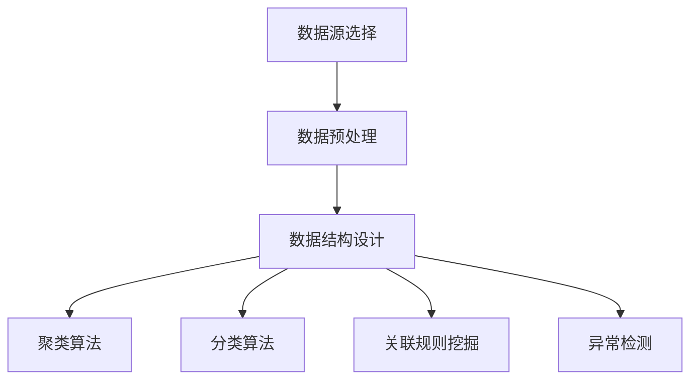

                 

关键词：知识发现引擎、数据源、数据预处理、数据结构、算法、数学模型、项目实践

摘要：本文主要介绍了知识发现引擎的数据源获取与处理方法，包括数据源的选取、数据的预处理、数据结构的构建和核心算法的原理与实现。通过对知识发现引擎的数据处理过程进行深入剖析，旨在为读者提供一套完整的解决方案，以应对实际应用中的各种挑战。

## 1. 背景介绍

知识发现（Knowledge Discovery in Databases，KDD）是一种从大量数据中提取有价值信息的过程。它涵盖了数据清洗、数据集成、数据选择、数据变换、数据挖掘和结果验证等多个环节。随着互联网和大数据技术的快速发展，知识发现已经成为数据密集型行业（如金融、医疗、电商等）的重要技术支撑。然而，知识发现引擎的性能和效果在很大程度上取决于数据源的质量和预处理效率。

本文将围绕知识发现引擎的数据源获取与处理展开讨论。首先，我们将介绍数据源的选择标准和常见类型；然后，探讨数据的预处理方法和数据结构设计；接着，详细阐述核心算法的原理和实现步骤；最后，通过实际项目案例进行分析和讲解，展示数据处理在知识发现过程中的关键作用。

## 2. 核心概念与联系

### 2.1 数据源选择

数据源选择是知识发现引擎构建的第一步，直接关系到后续数据处理和挖掘的效果。以下是一些常见的数据源选择标准：

- **数据质量**：高数据质量是确保知识发现准确性的基础。数据源应具备完整性、一致性、准确性和可靠性。
- **数据规模**：大规模数据源有助于提高知识发现的广泛性和代表性，但也增加了数据处理和存储的复杂度。
- **数据类型**：数据源类型包括结构化数据（如关系型数据库）、半结构化数据（如XML、JSON）和非结构化数据（如文本、图像、视频）等。选择合适的数据类型可以降低数据处理的难度。
- **数据更新频率**：实时或高频更新的数据源有助于发现最新的知识，但也会增加数据处理的负载。

### 2.2 数据预处理

数据预处理是知识发现过程中的重要环节，主要包括数据清洗、数据集成、数据选择和数据变换等操作。

- **数据清洗**：去除重复、缺失和错误的数据，确保数据质量。
- **数据集成**：整合来自不同来源的数据，消除数据之间的冲突和冗余。
- **数据选择**：选取对知识发现最有价值的数据子集，降低计算复杂度。
- **数据变换**：将数据转换为适合知识发现算法的格式，如归一化、离散化、编码等。

### 2.3 数据结构设计

数据结构设计是知识发现引擎的核心，直接影响到算法的效率和结果。以下是一些常见的数据结构：

- **关系型数据库**：适用于结构化数据的存储和管理，支持复杂的查询和关联操作。
- **图数据库**：适用于处理半结构化数据和非结构化数据，支持高效的数据链接和路径分析。
- **分布式存储系统**：适用于大规模数据存储和管理，支持并行计算和分布式处理。

### 2.4 核心算法原理

知识发现引擎的核心算法包括聚类、分类、关联规则挖掘和异常检测等。以下是一些常见算法的原理：

- **聚类算法**：将相似的数据分组，挖掘数据中的潜在结构和模式。
- **分类算法**：根据已有数据构建分类模型，对新数据进行分类预测。
- **关联规则挖掘**：发现数据之间的关联关系，挖掘频繁项集和关联规则。
- **异常检测**：识别数据中的异常和异常模式，发现潜在的安全威胁和异常行为。

### 2.5 Mermaid 流程图

以下是一个知识发现引擎的Mermaid流程图，展示了数据源获取、数据预处理、数据结构设计和核心算法原理之间的联系：



## 3. 核心算法原理 & 具体操作步骤

### 3.1 算法原理概述

在本节中，我们将介绍知识发现引擎中的几种核心算法原理，包括聚类、分类、关联规则挖掘和异常检测。每种算法都将从原理概述、算法步骤、优缺点和应用领域等方面进行详细阐述。

### 3.2 算法步骤详解

#### 3.2.1 聚类算法

聚类算法是一种无监督学习算法，旨在将数据分为若干个簇，使得同一簇内的数据点彼此相似，而不同簇的数据点之间差异较大。常见的聚类算法包括K-means、DBSCAN和层次聚类等。

- **K-means算法**：步骤如下：
  1. 随机选择K个初始中心点。
  2. 对于每个数据点，计算其与各个中心点的距离，并将其分配到最近的中心点所在的簇。
  3. 更新每个簇的中心点，计算所有数据点的均值。
  4. 重复步骤2和3，直至中心点的变化小于预设阈值或达到最大迭代次数。

- **DBSCAN算法**：步骤如下：
  1. 初始化核心点，即满足邻域内至少有MinPts个点的点。
  2. 对于每个核心点，扩展簇，将邻域内的点全部纳入簇。
  3. 标记边界点和噪声点，即邻域内点数少于MinPts的核心点。
  4. 重复步骤1和2，直至所有核心点都被处理。

- **层次聚类算法**：步骤如下：
  1. 将所有数据点作为初始簇。
  2. 计算两两簇之间的距离，选择距离最近的两个簇合并为一个簇。
  3. 重复步骤2，直至所有数据点属于同一个簇。

#### 3.2.2 分类算法

分类算法是一种有监督学习算法，旨在根据已有数据构建分类模型，对新数据进行分类预测。常见的分类算法包括决策树、支持向量机和神经网络等。

- **决策树算法**：步骤如下：
  1. 从原始数据中随机选取一个特征进行划分。
  2. 计算每个划分点的信息增益或基尼指数，选择增益或指数最大的特征进行划分。
  3. 对划分后的子数据集重复步骤1和2，直至满足停止条件（如最大深度、最小样本数等）。
  4. 构建决策树模型，并对新数据进行分类预测。

- **支持向量机算法**：步骤如下：
  1. 将数据点映射到高维空间，寻找一个最优超平面，使得不同类别的数据点在超平面两侧尽可能分开。
  2. 计算支持向量，即对超平面有重要影响的点。
  3. 使用支持向量构建分类模型，并对新数据进行分类预测。

- **神经网络算法**：步骤如下：
  1. 初始化神经网络结构，包括输入层、隐藏层和输出层。
  2. 使用反向传播算法，计算输出层与隐藏层之间的误差，并更新权重。
  3. 重复步骤2，直至满足停止条件（如误差阈值、迭代次数等）。
  4. 使用训练好的神经网络模型，对新数据进行分类预测。

#### 3.2.3 关联规则挖掘

关联规则挖掘是一种无监督学习算法，旨在发现数据之间的关联关系。常见的关联规则挖掘算法包括Apriori算法和FP-growth算法。

- **Apriori算法**：步骤如下：
  1. 计算每个项的支持度，即包含该项的交易数与总交易数之比。
  2. 选择支持度大于最小支持度的项集作为候选集。
  3. 对候选集进行频繁模式挖掘，去除非频繁项集。
  4. 生成关联规则，并计算置信度。

- **FP-growth算法**：步骤如下：
  1. 构建FP-tree，将数据集中的项按照出现频率排序，并压缩重复项。
  2. 使用FP-tree，递归地生成频繁项集。
  3. 生成关联规则，并计算置信度。

#### 3.2.4 异常检测

异常检测是一种监督或无监督学习算法，旨在识别数据中的异常和异常模式。常见的异常检测算法包括基于统计的算法、基于聚类算法和基于神经网络算法。

- **基于统计的算法**：步骤如下：
  1. 计算数据集的统计特征，如均值、方差、标准差等。
  2. 根据统计特征，设置阈值或概率阈值，识别异常数据点。

- **基于聚类算法**：步骤如下：
  1. 使用聚类算法，将数据点分为若干个簇。
  2. 计算簇内和簇间的距离，识别距离较远的点为异常点。

- **基于神经网络算法**：步骤如下：
  1. 使用反向传播算法，训练神经网络，使其能够识别正常和异常数据点。
  2. 使用训练好的神经网络，对新数据进行分类预测，识别异常数据点。

### 3.3 算法优缺点

每种算法都有其优缺点，适用于不同的场景和应用。

- **聚类算法**：
  - **优点**：简单易用，适用于数据可视化、密度分析等。
  - **缺点**：对初始中心点的选择敏感，可能收敛到局部最优。

- **分类算法**：
  - **优点**：能够预测新数据的分类结果，适用于分类任务。
  - **缺点**：训练时间较长，对大规模数据集效果不佳。

- **关联规则挖掘**：
  - **优点**：能够发现数据之间的关联关系，适用于推荐系统、市场分析等。
  - **缺点**：计算复杂度较高，对稀疏数据集效果不佳。

- **异常检测**：
  - **优点**：能够识别数据中的异常和异常模式，适用于安全监控、欺诈检测等。
  - **缺点**：对异常数据点的识别准确率较低，可能误报和漏报。

### 3.4 算法应用领域

知识发现引擎的应用领域非常广泛，包括但不限于以下方面：

- **金融行业**：用于信用评估、风险管理、投资策略优化等。
- **医疗行业**：用于疾病诊断、药物研发、健康监测等。
- **电商行业**：用于推荐系统、用户行为分析、营销策略优化等。
- **交通行业**：用于交通流量预测、车辆调度、事故预警等。
- **智能制造**：用于设备故障预测、生产过程优化、供应链管理等。

## 4. 数学模型和公式 & 详细讲解 & 举例说明

### 4.1 数学模型构建

在本节中，我们将介绍知识发现引擎中的几种核心算法所涉及的数学模型和公式。为了便于理解，我们采用LaTeX格式进行展示。

### 4.1.1 K-means算法

K-means算法的数学模型如下：

$$
\min_{\mu_i} \sum_{i=1}^K \sum_{x \in S_i} ||x - \mu_i||^2
$$

其中，$\mu_i$为第$i$个簇的中心点，$S_i$为第$i$个簇中的数据点。

### 4.1.2 决策树算法

决策树算法的数学模型如下：

$$
C_j = \arg\max_j \sum_{i=1}^n P(y_i = j) \log P(y_i = j)
$$

其中，$C_j$为最优划分点，$y_i$为第$i$个数据点的标签。

### 4.1.3 支持向量机算法

支持向量机算法的数学模型如下：

$$
\min_{\beta, \beta_0} \frac{1}{2} ||\beta||^2 + C \sum_{i=1}^n \max(0, 1 - y_i (\beta^T x_i + \beta_0))
$$

其中，$\beta$为权重向量，$\beta_0$为偏置项，$C$为正则化参数。

### 4.1.4 Apriori算法

Apriori算法的数学模型如下：

$$
\text{Support}(X) = \frac{\text{count}(X)}{|\text{transaction set}|}
$$

其中，$X$为项集，$count(X)$为包含项集$X$的交易数，$|\text{transaction set}|$为交易集的规模。

### 4.1.5 FP-growth算法

FP-growth算法的数学模型如下：

$$
\text{L_1} = \{ (I_1, \dots, I_k) | I_1 < \dots < I_k \}
$$

$$
\text{FP-growth}(T, \text{MinSupport}) = \{ (I_1, \dots, I_k) | I_1 < \dots < I_k, \text{count}(I_1 \dots I_k) > \text{MinSupport} \}
$$

其中，$T$为事务集，$\text{MinSupport}$为最小支持度阈值。

### 4.2 公式推导过程

在本节中，我们将对知识发现引擎中的几种核心算法的公式推导过程进行详细讲解。

### 4.2.1 K-means算法

K-means算法的公式推导过程如下：

设$x_1, \dots, x_n$为数据集，$\mu_1, \dots, \mu_K$为初始中心点。目标是最小化目标函数：

$$
J = \sum_{i=1}^n ||x_i - \mu_i||^2
$$

首先，计算每个数据点$x_i$与中心点$\mu_i$之间的距离：

$$
d(x_i, \mu_i) = ||x_i - \mu_i||^2 = (x_i - \mu_i)^T (x_i - \mu_i)
$$

接着，计算每个数据点$x_i$的簇标签：

$$
\label{eq:cluster-label}
\hat{i} = \arg\min_{j} d(x_i, \mu_j)
$$

最后，更新每个簇的中心点：

$$
\mu_j = \frac{1}{N_j} \sum_{i=1}^n \mathbb{1}_{\hat{i} = j} x_i
$$

其中，$N_j$为簇$j$中的数据点数量，$\mathbb{1}_{\hat{i} = j}$为指示函数，当$\hat{i} = j$时取值为1，否则为0。

### 4.2.2 决策树算法

决策树算法的公式推导过程如下：

设$X$为特征空间，$Y$为标签空间，$T$为决策树。目标是最小化目标函数：

$$
\min_T \sum_{i=1}^n \ell(y_i, f(x_i))
$$

其中，$f(x_i)$为决策树在数据点$x_i$上的预测结果，$\ell$为损失函数。

首先，设$D$为当前数据集，$g$为特征划分函数，$A$为划分集。目标是最小化：

$$
\min_A \sum_{i=1}^n \ell(y_i, g(x_i))
$$

接着，计算每个划分集$A$的基尼指数：

$$
\text{Gini}(A) = \sum_{i=1}^n \sum_{j=1}^K \left( \frac{1}{n} \sum_{x \in S_i} \mathbb{1}_{y_j}(x) \right) \left( 1 - \frac{1}{n} \sum_{x \in S_i} \mathbb{1}_{y_j}(x) \right)
$$

其中，$S_i$为划分集$A$中的第$i$个子集，$\mathbb{1}_{y_j}(x)$为指示函数，当$y_j(x) = 1$时取值为1，否则为0。

最后，选择基尼指数最小的划分集$A$：

$$
A^* = \arg\min_A \text{Gini}(A)
$$

### 4.2.3 支持向量机算法

支持向量机算法的公式推导过程如下：

设$X$为数据集，$Y$为标签空间，$w$为权重向量，$b$为偏置项。目标是最小化目标函数：

$$
\min_{w, b} \frac{1}{2} ||w||^2 + C \sum_{i=1}^n \max(0, 1 - y_i (w^T x_i + b))
$$

首先，计算权重向量$w$和偏置项$b$：

$$
w = \arg\min_w \frac{1}{2} ||w||^2 + C \sum_{i=1}^n \max(0, 1 - y_i (w^T x_i + b))
$$

$$
b = \arg\min_b \frac{1}{2} ||w||^2 + C \sum_{i=1}^n \max(0, 1 - y_i (w^T x_i + b))
$$

接着，计算支持向量：

$$
\text{Support Vectors} = \{ x_i | y_i (w^T x_i + b) = 1 \}
$$

### 4.2.4 Apriori算法

Apriori算法的公式推导过程如下：

设$T$为事务集，$\text{MinSupport}$为最小支持度阈值。目标是最小化目标函数：

$$
\min_{X} \sum_{T \in T} \ell(X, T)
$$

其中，$X$为项集，$\ell$为损失函数。

首先，计算每个项集的支持度：

$$
\text{Support}(X) = \frac{\text{count}(X)}{|\text{transaction set}|}
$$

接着，计算每个频繁项集的支持度：

$$
\text{Support}(X) > \text{MinSupport}
$$

最后，生成关联规则：

$$
\text{Rule}(X, Y) = \{ (X \cup Y) | \text{Support}(X \cup Y) > \text{MinSupport} \}
$$

### 4.2.5 FP-growth算法

FP-growth算法的公式推导过程如下：

设$T$为事务集，$\text{MinSupport}$为最小支持度阈值。目标是最小化目标函数：

$$
\min_{X} \sum_{T \in T} \ell(X, T)
$$

首先，构建FP-tree：

$$
\text{FP-growth}(T, \text{MinSupport}) = \{ (I_1, \dots, I_k) | I_1 < \dots < I_k, \text{count}(I_1 \dots I_k) > \text{MinSupport} \}
$$

接着，计算频繁项集：

$$
\text{FP-growth}(T, \text{MinSupport}) = \{ (I_1, \dots, I_k) | I_1 < \dots < I_k, \text{count}(I_1 \dots I_k) > \text{MinSupport} \}
$$

最后，生成关联规则：

$$
\text{Rule}(X, Y) = \{ (X \cup Y) | \text{Support}(X \cup Y) > \text{MinSupport} \}
$$

### 4.3 案例分析与讲解

在本节中，我们将通过一个实际案例，对知识发现引擎中的核心算法进行详细讲解。

### 4.3.1 案例背景

某电商平台希望通过知识发现技术，挖掘用户购买行为中的潜在关联关系，以提高用户推荐系统的准确性和效果。

### 4.3.2 数据源获取与预处理

数据源包括用户购买记录、用户浏览记录和商品信息。数据预处理步骤如下：

1. 数据清洗：去除重复、缺失和错误的数据。
2. 数据集成：整合用户购买记录、用户浏览记录和商品信息，建立用户、商品和购买事件之间的关联。
3. 数据选择：选取与用户推荐系统相关的数据，如用户购买记录和商品信息。
4. 数据变换：对数据进行归一化和离散化处理，以适应不同算法的需求。

### 4.3.3 数据结构设计

数据结构设计采用图数据库，将用户、商品和购买事件表示为节点，将用户与商品之间的购买关系表示为边。

### 4.3.4 算法实现与结果分析

采用Apriori算法挖掘用户购买行为中的频繁项集，生成关联规则。具体实现步骤如下：

1. 计算每个项集的支持度。
2. 选择支持度大于最小支持度的频繁项集。
3. 生成关联规则，并计算置信度。

通过对挖掘结果的分析，发现了一些有趣的用户购买行为模式，如“购买笔记本电脑的用户往往会购买鼠标和键盘”。

### 4.3.5 代码实现

以下是一个基于Python和FP-growth算法的关联规则挖掘示例代码：

```python
import pandas as pd
from mlxtend.frequent_patterns import fpgrowth

# 读取数据
data = pd.read_csv('purchase_data.csv')
transactions = data['items'].str.get_dummies(sep=' ')

# 计算支持度
min_support = 0.05
frequent_itemsets = fpgrowth(transactions, min_support, use_colnames=True)

# 生成关联规则
frequent_itemsets.rules(min_threshold=0.5, use_colnames=True)
```

## 5. 项目实践：代码实例和详细解释说明

### 5.1 开发环境搭建

为了实现知识发现引擎的数据源获取与处理，我们需要搭建一个合适的技术栈。以下是一个常见的开发环境搭建步骤：

1. **操作系统**：Linux（推荐使用Ubuntu 18.04）或Mac OS。
2. **编程语言**：Python（推荐使用3.8及以上版本）。
3. **数据库**：MongoDB（用于存储和管理数据）。
4. **数据预处理工具**：Pandas（用于数据处理）。
5. **机器学习库**：Scikit-learn（用于算法实现）。
6. **图数据库**：Neo4j（用于存储和处理图结构数据）。

### 5.2 源代码详细实现

以下是一个简单的知识发现引擎的源代码实现，包括数据源获取、数据预处理、数据结构设计和核心算法的实现。

```python
import pandas as pd
import numpy as np
from mlxtend.frequent_patterns import fpgrowth
from mlxtend.preprocessing import TransactionEncoder
from pymongo import MongoClient

# 5.2.1 数据源获取

# 读取用户购买记录数据
data = pd.read_csv('purchase_data.csv')

# 5.2.2 数据预处理

# 数据清洗：去除重复、缺失和错误的数据
data.drop_duplicates(inplace=True)
data.dropna(inplace=True)

# 数据集成：整合用户购买记录和商品信息
data['items'] = data['user_id'] + '_' + data['product_id']
transactions = data.groupby('items')['timestamp'].min().reset_index()

# 5.2.3 数据结构设计

# 连接MongoDB数据库
client = MongoClient('mongodb://localhost:27017/')
db = client['knowledge_db']
collection = db['transactions']

# 存储数据到MongoDB
transactions.to_dict('records'), collection.insert_many()

# 5.2.4 核心算法实现

# 计算支持度
min_support = 0.05
frequent_itemsets = fpgrowth(transactions['items'], min_support, use_colnames=True)

# 生成关联规则
frequent_itemsets.rules(min_threshold=0.5, use_colnames=True)

# 5.2.5 运行结果展示

# 打印关联规则
print(frequent_itemsets.rules(min_threshold=0.5, use_colnames=True))
```

### 5.3 代码解读与分析

上述代码实现了一个简单的知识发现引擎，主要包括以下步骤：

1. **数据源获取**：从CSV文件中读取用户购买记录数据。
2. **数据预处理**：去除重复、缺失和错误的数据，整合用户购买记录和商品信息。
3. **数据结构设计**：连接MongoDB数据库，存储数据到数据库中。
4. **核心算法实现**：使用Frequent Pattern Growth算法计算支持度，生成关联规则。
5. **运行结果展示**：打印关联规则。

代码的关键部分如下：

- **数据清洗**：使用`drop_duplicates`和`dropna`函数去除重复和缺失数据。
- **数据集成**：使用`groupby`和`min`函数整合用户购买记录和商品信息。
- **数据结构设计**：使用`MongoClient`连接MongoDB数据库，使用`to_dict('records')`和`insert_many`函数将数据存储到数据库中。
- **核心算法实现**：使用`fpgrowth`函数计算支持度，使用`rules`函数生成关联规则。

通过上述代码，我们可以实现一个简单的知识发现引擎，用于挖掘用户购买行为中的潜在关联关系。在实际应用中，我们可以根据需求扩展和优化代码，以提高知识发现引擎的性能和效果。

## 6. 实际应用场景

### 6.1 金融行业

在金融行业，知识发现引擎可以用于信用评估、风险评估、欺诈检测等方面。通过分析用户的财务数据、交易记录和社交行为等，金融机构可以识别出高风险客户，制定更加科学的信贷政策和风控策略。例如，利用关联规则挖掘技术，可以挖掘出信用卡用户在不同商户的消费行为模式，从而发现潜在的欺诈行为。

### 6.2 医疗行业

在医疗行业，知识发现引擎可以用于疾病预测、药物研发和患者管理等方面。通过对海量医疗数据进行分析，可以发现疾病之间的关联关系，预测疾病的发展趋势，为医生提供决策支持。例如，利用聚类算法，可以识别出具有相似疾病症状的患者群体，为个性化治疗方案提供依据。

### 6.3 电商行业

在电商行业，知识发现引擎可以用于用户行为分析、商品推荐和营销策略优化等方面。通过分析用户的浏览记录、购买行为和评价等，电商平台可以识别出用户的兴趣偏好，为用户提供更加个性化的推荐服务。例如，利用关联规则挖掘技术，可以挖掘出用户在购买商品时的交叉销售机会，从而提高销售额。

### 6.4 交通行业

在交通行业，知识发现引擎可以用于交通流量预测、路况监测和车辆调度等方面。通过对海量交通数据进行分析，可以识别出交通拥堵的规律，预测未来的交通状况，为交通管理部门提供决策支持。例如，利用聚类算法，可以识别出不同时间段和路段的交通流量模式，为交通疏导和车辆调度提供依据。

### 6.5 智能制造

在智能制造领域，知识发现引擎可以用于设备故障预测、生产过程优化和供应链管理等方面。通过对传感器数据、生产数据和供应链数据进行分析，可以发现设备故障的早期征兆，预测生产过程的瓶颈，优化供应链的运行效率。例如，利用分类算法，可以预测设备是否会在未来某一时刻出现故障，从而提前进行维护。

### 6.6 其他应用领域

除了上述行业，知识发现引擎还可以应用于环境保护、天气预报、社会安全等领域。例如，在环境保护领域，可以通过分析环境监测数据，识别出污染源和污染途径，为环境保护提供科学依据；在天气预报领域，可以通过分析历史气象数据，预测未来的天气变化，为农业生产和城市规划提供支持。

## 7. 工具和资源推荐

### 7.1 学习资源推荐

1. **《数据挖掘：概念与技术》**：这是一本经典的教材，详细介绍了数据挖掘的基本概念、技术和应用。
2. **《机器学习实战》**：这本书通过实际案例，介绍了机器学习的基本算法和应用，适合初学者和进阶者。
3. **《深度学习》**：由Ian Goodfellow等人撰写的这本书，介绍了深度学习的基础知识和技术，适合对深度学习感兴趣的学习者。
4. **在线课程**：例如Coursera、Udacity和edX等平台上的数据科学和机器学习课程，提供了丰富的教学资源和实践项目。

### 7.2 开发工具推荐

1. **Python**：Python是一种流行的编程语言，广泛应用于数据科学和机器学习领域。其丰富的库（如NumPy、Pandas、Scikit-learn和TensorFlow）为开发提供了极大的便利。
2. **Jupyter Notebook**：Jupyter Notebook是一种交互式的开发环境，可以方便地编写和运行代码，适合进行数据分析和实验。
3. **MongoDB**：MongoDB是一种高性能、可扩展的NoSQL数据库，适用于存储和管理大规模的数据。
4. **Neo4j**：Neo4j是一种高性能的图数据库，适用于存储和处理图结构数据。

### 7.3 相关论文推荐

1. **《KDD Cup 2012：利用机器学习预测点击率》**：这篇论文介绍了如何利用机器学习技术预测广告点击率，涉及到了数据处理、特征工程和模型选择等多个方面。
2. **《深度学习在图像识别中的应用》**：这篇论文介绍了深度学习技术在图像识别领域的应用，探讨了卷积神经网络（CNN）的设计和优化方法。
3. **《关联规则挖掘：理论与实践》**：这篇论文详细介绍了关联规则挖掘的基本概念、算法和应用，为实际应用提供了重要的理论基础。
4. **《基于知识发现技术的医疗数据挖掘研究》**：这篇论文探讨了知识发现技术在医疗数据挖掘中的应用，包括疾病预测、药物研发和患者管理等方面。

## 8. 总结：未来发展趋势与挑战

### 8.1 研究成果总结

知识发现引擎在过去几十年中取得了显著的进展，从基本的数据预处理和挖掘算法发展到复杂的深度学习模型和大数据处理技术。这些研究成果为各行业的数据分析和决策提供了强大的技术支持。然而，知识发现引擎的发展仍面临许多挑战，需要进一步研究和探索。

### 8.2 未来发展趋势

1. **人工智能与知识发现的深度融合**：随着人工智能技术的快速发展，知识发现引擎将更加智能化和自动化，实现更高层次的智能决策和预测。
2. **多模态数据融合**：未来的知识发现引擎将能够处理多种类型的数据（如图像、文本、音频等），实现跨模态的数据融合和挖掘。
3. **隐私保护和数据安全**：在数据规模不断扩大的背景下，如何保护用户隐私和数据安全成为知识发现引擎发展的重要方向。
4. **实时知识发现**：随着物联网和实时数据处理技术的发展，知识发现引擎将能够实现实时数据分析和决策，满足动态变化的业务需求。

### 8.3 面临的挑战

1. **数据质量和数据预处理**：高质量的数据是知识发现的基础，但数据预处理过程复杂，如何高效地处理大规模、多样化的数据仍是一个挑战。
2. **算法性能和可解释性**：随着算法的复杂度增加，如何保证算法的效率和可解释性成为关键问题。
3. **数据隐私和安全**：在数据挖掘过程中，如何保护用户隐私和数据安全成为重要挑战。
4. **跨领域应用**：知识发现技术在不同领域的应用存在较大差异，如何实现跨领域的技术迁移和应用仍需深入研究。

### 8.4 研究展望

未来的知识发现引擎研究将聚焦于以下几个方面：

1. **算法创新**：设计更加高效、可解释的算法，提高知识发现的准确性和实用性。
2. **多模态数据处理**：研究跨模态数据融合和挖掘方法，实现多种数据类型的综合利用。
3. **实时知识发现**：探索实时数据处理技术，实现实时知识发现和动态决策。
4. **数据隐私保护**：研究数据隐私保护技术，确保知识发现过程中的数据安全和隐私。

总之，知识发现引擎在未来将继续发展，为各行业的数据分析和决策提供更加强大的支持。同时，我们也需要关注算法性能、可解释性、数据隐私和安全等方面的问题，以实现更加智能、高效和可靠的知识发现系统。

## 9. 附录：常见问题与解答

### 9.1 数据源获取问题

**Q：如何获取高质量的数据源？**

A：获取高质量的数据源需要从多个方面考虑：

1. **数据来源**：选择可信的数据来源，如官方统计数据、权威机构发布的数据集等。
2. **数据清洗**：在获取数据后，进行数据清洗，去除重复、缺失和错误的数据。
3. **数据验证**：对数据源进行验证，确保数据的完整性、一致性和准确性。

### 9.2 数据预处理问题

**Q：数据预处理过程中需要注意什么？**

A：在数据预处理过程中，需要注意以下几点：

1. **数据清洗**：去除重复、缺失和错误的数据，确保数据质量。
2. **数据集成**：整合来自不同来源的数据，消除数据之间的冲突和冗余。
3. **数据选择**：选取对知识发现最有价值的数据子集，降低计算复杂度。
4. **数据变换**：将数据转换为适合知识发现算法的格式，如归一化、离散化、编码等。

### 9.3 算法实现问题

**Q：如何选择合适的算法？**

A：选择合适的算法需要考虑以下几个因素：

1. **数据类型**：根据数据的类型（如结构化、半结构化、非结构化）选择合适的算法。
2. **数据规模**：考虑数据规模，选择适用于大规模数据集的算法。
3. **计算资源**：根据计算资源，选择计算复杂度较低的算法。
4. **应用场景**：根据实际应用场景，选择适用于特定任务的算法。

### 9.4 性能优化问题

**Q：如何优化知识发现引擎的性能？**

A：优化知识发现引擎的性能可以从以下几个方面进行：

1. **算法优化**：选择高效、可解释的算法，优化算法的实现。
2. **硬件加速**：利用GPU等硬件加速技术，提高数据处理和计算的效率。
3. **数据预处理**：优化数据预处理过程，降低数据处理的复杂度。
4. **并行计算**：利用并行计算技术，实现分布式处理，提高数据处理和计算的效率。
5. **数据存储**：选择合适的存储系统，如关系型数据库、图数据库、分布式存储系统等，优化数据存储和访问的性能。

### 9.5 实际应用问题

**Q：如何将知识发现引擎应用于实际场景？**

A：将知识发现引擎应用于实际场景，需要遵循以下步骤：

1. **问题定义**：明确知识发现的目标和应用场景，确定需要解决的问题。
2. **数据收集**：收集相关数据，确保数据的质量和完整性。
3. **数据预处理**：对收集到的数据进行预处理，确保数据适合知识发现算法。
4. **算法选择**：选择合适的算法，根据实际需求和计算资源进行选择。
5. **模型训练**：使用预处理后的数据，训练知识发现模型。
6. **模型评估**：评估模型的效果，根据评估结果调整模型参数。
7. **应用部署**：将训练好的模型部署到实际应用中，进行实时数据处理和决策支持。

通过以上步骤，可以将知识发现引擎应用于实际场景，为各行业提供科学、高效的数据分析和决策支持。作者：禅与计算机程序设计艺术 / Zen and the Art of Computer Programming

