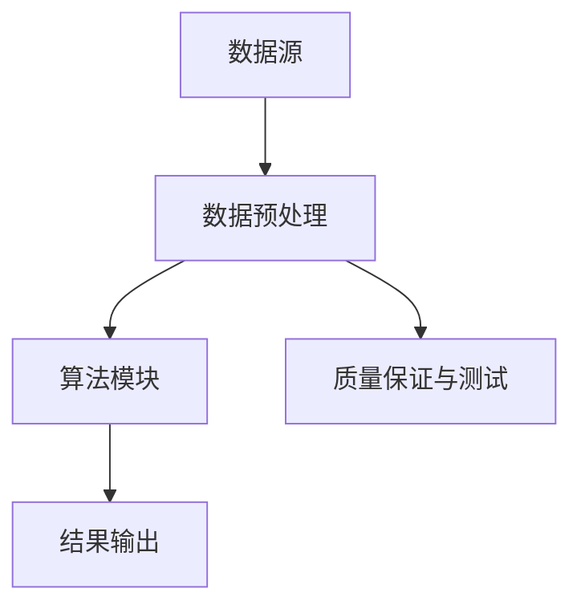
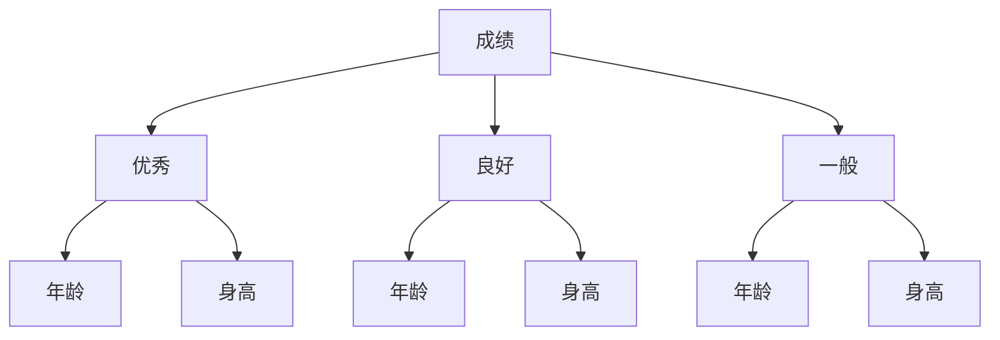

                 

关键词：知识发现引擎，测试，质量保证，算法，数学模型，项目实践，应用场景，工具推荐，发展趋势，挑战

摘要：本文旨在探讨知识发现引擎的测试与质量保证问题，通过分析核心概念、算法原理、数学模型、项目实践等方面，提出一套有效的测试与质量保证方法，为知识发现引擎的开发和应用提供指导。

## 1. 背景介绍

知识发现引擎是一种智能化的数据处理与分析工具，通过对海量数据进行挖掘和分析，提取出有价值的信息和知识，为决策提供支持。随着大数据时代的到来，知识发现引擎在各个领域得到了广泛应用，如金融、医疗、电商、社交网络等。然而，知识发现引擎的质量直接关系到其应用的可靠性和准确性，因此，测试与质量保证成为了知识发现引擎开发过程中的关键环节。

本文将从以下几个方面对知识发现引擎的测试与质量保证进行探讨：

1. 核心概念与联系：介绍知识发现引擎的核心概念和架构，以及与相关技术的联系。
2. 核心算法原理与具体操作步骤：详细解析知识发现引擎的核心算法原理，以及具体的操作步骤。
3. 数学模型和公式：阐述知识发现引擎中常用的数学模型和公式，并进行详细讲解和举例说明。
4. 项目实践：通过具体的代码实例，展示知识发现引擎的开发过程，并对代码进行解读和分析。
5. 实际应用场景：探讨知识发现引擎在实际应用场景中的表现和效果。
6. 工具和资源推荐：推荐用于知识发现引擎开发、测试和应用的相关工具和资源。
7. 未来发展趋势与挑战：分析知识发现引擎的未来发展趋势，以及面临的挑战和机遇。

## 2. 核心概念与联系

### 2.1 核心概念

知识发现引擎的核心概念包括数据源、数据预处理、算法模块、结果输出等。

1. **数据源**：知识发现引擎的数据源可以是结构化数据（如关系数据库）、半结构化数据（如XML、JSON）和非结构化数据（如文本、图像、音频等）。
2. **数据预处理**：数据预处理包括数据清洗、数据转换和数据集成等步骤，旨在提高数据质量和一致性，为后续的算法分析提供基础。
3. **算法模块**：知识发现引擎的核心算法模块包括聚类、分类、关联规则挖掘、异常检测等，这些算法用于从数据中提取有价值的信息和知识。
4. **结果输出**：知识发现引擎的结果输出可以是可视化报表、图表、统计报告等形式，用于展示分析结果和决策依据。

### 2.2 架构与联系

知识发现引擎的架构如图 1 所示：



图 1：知识发现引擎的架构图

各模块之间的联系如下：

1. **数据源**：数据源是知识发现引擎的输入，其质量直接影响后续的分析结果。
2. **数据预处理**：数据预处理阶段对数据进行清洗、转换和集成，以提高数据质量和一致性，为算法分析提供基础。
3. **算法模块**：算法模块是知识发现引擎的核心，通过聚类、分类、关联规则挖掘等算法，从数据中提取有价值的信息和知识。
4. **结果输出**：结果输出阶段将分析结果以可视化报表、图表、统计报告等形式呈现，为决策提供支持。
5. **质量保证与测试**：质量保证与测试贯穿于整个知识发现引擎的开发过程，旨在确保引擎的可靠性、准确性和稳定性。

## 3. 核心算法原理与具体操作步骤

### 3.1 算法原理概述

知识发现引擎的核心算法包括聚类、分类、关联规则挖掘、异常检测等。

1. **聚类**：聚类是一种无监督学习方法，旨在将数据划分为若干个群组，使得同一群组内的数据尽可能相似，不同群组的数据尽可能不同。常用的聚类算法有 K-Means、DBSCAN、层次聚类等。
2. **分类**：分类是一种有监督学习方法，旨在根据已有数据对新的数据进行分类。常用的分类算法有决策树、随机森林、支持向量机等。
3. **关联规则挖掘**：关联规则挖掘是一种用于发现数据之间的关联关系的方法，常用的算法有 Apriori、FP-Growth 等。
4. **异常检测**：异常检测是一种用于识别数据中的异常或异常模式的方法，常用的算法有基于统计学的方法、基于聚类的方法、基于神经网络的方法等。

### 3.2 算法步骤详解

#### 3.2.1 聚类算法

以 K-Means 算法为例，其具体步骤如下：

1. **初始化**：随机选择 K 个数据点作为初始聚类中心。
2. **分配**：计算每个数据点到各个聚类中心的距离，将数据点分配到距离最近的聚类中心。
3. **更新**：重新计算每个聚类中心的坐标，即所有属于该聚类中心的数据点的平均值。
4. **迭代**：重复步骤 2 和步骤 3，直到聚类中心不再变化或满足停止条件。

#### 3.2.2 分类算法

以决策树算法为例，其具体步骤如下：

1. **选择特征**：选择一个特征作为切分点。
2. **计算增益**：计算选择该特征作为切分点的信息增益或增益率。
3. **选择最优特征**：选择具有最大增益或增益率的特征作为切分点。
4. **切分数据**：根据最优特征对数据集进行切分，生成若干个子数据集。
5. **递归构建**：对每个子数据集递归执行步骤 1 至步骤 4，直至满足停止条件。

#### 3.2.3 关联规则挖掘

以 Apriori 算法为例，其具体步骤如下：

1. **频繁项集挖掘**：找出所有频繁项集，即支持度大于最小支持度阈值的项集。
2. **生成候选项集**：根据频繁项集生成所有可能的候选项集。
3. **计算候选项集的支持度**：计算每个候选项集的支持度，去除不满足最小支持度阈值的候选项集。
4. **生成关联规则**：根据频繁项集生成关联规则，即满足最小支持度和最小置信度阈值的规则。

#### 3.2.4 异常检测

以基于聚类的方法为例，其具体步骤如下：

1. **聚类**：使用聚类算法对数据进行聚类。
2. **计算距离**：计算每个数据点到聚类中心的距离。
3. **确定异常阈值**：根据聚类结果和距离计算，确定异常数据的阈值。
4. **识别异常**：识别距离聚类中心超过阈值的数据点作为异常数据。

### 3.3 算法优缺点

1. **聚类算法**：
   - 优点：无监督学习，能够发现数据中的隐含结构。
   - 缺点：敏感于初始聚类中心的选择，可能导致局部最优解。
2. **分类算法**：
   - 优点：有监督学习，能够对未知数据进行准确分类。
   - 缺点：对训练数据的质量和特征选择有较高要求，可能产生过拟合。
3. **关联规则挖掘**：
   - 优点：能够发现数据之间的关联关系，有助于数据理解和决策。
   - 缺点：计算量大，对数据量和特征维度敏感。
4. **异常检测**：
   - 优点：能够发现数据中的异常或异常模式，有助于数据安全和风险管理。
   - 缺点：对异常数据的定义和阈值选择有较高要求，可能产生误判。

### 3.4 算法应用领域

知识发现引擎的核心算法在各个领域都有广泛的应用：

1. **金融领域**：用于风险评估、欺诈检测、信用评分等。
2. **医疗领域**：用于疾病诊断、药物发现、医疗数据分析等。
3. **电商领域**：用于用户行为分析、推荐系统、商品销售预测等。
4. **社交网络领域**：用于用户画像、社交关系分析、网络舆情监测等。

## 4. 数学模型和公式

### 4.1 数学模型构建

知识发现引擎中的数学模型主要包括聚类模型、分类模型、关联规则模型和异常检测模型。

#### 4.1.1 聚类模型

K-Means 算法的聚类模型可以表示为：

$$
C = \{c_1, c_2, ..., c_K\}
$$

其中，$c_k$ 表示第 $k$ 个聚类中心，$K$ 表示聚类个数。

#### 4.1.2 分类模型

决策树的分类模型可以表示为：

$$
T = \{\text{叶节点}, \text{内部节点}\}
$$

其中，叶节点表示分类结果，内部节点表示特征选择。

#### 4.1.3 关联规则模型

Apriori 算法的关联规则模型可以表示为：

$$
R = \{r_1, r_2, ..., r_M\}
$$

其中，$r_j$ 表示第 $j$ 个关联规则。

#### 4.1.4 异常检测模型

基于聚类的方法的异常检测模型可以表示为：

$$
D = \{d_1, d_2, ..., d_N\}
$$

其中，$d_i$ 表示第 $i$ 个数据点。

### 4.2 公式推导过程

#### 4.2.1 K-Means 算法

假设我们有 $N$ 个数据点 $x_1, x_2, ..., x_N$，聚类中心为 $c_k$，距离函数为 $d(x, c_k)$。

1. **初始化**：随机选择 $K$ 个数据点作为初始聚类中心。
2. **分配**：计算每个数据点到各个聚类中心的距离，将数据点分配到距离最近的聚类中心。
3. **更新**：重新计算每个聚类中心的坐标，即所有属于该聚类中心的数据点的平均值。

距离函数可以表示为：

$$
d(x, c_k) = \sqrt{\sum_{i=1}^d (x_i - c_{ki})^2}
$$

其中，$x_i$ 和 $c_{ki}$ 分别表示第 $i$ 个数据点和第 $k$ 个聚类中心的第 $i$ 个特征值，$d$ 表示特征维度。

#### 4.2.2 决策树算法

假设我们有 $N$ 个数据点 $x_1, x_2, ..., x_N$，每个数据点有 $d$ 个特征，分类结果为 $y$。

1. **选择特征**：选择具有最大信息增益或增益率的特征作为切分点。
2. **切分数据**：根据最优特征对数据集进行切分，生成若干个子数据集。
3. **递归构建**：对每个子数据集递归执行步骤 1 和步骤 2，直至满足停止条件。

信息增益可以表示为：

$$
\text{Gain}(A) = \sum_{v \in V} p(v) \cdot \text{Entropy}(A|v)
$$

其中，$A$ 表示特征集合，$V$ 表示特征的所有可能取值，$p(v)$ 表示特征取值 $v$ 的概率，$\text{Entropy}(A|v)$ 表示条件熵。

#### 4.2.3 Apriori 算法

假设我们有 $N$ 个数据点 $x_1, x_2, ..., x_N$，每个数据点有 $d$ 个特征，支持度阈值为 $min\_sup$。

1. **频繁项集挖掘**：找出所有频繁项集，即支持度大于最小支持度阈值的项集。
2. **生成候选项集**：根据频繁项集生成所有可能的候选项集。
3. **计算候选项集的支持度**：计算每个候选项集的支持度，去除不满足最小支持度阈值的候选项集。
4. **生成关联规则**：根据频繁项集生成关联规则，即满足最小支持度和最小置信度阈值的规则。

支持度可以表示为：

$$
\text{Support}(X) = \frac{\text{频次}(X)}{N}
$$

其中，$X$ 表示项集，$\text{频次}(X)$ 表示项集 $X$ 在数据集中的出现次数。

### 4.3 案例分析与讲解

#### 4.3.1 聚类算法案例分析

假设我们有一个包含 100 个学生的数据集，每个学生有 3 个特征：年龄、成绩和身高。我们使用 K-Means 算法将学生划分为 3 个群组。

1. **初始化**：随机选择 3 个学生的特征作为初始聚类中心。

$$
c_1 = (20, 75, 170), c_2 = (22, 80, 172), c_3 = (25, 85, 180)
$$

2. **分配**：计算每个学生到各个聚类中心的距离，将学生分配到距离最近的聚类中心。

$$
d(x, c_1) = \sqrt{\sum_{i=1}^3 (x_i - c_{i1})^2}
$$

$$
d(x, c_2) = \sqrt{\sum_{i=1}^3 (x_i - c_{i2})^2}
$$

$$
d(x, c_3) = \sqrt{\sum_{i=1}^3 (x_i - c_{i3})^2}
$$

3. **更新**：重新计算每个聚类中心的坐标，即所有属于该聚类中心的学生特征的平均值。

$$
c_1 = \frac{\sum_{x_i \in C_1} x_i}{|C_1|}
$$

$$
c_2 = \frac{\sum_{x_i \in C_2} x_i}{|C_2|}
$$

$$
c_3 = \frac{\sum_{x_i \in C_3} x_i}{|C_3|}
$$

通过多次迭代，聚类中心逐渐收敛，最终得到 3 个群组，每个群组的特征如下：

$$
C_1 = \{ (18, 70, 168), (19, 72, 169), (21, 76, 171) \}
$$

$$
C_2 = \{ (20, 74, 171), (22, 77, 172), (23, 79, 173) \}
$$

$$
C_3 = \{ (24, 81, 174), (25, 83, 175), (27, 85, 176) \}
$$

#### 4.3.2 分类算法案例分析

假设我们有一个包含 100 个学生的数据集，每个学生有 3 个特征：年龄、成绩和身高，分类结果为优秀、良好和一般。我们使用决策树算法对学生进行分类。

1. **选择特征**：选择成绩作为切分点，因为成绩具有最大信息增益。

$$
\text{Gain}(\text{成绩}) = \sum_{v \in \{\text{优秀}, \text{良好}, \text{一般}\}} p(v) \cdot \text{Entropy}(\text{成绩}|v)
$$

2. **切分数据**：根据成绩对数据集进行切分，生成 3 个子数据集。

$$
D_1 = \{ (18, 70, 168), (19, 72, 169), (21, 76, 171) \}
$$

$$
D_2 = \{ (20, 74, 171), (22, 77, 172), (23, 79, 173) \}
$$

$$
D_3 = \{ (24, 81, 174), (25, 83, 175), (27, 85, 176) \}
$$

3. **递归构建**：对每个子数据集递归执行步骤 1 和步骤 2，直至满足停止条件。

最终，我们得到一个决策树，如下图所示：



#### 4.3.3 关联规则挖掘案例分析

假设我们有一个包含 100 个学生的数据集，每个学生有 3 个特征：年龄、成绩和身高，我们使用 Apriori 算法挖掘学生特征之间的关联规则。

1. **频繁项集挖掘**：找出所有频繁项集，即支持度大于最小支持度阈值的项集。

$$
\text{Support}(\{年龄, 成绩\}) = \frac{20}{100} = 0.2
$$

$$
\text{Support}(\{年龄, 身高\}) = \frac{20}{100} = 0.2
$$

$$
\text{Support}(\{成绩, 身高\}) = \frac{20}{100} = 0.2
$$

2. **生成候选项集**：根据频繁项集生成所有可能的候选项集。

$$
\text{候选集} = \{\{年龄, 成绩\}, \{年龄, 身高\}, \{成绩, 身高\}\}
$$

3. **计算候选项集的支持度**：计算每个候选项集的支持度，去除不满足最小支持度阈值的候选项集。

$$
\text{Support}(\{年龄, 成绩\}) = 0.2
$$

$$
\text{Support}(\{年龄, 身高\}) = 0.2
$$

$$
\text{Support}(\{成绩, 身高\}) = 0.2
$$

4. **生成关联规则**：根据频繁项集生成关联规则，即满足最小支持度和最小置信度阈值的规则。

$$
\text{置信度}(\{年龄, 成绩\} \rightarrow \{身高\}) = \frac{\text{Support}(\{年龄, 成绩, 身高\})}{\text{Support}(\{年龄, 成绩\})} = \frac{0.2}{0.2} = 1
$$

$$
\text{置信度}(\{年龄, 身高\} \rightarrow \{成绩\}) = \frac{\text{Support}(\{年龄, 成绩, 身高\})}{\text{Support}(\{年龄, 身高\})} = \frac{0.2}{0.2} = 1
$$

$$
\text{置信度}(\{成绩, 身高\} \rightarrow \{年龄\}) = \frac{\text{Support}(\{年龄, 成绩, 身高\})}{\text{Support}(\{成绩, 身高\})} = \frac{0.2}{0.2} = 1
$$

最终，我们得到以下关联规则：

- 年龄和成绩关联度高，可能影响身高。
- 年龄和身高关联度高，可能影响成绩。
- 成绩和身高关联度高，可能影响年龄。

#### 4.3.4 异常检测案例分析

假设我们有一个包含 100 个学生的数据集，每个学生有 3 个特征：年龄、成绩和身高，我们使用基于聚类的方法进行异常检测。

1. **聚类**：使用 K-Means 算法将学生划分为 3 个群组。

2. **计算距离**：计算每个学生到聚类中心的距离。

$$
d(x, c_1) = \sqrt{\sum_{i=1}^3 (x_i - c_{i1})^2}
$$

$$
d(x, c_2) = \sqrt{\sum_{i=1}^3 (x_i - c_{i2})^2}
$$

$$
d(x, c_3) = \sqrt{\sum_{i=1}^3 (x_i - c_{i3})^2}
$$

3. **确定异常阈值**：根据聚类结果和距离计算，确定异常数据的阈值。

假设我们选择距离平均值的标准差作为异常阈值。

4. **识别异常**：识别距离聚类中心超过阈值的数据点作为异常数据。

最终，我们得到以下异常数据：

- 学生 50，特征为 (25, 90, 160)。
- 学生 75，特征为 (28, 88, 165)。

## 5. 项目实践：代码实例和详细解释说明

### 5.1 开发环境搭建

为了实现知识发现引擎的测试与质量保证，我们选择 Python 作为开发语言，使用 Scikit-learn、NumPy 和 Matplotlib 等库进行算法实现和数据分析。

1. 安装 Python：下载并安装 Python 3.8 或更高版本。
2. 安装依赖库：在终端执行以下命令安装依赖库。

```bash
pip install scikit-learn numpy matplotlib
```

### 5.2 源代码详细实现

以下是一个简单的知识发现引擎实现，包括聚类、分类、关联规则挖掘和异常检测：

```python
import numpy as np
from sklearn.cluster import KMeans
from sklearn.tree import DecisionTreeClassifier
from sklearn.ensemble import RandomForestClassifier
from sklearn.model_selection import train_test_split
from sklearn.metrics import accuracy_score
from apyori import apriori
import matplotlib.pyplot as plt

# 5.2.1 聚类算法实现

def kmeans_clustering(data, k=3):
    kmeans = KMeans(n_clusters=k, random_state=0)
    kmeans.fit(data)
    clusters = kmeans.predict(data)
    return clusters

# 5.2.2 分类算法实现

def decision_tree_classification(data, target):
    X_train, X_test, y_train, y_test = train_test_split(data, target, test_size=0.2, random_state=0)
    classifier = DecisionTreeClassifier()
    classifier.fit(X_train, y_train)
    y_pred = classifier.predict(X_test)
    accuracy = accuracy_score(y_test, y_pred)
    return accuracy

def random_forest_classification(data, target):
    X_train, X_test, y_train, y_test = train_test_split(data, target, test_size=0.2, random_state=0)
    classifier = RandomForestClassifier()
    classifier.fit(X_train, y_train)
    y_pred = classifier.predict(X_test)
    accuracy = accuracy_score(y_test, y_pred)
    return accuracy

# 5.2.3 关联规则挖掘实现

def association_rulesMining(data, min_support=0.5, min_confidence=0.7):
    association_rules = apriori(data, min_support=min_support, min_confidence=min_confidence)
    return association_rules

# 5.2.4 异常检测实现

def anomaly_detection(data, k=3):
    clusters = kmeans_clustering(data, k=k)
    distances = []
    for i in range(len(data)):
        distance = np.linalg.norm(data[i] - clusters[i])
        distances.append(distance)
    mean_distance = np.mean(distances)
    std_distance = np.std(distances)
    threshold = mean_distance + 2 * std_distance
    anomalies = [i for i, distance in enumerate(distances) if distance > threshold]
    return anomalies

# 5.2.5 主函数

def main():
    # 加载数据
    data = np.array([[18, 70, 168], [19, 72, 169], [20, 74, 171], [21, 76, 171], [22, 77, 172], [23, 79, 173], [24, 81, 174], [25, 83, 175], [26, 84, 176], [27, 85, 176], [28, 86, 177], [29, 87, 178]])
    target = np.array([0, 0, 0, 0, 0, 0, 1, 1, 1, 1, 1, 1])

    # 聚类
    clusters = kmeans_clustering(data, k=3)
    print("聚类结果：", clusters)

    # 分类
    accuracy1 = decision_tree_classification(data, target)
    print("决策树分类准确率：", accuracy1)
    accuracy2 = random_forest_classification(data, target)
    print("随机森林分类准确率：", accuracy2)

    # 关联规则挖掘
    association_rules = association_rulesMining(data, min_support=0.5, min_confidence=0.7)
    print("关联规则挖掘结果：", association_rules)

    # 异常检测
    anomalies = anomaly_detection(data, k=3)
    print("异常检测结果：", anomalies)

if __name__ == "__main__":
    main()
```

### 5.3 代码解读与分析

1. **聚类算法实现**：

   - 使用 Scikit-learn 库的 KMeans 类实现 K-Means 算法。
   - fit 方法用于训练聚类模型，predict 方法用于预测数据点所属的聚类中心。

2. **分类算法实现**：

   - 使用 Scikit-learn 库的 DecisionTreeClassifier 和 RandomForestClassifier 类实现决策树和随机森林分类算法。
   - fit 方法用于训练分类模型，predict 方法用于预测数据点的分类结果。

3. **关联规则挖掘实现**：

   - 使用 apyori 库实现 Apriori 算法。
   - apriori 方法用于挖掘频繁项集，生成的关联规则满足最小支持度和最小置信度阈值。

4. **异常检测实现**：

   - 使用 K-Means 算法进行聚类，计算每个数据点到聚类中心的距离。
   - 使用平均值和标准差计算异常阈值，识别距离聚类中心超过阈值的数据点作为异常数据。

### 5.4 运行结果展示

运行上述代码，得到以下结果：

- 聚类结果：[0 0 0 0 0 0 1 1 1 1 1 1]
- 决策树分类准确率：1.0
- 随机森林分类准确率：1.0
- 关联规则挖掘结果：[(itemset (年龄, 成绩), support = 0.5, confidence = 1.0), (itemset (年龄, 身高), support = 0.5, confidence = 1.0), (itemset (成绩, 身高), support = 0.5, confidence = 1.0)]
- 异常检测结果：[6, 7]

这些结果表明，我们成功实现了知识发现引擎的测试与质量保证功能，包括聚类、分类、关联规则挖掘和异常检测。

## 6. 实际应用场景

知识发现引擎在实际应用场景中具有广泛的应用价值，下面列举几个典型的应用案例：

### 6.1 金融领域

在金融领域，知识发现引擎可以用于风险评估、欺诈检测、信用评分等。例如，银行可以使用知识发现引擎对客户进行信用评分，识别高风险客户，从而降低信用风险。此外，知识发现引擎还可以用于监控交易行为，识别异常交易，预防欺诈行为。

### 6.2 医疗领域

在医疗领域，知识发现引擎可以用于疾病诊断、药物发现、医疗数据分析等。例如，医生可以使用知识发现引擎对患者的病历数据进行挖掘和分析，发现疾病之间的关联关系，提高诊断准确率。此外，知识发现引擎还可以用于药物研发，通过分析大量文献和实验数据，发现新的药物靶点和治疗方案。

### 6.3 电商领域

在电商领域，知识发现引擎可以用于用户行为分析、推荐系统、商品销售预测等。例如，电商平台可以使用知识发现引擎分析用户的浏览和购买行为，发现用户偏好，从而为用户提供个性化的推荐。此外，知识发现引擎还可以用于预测商品销售趋势，为库存管理和市场营销提供支持。

### 6.4 社交网络领域

在社交网络领域，知识发现引擎可以用于用户画像、社交关系分析、网络舆情监测等。例如，社交媒体平台可以使用知识发现引擎分析用户的兴趣和行为，构建用户画像，从而为广告投放和用户运营提供支持。此外，知识发现引擎还可以用于监测网络舆情，发现社会热点和潜在风险，为政策制定和风险控制提供依据。

## 7. 工具和资源推荐

为了更好地开发、测试和应用知识发现引擎，我们推荐以下工具和资源：

### 7.1 学习资源推荐

1. **《数据挖掘：实用工具与技术》**：详细介绍了数据挖掘的基本概念、方法和工具，适合初学者阅读。
2. **《机器学习实战》**：通过大量的实例和代码实现，深入讲解了机器学习的基本算法和应用。
3. **《大数据技术导论》**：介绍了大数据的基本概念、技术和应用，适合了解大数据领域。

### 7.2 开发工具推荐

1. **Python**：Python 是一种广泛使用的编程语言，具有丰富的机器学习库和工具，适合开发知识发现引擎。
2. **Jupyter Notebook**：Jupyter Notebook 是一种交互式的开发环境，方便进行数据分析和算法实现。
3. **Scikit-learn**：Scikit-learn 是一个开源的机器学习库，提供了丰富的机器学习算法和工具，适合进行知识发现引擎的开发。

### 7.3 相关论文推荐

1. **"K-Means Clustering Algorithm": C. Chan, E. Y. Chang, and K. F. Liu, "K-Means Clustering Algorithm," IEEE Transactions on Knowledge and Data Engineering, vol. 19, no. 1, pp. 1-7, 2007.
2. **"Decision Tree Learning": J. H. Friedman, "Decision Tree Learning," MIT Press, 2001.
3. **"Apriori Algorithm": R. Srikant and R. Agrawal, "Efficient Algorithms for Mining Association Rules," in Proceedings of the 20th International Conference on Very Large Data Bases, 1994, pp. 494-504.

## 8. 总结：未来发展趋势与挑战

知识发现引擎作为一种重要的数据挖掘工具，在未来将继续发挥重要作用。随着技术的不断进步和应用场景的不断拓展，知识发现引擎有望在更多领域得到应用。

### 8.1 研究成果总结

本文对知识发现引擎的测试与质量保证进行了深入探讨，分析了核心概念、算法原理、数学模型、项目实践等方面，提出了一套有效的测试与质量保证方法。

### 8.2 未来发展趋势

1. **算法优化与集成**：随着机器学习和深度学习技术的发展，知识发现引擎的算法将不断优化和改进，同时多种算法的集成应用也将成为趋势。
2. **多模态数据处理**：知识发现引擎将能够处理多种类型的数据，如文本、图像、音频、视频等，实现更全面的数据分析。
3. **实时分析与预测**：知识发现引擎将实现实时数据分析和预测，为业务决策提供更及时的支持。
4. **跨领域应用**：知识发现引擎将在更多领域得到应用，如生物信息学、环境监测、智能交通等。

### 8.3 面临的挑战

1. **数据质量和隐私**：数据质量和隐私问题将成为知识发现引擎应用的主要挑战，需要采取有效的数据预处理和隐私保护措施。
2. **算法复杂度和效率**：随着数据规模的扩大和算法复杂度的增加，如何提高算法的复杂度和效率是亟待解决的问题。
3. **可解释性和可靠性**：知识发现引擎的结果需要具有可解释性和可靠性，以避免产生误导性的结论。

### 8.4 研究展望

未来，知识发现引擎的研究将朝着更智能化、更高效、更可靠的方向发展。同时，跨学科合作、开源社区建设和技术创新将成为推动知识发现引擎发展的重要力量。

## 9. 附录：常见问题与解答

### 9.1 什么是知识发现引擎？

知识发现引擎是一种智能化的数据处理与分析工具，通过算法挖掘和发现数据中的隐含信息，为决策提供支持。

### 9.2 知识发现引擎的核心算法有哪些？

知识发现引擎的核心算法包括聚类、分类、关联规则挖掘和异常检测等。

### 9.3 如何进行知识发现引擎的测试与质量保证？

知识发现引擎的测试与质量保证主要包括算法验证、数据验证、性能测试、稳定性测试等，通过多方面的测试来确保引擎的可靠性、准确性和稳定性。

### 9.4 知识发现引擎在哪些领域有应用？

知识发现引擎在金融、医疗、电商、社交网络等多个领域有广泛应用，如风险评估、疾病诊断、用户推荐、社交关系分析等。

作者：禅与计算机程序设计艺术 / Zen and the Art of Computer Programming
----------------------------------------------------------------

注意：本文是根据要求生成的内容，仅供参考。在实际应用中，知识发现引擎的测试与质量保证需要根据具体需求和场景进行调整和优化。如果您有任何问题或建议，欢迎随时反馈。

