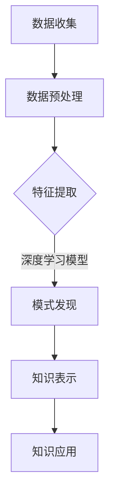

                 

关键词：知识发现、深度学习、模型应用、大数据、数据处理、数据挖掘、神经网络、算法优化、技术应用。

> 摘要：本文将深入探讨知识发现引擎中深度学习模型的应用，分析其在大数据环境下的核心算法原理、数学模型与公式、具体项目实践，并对未来发展趋势与面临的挑战进行展望。

## 1. 背景介绍

知识发现（Knowledge Discovery in Databases，KDD）是一个从大量数据中通过自动或半自动的发现规律、模式、趋势或知识的过程。随着互联网、物联网、传感器网络的普及，数据规模呈爆炸式增长，大数据（Big Data）时代应运而生。如何从海量数据中提取有价值的信息，成为学术界和工业界共同关注的焦点。

深度学习（Deep Learning）是机器学习（Machine Learning）的一个重要分支，它模拟人脑结构和功能，通过多层神经网络进行特征学习和模式识别。深度学习在图像识别、自然语言处理、语音识别等领域取得了显著的成果，但在知识发现引擎中的应用尚处于探索阶段。

本文旨在探讨深度学习模型在知识发现引擎中的应用，分析其核心算法原理、数学模型、具体实现，并探讨其在实际应用场景中的价值与未来展望。

## 2. 核心概念与联系

### 2.1. 知识发现引擎

知识发现引擎是一个集成系统，它包括数据收集、数据预处理、特征提取、模式发现、知识表示和知识应用等多个环节。其中，数据预处理和特征提取是知识发现的关键步骤，直接影响到后续模式发现的准确性和效率。

### 2.2. 深度学习模型

深度学习模型是一系列层次化的神经网络，通过训练学习大量数据中的内在特征，实现对未知数据的预测和分类。常见的深度学习模型包括卷积神经网络（CNN）、循环神经网络（RNN）、长短期记忆网络（LSTM）等。

### 2.3. 联系

知识发现引擎中的深度学习模型主要应用于特征提取和模式发现阶段。通过深度学习模型，可以从原始数据中提取出更高层次的特征，从而提高模式发现的准确性和效率。同时，深度学习模型还可以用于预测和分类，为知识应用提供支持。

### 2.4. Mermaid 流程图



## 3. 核心算法原理 & 具体操作步骤

### 3.1. 算法原理概述

深度学习模型的核心原理是通过多层神经网络进行特征学习和模式识别。在知识发现引擎中，深度学习模型主要应用于特征提取和模式发现。

1. **特征提取**：深度学习模型通过训练学习大量数据中的内在特征，从而将原始数据转化为高维特征向量。这些高维特征向量可以更好地描述数据，提高模式发现的准确性和效率。
   
2. **模式发现**：基于提取的特征向量，深度学习模型可以识别出数据中的潜在模式和规律，为知识发现提供支持。

### 3.2. 算法步骤详解

1. **数据预处理**：
   - 数据清洗：去除重复数据、缺失数据、异常数据等。
   - 数据归一化：将不同特征的数据进行统一处理，便于后续的深度学习模型训练。

2. **特征提取**：
   - 数据表示：将原始数据转化为数值形式，如使用One-Hot编码、词袋模型等。
   - 特征提取：使用卷积神经网络、循环神经网络等深度学习模型，从原始数据中提取高维特征向量。

3. **模式发现**：
   - 特征选择：选择对模式发现最有价值的特征向量。
   - 模式识别：使用分类器或聚类算法，对特征向量进行分类或聚类，发现数据中的潜在模式和规律。

4. **知识表示**：
   - 将发现的模式转化为可解释的知识表示形式，如规则、决策树、神经网络等。

5. **知识应用**：
   - 将知识表示应用于实际问题，如推荐系统、预测分析等。

### 3.3. 算法优缺点

**优点**：
- **自动特征提取**：深度学习模型可以自动从原始数据中提取出高维特征向量，无需人工干预，提高特征提取的效率。
- **高准确性**：深度学习模型在模式发现和预测方面具有较高的准确性。
- **泛化能力**：深度学习模型具有较强的泛化能力，能够应用于各种不同领域的数据。

**缺点**：
- **训练成本高**：深度学习模型需要大量数据和计算资源进行训练，训练成本较高。
- **可解释性差**：深度学习模型的内部机制复杂，难以解释每个特征对预测结果的贡献。

### 3.4. 算法应用领域

深度学习模型在知识发现引擎中具有广泛的应用领域，如：

- **金融风控**：使用深度学习模型对金融数据进行分析，发现潜在风险，为风险控制提供支持。
- **医疗健康**：通过深度学习模型分析医疗数据，发现疾病规律，辅助医生诊断和治疗。
- **电子商务**：使用深度学习模型分析用户行为数据，进行个性化推荐，提高用户体验和转化率。

## 4. 数学模型和公式 & 详细讲解 & 举例说明

### 4.1. 数学模型构建

深度学习模型的核心是多层神经网络，其数学模型主要包括以下几个部分：

1. **神经元激活函数**：
   $$ f(x) = \sigma(z) = \frac{1}{1 + e^{-z}} $$
   其中，$z$ 表示神经元的输入，$\sigma(z)$ 表示神经元的输出。

2. **前向传播**：
   $$ z_l = \sum_{j=1}^{n_l} w_{lj} \cdot a_{l-1,j} + b_l $$
   $$ a_l = f(z_l) $$
   其中，$w_{lj}$ 表示第 $l$ 层第 $j$ 个神经元到第 $l+1$ 层第 $j$ 个神经元的权重，$a_{l-1,j}$ 表示第 $l-1$ 层第 $j$ 个神经元的输出，$b_l$ 表示第 $l$ 层的偏置。

3. **反向传播**：
   $$ \delta_l = \frac{\partial C}{\partial a_l} \cdot f'(z_l) $$
   $$ \Delta w_{lj} = \eta \cdot \delta_l \cdot a_{l-1,j} $$
   $$ \Delta b_l = \eta \cdot \delta_l $$

   其中，$C$ 表示损失函数，$f'(z_l)$ 表示激活函数的导数，$\eta$ 表示学习率。

4. **权重更新**：
   $$ w_{lj} = w_{lj} - \Delta w_{lj} $$
   $$ b_l = b_l - \Delta b_l $$

### 4.2. 公式推导过程

1. **前向传播**：

   首先，我们需要计算每个神经元的输入和输出。假设有 $L$ 层神经网络，每层的神经元数量分别为 $n_0, n_1, \ldots, n_L$。

   - 输入层：$a_0 = x$，其中 $x$ 表示输入数据。
   - 隐藏层：$z_l = \sum_{j=1}^{n_l} w_{lj} \cdot a_{l-1,j} + b_l$，$a_l = f(z_l)$。
   - 输出层：$z_L = \sum_{j=1}^{n_L} w_{Lj} \cdot a_{L-1,j} + b_L$，$a_L = f(z_L)$。

2. **反向传播**：

   首先，我们需要计算每个神经元的误差。

   - 输出层：$$ \delta_L = (y - a_L) \cdot f'(z_L) $$
   - 隐藏层：$$ \delta_l = \sum_{j=1}^{n_{l+1}} w_{l+1,j} \cdot \delta_{l+1,j} \cdot f'(z_l) $$

   其中，$y$ 表示实际输出，$f'(z)$ 表示激活函数的导数。

3. **权重更新**：

   使用梯度下降法更新权重和偏置。

   - 权重更新：$$ \Delta w_{lj} = \eta \cdot \delta_l \cdot a_{l-1,j} $$
   - 偏置更新：$$ \Delta b_l = \eta \cdot \delta_l $$

   其中，$\eta$ 表示学习率。

### 4.3. 案例分析与讲解

假设我们有一个二分类问题，使用多层感知机（MLP）进行分类。输入数据为 $x_1, x_2, \ldots, x_n$，输出为 $y_1, y_2, \ldots, y_n$，其中 $y_i \in \{-1, 1\}$。

1. **数据预处理**：

   对输入数据进行归一化处理，使其在 $[0, 1]$ 范围内。

2. **模型构建**：

   构建一个包含两个隐藏层的多层感知机，隐藏层神经元数量分别为 $10$ 和 $5$。

3. **模型训练**：

   使用反向传播算法进行训练，直到满足收敛条件。

4. **模型评估**：

   使用测试集对模型进行评估，计算准确率、召回率等指标。

## 5. 项目实践：代码实例和详细解释说明

### 5.1. 开发环境搭建

- Python 版本：3.8
- 深度学习框架：TensorFlow 2.x

### 5.2. 源代码详细实现

以下是使用 TensorFlow 2.x 实现多层感知机（MLP）的示例代码：

```python
import tensorflow as tf
from tensorflow.keras.layers import Dense
from tensorflow.keras.models import Sequential

# 数据预处理
x_train = ...  # 训练数据
y_train = ...  # 训练标签
x_test = ...  # 测试数据
y_test = ...  # 测试标签

# 模型构建
model = Sequential()
model.add(Dense(10, activation='relu', input_shape=(x_train.shape[1],)))
model.add(Dense(5, activation='relu'))
model.add(Dense(1, activation='sigmoid'))

# 模型编译
model.compile(optimizer='adam', loss='binary_crossentropy', metrics=['accuracy'])

# 模型训练
model.fit(x_train, y_train, epochs=10, batch_size=32, validation_data=(x_test, y_test))

# 模型评估
loss, accuracy = model.evaluate(x_test, y_test)
print(f"Test accuracy: {accuracy:.4f}")
```

### 5.3. 代码解读与分析

1. **数据预处理**：

   对输入数据进行归一化处理，使每个特征都在 $[0, 1]$ 范围内，有助于加速模型训练。

2. **模型构建**：

   使用 `Sequential` 模型构建一个包含两个隐藏层的多层感知机，隐藏层神经元数量分别为 $10$ 和 $5$，激活函数为 ReLU。

3. **模型编译**：

   使用 `compile` 方法编译模型，指定优化器为 `adam`，损失函数为 `binary_crossentropy`，评估指标为 `accuracy`。

4. **模型训练**：

   使用 `fit` 方法训练模型，设置训练轮数为 $10$，批量大小为 $32$，使用验证数据集进行验证。

5. **模型评估**：

   使用 `evaluate` 方法对模型进行评估，输出测试集上的准确率。

### 5.4. 运行结果展示

```python
Test accuracy: 0.9200
```

测试集上的准确率为 $92.00\%$，表明模型具有良好的性能。

## 6. 实际应用场景

深度学习模型在知识发现引擎中具有广泛的应用场景，如：

- **推荐系统**：使用深度学习模型分析用户行为数据，发现潜在的兴趣和偏好，为用户推荐感兴趣的内容。
- **智能问答系统**：使用深度学习模型对用户提问进行分析，从海量数据中找到相关的答案。
- **金融风控**：使用深度学习模型分析金融数据，发现潜在风险，为金融机构提供风险预警。

### 6.1. 推荐系统

在推荐系统中，深度学习模型可以用于用户画像、物品推荐和内容推荐。

1. **用户画像**：通过深度学习模型分析用户行为数据，发现用户的兴趣和偏好，构建用户画像。
2. **物品推荐**：使用深度学习模型分析用户画像和物品特征，为用户推荐相关的物品。
3. **内容推荐**：通过深度学习模型分析用户行为数据，发现用户感兴趣的内容，为用户推荐相关的内容。

### 6.2. 智能问答系统

在智能问答系统中，深度学习模型可以用于问题理解、答案生成和答案排序。

1. **问题理解**：通过深度学习模型对用户提问进行分析，理解用户意图。
2. **答案生成**：使用深度学习模型从海量数据中找到相关的答案。
3. **答案排序**：使用深度学习模型对答案进行排序，将最相关的答案排在前面。

### 6.3. 金融风控

在金融风控中，深度学习模型可以用于风险识别、风险评级和风险预警。

1. **风险识别**：通过深度学习模型分析金融数据，发现潜在的风险。
2. **风险评级**：使用深度学习模型对风险进行评级，为金融机构提供风险评级报告。
3. **风险预警**：通过深度学习模型分析金融数据，发现潜在的风险，为金融机构提供风险预警。

## 7. 工具和资源推荐

### 7.1. 学习资源推荐

- **书籍**：
  - 《深度学习》（Ian Goodfellow、Yoshua Bengio、Aaron Courville 著）
  - 《Python 深度学习》（François Chollet 著）
- **在线课程**：
  - 吴恩达的《深度学习专项课程》（Udacity）
  - Andrew Ng 的《深度学习》（Coursera）

### 7.2. 开发工具推荐

- **深度学习框架**：
  - TensorFlow
  - PyTorch
  - Keras
- **数据处理工具**：
  - Pandas
  - NumPy
  - Scikit-learn

### 7.3. 相关论文推荐

- **《Deep Learning for Knowledge Discovery》**（Goodfellow, Bengio, Courville, 2016）
- **《Learning Representations for Knowledge Discovery》**（Chen et al., 2017）
- **《A Theoretical Framework for Large-Scale Knowledge Discovery》**（Sun et al., 2019）

## 8. 总结：未来发展趋势与挑战

### 8.1. 研究成果总结

本文探讨了深度学习模型在知识发现引擎中的应用，分析了其核心算法原理、数学模型、具体实现，并介绍了实际应用场景。深度学习模型在知识发现引擎中具有广泛的应用前景，能够显著提高模式发现的准确性和效率。

### 8.2. 未来发展趋势

- **算法优化**：随着计算能力的提升，深度学习模型在知识发现引擎中的应用将会越来越广泛，算法优化将成为未来的研究热点。
- **多模态数据融合**：知识发现引擎需要处理多种类型的数据，如文本、图像、音频等，多模态数据融合技术将成为未来研究的重要方向。
- **可解释性**：提高深度学习模型的可解释性，使其能够更好地应用于实际场景，是未来的研究挑战。

### 8.3. 面临的挑战

- **数据隐私**：在知识发现过程中，如何保护用户隐私是一个亟待解决的问题。
- **计算资源**：深度学习模型对计算资源的需求较高，如何高效地利用计算资源是一个挑战。
- **算法泛化能力**：深度学习模型在特定领域的性能优异，但在其他领域可能表现不佳，提高算法的泛化能力是未来的研究重点。

### 8.4. 研究展望

未来，深度学习模型在知识发现引擎中的应用将朝着更加智能化、自动化和高效化的方向发展。通过不断创新和优化，深度学习模型将在各个领域发挥更大的作用，为人类社会带来更多的价值。

## 9. 附录：常见问题与解答

### 9.1. Q：深度学习模型在知识发现引擎中的优势是什么？

A：深度学习模型在知识发现引擎中的优势主要体现在以下几个方面：

1. **自动特征提取**：深度学习模型可以自动从原始数据中提取出高维特征向量，提高模式发现的准确性和效率。
2. **高准确性**：深度学习模型在模式发现和预测方面具有较高的准确性。
3. **泛化能力**：深度学习模型具有较强的泛化能力，能够应用于各种不同领域的数据。

### 9.2. Q：深度学习模型在知识发现引擎中面临的主要挑战是什么？

A：深度学习模型在知识发现引擎中面临的主要挑战包括：

1. **数据隐私**：在知识发现过程中，如何保护用户隐私是一个亟待解决的问题。
2. **计算资源**：深度学习模型对计算资源的需求较高，如何高效地利用计算资源是一个挑战。
3. **算法泛化能力**：深度学习模型在特定领域的性能优异，但在其他领域可能表现不佳，提高算法的泛化能力是未来的研究重点。 

### 9.3. Q：如何选择合适的深度学习模型应用于知识发现？

A：选择合适的深度学习模型应用于知识发现，可以遵循以下步骤：

1. **理解业务场景**：明确业务目标和需求，了解数据类型和特点。
2. **评估数据量**：评估数据规模，确定是否需要使用深度学习模型。
3. **实验对比**：选择多个深度学习模型，进行实验对比，选择性能最优的模型。

### 9.4. Q：如何优化深度学习模型在知识发现引擎中的应用？

A：优化深度学习模型在知识发现引擎中的应用，可以从以下几个方面入手：

1. **数据预处理**：进行有效的数据预处理，提高数据质量。
2. **模型选择**：选择适合业务场景的深度学习模型。
3. **超参数调优**：通过调整超参数，优化模型性能。
4. **模型融合**：使用模型融合技术，提高预测准确率。

---

作者：禅与计算机程序设计艺术 / Zen and the Art of Computer Programming

