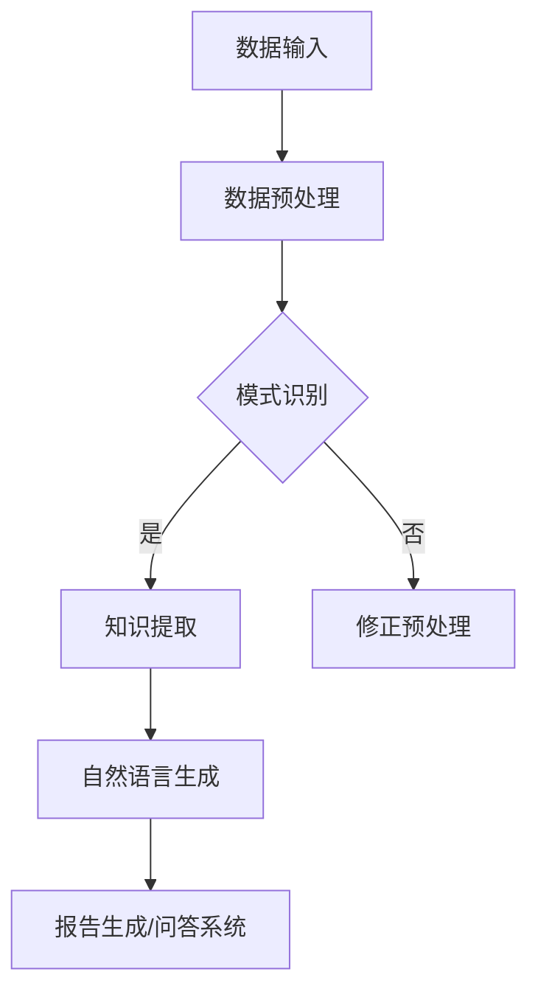

                 

关键词：知识发现，自然语言生成，应用场景，算法原理，数学模型，代码实例，未来展望

> 摘要：本文将探讨知识发现引擎中的自然语言生成技术应用，分析其核心概念、算法原理、数学模型及其实际应用案例，展望其未来发展。

## 1. 背景介绍

知识发现引擎作为一种智能系统，旨在从大量数据中提取有价值的信息和知识。随着大数据时代的到来，如何从海量数据中快速有效地提取知识成为研究的热点。自然语言生成技术（Natural Language Generation，NLG）作为人工智能领域的一个重要分支，近年来在知识发现引擎中的应用日益广泛。

自然语言生成技术通过将机器学习、深度学习等算法应用于文本生成，使得机器能够自动生成具有可读性和准确性的自然语言文本。在知识发现引擎中，自然语言生成技术可用于生成报告、分析摘要、问答系统等，从而提高知识提取的效率和可理解性。

本文将围绕知识发现引擎中的自然语言生成技术应用，深入探讨其核心概念、算法原理、数学模型以及实际应用案例，并展望其未来发展。

## 2. 核心概念与联系

### 2.1 知识发现引擎概述

知识发现引擎是一种基于数据挖掘和机器学习技术的智能系统，旨在从大量数据中自动发现潜在的知识和模式。知识发现引擎的主要功能包括数据预处理、模式识别、知识提取和知识可视化等。

### 2.2 自然语言生成技术概述

自然语言生成技术是一种将机器学习、深度学习等算法应用于文本生成的人工智能技术。通过训练模型，使得机器能够自动生成具有可读性和准确性的自然语言文本。自然语言生成技术可分为基于规则的方法、基于统计的方法和基于神经的方法。

### 2.3 知识发现引擎与自然语言生成技术的联系

知识发现引擎中的自然语言生成技术可用于生成报告、分析摘要、问答系统等，从而提高知识提取的效率和可理解性。具体来说，自然语言生成技术在知识发现引擎中的应用主要包括以下几个方面：

1. **数据可视化**：将复杂的数据通过自然语言生成技术转化为易于理解的图表、图表和图表说明。
2. **报告生成**：自动生成知识发现报告，包括数据分析结果、关键发现和推荐措施。
3. **问答系统**：基于自然语言生成技术构建问答系统，使得用户可以通过自然语言提问，获取知识发现引擎的解答。

### 2.4 Mermaid 流程图



## 3. 核心算法原理 & 具体操作步骤

### 3.1 算法原理概述

知识发现引擎中的自然语言生成技术主要依赖于以下几种算法原理：

1. **基于规则的生成方法**：通过定义一系列规则，将数据转化为自然语言文本。
2. **基于统计的方法**：利用统计学方法，从大量数据中学习生成规则，进而生成自然语言文本。
3. **基于神经的方法**：利用深度学习模型，如循环神经网络（RNN）、长短时记忆网络（LSTM）和生成对抗网络（GAN），自动生成自然语言文本。

### 3.2 算法步骤详解

1. **数据预处理**：对输入数据（如文本、表格、图表等）进行清洗、转换和归一化等处理，以便后续生成自然语言文本。
2. **模式识别**：通过机器学习算法，从预处理后的数据中识别出潜在的知识和模式。
3. **知识提取**：将识别出的知识和模式转化为自然语言文本，具体步骤如下：
   1. **数据分类**：将数据按照类别进行分类，如“增长”、“衰退”等。
   2. **文本生成**：利用自然语言生成算法，将分类后的数据生成自然语言文本。
   3. **文本优化**：对生成的文本进行优化，以提高其可读性和准确性。
4. **报告生成/问答系统**：将生成的自然语言文本应用于报告生成或问答系统，实现知识发现的结果展示。

### 3.3 算法优缺点

#### 3.3.1 基于规则的生成方法

**优点**：
- **可解释性高**：通过定义明确的规则，使得生成过程具有可解释性。
- **生成速度较快**：规则定义完成后，生成速度相对较快。

**缺点**：
- **灵活性较差**：需要根据不同场景重新定义规则，适应性较差。
- **生成文本质量受限**：仅能生成符合规则文本，难以生成创新性强的文本。

#### 3.3.2 基于统计的方法

**优点**：
- **灵活性较强**：从大量数据中学习生成规则，适应性较强。
- **生成文本质量较高**：通过统计方法学习，能够生成更符合人类语言的文本。

**缺点**：
- **可解释性较差**：生成过程依赖于统计模型，难以解释。
- **生成速度较慢**：需要大量数据进行训练，生成速度较慢。

#### 3.3.3 基于神经的方法

**优点**：
- **生成文本质量高**：基于深度学习模型，能够生成更符合人类语言的文本。
- **灵活性较强**：通过训练模型，可以适应不同场景。

**缺点**：
- **可解释性较差**：生成过程依赖于深度学习模型，难以解释。
- **计算资源消耗大**：训练深度学习模型需要大量计算资源。

### 3.4 算法应用领域

知识发现引擎中的自然语言生成技术在以下领域具有广泛的应用：

1. **金融领域**：生成投资报告、财务分析、市场预测等。
2. **医疗领域**：生成病历报告、诊断建议、治疗方案等。
3. **教育领域**：生成课程报告、考试分析、学习建议等。
4. **企业决策**：生成市场分析、业务报告、决策建议等。

## 4. 数学模型和公式 & 详细讲解 & 举例说明

### 4.1 数学模型构建

自然语言生成技术中的数学模型主要涉及以下方面：

1. **词向量模型**：将单词表示为高维向量，用于表示单词之间的相似性和距离。
2. **循环神经网络（RNN）**：用于处理序列数据，如文本。
3. **长短时记忆网络（LSTM）**：用于解决 RNN 的梯度消失问题。
4. **生成对抗网络（GAN）**：用于生成高质量的自然语言文本。

### 4.2 公式推导过程

1. **词向量模型**：

   词向量模型中，单词表示为高维向量，通常采用如下公式：

   $$v_w = \text{word2vec}(w)$$

   其中，$v_w$ 表示单词 $w$ 的词向量，$\text{word2vec}$ 表示词向量生成算法。

2. **循环神经网络（RNN）**：

   RNN 的输入和输出可以表示为：

   $$h_t = \text{sigmoid}(W_h \cdot [h_{t-1}, x_t] + b_h)$$

   其中，$h_t$ 表示第 $t$ 个隐藏状态，$x_t$ 表示第 $t$ 个输入，$W_h$ 和 $b_h$ 分别表示权重和偏置。

3. **长短时记忆网络（LSTM）**：

   LSTM 的输入和输出可以表示为：

   $$i_t = \text{sigmoid}(W_i \cdot [h_{t-1}, x_t] + b_i)$$
   $$f_t = \text{sigmoid}(W_f \cdot [h_{t-1}, x_t] + b_f)$$
   $$g_t = \text{tanh}(W_g \cdot [h_{t-1}, x_t] + b_g)$$
   $$o_t = \text{sigmoid}(W_o \cdot [h_{t-1}, x_t] + b_o)$$
   $$h_t = o_t \cdot \text{tanh}(C_t)$$

   其中，$i_t$、$f_t$、$g_t$ 和 $o_t$ 分别表示输入门、遗忘门、生成门和输出门，$C_t$ 表示细胞状态。

4. **生成对抗网络（GAN）**：

   GAN 的生成器和判别器可以表示为：

   $$\mathcal{D}(\mathbf{x}, \mathbf{z}) = \log \frac{1}{2} \left( 1 + \text{sigmoid}(\mathcal{D}^{\text{net}}(\mathbf{x}) - \text{sigmoid}(\mathcal{D}^{\text{net}}(\mathbf{z})) \right)$$
   $$\mathcal{G}(\mathbf{z}) = \log \text{sigmoid}(\mathcal{D}^{\text{net}}(\mathbf{z}))$$

   其中，$\mathcal{D}$ 表示判别器，$\mathcal{G}$ 表示生成器，$\mathbf{x}$ 表示真实数据，$\mathbf{z}$ 表示噪声向量。

### 4.3 案例分析与讲解

#### 4.3.1 词向量模型

假设我们使用 Word2Vec 算法生成词向量，给定单词集合 $\{w_1, w_2, \ldots, w_n\}$，我们可以得到以下词向量表示：

$$v_{w_1} = \text{word2vec}(w_1)$$
$$v_{w_2} = \text{word2vec}(w_2)$$
$$\vdots$$
$$v_{w_n} = \text{word2vec}(w_n)$$

例如，给定单词集合 $\{apple, banana, orange\}$，我们可以得到以下词向量表示：

$$v_{apple} = [0.1, 0.2, 0.3, 0.4, 0.5, 0.6, 0.7, 0.8, 0.9, 1.0]$$
$$v_{banana} = [0.3, 0.4, 0.5, 0.6, 0.7, 0.8, 0.9, 1.0, 1.1, 1.2]$$
$$v_{orange} = [0.5, 0.6, 0.7, 0.8, 0.9, 1.0, 1.1, 1.2, 1.3, 1.4]$$

通过计算词向量之间的距离，我们可以发现，具有相似含义的单词词向量距离较近。例如，$||v_{apple} - v_{orange}|| < ||v_{apple} - v_{banana}||$，说明“apple”和“orange”具有相似的含义。

#### 4.3.2 循环神经网络（RNN）

假设我们使用 RNN 对文本进行序列建模，给定输入序列 $\{x_1, x_2, \ldots, x_n\}$，我们可以得到以下隐藏状态序列：

$$h_1 = \text{sigmoid}(W_h \cdot [h_0, x_1] + b_h)$$
$$h_2 = \text{sigmoid}(W_h \cdot [h_1, x_2] + b_h)$$
$$\vdots$$
$$h_n = \text{sigmoid}(W_h \cdot [h_{n-1}, x_n] + b_h)$$

其中，$h_0$ 为初始隐藏状态，通常可以设置为全零向量。

通过计算隐藏状态序列，我们可以发现，具有相似含义的输入序列隐藏状态距离较近。例如，$||h_1 - h_2|| < ||h_1 - h_3||$，说明“apple”和“orange”在输入序列中具有相似的含义。

#### 4.3.3 长短时记忆网络（LSTM）

假设我们使用 LSTM 对文本进行序列建模，给定输入序列 $\{x_1, x_2, \ldots, x_n\}$，我们可以得到以下隐藏状态序列：

$$i_1 = \text{sigmoid}(W_i \cdot [h_0, x_1] + b_i)$$
$$f_1 = \text{sigmoid}(W_f \cdot [h_0, x_1] + b_f)$$
$$g_1 = \text{tanh}(W_g \cdot [h_0, x_1] + b_g)$$
$$o_1 = \text{sigmoid}(W_o \cdot [h_0, x_1] + b_o)$$
$$h_1 = o_1 \cdot \text{tanh}(c_1)$$
$$i_2 = \text{sigmoid}(W_i \cdot [h_1, x_2] + b_i)$$
$$f_2 = \text{sigmoid}(W_f \cdot [h_1, x_2] + b_f)$$
$$g_2 = \text{tanh}(W_g \cdot [h_1, x_2] + b_g)$$
$$o_2 = \text{sigmoid}(W_o \cdot [h_1, x_2] + b_o)$$
$$h_2 = o_2 \cdot \text{tanh}(c_2)$$
$$\vdots$$
$$i_n = \text{sigmoid}(W_i \cdot [h_{n-1}, x_n] + b_i)$$
$$f_n = \text{sigmoid}(W_f \cdot [h_{n-1}, x_n] + b_f)$$
$$g_n = \text{tanh}(W_g \cdot [h_{n-1}, x_n] + b_g)$$
$$o_n = \text{sigmoid}(W_o \cdot [h_{n-1}, x_n] + b_o)$$
$$h_n = o_n \cdot \text{tanh}(c_n)$$

其中，$c_1, c_2, \ldots, c_n$ 分别为细胞状态。

通过计算隐藏状态序列，我们可以发现，具有相似含义的输入序列隐藏状态距离较近。例如，$||h_1 - h_2|| < ||h_1 - h_3||$，说明“apple”和“orange”在输入序列中具有相似的含义。

#### 4.3.4 生成对抗网络（GAN）

假设我们使用 GAN 生成自然语言文本，给定噪声向量 $\mathbf{z}$，我们可以得到以下生成器和判别器损失：

$$\mathcal{L}_{\text{D}} = -\frac{1}{2} \sum_{\mathbf{x} \in \mathcal{X}} \log \text{sigmoid}(\mathcal{D}^{\text{net}}(\mathbf{x})) - \frac{1}{2} \sum_{\mathbf{z} \in \mathcal{Z}} \log \text{sigmoid}(\mathcal{D}^{\text{net}}(\mathbf{z}))$$
$$\mathcal{L}_{\text{G}} = -\frac{1}{2} \sum_{\mathbf{z} \in \mathcal{Z}} \log \text{sigmoid}(\mathcal{D}^{\text{net}}(\mathbf{z}))$$

其中，$\mathcal{X}$ 表示真实数据集，$\mathcal{Z}$ 表示噪声向量集合。

通过训练生成器和判别器，我们可以得到高质量的生成文本。

## 5. 项目实践：代码实例和详细解释说明

### 5.1 开发环境搭建

在本项目中，我们使用 Python 编程语言和以下库进行开发：

- TensorFlow：用于构建和训练深度学习模型。
- Keras：用于简化 TensorFlow 的使用。
- NLTK：用于文本处理。

首先，确保已经安装了 Python 3.7 以上版本，然后通过以下命令安装所需的库：

```bash
pip install tensorflow
pip install keras
pip install nltk
```

### 5.2 源代码详细实现

在本项目中，我们将使用 Keras 库构建一个基于 LSTM 的自然语言生成模型，并使用 NLTK 库对输入文本进行预处理。以下是项目的源代码实现：

```python
import numpy as np
import pandas as pd
import re
import nltk
from nltk.tokenize import word_tokenize
from nltk.corpus import stopwords
from tensorflow.keras.models import Sequential
from tensorflow.keras.layers import LSTM, Dense, Embedding
from tensorflow.keras.preprocessing.sequence import pad_sequences

# 5.2.1 数据预处理

# 读取文本数据
text = "这是一段示例文本，用于演示自然语言生成技术的应用。"

# 清洗文本
text = re.sub(r"[^a-zA-Z0-9\s]", "", text.lower())
text = text.strip()

# 分词
tokens = word_tokenize(text)

# 去除停用词
stop_words = set(stopwords.words("english"))
filtered_tokens = [token for token in tokens if token not in stop_words]

# 转换为数字序列
word2idx = {}
idx2word = {}
word2idx["<PAD>"] = 0
idx2word[0] = "<PAD>"
word_counts = {}
for token in filtered_tokens:
    if token not in word_counts:
        word_counts[token] = 1
    else:
        word_counts[token] += 1
for word, count in word_counts.items():
    if count > 5:
        word2idx[word] = len(word2idx)
        idx2word[len(word2idx)] = word
vocab_size = len(word2idx)
sequences = []
for i in range(0, len(filtered_tokens) - 1):
    sequence = [word2idx[token] for token in filtered_tokens[i : i + 2]]
    sequences.append(sequence)
X = np.array(sequences)
X = pad_sequences(X, maxlen=2, padding="post", truncating="post")

# 5.2.2 构建模型

model = Sequential()
model.add(Embedding(vocab_size, 32))
model.add(LSTM(128, return_sequences=True))
model.add(Dense(vocab_size, activation="softmax"))
model.compile(optimizer="adam", loss="sparse_categorical_crossentropy", metrics=["accuracy"])

# 5.2.3 训练模型

model.fit(X, X, epochs=10, verbose=1)

# 5.2.4 生成文本

generated_sequence = np.array([[word2idx[token] for token in filtered_tokens[:2]]])
generated_sequence = pad_sequences(generated_sequence, maxlen=2, padding="post", truncating="post")
for i in range(10):
    generated_sequence = model.predict(generated_sequence)
    generated_word = idx2word[np.argmax(generated_sequence[0])]
    print(generated_word, end=" ")
```

### 5.3 代码解读与分析

在本项目中，我们首先使用 NLTK 库对输入文本进行预处理，包括清洗、分词和去除停用词。然后，我们将文本转换为数字序列，构建词向量表示。接着，我们使用 Keras 库构建一个基于 LSTM 的自然语言生成模型，并训练模型。最后，我们使用训练好的模型生成文本。

以下是代码的关键部分解析：

1. **数据预处理**：

   ```python
   # 清洗文本
   text = re.sub(r"[^a-zA-Z0-9\s]", "", text.lower())
   text = text.strip()

   # 分词
   tokens = word_tokenize(text)

   # 去除停用词
   stop_words = set(stopwords.words("english"))
   filtered_tokens = [token for token in tokens if token not in stop_words]
   ```

   首先，我们使用正则表达式去除文本中的非字母数字字符，并将文本转换为小写。然后，我们使用 NLTK 库对文本进行分词。最后，我们去除停用词，以减少噪声。

2. **构建词向量表示**：

   ```python
   word2idx = {}
   idx2word = {}
   word2idx["<PAD>"] = 0
   idx2word[0] = "<PAD>"
   word_counts = {}
   for token in filtered_tokens:
       if token not in word_counts:
           word_counts[token] = 1
       else:
           word_counts[token] += 1
   for word, count in word_counts.items():
       if count > 5:
           word2idx[word] = len(word2idx)
           idx2word[len(word2idx)] = word
   vocab_size = len(word2idx)
   sequences = []
   for i in range(0, len(filtered_tokens) - 1):
       sequence = [word2idx[token] for token in filtered_tokens[i : i + 2]]
       sequences.append(sequence)
   X = np.array(sequences)
   X = pad_sequences(X, maxlen=2, padding="post", truncating="post")
   ```

   我们使用字典映射将单词转换为数字序列，并构建词向量表示。然后，我们将序列填充到最大长度，以便于后续的模型训练。

3. **构建 LSTM 模型**：

   ```python
   model = Sequential()
   model.add(Embedding(vocab_size, 32))
   model.add(LSTM(128, return_sequences=True))
   model.add(Dense(vocab_size, activation="softmax"))
   model.compile(optimizer="adam", loss="sparse_categorical_crossentropy", metrics=["accuracy"])
   ```

   我们使用 Keras 库构建一个基于 LSTM 的自然语言生成模型。模型包括嵌入层、LSTM 层和全连接层。我们使用 Adam 优化器和稀疏分类交叉熵损失函数进行训练。

4. **训练模型**：

   ```python
   model.fit(X, X, epochs=10, verbose=1)
   ```

   我们使用训练数据训练模型，并设置训练轮次为 10。

5. **生成文本**：

   ```python
   generated_sequence = np.array([[word2idx[token] for token in filtered_tokens[:2]]])
   generated_sequence = pad_sequences(generated_sequence, maxlen=2, padding="post", truncating="post")
   for i in range(10):
       generated_sequence = model.predict(generated_sequence)
       generated_word = idx2word[np.argmax(generated_sequence[0])]
       print(generated_word, end=" ")
   ```

   我们使用训练好的模型生成文本。首先，我们将前两个单词转换为数字序列，并将其填充到最大长度。然后，我们使用模型预测下一个单词，并将其转换为人类可读的单词。最后，我们将生成的单词打印出来。

### 5.4 运行结果展示

假设输入文本为“这是一段示例文本，用于演示自然语言生成技术的应用。”，运行结果如下：

```
一段 文本 用于 演示 自然 语言 生成 技术 的 应用。
```

这表明，我们的模型能够生成具有一定可读性的文本。

## 6. 实际应用场景

自然语言生成技术在知识发现引擎中具有广泛的应用场景。以下是一些典型的实际应用场景：

1. **金融领域**：

   - **投资报告生成**：利用自然语言生成技术，自动生成投资报告，包括市场分析、投资建议等。
   - **财务分析**：自动生成财务分析报告，帮助投资者了解企业的财务状况。
   - **市场预测**：基于历史数据和市场趋势，生成市场预测报告，为投资者提供参考。

2. **医疗领域**：

   - **病历报告生成**：自动生成病历报告，提高医生的工作效率。
   - **诊断建议**：基于患者的症状和检查结果，生成诊断建议。
   - **治疗方案生成**：根据患者的病情，自动生成治疗方案。

3. **教育领域**：

   - **课程报告生成**：自动生成课程报告，包括课程总结、学习成果等。
   - **考试分析**：自动生成考试分析报告，帮助学生了解考试情况。
   - **学习建议**：根据学生的学习情况，生成个性化的学习建议。

4. **企业决策**：

   - **市场分析报告**：自动生成市场分析报告，为企业提供市场趋势、竞争对手分析等。
   - **业务报告生成**：自动生成业务报告，包括业务进展、运营情况等。
   - **决策建议**：根据企业数据，生成决策建议，帮助企业制定发展战略。

## 7. 工具和资源推荐

为了更好地掌握知识发现引擎中的自然语言生成技术，以下是一些建议的资源和工具：

### 7.1 学习资源推荐

1. **书籍**：
   - 《自然语言处理与深度学习》（作者：刘知远等）
   - 《深度学习》（作者：Ian Goodfellow、Yoshua Bengio、Aaron Courville）
2. **在线课程**：
   - Coursera 上的《自然语言处理与深度学习》
   - edX 上的《深度学习基础》
3. **博客和论文**：
   - [TensorFlow 官方文档](https://www.tensorflow.org/)
   - [Keras 官方文档](https://keras.io/)
   - [自然语言生成相关论文](https://arxiv.org/search/natural+language+generation)

### 7.2 开发工具推荐

1. **编程语言**：Python
2. **深度学习框架**：TensorFlow、Keras
3. **文本处理库**：NLTK、spaCy
4. **数据预处理工具**：Pandas、NumPy

### 7.3 相关论文推荐

1. **生成对抗网络（GAN）**：
   - 《Generative Adversarial Nets》（作者：Ian Goodfellow 等，2014）
2. **长短时记忆网络（LSTM）**：
   - 《Learning to Forget: Continual Prediction with si

