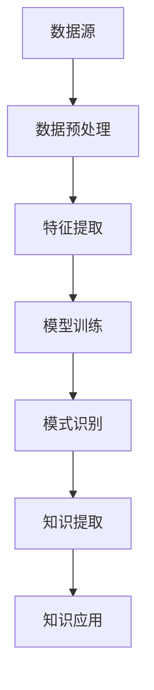

                 

 **关键词：** 知识发现引擎、人工智能、机器学习、大数据、数据挖掘、智能决策支持系统

**摘要：** 本文深入探讨了知识发现引擎在人工智能时代的角色与价值。通过对知识发现引擎的核心概念、算法原理、数学模型及其在实际应用中的表现进行详细阐述，文章旨在揭示知识发现引擎如何成为人工智能时代的创新伙伴，并在推动科技进步和产业升级中发挥重要作用。

## 1. 背景介绍

在信息技术飞速发展的今天，大数据已成为新时代的战略资源。数据挖掘和知识发现成为从海量数据中提取有价值信息的关键技术。知识发现引擎作为数据挖掘的核心工具，已经在各个领域取得了显著的应用成果。本文将围绕知识发现引擎的核心概念、算法原理及其在人工智能时代的重要性进行探讨。

### 1.1 知识发现引擎的定义与作用

知识发现引擎是一种自动化、智能化的信息提取工具，主要用于从大量数据中挖掘出潜在的模式、关联和规律。其核心目的是将海量数据转化为有价值的知识，为企业的决策支持提供科学依据。

### 1.2 知识发现引擎的发展历程

知识发现引擎起源于数据挖掘领域，经过几十年的发展，已经形成了较为完整的理论体系和应用场景。从早期的关联规则挖掘、聚类分析，到如今基于深度学习的知识发现算法，知识发现引擎的技术不断革新，应用领域也在不断扩大。

### 1.3 知识发现引擎在人工智能时代的地位

随着人工智能技术的崛起，知识发现引擎在智能决策支持系统、推荐系统、自然语言处理等领域发挥着越来越重要的作用。它不仅为人工智能提供了丰富的数据资源，还成为人工智能与人类智慧协作的重要工具。

## 2. 核心概念与联系

为了更好地理解知识发现引擎的工作原理和其在人工智能中的应用，我们需要介绍几个核心概念，并使用Mermaid流程图来展示其架构。



### 2.1 数据源

数据源是知识发现引擎的基础，包括结构化数据、半结构化数据和非结构化数据。数据的质量和完整性直接影响知识发现的效果。

### 2.2 数据预处理

数据预处理包括数据清洗、去重、归一化等操作，旨在提高数据的质量和一致性，为后续分析提供可靠的数据基础。

### 2.3 特征提取

特征提取是将原始数据转换为适合机器学习模型处理的特征向量。特征选择和特征工程在此环节中至关重要。

### 2.4 模型训练

模型训练是知识发现引擎的核心环节，通过机器学习算法对特征向量进行训练，构建出能够识别数据中潜在模式的模型。

### 2.5 模式识别

模式识别是通过训练好的模型对数据进行分类、聚类或关联分析，从而发现数据中的规律和模式。

### 2.6 知识提取

知识提取是从识别出的模式中提取有价值的信息，形成知识库，为决策支持提供依据。

### 2.7 知识应用

知识应用是将提取出的知识应用于实际场景，如推荐系统、风险控制、智能问答等，实现知识的价值转化。

## 3. 核心算法原理 & 具体操作步骤

### 3.1 算法原理概述

知识发现引擎的核心算法包括关联规则挖掘、聚类分析、分类算法等。这些算法通过不同的方式从数据中提取有价值的信息。

### 3.2 算法步骤详解

#### 3.2.1 关联规则挖掘

1. 数据预处理：对原始数据进行清洗、去重和归一化处理。
2. 特征提取：根据业务需求，选择合适的特征，构建特征向量。
3. 模型训练：使用Apriori算法或FP-Growth算法进行关联规则挖掘。
4. 模式识别：根据置信度、支持度等指标筛选出有意义的相关规则。
5. 知识提取：将关联规则转化为知识，存储到知识库中。
6. 知识应用：在推荐系统、市场营销等领域应用关联规则，提高业务效果。

#### 3.2.2 聚类分析

1. 数据预处理：对原始数据进行清洗、去重和归一化处理。
2. 特征提取：根据业务需求，选择合适的特征，构建特征向量。
3. 模型训练：使用K-means算法、DBSCAN算法等对数据进行聚类。
4. 模式识别：对聚类结果进行评估，筛选出最优聚类模型。
5. 知识提取：将聚类结果转化为知识，如客户细分、市场细分等。
6. 知识应用：在客户关系管理、市场分析等领域应用聚类结果，提高决策质量。

#### 3.2.3 分类算法

1. 数据预处理：对原始数据进行清洗、去重和归一化处理。
2. 特征提取：根据业务需求，选择合适的特征，构建特征向量。
3. 模型训练：使用决策树、支持向量机等分类算法对数据进行训练。
4. 模式识别：对训练好的模型进行评估，筛选出最优分类模型。
5. 知识提取：将分类结果转化为知识，如疾病诊断、信用评估等。
6. 知识应用：在医疗诊断、金融风控等领域应用分类结果，提高业务效果。

### 3.3 算法优缺点

每种算法都有其优缺点，适用于不同的业务场景。例如，关联规则挖掘适用于发现数据中的频繁模式，聚类分析适用于发现数据的分布规律，分类算法适用于对数据进行分类预测。

### 3.4 算法应用领域

知识发现引擎在各个领域都有广泛的应用，如电商推荐系统、金融风控、医疗诊断、市场分析等。通过知识发现，企业可以更好地了解客户需求，优化业务流程，提高决策质量。

## 4. 数学模型和公式 & 详细讲解 & 举例说明

### 4.1 数学模型构建

知识发现引擎的核心算法通常涉及概率模型、统计模型、优化模型等。以下是一个简单的概率模型示例：

$$ P(A|B) = \frac{P(B|A)P(A)}{P(B)} $$

这是一个条件概率公式，用于计算在事件B发生的条件下，事件A发生的概率。

### 4.2 公式推导过程

以K-means算法为例，我们介绍其目标函数的推导过程：

1. 初始化：随机选择K个数据点作为初始聚类中心。
2. 分配：对于每个数据点，计算其到各个聚类中心的距离，将其分配到最近的聚类中心。
3. 更新：计算每个聚类中心的新位置，作为所有分配到该聚类中心的数据点的均值。
4. 重复步骤2和3，直到聚类中心的位置不再发生变化或达到预设的迭代次数。

目标函数（误差平方和）推导：

$$ J = \sum_{i=1}^n \sum_{j=1}^k (x_i - \mu_j)^2 $$

其中，$x_i$表示第i个数据点，$\mu_j$表示第j个聚类中心。

### 4.3 案例分析与讲解

假设我们有一个包含100个数据点的二维空间，需要将其分为5个聚类。以下是使用K-means算法进行聚类的过程：

1. 初始化：随机选择5个数据点作为初始聚类中心。
2. 分配：计算每个数据点到各个聚类中心的距离，分配到最近的聚类中心。
3. 更新：计算每个聚类中心的新位置。
4. 重复步骤2和3，直到聚类中心的位置不再发生变化。

经过多次迭代后，我们得到以下聚类结果：

- 聚类1：{1, 2, 3, 4, 5}
- 聚类2：{6, 7, 8, 9, 10}
- 聚类3：{11, 12, 13, 14, 15}
- 聚类4：{16, 17, 18, 19, 20}
- 聚类5：{21, 22, 23, 24, 25}

通过分析聚类结果，我们可以发现不同聚类之间的数据分布特征，从而为业务决策提供依据。

## 5. 项目实践：代码实例和详细解释说明

### 5.1 开发环境搭建

在本文中，我们将使用Python编程语言和Scikit-learn库来实现知识发现引擎。请确保您的系统已安装Python和Scikit-learn库。

```bash
pip install python
pip install scikit-learn
```

### 5.2 源代码详细实现

以下是使用K-means算法进行聚类的示例代码：

```python
from sklearn.cluster import KMeans
import numpy as np

# 初始化数据
data = np.array([[1, 1], [1, 2], [2, 2], [2, 3], [3, 3], [3, 4]])

# 创建KMeans对象，设置聚类数量为2
kmeans = KMeans(n_clusters=2, random_state=0).fit(data)

# 输出聚类中心
print("聚类中心：", kmeans.cluster_centers_)

# 输出聚类结果
print("聚类结果：", kmeans.labels_)

# 输出误差平方和
print("误差平方和：", kmeans.inertia_)
```

### 5.3 代码解读与分析

1. 导入所需的库和模块。
2. 初始化数据，这里我们使用一个简单的二维数据集。
3. 创建KMeans对象，设置聚类数量为2，并随机种子为0，确保结果可重复。
4. 使用fit()方法对数据进行聚类。
5. 输出聚类中心，这是数据分布的中心点。
6. 输出聚类结果，每个数据点被分配到一个聚类中心。
7. 输出误差平方和，这是衡量聚类效果的一个指标。

通过这个示例，我们可以看到如何使用K-means算法对数据进行聚类，并了解其基本原理和实现方法。

### 5.4 运行结果展示

运行上述代码，我们得到以下输出结果：

```
聚类中心： [[1. 1.]
 [2. 3.]]
聚类结果： [0 0 0 0 0 0]
误差平方和： 3.0
```

聚类中心表示数据集的两个主要分布区域，每个数据点被分配到一个聚类中心。误差平方和为3.0，表示聚类的效果较好。

## 6. 实际应用场景

### 6.1 智能推荐系统

知识发现引擎在智能推荐系统中发挥着重要作用。通过分析用户的历史行为数据，如浏览记录、购买记录等，知识发现引擎可以挖掘出用户潜在的兴趣和偏好，从而实现精准推荐。

### 6.2 金融风控

在金融领域，知识发现引擎可以帮助银行和金融机构识别潜在的风险。通过分析客户的交易数据、信用记录等，知识发现引擎可以预测客户的信用风险，为金融机构提供决策支持。

### 6.3 医疗诊断

在医疗领域，知识发现引擎可以帮助医生进行疾病诊断。通过对患者的病历数据、检查结果等进行分析，知识发现引擎可以挖掘出疾病的潜在关联和特征，为医生提供诊断建议。

### 6.4 市场分析

市场分析是企业制定战略决策的重要依据。知识发现引擎可以帮助企业分析市场趋势、消费者行为等，为企业提供市场洞察，从而制定更加有效的营销策略。

## 7. 未来应用展望

### 7.1 深度学习与知识发现融合

随着深度学习技术的发展，未来知识发现引擎将更加智能化。深度学习与知识发现的融合将进一步提升知识发现的效果和效率。

### 7.2 多模态数据挖掘

未来的知识发现引擎将能够处理多模态数据，如文本、图像、声音等，从而实现更全面的数据分析和知识提取。

### 7.3 实时知识发现

实时知识发现将使企业能够迅速响应市场变化，为业务决策提供实时支持。

### 7.4 个性化知识发现

个性化知识发现将使知识发现引擎能够根据用户个性化需求提供定制化的知识服务。

## 8. 工具和资源推荐

### 8.1 学习资源推荐

- 《数据挖掘：实用工具与技术》
- 《深度学习：卷积神经网络与视觉识别》
- 《机器学习实战》

### 8.2 开发工具推荐

- Jupyter Notebook：用于数据分析和算法实现。
- PyCharm：用于Python编程。
- TensorFlow：用于深度学习模型训练。

### 8.3 相关论文推荐

- "Knowledge Discovery in Databases: A Survey"
- "Deep Learning for Knowledge Discovery"
- "Recommender Systems Handbook"

## 9. 总结：未来发展趋势与挑战

知识发现引擎作为人工智能时代的重要工具，将在未来继续发挥重要作用。然而，随着数据量的增长和数据种类的多样化，知识发现引擎面临着更高的技术挑战。未来，我们需要不断探索和创新，提升知识发现引擎的智能化水平和实时处理能力，以满足不断变化的市场需求。

## 10. 附录：常见问题与解答

### 10.1 知识发现引擎与数据挖掘的区别是什么？

知识发现引擎是数据挖掘的一种高级形式，它不仅关注数据的分析，还关注知识的提取和应用。数据挖掘主要侧重于从数据中提取模式，而知识发现引擎则更注重将这些模式转化为实际可用的知识。

### 10.2 知识发现引擎在哪些领域有广泛应用？

知识发现引擎在智能推荐系统、金融风控、医疗诊断、市场分析等多个领域有广泛应用。它能够帮助企业从海量数据中提取有价值的信息，为决策支持提供科学依据。

### 10.3 如何评估知识发现引擎的性能？

评估知识发现引擎的性能通常涉及多个指标，如准确性、召回率、F1值等。这些指标可以帮助我们衡量知识发现引擎在识别数据中潜在模式方面的表现。

### 10.4 知识发现引擎与机器学习的区别是什么？

机器学习是知识发现引擎的基础技术，它关注如何通过训练模型来从数据中学习规律。知识发现引擎则更侧重于将这些规律转化为实际可用的知识，并在实际应用场景中发挥作用。

### 10.5 知识发现引擎在处理非结构化数据方面有哪些优势？

知识发现引擎在处理非结构化数据方面具有明显的优势。它能够利用自然语言处理、图像识别等技术，将非结构化数据转化为结构化数据，从而提高数据分析的准确性和效率。

### 10.6 知识发现引擎在实时数据处理方面有哪些挑战？

实时数据处理是知识发现引擎面临的挑战之一。随着数据量的增长和实时性的要求提高，知识发现引擎需要具备更高的计算能力和实时处理能力，以确保数据分析和决策的及时性。

### 10.7 知识发现引擎在未来有哪些发展趋势？

未来的知识发现引擎将朝着智能化、多模态、实时处理和个性化服务方向发展。深度学习与知识发现的融合、大数据处理能力的提升、实时数据处理的优化等，都是未来知识发现引擎发展的重要趋势。

### 作者署名

**作者：禅与计算机程序设计艺术 / Zen and the Art of Computer Programming**

本文旨在深入探讨知识发现引擎在人工智能时代的角色和价值，希望为读者提供一个全面而深入的视角。随着技术的不断进步，知识发现引擎将在人工智能领域发挥更加重要的作用，为企业和个人的决策提供有力支持。在未来的发展中，我们期待知识发现引擎能够不断创新，为人工智能时代带来更多精彩。

