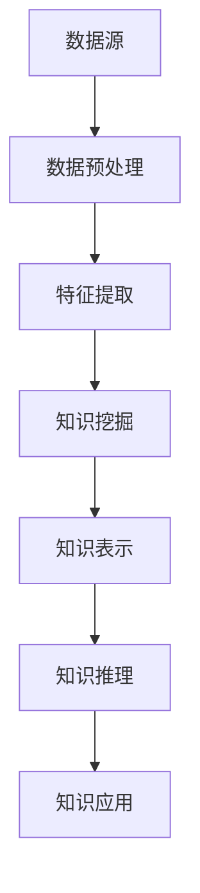

                 

关键词：知识发现引擎、认知科学、人工智能、机器学习、数据挖掘、知识图谱、图神经网络、认知图谱、知识推理、算法原理、数学模型、项目实践、应用场景、未来展望

> 摘要：本文深入探讨知识发现引擎这一新兴领域，分析了其核心概念、算法原理、数学模型以及应用实践。知识发现引擎不仅为人类认知提供了新的工具和方法，也为人工智能的发展打开了新的维度。通过对知识发现引擎的深入研究，我们期待能够更好地理解人类认知的本质，并推动人工智能技术的持续进步。

## 1. 背景介绍

知识发现引擎，顾名思义，是一种用于发现知识的工具或系统。然而，在当今大数据和人工智能的时代，这一概念已经远远超出了传统的定义。知识发现引擎不仅仅是一个简单的工具，它已经成为人工智能领域中的一个重要研究方向，被认为是继大数据和机器学习之后的新一轮技术革命。

在认知科学中，人类认知被视为一个复杂的过程，涉及信息获取、处理、存储和利用等多个方面。传统的认知科学主要关注人类大脑如何进行这些操作，但随着计算机技术的发展，人们开始思考如何构建出类似人类认知过程的机器系统。知识发现引擎正是这种思考的产物。

知识发现引擎的兴起，得益于以下几个因素的共同作用：

1. **大数据的积累**：随着互联网和物联网的普及，我们每天都会产生海量数据。如何从这些数据中提取出有用的知识，成为了一个亟待解决的问题。
2. **人工智能的发展**：人工智能技术的发展，尤其是机器学习和深度学习，使得计算机处理大规模数据并从中发现知识成为可能。
3. **知识图谱的概念**：知识图谱作为一种结构化数据表示方法，能够有效地组织和存储知识，为知识发现提供了基础设施。
4. **计算机图神经网络的兴起**：计算机图神经网络为处理复杂图结构的数据提供了强有力的工具，使得知识发现引擎能够处理更加复杂和抽象的知识。

## 2. 核心概念与联系

### 2.1 知识发现引擎的定义

知识发现引擎（Knowledge Discovery Engine，简称KDE）是一种利用人工智能和大数据分析技术，从大规模数据集中发现隐含的、未知的和有价值知识的信息系统。它通常包含以下几个关键组件：

- **数据源**：包括结构化和非结构化数据，如数据库、文本、图像、音频等。
- **数据预处理**：包括数据清洗、数据转换、数据归一化等，以准备数据用于后续分析。
- **特征提取**：从原始数据中提取出对分析任务有用的特征，如关键词、主题、情感等。
- **知识挖掘**：利用机器学习和数据挖掘技术，从特征中提取出潜在的知识模式。
- **知识表示**：将挖掘出的知识以结构化的形式进行存储和表示，如知识图谱、决策树、规则集等。
- **知识推理**：利用逻辑推理或机器学习算法，对知识进行验证、扩展和解释。

### 2.2 关键概念之间的联系

在知识发现引擎中，几个关键概念之间存在着紧密的联系：

- **数据挖掘与机器学习**：数据挖掘是知识发现过程中的核心步骤，而机器学习是数据挖掘的一种主要方法。通过机器学习算法，如分类、聚类、关联规则挖掘等，可以从数据中发现潜在的知识模式。
- **知识图谱与图神经网络**：知识图谱是一种用于表示实体及其相互关系的图形结构，而图神经网络则是一种能够在图结构上进行学习的神经网络模型。图神经网络通过学习知识图谱中的结构信息，可以更有效地进行知识发现和推理。
- **知识推理与逻辑推理**：知识推理是指利用已有知识和规则，对新信息进行推导和验证的过程。逻辑推理是一种传统的知识推理方法，它通过逻辑公式和推理规则，对知识进行验证和扩展。

### 2.3 Mermaid 流程图

以下是一个简化的知识发现引擎的 Mermaid 流程图，展示了各个组件之间的联系：



在上述流程图中，数据源通过数据预处理转换为适合分析的特征数据，然后通过知识挖掘提取出潜在的知识模式，这些知识被表示和存储在知识图谱或决策树中，并通过知识推理进行验证和扩展，最终应用于实际场景。

## 3. 核心算法原理 & 具体操作步骤

### 3.1 算法原理概述

知识发现引擎的核心算法主要涉及以下几个方面：

- **聚类算法**：通过将相似的数据点归为一类，发现数据中的模式。常用的聚类算法有K-Means、DBSCAN等。
- **关联规则挖掘**：通过发现数据项之间的关联关系，识别出数据中的潜在规则。常用的算法有Apriori、FP-Growth等。
- **分类算法**：将数据点分类到不同的类别中，通过已标记的数据学习分类模型。常用的算法有决策树、支持向量机等。
- **图神经网络**：通过学习图结构中的节点关系，进行节点分类、链接预测等任务。常用的模型有图卷积网络（GCN）、图注意力网络（GAT）等。

### 3.2 算法步骤详解

以下是知识发现引擎的一般操作步骤：

1. **数据收集与预处理**：收集来自各种来源的数据，并进行预处理，如去重、清洗、格式转换等。
2. **特征提取**：根据数据的特点和挖掘任务的需求，提取出对知识发现有用的特征。例如，对于文本数据，可以提取关键词、主题、情感等特征。
3. **选择合适的算法**：根据数据的特点和挖掘任务的需求，选择合适的算法进行知识发现。例如，对于分类任务，可以选择决策树、支持向量机等算法。
4. **模型训练与验证**：使用已标记的数据集对算法模型进行训练，并通过验证集对模型进行评估和调整。
5. **知识挖掘与表示**：利用训练好的模型对未标记的数据进行挖掘，提取出潜在的知识模式，并将其表示为结构化的形式，如知识图谱、决策树、规则集等。
6. **知识推理与应用**：利用知识推理技术，对挖掘出的知识进行验证、扩展和解释，并将其应用于实际场景，如推荐系统、智能问答、知识图谱构建等。

### 3.3 算法优缺点

每种算法都有其独特的优缺点：

- **聚类算法**：优点在于无需事先定义类别，能够自动发现数据中的模式；缺点是结果可能受到噪声和初始值的影响。
- **关联规则挖掘**：优点在于能够发现数据中的潜在关联关系，适用于市场篮子分析等场景；缺点是计算复杂度高，容易产生大量冗余规则。
- **分类算法**：优点在于能够对数据进行准确的分类，适用于分类任务；缺点是需要大量已标记数据进行训练，且可能过拟合。
- **图神经网络**：优点在于能够处理复杂图结构的数据，适用于知识图谱构建和推理任务；缺点是训练过程计算复杂度高，且对图结构的依赖较大。

### 3.4 算法应用领域

知识发现引擎在多个领域具有广泛的应用：

- **商业智能**：用于数据分析和决策支持，帮助企业发现市场机会、优化运营策略等。
- **医疗健康**：用于医学图像分析、疾病预测、个性化治疗等。
- **金融保险**：用于信用评估、风险控制、欺诈检测等。
- **社交网络**：用于用户推荐、社交关系分析、舆情监测等。
- **智能交通**：用于交通流量预测、智能导航、事故预防等。

## 4. 数学模型和公式 & 详细讲解 & 举例说明

### 4.1 数学模型构建

知识发现引擎涉及多种数学模型，以下简要介绍几个核心模型：

- **聚类模型**：常用的聚类模型包括K-Means和DBSCAN。其中，K-Means的目标是最小化簇内平方误差，即$$J = \sum_{i=1}^n (x_i - \mu_i)^2$$，其中$x_i$为数据点，$\mu_i$为簇中心。DBSCAN则通过密度可达性来定义簇。
- **关联规则模型**：Apriori算法通过支持度和置信度来挖掘频繁项集。支持度定义为项集在数据中出现的频率，置信度定义为关联规则的前件和后件同时出现的频率之比。
- **分类模型**：决策树和支持向量机是常用的分类模型。决策树的构建基于信息增益或基尼不纯度，支持向量机的核心是求解最优超平面。

### 4.2 公式推导过程

以下以K-Means算法为例，简要介绍其公式推导过程：

1. **目标函数**：簇内平方误差，即$$J = \sum_{i=1}^n (x_i - \mu_i)^2$$
2. **梯度下降法**：通过梯度下降法优化目标函数，即$$\mu_i^{t+1} = \frac{1}{k}\sum_{x_i \in C_i} x_i$$，其中$C_i$为第$i$个簇中的数据点集合。
3. **更新过程**：通过迭代更新簇中心和数据点归属，直至收敛。

### 4.3 案例分析与讲解

以下通过一个简单的案例，展示如何使用K-Means算法进行聚类分析。

**案例**：假设有如下5个数据点：

$$x_1 = [1, 1], x_2 = [2, 2], x_3 = [3, 3], x_4 = [4, 4], x_5 = [5, 5]$$

**步骤**：

1. **初始化**：随机选择两个簇中心，假设为$\mu_1 = [2, 2], \mu_2 = [4, 4]$。
2. **分配数据点**：根据距离最近的簇中心将数据点分配到簇，即$$C_1 = \{x_1, x_2\}, C_2 = \{x_3, x_4, x_5\}$$。
3. **更新簇中心**：计算新的簇中心，即$$\mu_1^{t+1} = \frac{1}{2}([1, 1] + [2, 2]) = [1.5, 1.5], \mu_2^{t+1} = \frac{1}{3}([3, 3] + [4, 4] + [5, 5]) = [4, 4]$$。
4. **重复步骤2和3**，直至簇中心不再变化。

**结果**：最终，数据点被分为两个簇，每个簇中的数据点非常接近其簇中心。

通过上述案例，我们可以看到K-Means算法的基本原理和操作步骤。在实际应用中，我们可能需要调整聚类数量和初始簇中心，以达到更好的聚类效果。

## 5. 项目实践：代码实例和详细解释说明

### 5.1 开发环境搭建

为了演示知识发现引擎的应用，我们将使用Python语言和相关的库来构建一个简单的项目。以下是搭建开发环境的基本步骤：

1. **安装Python**：确保已经安装了Python 3.x版本，可以从Python官网下载安装包。
2. **安装库**：使用pip命令安装必要的库，例如NumPy、Scikit-learn、Matplotlib等。

```shell
pip install numpy scikit-learn matplotlib
```

### 5.2 源代码详细实现

以下是一个简单的知识发现引擎项目，使用K-Means算法进行聚类分析。代码如下：

```python
import numpy as np
from sklearn.cluster import KMeans
import matplotlib.pyplot as plt

# 数据生成
np.random.seed(0)
data = np.random.rand(100, 2)

# 初始化K-Means模型
kmeans = KMeans(n_clusters=3, random_state=0)

# 训练模型
kmeans.fit(data)

# 获取聚类结果
labels = kmeans.predict(data)
centroids = kmeans.cluster_centers_

# 绘制聚类结果
plt.scatter(data[:, 0], data[:, 1], c=labels, s=50, cmap='viridis')
plt.scatter(centroids[:, 0], centroids[:, 1], c='red', s=200, alpha=0.5)
plt.show()
```

### 5.3 代码解读与分析

上述代码演示了如何使用K-Means算法进行聚类分析。以下是代码的详细解读：

1. **数据生成**：使用NumPy库生成100个二维数据点，表示为100x2的矩阵。
2. **初始化K-Means模型**：使用Scikit-learn库中的KMeans类初始化模型，设置聚类数量为3，随机种子为0以确保结果可重复。
3. **训练模型**：使用fit方法训练模型，对数据进行聚类。
4. **获取聚类结果**：使用predict方法获取聚类结果，即每个数据点所属的簇标签。
5. **绘制聚类结果**：使用Matplotlib库绘制聚类结果，其中不同颜色的点表示不同的簇，红色的星形标记表示簇中心。

通过上述代码，我们可以看到K-Means算法的基本操作流程。在实际应用中，可能需要根据具体任务调整聚类数量、初始簇中心等参数，以达到更好的聚类效果。

### 5.4 运行结果展示

运行上述代码后，将生成一个可视化图表，展示了聚类结果。每个簇内的数据点相对集中，簇中心位置稳定，表明K-Means算法成功地识别出了数据中的聚类结构。

## 6. 实际应用场景

### 6.1 商业智能

在商业智能领域，知识发现引擎可以用于市场细分、客户行为分析、产品推荐等。通过分析大量销售数据、客户反馈和社交媒体数据，企业可以更深入地了解市场需求和客户偏好，从而制定更有效的市场策略。

### 6.2 医疗健康

在医疗健康领域，知识发现引擎可以用于疾病预测、诊断辅助和个性化治疗。通过对患者电子健康记录、基因数据、医疗文献等多种数据源的分析，可以识别出疾病的高风险人群、发现新的药物靶点和治疗方案。

### 6.3 金融保险

在金融保险领域，知识发现引擎可以用于信用评估、风险管理和欺诈检测。通过对历史交易数据、客户行为数据和财务报告的分析，可以预测客户的信用风险，识别潜在的欺诈行为，从而降低金融机构的损失。

### 6.4 社交网络

在社交网络领域，知识发现引擎可以用于用户推荐、社交关系分析和舆情监测。通过对用户行为数据、社交关系数据和文本数据的分析，可以识别出潜在的朋友关系、发现热门话题和趋势，从而提高社交网络的用户体验和互动质量。

### 6.5 智能交通

在智能交通领域，知识发现引擎可以用于交通流量预测、智能导航和事故预防。通过对交通流量数据、GPS数据和环境传感器的数据分析，可以预测交通拥堵情况，优化交通信号控制和路线规划，提高交通系统的效率和安全性。

## 7. 工具和资源推荐

### 7.1 学习资源推荐

- **书籍**：《数据挖掘：概念与技术》（M. H. Chen等著）提供了全面的数据挖掘理论和技术。
- **在线课程**：Coursera、edX等在线教育平台提供了多个关于机器学习、数据挖掘和人工智能的课程。
- **博客和教程**：Kaggle、Medium等平台上有大量关于知识发现引擎和实践的博客和教程。

### 7.2 开发工具推荐

- **Python库**：Scikit-learn、NumPy、Pandas等库提供了丰富的数据分析和机器学习工具。
- **数据可视化工具**：Matplotlib、Seaborn等库用于数据可视化，帮助理解分析结果。
- **知识图谱工具**：Neo4j、Apache Giraph等用于构建和查询知识图谱。

### 7.3 相关论文推荐

- **《知识图谱的构建与应用》**：讨论了知识图谱的构建技术和应用场景。
- **《图神经网络：从原理到实践》**：详细介绍了图神经网络的基本原理和应用方法。
- **《基于深度学习的知识发现》**：探讨了深度学习在知识发现中的应用。

## 8. 总结：未来发展趋势与挑战

### 8.1 研究成果总结

知识发现引擎作为人工智能和数据挖掘领域的一个重要方向，已经取得了显著的研究成果。主要包括：

- **算法的进步**：聚类、关联规则挖掘、分类等传统算法在知识发现中得到了广泛应用，同时新兴的图神经网络等算法也为知识发现提供了新的工具。
- **应用场景的拓展**：知识发现引擎在商业智能、医疗健康、金融保险、社交网络和智能交通等多个领域得到了广泛应用，提高了数据处理和分析的效率。
- **工具和资源的丰富**：随着开源工具和在线资源的不断增加，知识发现引擎的开发和使用变得更加便捷。

### 8.2 未来发展趋势

未来，知识发现引擎的发展将呈现以下趋势：

- **跨学科的融合**：知识发现引擎将与其他领域如认知科学、心理学、神经科学等深度融合，为人类认知提供更全面的支持。
- **实时性的提升**：随着计算能力的增强和算法的优化，知识发现引擎将实现实时性的提升，更好地支持实时决策和预测。
- **智能化的增强**：知识发现引擎将更加智能化，能够自动选择合适的算法、调整参数，甚至进行自我学习和优化。

### 8.3 面临的挑战

尽管知识发现引擎取得了显著进展，但仍面临一些挑战：

- **数据隐私和安全**：在处理大规模数据时，如何保护数据隐私和安全是一个重要问题。
- **算法的可解释性**：如何提高算法的可解释性，使其结果更容易被用户理解和信任，是一个亟待解决的挑战。
- **计算资源的消耗**：知识发现引擎通常需要大量的计算资源，如何优化算法和系统架构以降低计算成本，是一个重要的研究课题。

### 8.4 研究展望

未来，知识发现引擎的研究将朝着以下几个方向发展：

- **多模态数据融合**：结合多种数据类型（如图像、文本、语音等）进行知识发现，提高数据分析的全面性和准确性。
- **增强学习与知识发现**：结合增强学习技术，使知识发现引擎能够自动调整算法和参数，提高发现效率。
- **知识图谱的动态更新**：研究知识图谱的动态更新方法，使其能够实时反映数据变化，提高知识的时效性。

## 9. 附录：常见问题与解答

### 9.1 什么是知识发现引擎？

知识发现引擎是一种利用人工智能和大数据分析技术，从大规模数据集中发现隐含的、未知的和有价值知识的信息系统。

### 9.2 知识发现引擎的核心组件有哪些？

知识发现引擎的核心组件包括数据源、数据预处理、特征提取、知识挖掘、知识表示和知识推理。

### 9.3 知识发现引擎在哪些领域有应用？

知识发现引擎在商业智能、医疗健康、金融保险、社交网络和智能交通等领域有广泛应用。

### 9.4 如何选择合适的算法进行知识发现？

根据数据的特点和挖掘任务的需求，选择合适的算法。例如，对于分类任务，可以选择决策树、支持向量机等算法；对于聚类任务，可以选择K-Means、DBSCAN等算法。

### 9.5 知识发现引擎与数据挖掘有何区别？

知识发现引擎是数据挖掘的一个子领域，它侧重于从大规模数据集中发现隐含的、未知的和有价值知识。而数据挖掘则是一个更广泛的概念，包括各种用于从数据中发现模式和知识的方法。

----------------------------------------------------------------

通过本文的深入探讨，我们不仅了解了知识发现引擎的核心概念、算法原理、数学模型以及应用实践，还对其未来发展有了更加清晰的展望。知识发现引擎作为人工智能和认知科学的前沿领域，必将为人类认知和技术发展带来更多创新和突破。作者：禅与计算机程序设计艺术 / Zen and the Art of Computer Programming

