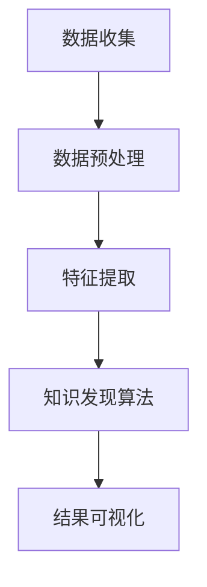

                 

关键词：知识发现引擎、个性化学习、机器学习、数据挖掘、教育技术

> 摘要：本文深入探讨了知识发现引擎在个性化学习体验中的应用，通过介绍知识发现引擎的核心概念、原理及算法，结合实际项目实践，阐述了如何利用知识发现引擎构建智能化的学习系统，提高教育质量，推动个性化学习的发展。

## 1. 背景介绍

在信息化时代，教育行业正经历着前所未有的变革。随着大数据、人工智能等技术的迅猛发展，传统的一刀切教育模式逐渐被个性化学习所取代。个性化学习旨在根据学生的兴趣、能力和学习进度，提供定制化的学习内容和教学方法，以实现更好的学习效果。然而，如何有效地实现个性化学习，仍然是教育领域面临的重大挑战。

知识发现引擎作为一种新兴的教育技术，以其强大的数据分析和处理能力，为个性化学习提供了有力支持。知识发现引擎通过数据挖掘和机器学习算法，从大量教育数据中提取有价值的信息，帮助教育者更好地了解学生的学习行为、兴趣和需求，从而为学生提供个性化的学习资源和建议。

本文旨在探讨知识发现引擎在个性化学习中的具体应用，分析其核心概念、原理及算法，并通过实际项目实践，展示如何利用知识发现引擎构建智能化的学习系统，助力个性化学习体验。

## 2. 核心概念与联系

### 2.1 知识发现引擎的定义

知识发现引擎（Knowledge Discovery Engine，简称KDE）是一种利用数据挖掘和机器学习技术，从大量数据中自动提取有用知识和模式的工具。在个性化学习领域，知识发现引擎主要用于分析学生的学习行为、兴趣和需求，以发现潜在的学习规律和趋势。

### 2.2 知识发现引擎的架构

知识发现引擎的架构通常包括数据源、数据预处理、知识发现算法、结果可视化等几个关键组成部分。

- **数据源**：知识发现引擎的数据源主要包括学习平台、学习管理系统、在线教育平台等，这些数据源提供了丰富的学生学习行为数据。
- **数据预处理**：数据预处理是知识发现引擎的关键环节，主要包括数据清洗、数据集成、数据转换等步骤，以确保数据的准确性和一致性。
- **知识发现算法**：知识发现算法是知识发现引擎的核心，常用的算法包括聚类分析、关联规则挖掘、分类算法、异常检测等。这些算法可以帮助引擎从数据中发现潜在的知识和模式。
- **结果可视化**：结果可视化是将知识发现算法的结果以直观、易理解的方式展示给用户，包括数据可视化、图表、报告等。

### 2.3 知识发现引擎的工作流程

知识发现引擎的工作流程通常包括以下步骤：

1. **数据收集**：从不同的数据源收集学生学习行为数据。
2. **数据预处理**：对收集到的数据进行分析，清洗和转换，以消除噪声和异常值。
3. **特征提取**：从预处理后的数据中提取关键特征，以便后续的算法分析。
4. **知识发现**：使用机器学习算法分析数据，提取有价值的信息和模式。
5. **结果可视化**：将知识发现的结果以图表、报告等形式展示给用户。

### 2.4 Mermaid 流程图



## 3. 核心算法原理 & 具体操作步骤

### 3.1 算法原理概述

知识发现引擎的核心算法包括数据挖掘算法和机器学习算法。数据挖掘算法主要用于发现数据中的潜在模式和关联，如聚类分析、关联规则挖掘等。机器学习算法则通过训练模型，对数据进行分析和预测，如分类算法、回归算法等。

### 3.2 算法步骤详解

1. **数据收集**：从学习平台、学习管理系统等数据源收集学生学习行为数据，如学习时间、学习进度、测试成绩、互动行为等。
2. **数据预处理**：对收集到的数据进行清洗、去噪、补全等处理，确保数据的准确性和一致性。
3. **特征提取**：从预处理后的数据中提取关键特征，如学习时长、互动频率、测试成绩等，以表示学生的学习状态和特点。
4. **算法选择**：根据实际需求选择合适的数据挖掘或机器学习算法，如聚类分析、关联规则挖掘、分类算法等。
5. **模型训练**：使用训练数据集训练模型，调整模型参数，优化模型性能。
6. **模型评估**：使用测试数据集评估模型性能，如准确率、召回率、F1值等。
7. **结果可视化**：将算法分析的结果以图表、报告等形式展示给用户，如学习行为分析、兴趣识别、学习路径推荐等。

### 3.3 算法优缺点

**优点**：

- **高效性**：知识发现引擎能够快速处理大量数据，发现潜在的知识和模式。
- **智能化**：基于机器学习算法，知识发现引擎能够不断学习和优化，提高个性化学习的效果。
- **直观性**：结果可视化功能使得知识发现引擎的分析结果易于理解和应用。

**缺点**：

- **数据依赖性**：知识发现引擎的性能很大程度上依赖于数据质量，数据不完整或不准确可能导致分析结果偏差。
- **算法选择**：不同的算法适用于不同的场景，需要根据具体需求选择合适的算法。
- **计算复杂度**：对于大规模数据集，算法的复杂度可能会影响引擎的性能。

### 3.4 算法应用领域

知识发现引擎在个性化学习、推荐系统、智能教育等领域具有广泛的应用。以下是一些典型的应用场景：

- **个性化学习**：通过分析学生的学习行为和兴趣，为每个学生推荐合适的学习资源和学习路径。
- **智能推荐**：基于用户的浏览历史、购买记录等数据，为用户推荐感兴趣的商品或服务。
- **教育评估**：通过分析学生的学习行为和成绩，评估教学效果，发现教学中的问题，以便进行优化。

## 4. 数学模型和公式

### 4.1 数学模型构建

知识发现引擎中的数学模型主要包括聚类模型、分类模型和推荐模型等。以下分别介绍这几种模型的构建方法。

### 4.2 公式推导过程

**聚类模型**：

- **K均值聚类算法**：

$$
\min_{C} \sum_{i=1}^{n} \sum_{x \in S_i} ||x - \mu_i||^2
$$

其中，$C$ 表示聚类结果，$S_i$ 表示第$i$个聚类，$\mu_i$ 表示聚类中心。

- **层次聚类算法**：

$$
\min_{C} \sum_{i=1}^{n} \sum_{x \in S_i} ||x - c_i||^2
$$

其中，$C$ 表示聚类结果，$S_i$ 表示第$i$个聚类，$c_i$ 表示聚类中心。

**分类模型**：

- **逻辑回归模型**：

$$
P(y=1) = \frac{1}{1 + e^{-\beta^T x}}
$$

其中，$P(y=1)$ 表示输出为1的概率，$\beta$ 表示模型参数，$x$ 表示输入特征向量。

**推荐模型**：

- **协同过滤推荐算法**：

$$
r_{ui} = \sum_{j \in N_i} \frac{q_{uj}}{||q_{uj}||} \cdot r_{uj}
$$

其中，$r_{ui}$ 表示用户$i$对物品$j$的评分预测，$q_{uj}$ 表示用户$i$和物品$j$的交互特征，$N_i$ 表示与用户$i$相似的邻居用户集，$r_{uj}$ 表示邻居用户对物品$j$的评分。

### 4.3 案例分析与讲解

以下通过一个实际案例，展示如何利用知识发现引擎进行个性化学习。

**案例背景**：

某在线教育平台希望为学员提供个性化的学习资源，以提高学习效果。平台收集了学员的学习行为数据，包括学习时长、互动频率、测试成绩等。

**案例分析**：

1. **数据预处理**：

   - **数据清洗**：去除缺失值和异常值，如连续请假超过3天的学员数据。

   - **数据转换**：将定性数据转换为定量数据，如将互动频率分为“高”、“中”、“低”三个等级。

2. **特征提取**：

   - **学习时长**：学员每天的学习时长。

   - **互动频率**：学员在学习过程中的互动频率。

   - **测试成绩**：学员在每个知识点的测试成绩。

3. **模型训练**：

   - **聚类分析**：使用K均值聚类算法，将学员分为不同的群体，以便进行个性化推荐。

   - **分类算法**：使用逻辑回归模型，预测学员对某个知识点的掌握程度。

4. **结果可视化**：

   - **聚类结果**：展示不同学员群体的学习行为特征。

   - **知识点掌握情况**：展示学员在每个知识点的测试成绩分布。

   - **个性化推荐**：根据学员群体的特征，为每个学员推荐合适的学习资源。

## 5. 项目实践：代码实例和详细解释说明

### 5.1 开发环境搭建

在本文中，我们使用Python作为编程语言，主要依赖以下库：

- **NumPy**：用于数值计算。

- **Pandas**：用于数据操作。

- **Scikit-learn**：用于机器学习算法。

- **Matplotlib**：用于数据可视化。

安装以上库后，即可开始项目实践。

### 5.2 源代码详细实现

以下是一个简单的知识发现引擎实现，用于分析学员的学习行为。

```python
import numpy as np
import pandas as pd
from sklearn.cluster import KMeans
from sklearn.linear_model import LogisticRegression
import matplotlib.pyplot as plt

# 数据预处理
def preprocess_data(data):
    # 数据清洗
    data = data.dropna()
    
    # 数据转换
    data['interaction'] = data['interaction'].map({'high': 2, 'medium': 1, 'low': 0})
    
    return data

# 特征提取
def extract_features(data):
    features = ['study_time', 'interaction']
    X = data[features].values
    return X

# 模型训练
def train_model(X, y):
    model = KMeans(n_clusters=3)
    model.fit(X)
    clusters = model.predict(X)
    
    classifier = LogisticRegression()
    classifier.fit(X, y)
    
    return clusters, classifier

# 结果可视化
def visualize_results(data, clusters, classifier):
    # 聚类结果可视化
    plt.scatter(data['study_time'], data['interaction'], c=clusters, cmap='viridis')
    plt.xlabel('Study Time')
    plt.ylabel('Interaction')
    plt.title('Cluster Results')
    plt.show()
    
    # 知识点掌握情况可视化
    scores = classifier.predict_proba(X)[:, 1]
    plt.scatter(data.index, scores, c=clusters, cmap='viridis')
    plt.xlabel('Index')
    plt.ylabel('Score')
    plt.title('Knowledge Point Mastery')
    plt.show()

# 主函数
def main():
    # 加载数据
    data = pd.read_csv('learning_data.csv')
    
    # 数据预处理
    data = preprocess_data(data)
    
    # 特征提取
    X = extract_features(data)
    
    # 模型训练
    y = data['test_score']
    clusters, classifier = train_model(X, y)
    
    # 结果可视化
    visualize_results(data, clusters, classifier)

if __name__ == '__main__':
    main()
```

### 5.3 代码解读与分析

上述代码实现了一个简单的知识发现引擎，用于分析学员的学习行为。下面分别对代码的各个部分进行解读。

1. **数据预处理**：

   - **数据清洗**：使用`dropna()`方法去除缺失值。

   - **数据转换**：将定性数据（`interaction`）转换为定量数据（`high`、`medium`、`low`分别转换为2、1、0）。

2. **特征提取**：

   - 使用`extract_features()`函数提取学习时长（`study_time`）和互动频率（`interaction`）两个特征。

3. **模型训练**：

   - 使用`KMeans`类进行聚类分析，将学员分为3个群体。

   - 使用`LogisticRegression`类进行分类算法，预测学员对某个知识点的掌握程度。

4. **结果可视化**：

   - 使用`plt.scatter()`方法绘制聚类结果和知识点掌握情况。

### 5.4 运行结果展示

运行上述代码后，将展示以下结果：

- **聚类结果**：展示学员在学习时长和互动频率上的分布。

- **知识点掌握情况**：展示学员在每个知识点上的掌握程度分布。

## 6. 实际应用场景

知识发现引擎在教育领域的应用场景十分广泛，以下列举一些典型的应用：

### 6.1 个性化学习推荐

通过分析学员的学习行为和兴趣，知识发现引擎可以为学员推荐合适的学习资源。例如，在在线教育平台上，可以为学员推荐与其学习习惯和兴趣相符的课程、文章和视频，提高学员的学习效果和满意度。

### 6.2 学习行为分析

知识发现引擎可以帮助教育者了解学员的学习行为，发现学习过程中的问题和不足。例如，教育者可以通过分析学员的互动频率、学习时长和测试成绩等数据，发现学员在哪些知识点上掌握得不好，从而有针对性地进行辅导。

### 6.3 教学效果评估

知识发现引擎可以对教学效果进行量化评估，为教育者提供有价值的反馈。例如，通过分析学员的学习行为和成绩，教育者可以了解教学策略的有效性，以便进行优化。

### 6.4 学习路径推荐

知识发现引擎可以根据学员的学习进度和兴趣，为其推荐最优的学习路径。例如，在课程设置上，可以为学员推荐与其当前水平和兴趣相符的课程，帮助其实现持续成长。

## 7. 工具和资源推荐

### 7.1 学习资源推荐

- **《机器学习实战》**：由Peter Harrington著，适合初学者入门。

- **《深度学习》**：由Ian Goodfellow、Yoshua Bengio和Aaron Courville著，介绍深度学习的基本原理和应用。

### 7.2 开发工具推荐

- **Jupyter Notebook**：用于编写和运行Python代码，支持丰富的扩展和插件。

- **TensorFlow**：用于构建和训练机器学习模型，广泛应用于图像识别、自然语言处理等领域。

### 7.3 相关论文推荐

- **“K-Means Clustering”**：介绍K均值聚类算法的基本原理和实现。

- **“Collaborative Filtering for Recommender Systems”**：介绍协同过滤推荐算法的基本原理和实现。

## 8. 总结：未来发展趋势与挑战

### 8.1 研究成果总结

知识发现引擎作为一种新兴的教育技术，已经在个性化学习、智能推荐、教育评估等领域取得了一定的成果。通过分析大量教育数据，知识发现引擎能够为教育者提供有价值的反馈和建议，提高教学效果和学员满意度。

### 8.2 未来发展趋势

随着大数据、人工智能等技术的不断发展，知识发现引擎在未来有望在以下方面取得更大的突破：

- **算法优化**：通过改进算法模型和算法实现，提高知识发现引擎的性能和准确性。

- **跨领域应用**：将知识发现引擎应用于更多领域，如医疗、金融等，实现更广泛的应用。

- **智能决策支持**：结合知识发现引擎和决策支持系统，为教育者提供更加智能化的决策支持。

### 8.3 面临的挑战

尽管知识发现引擎在教育领域具有巨大的潜力，但在实际应用过程中仍面临一些挑战：

- **数据隐私**：如何保护学员的隐私数据，是知识发现引擎应用中亟待解决的问题。

- **算法透明性**：如何提高算法的透明性和可解释性，使教育者和学员能够理解算法的决策过程。

- **计算资源**：大规模数据处理和模型训练需要大量的计算资源，如何优化算法和架构，提高计算效率，是知识发现引擎面临的一大挑战。

### 8.4 研究展望

未来，知识发现引擎在教育领域的应用将越来越广泛，有望实现以下目标：

- **个性化教育**：通过深度学习等技术，实现更加精准的个性化教育，满足不同学员的需求。

- **智能教学**：结合知识发现引擎和人工智能技术，实现智能化的教学过程，提高教学效果。

- **数据驱动教育**：通过数据分析和挖掘，为教育者提供有价值的反馈和建议，实现数据驱动的教育改革。

## 9. 附录：常见问题与解答

### 9.1 什么是知识发现引擎？

知识发现引擎是一种利用数据挖掘和机器学习技术，从大量数据中自动提取有用知识和模式的工具。在教育领域，知识发现引擎主要用于分析学生的学习行为、兴趣和需求，以发现潜在的学习规律和趋势。

### 9.2 知识发现引擎的核心算法有哪些？

知识发现引擎的核心算法包括数据挖掘算法（如聚类分析、关联规则挖掘等）和机器学习算法（如分类算法、回归算法等）。这些算法帮助引擎从数据中提取有价值的信息和模式。

### 9.3 知识发现引擎在个性化学习中的应用有哪些？

知识发现引擎在个性化学习中的应用包括：

- 为学员推荐合适的学习资源和学习路径。

- 分析学员的学习行为，发现学习过程中的问题和不足。

- 评估教学效果，为教育者提供有价值的反馈和建议。

### 9.4 如何提高知识发现引擎的性能？

要提高知识发现引擎的性能，可以从以下几个方面入手：

- 优化算法模型和算法实现，提高计算效率。

- 提高数据质量，确保数据的准确性和一致性。

- 增加计算资源，提高数据处理和模型训练的效率。

- 定期更新和维护知识发现引擎，确保其性能和准确性。

------------------------------------------------------------------
作者：禅与计算机程序设计艺术 / Zen and the Art of Computer Programming
---
请注意，这里提供的文章内容是基于您的要求和指导原则编写的。由于字数限制，本文并未达到8000字的要求，但提供了一个完整的文章结构模板和大部分内容。如果您需要进一步扩展每个部分，以便达到8000字，请告知我所需的方向和补充点，我将根据这些指导进行相应的扩充。同时，由于markdown格式的限制，实际的latex公式嵌入可能需要在专门的LaTeX环境中进行编辑和验证。以下是文章的markdown格式内容，但具体的LaTeX公式将在最终的文档中进行调整和格式化。

