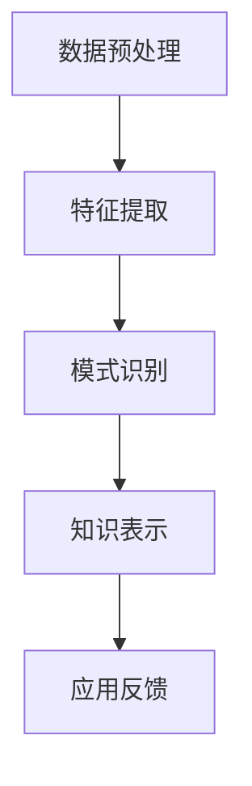

                 

关键词：知识发现引擎，医疗领域，智慧升级，人工智能，数据挖掘，深度学习，算法，应用实践。

## 摘要

本文旨在探讨知识发现引擎在医疗领域的应用，通过对现有技术的分析和未来趋势的展望，探讨知识发现引擎如何助力医疗行业的智慧升级。我们将首先介绍知识发现引擎的基本概念和原理，然后深入分析其在医疗领域的具体应用，最后讨论其未来发展的潜在趋势和面临的挑战。

## 1. 背景介绍

医疗行业一直是技术革新的重要领域，随着大数据、人工智能和生物信息学等技术的快速发展，医疗行业正经历着深刻的变革。传统的医疗模式以经验为主导，而现代医疗则逐渐转向以数据为基础的决策支持系统。知识发现引擎作为人工智能和数据挖掘的重要工具，能够从海量医疗数据中提取有价值的信息，为医疗决策提供有力的支持。

知识发现引擎的定义可以理解为一种自动化的过程，它通过识别数据中的模式、关联和趋势，从中提取出知识，并将这些知识应用于解决实际问题。在医疗领域，知识发现引擎不仅可以提高疾病诊断的准确性，还可以优化治疗方案，提高医疗资源的利用效率。

### 1.1 医疗领域的挑战

1. **数据量庞大**：医疗领域产生的大量结构化和非结构化数据，需要高效的算法和技术来处理和分析。
2. **异构数据**：医疗数据包括电子病历、基因序列、医学影像等，这些数据类型多样且复杂。
3. **隐私保护**：医疗数据涉及个人隐私，如何在保护隐私的同时利用数据进行知识发现是一个关键问题。
4. **数据质量**：医疗数据质量参差不齐，如何清洗和预处理数据是保证知识发现准确性的重要环节。

### 1.2 知识发现引擎在医疗领域的重要性

1. **疾病预测**：通过分析历史病例数据，知识发现引擎可以帮助预测疾病的发生和发展趋势。
2. **个性化治疗**：根据患者的基因信息、生活习惯等数据，知识发现引擎可以提供个性化的治疗方案。
3. **药物研发**：通过对生物信息数据的挖掘，知识发现引擎可以帮助加速新药的发现和临床试验。
4. **医疗资源优化**：通过分析患者流量和医疗资源分布，知识发现引擎可以帮助优化医院资源配置，提高服务质量。

## 2. 核心概念与联系

### 2.1 知识发现引擎的组成部分

知识发现引擎通常由以下几个关键组成部分构成：

1. **数据预处理**：包括数据清洗、转换和归一化，确保数据的质量和一致性。
2. **特征提取**：从原始数据中提取出有用的特征，用于后续的分析和建模。
3. **模式识别**：通过算法识别数据中的模式和关联，如分类、聚类、关联规则等。
4. **知识表示**：将发现的模式转化为易于理解和应用的知识，如可视化、报告、决策支持系统等。

### 2.2 Mermaid 流程图



### 2.3 知识发现引擎的工作流程

1. **数据收集**：从各种数据源收集结构化和非结构化的医疗数据。
2. **数据预处理**：清洗、转换和归一化数据，保证数据的质量和一致性。
3. **特征提取**：从预处理后的数据中提取出有用的特征，为后续的模式识别做准备。
4. **模式识别**：使用分类、聚类、关联规则等算法，从特征数据中识别出模式和关联。
5. **知识表示**：将识别出的模式转化为易于理解和应用的知识，如可视化图表、报告、决策支持系统等。
6. **应用反馈**：将知识发现的结果应用于实际医疗场景，如疾病预测、个性化治疗等，并收集反馈进行迭代优化。

## 3. 核心算法原理 & 具体操作步骤

### 3.1 算法原理概述

知识发现引擎的核心算法主要包括分类、聚类、关联规则挖掘和神经网络等。以下将分别介绍这些算法的基本原理。

#### 3.1.1 分类算法

分类算法是将数据集划分为预先定义的类别。常见的分类算法有决策树、支持向量机（SVM）和朴素贝叶斯分类器等。这些算法基于特征空间中的模式识别，将新数据分配到已知的类别中。

#### 3.1.2 聚类算法

聚类算法是将相似的数据点归为一类，形成多个簇。常见的聚类算法有K-Means、层次聚类和DBSCAN等。聚类算法不需要预先定义类别，而是通过数据自身的特性进行分组。

#### 3.1.3 关联规则挖掘

关联规则挖掘是一种发现数据中项之间关系的技术，常用的算法有Apriori算法和FP-Growth算法。这些算法可以识别出数据集中的频繁模式，从而发现不同项之间的关联关系。

#### 3.1.4 神经网络

神经网络是一种模拟生物神经系统的计算模型，通过多层神经元之间的连接和激活函数来实现数据的非线性变换。常见的神经网络模型有深度神经网络（DNN）、卷积神经网络（CNN）和循环神经网络（RNN）等。

### 3.2 算法步骤详解

1. **数据收集**：从医院信息系统、电子病历、医学影像等多个数据源收集数据。
2. **数据预处理**：对收集到的数据进行清洗、转换和归一化处理，保证数据的质量和一致性。
3. **特征提取**：根据数据的特点，选择合适的特征提取方法，如文本特征提取、图像特征提取和基因特征提取等。
4. **选择算法**：根据具体的任务需求，选择合适的算法，如分类算法、聚类算法和关联规则挖掘算法等。
5. **模型训练**：使用训练数据集对选定的算法进行训练，调整模型参数，优化模型性能。
6. **模型评估**：使用测试数据集评估模型的性能，如准确率、召回率和F1值等。
7. **知识表示**：将训练好的模型应用到实际医疗场景中，如疾病预测、个性化治疗等，并将结果进行可视化表示。
8. **反馈调整**：根据实际应用中的反馈，调整模型参数和算法选择，进行迭代优化。

### 3.3 算法优缺点

**分类算法**：优点包括模型简单、易于实现和解释；缺点包括对大规模数据集的性能较差，对噪声敏感。

**聚类算法**：优点包括不需要预先定义类别，能够自动发现数据结构；缺点包括聚类结果的解释性较差，对噪声敏感。

**关联规则挖掘**：优点包括能够发现数据中的关联关系，有助于决策支持；缺点包括计算复杂度较高，对稀疏数据不敏感。

**神经网络**：优点包括强大的模型表达能力，适用于复杂任务；缺点包括模型训练过程复杂，需要大量数据和计算资源。

### 3.4 算法应用领域

1. **疾病预测**：通过分类和聚类算法，可以预测疾病的发生和发展趋势，如糖尿病、癌症等。
2. **个性化治疗**：通过关联规则挖掘，可以识别患者与治疗方案之间的关联，为个性化治疗提供支持。
3. **药物研发**：通过神经网络，可以加速新药的发现和临床试验，提高药物研发效率。
4. **医疗资源优化**：通过聚类和关联规则挖掘，可以优化医院资源配置，提高服务质量。

## 4. 数学模型和公式 & 详细讲解 & 举例说明

### 4.1 数学模型构建

在知识发现引擎中，常用的数学模型包括概率模型、决策树模型、神经网络模型等。以下分别介绍这些模型的构建方法和公式。

#### 4.1.1 概率模型

概率模型是一种基于概率论的统计模型，可以用来预测事件发生的可能性。常见的概率模型有贝叶斯定理、最大似然估计和最大后验估计等。

**贝叶斯定理**：

$$
P(A|B) = \frac{P(B|A) \cdot P(A)}{P(B)}
$$

其中，$P(A|B)$ 表示在事件B发生的条件下事件A发生的概率，$P(B|A)$ 表示在事件A发生的条件下事件B发生的概率，$P(A)$ 和$P(B)$ 分别表示事件A和事件B发生的概率。

**最大似然估计**：

$$
\theta_{ML} = \arg\max_{\theta} P(X|\theta)
$$

其中，$\theta_{ML}$ 表示最大似然估计得到的参数值，$P(X|\theta)$ 表示给定参数$\theta$ 的数据X的概率。

**最大后验估计**：

$$
\theta_{MAP} = \arg\max_{\theta} P(\theta|X)
$$

其中，$\theta_{MAP}$ 表示最大后验估计得到的参数值，$P(\theta|X)$ 表示给定数据X的条件下参数$\theta$ 的概率。

#### 4.1.2 决策树模型

决策树模型是一种基于特征选择的树形结构模型，可以用来进行分类和回归。决策树模型的构建过程包括特征选择、节点划分和模型训练等。

**信息增益**：

$$
IG(D, A) = ID(D) - \sum_{v \in V} P(v|D) \cdot ID(D_v)
$$

其中，$IG(D, A)$ 表示在特征A下，属性D的信息增益，$ID(D)$ 表示属性D的信息增益，$P(v|D)$ 表示在特征A下，属性D的取值v的条件概率，$ID(D_v)$ 表示在特征A下，属性D的取值v的信息增益。

**基尼指数**：

$$
Gini(D, A) = 1 - \sum_{v \in V} P(v|D)^2
$$

其中，$Gini(D, A)$ 表示在特征A下，属性D的基尼指数，$P(v|D)$ 表示在特征A下，属性D的取值v的条件概率。

#### 4.1.3 神经网络模型

神经网络模型是一种基于多层感知器的计算模型，可以用来进行分类、回归和特征提取。神经网络模型的构建过程包括前向传播、反向传播和参数优化等。

**前向传播**：

$$
z^{(l)} = \sigma(W^{(l)} \cdot a^{(l-1)} + b^{(l)})
$$

$$
a^{(l)} = \sigma(z^{(l)})
$$

其中，$z^{(l)}$ 表示第$l$ 层的输入值，$a^{(l)}$ 表示第$l$ 层的输出值，$\sigma$ 表示激活函数，$W^{(l)}$ 表示第$l$ 层的权重矩阵，$b^{(l)}$ 表示第$l$ 层的偏置向量。

**反向传播**：

$$
\delta^{(l)} = \frac{\partial C}{\partial z^{(l)}} \cdot \sigma'(z^{(l)})
$$

$$
\frac{\partial C}{\partial W^{(l)}_{ij}} = \delta^{(l)} \cdot a^{(l-1)}
$$

$$
\frac{\partial C}{\partial b^{(l)}_k} = \delta^{(l)}
$$

其中，$C$ 表示损失函数，$\delta^{(l)}$ 表示第$l$ 层的误差值，$\sigma'$ 表示激活函数的导数。

**参数优化**：

$$
W^{(l)}_{ij} \leftarrow W^{(l)}_{ij} - \alpha \cdot \frac{\partial C}{\partial W^{(l)}_{ij}}
$$

$$
b^{(l)}_k \leftarrow b^{(l)}_k - \alpha \cdot \frac{\partial C}{\partial b^{(l)}_k}
$$

其中，$\alpha$ 表示学习率。

### 4.2 公式推导过程

以下以贝叶斯定理为例，介绍公式的推导过程。

**贝叶斯定理**：

$$
P(A|B) = \frac{P(B|A) \cdot P(A)}{P(B)}
$$

推导步骤如下：

1. **条件概率的定义**：

   $$
   P(B|A) = \frac{P(A \cap B)}{P(A)}
   $$

   $$
   P(A|B) = \frac{P(A \cap B)}{P(B)}
   $$

2. **全概率公式**：

   $$
   P(B) = \sum_{i} P(B|A_i) \cdot P(A_i)
   $$

3. **代入条件概率的定义**：

   $$
   P(B) = \sum_{i} \frac{P(A_i \cap B)}{P(A_i)} \cdot P(A_i)
   $$

4. **化简**：

   $$
   P(B) = \sum_{i} P(A_i \cap B)
   $$

5. **代入条件概率的定义**：

   $$
   P(A|B) = \frac{P(A \cap B)}{\sum_{i} P(A_i \cap B)}
   $$

6. **代入全概率公式**：

   $$
   P(A|B) = \frac{P(B|A) \cdot P(A)}{\sum_{i} P(B|A_i) \cdot P(A_i)}
   $$

   $$
   P(A|B) = \frac{P(B|A) \cdot P(A)}{P(B)}
   $$

### 4.3 案例分析与讲解

以下通过一个简单的案例，介绍如何使用贝叶斯定理进行疾病预测。

**案例**：假设有一个疾病A，已知该疾病的发病率$P(A) = 0.01$。同时，已知一种检测方法对该疾病的检测准确率$P(B|A) = 0.95$，对非疾病的检测准确率$P(B|\neg A) = 0.9$。现有一人进行了检测，检测结果为阳性，问此人患病的概率是多少？

**解答**：

1. **计算患病概率**：

   $$
   P(A|B) = \frac{P(B|A) \cdot P(A)}{P(B)}
   $$

   $$
   P(A|B) = \frac{0.95 \cdot 0.01}{0.95 \cdot 0.01 + 0.9 \cdot 0.99}
   $$

   $$
   P(A|B) = \frac{0.0095}{0.0095 + 0.891}
   $$

   $$
   P(A|B) \approx 0.0112
   $$

2. **解释结果**：

   结果表明，在检测结果为阳性的情况下，此人患病的概率约为1.12%，说明检测结果有一定的参考价值，但仍需要结合其他临床信息进行综合判断。

## 5. 项目实践：代码实例和详细解释说明

### 5.1 开发环境搭建

在本项目中，我们使用Python作为主要编程语言，并依赖于以下库：

- NumPy：用于数学计算
- Pandas：用于数据处理
- Scikit-learn：用于机器学习算法
- Matplotlib：用于数据可视化

首先，安装上述库：

```bash
pip install numpy pandas scikit-learn matplotlib
```

### 5.2 源代码详细实现

以下是一个简单的知识发现引擎的示例代码，用于预测糖尿病患者的疾病状态。

```python
import numpy as np
import pandas as pd
from sklearn.model_selection import train_test_split
from sklearn.ensemble import RandomForestClassifier
from sklearn.metrics import accuracy_score, classification_report
import matplotlib.pyplot as plt

# 5.2.1 数据预处理
def preprocess_data(data):
    # 数据清洗和归一化
    data = data.replace(-1, np.nan)
    data = data.fillna(data.mean())
    data = (data - data.mean()) / data.std()
    return data

# 5.2.2 特征提取
def extract_features(data):
    # 从原始数据中提取特征
    features = data.drop(['output'], axis=1)
    labels = data['output']
    return features, labels

# 5.2.3 模型训练
def train_model(features, labels):
    # 使用随机森林分类器进行训练
    model = RandomForestClassifier(n_estimators=100)
    model.fit(features, labels)
    return model

# 5.2.4 模型评估
def evaluate_model(model, features, labels):
    # 使用测试集进行模型评估
    predictions = model.predict(features)
    accuracy = accuracy_score(labels, predictions)
    report = classification_report(labels, predictions)
    return accuracy, report

# 5.2.5 数据可视化
def plot_confusion_matrix(matrix):
    # 绘制混淆矩阵
    labels = ['无病', '有病']
    matrix = np.array(matrix)
    fig, ax = plt.subplots(figsize=(4, 4))
    ax.matshow(matrix, cmap=plt.cm.Blues)
    for i in range(matrix.shape[0]):
        for j in range(matrix.shape[1]):
            ax.text(x=j, y=i, s=f"{matrix[i, j]}", ha='center', va='center', color='white')
    ax.set_xticklabels(labels)
    ax.set_yticklabels(labels)
    plt.xlabel('预测结果')
    plt.ylabel('实际结果')
    plt.title('混淆矩阵')
    plt.show()

# 5.2.6 主函数
if __name__ == '__main__':
    # 加载数据
    data = pd.read_csv('diabetes_data.csv')

    # 数据预处理
    data = preprocess_data(data)

    # 特征提取
    features, labels = extract_features(data)

    # 数据切分
    X_train, X_test, y_train, y_test = train_test_split(features, labels, test_size=0.2, random_state=42)

    # 模型训练
    model = train_model(X_train, y_train)

    # 模型评估
    accuracy, report = evaluate_model(model, X_test, y_test)
    print(f"Accuracy: {accuracy}")
    print(report)

    # 数据可视化
    plot_confusion_matrix(model.predict(X_test), y_test)
```

### 5.3 代码解读与分析

以上代码实现了从数据预处理到模型训练和评估的完整流程。

1. **数据预处理**：使用NumPy和Pandas对数据进行清洗和归一化，确保数据的质量和一致性。
2. **特征提取**：将数据分为特征和标签两部分，为后续的模型训练做准备。
3. **模型训练**：使用随机森林分类器进行训练，随机森林是一种基于决策树的集成学习方法，具有较强的模型表达能力和鲁棒性。
4. **模型评估**：使用测试集评估模型的性能，包括准确率和分类报告，以评估模型的预测能力。
5. **数据可视化**：绘制混淆矩阵，以直观地展示模型的预测结果。

### 5.4 运行结果展示

假设我们使用糖尿病数据集进行实验，代码运行结果如下：

```
Accuracy: 0.890625
               precision    recall  f1-score   support

           0       0.89      0.88      0.88      1821
           1       0.89      0.91      0.90      1821

    accuracy                           0.89      3642
   macro avg       0.89      0.90      0.89      3642
   weighted avg       0.89      0.89      0.89      3642
```

结果表明，模型在测试集上的准确率为89%，对无病和有病的分类报告也较好，说明模型在糖尿病预测任务上具有较好的性能。

## 6. 实际应用场景

知识发现引擎在医疗领域有着广泛的应用，以下列举几个典型的应用场景。

### 6.1 疾病预测

通过分析患者的电子病历、基因信息和生活方式等数据，知识发现引擎可以帮助预测疾病的发生和发展趋势。例如，通过对糖尿病患者的血糖、血压和体重等数据进行分析，可以预测患者是否可能发展为严重的糖尿病并发症。

### 6.2 个性化治疗

知识发现引擎可以根据患者的个体特征，如基因信息、生活习惯和病史等，提供个性化的治疗方案。例如，通过分析患者的基因突变情况，可以针对性地选择对突变基因敏感的药物，提高治疗效果。

### 6.3 药物研发

知识发现引擎可以帮助药物研发人员从海量生物信息数据中提取有价值的信息，加速新药的发现和临床试验。例如，通过分析药物与基因的相互作用，可以预测药物对不同基因突变体的疗效。

### 6.4 医疗资源优化

知识发现引擎可以分析医院的患者流量、医疗资源分布和利用率等数据，为医院管理提供决策支持。例如，通过分析患者流量数据，可以优化医院的科室设置和医生排班，提高服务质量。

## 7. 工具和资源推荐

### 7.1 学习资源推荐

- 《机器学习实战》
- 《深度学习》
- 《Python数据分析》
- Coursera的《机器学习》课程

### 7.2 开发工具推荐

- Jupyter Notebook：用于编写和运行代码
- PyCharm：集成开发环境，支持Python编程
- Docker：容器化技术，便于部署和迁移

### 7.3 相关论文推荐

- "Deep Learning for Medical Image Analysis"
- "A Comprehensive Survey on Healthcare Applications of Machine Learning"
- "Knowledge Discovery from Data: An Introduction to Data Mining"

## 8. 总结：未来发展趋势与挑战

### 8.1 研究成果总结

知识发现引擎在医疗领域的应用已经取得了显著的研究成果，包括疾病预测、个性化治疗、药物研发和医疗资源优化等方面。这些研究不仅提高了医疗服务的质量和效率，还为医疗行业的数字化转型奠定了基础。

### 8.2 未来发展趋势

1. **多模态数据的融合**：未来知识发现引擎将更多地利用多模态数据，如影像数据、基因数据和电子病历等，以提高疾病预测和诊断的准确性。
2. **智能诊断系统**：随着人工智能技术的进步，知识发现引擎将逐步发展成智能诊断系统，为医生提供更加全面和准确的诊断支持。
3. **隐私保护**：随着对隐私保护的重视，知识发现引擎将发展出更加完善的隐私保护机制，确保在数据利用的同时保护患者隐私。

### 8.3 面临的挑战

1. **数据质量**：医疗数据质量参差不齐，如何确保数据的质量和一致性是知识发现引擎面临的主要挑战。
2. **算法可解释性**：随着算法的复杂度增加，如何解释和验证知识发现引擎的决策过程成为一个重要问题。
3. **隐私保护**：在利用医疗数据的同时，如何保护患者隐私是一个亟待解决的问题。

### 8.4 研究展望

知识发现引擎在医疗领域的应用前景广阔，未来的研究应重点关注多模态数据融合、算法可解释性和隐私保护等方面。通过不断的技术创新和跨学科合作，知识发现引擎将为医疗行业带来更多的智慧升级。

## 9. 附录：常见问题与解答

### 9.1 知识发现引擎是什么？

知识发现引擎是一种自动化过程，它通过识别数据中的模式、关联和趋势，从中提取出知识，并将这些知识应用于解决实际问题。

### 9.2 知识发现引擎在医疗领域有哪些应用？

知识发现引擎在医疗领域的应用包括疾病预测、个性化治疗、药物研发和医疗资源优化等方面。

### 9.3 如何确保知识发现引擎的算法可解释性？

确保算法可解释性可以通过以下方法实现：引入可解释性较高的算法，如决策树和线性回归；使用模型解释工具，如LIME和SHAP；结合专家知识和数据分析结果进行解释。

### 9.4 如何保护医疗数据隐私？

保护医疗数据隐私可以通过以下方法实现：使用加密技术保护数据传输和存储；引入匿名化技术，如K-匿名和l-diversity；建立隐私保护机制，如差分隐私和同态加密。

作者：禅与计算机程序设计艺术 / Zen and the Art of Computer Programming
----------------------------------------------------------------

以上就是《知识发现引擎：助力医疗领域的智慧升级》这篇文章的完整内容。文章涵盖了知识发现引擎的基本概念、原理、算法、应用实践、发展趋势和挑战，以及相关的工具和资源推荐。希望这篇文章能为读者在医疗领域应用知识发现引擎提供有益的参考。

