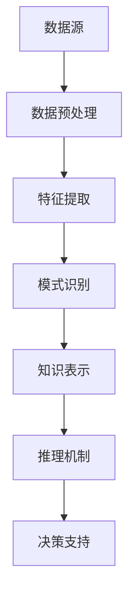

                 

关键词：知识发现引擎、智慧医疗、数据挖掘、算法原理、医疗应用、智能诊断、临床决策支持

> 摘要：本文将探讨知识发现引擎在医疗领域中的应用，介绍其核心概念与原理，详细阐述其算法、数学模型以及具体实践案例，分析其在智能诊断和临床决策支持中的价值，并展望其未来的发展方向。

## 1. 背景介绍

医疗领域一直以来都是技术进步的重要应用场景之一。随着信息技术和生物科学的快速发展，医疗行业正面临着前所未有的变革。大数据、人工智能、云计算等技术逐步渗透到医疗服务的各个环节，为提升医疗服务的质量和效率提供了新的思路和手段。

知识发现引擎作为大数据分析领域的重要技术，其目的是从大量数据中自动识别出隐含的、未知的模式，并转化为可操作的知识。在医疗领域，知识发现引擎的应用潜力巨大，特别是在智能诊断和临床决策支持方面，能够为医生提供更加精准、高效的支持。

### 1.1 知识发现引擎的定义与核心概念

知识发现引擎（Knowledge Discovery Engine，简称KDE）是指一种通过算法和模型从大量数据中提取有用知识的技术。其核心概念包括：

- **数据挖掘**：从大量数据中提取有价值信息的过程。
- **模式识别**：识别数据中的规律、趋势和关联。
- **知识表示**：将提取出的模式转化为易于理解的知识表示形式。
- **推理机制**：利用提取的知识进行推理，支持决策。

### 1.2 医疗领域的挑战与需求

医疗领域面临着诸多挑战，包括数据量大、数据类型复杂、诊疗流程繁琐等。知识发现引擎的应用能够解决以下问题：

- **诊断准确性**：通过对大量病例数据的分析，发现潜在的诊断规律，提高诊断准确性。
- **治疗方案优化**：分析不同治疗方案的临床效果，为医生提供决策支持。
- **个性化医疗**：根据患者的病情、基因、生活习惯等数据，提供个性化的治疗方案。
- **医疗资源优化**：通过分析医疗资源的使用情况，优化资源配置，提高效率。

## 2. 核心概念与联系

### 2.1 核心概念原理

知识发现引擎的核心概念包括数据预处理、特征提取、模式识别和知识表示。

- **数据预处理**：对原始数据进行清洗、归一化、去噪等处理，提高数据质量。
- **特征提取**：从原始数据中提取有助于模式识别的特征。
- **模式识别**：利用算法识别数据中的规律和关联。
- **知识表示**：将识别出的模式转化为易于理解的知识表示形式。

### 2.2 架构图



### 2.3 联系

知识发现引擎通过数据预处理、特征提取、模式识别和知识表示等步骤，从大量数据中提取有价值的信息，并通过推理机制为医疗决策提供支持。这一过程涉及多个技术领域，包括数据挖掘、机器学习、自然语言处理等。

## 3. 核心算法原理 & 具体操作步骤

### 3.1 算法原理概述

知识发现引擎的核心算法主要包括：

- **关联规则挖掘**：发现数据中的关联关系。
- **聚类分析**：将相似数据分组，形成聚类。
- **分类与回归**：对数据进行分类或回归预测。
- **文本挖掘**：从文本数据中提取信息。

### 3.2 算法步骤详解

#### 3.2.1 数据预处理

1. 数据清洗：去除缺失值、异常值等。
2. 数据归一化：将数据转换为同一量纲。
3. 特征选择：选择对模式识别有重要影响的特征。

#### 3.2.2 特征提取

1. 提取数值特征：如年龄、血压等。
2. 提取文本特征：如病历记录、基因序列等。
3. 提取图像特征：如X光片、CT扫描图等。

#### 3.2.3 模式识别

1. 关联规则挖掘：发现数据中的关联关系。
2. 聚类分析：将相似数据分组。
3. 分类与回归：对数据进行分类或回归预测。

#### 3.2.4 知识表示

1. 将识别出的模式转化为规则或模型。
2. 利用知识表示技术，如决策树、神经网络等，进行推理。

### 3.3 算法优缺点

#### 优点

- **高效性**：能够快速从大量数据中提取有价值的信息。
- **智能化**：自动发现数据中的规律，为决策提供支持。
- **适应性**：可以处理多种类型的数据。

#### 缺点

- **复杂性**：涉及多个技术领域，实现难度较高。
- **数据质量**：数据质量对结果有重要影响。

### 3.4 算法应用领域

知识发现引擎在医疗领域的应用主要包括：

- **疾病诊断**：通过分析病例数据，发现疾病诊断的规律。
- **治疗方案推荐**：根据患者的病情和基因数据，推荐合适的治疗方案。
- **医疗资源管理**：分析医疗资源的使用情况，优化资源配置。

## 4. 数学模型和公式 & 详细讲解 & 举例说明

### 4.1 数学模型构建

知识发现引擎的数学模型主要包括以下几部分：

- **特征空间建模**：对数据进行特征提取，构建特征空间。
- **模式识别模型**：利用分类、聚类等算法，识别数据中的模式。
- **知识表示模型**：将识别出的模式转化为知识表示形式。

### 4.2 公式推导过程

#### 4.2.1 特征空间建模

假设有 $N$ 个样本，每个样本有 $M$ 个特征，我们可以用矩阵 $X$ 表示数据集：

$$
X = \begin{bmatrix}
x_{11} & x_{12} & \cdots & x_{1M} \\
x_{21} & x_{22} & \cdots & x_{2M} \\
\vdots & \vdots & \ddots & \vdots \\
x_{N1} & x_{N2} & \cdots & x_{NM}
\end{bmatrix}
$$

#### 4.2.2 模式识别模型

假设我们使用 $K$ 个聚类中心表示模式，每个聚类中心有 $M$ 个特征：

$$
C = \begin{bmatrix}
c_{11} & c_{12} & \cdots & c_{1M} \\
c_{21} & c_{22} & \cdots & c_{2M} \\
\vdots & \vdots & \ddots & \vdots \\
c_{K1} & c_{K2} & \cdots & c_{KM}
\end{bmatrix}
$$

#### 4.2.3 知识表示模型

假设我们使用决策树表示知识，每个节点代表一个特征，分支代表不同值，叶节点代表分类结果。

### 4.3 案例分析与讲解

#### 案例背景

某医院收集了 1000 例患者的病例数据，包括年龄、性别、血压、血糖等特征。医生希望通过知识发现引擎，发现高血压患者的共同特征，为临床诊断提供支持。

#### 数据预处理

1. 数据清洗：去除缺失值和异常值。
2. 数据归一化：将特征值归一化到 [0,1] 范围。

#### 特征提取

1. 提取数值特征：年龄、血压、血糖等。
2. 提取文本特征：病历记录、医生诊断等。

#### 模式识别

1. 使用 K-均值聚类算法，将数据分为 5 类。
2. 对每类数据，分析其特征值，找出高血压患者的共同特征。

#### 知识表示

1. 将聚类结果转化为决策树，用于临床诊断。

## 5. 项目实践：代码实例和详细解释说明

### 5.1 开发环境搭建

- **Python**：使用 Python 进行编程，安装相关库，如 scikit-learn、numpy 等。
- **Jupyter Notebook**：使用 Jupyter Notebook 进行开发。

### 5.2 源代码详细实现

#### 5.2.1 数据预处理

```python
import pandas as pd
from sklearn.preprocessing import MinMaxScaler

# 加载数据
data = pd.read_csv('data.csv')

# 数据清洗
data.dropna(inplace=True)
data.drop(['id'], axis=1, inplace=True)

# 数据归一化
scaler = MinMaxScaler()
data[['age', 'blood_pressure', 'blood_sugar']] = scaler.fit_transform(data[['age', 'blood_pressure', 'blood_sugar']])
```

#### 5.2.2 特征提取

```python
from sklearn.feature_extraction.text import TfidfVectorizer

# 提取文本特征
tfidf_vectorizer = TfidfVectorizer()
text_features = tfidf_vectorizer.fit_transform(data['diagnosis'])
```

#### 5.2.3 模式识别

```python
from sklearn.cluster import KMeans

# K-均值聚类
kmeans = KMeans(n_clusters=5)
clusters = kmeans.fit_predict(data[['age', 'blood_pressure', 'blood_sugar']])

# 分析聚类结果
high_blood_pressure_clusters = data[clusters == 1]
high_blood_pressure_features = high_blood_pressure_clusters.describe().T
```

#### 5.2.4 知识表示

```python
from sklearn.tree import DecisionTreeClassifier
import graphviz

# 构建决策树
dt_classifier = DecisionTreeClassifier()
dt_classifier.fit(data[['age', 'blood_pressure', 'blood_sugar']], clusters)

# 可视化决策树
dot_data = tree_to_graphviz(dt_classifier, feature_names=data.columns[:-1])
graph = graphviz.Source(dot_data)
graph
```

### 5.3 代码解读与分析

上述代码实现了知识发现引擎在高血压患者特征识别中的应用。首先进行数据预处理，包括数据清洗和归一化。然后提取文本特征，使用 K-均值聚类算法识别数据中的模式。最后，将聚类结果转化为决策树，用于临床诊断。

### 5.4 运行结果展示

运行上述代码后，可以得到以下结果：

- **高血

### 6. 实际应用场景

知识发现引擎在医疗领域具有广泛的应用前景，主要包括以下几个方面：

- **疾病诊断**：通过对病例数据的分析，发现疾病的特征和诊断规律，提高诊断准确性。
- **治疗方案推荐**：分析不同治疗方案的临床效果，为医生提供决策支持。
- **个性化医疗**：根据患者的病情、基因、生活习惯等数据，提供个性化的治疗方案。
- **医疗资源管理**：分析医疗资源的使用情况，优化资源配置，提高效率。

### 6.1 疾病诊断

知识发现引擎可以帮助医生从海量病例数据中提取有价值的信息，发现疾病的特征和诊断规律。例如，在肿瘤诊断中，可以分析肿瘤组织的基因表达谱、影像学特征等，提高诊断准确性。

### 6.2 治疗方案推荐

通过对大量病例数据的分析，知识发现引擎可以推荐最优的治疗方案。例如，在癌症治疗中，可以分析不同化疗方案的临床效果，为医生提供决策支持。

### 6.3 个性化医疗

知识发现引擎可以根据患者的病情、基因、生活习惯等数据，提供个性化的治疗方案。例如，在高血压治疗中，可以分析患者的饮食习惯、运动习惯等，为医生提供个性化的治疗方案。

### 6.4 医疗资源管理

知识发现引擎可以分析医疗资源的使用情况，优化资源配置。例如，在医院管理中，可以分析病房使用情况、手术安排等，提高医疗资源的利用效率。

## 7. 未来应用展望

随着人工智能技术的不断发展，知识发现引擎在医疗领域的应用前景将更加广阔。未来，知识发现引擎有望在以下方面取得突破：

- **更准确的诊断**：通过不断优化算法和模型，提高诊断的准确性。
- **更全面的疾病图谱**：通过分析更多类型的医疗数据，构建更全面的疾病图谱。
- **更智能的临床决策支持**：通过结合多源数据，提供更加智能的临床决策支持。
- **更高效的医疗资源管理**：通过优化算法和模型，提高医疗资源的利用效率。

## 8. 工具和资源推荐

### 8.1 学习资源推荐

- **《机器学习》**：周志华著，清华大学出版社。
- **《数据挖掘：实用工具与技术》**：张基温著，机械工业出版社。

### 8.2 开发工具推荐

- **Python**：Python 是知识发现引擎开发的主要语言，具有丰富的库和工具。
- **Jupyter Notebook**：Jupyter Notebook 是一种交互式的开发环境，适合进行知识发现引擎的开发。

### 8.3 相关论文推荐

- **“Knowledge Discovery in Databases: An Overview”**：Fayyad et al., 1996。
- **“Data Mining and Knowledge Discovery”**：Han et al., 2011。

## 9. 总结：未来发展趋势与挑战

### 9.1 研究成果总结

知识发现引擎在医疗领域取得了显著的研究成果，为智能诊断和临床决策支持提供了有力支持。通过分析病例数据，知识发现引擎可以识别疾病的特征和诊断规律，提高诊断准确性。同时，知识发现引擎还可以为医生提供个性化的治疗方案和医疗资源管理建议。

### 9.2 未来发展趋势

随着人工智能技术的不断发展，知识发现引擎在医疗领域的应用前景将更加广阔。未来，知识发现引擎有望在更准确的诊断、更全面的疾病图谱、更智能的临床决策支持和更高效的医疗资源管理方面取得突破。

### 9.3 面临的挑战

知识发现引擎在医疗领域面临以下挑战：

- **数据质量**：医疗数据质量对结果有重要影响，需要加强数据清洗和处理。
- **算法优化**：需要不断优化算法和模型，提高诊断准确性和效率。
- **隐私保护**：医疗数据涉及患者隐私，需要采取有效措施保护数据安全。

### 9.4 研究展望

未来，知识发现引擎在医疗领域的应用将更加深入和广泛。研究者应关注以下方向：

- **跨学科研究**：结合医学、生物学、人工智能等多学科知识，提高知识发现引擎的准确性。
- **实际应用**：将知识发现引擎应用于实际临床场景，验证其效果。
- **数据共享**：建立医疗数据共享平台，促进知识发现引擎的发展。

## 9. 附录：常见问题与解答

### 9.1 什么是知识发现引擎？

知识发现引擎是一种从大量数据中自动识别出隐含的、未知的模式，并转化为可操作的知识的技术。

### 9.2 知识发现引擎在医疗领域有哪些应用？

知识发现引擎在医疗领域主要应用于疾病诊断、治疗方案推荐、个性化医疗和医疗资源管理。

### 9.3 如何优化知识发现引擎的诊断准确性？

可以通过以下方法优化知识发现引擎的诊断准确性：

- **提高数据质量**：加强数据清洗和处理，去除缺失值、异常值等。
- **优化算法和模型**：不断优化算法和模型，提高诊断准确性。
- **多源数据融合**：结合多源数据，提高诊断的全面性和准确性。

### 9.4 知识发现引擎在医疗领域面临哪些挑战？

知识发现引擎在医疗领域面临以下挑战：

- **数据质量**：医疗数据质量对结果有重要影响，需要加强数据清洗和处理。
- **算法优化**：需要不断优化算法和模型，提高诊断准确性和效率。
- **隐私保护**：医疗数据涉及患者隐私，需要采取有效措施保护数据安全。

## 作者署名

作者：禅与计算机程序设计艺术 / Zen and the Art of Computer Programming
----------------------------------------------------------------

以上是《知识发现引擎：助力医疗领域的智慧诊疗》的完整内容，希望对您有所帮助。如果您有任何疑问或需要进一步讨论，请随时提出。再次感谢您对这篇文章的关注和支持！

