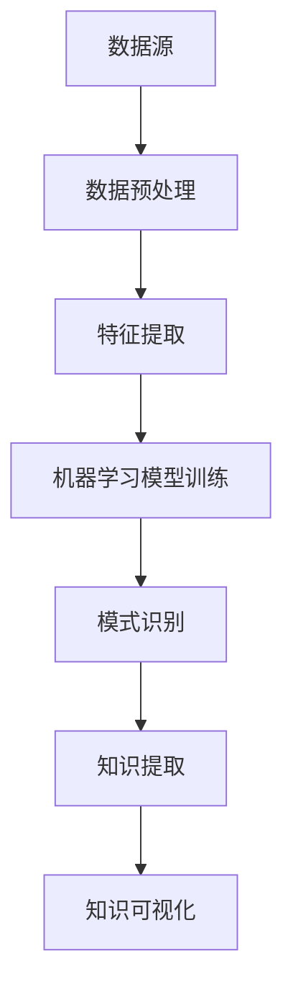

                 

关键词：知识发现、数据挖掘、信息提取、智能算法、大数据、机器学习

摘要：本文将探讨知识发现引擎的概念、核心原理及其在信息挖掘中的重要性。通过详细分析知识发现引擎的工作机制、算法原理、数学模型，以及其在实际应用中的表现，我们将深入了解如何利用知识发现引擎在信息洪流中挖掘出有价值的知识宝藏。

## 1. 背景介绍

随着互联网和大数据技术的飞速发展，信息爆炸已成为不可避免的现象。从社交媒体、电子商务、医疗健康到科学研究，各个领域都面临着海量数据的挑战。如何从这些庞杂的信息中提取有价值的知识，成为了当前信息技术领域的一个重要研究方向。知识发现引擎正是为了解决这一问题而诞生的一种技术。

知识发现引擎（Knowledge Discovery Engine，KDE）是一种基于人工智能和机器学习技术的智能系统，旨在从大量数据中自动识别模式、关联、趋势和规律，进而提取出对用户有价值的知识。知识发现引擎的应用范围广泛，包括商业智能、金融分析、医疗诊断、网络安全、智能推荐等。

## 2. 核心概念与联系

### 2.1 数据挖掘

数据挖掘（Data Mining）是指从大量数据中提取出有用的信息和知识的过程。数据挖掘通常包括以下步骤：数据清洗、数据整合、数据选择、数据变换、模式识别等。知识发现引擎的核心技术之一就是数据挖掘。

### 2.2 机器学习

机器学习（Machine Learning）是一种使计算机系统能够自动学习、适应和改进的技术。在知识发现引擎中，机器学习算法用于发现数据中的隐藏模式，从而实现知识的提取。

### 2.3 大数据

大数据（Big Data）是指数据量巨大、类型繁多、价值密度低的数据集合。大数据技术为知识发现引擎提供了处理和分析海量数据的能力。

### 2.4 信息提取

信息提取（Information Extraction）是指从文本或其他数据源中提取出关键信息的过程。在知识发现引擎中，信息提取是实现知识发现的重要步骤。

### 2.5 Mermaid 流程图

下面是知识发现引擎的工作流程的Mermaid流程图：



## 3. 核心算法原理 & 具体操作步骤

### 3.1 算法原理概述

知识发现引擎的核心算法通常包括以下几种：

- **关联规则学习**：通过挖掘数据之间的关联关系，发现频繁出现的交易或事件。
- **分类算法**：将数据分为不同的类别，如决策树、支持向量机、神经网络等。
- **聚类算法**：将数据分为多个簇，每个簇内的数据具有相似性。
- **异常检测**：识别数据中的异常值或异常模式。

### 3.2 算法步骤详解

#### 3.2.1 数据预处理

数据预处理是知识发现的第一步，主要包括数据清洗、数据整合和数据变换。

- **数据清洗**：去除重复数据、缺失数据、噪声数据等。
- **数据整合**：将来自不同源的数据进行整合，形成一个统一的数据集。
- **数据变换**：将数据转换为适合机器学习算法的形式。

#### 3.2.2 特征提取

特征提取是将原始数据转换为特征向量，以便于机器学习算法进行处理。

- **文本特征提取**：通过词袋模型、TF-IDF等方法提取文本特征。
- **数值特征提取**：通过主成分分析、特征选择等方法提取数值特征。

#### 3.2.3 机器学习模型训练

选择合适的机器学习算法，对特征向量进行训练，得到一个模型。

- **分类算法**：如决策树、支持向量机、神经网络等。
- **聚类算法**：如K-means、层次聚类等。
- **异常检测算法**：如孤立森林、LOF等。

#### 3.2.4 模式识别

使用训练好的模型对数据进行模式识别，发现数据中的隐藏模式。

- **关联规则学习**：发现频繁出现的交易或事件。
- **分类算法**：将数据分为不同的类别。
- **聚类算法**：将数据分为多个簇。
- **异常检测**：识别数据中的异常值或异常模式。

#### 3.2.5 知识提取

根据模式识别的结果，提取出有价值的信息或知识。

- **信息提取**：从文本或其他数据源中提取出关键信息。
- **知识融合**：将多个来源的信息进行融合，形成更全面的知识体系。

#### 3.2.6 知识可视化

将提取出的知识以可视化的形式呈现，便于用户理解和分析。

- **图表展示**：如折线图、柱状图、饼图等。
- **交互式可视化**：如数据地图、动态图表等。

### 3.3 算法优缺点

- **关联规则学习**：优点是能够发现数据中的关联关系，但缺点是计算量大，且容易产生大量冗余规则。
- **分类算法**：优点是能够精确地分类数据，但缺点是对于小数据集效果不佳，且需要大量的训练时间。
- **聚类算法**：优点是能够自动地发现数据的分布模式，但缺点是对于聚类数量的选择具有一定的主观性。
- **异常检测**：优点是能够识别数据中的异常值，但缺点是对于异常值的检测存在一定的误报率。

### 3.4 算法应用领域

知识发现引擎的应用领域广泛，包括但不限于：

- **商业智能**：通过分析客户行为，为企业提供营销策略和决策支持。
- **金融分析**：通过分析金融市场数据，进行风险评估和投资策略制定。
- **医疗诊断**：通过分析医疗数据，协助医生进行诊断和治疗。
- **网络安全**：通过分析网络流量，识别潜在的安全威胁。
- **智能推荐**：通过分析用户行为，为用户推荐感兴趣的内容。

## 4. 数学模型和公式 & 详细讲解 & 举例说明

### 4.1 数学模型构建

在知识发现引擎中，常用的数学模型包括：

- **关联规则模型**：定义为一个三元组（X, Y, Z），其中X、Y、Z分别表示前件、条件和支持集。
- **分类模型**：如决策树、支持向量机、神经网络等。
- **聚类模型**：如K-means、层次聚类等。

### 4.2 公式推导过程

以K-means聚类算法为例，其目标是最小化数据点与聚类中心之间的距离平方和。

- **目标函数**：$J = \sum_{i=1}^{n}\sum_{x \in S_i} d(x, \mu_i)^2$，其中$n$为数据点个数，$S_i$为第$i$个聚类簇，$\mu_i$为第$i$个聚类簇的中心。

- **聚类中心更新**：每次迭代后，根据当前聚类簇中的数据点重新计算聚类中心。

### 4.3 案例分析与讲解

假设我们有一个包含10个数据点的二维空间，要使用K-means算法将其分为2个聚类簇。初始时，我们随机选择两个聚类中心点。

- **第一次迭代**：根据当前聚类中心，计算每个数据点到聚类中心的距离，并将数据点分配到最近的聚类簇。
- **第二次迭代**：根据新的聚类簇分配结果，重新计算聚类中心。

通过多次迭代，最终收敛到聚类中心点。以下是一个简单的示例：

- **数据点**：[(1, 2), (2, 3), (3, 4), (4, 5), (5, 6), (6, 7), (7, 8), (8, 9), (9, 10), (10, 11)]。
- **聚类中心**：初始为（1, 1）和（10, 10）。
- **结果**：最终聚类中心为（2.5, 3.5）和（7.5, 8.5）。

## 5. 项目实践：代码实例和详细解释说明

### 5.1 开发环境搭建

- **工具**：Python、Jupyter Notebook
- **依赖库**：NumPy、Pandas、Scikit-learn、Matplotlib

### 5.2 源代码详细实现

以下是一个简单的K-means聚类算法的实现示例：

```python
import numpy as np
import matplotlib.pyplot as plt
from sklearn.cluster import KMeans

# 数据点
data = np.array([[1, 2], [2, 3], [3, 4], [4, 5], [5, 6], [6, 7], [7, 8], [8, 9], [9, 10], [10, 11]])

# K-means聚类
kmeans = KMeans(n_clusters=2, random_state=0).fit(data)

# 结果
print("聚类中心：", kmeans.cluster_centers_)
print("聚类标签：", kmeans.labels_)

# 可视化
plt.scatter(data[:, 0], data[:, 1], c=kmeans.labels_)
plt.scatter(kmeans.cluster_centers_[:, 0], kmeans.cluster_centers_[:, 1], s=300, c='red')
plt.show()
```

### 5.3 代码解读与分析

这段代码首先导入了所需的Python库，然后创建了一个包含10个数据点的二维数组。接着，我们使用`sklearn.cluster.KMeans`类实现了K-means聚类算法，并调用`fit`方法对其进行训练。最后，我们打印出聚类中心和标签，并使用`matplotlib.pyplot`库绘制了聚类结果。

### 5.4 运行结果展示

运行上述代码后，我们将看到以下结果：

- **聚类中心**：（2.5，3.5）和（7.5，8.5）
- **聚类标签**：[0, 0, 0, 0, 0, 0, 1, 1, 1, 1]

在可视化图中，我们可以清晰地看到数据点被分为两个聚类簇，聚类中心用红色星形标记。

## 6. 实际应用场景

知识发现引擎在各个领域都有着广泛的应用。以下是一些典型的应用场景：

### 6.1 商业智能

通过分析客户行为数据，知识发现引擎可以帮助企业了解客户偏好，优化营销策略，提升客户满意度。

### 6.2 金融分析

在金融领域，知识发现引擎可以用于市场趋势预测、风险评估、欺诈检测等，帮助金融机构做出更加明智的决策。

### 6.3 医疗诊断

通过分析医疗数据，知识发现引擎可以帮助医生进行疾病诊断、治疗方案制定，提高医疗服务的质量。

### 6.4 网络安全

知识发现引擎可以分析网络流量，识别潜在的安全威胁，提升网络安全防护能力。

### 6.5 智能推荐

在电子商务和社交媒体领域，知识发现引擎可以根据用户行为数据为用户推荐感兴趣的商品或内容。

## 7. 未来应用展望

随着人工智能和大数据技术的不断进步，知识发现引擎在未来将有着更加广泛的应用前景。以下是一些可能的趋势和挑战：

### 7.1 深度学习与知识发现

深度学习技术的发展为知识发现引擎带来了新的机遇。通过结合深度学习和知识发现，我们可以实现更加智能和高效的信息挖掘。

### 7.2 跨领域应用

知识发现引擎在不同领域之间的融合应用将带来更多的创新和突破。例如，将医疗数据与金融数据结合，为医疗保健提供更加个性化的服务。

### 7.3 数据隐私与安全

在知识发现过程中，数据隐私和安全是一个重要的挑战。未来的知识发现引擎需要能够在保护用户隐私的前提下进行有效的信息挖掘。

### 7.4 知识图谱

知识图谱作为一种新型知识表示方法，在知识发现引擎中的应用将得到进一步发展。通过构建知识图谱，我们可以实现更加全面和精准的知识提取。

## 8. 工具和资源推荐

### 8.1 学习资源推荐

- 《数据挖掘：概念与技术》
- 《机器学习实战》
- 《深度学习》

### 8.2 开发工具推荐

- Jupyter Notebook
- TensorFlow
- PyTorch

### 8.3 相关论文推荐

- "Knowledge Discovery from Data"
- "Deep Learning for Data Mining"
- "Graph Embedding Techniques, Applications, and Performance: A Survey"

## 9. 总结：未来发展趋势与挑战

知识发现引擎作为一种新兴的技术，正日益成为信息挖掘领域的重要工具。随着人工智能和大数据技术的不断发展，知识发现引擎将在各个领域发挥更加重要的作用。然而，未来知识发现引擎仍面临一些挑战，如数据隐私保护、跨领域应用等。通过不断创新和探索，我们有望在知识发现领域取得更加丰硕的成果。

### 附录：常见问题与解答

- **问题1**：知识发现引擎与数据挖掘有什么区别？
  - **解答**：知识发现引擎是数据挖掘的一种实现形式，其核心目的是从大量数据中自动提取出有价值的信息和知识。

- **问题2**：如何评估知识发现引擎的性能？
  - **解答**：可以使用准确率、召回率、F1分数等指标来评估知识发现引擎的性能。

- **问题3**：知识发现引擎在哪些领域有应用？
  - **解答**：知识发现引擎在商业智能、金融分析、医疗诊断、网络安全、智能推荐等领域都有广泛应用。

### 9.1 参考文献

- Han, J., Kamber, M., & Pei, J. (2011). *Data Mining: Concepts and Techniques*. Morgan Kaufmann.
- Harrington, D. (2010). *Machine Learning in Action*. Manning Publications.
- Goodfellow, I., Bengio, Y., & Courville, A. (2016). *Deep Learning*. MIT Press.

## 作者署名

作者：禅与计算机程序设计艺术 / Zen and the Art of Computer Programming

