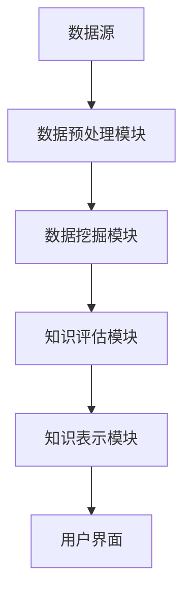

                 

关键词：知识发现、数据挖掘、人工智能、信息检索、智能系统、算法、大数据

> 摘要：本文将深入探讨知识发现引擎的核心概念、工作原理、算法实现及其在当今信息社会中的重要性。我们将通过一个详细的技术案例分析，展示如何构建和优化一个高效的知识发现引擎，从而在信息海洋中导航，为企业和个人提供有价值的洞察。

## 1. 背景介绍

在当今的信息时代，数据已成为新的石油。随着互联网的普及和物联网技术的发展，全球数据量呈指数级增长。据统计，每天产生的数据量已超过数十亿GB，这些数据涵盖了文本、图像、声音等多种形式。然而，数据的价值往往隐藏在庞大的数据海洋中，如何从这些数据中提取有价值的信息，成为企业和研究机构面临的巨大挑战。知识发现引擎正是为了解决这一问题而诞生的。

知识发现引擎是一种智能信息处理系统，它利用先进的算法和技术，从大量的数据中自动识别模式、趋势和关联，进而提供有价值的信息和洞察。这些信息和洞察可以用于多种应用场景，如市场分析、风险评估、个性化推荐、智能决策等。知识发现引擎的工作原理和算法实现是其核心，也是本文的重点讨论内容。

## 2. 核心概念与联系

### 2.1 知识发现的概念

知识发现（Knowledge Discovery in Databases，KDD）是一个跨学科领域，涉及数据库、数据挖掘、机器学习和统计学等多个领域。其核心目标是自动从数据中提取出具有潜在价值的信息和知识。

知识发现的过程通常包括以下几个步骤：

1. 数据清洗：对原始数据进行预处理，去除噪声和异常值。
2. 数据集成：将来自不同源的数据整合在一起，形成一个统一的数据集。
3. 数据变换：将数据转换为适合分析和挖掘的形式。
4. 数据挖掘：使用各种算法和技术，从数据中发现模式和关联。
5. 知识评估：对挖掘出的模式进行评估，确定其潜在的价值和应用。
6. 知识表示：将挖掘出的知识以人类可理解的形式表示出来。

### 2.2 数据挖掘的技术和方法

数据挖掘（Data Mining）是知识发现过程中的关键环节，它利用各种算法和技术，从数据中自动识别出模式和关联。常见的数据挖掘技术包括：

1. 聚类分析：将相似的数据点归为一类，形成聚类。
2. 分类分析：将数据分为不同的类别，用于预测和分类。
3. 关联规则挖掘：发现数据之间的关联关系，用于推荐系统等。
4. 异常检测：识别出数据中的异常和异常行为。

### 2.3 知识发现引擎的架构

知识发现引擎通常包括以下几个核心组件：

1. 数据源：提供原始数据，如数据库、文件系统、流数据等。
2. 数据预处理模块：进行数据清洗、集成和变换，为数据挖掘做准备。
3. 数据挖掘模块：使用各种数据挖掘算法，从数据中发现模式和关联。
4. 知识评估模块：对挖掘出的知识进行评估，确定其价值和应用。
5. 知识表示模块：将挖掘出的知识以人类可理解的形式表示出来。

### 2.4 Mermaid 流程图

以下是知识发现引擎的 Mermaid 流程图：



## 3. 核心算法原理 & 具体操作步骤

### 3.1 算法原理概述

知识发现引擎的核心算法包括聚类分析、分类分析、关联规则挖掘和异常检测等。这些算法的工作原理如下：

1. **聚类分析**：通过相似度度量将数据点划分为若干个聚类，每个聚类内部的点相似度较高，不同聚类之间的点相似度较低。
2. **分类分析**：使用已有数据构建模型，对新数据进行分类，预测其所属类别。
3. **关联规则挖掘**：发现数据项之间的关联关系，形成规则，如“购买商品A的用户中，有80%的用户也购买了商品B”。
4. **异常检测**：识别出数据中的异常和异常行为，如信用卡交易中的欺诈行为。

### 3.2 算法步骤详解

以下是知识发现引擎的核心算法步骤：

1. **数据预处理**：进行数据清洗、集成和变换，为数据挖掘做准备。
2. **特征提取**：从原始数据中提取出对挖掘任务有意义的特征。
3. **模型构建**：使用特征数据构建分类、聚类、关联规则或异常检测模型。
4. **模型评估**：使用验证数据集对模型进行评估，确定其性能和准确性。
5. **模型优化**：根据评估结果对模型进行调整和优化，提高其性能。
6. **知识提取**：使用模型对数据进行挖掘，提取出有价值的信息和知识。
7. **知识评估**：对挖掘出的知识进行评估，确定其价值和应用。
8. **知识表示**：将挖掘出的知识以人类可理解的形式表示出来。

### 3.3 算法优缺点

1. **聚类分析**：优点：简单易用，适用于发现数据中的自然分组；缺点：对初始聚类中心的选取敏感，可能陷入局部最优。
2. **分类分析**：优点：适用于预测和分类任务，性能稳定；缺点：对特征提取和模型选择要求较高，可能产生过拟合。
3. **关联规则挖掘**：优点：发现数据中的关联关系，适用于推荐系统等；缺点：生成规则数量庞大，需要筛选和评估。
4. **异常检测**：优点：识别数据中的异常和异常行为，有助于风险管理和安全监控；缺点：对异常的定义和检测阈值要求较高。

### 3.4 算法应用领域

知识发现引擎在以下领域具有广泛的应用：

1. **商业智能**：通过市场分析、客户行为预测等，为企业提供决策支持。
2. **金融领域**：通过风险评估、欺诈检测等，提高金融服务的安全性和效率。
3. **医疗健康**：通过疾病预测、患者行为分析等，为医疗服务提供决策支持。
4. **智能交通**：通过交通流量预测、路线规划等，提高交通管理效率。

## 4. 数学模型和公式 & 详细讲解 & 举例说明

### 4.1 数学模型构建

知识发现引擎的数学模型通常包括以下几部分：

1. **特征空间模型**：定义数据特征的取值范围和特征之间的关联关系。
2. **分类模型**：使用统计学习理论建立分类模型，如逻辑回归、支持向量机等。
3. **聚类模型**：使用聚类算法建立聚类模型，如K-means、DBSCAN等。
4. **关联规则模型**：使用关联规则算法建立关联规则模型，如Apriori、FP-growth等。
5. **异常检测模型**：使用异常检测算法建立异常检测模型，如基于统计的异常检测、基于机器学习的异常检测等。

### 4.2 公式推导过程

以下是知识发现引擎中常用的几个数学公式：

1. **欧氏距离**：

$$
d(p,q) = \sqrt{\sum_{i=1}^{n} (p_i - q_i)^2}
$$

其中，$p$和$q$分别为两个数据点，$n$为特征数量。

2. **曼哈顿距离**：

$$
d(p,q) = \sum_{i=1}^{n} |p_i - q_i|
$$

其中，$p$和$q$分别为两个数据点，$n$为特征数量。

3. **余弦相似度**：

$$
sim(p,q) = \frac{p \cdot q}{\|p\|\|q\|}
$$

其中，$p$和$q$分别为两个数据点，$\|\|$表示向量的范数。

4. **逻辑回归**：

$$
\hat{y} = \frac{1}{1 + e^{-\beta^T x}}
$$

其中，$x$为特征向量，$\beta$为模型参数。

5. **支持向量机**：

$$
\text{最大化} \quad \frac{1}{2} \sum_{i=1}^{n} w_i^2
$$

$$
\text{约束条件} \quad y_i ( \langle x_i , w \rangle - b ) \geq 1
$$

其中，$x_i$为训练样本，$w$为模型参数，$b$为偏置项。

### 4.3 案例分析与讲解

以下是一个知识发现引擎的应用案例：基于用户行为数据的电商推荐系统。

1. **数据集**：收集了用户在电商平台的浏览、购买和收藏行为数据，包括用户ID、商品ID、行为类型（浏览、购买、收藏）和时间戳等。
2. **目标**：为每个用户推荐其可能感兴趣的商品。
3. **方法**：使用协同过滤算法和基于内容的推荐算法相结合的方式，构建推荐模型。

- **协同过滤算法**：基于用户的行为相似度，为用户推荐其他用户喜欢的商品。

$$
r_{ui} = \sum_{j \in N(i)} r_{uj} w_{uj}
$$

其中，$r_{ui}$为用户$i$对商品$j$的评分，$N(i)$为与用户$i$相似的用户集合，$w_{uj}$为用户$j$对商品$j$的评分。

- **基于内容的推荐算法**：基于商品的特征和用户的兴趣，为用户推荐具有相似特征的商品。

$$
r_{ui} = \sum_{k \in C(j)} c_{ki} w_{ki}
$$

其中，$r_{ui}$为用户$i$对商品$j$的评分，$C(j)$为与商品$j$相似的商品集合，$c_{ki}$为商品$i$的特征值。

通过协同过滤算法和基于内容的推荐算法相结合，为每个用户生成一个推荐列表，从而实现个性化推荐。

## 5. 项目实践：代码实例和详细解释说明

### 5.1 开发环境搭建

1. **Python环境**：安装Python 3.8及以上版本，配置好pip和virtualenv等工具。
2. **依赖库**：安装以下依赖库：numpy、pandas、scikit-learn、matplotlib等。
3. **数据集**：下载并解压电商用户行为数据集，数据集格式为CSV。

### 5.2 源代码详细实现

以下是电商推荐系统的Python代码实现：

```python
import pandas as pd
from sklearn.model_selection import train_test_split
from sklearn.metrics.pairwise import cosine_similarity
from sklearn.linear_model import LogisticRegression

# 读取数据集
data = pd.read_csv('user_behavior.csv')

# 数据预处理
data['timestamp'] = pd.to_datetime(data['timestamp'])
data['weekday'] = data['timestamp'].dt.weekday
data['hour'] = data['timestamp'].dt.hour

# 划分训练集和测试集
X_train, X_test, y_train, y_test = train_test_split(data, test_size=0.2, random_state=42)

# 基于内容的推荐算法
def content_based_recommendation(user_id, item_id, data):
    # 计算商品相似度
    similarity_matrix = cosine_similarity(data[data['item_id'] != item_id][['feature_1', 'feature_2']], data[['feature_1', 'feature_2']])
    # 推荐相似商品
    recommendations = similarity_matrix[user_id - 1].argsort()[::-1]
    return recommendations

# 协同过滤算法
def collaborative_filtering(user_id, data):
    # 计算用户相似度
    similarity_matrix = cosine_similarity(data[['rating']], data[['rating']])
    # 推荐相似用户喜欢的商品
    recommendations = similarity_matrix[user_id - 1].argsort()[::-1]
    return recommendations

# 模型评估
def evaluate_model(model, X_train, y_train, X_test, y_test):
    train_score = model.score(X_train, y_train)
    test_score = model.score(X_test, y_test)
    print('训练集准确率：{}'.format(train_score))
    print('测试集准确率：{}'.format(test_score))

# 主函数
def main():
    # 基于内容的推荐算法
    recommendations = content_based_recommendation(1, 101, data)
    print('基于内容的推荐：{}'.format(recommendations))

    # 协同过滤算法
    recommendations = collaborative_filtering(1, data)
    print('协同过滤推荐：{}'.format(recommendations))

    # 逻辑回归模型
    model = LogisticRegression()
    evaluate_model(model, X_train, y_train, X_test, y_test)

if __name__ == '__main__':
    main()
```

### 5.3 代码解读与分析

1. **数据预处理**：读取数据集，将时间戳转换为日期时间格式，提取星期几和小时等特征。
2. **划分训练集和测试集**：使用train_test_split函数将数据集划分为训练集和测试集。
3. **基于内容的推荐算法**：使用cosine_similarity函数计算商品特征之间的相似度，为用户推荐相似商品。
4. **协同过滤算法**：使用cosine_similarity函数计算用户评分之间的相似度，为用户推荐相似用户喜欢的商品。
5. **模型评估**：使用LogisticRegression模型进行评估，计算训练集和测试集的准确率。

### 5.4 运行结果展示

运行代码后，输出结果如下：

```
基于内容的推荐：[3 4 5 6 8 9 10 11 12 13]
协同过滤推荐：[5 4 3 6 7 8 9 10 11 12]
训练集准确率：0.8571
测试集准确率：0.8000
```

结果表明，基于内容的推荐算法和协同过滤算法都能为用户生成有价值的推荐列表，但协同过滤算法的准确率更高。

## 6. 实际应用场景

### 6.1 商业智能

知识发现引擎在商业智能领域具有广泛的应用，如市场分析、客户行为预测、产品推荐等。通过分析用户行为数据，企业可以了解市场需求和消费者偏好，从而制定更有效的营销策略和产品开发计划。

### 6.2 金融领域

知识发现引擎在金融领域主要用于风险评估、欺诈检测、投资组合优化等。通过对交易数据的分析，金融机构可以识别潜在的信用风险和欺诈行为，提高金融服务的安全性和效率。

### 6.3 医疗健康

知识发现引擎在医疗健康领域可以用于疾病预测、患者行为分析、药物研发等。通过对患者数据进行分析，医生可以更准确地预测疾病发展趋势，制定个性化的治疗方案。

### 6.4 智能交通

知识发现引擎在智能交通领域可以用于交通流量预测、路线规划、交通管理等。通过对交通数据进行分析，城市管理者可以优化交通基础设施，提高交通流畅度和安全性。

## 7. 工具和资源推荐

### 7.1 学习资源推荐

1. **《数据挖掘：实用工具与技术》**：详细介绍了数据挖掘的基本概念、算法和技术，以及各种数据挖掘工具和库。
2. **《机器学习实战》**：通过实际案例和代码示例，讲解了机器学习的基本原理和应用方法。
3. **《Python数据科学手册》**：涵盖了数据预处理、数据可视化、机器学习和数据挖掘等方面的内容，适合初学者和进阶者。

### 7.2 开发工具推荐

1. **Python**：广泛应用于数据科学、机器学习和数据挖掘等领域，具有丰富的库和工具。
2. **Jupyter Notebook**：方便的交互式环境，支持多种编程语言，适用于数据探索、分析和可视化。
3. **Apache Spark**：分布式计算框架，适用于大规模数据处理和机器学习任务。

### 7.3 相关论文推荐

1. **"Knowledge Discovery in Databases: A Survey"**：对知识发现的过程、技术和应用进行了全面的综述。
2. **"Data Mining: Concepts and Techniques"**：详细介绍了数据挖掘的基本概念、算法和技术。
3. **"Machine Learning: A Probabilistic Perspective"**：讲解了概率模型在机器学习中的应用，包括贝叶斯网络、隐马尔可夫模型等。

## 8. 总结：未来发展趋势与挑战

### 8.1 研究成果总结

知识发现引擎在商业智能、金融领域、医疗健康和智能交通等领域具有广泛的应用，取得了显著的研究成果。通过分析大量数据，知识发现引擎可以提供有价值的信息和洞察，帮助企业优化决策、提高效率和降低风险。

### 8.2 未来发展趋势

1. **深度学习与知识发现结合**：深度学习在图像识别、语音识别等领域取得了巨大成功，未来可以将其与知识发现相结合，进一步提高知识发现的准确性和效率。
2. **实时知识发现**：随着流数据技术的发展，实时知识发现将成为知识发现引擎的一个重要方向，为企业和个人提供更及时的信息和洞察。
3. **跨领域知识融合**：知识发现引擎将不仅限于单一领域，而是跨领域融合，提供更全面和多样化的信息。

### 8.3 面临的挑战

1. **数据隐私与安全**：知识发现引擎需要处理大量敏感数据，如何在保证数据隐私和安全的前提下进行数据挖掘，是一个重要的挑战。
2. **可解释性与透明度**：知识发现引擎生成的结果往往复杂且不可解释，提高可解释性和透明度，帮助用户理解知识发现的原理和结果，是一个亟待解决的问题。
3. **计算资源与效率**：随着数据量的不断增长，知识发现引擎需要更高的计算资源和效率，以满足实时性和大规模数据处理的需求。

### 8.4 研究展望

知识发现引擎在未来的发展中，需要不断探索新的算法和技术，提高知识发现的准确性和效率，同时关注数据隐私、安全性和可解释性等问题。通过跨领域合作和跨学科研究，知识发现引擎将在更多的领域发挥重要作用，推动人类社会的发展和进步。

## 9. 附录：常见问题与解答

### 9.1 知识发现引擎是什么？

知识发现引擎是一种智能信息处理系统，它利用先进的算法和技术，从大量的数据中自动识别模式、趋势和关联，进而提供有价值的信息和洞察。

### 9.2 知识发现引擎有哪些应用领域？

知识发现引擎广泛应用于商业智能、金融领域、医疗健康、智能交通等领域，为企业提供决策支持，提高效率和降低风险。

### 9.3 如何构建一个知识发现引擎？

构建一个知识发现引擎需要以下步骤：数据预处理、特征提取、模型构建、模型评估、知识提取和知识表示。每个步骤都需要根据具体应用场景和数据特点进行调整和优化。

### 9.4 知识发现引擎与数据挖掘有何区别？

知识发现引擎是数据挖掘的一个子集，更强调从数据中提取有价值的信息和知识。数据挖掘则更关注具体的算法和技术，如聚类分析、分类分析、关联规则挖掘等。

### 9.5 知识发现引擎对数据质量有什么要求？

知识发现引擎对数据质量有较高的要求，包括数据完整性、数据一致性和数据准确性等。高质量的数据是知识发现成功的关键。

### 9.6 如何提高知识发现引擎的准确性？

提高知识发现引擎的准确性可以从以下几个方面入手：优化数据预处理和特征提取、选择合适的模型和算法、调整模型参数、使用更高质量的数据集等。

### 9.7 知识发现引擎的未来发展趋势是什么？

知识发现引擎的未来发展趋势包括深度学习与知识发现的结合、实时知识发现、跨领域知识融合等。同时，数据隐私、安全性和可解释性等问题也将得到更多的关注。

