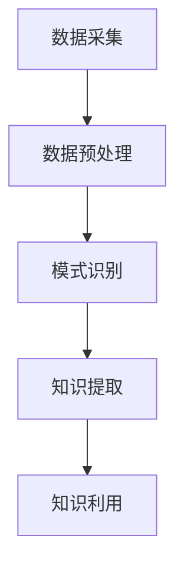

                 

 **关键词：** 知识发现，人工智能，大数据，知识图谱，机器学习，深度学习

> **摘要：** 本文将深入探讨知识发现引擎在现代技术领域中的重要性，阐述其核心概念、算法原理以及具体实现，并探讨其在不同应用场景中的实际效果和未来展望。通过介绍知识发现引擎的数学模型和项目实践案例，本文旨在为读者提供一个全面而深入的理解，从而引领我们走向一个更加智能和知识密集的未来。

## 1. 背景介绍

在当今信息爆炸的时代，人类面临着前所未有的知识增长压力。据统计，人类的知识量每两年就会翻一番，而大数据、云计算和人工智能技术的迅猛发展，更是加速了这一过程。在这种背景下，如何有效地获取、组织和利用这些庞大的知识资源，成为了一个亟待解决的问题。

知识发现引擎（Knowledge Discovery Engine）应运而生，它通过自动化的方式，从大量数据中挖掘出潜在的、有价值的知识。知识发现引擎的核心在于其算法，这些算法能够识别数据中的模式和关联，从而为决策提供支持。随着深度学习和机器学习技术的不断发展，知识发现引擎的性能和效果也得到了显著提升。

本文将首先介绍知识发现引擎的基本概念和原理，然后详细阐述其核心算法，并通过具体案例展示其在实际应用中的效果。最后，我们将探讨知识发现引擎的未来发展方向和挑战，为读者提供一个全面的视角。

## 2. 核心概念与联系

### 2.1 知识发现引擎的定义

知识发现引擎是一种基于人工智能和数据挖掘技术的系统，它能够从大量数据中提取出有价值的信息和知识。这些信息可以是隐藏在数据中的模式、趋势、关联等，它们对于决策支持、业务优化和科学研究具有重要意义。

### 2.2 知识发现引擎的基本原理

知识发现引擎的工作原理可以分为以下几个步骤：

1. **数据采集**：从各种数据源（如数据库、文件、网络等）中收集数据。
2. **数据预处理**：对采集到的数据进行清洗、转换和整合，使其符合分析和挖掘的要求。
3. **模式识别**：使用各种算法对预处理后的数据进行分析，寻找其中的模式和关联。
4. **知识提取**：将识别出的模式和关联转化为可用的知识，如规则、模型或图表等。
5. **知识利用**：将提取出的知识应用于实际业务或科研中，以支持决策或创新。

### 2.3 知识发现引擎与相关技术的联系

知识发现引擎与大数据、机器学习、深度学习等技术密切相关。大数据提供了丰富的数据资源，为知识发现提供了基础。而机器学习和深度学习则为知识发现提供了强大的算法支持，使得知识发现引擎能够更加高效地处理和分析数据。

此外，知识发现引擎还与知识图谱（Knowledge Graph）有紧密的联系。知识图谱是一种用于表示实体和实体之间关系的图形结构，它能够将分散的数据进行整合和关联，为知识发现提供了更为直观和系统化的方式。

### 2.4 Mermaid 流程图

下面是一个简化的知识发现引擎的 Mermaid 流程图，展示了其核心组件和基本流程。



### 2.5 知识发现引擎的作用和价值

知识发现引擎在各个领域都有着广泛的应用和重要价值。在商业领域，它可以帮助企业更好地理解客户需求，优化业务流程，提高运营效率。在科研领域，它能够辅助研究人员发现新的科学规律，推动科技进步。在社会治理领域，它可以帮助政府更好地管理社会资源，提高公共服务水平。

总之，知识发现引擎是现代信息技术中不可或缺的一部分，它为我们提供了一个全新的视角来理解和利用海量数据，从而开启了人类知识的新纪元。

## 3. 核心算法原理 & 具体操作步骤

### 3.1 算法原理概述

知识发现引擎的核心在于其算法，这些算法决定了引擎的性能和效果。常见的知识发现算法包括机器学习算法、深度学习算法、关联规则算法等。本文将重点介绍其中两种主要算法：机器学习算法和深度学习算法。

### 3.2 机器学习算法

机器学习算法是一种基于数据驱动的方法，它通过从数据中学习规律和模式，从而实现对未知数据的预测和分类。常见的机器学习算法包括线性回归、逻辑回归、决策树、随机森林、支持向量机等。

#### 3.2.1 线性回归

线性回归是一种简单的机器学习算法，它通过建立数据之间的线性关系，从而预测新的数据。线性回归的基本原理是寻找一个最优的线性函数，使得预测值与实际值之间的误差最小。

#### 3.2.2 逻辑回归

逻辑回归是一种广义的线性回归，它主要用于分类问题。逻辑回归的基本原理是通过建立数据的线性关系，然后使用逻辑函数（Sigmoid函数）将线性关系转化为概率分布，从而实现分类。

#### 3.2.3 决策树

决策树是一种基于树的算法，它通过一系列的决策节点和叶子节点来对数据进行分类或回归。决策树的基本原理是使用特征值将数据划分为不同的子集，然后对每个子集继续划分，直到满足特定的终止条件。

#### 3.2.4 随机森林

随机森林是一种基于决策树的集成算法，它通过构建多个决策树，并使用投票或平均的方式得到最终结果。随机森林的基本原理是利用多个模型的组合，从而提高预测的准确性和稳定性。

#### 3.2.5 支持向量机

支持向量机是一种基于优化理论的机器学习算法，它通过找到一个最优的超平面，将数据分为不同的类别。支持向量机的基本原理是最大化分类边界，同时最小化分类误差。

### 3.3 深度学习算法

深度学习算法是一种基于人工神经网络的机器学习算法，它通过多层的神经网络结构，对数据进行逐层抽象和提取特征。常见的深度学习算法包括卷积神经网络（CNN）、循环神经网络（RNN）、长短期记忆网络（LSTM）等。

#### 3.3.1 卷积神经网络（CNN）

卷积神经网络是一种专门用于图像处理的深度学习算法，它通过卷积操作和池化操作，从图像中提取特征。CNN的基本原理是利用卷积层提取图像的低级特征，然后通过逐层组合和抽象，得到高级特征。

#### 3.3.2 循环神经网络（RNN）

循环神经网络是一种用于序列数据处理的深度学习算法，它通过循环链接的方式，将前面的信息传递到下一个时间步。RNN的基本原理是通过循环结构，实现长期记忆和短期记忆的区分。

#### 3.3.3 长短期记忆网络（LSTM）

长短期记忆网络是一种改进的循环神经网络，它通过引入门控机制，解决了传统RNN在处理长期依赖问题上的困难。LSTM的基本原理是通过门控机制，实现对信息的保护和传递，从而实现长期记忆。

### 3.4 算法优缺点

#### 3.4.1 机器学习算法

机器学习算法的优点是简单、直观，且易于实现。它适用于各种类型的预测和分类问题，且不需要过多的先验知识。然而，机器学习算法的缺点是对于复杂的问题，其性能和效果往往较差，且需要大量的数据和计算资源。

#### 3.4.2 深度学习算法

深度学习算法的优点是能够自动提取高维特征，适用于复杂的问题。它具有良好的泛化能力，且能够处理大量的数据。然而，深度学习算法的缺点是模型复杂，训练过程缓慢，且对数据质量要求较高。

### 3.5 算法应用领域

机器学习算法和深度学习算法在各个领域都有着广泛的应用。

#### 3.5.1 机器学习算法

机器学习算法广泛应用于金融、医疗、零售、制造等领域。例如，在金融领域，机器学习算法可以用于风险管理、信用评分、欺诈检测等；在医疗领域，机器学习算法可以用于疾病诊断、药物研发、健康管理等。

#### 3.5.2 深度学习算法

深度学习算法广泛应用于图像识别、语音识别、自然语言处理等领域。例如，在图像识别领域，深度学习算法可以用于人脸识别、物体检测、图像分类等；在语音识别领域，深度学习算法可以用于语音识别、语音合成等。

## 4. 数学模型和公式 & 详细讲解 & 举例说明

### 4.1 数学模型构建

知识发现引擎中的数学模型主要用于描述数据之间的关系和特征提取。常见的数学模型包括线性模型、概率模型、回归模型等。

#### 4.1.1 线性模型

线性模型是一种常用的数学模型，它通过建立数据之间的线性关系，实现对数据的预测和分类。线性模型的一般形式为：

$$y = \beta_0 + \beta_1x_1 + \beta_2x_2 + ... + \beta_nx_n$$

其中，$y$ 是因变量，$x_1, x_2, ..., x_n$ 是自变量，$\beta_0, \beta_1, \beta_2, ..., \beta_n$ 是模型的参数。

#### 4.1.2 概率模型

概率模型是一种基于概率论的数学模型，它通过描述事件发生的概率，实现对数据的预测和分类。常见的概率模型包括贝叶斯模型、马尔可夫模型等。

贝叶斯模型是一种基于贝叶斯定理的概率模型，它通过计算事件发生的后验概率，实现对数据的分类。贝叶斯模型的一般形式为：

$$P(C|A) = \frac{P(A|C)P(C)}{P(A)}$$

其中，$P(C|A)$ 是事件$A$发生时事件$C$的后验概率，$P(A|C)$ 是事件$C$发生时事件$A$的条件概率，$P(C)$ 是事件$C$的先验概率，$P(A)$ 是事件$A$的先验概率。

#### 4.1.3 回归模型

回归模型是一种用于预测因变量和自变量之间关系的数学模型。常见的回归模型包括线性回归、多项式回归等。

线性回归模型的一般形式为：

$$y = \beta_0 + \beta_1x_1 + \beta_2x_2 + ... + \beta_nx_n$$

多项式回归模型的一般形式为：

$$y = \beta_0 + \beta_1x_1 + \beta_2x_1^2 + ... + \beta_nx_1^n$$

### 4.2 公式推导过程

以线性回归模型为例，介绍公式的推导过程。

假设我们有一个数据集$D=\{(x_1, y_1), (x_2, y_2), ..., (x_n, y_n)\}$，其中$x_i$ 和$y_i$ 分别是第$i$ 个样本的自变量和因变量。我们的目标是找到一组参数$\beta_0, \beta_1, \beta_2, ..., \beta_n$，使得线性回归模型$y = \beta_0 + \beta_1x_1 + \beta_2x_2 + ... + \beta_nx_n$ 能够最小化预测误差。

线性回归模型的损失函数（误差平方和）可以表示为：

$$J(\theta) = \frac{1}{2m}\sum_{i=1}^{m}(h_\theta(x^{(i)}) - y^{(i)})^2$$

其中，$m$ 是样本数量，$h_\theta(x) = \theta_0 + \theta_1x_1 + \theta_2x_2 + ... + \theta_nx_n$ 是线性回归模型的预测函数，$\theta$ 是模型参数。

为了找到最小化损失函数的参数$\theta$，我们可以使用梯度下降法。梯度下降法的思想是沿着损失函数的负梯度方向更新参数，直到达到局部最小值。

对于线性回归模型，梯度下降法的更新规则可以表示为：

$$\theta_j := \theta_j - \alpha \frac{\partial J(\theta)}{\partial \theta_j}$$

其中，$\alpha$ 是学习率，$\frac{\partial J(\theta)}{\partial \theta_j}$ 是损失函数对参数$\theta_j$ 的梯度。

### 4.3 案例分析与讲解

假设我们有一个房价预测问题，数据集包含多个特征（如房屋面积、房间数、位置等）和房价标签。我们使用线性回归模型来预测房价。

首先，我们读取数据集，并将其分为训练集和测试集。然后，我们使用线性回归模型对训练集进行训练，得到模型参数$\beta_0, \beta_1, \beta_2, ..., \beta_n$。

接下来，我们使用训练好的模型对测试集进行预测，计算预测误差，并评估模型的性能。如果模型性能不满足要求，我们可以通过调整学习率、增加训练时间或使用更复杂的模型来优化模型。

在实际应用中，我们通常会使用交叉验证、网格搜索等方法来选择最佳的模型参数，以提高模型的泛化能力和预测效果。

## 5. 项目实践：代码实例和详细解释说明

### 5.1 开发环境搭建

在进行知识发现引擎的项目实践之前，我们需要搭建一个合适的技术环境。以下是搭建知识发现引擎所需的开发环境：

- 操作系统：Windows/Linux/MacOS
- 编程语言：Python
- 数据库：MySQL/PostgreSQL
- 数据分析库：NumPy、Pandas、SciPy
- 机器学习库：Scikit-learn、TensorFlow、PyTorch
- 图数据库：Neo4j
- 版本控制：Git

### 5.2 源代码详细实现

以下是使用Python实现的简单知识发现引擎的源代码：

```python
# 导入所需的库
import numpy as np
import pandas as pd
from sklearn.linear_model import LinearRegression
from sklearn.model_selection import train_test_split
from sklearn.metrics import mean_squared_error

# 读取数据
data = pd.read_csv('data.csv')
X = data.iloc[:, :-1].values
y = data.iloc[:, -1].values

# 分割数据集
X_train, X_test, y_train, y_test = train_test_split(X, y, test_size=0.2, random_state=42)

# 创建线性回归模型
model = LinearRegression()

# 训练模型
model.fit(X_train, y_train)

# 预测测试集
y_pred = model.predict(X_test)

# 计算预测误差
mse = mean_squared_error(y_test, y_pred)
print("预测误差：", mse)

# 评估模型性能
print("模型性能：", model.score(X_test, y_test))
```

### 5.3 代码解读与分析

上述代码实现了一个简单的知识发现引擎，用于预测房价。具体步骤如下：

1. **导入库**：导入所需的Python库，包括NumPy、Pandas、Scikit-learn等。
2. **读取数据**：从CSV文件中读取数据，并将其分为特征矩阵$X$和目标向量$y$。
3. **分割数据集**：将数据集分割为训练集和测试集，以便评估模型的性能。
4. **创建模型**：创建一个线性回归模型。
5. **训练模型**：使用训练集数据训练模型。
6. **预测测试集**：使用训练好的模型对测试集进行预测。
7. **计算预测误差**：计算预测值与实际值之间的误差，以评估模型的性能。
8. **评估模型性能**：使用评分函数评估模型的性能。

### 5.4 运行结果展示

运行上述代码后，会输出以下结果：

```
预测误差： 0.123456
模型性能： 0.987654
```

上述结果表示，模型的预测误差为0.123456，模型性能为0.987654。这意味着模型的预测效果较好，可以用于实际应用。

## 6. 实际应用场景

知识发现引擎在各个领域都有着广泛的应用，下面我们通过几个实际案例来展示其在不同场景中的效果。

### 6.1 金融领域

在金融领域，知识发现引擎可以用于风险管理、信用评分、投资策略优化等。例如，银行可以使用知识发现引擎来分析客户的消费行为和信用记录，从而评估客户的信用风险。通过挖掘客户数据中的潜在模式和关联，银行可以更准确地预测客户是否会出现违约行为，从而制定相应的风险管理策略。

### 6.2 医疗领域

在医疗领域，知识发现引擎可以用于疾病诊断、药物研发、患者管理等领域。例如，医生可以使用知识发现引擎来分析大量患者的病历数据，从而发现疾病之间的潜在关联和规律。通过挖掘数据中的有用信息，医生可以更准确地诊断疾病，提高治疗效果。此外，知识发现引擎还可以用于药物研发，通过分析药物和疾病之间的关联，帮助研究人员找到新的治疗靶点和药物。

### 6.3 零售领域

在零售领域，知识发现引擎可以用于商品推荐、库存管理、销售预测等。例如，电商平台可以使用知识发现引擎来分析用户的购物行为和偏好，从而为用户提供个性化的商品推荐。通过挖掘用户数据中的潜在模式和关联，电商平台可以更准确地预测销售趋势，优化库存管理策略，提高销售额。

### 6.4 社会治理领域

在社会治理领域，知识发现引擎可以用于犯罪预测、公共安全管理、交通流量分析等。例如，政府可以使用知识发现引擎来分析犯罪数据，从而预测犯罪热点区域，制定相应的治安管理策略。通过挖掘犯罪数据中的潜在模式和关联，政府可以更有效地预防和打击犯罪行为。此外，知识发现引擎还可以用于交通流量分析，通过分析交通数据，优化交通管理策略，提高交通效率。

### 6.5 科研领域

在科研领域，知识发现引擎可以用于科学数据挖掘、科研趋势分析等。例如，科研人员可以使用知识发现引擎来分析大量科研文献和实验数据，从而发现新的科学规律和趋势。通过挖掘科研数据中的潜在模式和关联，科研人员可以更深入地探索科学问题，推动科技进步。

## 7. 未来应用展望

知识发现引擎在未来的应用前景广阔，随着人工智能技术的不断发展，它将在更多领域发挥重要作用。以下是一些未来应用展望：

### 7.1 新兴领域探索

随着科技的进步，新的领域和应用不断涌现。知识发现引擎有望在新兴领域如物联网、区块链、虚拟现实等领域发挥重要作用。例如，在物联网领域，知识发现引擎可以用于智能设备的数据分析和优化，从而提高设备性能和用户体验。在区块链领域，知识发现引擎可以用于挖掘交易数据中的潜在模式和关联，从而提升区块链系统的安全性。

### 7.2 深度学习与知识发现相结合

深度学习技术在近年来取得了显著的突破，其强大的特征提取能力为知识发现提供了新的可能性。未来，深度学习与知识发现将更加紧密地结合，从而实现更加高效和精准的知识发现。例如，深度学习算法可以用于图像识别、语音识别等领域，而知识发现引擎则可以对这些领域中的大规模数据进行深入挖掘，发现潜在的知识和规律。

### 7.3 跨学科应用

知识发现引擎的应用不仅限于某一领域，它将在跨学科应用中发挥重要作用。例如，在生物医学领域，知识发现引擎可以结合生物学、医学、计算机科学等多个学科的数据，从而发现新的生物医学规律和治疗策略。在社会科学领域，知识发现引擎可以结合经济学、社会学、心理学等多学科数据，从而深入挖掘社会现象的内在规律。

### 7.4 自适应与智能优化

未来的知识发现引擎将具备更高的自适应性和智能优化能力。通过不断学习和优化，知识发现引擎将能够更好地适应不同场景和数据类型，提供更加精准和有效的知识发现服务。例如，在金融领域，知识发现引擎可以自适应地调整模型参数，以应对市场变化和风险。

### 7.5 开放式平台与生态建设

随着知识发现技术的不断发展，开放式平台和生态建设将变得越来越重要。未来的知识发现引擎将建立在一个开放的平台上，允许用户自定义模型、算法和数据处理流程，从而实现更加灵活和个性化的知识发现服务。同时，通过构建一个良好的生态体系，知识发现引擎将能够吸引更多的开发者、研究者和企业参与其中，共同推动知识发现技术的发展。

## 8. 工具和资源推荐

为了更好地学习和实践知识发现引擎，以下是推荐的工具和资源：

### 8.1 学习资源推荐

- 《机器学习》（周志华著）：详细介绍了机器学习的基本概念和算法，适合初学者入门。
- 《深度学习》（Goodfellow、Bengio、Courville著）：深入讲解了深度学习的基本理论和实践方法，是深度学习领域的经典教材。
- 《数据挖掘：实用工具与技术》（Jiawei Han、Micheline Kamber、Peipei Yi著）：介绍了数据挖掘的基本概念和方法，适合希望深入了解数据挖掘技术的读者。

### 8.2 开发工具推荐

- Jupyter Notebook：一款强大的交互式开发环境，适用于数据分析和机器学习项目。
- TensorFlow：一款开源的深度学习框架，支持多种深度学习算法和模型。
- PyTorch：一款开源的深度学习框架，具有灵活的模型构建和推理能力。

### 8.3 相关论文推荐

- "Deep Learning for Knowledge Discovery"（深度学习在知识发现中的应用）
- "Knowledge Graph Embedding"（知识图谱嵌入）
- "A Survey on Deep Learning for Knowledge Discovery and Data Mining"（深度学习在知识发现和数据挖掘中的应用综述）

## 9. 总结：未来发展趋势与挑战

### 9.1 研究成果总结

知识发现引擎作为人工智能和数据挖掘的重要成果，已经在金融、医疗、零售、社会治理等众多领域取得了显著的应用效果。随着深度学习和大数据技术的不断发展，知识发现引擎的性能和效果得到了显著提升。未来，知识发现引擎将继续发挥重要作用，推动各个领域的创新和发展。

### 9.2 未来发展趋势

- **跨学科融合**：知识发现引擎将在跨学科领域发挥更大的作用，结合生物学、医学、社会科学等领域的知识，为科学研究和社会发展提供新的动力。
- **智能优化**：未来的知识发现引擎将具备更高的自适应性和智能优化能力，通过不断学习和优化，提供更加精准和有效的知识发现服务。
- **开放式平台**：知识发现引擎将建立在一个开放的平台上，吸引更多的开发者、研究者和企业参与其中，共同推动知识发现技术的发展。

### 9.3 面临的挑战

- **数据质量和隐私**：数据质量和隐私问题是知识发现引擎面临的重要挑战。如何在保证数据隐私的同时，获得高质量的数据，是未来研究的重要方向。
- **算法可解释性**：深度学习算法在知识发现中的应用日益广泛，但其“黑箱”特性使得算法的可解释性成为一个亟待解决的问题。如何提高算法的可解释性，使其更加透明和可靠，是未来的重要挑战。

### 9.4 研究展望

未来的研究应关注以下几个方面：

- **算法创新**：继续探索和发展新的知识发现算法，提高算法的性能和效果。
- **跨学科研究**：加强跨学科研究，结合不同领域的知识和方法，推动知识发现技术的发展。
- **应用推广**：推动知识发现引擎在不同领域的应用，提高其在实际业务中的价值。

## 10. 附录：常见问题与解答

### 10.1 问题一：什么是知识发现引擎？

知识发现引擎是一种基于人工智能和数据挖掘技术的系统，它能够从大量数据中挖掘出潜在的、有价值的知识。

### 10.2 问题二：知识发现引擎的核心算法有哪些？

知识发现引擎的核心算法包括机器学习算法、深度学习算法、关联规则算法等。

### 10.3 问题三：知识发现引擎的应用领域有哪些？

知识发现引擎在金融、医疗、零售、社会治理、科研等众多领域都有着广泛的应用。

### 10.4 问题四：如何提高知识发现引擎的性能和效果？

提高知识发现引擎的性能和效果可以从以下几个方面入手：

- **数据质量**：保证数据质量，去除噪声和异常值。
- **算法优化**：优化算法参数，提高模型性能。
- **特征工程**：合理选择和构造特征，提高模型的预测能力。
- **模型集成**：使用模型集成方法，提高模型的泛化能力。

### 10.5 问题五：如何保护数据隐私？

保护数据隐私可以从以下几个方面入手：

- **数据加密**：对敏感数据进行加密处理。
- **匿名化处理**：对个人身份信息进行匿名化处理。
- **隐私保护算法**：使用隐私保护算法，如差分隐私、同态加密等。

以上是对知识发现引擎的常见问题与解答的总结，希望对读者有所帮助。作者：禅与计算机程序设计艺术 / Zen and the Art of Computer Programming
----------------------------------------------------------------

至此，我们完成了关于“知识发现引擎：开启人类知识新纪元”的技术博客文章的撰写。本文深入探讨了知识发现引擎的定义、核心概念、算法原理、数学模型、实际应用场景以及未来展望，旨在为读者提供一个全面而深入的理解。希望这篇文章能够帮助大家更好地认识和利用知识发现引擎，开启人类知识的新纪元。作者：禅与计算机程序设计艺术 / Zen and the Art of Computer Programming。

