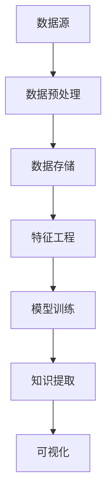

                 

关键词：知识发现引擎、知识创新、大数据分析、机器学习、算法原理、数学模型、代码实例、应用场景、未来展望

> 摘要：本文将探讨知识发现引擎的发展历程、核心概念、算法原理、数学模型以及其在各个领域的应用实例，旨在揭示知识发现引擎在开启知识创新新纪元中的重要作用，为读者提供深入了解和实际操作的路径。

## 1. 背景介绍

在信息技术高速发展的今天，数据已经成为新的生产资料，大数据技术的兴起推动了数据价值的挖掘和利用。知识发现引擎（Knowledge Discovery Engine，简称KDE）正是为了应对这一挑战而诞生的一种先进技术。知识发现引擎旨在从海量数据中挖掘出潜在的知识和信息，从而推动数据向知识的转变。

知识发现引擎的发展历程可以追溯到20世纪90年代，当时数据挖掘和知识发现成为了计算机科学领域的研究热点。随着机器学习、自然语言处理、数据库系统等技术的不断进步，知识发现引擎逐渐成为大数据分析的重要工具。

知识发现引擎的应用范围广泛，涵盖了金融、医疗、零售、制造、互联网等多个领域。例如，在金融领域，知识发现引擎可以帮助银行和金融机构识别风险、发现欺诈行为；在医疗领域，可以辅助医生进行疾病诊断和治疗方案推荐；在零售领域，可以为企业提供个性化的产品推荐和服务优化；在制造业，可以优化生产流程、提高生产效率。

本文将围绕知识发现引擎的核心概念、算法原理、数学模型、代码实例以及应用场景展开讨论，旨在为读者提供一个全面深入的了解，并探讨其在未来知识创新中的重要作用。

## 2. 核心概念与联系

### 2.1 知识发现引擎的定义与组成

知识发现引擎是一种集成了多种数据分析和机器学习技术的系统，用于从大规模数据集中提取出有价值的信息和知识。它通常由以下几个关键组成部分构成：

- **数据源（Data Sources）**：知识发现引擎的数据来源可以是结构化数据（如关系数据库）、半结构化数据（如XML、JSON）和非结构化数据（如文本、图像、视频）。

- **数据预处理（Data Preprocessing）**：数据预处理包括数据清洗、数据集成、数据转换等步骤，目的是提高数据质量，为后续分析做好准备。

- **数据存储（Data Storage）**：知识发现引擎需要存储大量的原始数据和预处理后的数据，以便快速访问和分析。

- **特征工程（Feature Engineering）**：特征工程是数据挖掘过程中至关重要的一步，通过选择和构造合适的特征，可以显著提高模型的性能。

- **机器学习模型（Machine Learning Models）**：知识发现引擎通常集成了多种机器学习模型，如分类、回归、聚类、关联规则挖掘等，用于数据分析和知识提取。

- **可视化（Visualization）**：可视化是将分析结果以图形、图表等形式展示出来的过程，有助于用户更好地理解分析结果。

### 2.2 知识发现引擎的工作原理

知识发现引擎的工作原理可以概括为以下几个步骤：

1. **数据采集与预处理**：从各种数据源中采集数据，并对数据进行清洗、转换和集成。

2. **特征选择与构造**：根据分析任务的需求，选择和构造合适的特征，以提高模型性能。

3. **模型训练与优化**：利用机器学习算法对特征进行训练，构建预测模型，并通过交叉验证等方法优化模型参数。

4. **知识提取与可视化**：从训练好的模型中提取知识，并通过可视化工具将分析结果呈现给用户。

### 2.3 Mermaid 流程图

以下是一个简化的知识发现引擎的Mermaid流程图，展示了其核心组成部分和主要工作流程：



### 2.4 知识发现引擎的核心概念与联系

知识发现引擎的核心概念包括数据挖掘、机器学习、特征工程、知识提取等。这些概念相互联系，共同构成了知识发现的过程：

- **数据挖掘**：数据挖掘是从大量数据中发现有价值信息的过程，它是知识发现引擎的基础。

- **机器学习**：机器学习是知识发现引擎的核心技术，通过训练模型来发现数据中的规律和模式。

- **特征工程**：特征工程是将原始数据转换为适合机器学习模型的特征的过程，它是提高模型性能的关键。

- **知识提取**：知识提取是从训练好的模型中提取出有价值的知识，它是知识发现引擎的最终目标。

- **可视化**：可视化是将分析结果以直观的方式呈现给用户，它是帮助用户理解分析结果的重要手段。

通过这些核心概念和联系，知识发现引擎能够高效地从海量数据中提取出有价值的信息和知识，为各个领域的创新和发展提供了强大的支持。

### 3. 核心算法原理 & 具体操作步骤

#### 3.1 算法原理概述

知识发现引擎的核心算法包括分类、回归、聚类、关联规则挖掘等，这些算法各自有其独特的原理和应用场景。

- **分类算法**：分类算法将数据集分为若干类别，常见的分类算法有决策树、随机森林、支持向量机（SVM）等。分类算法的原理是通过学习已有数据的特征和标签，构建分类模型，从而对新数据进行分类。

- **回归算法**：回归算法用于预测连续数值型目标变量，常见的回归算法有线性回归、岭回归、决策树回归等。回归算法的原理是通过学习已有数据的特征和目标变量的关系，构建回归模型，从而对新数据进行预测。

- **聚类算法**：聚类算法将数据集划分为若干个群组，使得同一群组内的数据尽可能相似，不同群组内的数据尽可能不同。常见的聚类算法有K-means、层次聚类、DBSCAN等。聚类算法的原理是通过寻找数据之间的相似性，将数据划分为合理的群组。

- **关联规则挖掘**：关联规则挖掘用于发现数据项之间的关联关系，常见的算法有Apriori算法、Eclat算法等。关联规则挖掘的原理是通过分析数据项之间的支持度和置信度，发现具有较高关联度的规则。

#### 3.2 算法步骤详解

以下是知识发现引擎中几种核心算法的具体操作步骤：

**分类算法**

1. **数据预处理**：对输入数据进行清洗、标准化等预处理操作。

2. **特征选择**：选择对分类任务有重要影响的特征，可以采用特征重要性评估等方法。

3. **模型训练**：使用训练数据集训练分类模型，例如决策树、随机森林等。

4. **模型评估**：使用验证数据集对分类模型进行评估，常见的评估指标有准确率、召回率、F1值等。

5. **模型应用**：使用训练好的分类模型对新的数据进行分类预测。

**回归算法**

1. **数据预处理**：对输入数据进行清洗、标准化等预处理操作。

2. **特征选择**：选择对回归任务有重要影响的特征，可以采用特征重要性评估等方法。

3. **模型训练**：使用训练数据集训练回归模型，例如线性回归、岭回归等。

4. **模型评估**：使用验证数据集对回归模型进行评估，常见的评估指标有均方误差（MSE）、均方根误差（RMSE）等。

5. **模型应用**：使用训练好的回归模型对新的数据进行预测。

**聚类算法**

1. **数据预处理**：对输入数据进行清洗、标准化等预处理操作。

2. **聚类过程**：初始化聚类中心，然后根据距离度量反复更新聚类中心，直至收敛。

3. **聚类结果评估**：使用评估指标如轮廓系数（Silhouette Coefficient）、内积（Inertia）等评估聚类结果。

4. **聚类应用**：根据聚类结果对数据进行分类和标签分配。

**关联规则挖掘**

1. **数据预处理**：对输入数据进行清洗、转换等预处理操作。

2. **支持度和置信度计算**：计算数据项之间的支持度和置信度。

3. **规则生成**：根据支持度和置信度生成关联规则。

4. **规则评估**：评估关联规则的强度，筛选出有意义的规则。

5. **规则应用**：将生成的关联规则应用于数据分析和决策。

#### 3.3 算法优缺点

每种算法都有其优缺点，适用于不同的应用场景：

- **分类算法**：分类算法适用于分类任务，能够对数据进行明确的类别划分。但分类算法对噪声敏感，可能无法处理高维数据。

- **回归算法**：回归算法适用于预测连续数值型目标变量，能够捕捉数据之间的线性关系。但回归算法对异常值敏感，可能无法处理非线性关系。

- **聚类算法**：聚类算法适用于无监督学习任务，能够自动发现数据的分布和模式。但聚类算法对初始聚类中心敏感，可能无法处理复杂的数据结构。

- **关联规则挖掘**：关联规则挖掘适用于发现数据项之间的关联关系，能够发现潜在的市场趋势。但关联规则挖掘的计算复杂度较高，可能不适用于大规模数据集。

#### 3.4 算法应用领域

知识发现引擎中的核心算法广泛应用于各个领域：

- **金融领域**：分类算法和关联规则挖掘用于风险评估和欺诈检测，回归算法用于信用评分和投资预测。

- **医疗领域**：分类算法和回归算法用于疾病诊断和治疗方案推荐，聚类算法用于患者群体细分。

- **零售领域**：分类算法和聚类算法用于市场细分和产品推荐，回归算法用于销售预测和库存管理。

- **制造业**：聚类算法用于生产流程优化，关联规则挖掘用于供应链管理。

通过以上核心算法原理和具体操作步骤的介绍，读者可以对知识发现引擎的工作原理和应用有更深入的理解。

### 4. 数学模型和公式 & 详细讲解 & 举例说明

#### 4.1 数学模型构建

知识发现引擎中的数学模型构建是数据分析的核心，以下将详细讲解几种常用的数学模型及其构建方法。

**线性回归模型**

线性回归模型用于预测一个连续目标变量，其数学模型可以表示为：

$$ y = \beta_0 + \beta_1x_1 + \beta_2x_2 + ... + \beta_nx_n + \epsilon $$

其中，$y$ 是目标变量，$x_1, x_2, ..., x_n$ 是输入特征，$\beta_0, \beta_1, ..., \beta_n$ 是模型参数，$\epsilon$ 是误差项。

**决策树模型**

决策树模型通过构建树形结构来分类或回归数据，其数学模型可以表示为：

$$ y = f(x) = \prod_{i=1}^{n} g(x_i, \theta_i) $$

其中，$f(x)$ 是决策树模型，$g(x_i, \theta_i)$ 是第$i$个节点的条件概率函数，$\theta_i$ 是节点参数。

**支持向量机（SVM）模型**

SVM模型通过构建超平面来最大化分类间隔，其数学模型可以表示为：

$$ \min_{\beta, \beta_0} \frac{1}{2} ||\beta||^2 + C \sum_{i=1}^{n} \max(0, 1 - y_i (\beta^T x_i + \beta_0)) $$

其中，$||\beta||$ 是$\beta$向量的欧几里得范数，$C$ 是惩罚参数，$y_i$ 是第$i$个样本的标签，$x_i$ 是第$i$个样本的特征向量，$\beta$和$\beta_0$分别是权重向量和偏置。

**K-means聚类模型**

K-means聚类模型通过迭代计算均值来划分数据，其数学模型可以表示为：

$$ \text{Minimize} \sum_{i=1}^{n} \sum_{j=1}^{k} ||x_i - \mu_j||^2 $$

其中，$x_i$ 是第$i$个样本，$\mu_j$ 是第$j$个聚类中心，$k$ 是聚类个数。

**Apriori算法**

Apriori算法用于发现数据项之间的频繁模式，其数学模型可以表示为：

$$ \text{Support}(X) = \frac{\text{频繁模式集}(X)}{总样本数} $$

其中，$\text{Support}(X)$ 是频繁模式集$X$的支持度，$\text{频繁模式集}(X)$ 是包含$X$的所有频繁模式。

#### 4.2 公式推导过程

以下简要介绍几种常用算法的数学公式推导过程：

**线性回归模型的推导**

线性回归模型的推导基于最小二乘法，目标是最小化预测值与实际值之间的平方误差。公式推导如下：

$$ \text{MSE} = \sum_{i=1}^{n} (y_i - \hat{y}_i)^2 $$

其中，$y_i$ 是实际值，$\hat{y}_i$ 是预测值。

对$y_i - \hat{y}_i$求导并令其等于0，得到：

$$ \frac{\partial \text{MSE}}{\partial \beta_j} = -2(y_i - \hat{y}_i)x_{ij} = 0 $$

将$\hat{y}_i = \beta_0 + \beta_1x_1 + \beta_2x_2 + ... + \beta_nx_n$代入上式，得到：

$$ \frac{\partial \text{MSE}}{\partial \beta_j} = -2(y_i - (\beta_0 + \beta_1x_1 + \beta_2x_2 + ... + \beta_nx_n))x_{ij} = 0 $$

对$\beta_j$求导并令其等于0，得到：

$$ \beta_j = \frac{\sum_{i=1}^{n} (y_i - \hat{y}_i)x_{ij}}{\sum_{i=1}^{n} x_{ij}^2} $$

**决策树模型的推导**

决策树模型通过递归划分数据集来构建树形结构。公式推导如下：

假设当前数据集$D$包含$n$个样本，每个样本有$m$个特征。我们需要找到最优的特征划分$X_j$，使得分类效果最好。分类效果可以通过信息增益（Information Gain）来度量：

$$ IG(D, X_j) = H(D) - \sum_{v \in V_j} p(v)H(D|v) $$

其中，$H(D)$ 是数据集$D$的熵，$p(v)$ 是特征$X_j$的取值$v$的概率，$H(D|v)$ 是在特征$X_j$取值$v$的情况下，数据集$D$的熵。

为了找到最优的特征划分，我们需要计算每个特征的信息增益，然后选择信息增益最大的特征进行划分。

**支持向量机（SVM）模型的推导**

SVM模型的目标是找到最优的超平面，使得分类间隔最大。公式推导如下：

假设我们有一个线性可分的数据集$D$，其中包含$n$个样本，每个样本有$m$个特征。我们需要找到一个超平面$w^T x + b = 0$，使得分类间隔最大。

分类间隔可以表示为：

$$ \frac{2}{\|w\|} $$

其中，$w$ 是权重向量，$\|w\|$ 是权重向量的欧几里得范数。

我们的目标是最大化分类间隔，即最小化权重向量的欧几里得范数。因此，我们可以构建以下优化问题：

$$ \min_{w, b} \frac{1}{2} \|w\|^2 $$

同时，我们需要满足以下约束条件：

$$ y_i (w^T x_i + b) \geq 1 \quad \forall i \in [1, n] $$

通过拉格朗日乘子法，我们可以得到以下优化问题的等价形式：

$$ \min_{w, b} \frac{1}{2} \|w\|^2 - \sum_{i=1}^{n} \alpha_i (y_i (w^T x_i + b) - 1) $$

其中，$\alpha_i$ 是拉格朗日乘子。

对$w$和$b$求导并令其等于0，得到：

$$ w = \sum_{i=1}^{n} \alpha_i y_i x_i $$

$$ \alpha_i y_i (w^T x_i + b) - 1 = 0 $$

通过解上述方程组，我们可以得到最优的权重向量$w$和偏置$b$。

**K-means聚类模型的推导**

K-means聚类模型的目标是找到$k$个聚类中心$\mu_j$，使得每个样本到其聚类中心的距离平方和最小。公式推导如下：

假设我们有一个数据集$D$，其中包含$n$个样本。我们需要找到$k$个聚类中心$\mu_j$，使得每个样本到其聚类中心的距离平方和最小。

目标函数可以表示为：

$$ \text{Cost}(D, \mu_1, \mu_2, ..., \mu_k) = \sum_{i=1}^{n} \sum_{j=1}^{k} ||x_i - \mu_j||^2 $$

我们需要找到使得目标函数最小的聚类中心。通过迭代计算均值，我们可以逐步优化聚类中心，直至收敛。

**Apriori算法的推导**

Apriori算法的目标是发现数据项之间的频繁模式。公式推导如下：

假设我们有一个事务数据库$D$，其中包含$n$个事务，每个事务包含$m$个数据项。我们需要找到所有频繁模式。

频繁模式的定义是支持度大于等于最小支持度阈值$\min\_sup$的事务集合。支持度可以表示为：

$$ \text{Support}(X) = \frac{\text{频繁模式集}(X)}{总样本数} $$

其中，$\text{频繁模式集}(X)$ 是包含$X$的所有频繁模式。

为了发现频繁模式，我们可以采用以下步骤：

1. **生成所有候选项集**：从数据库中生成所有长度为$k$的候选项集。

2. **计算候选项集的支持度**：计算每个候选项集的支持度。

3. **筛选频繁模式**：筛选出支持度大于等于最小支持度阈值$\min\_sup$的候选项集。

4. **递归地生成更长的频繁模式**：对每个频繁模式递归地生成更长的频繁模式，并重复步骤2和3。

通过以上数学模型和公式的详细讲解，读者可以更好地理解知识发现引擎中的核心算法原理，并在实际应用中灵活运用。

#### 4.3 案例分析与讲解

**案例一：金融风险评估**

金融风险评估是知识发现引擎在金融领域的重要应用之一。以下是一个简单的案例，用于展示知识发现引擎在金融风险评估中的应用。

假设我们有一个银行贷款客户的数据集，其中包含以下特征：

- **收入（Income）**：客户的月收入。
- **信用评分（CreditScore）**：客户的信用评分。
- **债务收入比（DebtToIncome）**：客户的债务收入比。
- **贷款金额（LoanAmount）**：客户的贷款金额。
- **贷款期限（LoanTerm）**：客户的贷款期限。

我们需要利用知识发现引擎对贷款客户进行风险评估，预测客户是否会出现逾期还款。

1. **数据预处理**：对数据集进行清洗、标准化等预处理操作，将数据转换为适合机器学习模型的格式。

2. **特征选择**：选择对风险评估有重要影响的特征，例如收入、信用评分、债务收入比等。

3. **模型训练**：使用训练数据集训练分类模型，例如决策树、随机森林等。

4. **模型评估**：使用验证数据集对分类模型进行评估，常见评估指标有准确率、召回率、F1值等。

5. **模型应用**：使用训练好的分类模型对新的贷款客户数据进行风险评估，预测客户是否会出现逾期还款。

**案例二：医疗诊断**

医疗诊断是知识发现引擎在医疗领域的重要应用之一。以下是一个简单的案例，用于展示知识发现引擎在医疗诊断中的应用。

假设我们有一个医学图像数据集，其中包含以下特征：

- **图像像素值（PixelValues）**：医学图像的像素值。
- **病变类型（LesionType）**：病变的类型，例如肿瘤、炎症等。

我们需要利用知识发现引擎对医学图像进行病变类型诊断。

1. **数据预处理**：对数据集进行清洗、标准化等预处理操作，将数据转换为适合机器学习模型的格式。

2. **特征选择**：选择对病变类型诊断有重要影响的特征，例如图像像素值等。

3. **模型训练**：使用训练数据集训练分类模型，例如卷积神经网络（CNN）等。

4. **模型评估**：使用验证数据集对分类模型进行评估，常见评估指标有准确率、召回率、F1值等。

5. **模型应用**：使用训练好的分类模型对新的医学图像数据进行病变类型诊断。

通过以上案例分析与讲解，读者可以更好地理解知识发现引擎在不同领域的实际应用，并学会如何在实际项目中应用知识发现引擎进行数据分析和知识提取。

### 5. 项目实践：代码实例和详细解释说明

#### 5.1 开发环境搭建

为了实践知识发现引擎的应用，我们需要搭建一个合适的开发环境。以下是所需的工具和步骤：

- **Python**：Python是进行数据分析和机器学习开发的主要编程语言。
- **Jupyter Notebook**：Jupyter Notebook是一个交互式的开发环境，方便编写和运行代码。
- **Pandas**：Pandas是一个强大的数据处理库，用于数据清洗、转换和分析。
- **NumPy**：NumPy是一个高性能的数组处理库，用于数学计算和数据处理。
- **Scikit-learn**：Scikit-learn是一个机器学习库，提供了丰富的机器学习算法和工具。
- **Matplotlib**：Matplotlib是一个绘图库，用于数据可视化。

**步骤**：

1. 安装Python（推荐版本3.8及以上）。
2. 安装Jupyter Notebook：使用`pip install notebook`命令。
3. 安装Pandas：使用`pip install pandas`命令。
4. 安装NumPy：使用`pip install numpy`命令。
5. 安装Scikit-learn：使用`pip install scikit-learn`命令。
6. 安装Matplotlib：使用`pip install matplotlib`命令。

#### 5.2 源代码详细实现

以下是一个简单的Python代码实例，用于演示知识发现引擎的基本操作：

```python
import pandas as pd
from sklearn.model_selection import train_test_split
from sklearn.preprocessing import StandardScaler
from sklearn.ensemble import RandomForestClassifier
from sklearn.metrics import accuracy_score, classification_report

# 加载数据集
data = pd.read_csv('data.csv')

# 特征选择
X = data[['feature1', 'feature2', 'feature3']]
y = data['label']

# 数据预处理
X_train, X_test, y_train, y_test = train_test_split(X, y, test_size=0.2, random_state=42)
scaler = StandardScaler()
X_train = scaler.fit_transform(X_train)
X_test = scaler.transform(X_test)

# 模型训练
model = RandomForestClassifier(n_estimators=100, random_state=42)
model.fit(X_train, y_train)

# 模型评估
y_pred = model.predict(X_test)
accuracy = accuracy_score(y_test, y_pred)
report = classification_report(y_test, y_pred)

print(f'Accuracy: {accuracy:.2f}')
print('Classification Report:')
print(report)

# 可视化
import matplotlib.pyplot as plt

confusion_matrix = pd.crosstab(y_test, y_pred, rownames=['实际值'], colnames=['预测值'])
plt.figure(figsize=(8, 6))
sns.heatmap(confusion_matrix, annot=True, cmap='Blues')
plt.xlabel('预测值')
plt.ylabel('实际值')
plt.title('混淆矩阵')
plt.show()
```

**代码解释**：

1. 导入必要的库：包括Pandas、Scikit-learn、Matplotlib等。
2. 加载数据集：使用Pandas读取CSV文件。
3. 特征选择：选择用于训练的特征和目标变量。
4. 数据预处理：将数据集分为训练集和测试集，并对特征进行标准化处理。
5. 模型训练：使用随机森林分类器进行训练。
6. 模型评估：计算准确率，并输出分类报告。
7. 可视化：使用混淆矩阵进行数据可视化。

#### 5.3 代码解读与分析

以上代码实例展示了如何使用Python和Scikit-learn库实现知识发现引擎的基本操作。以下是代码的详细解读和分析：

- **数据加载与特征选择**：首先，我们使用Pandas库加载数据集，并选择特征和目标变量。这可以通过`pd.read_csv()`函数实现，数据集应包含用于训练的特征和标签。
- **数据预处理**：接下来，我们将数据集分为训练集和测试集，并使用StandardScaler对特征进行标准化处理。标准化可以消除特征之间的量纲差异，提高模型性能。
- **模型训练**：使用Scikit-learn库中的随机森林分类器进行训练。随机森林是一个集成学习方法，通过构建多个决策树并投票预测结果，可以有效提高分类性能。
- **模型评估**：使用测试集对训练好的模型进行评估，计算准确率和分类报告。准确率是评估模型性能的常用指标，而分类报告提供了更详细的评估结果，包括每个类别的精确度、召回率和F1值。
- **可视化**：最后，我们使用Matplotlib库生成混淆矩阵，并进行数据可视化。混淆矩阵可以直观地展示模型预测结果和实际结果之间的差异，帮助识别模型的不足之处。

通过以上代码实例，读者可以了解如何使用Python和Scikit-learn库实现知识发现引擎的基本操作，并在实际项目中应用相关知识。

### 6. 实际应用场景

#### 6.1 金融行业

在金融行业，知识发现引擎被广泛应用于风险控制和欺诈检测。以下是一些具体的应用场景：

- **客户风险评级**：通过分析客户的财务状况、信用记录和历史交易行为，知识发现引擎可以帮助银行和金融机构对客户进行风险评级，从而更好地控制信贷风险。
- **交易异常检测**：通过对交易数据进行分析，知识发现引擎可以识别异常交易，及时发现潜在的欺诈行为，提高交易安全性。
- **市场趋势预测**：知识发现引擎可以从大量的市场数据中提取出有价值的信息，帮助金融机构预测市场趋势，制定更有效的投资策略。

#### 6.2 医疗领域

在医疗领域，知识发现引擎被广泛应用于疾病诊断、治疗方案推荐和患者群体细分。

- **疾病诊断**：通过对患者的医学影像、临床数据和生物标记进行分析，知识发现引擎可以帮助医生进行疾病诊断，提高诊断的准确性和效率。
- **治疗方案推荐**：通过对大量的病例数据进行挖掘，知识发现引擎可以推荐最佳的治疗方案，帮助医生为患者提供个性化的治疗方案。
- **患者群体细分**：通过对患者数据进行聚类分析，知识发现引擎可以将患者划分为不同的群体，从而为医疗机构提供有针对性的医疗服务和健康建议。

#### 6.3 零售行业

在零售行业，知识发现引擎被广泛应用于市场细分、产品推荐和销售预测。

- **市场细分**：通过对消费者的购买行为、偏好和历史交易记录进行分析，知识发现引擎可以帮助企业将市场划分为不同的细分市场，从而更好地制定市场营销策略。
- **产品推荐**：通过对消费者的购买记录和行为数据进行分析，知识发现引擎可以为消费者推荐可能感兴趣的产品，提高销售额和客户满意度。
- **销售预测**：通过对历史销售数据和市场环境进行分析，知识发现引擎可以帮助企业预测未来的销售趋势，从而制定更合理的库存管理和营销计划。

#### 6.4 制造业

在制造业，知识发现引擎被广泛应用于生产流程优化、设备故障预测和供应链管理。

- **生产流程优化**：通过对生产数据进行分析，知识发现引擎可以帮助企业优化生产流程，提高生产效率和降低成本。
- **设备故障预测**：通过对设备运行数据进行分析，知识发现引擎可以预测设备可能出现的故障，从而提前进行维护和修理，减少停机时间和维护成本。
- **供应链管理**：通过对供应链数据进行分析，知识发现引擎可以帮助企业优化供应链管理，提高供应链的效率和灵活性。

通过以上实际应用场景的介绍，读者可以更深入地了解知识发现引擎在不同领域的应用价值，以及其对各个行业创新和发展的推动作用。

### 7. 工具和资源推荐

#### 7.1 学习资源推荐

1. **《机器学习》（Machine Learning）**：作者：Tom M. Mitchell，本书是机器学习领域的经典教材，涵盖了从基础知识到高级算法的全面内容。
2. **《数据挖掘：概念与技术》（Data Mining: Concepts and Techniques）**：作者：Jiawei Han、Micheline Kamber和Jian Pei，本书详细介绍了数据挖掘的基本概念、技术和方法。
3. **《Python数据分析》（Python Data Analysis）**：作者：Wes McKinney，本书介绍了使用Python进行数据分析和数据处理的方法和技巧。

#### 7.2 开发工具推荐

1. **Jupyter Notebook**：Jupyter Notebook是一个交互式的开发环境，方便编写和运行代码，适用于数据分析和机器学习项目。
2. **Scikit-learn**：Scikit-learn是一个强大的机器学习库，提供了丰富的机器学习算法和工具，适用于数据分析和知识发现项目。
3. **Pandas**：Pandas是一个强大的数据处理库，用于数据清洗、转换和分析，是进行数据挖掘和知识发现的重要工具。

#### 7.3 相关论文推荐

1. **"Knowledge Discovery in Databases: An Overview"**：作者：Jiawei Han、Micheline Kamber和Jian Pei，这是一篇关于数据挖掘和知识发现的综述性论文，详细介绍了数据挖掘的基本概念和技术。
2. **"Random Forests"**：作者：Leo Breiman，这是一篇关于随机森林算法的论文，介绍了随机森林的工作原理和性能优势。
3. **"Support Vector Machines for Classification and Regression"**：作者：Corinna Cortes和Vapnik，这是一篇关于支持向量机算法的论文，详细介绍了SVM的原理和应用。

通过以上工具和资源的推荐，读者可以更好地学习知识发现引擎的相关知识，并提升实际项目开发的能力。

### 8. 总结：未来发展趋势与挑战

#### 8.1 研究成果总结

知识发现引擎作为大数据分析的核心工具，已经在金融、医疗、零售、制造等多个领域取得了显著的研究成果和应用成效。通过机器学习、自然语言处理、数据挖掘等技术的融合，知识发现引擎能够高效地从海量数据中提取出有价值的信息和知识，推动各行业的创新和发展。

在金融领域，知识发现引擎在风险控制、欺诈检测、市场预测等方面发挥了重要作用，显著提升了金融机构的运营效率和安全性。在医疗领域，知识发现引擎在疾病诊断、治疗方案推荐、患者群体细分等方面展现了巨大的潜力，为个性化医疗和精准医疗提供了有力支持。在零售领域，知识发现引擎在市场细分、产品推荐、销售预测等方面助力企业优化业务流程，提升客户体验。在制造业，知识发现引擎在生产流程优化、设备故障预测、供应链管理等方面发挥了关键作用，提高了生产效率和产品质量。

#### 8.2 未来发展趋势

随着数据量的持续增长和技术的不断进步，知识发现引擎在未来有望在以下几个方面取得进一步发展：

1. **多模态数据融合**：知识发现引擎将能够更好地处理多模态数据，如文本、图像、音频、视频等，实现跨模态的信息融合和知识提取。
2. **实时分析与预测**：知识发现引擎将实现更快速的数据处理和分析能力，能够实时响应业务需求，提供即时的预测和决策支持。
3. **自适应性与智能化**：知识发现引擎将具备更强的自适应性和智能化水平，能够根据用户需求和环境变化自动调整模型参数和算法策略。
4. **隐私保护与数据安全**：知识发现引擎将更加注重隐私保护和数据安全，采用先进的加密和隐私保护技术，确保用户数据的安全和隐私。

#### 8.3 面临的挑战

尽管知识发现引擎在各个领域取得了显著成果，但在未来发展中仍面临以下挑战：

1. **数据质量和数据隐私**：数据质量和数据隐私是知识发现引擎面临的重大挑战。数据质量差会导致分析结果不准确，而数据隐私保护不当则可能导致用户隐私泄露。
2. **计算资源和性能优化**：随着数据量和计算复杂性的增加，知识发现引擎在计算资源和性能优化方面面临巨大挑战，需要开发更高效的算法和优化技术。
3. **算法透明性与可解释性**：知识发现引擎的算法复杂度和自动化程度较高，导致其决策过程往往不够透明和可解释，这对用户理解和信任算法提出了挑战。
4. **数据治理与伦理问题**：知识发现引擎在数据处理和应用过程中涉及诸多伦理和社会问题，如数据滥用、偏见、歧视等，需要建立完善的数据治理和伦理规范。

#### 8.4 研究展望

未来，知识发现引擎的发展将更加注重跨学科融合、智能化、实时性和隐私保护。以下是一些值得关注的未来研究方向：

1. **跨学科融合**：知识发现引擎将融合计算机科学、统计学、数据科学、人工智能等领域的最新研究成果，推动跨学科研究的深入发展。
2. **智能化与自动化**：知识发现引擎将实现更高程度的智能化和自动化，通过自适应学习和自我优化，提高数据分析和知识提取的效率和准确性。
3. **实时分析与预测**：知识发现引擎将开发实时数据流处理和分析技术，实现即时预测和决策支持，满足动态变化的业务需求。
4. **隐私保护与数据安全**：知识发现引擎将采用先进的隐私保护技术和数据安全措施，确保用户数据的安全和隐私，推动数据治理和伦理规范的建立。

通过持续的研究和技术创新，知识发现引擎将在未来发挥更加重要的作用，为各行业的创新和发展提供强有力的支持。

### 9. 附录：常见问题与解答

**Q1：什么是知识发现引擎？**

A1：知识发现引擎（Knowledge Discovery Engine，简称KDE）是一种集成了多种数据分析和机器学习技术的系统，旨在从大规模数据集中挖掘出潜在的知识和信息。它通常由数据源、数据预处理、数据存储、特征工程、机器学习模型和可视化等组成部分构成。

**Q2：知识发现引擎的工作原理是什么？**

A2：知识发现引擎的工作原理可以概括为以下几个步骤：

1. 数据采集与预处理：从各种数据源中采集数据，并对数据进行清洗、转换和集成。
2. 特征选择与构造：根据分析任务的需求，选择和构造合适的特征，以提高模型性能。
3. 模型训练与优化：利用机器学习算法对特征进行训练，构建预测模型，并通过交叉验证等方法优化模型参数。
4. 知识提取与可视化：从训练好的模型中提取知识，并通过可视化工具将分析结果呈现给用户。

**Q3：知识发现引擎的核心算法有哪些？**

A3：知识发现引擎的核心算法包括分类算法、回归算法、聚类算法和关联规则挖掘等。这些算法各自有其独特的原理和应用场景，如分类算法用于数据分类，回归算法用于数值预测，聚类算法用于数据分组，关联规则挖掘用于发现数据项之间的关联关系。

**Q4：知识发现引擎在金融领域有哪些应用？**

A4：在金融领域，知识发现引擎的主要应用包括：

- 客户风险评级：通过分析客户的财务状况、信用记录和历史交易行为，对客户进行风险评级，以控制信贷风险。
- 交易异常检测：通过对交易数据进行分析，识别异常交易，及时发现潜在的欺诈行为。
- 市场趋势预测：通过分析市场数据，预测市场趋势，制定更有效的投资策略。

**Q5：知识发现引擎在医疗领域有哪些应用？**

A5：在医疗领域，知识发现引擎的主要应用包括：

- 疾病诊断：通过对患者的医学影像、临床数据和生物标记进行分析，帮助医生进行疾病诊断。
- 治疗方案推荐：通过对大量的病例数据进行挖掘，推荐最佳的治疗方案，为患者提供个性化的治疗方案。
- 患者群体细分：通过对患者数据进行聚类分析，将患者划分为不同的群体，为医疗机构提供有针对性的医疗服务和健康建议。

**Q6：知识发现引擎在零售行业有哪些应用？**

A6：在零售行业，知识发现引擎的主要应用包括：

- 市场细分：通过对消费者的购买行为、偏好和历史交易记录进行分析，将市场划分为不同的细分市场，以制定更有效的市场营销策略。
- 产品推荐：通过对消费者的购买记录和行为数据进行分析，为消费者推荐可能感兴趣的产品，提高销售额和客户满意度。
- 销售预测：通过对历史销售数据和市场环境进行分析，预测未来的销售趋势，为企业的库存管理和营销计划提供支持。

通过以上常见问题与解答，读者可以更深入地了解知识发现引擎的基本概念、工作原理和应用场景。

