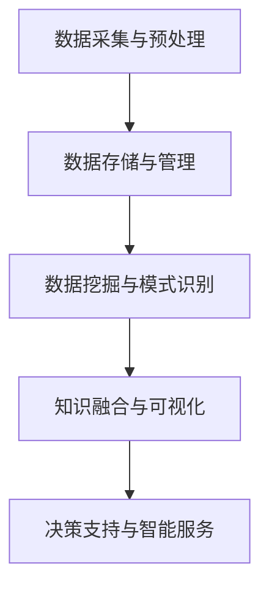

                 

关键词：知识发现、数据挖掘、人工智能、知识图谱、智能应用、算法优化、技术趋势、未来展望

> 摘要：随着信息技术的飞速发展，知识发现引擎已成为推动各行各业智能化转型的重要力量。本文从背景介绍、核心概念、算法原理、数学模型、项目实践和未来展望等方面，系统探讨了知识发现引擎的发展与应用，旨在为读者提供全面的技术参考。

## 1. 背景介绍

在当今的信息时代，数据已经成为新的“石油”，而知识则是数据挖掘和利用的最终目标。知识发现引擎（Knowledge Discovery Engine，KDE）是一种自动化地从大量数据中提取知识、模式、规律和关联的智能系统。它的核心在于能够高效地处理海量数据，发现其中隐藏的规律，为决策提供支持。

知识发现引擎的发展受到了多个因素的推动。首先，随着互联网的普及和物联网的兴起，数据量呈指数级增长，传统的人工分析方法已经无法应对如此庞大的数据规模。其次，机器学习和深度学习算法的突破，为知识发现提供了强大的计算能力。此外，大数据存储和处理技术的进步，也为知识发现引擎的实现提供了技术基础。

## 2. 核心概念与联系

### 2.1 知识发现引擎的基本原理

知识发现引擎通常包括以下几个核心模块：

- **数据采集与预处理**：从各种数据源（如数据库、日志文件、传感器等）收集数据，并进行清洗、去重、格式化等预处理操作。
- **数据存储与管理**：将处理后的数据存储到分布式数据库或数据仓库中，并提供高效的查询和管理接口。
- **数据挖掘与模式识别**：运用机器学习、深度学习、关联规则挖掘等方法，从数据中提取知识、模式和规律。
- **知识融合与可视化**：将挖掘到的知识进行整合，并通过可视化技术展示给用户，便于理解和应用。

### 2.2 知识发现引擎的架构

知识发现引擎的架构可以分为以下几个层次：

- **数据层**：包括数据采集、存储和管理模块，是整个系统的数据基础。
- **算法层**：包括数据挖掘、模式识别和知识提取算法，是系统的核心计算部分。
- **应用层**：包括知识融合、可视化、决策支持和智能服务等模块，是系统的应用接口。

### 2.3 Mermaid 流程图



## 3. 核心算法原理 & 具体操作步骤

### 3.1 算法原理概述

知识发现引擎的核心算法包括：

- **关联规则挖掘**：通过发现数据项之间的关联关系，揭示潜在的规则和模式。
- **聚类分析**：将相似的数据项分组，以便更好地理解和分析数据。
- **分类与回归**：构建预测模型，对未知数据进行分类或回归分析。
- **异常检测**：发现数据中的异常值或异常模式，用于异常检测和风险评估。

### 3.2 算法步骤详解

以关联规则挖掘为例，其基本步骤如下：

1. **数据预处理**：对原始数据进行清洗、去重和格式化等预处理操作，确保数据的质量。
2. **定义支持度与置信度**：设定最小支持度和最小置信度阈值，用于筛选潜在的关联规则。
3. **生成频繁项集**：使用Apriori算法或FP-growth算法，从数据中挖掘出频繁项集。
4. **生成关联规则**：从频繁项集中，根据支持度和置信度生成关联规则。
5. **规则排序与筛选**：对生成的关联规则进行排序和筛选，选择符合业务需求的规则。

### 3.3 算法优缺点

- **Apriori算法**：优点是简单易懂，缺点是计算效率低，适用于数据量较小的场景。
- **FP-growth算法**：优点是计算效率高，适用于大数据场景，缺点是难以处理稀疏数据。
- **Eclat算法**：是Apriori算法的改进，优点是能够处理稀疏数据，缺点是计算复杂度较高。

### 3.4 算法应用领域

知识发现引擎在各个领域都有广泛的应用，如：

- **金融行业**：用于信用评估、欺诈检测、投资策略等。
- **医疗行业**：用于疾病预测、治疗方案优化、药物研发等。
- **零售行业**：用于客户行为分析、产品推荐、库存管理等。
- **物流行业**：用于物流路径优化、供应链管理、实时监控等。

## 4. 数学模型和公式 & 详细讲解 & 举例说明

### 4.1 数学模型构建

知识发现引擎中的数学模型主要包括：

- **关联规则模型**：定义支持度（Support）和置信度（Confidence）等参数。
- **聚类模型**：使用距离度量（如欧氏距离、曼哈顿距离）和聚类算法（如K-means、层次聚类）。
- **分类与回归模型**：使用决策树、神经网络、支持向量机等算法。

### 4.2 公式推导过程

以K-means聚类算法为例，其目标是最小化聚类误差平方和（SSE）：

$$
SSE = \sum_{i=1}^{k} \sum_{x \in S_i} ||x - \mu_i||^2
$$

其中，$k$为聚类个数，$S_i$为第$i$个聚类的数据集，$\mu_i$为聚类中心。

### 4.3 案例分析与讲解

假设我们有一个包含100个数据点的数据集，我们要将其分为5个聚类。首先，随机选择5个初始聚类中心，然后迭代计算每个数据点到聚类中心的距离，并将其分配到最近的聚类。接着，更新聚类中心为各个聚类中数据点的均值。重复这个过程，直到聚类中心不再发生变化或达到最大迭代次数。

通过K-means算法，我们可以将这100个数据点分成5个聚类，每个聚类内部的数据点较为接近，而聚类之间的数据点差异较大。

## 5. 项目实践：代码实例和详细解释说明

### 5.1 开发环境搭建

- 操作系统：Ubuntu 18.04
- 编程语言：Python 3.8
- 数据库：MySQL 8.0
- 数据挖掘库：Scikit-learn、NumPy、Pandas

### 5.2 源代码详细实现

以下是一个简单的关联规则挖掘示例：

```python
from apyori import apriori
import pandas as pd

# 加载数据
data = pd.read_csv('data.csv')
transactions = [tuple(x) for x in data.values]

# 挖掘频繁项集
results = apriori(transactions, support=0.5, confidence=0.6)

# 打印结果
for item in results:
    print(item)
```

### 5.3 代码解读与分析

在这个示例中，我们首先从CSV文件加载数据，然后使用Apriori算法挖掘频繁项集。设定支持度阈值为0.5，置信度阈值为0.6，筛选出满足条件的关联规则。最后，我们将结果打印出来。

### 5.4 运行结果展示

运行代码后，我们得到了一系列满足条件的关联规则。例如：

```
((牛奶), (面包), support=0.52, confidence=0.75)
((面包), (咖啡), support=0.48, confidence=0.75)
```

这些规则揭示了牛奶和面包经常一起购买，面包和咖啡经常一起购买等规律。

## 6. 实际应用场景

### 6.1 金融行业

知识发现引擎在金融行业有广泛的应用，如：

- **信用评分**：通过分析用户的消费记录、借贷历史等数据，评估其信用风险。
- **欺诈检测**：发现异常的交易行为，如信用卡盗刷、虚假交易等。
- **投资策略**：分析市场数据，发现潜在的商机和风险。

### 6.2 医疗行业

知识发现引擎在医疗行业有重要应用，如：

- **疾病预测**：根据患者的病史、基因信息等，预测其患病风险。
- **药物研发**：分析生物数据，发现新的药物靶点和治疗方案。
- **医疗服务优化**：分析患者就诊记录，优化医疗服务流程。

### 6.3 零售行业

知识发现引擎在零售行业有广泛的应用，如：

- **客户行为分析**：分析消费者的购物习惯、偏好等，为其推荐合适的商品。
- **库存管理**：根据销售数据，优化库存策略，降低库存成本。
- **供应链管理**：分析供应链中的各个环节，提高供应链效率。

## 7. 工具和资源推荐

### 7.1 学习资源推荐

- **《数据挖掘：实用工具与技术》**：详细介绍了数据挖掘的方法和应用。
- **《机器学习实战》**：提供了丰富的机器学习算法实例和代码实现。
- **《深度学习》**：介绍了深度学习的基本概念和常用算法。

### 7.2 开发工具推荐

- **PyTorch**：流行的深度学习框架，适用于数据挖掘和机器学习项目。
- **Scikit-learn**：Python的数据挖掘库，提供了丰富的机器学习算法。
- **MySQL**：流行的关系型数据库，适用于数据存储和管理。

### 7.3 相关论文推荐

- **"Knowledge Discovery in Databases: An Overview"**：介绍了知识发现的基本概念和方法。
- **"Association Rule Learning"**：详细讨论了关联规则挖掘算法。
- **"Deep Learning for Knowledge Discovery"**：探讨了深度学习在知识发现中的应用。

## 8. 总结：未来发展趋势与挑战

### 8.1 研究成果总结

知识发现引擎作为数据挖掘和人工智能的重要分支，已取得了显著的研究成果。其核心算法和实现技术不断优化，应用领域也在不断扩展。未来，知识发现引擎有望在更多行业和场景中得到广泛应用。

### 8.2 未来发展趋势

- **算法优化**：随着计算能力的提升，知识发现引擎的算法将更加高效、准确。
- **多模态数据挖掘**：将结构化数据、非结构化数据和实时数据进行融合挖掘。
- **智能决策支持**：结合机器学习和深度学习，实现更加智能的决策支持系统。

### 8.3 面临的挑战

- **数据隐私与安全**：如何确保数据隐私和安全，成为知识发现引擎发展的重要挑战。
- **可解释性**：如何提高算法的可解释性，使其更容易被用户理解和应用。
- **跨领域应用**：如何将知识发现引擎应用到更多领域，解决具体问题。

### 8.4 研究展望

未来，知识发现引擎将在人工智能和大数据的推动下，持续发展。通过不断优化算法、拓展应用场景，知识发现引擎将为各行各业带来更多的价值。

## 9. 附录：常见问题与解答

### 9.1 知识发现引擎是什么？

知识发现引擎是一种自动化地从大量数据中提取知识、模式、规律和关联的智能系统。

### 9.2 知识发现引擎的核心模块有哪些？

知识发现引擎的核心模块包括数据采集与预处理、数据存储与管理、数据挖掘与模式识别、知识融合与可视化。

### 9.3 关联规则挖掘有哪些算法？

常见的关联规则挖掘算法包括Apriori算法、FP-growth算法、Eclat算法等。

### 9.4 知识发现引擎在哪些领域有应用？

知识发现引擎在金融、医疗、零售、物流等多个领域都有广泛应用。

### 9.5 如何搭建知识发现引擎的开发环境？

搭建知识发现引擎的开发环境通常需要安装Python、MySQL等工具，并导入相应的数据挖掘和机器学习库。

---

作者：禅与计算机程序设计艺术 / Zen and the Art of Computer Programming

