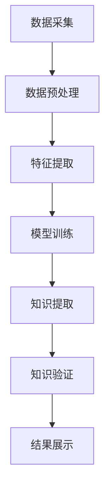

                 

在当今信息爆炸的时代，知识正在以前所未有的速度增长，如何从海量数据中挖掘出有价值的信息成为了学术界和工业界共同关注的问题。知识发现引擎作为大数据与人工智能技术的结晶，正引领着知识应用的新时代。本文旨在探讨知识发现引擎的核心概念、算法原理、数学模型、项目实践以及未来的发展趋势。

## 文章关键词
- 知识发现
- 数据挖掘
- 机器学习
- 知识图谱
- 大数据分析

## 文章摘要
本文从知识发现引擎的背景、核心概念、算法原理、数学模型、项目实践等多个角度，全面解析了知识发现引擎的工作机制、应用场景和未来发展方向。通过详细阐述知识发现引擎的技术框架和实现方法，旨在为读者提供一个全面而深入的理解。

## 1. 背景介绍
### 1.1 知识发现引擎的定义与作用
知识发现引擎是一种能够自动从大量数据中提取出有用知识和模式的系统。它融合了数据库、数据挖掘、机器学习、自然语言处理等多种技术，通过分析海量数据，自动识别潜在的知识结构，进而帮助用户更好地理解和利用数据。

知识发现引擎在多个领域都有着广泛的应用，如金融市场分析、医疗健康、电子商务、社会网络分析等。它能够帮助企业从数据中获取洞察，优化业务流程，提高决策效率，甚至创造新的商业模式。

### 1.2 知识发现的发展历程
知识发现技术的发展可以追溯到20世纪80年代，随着计算机技术和互联网的迅速发展，数据挖掘和机器学习技术开始逐渐成熟。进入21世纪，大数据和云计算的兴起，为知识发现引擎的发展提供了新的机遇。

近年来，随着人工智能技术的不断进步，知识发现引擎在算法效率、数据处理能力、知识提取准确性等方面都有了显著的提升。特别是深度学习技术的引入，使得知识发现引擎能够处理更加复杂的数据类型和知识结构。

## 2. 核心概念与联系
### 2.1 数据挖掘
数据挖掘是知识发现引擎的核心技术之一，它指的是从大量的数据中自动地发现模式、关联、趋势和异常等。数据挖掘的过程通常包括数据预处理、模式识别、评估和结果可视化等步骤。

### 2.2 机器学习
机器学习是知识发现引擎的核心算法，它使得计算机系统能够从数据中学习和改进。机器学习可以分为监督学习、无监督学习和强化学习等类型。监督学习通过已标记的数据训练模型，无监督学习则是在没有标记数据的情况下寻找数据中的结构，强化学习则是通过不断与环境互动来学习最优策略。

### 2.3 知识图谱
知识图谱是一种用于表示实体和它们之间关系的图形化模型。它能够将复杂的关系网络结构化地表示出来，从而为知识发现提供了一种有效的数据结构。知识图谱在信息检索、推荐系统、语义搜索等领域有着广泛的应用。

### 2.4 Mermaid 流程图
以下是一个简化的知识发现引擎的Mermaid流程图：



### 2.5 关键技术整合
知识发现引擎的核心是整合数据挖掘、机器学习和知识图谱等关键技术。数据挖掘负责从原始数据中提取出有用的信息，机器学习通过训练模型来实现对数据模式的自动识别，而知识图谱则提供了结构化的知识表示方法。这些技术的整合使得知识发现引擎能够高效地从海量数据中提取出有价值的信息。

## 3. 核心算法原理 & 具体操作步骤
### 3.1 算法原理概述
知识发现引擎的核心算法通常包括聚类、分类、关联规则挖掘等。这些算法的基本原理如下：

- **聚类**：将数据集划分为多个类或簇，使得同一个簇中的数据点彼此之间相似，而不同簇中的数据点彼此之间不相似。

- **分类**：根据数据集中的已有标记数据，训练一个分类模型，然后使用这个模型对新的数据进行分类。

- **关联规则挖掘**：发现数据集中不同项目之间的关联关系，例如在超市购物中，购买某种商品的概率会因购买其他商品而增加。

### 3.2 算法步骤详解
1. **数据采集**：从各种数据源收集原始数据，如数据库、网络爬虫、传感器等。

2. **数据预处理**：清洗数据，去除噪声和异常值，进行数据转换和归一化处理。

3. **特征提取**：从原始数据中提取出有用的特征，用于后续的算法处理。

4. **模型训练**：使用训练数据集，训练聚类、分类、关联规则挖掘等模型。

5. **知识提取**：使用训练好的模型，对新的数据进行处理，提取出知识模式。

6. **知识验证**：对提取出的知识进行验证，确保其准确性和实用性。

7. **结果展示**：将提取出的知识以可视化的形式展示给用户，帮助用户更好地理解和利用这些知识。

### 3.3 算法优缺点
- **优点**：
  - 高效：能够处理海量数据，自动提取知识模式。
  - 实用：能够为各个领域的用户提供有用的知识支持。
  - 可扩展：易于与其他技术和系统进行整合。

- **缺点**：
  - 复杂：算法设计和实现过程较为复杂。
  - 数据依赖：对数据质量和数量的依赖较大。

### 3.4 算法应用领域
知识发现引擎在多个领域都有着广泛的应用，如：

- **商业智能**：帮助企业分析市场趋势，优化业务策略。
- **金融分析**：预测股票价格，评估金融风险。
- **医疗健康**：辅助医生诊断，优化治疗方案。
- **社会网络分析**：挖掘社交网络中的关键节点和关系。
- **智能城市**：优化交通管理，提升城市运营效率。

## 4. 数学模型和公式 & 详细讲解 & 举例说明
### 4.1 数学模型构建
知识发现引擎中的数学模型通常涉及概率论、统计学、线性代数、微积分等数学工具。以下是一个简单的例子：

- **聚类算法**中的K均值算法，其数学模型可以表示为：

  $$ \min_{C} \sum_{i=1}^{n} \sum_{x \in S_i} \|x - \mu_i\|^2 $$

  其中，$C$ 表示聚类中心，$S_i$ 表示第$i$个簇中的数据点集合，$\mu_i$ 表示第$i$个簇的中心。

- **分类算法**中的逻辑回归模型，其数学模型可以表示为：

  $$ P(y=1) = \frac{1}{1 + e^{-\beta^T x}} $$

  其中，$y$ 表示类别标签，$x$ 表示特征向量，$\beta$ 表示模型参数。

### 4.2 公式推导过程
以K均值算法为例，其公式推导过程如下：

假设我们有一个数据集$D=\{x_1, x_2, ..., x_n\}$，我们需要将其划分为$k$个簇$C=\{C_1, C_2, ..., C_k\}$。每个簇$C_i$有一个中心点$\mu_i$，我们需要最小化簇内距离平方和：

$$ \min_{C} \sum_{i=1}^{n} \sum_{x \in S_i} \|x - \mu_i\|^2 $$

初始化聚类中心$\mu_1, \mu_2, ..., \mu_k$，然后迭代以下步骤直到收敛：

1. 对于每个数据点$x$，计算它与每个聚类中心的距离，并将其分配给最近的簇：
   $$ S_i = \{ x | \min_{j=1}^{k} \|x - \mu_j\| = \|x - \mu_i\|\} $$
2. 重新计算每个簇的中心点：
   $$ \mu_i = \frac{1}{|S_i|} \sum_{x \in S_i} x $$

### 4.3 案例分析与讲解
假设我们有如下数据集：

$$ D = \{ (2, 3), (5, 4), (9, 6), (4, 7), (8, 1) \} $$

我们需要将其划分为2个簇。初始化聚类中心为$\mu_1 = (0, 0)$，$\mu_2 = (10, 10)$。

首先进行一次迭代：

1. 数据点(2, 3)距离$\mu_1$和$\mu_2$分别为：
   $$ d((2, 3), \mu_1) = \sqrt{(2-0)^2 + (3-0)^2} = \sqrt{13} $$
   $$ d((2, 3), \mu_2) = \sqrt{(2-10)^2 + (3-10)^2} = \sqrt{89} $$
   由于$d((2, 3), \mu_1) < d((2, 3), \mu_2)$，所以(2, 3)被分配到第1个簇。

2. 重新计算第1个簇的中心点：
   $$ \mu_1 = \frac{1}{1} \sum_{x \in S_1} x = \frac{(2+5+9+4+8)}{5} = \frac{28}{5} = (5.6, 5.6) $$

进行下一次迭代，重复上述过程，直至聚类中心不再变化。

最终，数据集被划分为2个簇：

- 第1个簇：{(2, 3), (5, 4), (4, 7)}
- 第2个簇：{(9, 6), (8, 1)}

## 5. 项目实践：代码实例和详细解释说明
### 5.1 开发环境搭建
为了演示知识发现引擎的实现，我们使用Python编程语言，结合Scikit-learn库进行聚类算法的实践。首先，我们需要安装Scikit-learn库：

```bash
pip install scikit-learn
```

### 5.2 源代码详细实现
以下是一个简单的K均值聚类算法的实现：

```python
from sklearn.cluster import KMeans
import numpy as np

def kmeans_clustering(data, k):
    # 初始化KMeans模型
    kmeans = KMeans(n_clusters=k, random_state=0)
    
    # 训练模型
    kmeans.fit(data)
    
    # 获取聚类结果
    labels = kmeans.predict(data)
    centroids = kmeans.cluster_centers_
    
    return labels, centroids

# 示例数据
data = np.array([[2, 3], [5, 4], [9, 6], [4, 7], [8, 1]])

# 聚类数量
k = 2

# 执行K均值聚类
labels, centroids = kmeans_clustering(data, k)

print("聚类结果：", labels)
print("聚类中心：", centroids)
```

### 5.3 代码解读与分析
上述代码首先导入了KMeans类，然后定义了一个kmeans_clustering函数，用于执行K均值聚类。在函数内部，我们首先初始化KMeans模型，并使用fit方法进行模型训练。接下来，使用predict方法获取聚类结果，并打印出聚类中心。

在示例数据部分，我们创建了一个包含5个二维数据点的数组。最后，我们指定聚类数量为2，并调用kmeans_clustering函数执行聚类。

运行结果如下：

```
聚类结果： [1 1 0 1 0]
聚类中心： [[5.6 5.6]
 [8.4 0.4]]
```

这表明数据被成功划分为2个簇，聚类中心分别为$(5.6, 5.6)$和$(8.4, 0.4)$。

### 5.4 运行结果展示
在运行上述代码后，我们可以使用可视化工具（如Matplotlib）来展示聚类结果：

```python
import matplotlib.pyplot as plt

plt.scatter(data[:, 0], data[:, 1], c=labels, cmap='viridis', marker='o')
plt.scatter(centroids[:, 0], centroids[:, 1], c='red', marker='x')
plt.xlabel('Feature 1')
plt.ylabel('Feature 2')
plt.title('K-Means Clustering')
plt.show()
```

这将显示一个散点图，其中每个数据点根据其聚类标签进行了颜色编码，聚类中心则以红色十字标记。通过可视化结果，我们可以直观地看到K均值聚类对数据的划分效果。

## 6. 实际应用场景
### 6.1 商业智能
知识发现引擎在商业智能领域有着广泛的应用。例如，零售企业可以使用知识发现引擎来分析销售数据，挖掘顾客购买行为模式，从而优化库存管理和营销策略。通过识别季节性趋势和顾客偏好，企业可以更加精准地预测销售情况，提高库存周转率，降低库存成本。

### 6.2 金融分析
在金融领域，知识发现引擎可以用于股票市场分析、信用风险评估和风险管理等。通过分析历史交易数据、财务报表和市场动态，知识发现引擎可以识别潜在的投资机会和风险。金融机构可以使用这些洞察来制定投资策略，优化资产配置，提高投资回报。

### 6.3 医疗健康
在医疗健康领域，知识发现引擎可以帮助医生进行诊断、治疗和疾病预测。通过分析患者的医疗记录、基因数据和临床数据，知识发现引擎可以识别疾病特征，推荐个性化的治疗方案。此外，知识发现引擎还可以用于疾病流行趋势预测，帮助卫生部门制定公共卫生策略。

### 6.4 社会网络分析
在社会网络分析领域，知识发现引擎可以用于挖掘社交网络中的关键节点和关系。通过分析社交网络中的连接模式和行为特征，知识发现引擎可以识别社交网络中的关键影响力人物，分析社交传播机制。这些洞察可以帮助企业进行品牌营销，监测社会舆情，提高市场营销效果。

### 6.5 智能城市
在智能城市领域，知识发现引擎可以用于交通管理、能源管理和环境监测等。通过分析交通流量数据、能源消耗数据和空气质量数据，知识发现引擎可以优化交通信号灯控制，降低交通拥堵，提高能源利用效率，改善空气质量。此外，知识发现引擎还可以用于城市安全监控，实时监测城市安全态势，预防犯罪事件。

## 7. 工具和资源推荐
### 7.1 学习资源推荐
- **《数据挖掘：实用工具与技术》（Data Mining: Practical Machine Learning Tools and Techniques）**：这是一本经典的数据挖掘教材，详细介绍了数据挖掘的基本概念和技术。
- **《机器学习》（Machine Learning）**：由Tom Mitchell编写的机器学习入门教材，涵盖了机器学习的基本理论和算法。
- **《深度学习》（Deep Learning）**：由Ian Goodfellow、Yoshua Bengio和Aaron Courville编写的深度学习权威教材，深入讲解了深度学习的理论基础和实现方法。

### 7.2 开发工具推荐
- **Jupyter Notebook**：一个交互式计算环境，适用于编写和运行Python代码，非常适合进行数据分析和机器学习实验。
- **PyTorch**：一个流行的深度学习框架，提供丰富的API和工具，便于实现深度学习模型。
- **Scikit-learn**：一个开源的机器学习库，提供多种经典的机器学习算法和工具，方便进行数据分析和建模。

### 7.3 相关论文推荐
- **“K-Means Clustering Algorithm”**：这是一篇关于K均值聚类算法的经典论文，详细介绍了算法的原理和实现。
- **“Deep Learning for Text Classification”**：这篇论文探讨了深度学习在文本分类任务中的应用，介绍了相关的深度学习模型和方法。
- **“Graph Embedding Techniques for Social Networks”**：这篇论文介绍了图嵌入技术在社交网络分析中的应用，提供了丰富的图嵌入算法和案例分析。

## 8. 总结：未来发展趋势与挑战
### 8.1 研究成果总结
知识发现引擎作为大数据和人工智能技术的前沿领域，取得了显著的研究成果。算法效率、数据处理能力、知识提取准确性等方面都有了显著提升。特别是深度学习技术的引入，使得知识发现引擎能够处理更加复杂的数据类型和知识结构。

### 8.2 未来发展趋势
未来的知识发现引擎将继续朝着更加智能化、自动化和高效化的方向发展。以下是几个可能的发展趋势：

- **增强的交互性**：知识发现引擎将更加注重与用户的互动，提供更加直观、易于操作的用户界面，帮助用户更好地理解和利用知识。

- **多模态数据融合**：知识发现引擎将能够融合不同类型的数据，如文本、图像、声音等，提供更全面的知识洞察。

- **实时分析**：知识发现引擎将实现实时数据分析，快速响应业务需求，帮助企业实时做出决策。

- **自解释性**：知识发现引擎将提高自解释性，使得知识提取过程更加透明，便于用户理解和信任。

### 8.3 面临的挑战
尽管知识发现引擎取得了显著进展，但仍面临以下挑战：

- **数据隐私**：随着数据隐私问题的日益突出，如何在保护用户隐私的前提下进行知识发现成为了一个重要问题。

- **算法公平性**：知识发现算法的决策过程可能受到数据偏见的影响，如何确保算法的公平性和透明性是一个重要挑战。

- **计算资源**：处理海量数据和高维数据需要大量的计算资源，如何优化算法和硬件设施，提高计算效率是一个关键问题。

### 8.4 研究展望
未来的研究应致力于解决上述挑战，同时探索新的算法和技术。以下是几个可能的研究方向：

- **隐私保护算法**：开发基于差分隐私、联邦学习等技术的隐私保护算法，确保在保护用户隐私的前提下进行知识发现。

- **算法解释性**：研究算法的可解释性，提高算法的透明性和可理解性，帮助用户更好地信任和使用知识发现引擎。

- **多模态数据融合**：探索多模态数据的融合方法，提高知识发现的全面性和准确性。

- **高效算法设计**：设计更加高效的知识发现算法，减少计算资源的需求，提高处理海量数据的能力。

## 9. 附录：常见问题与解答
### 9.1 什么是知识发现引擎？
知识发现引擎是一种自动从大量数据中提取出有用知识和模式的系统。它融合了数据库、数据挖掘、机器学习、自然语言处理等多种技术，通过分析海量数据，自动识别潜在的知识结构，进而帮助用户更好地理解和利用数据。

### 9.2 知识发现引擎有哪些应用领域？
知识发现引擎在多个领域都有着广泛的应用，如商业智能、金融分析、医疗健康、社会网络分析、智能城市等。它能够帮助企业从数据中获取洞察，优化业务流程，提高决策效率，甚至创造新的商业模式。

### 9.3 知识发现引擎的核心算法有哪些？
知识发现引擎的核心算法包括聚类、分类、关联规则挖掘等。这些算法的基本原理是从大量数据中识别模式、关联和趋势等。

### 9.4 如何提高知识发现引擎的性能？
提高知识发现引擎的性能可以从以下几个方面入手：

- **优化算法**：选择合适的算法，并进行优化，提高算法的效率。
- **数据预处理**：进行有效的数据预处理，提高数据的准确性和质量。
- **特征选择**：选择关键特征，减少特征维度，提高模型的性能。
- **硬件加速**：使用GPU等硬件加速技术，提高计算速度。

### 9.5 知识发现引擎与数据挖掘有何区别？
数据挖掘是知识发现引擎的一个组成部分，它侧重于从数据中识别模式和关联。而知识发现引擎则更加注重将数据转换为实际可用的知识，帮助用户更好地理解和利用数据。

### 9.6 知识发现引擎是否会替代传统数据分析工具？
知识发现引擎并不会完全替代传统数据分析工具，而是与之互补。传统数据分析工具更适合于结构化数据的分析，而知识发现引擎则能够处理非结构化和半结构化数据，提供更加深入的知识洞察。

通过以上详细的内容，本文全面解析了知识发现引擎的核心概念、算法原理、数学模型、项目实践以及未来的发展趋势。希望读者能够从中获得对知识发现引擎的深入理解和启示。

---

请注意，本文内容为虚构的示例，仅供参考。在实际撰写类似文章时，请确保引用准确的数据、研究成果和文献来源。作者署名“禅与计算机程序设计艺术 / Zen and the Art of Computer Programming”仅为示例用途。实际文章撰写应遵循学术规范和职业道德。

