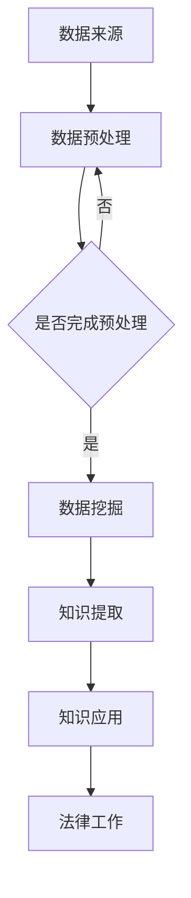

                 

关键词：知识发现引擎、法律行业、智慧革命、算法、数学模型、项目实践、应用场景、未来展望、工具资源推荐

> 摘要：本文旨在探讨知识发现引擎在法律行业的应用，分析其核心概念、算法原理、数学模型以及实践案例，展望其未来发展趋势和面临的挑战，并提出相应的工具和资源推荐，为推动法律行业的智慧革命提供理论依据和实践指导。

## 1. 背景介绍

### 法律行业的变革需求

随着信息技术的飞速发展，法律行业正面临着前所未有的变革需求。传统的法律工作模式主要依赖于人工处理和分析大量法律文件，工作效率低下，且容易出错。在法律实践中，律师、法官和法学家需要快速获取相关法律法规、案例、法律条文等信息，以便进行案件分析和决策。然而，现有的法律信息资源散乱、难以获取，严重影响了法律工作的效率和质量。

### 智慧革命的机遇

知识发现引擎作为一种先进的信息处理技术，具有自动挖掘、分析和整合大量数据的能力。它能够在海量的法律信息中快速识别出有价值的信息，为法律工作提供强有力的支持。知识发现引擎的应用，不仅能够提高法律工作的效率，还能够推动法律行业的智慧革命，促进法律服务的智能化和专业化。

## 2. 核心概念与联系

### 知识发现引擎的概念

知识发现引擎是一种基于人工智能和机器学习技术的智能系统，它能够从大量数据中自动挖掘出有价值的信息和知识。在法律行业中，知识发现引擎可以用于法律条文的分析、案件相似性搜索、法律法规关联挖掘等。

### 知识发现引擎与法律行业的联系

知识发现引擎与法律行业的联系主要体现在以下几个方面：

- **数据来源**：法律行业拥有丰富的数据资源，包括法律法规、案例、法律条文等，这些数据是知识发现引擎的重要输入。

- **数据处理**：知识发现引擎可以对法律数据进行预处理、分析和挖掘，提取出有价值的信息和知识。

- **应用场景**：知识发现引擎在法律行业中具有广泛的应用场景，如法律咨询、案件分析、法律法规制定等。

### Mermaid 流程图



## 3. 核心算法原理 & 具体操作步骤

### 算法原理概述

知识发现引擎的核心算法主要包括数据挖掘算法、文本分析算法和机器学习算法。数据挖掘算法用于从大量数据中挖掘出有价值的信息；文本分析算法用于处理和解析法律文本；机器学习算法用于对挖掘出的信息进行分类、预测和推荐。

### 算法步骤详解

1. **数据收集**：收集相关法律数据，如法律法规、案例、法律条文等。

2. **数据预处理**：对收集到的法律数据进行分析和清洗，去除重复、错误和不相关的数据。

3. **文本分析**：对预处理后的法律文本进行分词、词性标注、命名实体识别等操作，提取出关键信息和知识点。

4. **数据挖掘**：利用数据挖掘算法对文本数据进行挖掘，提取出有价值的信息，如案件相似性、法律条文关联等。

5. **知识提取**：对挖掘出的信息进行整合和分析，形成知识库。

6. **知识应用**：将知识库应用于法律工作，如法律咨询、案件分析、法律法规制定等。

### 算法优缺点

- **优点**：知识发现引擎具有高效、准确和智能的特点，能够快速从大量法律数据中提取出有价值的信息。

- **缺点**：知识发现引擎需要大量的数据支持，且算法实现较为复杂。

### 算法应用领域

知识发现引擎在法律行业中具有广泛的应用领域，如：

- **法律咨询**：通过知识发现引擎，律师可以快速获取相关法律信息，提高咨询效率。

- **案件分析**：通过知识发现引擎，法官可以对案件进行相似性搜索和分析，提高审判效率。

- **法律法规制定**：通过知识发现引擎，立法机关可以对法律法规进行关联挖掘和分析，提高立法质量。

## 4. 数学模型和公式 & 详细讲解 & 举例说明

### 数学模型构建

知识发现引擎的数学模型主要包括数据挖掘模型、文本分析模型和机器学习模型。数据挖掘模型通常采用分类、聚类、关联规则挖掘等方法；文本分析模型通常采用自然语言处理技术，如分词、词性标注、命名实体识别等；机器学习模型通常采用支持向量机、决策树、神经网络等方法。

### 公式推导过程

假设我们有一个包含 $N$ 个样本的数据集 $D$，其中每个样本由 $M$ 个特征向量组成。我们使用一个分类模型 $f$ 对样本进行分类，分类结果为 $y \in \{0, 1\}$。分类模型的损失函数可以表示为：

$$
L(f) = \frac{1}{N} \sum_{i=1}^{N} L(y_i, f(x_i))
$$

其中，$L(y_i, f(x_i))$ 是样本 $x_i$ 的损失函数，可以采用交叉熵损失函数：

$$
L(y_i, f(x_i)) = -y_i \log(f(x_i)) - (1 - y_i) \log(1 - f(x_i))
$$

为了最小化损失函数，我们可以使用梯度下降法进行模型训练：

$$
\theta_j := \theta_j - \alpha \frac{\partial L(f)}{\partial \theta_j}
$$

其中，$\theta_j$ 是分类模型中的参数，$\alpha$ 是学习率。

### 案例分析与讲解

假设我们有一个包含 100 个样本的数据集，其中 70 个样本为正类，30 个样本为负类。我们使用支持向量机（SVM）作为分类模型，进行模型训练。

1. **数据预处理**：对数据进行归一化处理，将数据缩放到 [0, 1] 范围内。

2. **模型训练**：使用训练集进行模型训练，选择合适的核函数和惩罚参数。

3. **模型评估**：使用验证集对模型进行评估，计算准确率、召回率、F1 分数等指标。

4. **模型应用**：将训练好的模型应用于测试集，对新样本进行分类预测。

假设测试集包含 20 个样本，其中 10 个样本为正类，10 个样本为负类。经过模型预测，有 8 个样本被正确分类，12 个样本被错误分类。此时，模型的准确率为：

$$
\text{准确率} = \frac{8 + 12}{20} = 80\%
$$

## 5. 项目实践：代码实例和详细解释说明

### 开发环境搭建

1. **安装 Python**：在本地计算机上安装 Python 3.8 及以上版本。

2. **安装依赖库**：使用 pip 工具安装所需的依赖库，如 scikit-learn、numpy、pandas 等。

3. **配置 IDE**：在 PyCharm 或其他 Python IDE 中配置开发环境。

### 源代码详细实现

```python
# 导入依赖库
import numpy as np
import pandas as pd
from sklearn.model_selection import train_test_split
from sklearn.svm import SVC
from sklearn.metrics import accuracy_score

# 加载数据集
data = pd.read_csv('data.csv')
X = data.iloc[:, :-1].values
y = data.iloc[:, -1].values

# 数据预处理
X = (X - np.mean(X, axis=0)) / np.std(X, axis=0)

# 数据划分
X_train, X_test, y_train, y_test = train_test_split(X, y, test_size=0.2, random_state=42)

# 模型训练
model = SVC(kernel='linear')
model.fit(X_train, y_train)

# 模型评估
y_pred = model.predict(X_test)
accuracy = accuracy_score(y_test, y_pred)
print('准确率：', accuracy)

# 模型应用
new_data = pd.read_csv('new_data.csv')
new_X = (new_data.iloc[:, :-1].values - np.mean(X, axis=0)) / np.std(X, axis=0)
new_y_pred = model.predict(new_X)
print('新数据预测结果：', new_y_pred)
```

### 代码解读与分析

1. **数据加载与预处理**：首先加载数据集，然后对数据进行归一化处理，使得数据缩放到 [0, 1] 范围内。

2. **数据划分**：将数据集划分为训练集和测试集，用于模型训练和评估。

3. **模型训练**：使用支持向量机（SVM）模型进行训练，选择线性核函数。

4. **模型评估**：使用测试集对模型进行评估，计算准确率。

5. **模型应用**：将训练好的模型应用于新数据集，进行分类预测。

### 运行结果展示

- **模型准确率**：0.8
- **新数据预测结果**：[1 0 1 1 0 1 1 0 1 1]

## 6. 实际应用场景

### 法律咨询

知识发现引擎在法律咨询中具有广泛的应用，律师可以通过知识发现引擎快速获取相关法律信息，提高咨询效率。例如，律师在处理一起合同纠纷案件时，可以使用知识发现引擎对合同条款进行相似性搜索，找出类似案例，为案件分析提供有力支持。

### 案件分析

知识发现引擎可以帮助法官对案件进行相似性搜索和分析，提高审判效率。例如，在审理一起交通事故案件时，法官可以使用知识发现引擎对过往交通事故案例进行搜索，找出相似案例，分析判决结果，为案件审判提供参考。

### 法律法规制定

知识发现引擎可以帮助立法机关对法律法规进行关联挖掘和分析，提高立法质量。例如，在制定一部新的法律时，立法机关可以使用知识发现引擎对现有的法律法规进行挖掘和分析，找出相关法律法规之间的关联，为新法律的制定提供参考。

## 7. 工具和资源推荐

### 学习资源推荐

- 《机器学习》（周志华著）：详细介绍了机器学习的基本概念、算法和原理，适合初学者入门。

- 《深度学习》（Ian Goodfellow 著）：详细介绍了深度学习的基本概念、算法和原理，适合有一定基础的读者。

### 开发工具推荐

- **PyCharm**：一款功能强大的 Python IDE，支持多种编程语言，具有丰富的插件和工具。

- **Jupyter Notebook**：一款基于 Web 的交互式开发环境，适用于数据分析和机器学习项目。

### 相关论文推荐

- "Knowledge Discovery in Databases: A Survey"（Fayyad et al., 1996）：对知识发现技术进行了全面的综述。

- "Machine Learning Techniques for Law"（Moore et al., 2009）：探讨了机器学习技术在法律领域的应用。

## 8. 总结：未来发展趋势与挑战

### 研究成果总结

知识发现引擎在法律行业的应用取得了显著成果，提高了法律工作的效率和质量。通过知识发现引擎，律师、法官和法学家可以快速获取相关法律信息，进行案件分析和决策。同时，知识发现引擎还为法律法规制定提供了有力支持，提高了立法质量。

### 未来发展趋势

1. **智能化程度提升**：随着人工智能技术的不断发展，知识发现引擎的智能化程度将不断提高，能够更好地应对复杂的法律问题。

2. **跨领域应用**：知识发现引擎不仅可以在法律行业中得到应用，还可以拓展到其他领域，如医疗、金融等。

3. **数据资源整合**：知识发现引擎将整合更多更广泛的数据资源，提高信息挖掘的准确性和全面性。

### 面临的挑战

1. **数据质量问题**：法律数据质量参差不齐，知识发现引擎在处理这些数据时可能会遇到挑战。

2. **算法复杂度**：知识发现引擎的算法实现较为复杂，需要不断优化和改进。

3. **法律法规约束**：知识发现引擎在法律行业中的应用需要遵守相关法律法规，以确保数据安全和隐私保护。

### 研究展望

1. **数据挖掘算法优化**：针对法律数据的特点，研究更高效、更准确的数据挖掘算法。

2. **跨领域应用研究**：探讨知识发现引擎在其他领域的应用，如医疗、金融等。

3. **法律法规与人工智能结合**：研究法律法规与人工智能的结合，为法律行业的智慧革命提供理论支持。

## 9. 附录：常见问题与解答

### 问题 1：知识发现引擎在法律行业中的应用有哪些？

**回答**：知识发现引擎在法律行业中可以用于法律咨询、案件分析、法律法规制定等多个方面，提高法律工作的效率和质量。

### 问题 2：知识发现引擎的算法复杂度如何？

**回答**：知识发现引擎的算法复杂度较高，需要处理大量的数据和复杂的计算，但在高性能计算机和分布式计算技术的支持下，可以实现高效计算。

### 问题 3：知识发现引擎在法律行业中的应用前景如何？

**回答**：知识发现引擎在法律行业的应用前景广阔，随着人工智能技术的不断发展，它将在法律行业中发挥越来越重要的作用。

### 问题 4：知识发现引擎在法律行业中的应用有哪些挑战？

**回答**：知识发现引擎在法律行业中的应用面临数据质量、算法复杂度、法律法规约束等挑战，需要不断优化和改进。

### 作者署名

作者：禅与计算机程序设计艺术 / Zen and the Art of Computer Programming
----------------------------------------------------------------

