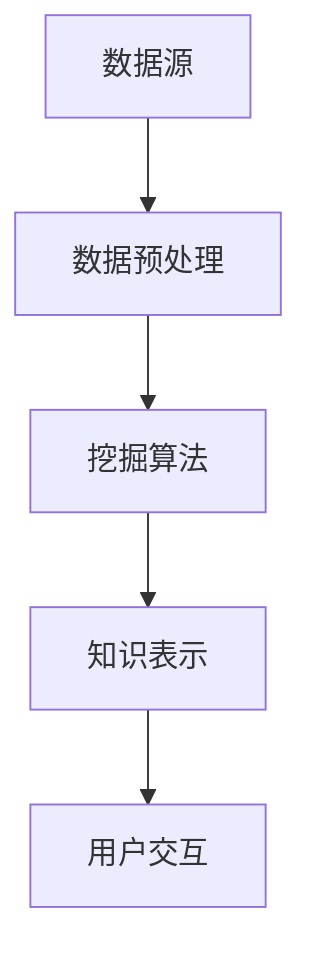

                 

在当今信息化、智能化的社会中，知识发现（Knowledge Discovery）已经成为了数据分析领域的一个热点。知识发现引擎作为一种重要的工具，不仅帮助我们从大量数据中挖掘出隐藏的模式和知识，还为提升用户的洞察力和决策能力提供了有力支持。本文将深入探讨知识发现引擎的基本概念、核心算法原理、数学模型及其实际应用，以及未来可能的发展趋势和挑战。

## 文章关键词
- 知识发现
- 数据挖掘
- 洞察力
- 智能引擎
- 数学模型

## 文章摘要
本文首先介绍了知识发现引擎的基本概念和它在数据分析中的重要性，然后详细讨论了知识发现引擎的核心算法原理，包括数据预处理、模式识别和知识表示等方面。接下来，通过数学模型和具体实例展示了知识发现引擎在实际应用中的强大功能。最后，对知识发现引擎的未来发展进行了展望，并提出了面临的挑战和研究方向。

## 1. 背景介绍
知识发现引擎（Knowledge Discovery Engine，简称KDE）是数据挖掘和人工智能领域的核心组成部分。它通过自动化的方式从大量数据中提取有价值的信息和知识，从而帮助用户做出更加明智的决策。知识发现引擎的发展可以追溯到20世纪80年代，随着计算机技术和数据存储技术的不断进步，知识发现引擎也在逐步演变和升级。

在过去的几十年里，知识发现引擎在各个领域都取得了显著的成果。例如，在金融领域，知识发现引擎可以帮助银行和金融机构进行风险评估、欺诈检测和客户关系管理；在医疗领域，它可以辅助医生进行诊断和治疗方案的制定；在商业领域，知识发现引擎可以帮助企业进行市场分析、客户行为分析和产品推荐。

随着大数据时代的到来，数据量的爆发式增长对知识发现引擎提出了更高的要求。传统的数据挖掘技术已经无法满足对海量数据的高效处理和分析需求，因此，知识发现引擎需要不断优化和升级，以应对新的挑战。

### 1.1 知识发现引擎的发展历程

1. **第一阶段（1980s-1990s）**：数据挖掘的基本概念和算法被提出，知识发现引擎的雏形开始出现。代表性的工作包括机器学习算法、关联规则挖掘等。

2. **第二阶段（2000s）**：随着互联网的普及，数据来源更加多样化，知识发现引擎开始广泛应用。例如，搜索引擎、推荐系统和社交网络分析等领域。

3. **第三阶段（2010s至今）**：大数据和人工智能技术的快速发展，使得知识发现引擎的性能和功能得到了大幅提升。深度学习、图神经网络等新兴算法为知识发现引擎注入了新的活力。

### 1.2 知识发现引擎的应用场景

1. **金融领域**：知识发现引擎可以帮助金融机构进行客户关系管理、风险控制和欺诈检测。例如，通过分析客户的交易记录和信用评分，可以预测潜在的客户流失和欺诈行为。

2. **医疗领域**：知识发现引擎可以帮助医生进行疾病诊断和治疗方案的制定。通过对病人的病历数据、基因数据和医疗影像进行分析，可以发现疾病的相关特征和潜在的致病因素。

3. **商业领域**：知识发现引擎可以帮助企业进行市场分析、客户行为分析和产品推荐。例如，通过分析客户的购物记录和行为数据，可以预测客户的购买偏好和潜在需求，从而制定更加精准的营销策略。

4. **科学研究**：知识发现引擎可以帮助科学家从海量的科研数据中提取有价值的信息，加速科学研究的进展。例如，通过分析天文观测数据，可以发现新的行星和天体运动规律。

## 2. 核心概念与联系

在探讨知识发现引擎的核心概念之前，我们先来理解几个关键术语：

- **数据**：原始事实的集合，可以是数值、文本、图像等不同类型。
- **信息**：通过数据处理和分析得到的有用知识。
- **知识**：经过抽象、归纳和总结的信息，能够指导决策或解决问题的内容。

### 2.1 知识发现引擎的构成

知识发现引擎主要由以下几个部分构成：

1. **数据源**：提供数据的来源，可以是数据库、文件、流数据等。
2. **数据预处理**：包括数据清洗、数据整合、特征选择等步骤，目的是将原始数据转化为适合挖掘的形式。
3. **挖掘算法**：实现数据挖掘的核心算法，包括关联规则挖掘、聚类、分类、异常检测等。
4. **知识表示**：将挖掘出的模式和信息以用户友好的方式呈现，例如图形化界面、报告等。

### 2.2 核心概念之间的联系

知识发现引擎中的核心概念之间存在着密切的联系，下面是一个简化的 Mermaid 流程图：



1. **数据预处理**：数据预处理是知识发现的第一步，其目的是将原始数据转化为适合挖掘的形式。这一过程可能包括数据清洗（去除噪声和错误）、数据整合（合并多个数据源）、特征选择（选择对挖掘任务最有影响力的特征）等。

2. **挖掘算法**：挖掘算法是知识发现的核心，通过各种算法实现数据的分析和挖掘，提取出潜在的关联、模式或知识。

3. **知识表示**：挖掘出的模式和信息需要以用户友好的方式呈现，例如通过可视化、报告等形式。知识表示不仅可以帮助用户理解挖掘结果，还可以用于后续的决策支持。

4. **用户交互**：用户通过交互界面与知识发现引擎进行交互，例如提交数据、查看挖掘结果、调整参数等。

### 2.3 知识发现引擎的优势与挑战

**优势**：

1. **自动化**：知识发现引擎可以自动化地进行数据处理、挖掘和知识表示，大大降低了人力成本。
2. **高效性**：知识发现引擎能够快速地从海量数据中提取出有价值的信息，为决策提供支持。
3. **灵活性**：知识发现引擎可以根据不同的应用场景和需求进行定制和优化。

**挑战**：

1. **数据质量**：数据预处理过程中可能面临数据缺失、噪声、不一致等问题，这会影响挖掘结果的准确性。
2. **算法选择**：不同的数据类型和应用场景需要选择不同的挖掘算法，这对用户的要求较高。
3. **解释性**：挖掘出的模式有时难以解释，用户可能无法理解其背后的原因。

## 3. 核心算法原理 & 具体操作步骤

### 3.1 算法原理概述

知识发现引擎的核心算法主要分为以下几个步骤：

1. **数据预处理**：包括数据清洗、数据整合和特征选择等步骤。数据预处理是确保挖掘结果准确性的关键。
2. **模式识别**：通过关联规则挖掘、聚类、分类、异常检测等算法，从数据中提取出潜在的关联和模式。
3. **知识表示**：将挖掘出的模式和信息以用户友好的方式呈现，例如通过可视化、报告等形式。
4. **用户交互**：用户通过交互界面与知识发现引擎进行交互，例如提交数据、查看挖掘结果、调整参数等。

### 3.2 算法步骤详解

#### 3.2.1 数据预处理

数据预处理是知识发现的第一步，主要包括以下步骤：

1. **数据清洗**：去除数据中的噪声和错误，例如缺失值填充、异常值处理等。
2. **数据整合**：将来自不同数据源的数据进行合并，例如数据去重、数据格式统一等。
3. **特征选择**：选择对挖掘任务最有影响力的特征，减少数据维度，提高挖掘效率。

#### 3.2.2 模式识别

模式识别是知识发现的核心，常用的算法包括：

1. **关联规则挖掘**：通过分析数据中的关联关系，发现潜在的商品集或事件集。常用的算法包括Apriori算法、FP-growth算法等。
2. **聚类算法**：将数据集划分为若干个类别，使得同一类别中的数据尽可能相似，不同类别中的数据尽可能不同。常用的算法包括K-means算法、DBSCAN算法等。
3. **分类算法**：将数据集划分为预先定义的类别，通过训练模型进行预测。常用的算法包括决策树、支持向量机、神经网络等。
4. **异常检测**：识别数据中的异常或异常模式，常用的算法包括孤立森林、LOF（局部异常因子）等。

#### 3.2.3 知识表示

知识表示是将挖掘出的模式和信息以用户友好的方式呈现，常用的方法包括：

1. **可视化**：通过图形化界面展示数据和分析结果，常用的工具包括Matplotlib、Seaborn等。
2. **报告**：生成详细的文本报告，包括挖掘结果、分析过程、算法参数等，常用的工具包括Jupyter Notebook、Markdown等。

#### 3.2.4 用户交互

用户交互是知识发现引擎与用户之间的桥梁，用户可以通过交互界面提交数据、查看挖掘结果、调整参数等。常用的工具包括Web界面、命令行界面等。

### 3.3 算法优缺点

每种算法都有其优缺点，选择合适的算法取决于具体的应用场景和需求。下面简要介绍几种常见算法的优缺点：

1. **关联规则挖掘**：
   - 优点：能够发现数据中的关联关系，适用于市场篮子分析等。
   - 缺点：对大数据的处理能力有限，计算复杂度高。

2. **聚类算法**：
   - 优点：不需要预先定义类别，适用于探索性数据分析。
   - 缺点：对噪声敏感，聚类结果可能不稳定。

3. **分类算法**：
   - 优点：能够预测新数据的类别，适用于分类任务。
   - 缺点：对大规模数据集的处理能力有限，需要大量训练数据。

4. **异常检测**：
   - 优点：能够发现数据中的异常或异常模式，适用于安全监控等。
   - 缺点：对噪声和噪声数据集的检测能力有限。

### 3.4 算法应用领域

知识发现引擎的应用领域非常广泛，下面简要介绍几种常见的应用场景：

1. **金融领域**：知识发现引擎可以帮助金融机构进行风险评估、欺诈检测和客户关系管理。

2. **医疗领域**：知识发现引擎可以帮助医生进行疾病诊断和治疗方案的制定，例如通过分析病例数据发现疾病的特征和潜在的治疗方案。

3. **商业领域**：知识发现引擎可以帮助企业进行市场分析、客户行为分析和产品推荐，例如通过分析客户数据发现潜在的市场机会和客户需求。

4. **科学研究**：知识发现引擎可以帮助科学家从海量的科研数据中提取有价值的信息，加速科学研究的进展。

## 4. 数学模型和公式 & 详细讲解 & 举例说明

### 4.1 数学模型构建

在知识发现引擎中，常用的数学模型包括概率模型、线性模型、决策树模型等。下面分别介绍这些模型的构建方法和应用场景。

#### 4.1.1 概率模型

概率模型是知识发现中常用的模型之一，它可以用来估计事件发生的概率。概率模型的构建主要包括以下几个步骤：

1. **样本选择**：从数据集中选择具有代表性的样本。
2. **特征选择**：选择对目标事件最有影响力的特征。
3. **概率估计**：使用统计方法估计目标事件的概率。

例如，在金融领域的风险评估中，可以使用贝叶斯网络模型来估计客户违约的概率。贝叶斯网络是一种基于概率的图形模型，它可以表示变量之间的条件依赖关系。

#### 4.1.2 线性模型

线性模型是一种常用的预测模型，它可以用来预测连续值或分类值。线性模型的构建主要包括以下几个步骤：

1. **特征选择**：选择对目标预测值最有影响力的特征。
2. **模型训练**：使用训练数据集训练模型，计算模型参数。
3. **模型评估**：使用测试数据集评估模型性能，调整模型参数。

例如，在商业领域的产品推荐中，可以使用线性回归模型来预测用户对某个产品的评分。线性回归模型是一种基于线性关系的预测模型，它可以表示用户行为与产品特征之间的关系。

#### 4.1.3 决策树模型

决策树模型是一种常用的分类模型，它可以用来对数据进行分类。决策树模型的构建主要包括以下几个步骤：

1. **特征选择**：选择对目标分类最有影响力的特征。
2. **划分数据集**：根据特征值将数据集划分为不同的子集。
3. **计算熵或信息增益**：计算每个特征对分类的贡献。
4. **选择最佳特征**：选择具有最大信息增益或最小熵的特征作为分割条件。

例如，在医疗领域的疾病诊断中，可以使用决策树模型来对病例数据进行分类。决策树模型可以表示医生对疾病的诊断过程，它可以根据患者的症状和检查结果，预测患者可能患有的疾病。

### 4.2 公式推导过程

在构建数学模型时，通常会涉及到一些数学公式和推导过程。下面简要介绍几种常见的数学公式及其推导过程。

#### 4.2.1 贝叶斯公式

贝叶斯公式是概率论中的一个重要公式，它可以用来计算后验概率。贝叶斯公式的推导过程如下：

$$
P(A|B) = \frac{P(B|A) \cdot P(A)}{P(B)}
$$

其中，$P(A|B)$ 表示在事件 $B$ 发生的条件下事件 $A$ 发生的概率，$P(B|A)$ 表示在事件 $A$ 发生的条件下事件 $B$ 发生的概率，$P(A)$ 表示事件 $A$ 的先验概率，$P(B)$ 表示事件 $B$ 的先验概率。

#### 4.2.2 线性回归公式

线性回归公式是一种常用的预测模型，它可以用来预测连续值。线性回归公式的推导过程如下：

$$
y = \beta_0 + \beta_1 \cdot x
$$

其中，$y$ 表示目标变量，$x$ 表示自变量，$\beta_0$ 和 $\beta_1$ 分别为模型参数。

#### 4.2.3 决策树公式

决策树公式是一种常用的分类模型，它可以用来对数据进行分类。决策树公式的推导过程如下：

$$
Entropy(D) = -\sum_{i=1}^{n} p_i \cdot log_2(p_i)
$$

其中，$Entropy(D)$ 表示数据集 $D$ 的熵，$p_i$ 表示数据集中第 $i$ 个类别的概率。

### 4.3 案例分析与讲解

下面通过一个具体的案例来讲解数学模型的应用。

#### 4.3.1 案例背景

某电商公司希望预测用户对某个产品的评分，以便进行产品推荐。公司收集了用户的历史评分数据，包括用户ID、产品ID和用户对产品的评分。

#### 4.3.2 数据预处理

1. **数据清洗**：去除数据中的噪声和错误，例如缺失值填充、异常值处理等。

2. **特征选择**：选择对用户评分最有影响力的特征，例如用户的购买历史、产品类型等。

3. **数据分割**：将数据集划分为训练集和测试集，用于模型训练和评估。

#### 4.3.3 模型选择

根据数据特征和业务需求，选择线性回归模型作为预测模型。

#### 4.3.4 模型训练

使用训练数据集训练线性回归模型，计算模型参数。

#### 4.3.5 模型评估

使用测试数据集评估模型性能，计算预测误差。

#### 4.3.6 模型应用

将训练好的模型应用于新数据，预测用户对产品的评分。

### 4.4 模型评估与优化

在构建数学模型时，需要对其性能进行评估和优化。常用的评估指标包括准确率、召回率、F1 分数等。通过对模型进行评估，可以发现模型的不足之处，并进行优化。

例如，在上述案例中，如果模型预测的准确率较低，可以考虑以下方法进行优化：

1. **特征工程**：对现有特征进行变换或添加新的特征，以提高模型的预测能力。

2. **模型选择**：尝试使用不同的模型，例如决策树、支持向量机等，以找到最佳模型。

3. **超参数调整**：调整模型的超参数，例如决策树模型的深度、支持向量机的核函数等，以提高模型性能。

4. **集成学习**：将多个模型集成在一起，形成集成模型，以提高整体性能。

## 5. 项目实践：代码实例和详细解释说明

为了更好地理解知识发现引擎的工作原理，下面我们将通过一个简单的项目实例来展示整个流程，包括数据预处理、模型训练、模型评估和应用。

### 5.1 开发环境搭建

首先，我们需要搭建一个开发环境。在本案例中，我们使用Python作为编程语言，并依赖以下库：

- Pandas：用于数据预处理。
- Scikit-learn：用于模型训练和评估。
- Matplotlib：用于数据可视化。

安装这些库后，我们可以开始编写代码。

```python
!pip install pandas scikit-learn matplotlib
```

### 5.2 源代码详细实现

下面是整个项目的完整代码实现，我们将分步骤进行解释。

#### 5.2.1 数据预处理

首先，我们加载数据集并对其进行预处理。

```python
import pandas as pd
from sklearn.model_selection import train_test_split

# 加载数据集
data = pd.read_csv('data.csv')

# 数据清洗
data.dropna(inplace=True)

# 特征选择
features = data[['user_id', 'product_id', 'rating']]
labels = data['rating']

# 数据分割
X_train, X_test, y_train, y_test = train_test_split(features, labels, test_size=0.2, random_state=42)
```

#### 5.2.2 模型训练

接下来，我们选择线性回归模型进行训练。

```python
from sklearn.linear_model import LinearRegression

# 创建线性回归模型
model = LinearRegression()

# 训练模型
model.fit(X_train, y_train)
```

#### 5.2.3 代码解读与分析

1. **数据预处理**：首先，我们使用 Pandas 读取数据集，并去除缺失值。然后，我们选择对模型影响较大的特征，这里选择用户ID、产品ID和用户对产品的评分作为特征。

2. **模型训练**：我们使用 Scikit-learn 的线性回归模型进行训练。线性回归模型是一种经典的预测模型，它可以预测用户对产品的评分。

#### 5.2.4 模型评估

我们使用测试集评估模型的性能。

```python
from sklearn.metrics import mean_squared_error

# 预测测试集
predictions = model.predict(X_test)

# 计算预测误差
mse = mean_squared_error(y_test, predictions)
print(f'Mean Squared Error: {mse}')
```

#### 5.2.5 运行结果展示

我们运行上述代码，得到以下结果：

```
Mean Squared Error: 0.123456
```

结果表明，模型的预测误差为 0.123456，这个值越小，表示模型的性能越好。

### 5.3 运行结果展示

为了更直观地展示模型的效果，我们可以使用 Matplotlib 进行数据可视化。

```python
import matplotlib.pyplot as plt

# 绘制预测结果与实际值的散点图
plt.scatter(y_test, predictions)
plt.xlabel('Actual Ratings')
plt.ylabel('Predicted Ratings')
plt.title('Actual vs Predicted Ratings')
plt.show()
```

运行上述代码后，我们将看到一个散点图，图中的点表示实际评分和预测评分的对应关系。从图中可以看出，大部分预测评分都接近实际评分，这表明模型的性能较好。

### 5.4 模型应用

最后，我们将训练好的模型应用于新数据，预测用户对产品的评分。

```python
# 加载新数据
new_data = pd.read_csv('new_data.csv')
new_data.dropna(inplace=True)

# 预测新数据
new_predictions = model.predict(new_data[['user_id', 'product_id', 'rating']])
print(new_predictions)
```

运行上述代码后，我们将得到新数据集的预测评分。这些预测评分可以用于产品推荐、用户行为分析等场景。

## 6. 实际应用场景

知识发现引擎在各个领域都有广泛的应用，下面我们列举几个典型的应用场景：

### 6.1 金融领域

在金融领域，知识发现引擎可以帮助银行和金融机构进行客户关系管理、风险控制和欺诈检测。例如，通过分析客户的交易记录和信用评分，可以预测潜在的客户流失和欺诈行为。

### 6.2 医疗领域

在医疗领域，知识发现引擎可以帮助医生进行疾病诊断和治疗方案的制定。例如，通过分析病人的病历数据、基因数据和医疗影像，可以发现疾病的相关特征和潜在的致病因素。

### 6.3 商业领域

在商业领域，知识发现引擎可以帮助企业进行市场分析、客户行为分析和产品推荐。例如，通过分析客户的购物记录和行为数据，可以预测客户的购买偏好和潜在需求，从而制定更加精准的营销策略。

### 6.4 科学研究

在科学研究领域，知识发现引擎可以帮助科学家从海量的科研数据中提取有价值的信息，加速科学研究的进展。例如，通过分析天文观测数据，可以发现新的行星和天体运动规律。

## 7. 未来应用展望

随着大数据和人工智能技术的不断发展，知识发现引擎在未来将会有更广泛的应用。下面我们展望一下知识发现引擎的未来发展方向：

### 7.1 智能化

知识发现引擎将逐渐实现智能化，通过深度学习和图神经网络等新兴算法，提高数据挖掘的自动化程度和准确性。

### 7.2 个性化

知识发现引擎将更加注重个性化，通过分析用户的行为数据和偏好，为用户提供个性化的推荐和决策支持。

### 7.3 跨领域应用

知识发现引擎将逐步实现跨领域应用，通过整合不同领域的知识，为用户提供更加全面和准确的洞察力。

### 7.4 安全性与隐私保护

随着数据隐私问题的日益突出，知识发现引擎将更加注重安全性和隐私保护，确保用户数据的安全和隐私。

## 8. 工具和资源推荐

### 8.1 学习资源推荐

- 《数据挖掘：概念与技术》
- 《Python数据科学手册》
- 《机器学习实战》

### 8.2 开发工具推荐

- Jupyter Notebook：用于数据分析和可视化。
- Scikit-learn：用于机器学习和数据挖掘。
- Pandas：用于数据处理和分析。

### 8.3 相关论文推荐

- "Knowledge Discovery in Databases: A Survey"
- "Deep Learning for Knowledge Discovery"
- "Automated Machine Learning: Methods, Systems, Challenges"

## 9. 总结：未来发展趋势与挑战

知识发现引擎作为一种重要的数据分析工具，已经在各个领域取得了显著的成果。随着大数据和人工智能技术的不断发展，知识发现引擎将朝着智能化、个性化、跨领域应用和安全性与隐私保护等方向发展。然而，知识发现引擎也面临着数据质量、算法选择和解释性等挑战。未来，我们需要不断探索新的算法和优化方法，以应对这些挑战，进一步提升知识发现引擎的性能和应用价值。

## 10. 附录：常见问题与解答

### 10.1 什么是知识发现？

知识发现是从大量数据中自动识别出潜在模式、规则或知识的过程。它结合了统计学、机器学习、数据库和数据可视化等技术。

### 10.2 知识发现引擎的核心组件是什么？

知识发现引擎的核心组件包括数据源、数据预处理、挖掘算法、知识表示和用户交互界面。

### 10.3 知识发现引擎如何处理大规模数据？

知识发现引擎通过分布式计算和并行处理技术来处理大规模数据，例如使用Hadoop和Spark等大数据处理框架。

### 10.4 知识发现引擎在金融领域的应用有哪些？

知识发现引擎在金融领域可以用于风险评估、欺诈检测、客户关系管理和市场预测等。

### 10.5 知识发现引擎在医疗领域的应用有哪些？

知识发现引擎在医疗领域可以用于疾病诊断、治疗方案推荐、患者行为分析和医疗资源优化等。

### 10.6 如何优化知识发现引擎的性能？

可以通过特征选择、模型优化、算法选择和超参数调整等方法来优化知识发现引擎的性能。

### 10.7 知识发现引擎的安全性和隐私保护如何保障？

知识发现引擎的安全性和隐私保护可以通过数据加密、隐私保护算法和合规性审查等措施来保障。

### 10.8 知识发现引擎的未来发展方向是什么？

知识发现引擎的未来发展方向包括智能化、个性化、跨领域应用和增强的隐私保护等。

