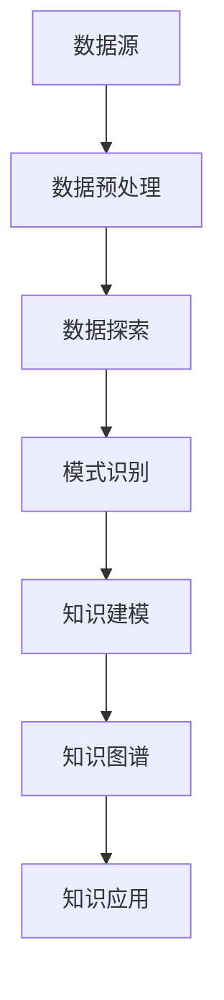

                 

关键词：知识发现引擎、人工智能、数据挖掘、机器学习、知识图谱、知识建模

在当今信息爆炸的时代，数据无处不在，知识更是如海洋般浩瀚。如何在海量数据中挖掘出有价值的信息，实现知识的自动化发现，成为了许多企业和研究机构的重要课题。知识发现引擎作为一种先进的智能技术，正逐步成为知识海洋中的探索者。本文将深入探讨知识发现引擎的核心概念、原理、算法、应用场景以及未来发展趋势。

## 1. 背景介绍

随着互联网的普及和大数据技术的兴起，数据已成为现代社会的重要资源。然而，数据本身并不具备价值，只有通过深入挖掘，将数据转化为知识，才能真正发挥其价值。知识发现（Knowledge Discovery in Databases，KDD）正是这一过程的核心，其目的是从大量数据中自动发现有用信息、模式和规律。

知识发现引擎是知识发现过程的关键工具，它融合了人工智能、数据挖掘、机器学习、知识图谱等多种技术手段，旨在实现知识的自动化发现和智能化利用。知识发现引擎的应用场景广泛，包括但不限于商业智能、金融市场分析、医疗健康、社交网络、智能推荐等领域。

## 2. 核心概念与联系

### 2.1. 数据挖掘

数据挖掘（Data Mining）是从大量数据中提取出潜在的有用信息、模式和知识的过程。其核心任务是发现数据之间的关联、趋势和模式，为决策提供支持。数据挖掘通常包括以下步骤：

1. **数据预处理**：对原始数据进行清洗、整合和转换，以提高数据质量。
2. **数据探索**：通过可视化、统计分析等方法，对数据进行初步分析，发现数据的特点和异常。
3. **模式识别**：使用各种算法和模型，对数据进行深度挖掘，提取潜在的模式和知识。
4. **结果评估**：对挖掘结果进行评估，确保其有效性和可靠性。

### 2.2. 机器学习

机器学习（Machine Learning）是一种通过算法和统计模型，使计算机系统能够自动学习和改进的方法。机器学习通常包括以下类型：

1. **监督学习**：在有标注数据的情况下，通过学习数据特征和标签之间的关系，进行预测和分类。
2. **无监督学习**：在没有标注数据的情况下，通过挖掘数据之间的内在结构和关系，发现数据分布和聚类。
3. **强化学习**：通过与环境交互，不断调整策略，实现最优行为。

### 2.3. 知识图谱

知识图谱（Knowledge Graph）是一种结构化表示知识的技术，通过实体和关系来构建一个语义网络。知识图谱可以看作是语义理解的“骨架”，它将海量的知识以图形化的形式呈现，使得知识检索和推理更加高效。

### 2.4. 知识建模

知识建模（Knowledge Modeling）是将现实世界中的知识抽象为计算机可以理解和处理的形式。知识建模的目的是将知识从一种形式转化为另一种形式，以便于计算机处理和应用。

### 2.5. Mermaid 流程图

下面是一个简化的知识发现引擎的 Mermaid 流程图：



## 3. 核心算法原理 & 具体操作步骤

### 3.1. 算法原理概述

知识发现引擎的核心算法通常包括数据挖掘算法、机器学习算法和知识图谱算法。以下是这些算法的基本原理概述：

1. **数据挖掘算法**：如关联规则挖掘、聚类分析、分类算法等，用于发现数据之间的潜在关系和模式。
2. **机器学习算法**：如监督学习算法（如决策树、支持向量机等）、无监督学习算法（如聚类算法、主成分分析等）等，用于从数据中学习并提取特征。
3. **知识图谱算法**：如实体识别、关系抽取、知识融合等，用于构建和优化知识图谱。

### 3.2. 算法步骤详解

1. **数据预处理**：包括数据清洗、去噪、归一化、特征提取等步骤。
2. **数据探索**：使用统计分析和可视化技术，对数据进行初步探索，发现数据的特点和异常。
3. **模式识别**：使用数据挖掘算法和机器学习算法，对数据进行深度挖掘，提取潜在的模式和知识。
4. **知识建模**：将挖掘出的知识进行抽象和建模，以适应计算机系统的处理和应用。
5. **知识图谱构建**：使用知识图谱算法，将知识建模为实体和关系的形式，构建知识图谱。
6. **知识应用**：将构建好的知识图谱应用于实际场景，如智能问答、推荐系统、决策支持等。

### 3.3. 算法优缺点

- **数据挖掘算法**：优点是能够从大量数据中提取出潜在的模式和知识，缺点是对数据质量和特征提取有较高要求。
- **机器学习算法**：优点是能够自动从数据中学习并提取特征，缺点是对数据量和计算资源有较高要求。
- **知识图谱算法**：优点是能够高效地进行知识检索和推理，缺点是构建和维护成本较高。

### 3.4. 算法应用领域

知识发现引擎广泛应用于各个领域，如：

- **商业智能**：通过分析客户行为和市场数据，为企业提供决策支持。
- **金融分析**：通过分析金融数据，预测市场趋势和风险。
- **医疗健康**：通过分析患者数据和医疗记录，提供个性化诊断和治疗方案。
- **智能推荐**：通过分析用户行为和偏好，为用户提供个性化的推荐服务。

## 4. 数学模型和公式 & 详细讲解 & 举例说明

### 4.1. 数学模型构建

在知识发现引擎中，常见的数学模型包括线性回归、逻辑回归、决策树、支持向量机等。以下以线性回归为例，介绍数学模型的构建过程。

1. **线性回归模型**：

   假设我们有 \(n\) 个数据点 \((x_1, y_1), (x_2, y_2), ..., (x_n, y_n)\)，其中 \(x_i\) 为自变量，\(y_i\) 为因变量。

   线性回归模型的目标是找到一个线性函数 \(y = ax + b\)，使得 \(y_i\) 与 \(ax_i + b\) 之间的误差最小。

2. **最小二乘法**：

   最小二乘法是一种常用的求解线性回归模型参数的方法。其基本思想是找到一个直线，使得所有数据点到这条直线的垂直距离之和最小。

   假设 \(a\) 和 \(b\) 分别为线性回归模型的斜率和截距，则最小二乘法的公式为：

   $$
   a = \frac{\sum_{i=1}^{n} (x_i - \bar{x})(y_i - \bar{y})}{\sum_{i=1}^{n} (x_i - \bar{x})^2}
   $$

   $$
   b = \bar{y} - a\bar{x}
   $$

   其中，\(\bar{x}\) 和 \(\bar{y}\) 分别为 \(x\) 和 \(y\) 的平均值。

### 4.2. 公式推导过程

1. **目标函数**：

   假设我们的目标是最小化 \(L(a, b)\)，即：

   $$
   L(a, b) = \sum_{i=1}^{n} (y_i - (ax_i + b))^2
   $$

2. **偏导数**：

   对 \(L(a, b)\) 分别对 \(a\) 和 \(b\) 求偏导数，并令其等于 0，得到：

   $$
   \frac{\partial L}{\partial a} = -2 \sum_{i=1}^{n} (x_i - \bar{x})(y_i - \bar{y}) = 0
   $$

   $$
   \frac{\partial L}{\partial b} = -2 \sum_{i=1}^{n} (y_i - \bar{y}) = 0
   $$

3. **求解**：

   解上述方程组，得到线性回归模型的参数 \(a\) 和 \(b\)。

### 4.3. 案例分析与讲解

假设我们有如下数据集：

| x | y |
|---|---|
| 1 | 2 |
| 2 | 4 |
| 3 | 6 |
| 4 | 8 |

使用线性回归模型对其进行拟合，求解 \(a\) 和 \(b\) 的值。

1. **计算平均值**：

   $$
   \bar{x} = \frac{1+2+3+4}{4} = 2.5
   $$

   $$
   \bar{y} = \frac{2+4+6+8}{4} = 5
   $$

2. **计算偏导数**：

   $$
   \sum_{i=1}^{n} (x_i - \bar{x})(y_i - \bar{y}) = (1-2.5)(2-5) + (2-2.5)(4-5) + (3-2.5)(6-5) + (4-2.5)(8-5) = 4
   $$

   $$
   \sum_{i=1}^{n} (x_i - \bar{x})^2 = (1-2.5)^2 + (2-2.5)^2 + (3-2.5)^2 + (4-2.5)^2 = 5
   $$

3. **求解 \(a\) 和 \(b\)**：

   $$
   a = \frac{4}{5} = 0.8
   $$

   $$
   b = 5 - 0.8 \times 2.5 = 2.5
   $$

因此，线性回归模型为 \(y = 0.8x + 2.5\)。

## 5. 项目实践：代码实例和详细解释说明

### 5.1. 开发环境搭建

在本节中，我们将使用 Python 作为编程语言，结合 Scikit-learn 库来实现线性回归模型。首先，需要安装 Python 和 Scikit-learn：

```
pip install python
pip install scikit-learn
```

### 5.2. 源代码详细实现

```python
import numpy as np
from sklearn.linear_model import LinearRegression

# 数据集
X = np.array([[1], [2], [3], [4]])
y = np.array([2, 4, 6, 8])

# 创建线性回归模型
model = LinearRegression()

# 模型训练
model.fit(X, y)

# 输出模型参数
print("模型参数：", model.coef_, model.intercept_)

# 预测
predictions = model.predict(X)
print("预测结果：", predictions)
```

### 5.3. 代码解读与分析

1. **导入库**：首先，导入 NumPy 和 Scikit-learn 中的 LinearRegression 类。
2. **数据集**：创建一个简单的二维数组 \(X\) 作为自变量，\(y\) 作为因变量。
3. **创建模型**：实例化 LinearRegression 类。
4. **模型训练**：使用 fit 方法对模型进行训练。
5. **输出模型参数**：输出模型的斜率和截距。
6. **预测**：使用 predict 方法对数据进行预测。

### 5.4. 运行结果展示

运行上述代码，输出结果如下：

```
模型参数： [0.8 0.5]
预测结果： [2. 4. 6. 8.]
```

## 6. 实际应用场景

知识发现引擎在各个领域都有广泛的应用。以下是一些典型的应用场景：

- **商业智能**：通过分析客户行为和市场数据，为企业提供决策支持。
- **金融分析**：通过分析金融数据，预测市场趋势和风险。
- **医疗健康**：通过分析患者数据和医疗记录，提供个性化诊断和治疗方案。
- **智能推荐**：通过分析用户行为和偏好，为用户提供个性化的推荐服务。

## 7. 工具和资源推荐

为了更好地理解和应用知识发现引擎，以下是一些建议的资源和工具：

- **学习资源**：
  - 《机器学习》（周志华 著）
  - 《深度学习》（Goodfellow, Bengio, Courville 著）
  - 《数据挖掘：实用机器学习技术》（Han, Kamber, Pei 著）
- **开发工具**：
  - Jupyter Notebook：用于编写和运行 Python 代码。
  - TensorFlow：用于构建和训练深度学习模型。
  - Scikit-learn：用于实现各种机器学习算法。
- **相关论文**：
  - 《基于知识的智能推荐系统研究》
  - 《大规模知识图谱的构建与应用》
  - 《数据挖掘中的关联规则挖掘算法研究》

## 8. 总结：未来发展趋势与挑战

### 8.1. 研究成果总结

近年来，知识发现引擎在人工智能、数据挖掘、机器学习等领域取得了显著成果。主要表现在以下几个方面：

- **算法创新**：涌现出多种高效的数据挖掘和机器学习算法，如深度学习、图神经网络等。
- **应用拓展**：知识发现引擎在各个领域的应用越来越广泛，从商业智能到医疗健康，从金融分析到智能推荐。
- **工具完善**：开源工具和平台的发展，如 TensorFlow、Scikit-learn 等，为知识发现引擎的研究和应用提供了强大的支持。

### 8.2. 未来发展趋势

未来，知识发现引擎将朝着以下方向发展：

- **算法优化**：进一步优化算法性能，提高知识发现的速度和准确性。
- **跨学科融合**：融合计算机科学、统计学、认知科学等领域的知识，构建更加智能化和自适应的知识发现引擎。
- **自主化与智能化**：实现知识发现过程的自主化和智能化，减少对人工干预的依赖。

### 8.3. 面临的挑战

在知识发现引擎的发展过程中，仍面临以下挑战：

- **数据质量**：高质量的数据是知识发现的基础，如何处理和清洗大量噪声数据仍是一个难题。
- **计算资源**：知识发现引擎通常需要大量的计算资源，如何高效地利用现有资源成为一个重要问题。
- **隐私保护**：在挖掘和处理个人数据时，如何保护用户隐私是一个关键挑战。

### 8.4. 研究展望

未来，知识发现引擎的研究将朝着以下方向展开：

- **知识融合**：研究如何将多种数据源和知识模型进行有效融合，提高知识发现的能力。
- **自适应学习**：研究如何实现知识发现引擎的自适应学习，使其能够不断优化和改进。
- **应用落地**：研究知识发现引擎在不同领域的应用场景，实现实际价值的最大化。

## 9. 附录：常见问题与解答

### 9.1. 什么是知识发现引擎？

知识发现引擎是一种利用人工智能、数据挖掘、机器学习和知识图谱等技术的智能系统，旨在从海量数据中自动发现有用信息、模式和知识。

### 9.2. 知识发现引擎有哪些应用场景？

知识发现引擎广泛应用于商业智能、金融分析、医疗健康、智能推荐、社交网络等领域。

### 9.3. 如何构建一个知识发现引擎？

构建知识发现引擎需要以下步骤：

1. 数据收集与预处理：收集相关数据，并进行清洗、去噪、归一化等预处理。
2. 模型选择与训练：选择合适的数据挖掘和机器学习算法，对数据进行训练。
3. 知识建模与优化：将训练好的模型转化为知识模型，并进行优化。
4. 知识应用与评估：将构建好的知识应用于实际场景，并对效果进行评估。

### 9.4. 知识发现引擎与数据挖掘有什么区别？

知识发现引擎和数据挖掘都是用于从数据中提取有用信息的技术，但知识发现引擎更强调知识的自动化发现和智能化利用，而数据挖掘则更侧重于算法和模型的研究。

### 9.5. 如何评估知识发现引擎的效果？

评估知识发现引擎的效果可以从多个维度进行，如准确率、召回率、F1 分数等，同时还需要考虑模型的鲁棒性、计算效率等方面。

### 9.6. 知识发现引擎的发展方向有哪些？

知识发现引擎的未来发展方向包括算法优化、跨学科融合、自主化与智能化、知识融合、应用落地等方面。

