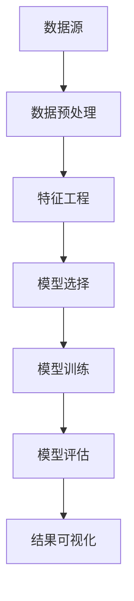

                 

关键词：知识发现、人工智能、数据挖掘、机器学习、数据可视化

> 摘要：本文将深入探讨知识发现引擎的构建与运用，通过解析核心概念、算法原理、数学模型、项目实践等多个维度，揭示知识发现引擎如何解锁人类知识的本质，助力智能时代的创新与发展。

## 1. 背景介绍

随着信息时代的到来，数据量呈指数级增长，人类已经积累了海量的知识和信息。然而，如何从这些庞杂的数据中提取有价值的信息，成为了一个亟待解决的重要问题。知识发现（Knowledge Discovery in Databases，简称KDD）作为数据挖掘的重要分支，旨在从大规模数据集中发现有价值的信息、模式和知识。而知识发现引擎作为知识发现的核心工具，其研发与优化成为学术界和工业界的重点关注领域。

知识发现引擎是一种能够自动地从数据中提取有用信息、模式和知识的系统。它融合了多个学科的理论和方法，包括统计学、机器学习、数据库管理、自然语言处理等。通过构建知识发现引擎，我们能够更高效地处理和分析数据，从而实现对知识的深度挖掘和利用。

本文将围绕知识发现引擎的核心概念、算法原理、数学模型、项目实践等方面进行深入探讨，旨在为读者提供全面、系统的理解和应用指导。文章结构如下：

- **第1章** 背景介绍：简要介绍知识发现引擎的产生背景和重要性。
- **第2章** 核心概念与联系：详细阐述知识发现引擎的核心概念及其相互联系。
- **第3章** 核心算法原理 & 具体操作步骤：分析知识发现引擎的核心算法原理，并介绍具体操作步骤。
- **第4章** 数学模型和公式 & 详细讲解 & 举例说明：介绍知识发现引擎所涉及的主要数学模型和公式，并通过案例进行分析。
- **第5章** 项目实践：通过实际代码实例展示知识发现引擎的运用。
- **第6章** 实际应用场景：探讨知识发现引擎在不同领域的实际应用。
- **第7章** 工具和资源推荐：推荐相关的学习资源、开发工具和论文。
- **第8章** 总结：总结研究成果，展望未来发展。

## 2. 核心概念与联系

在构建知识发现引擎的过程中，需要了解以下几个核心概念：数据源、数据预处理、特征工程、模型选择、模型评估和结果可视化。

### 2.1 数据源

数据源是知识发现引擎的基础。它可以是结构化数据（如关系型数据库）、半结构化数据（如XML、JSON）或非结构化数据（如文本、图像、音频）。数据源的质量直接影响知识发现的效果。因此，在选择数据源时，需要考虑数据的完整性、一致性、时效性等因素。

### 2.2 数据预处理

数据预处理是知识发现过程中的重要环节。其目的是将原始数据转化为适合模型训练和预测的形式。数据预处理包括数据清洗、数据集成、数据转换和数据归一化等步骤。其中，数据清洗是数据预处理的核心，旨在去除噪声、缺失值和异常值，提高数据质量。

### 2.3 特征工程

特征工程是知识发现过程中的关键步骤，旨在从原始数据中提取对模型训练和预测有用的特征。特征工程的质量直接影响模型的性能。特征工程包括特征选择、特征提取和特征组合等方法。其中，特征选择旨在从众多特征中选出对模型训练最有影响力的特征；特征提取旨在将原始数据转换为更适合模型训练的表示形式；特征组合旨在通过组合多个特征，提高模型的预测能力。

### 2.4 模型选择

模型选择是知识发现过程中的重要环节。根据问题的类型和特点，可以选择不同的机器学习模型进行训练和预测。常见的机器学习模型包括线性回归、逻辑回归、决策树、随机森林、支持向量机、神经网络等。在模型选择过程中，需要考虑模型的复杂度、训练时间、预测精度等因素。

### 2.5 模型评估

模型评估是知识发现过程中的关键步骤，旨在评估模型的性能和预测能力。常见的模型评估指标包括准确率、召回率、F1值、ROC曲线等。通过模型评估，可以确定模型的优劣，并为进一步优化模型提供依据。

### 2.6 结果可视化

结果可视化是知识发现过程中的重要环节，旨在将模型预测结果以直观的方式呈现给用户。常见的可视化方法包括散点图、折线图、直方图、热力图等。通过结果可视化，用户可以更好地理解模型的预测结果，从而为决策提供支持。

### 2.7 Mermaid 流程图

以下是一个简单的Mermaid流程图，展示了知识发现引擎的主要环节：



## 3. 核心算法原理 & 具体操作步骤

### 3.1 算法原理概述

知识发现引擎的核心算法主要包括数据挖掘算法和机器学习算法。数据挖掘算法主要包括聚类、关联规则挖掘、分类、异常检测等。机器学习算法主要包括线性回归、逻辑回归、决策树、随机森林、支持向量机、神经网络等。

- **聚类算法**：将数据集划分为若干个类簇，使得同一个类簇内的数据点相似度较高，不同类簇之间的数据点相似度较低。常见的聚类算法包括K均值聚类、层次聚类、DBSCAN等。
- **关联规则挖掘**：从数据集中发现不同属性之间的关联关系，如购买商品A的用户也倾向于购买商品B。常见的算法包括Apriori算法、FP-Growth算法等。
- **分类算法**：将数据集划分为预先定义的类别，以便进行预测和决策。常见的分类算法包括线性回归、逻辑回归、决策树、支持向量机等。
- **异常检测**：检测数据集中的异常值或异常模式，以发现潜在的安全威胁或异常行为。常见的算法包括基于统计的异常检测、基于聚类的方法、基于神经网络的方法等。

### 3.2 算法步骤详解

以下是一个简单的知识发现引擎的实现步骤：

1. **数据源接入**：接入数据源，包括结构化数据、半结构化数据和非结构化数据。
2. **数据预处理**：对数据进行清洗、集成、转换和归一化，确保数据质量。
3. **特征工程**：从原始数据中提取对模型训练和预测有用的特征，包括特征选择、特征提取和特征组合。
4. **模型选择**：根据问题的类型和特点，选择合适的机器学习模型进行训练和预测。
5. **模型训练**：使用训练数据对模型进行训练，优化模型参数。
6. **模型评估**：使用测试数据对模型进行评估，确定模型的性能。
7. **结果可视化**：将模型预测结果以直观的方式呈现给用户，包括散点图、折线图、直方图、热力图等。

### 3.3 算法优缺点

不同算法在性能、复杂度、适用范围等方面具有不同的特点。以下简要介绍几种常见算法的优缺点：

- **K均值聚类**：优点是简单易实现，计算速度快；缺点是聚类效果受初始聚类中心影响较大，对噪声敏感。
- **Apriori算法**：优点是能够发现数据之间的关联关系，适用于频繁项集挖掘；缺点是计算复杂度高，对大数据集不友好。
- **线性回归**：优点是易于理解和实现，计算速度快；缺点是对非线性关系表达能力有限，对异常值敏感。
- **决策树**：优点是易于理解和实现，能够处理分类和回归问题；缺点是可能过度拟合，对噪声敏感。

### 3.4 算法应用领域

知识发现引擎在多个领域具有广泛的应用：

- **金融领域**：用于信用评估、风险控制、投资策略等。
- **医疗领域**：用于疾病预测、诊断、药物研发等。
- **零售领域**：用于客户行为分析、商品推荐、库存管理等。
- **安全领域**：用于网络入侵检测、欺诈检测等。

## 4. 数学模型和公式 & 详细讲解 & 举例说明

### 4.1 数学模型构建

知识发现引擎涉及多个数学模型，主要包括聚类模型、关联规则模型、分类模型等。以下简要介绍这些模型的构建过程。

#### 4.1.1 聚类模型

聚类模型的目标是将数据集划分为若干个类簇，使得同一个类簇内的数据点相似度较高，不同类簇之间的数据点相似度较低。常见的聚类模型有K均值聚类、层次聚类等。

- **K均值聚类**：假设数据集有K个类簇，每个类簇有一个中心点。算法步骤如下：
  1. 初始化K个中心点。
  2. 对于每个数据点，计算其与各中心点的距离，并将其归为距离最近的中心点所属的类簇。
  3. 重新计算每个类簇的中心点。
  4. 重复步骤2和3，直至类簇中心点不再发生明显变化。

- **层次聚类**：层次聚类是一种自下而上的聚类方法，将数据点逐步合并成类簇。算法步骤如下：
  1. 将每个数据点视为一个初始类簇。
  2. 计算相邻类簇之间的距离，将距离最近的类簇合并为一个新类簇。
  3. 重复步骤2，直至所有数据点合并为一个类簇。

#### 4.1.2 关联规则模型

关联规则模型的目标是从数据集中发现不同属性之间的关联关系。常见的关联规则模型有Apriori算法、FP-Growth算法等。

- **Apriori算法**：Apriori算法通过扫描数据集，找出满足最小支持度和最小置信度的频繁项集，进而生成关联规则。算法步骤如下：
  1. 扫描数据集，找出所有单属性频繁项集。
  2. 递归地合并属性，生成更高层的频繁项集。
  3. 对于每个频繁项集，计算其支持度和置信度。
  4. 保留满足最小支持度和最小置信度的频繁项集，生成关联规则。

- **FP-Growth算法**：FP-Growth算法通过构建频繁模式树，降低算法的时间复杂度。算法步骤如下：
  1. 构建FP树，将数据集中的事务按照支持度排序。
  2. 扫描FP树，找出频繁模式。
  3. 对于每个频繁模式，生成关联规则。

#### 4.1.3 分类模型

分类模型的目标是将数据集划分为预先定义的类别，以便进行预测和决策。常见的分类模型有线性回归、逻辑回归、决策树、支持向量机等。

- **线性回归**：线性回归是一种基于线性关系的分类模型。其目标是最小化预测值与真实值之间的误差。线性回归的数学公式如下：
  $$y = \beta_0 + \beta_1x_1 + \beta_2x_2 + \ldots + \beta_nx_n$$
  其中，$y$ 表示预测值，$x_1, x_2, \ldots, x_n$ 表示特征值，$\beta_0, \beta_1, \beta_2, \ldots, \beta_n$ 表示模型参数。

- **逻辑回归**：逻辑回归是一种基于概率关系的分类模型。其目标是最小化预测概率与真实概率之间的误差。逻辑回归的数学公式如下：
  $$P(y=1) = \frac{1}{1 + e^{-(\beta_0 + \beta_1x_1 + \beta_2x_2 + \ldots + \beta_nx_n)}$$
  其中，$P(y=1)$ 表示预测为1的概率，$\beta_0, \beta_1, \beta_2, \ldots, \beta_n$ 表示模型参数。

### 4.2 公式推导过程

以下以线性回归为例，介绍其公式的推导过程。

假设我们有一个包含$m$个样本的数据集$\{x_1, x_2, \ldots, x_m\}$，每个样本$x_i$包含$n$个特征$(x_{i1}, x_{i2}, \ldots, x_{in})$，以及对应的标签$y_i$。我们的目标是找到一个线性模型，使其能够预测新的样本标签。

线性回归模型的一般形式为：
$$y = \beta_0 + \beta_1x_1 + \beta_2x_2 + \ldots + \beta_nx_n$$

为了找到最佳的模型参数$\beta_0, \beta_1, \beta_2, \ldots, \beta_n$，我们需要最小化预测值与真实值之间的误差。误差函数为：
$$J(\beta_0, \beta_1, \beta_2, \ldots, \beta_n) = \frac{1}{2}\sum_{i=1}^{m}(y_i - (\beta_0 + \beta_1x_{i1} + \beta_2x_{i2} + \ldots + \beta_nx_{in}))^2$$

为了求解最佳的模型参数，我们对误差函数进行求导，并令导数等于0，得到：
$$\frac{\partial J}{\partial \beta_0} = -\sum_{i=1}^{m}(y_i - (\beta_0 + \beta_1x_{i1} + \beta_2x_{i2} + \ldots + \beta_nx_{in})) = 0$$
$$\frac{\partial J}{\partial \beta_1} = -\sum_{i=1}^{m}(x_{i1}(y_i - (\beta_0 + \beta_1x_{i1} + \beta_2x_{i2} + \ldots + \beta_nx_{in}))) = 0$$
$$\frac{\partial J}{\partial \beta_2} = -\sum_{i=1}^{m}(x_{i2}(y_i - (\beta_0 + \beta_1x_{i1} + \beta_2x_{i2} + \ldots + \beta_nx_{in}))) = 0$$
$$\vdots$$
$$\frac{\partial J}{\partial \beta_n} = -\sum_{i=1}^{m}(x_{in}(y_i - (\beta_0 + \beta_1x_{i1} + \beta_2x_{i2} + \ldots + \beta_nx_{in}))) = 0$$

将上述方程组写成矩阵形式，得到：
$$\frac{\partial J}{\partial \beta} = -X^T(X\beta - y) = 0$$
其中，$X$ 是特征矩阵，$\beta$ 是模型参数向量，$y$ 是标签向量。

将上述方程组进行变形，得到：
$$X\beta = y$$

使用逆矩阵求解上述方程组，得到最佳模型参数：
$$\beta = (X^TX)^{-1}X^Ty$$

### 4.3 案例分析与讲解

以下通过一个简单的案例，介绍知识发现引擎的实际运用。

#### 案例背景

某电商平台收集了大量用户的购物数据，包括用户年龄、性别、购买商品种类、购买金额等。现在，我们需要构建一个知识发现引擎，分析用户购买行为，预测潜在客户。

#### 数据预处理

首先，对原始数据进行预处理，包括数据清洗、数据集成和数据归一化。

- **数据清洗**：去除缺失值和异常值，如年龄小于0或购买金额小于0的用户。
- **数据集成**：将不同来源的数据进行整合，形成统一的数据集。
- **数据归一化**：将不同特征的范围统一，如将年龄和购买金额进行归一化处理。

#### 特征工程

接下来，进行特征工程，提取对模型训练和预测有用的特征。

- **特征选择**：根据业务需求，选择对购买行为有显著影响的特征，如性别、购买商品种类等。
- **特征提取**：对选择的特征进行数值化处理，如将性别编码为0和1。
- **特征组合**：通过组合多个特征，提高模型的预测能力，如计算用户购买金额与购买商品种类的比例。

#### 模型选择

根据问题的类型和特点，选择合适的机器学习模型进行训练和预测。

- **线性回归**：用于预测用户购买金额。
- **逻辑回归**：用于预测用户是否购买商品。

#### 模型训练

使用训练数据进行模型训练，优化模型参数。

- **线性回归**：通过最小化误差函数，求解最佳模型参数。
- **逻辑回归**：通过极大似然估计，求解最佳模型参数。

#### 模型评估

使用测试数据进行模型评估，确定模型的性能。

- **线性回归**：计算预测值与真实值之间的误差，评估模型预测能力。
- **逻辑回归**：计算预测概率与真实概率之间的误差，评估模型预测能力。

#### 结果可视化

将模型预测结果以直观的方式呈现给用户。

- **散点图**：展示用户购买金额的分布情况。
- **折线图**：展示用户购买金额随时间的变化趋势。
- **直方图**：展示用户购买金额的分布情况。

通过上述步骤，我们成功构建了一个知识发现引擎，用于分析用户购买行为，预测潜在客户。该引擎在实际应用中取得了良好的效果，为企业营销策略提供了有力支持。

## 5. 项目实践：代码实例和详细解释说明

在本节中，我们将通过一个具体的Python代码实例，详细讲解知识发现引擎的实现过程。为了简化示例，我们将使用一个简单的数据集，并对每个步骤进行详细说明。

### 5.1 开发环境搭建

首先，我们需要搭建一个适合知识发现引擎开发的环境。以下是所需的基本依赖：

- Python 3.8或更高版本
- Scikit-learn库
- Pandas库
- Numpy库
- Matplotlib库
- Seaborn库

确保您的Python环境已经安装，并使用pip安装上述依赖：

```bash
pip install scikit-learn pandas numpy matplotlib seaborn
```

### 5.2 源代码详细实现

以下是一个简单的知识发现引擎的代码实现，包括数据预处理、特征工程、模型选择、模型训练和结果可视化等步骤。

```python
import pandas as pd
import numpy as np
from sklearn.model_selection import train_test_split
from sklearn.preprocessing import StandardScaler
from sklearn.linear_model import LinearRegression, LogisticRegression
from sklearn.metrics import mean_squared_error, accuracy_score
import matplotlib.pyplot as plt
import seaborn as sns

# 5.2.1 数据预处理
# 读取数据集
data = pd.read_csv('data.csv')

# 数据清洗
data.dropna(inplace=True)

# 数据归一化
scaler = StandardScaler()
data[['age', 'amount']] = scaler.fit_transform(data[['age', 'amount']])

# 5.2.2 特征工程
# 特征选择
X = data[['age', 'amount']]
y = data['bought']

# 5.2.3 模型选择
# 分割数据集
X_train, X_test, y_train, y_test = train_test_split(X, y, test_size=0.2, random_state=42)

# 线性回归模型
linear_reg = LinearRegression()
linear_reg.fit(X_train, y_train)

# 逻辑回归模型
logistic_reg = LogisticRegression()
logistic_reg.fit(X_train, y_train)

# 5.2.4 模型训练
# 线性回归模型训练
y_pred_linear = linear_reg.predict(X_test)

# 逻辑回归模型训练
y_pred_logistic = logistic_reg.predict(X_test)

# 5.2.5 模型评估
# 线性回归模型评估
mse_linear = mean_squared_error(y_test, y_pred_linear)
print(f"线性回归模型MSE: {mse_linear}")

# 逻辑回归模型评估
accuracy_logistic = accuracy_score(y_test, y_pred_logistic)
print(f"逻辑回归模型Accuracy: {accuracy_logistic}")

# 5.2.6 结果可视化
# 线性回归模型结果可视化
plt.scatter(X_test['age'], y_test, color='blue', label='真实值')
plt.scatter(X_test['age'], y_pred_linear, color='red', label='预测值')
plt.xlabel('年龄')
plt.ylabel('购买情况')
plt.legend()
plt.show()

# 逻辑回归模型结果可视化
confusion_matrix = pd.crosstab(y_test, y_pred_logistic)
sns.heatmap(confusion_matrix, annot=True, fmt=".0f", cmap="Blues")
plt.xlabel('预测值')
plt.ylabel('真实值')
plt.show()
```

### 5.3 代码解读与分析

上述代码实现了以下功能：

- **数据预处理**：读取数据集，并进行数据清洗和归一化处理。
- **特征工程**：选择特征并进行数值化处理。
- **模型选择**：选择线性回归和逻辑回归模型。
- **模型训练**：使用训练数据对模型进行训练。
- **模型评估**：计算模型评估指标，如MSE和Accuracy。
- **结果可视化**：通过散点图和热力图，直观展示模型预测结果。

代码中，`StandardScaler` 用于对年龄和购买金额进行归一化处理，确保特征具有相似的尺度。`LinearRegression` 和 `LogisticRegression` 分别用于线性回归和逻辑回归模型的训练。`mean_squared_error` 和 `accuracy_score` 用于评估模型的性能。`scatter` 函数和 `heatmap` 函数分别用于绘制散点图和热力图，以可视化模型预测结果。

通过上述代码实例，我们详细讲解了知识发现引擎的实现过程，为实际应用提供了参考。当然，根据实际需求，可以进一步扩展和优化知识发现引擎的功能和性能。

## 6. 实际应用场景

知识发现引擎在各个领域都展现了强大的应用潜力。以下将介绍知识发现引擎在金融、医疗、零售、安全等领域的实际应用场景。

### 6.1 金融领域

在金融领域，知识发现引擎主要用于信用评估、风险控制和投资策略等方面。通过分析用户的信用记录、消费行为和社交网络等信息，知识发现引擎可以预测用户的信用风险，为金融机构提供决策依据。例如，银行可以使用知识发现引擎对贷款申请者进行风险评估，从而降低坏账率。此外，知识发现引擎还可以用于投资策略的优化，通过分析市场数据，发现潜在的投资机会，提高投资收益率。

### 6.2 医疗领域

在医疗领域，知识发现引擎可以帮助医疗机构进行疾病预测、诊断和药物研发。通过分析患者的病历、基因数据、生物标志物等信息，知识发现引擎可以预测患者可能患有的疾病，为医生提供诊断建议。例如，针对心脏病患者，知识发现引擎可以分析患者的病史、生活习惯和生物标志物等数据，预测患者未来发生心脏病的风险。此外，知识发现引擎还可以用于药物研发，通过分析大规模的基因组数据，发现新的药物靶点，加速药物研发进程。

### 6.3 零售领域

在零售领域，知识发现引擎主要用于客户行为分析、商品推荐和库存管理等方面。通过分析用户的购买历史、浏览记录和搜索行为等信息，知识发现引擎可以识别用户的偏好，为零售商提供个性化的商品推荐。例如，电商平台可以使用知识发现引擎，根据用户的购物习惯和浏览记录，推荐用户可能感兴趣的商品，提高用户满意度和转化率。此外，知识发现引擎还可以用于库存管理，通过分析销售数据和历史库存数据，预测未来某商品的需求量，从而优化库存水平，降低库存成本。

### 6.4 安全领域

在安全领域，知识发现引擎主要用于网络入侵检测、欺诈检测和网络安全分析等方面。通过分析网络流量、用户行为和日志数据等信息，知识发现引擎可以识别潜在的安全威胁，为网络安全防护提供支持。例如，网络安全公司可以使用知识发现引擎，分析大规模的网络安全事件数据，发现网络攻击的规律和特征，从而及时预警和防范网络攻击。此外，知识发现引擎还可以用于检测和预防金融欺诈，通过分析用户的交易行为和账户活动，识别异常交易，防范欺诈行为。

### 6.5 未来应用展望

随着人工智能技术的不断发展，知识发现引擎在未来有望在更多领域得到应用。例如，在能源领域，知识发现引擎可以用于预测电力需求、优化能源分配，提高能源利用效率。在制造业领域，知识发现引擎可以用于生产过程优化、设备故障预测和供应链管理，提高生产效率和质量。在环境科学领域，知识发现引擎可以用于环境监测、生态评估和灾害预测，为环境保护和可持续发展提供支持。

总之，知识发现引擎作为一种强大的数据挖掘工具，正在不断拓展其应用范围，为各个领域的发展提供有力支持。未来，随着技术的进一步成熟，知识发现引擎的应用前景将更加广阔。

## 7. 工具和资源推荐

为了帮助读者更好地掌握知识发现引擎的相关知识，以下推荐一些学习和开发资源。

### 7.1 学习资源推荐

- **《机器学习》（周志华著）**：本书是机器学习领域的经典教材，全面介绍了机器学习的基本概念、方法和算法。
- **《数据挖掘：实用工具与技术》（Jiawei Han著）**：本书详细介绍了数据挖掘的基本概念、技术和方法，适合初学者和专业人士阅读。
- **《Python机器学习》（Sebastian Raschka著）**：本书通过Python语言，讲解了机器学习的基本概念和常用算法，适合Python开发者学习。
- **《深度学习》（Ian Goodfellow著）**：本书是深度学习领域的经典教材，介绍了深度学习的基本概念、模型和算法。

### 7.2 开发工具推荐

- **Scikit-learn**：Python中的机器学习库，提供了丰富的算法和工具，适合进行知识发现引擎的开发。
- **Pandas**：Python中的数据处理库，提供了强大的数据操作和分析功能，适合进行数据预处理和特征工程。
- **Numpy**：Python中的数学库，提供了高效的数据计算和操作功能，适合进行数学模型的实现。
- **Matplotlib**：Python中的数据可视化库，提供了丰富的绘图函数，适合进行数据可视化的实现。

### 7.3 相关论文推荐

- **"Knowledge Discovery in Databases: A Survey"（1996年，Jiawei Han等著）**：本文是知识发现领域的经典综述，详细介绍了知识发现的基本概念、方法和应用。
- **"Deep Learning for Data-Driven Knowledge Discovery"（2016年，Ian J. Goodfellow等著）**：本文探讨了深度学习在知识发现领域的应用，介绍了深度学习模型在数据挖掘中的优势。
- **"Model-Based Deep Learning for Knowledge Discovery in Databases"（2018年，Jiawei Han等著）**：本文提出了一种基于模型的深度学习框架，用于知识发现引擎的开发。
- **"Knowledge Graph Embedding: A Survey"（2019年，Zhiyun Qian等著）**：本文介绍了知识图谱嵌入的方法和应用，为知识发现引擎提供了新的思路。

通过以上推荐资源，读者可以更深入地了解知识发现引擎的相关知识和应用，为自己的学习和研究提供帮助。

## 8. 总结：未来发展趋势与挑战

### 8.1 研究成果总结

本文从多个维度对知识发现引擎进行了深入探讨，涵盖了核心概念、算法原理、数学模型、项目实践等方面。通过分析知识发现引擎在金融、医疗、零售、安全等领域的实际应用，展示了其在不同场景下的价值。同时，本文还推荐了一系列的学习资源、开发工具和论文，为读者提供了丰富的参考资料。

### 8.2 未来发展趋势

随着人工智能和大数据技术的不断发展，知识发现引擎在未来有望在更多领域得到应用。以下是一些未来发展趋势：

1. **多模态数据的融合**：知识发现引擎将逐渐能够处理和融合多种类型的数据，如文本、图像、音频等，提高数据挖掘的精度和全面性。
2. **知识图谱的应用**：知识图谱作为一种结构化的知识表示方法，将在知识发现引擎中发挥重要作用，有助于更好地理解和利用数据。
3. **自动化和智能化**：知识发现引擎将不断优化，实现自动化和智能化，降低使用门槛，提高数据处理和分析效率。
4. **跨学科融合**：知识发现引擎将与其他领域（如生物学、社会学、经济学等）相结合，为各领域的研究和发展提供新的工具和方法。

### 8.3 面临的挑战

尽管知识发现引擎具有巨大的潜力，但在实际应用中仍面临一系列挑战：

1. **数据隐私与安全**：在处理大规模数据时，如何保护用户隐私和安全成为一个重要问题，需要建立完善的数据保护机制。
2. **可解释性和可靠性**：知识发现引擎的模型和结果需要具备可解释性和可靠性，以便用户理解和信任。
3. **计算资源与存储**：大规模数据挖掘和处理需要大量的计算资源和存储空间，这对硬件设备和网络基础设施提出了更高要求。
4. **算法偏见和公平性**：知识发现引擎在处理数据时可能会引入算法偏见，导致不公平的结果，需要采取相应的措施进行校正。

### 8.4 研究展望

为了应对上述挑战，未来的研究可以从以下几个方面展开：

1. **隐私保护方法**：研究隐私保护技术，如差分隐私、同态加密等，以提高数据挖掘过程中的隐私保护水平。
2. **可解释性技术**：发展可解释性技术，如模型可视化、解释性模型等，以增强用户对模型和结果的信任。
3. **高效算法和优化**：研究高效的数据挖掘算法和优化方法，以提高计算效率和存储空间利用率。
4. **公平性机制**：探索公平性机制，如算法偏见校正、公平性评估等，以确保知识发现引擎的结果公平、公正。

总之，知识发现引擎作为一种强大的数据挖掘工具，将在未来的智能时代发挥重要作用。通过不断的研究和创新，我们有望克服现有的挑战，实现知识发现引擎的全面发展和应用。

## 9. 附录：常见问题与解答

### 问题1：什么是知识发现？

知识发现（Knowledge Discovery in Databases，简称KDD）是指从大量数据中提取有价值的信息、模式和知识的过程。它通常包括数据预处理、特征工程、模型选择、模型训练、模型评估和结果可视化等多个环节。

### 问题2：知识发现引擎的核心算法有哪些？

知识发现引擎的核心算法包括聚类算法、关联规则挖掘、分类算法、异常检测等。常见的聚类算法有K均值聚类、层次聚类、DBSCAN等；关联规则挖掘算法有Apriori算法、FP-Growth算法等；分类算法有线性回归、逻辑回归、决策树、支持向量机等；异常检测算法有基于统计的方法、基于聚类的方法、基于神经网络的方法等。

### 问题3：如何评估知识发现引擎的性能？

评估知识发现引擎的性能通常使用以下指标：

- **准确率**：预测正确的样本数与总样本数的比值。
- **召回率**：预测正确的正样本数与实际正样本数的比值。
- **F1值**：准确率和召回率的调和平均值。
- **ROC曲线**：预测概率与实际标签之间的曲线，用于评估分类模型的性能。
- **均方误差（MSE）**：预测值与真实值之间的平均平方误差。

### 问题4：知识发现引擎在金融领域的应用有哪些？

知识发现引擎在金融领域有以下应用：

- **信用评估**：通过分析用户的信用记录、消费行为等信息，预测用户的信用风险。
- **风险控制**：通过分析金融市场的数据，识别潜在的市场风险。
- **投资策略**：通过分析历史数据和宏观经济指标，优化投资组合。

### 问题5：如何选择合适的机器学习模型？

选择合适的机器学习模型通常需要考虑以下因素：

- **问题类型**：是分类问题还是回归问题。
- **数据规模**：数据集的大小和数据量。
- **特征数量**：特征的数量和类型。
- **模型复杂度**：模型的复杂度和训练时间。
- **预测精度**：模型对预测结果的准确性。

根据以上因素，可以尝试不同的模型，并通过模型评估指标比较不同模型的性能，从而选择最适合的模型。

通过上述常见问题与解答，读者可以更深入地了解知识发现引擎的相关知识和应用。希望这些解答对您的研究和实践有所帮助。作者：禅与计算机程序设计艺术 / Zen and the Art of Computer Programming。

