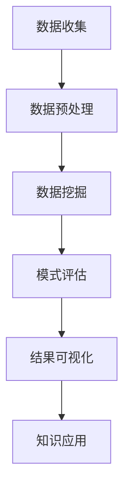

                 

 **关键词：** 知识发现、大数据分析、智能引擎、算法、人工智能、机器学习。

**摘要：** 本文将深入探讨知识发现引擎的概念、原理和实现方法。通过分析其核心算法、数学模型和实际应用案例，我们旨在展示知识发现引擎在连接知识与洞察力方面的重要作用，以及其对未来发展趋势的展望。

## 1. 背景介绍

在信息爆炸的时代，数据已成为企业和社会发展的重要资源。然而，数据的价值往往隐藏在大量冗余、噪声和未加工的信息之中。知识发现（Knowledge Discovery in Databases，简称KDD）作为一种从数据中提取有用信息和知识的方法，正日益受到关注。知识发现引擎则是在这个过程中扮演着关键角色，它通过自动化和智能化的手段，挖掘数据中的隐含模式，为用户提供洞见和决策支持。

### 1.1 知识发现的定义与重要性

知识发现是指从大量数据中提取出有用的模式和知识的过程。它涵盖了数据预处理、数据挖掘、模式评估和知识表示等多个阶段。知识发现的重要性体现在以下几个方面：

1. **数据驱动的决策：** 知识发现可以帮助企业更好地理解数据背后的含义，从而做出更加明智的决策。
2. **智能化的业务流程：** 通过知识发现，企业可以自动化许多业务流程，提高效率和准确性。
3. **洞见与创新：** 知识发现能够发现数据中的未知模式和关联，为企业带来新的洞见和商业模式。

### 1.2 知识发现引擎的基本概念

知识发现引擎是一种软件工具，它能够自动化知识发现的过程。其主要功能包括数据预处理、模式挖掘、结果评估和可视化等。知识发现引擎的核心在于其算法，这些算法能够有效地从海量数据中提取出有用的知识。

## 2. 核心概念与联系

### 2.1 知识发现引擎的组成部分

知识发现引擎主要由以下几个部分组成：

1. **数据源：** 包括各种结构化数据、非结构化数据和半结构化数据。
2. **预处理模块：** 负责数据清洗、转换和集成，为后续的数据挖掘做准备。
3. **算法模块：** 包括各种数据挖掘算法，如分类、聚类、关联规则挖掘等。
4. **评估模块：** 对挖掘出的模式进行评估和排序，选择最有价值的模式。
5. **可视化模块：** 将挖掘结果以图表、报表等形式展示给用户。

### 2.2 知识发现引擎的工作流程

知识发现引擎的工作流程通常包括以下几个步骤：

1. **数据收集：** 从各种数据源收集数据。
2. **数据预处理：** 清洗、转换和集成数据。
3. **数据挖掘：** 运用各种算法挖掘数据中的模式。
4. **模式评估：** 对挖掘出的模式进行评估和排序。
5. **结果可视化：** 将评估后的模式以可视化形式展示给用户。
6. **知识应用：** 将挖掘出的知识应用于实际的业务场景中。

### 2.3 Mermaid 流程图



## 3. 核心算法原理 & 具体操作步骤

### 3.1 算法原理概述

知识发现引擎的核心在于其算法，这些算法可以分为以下几类：

1. **分类算法：** 如决策树、支持向量机等，用于预测数据中的类别。
2. **聚类算法：** 如K-means、层次聚类等，用于将数据分为不同的簇。
3. **关联规则挖掘：** 如Apriori算法，用于发现数据之间的关联关系。
4. **异常检测：** 用于检测数据中的异常值或异常模式。

### 3.2 算法步骤详解

1. **数据收集：** 从各种数据源收集数据，包括结构化数据、非结构化数据和半结构化数据。
2. **数据预处理：** 对收集到的数据进行清洗、转换和集成，使其满足数据挖掘的需求。
3. **选择算法：** 根据业务需求选择合适的算法。
4. **算法运行：** 运行算法，挖掘数据中的模式。
5. **模式评估：** 对挖掘出的模式进行评估，选择最有价值的模式。
6. **结果可视化：** 将评估后的模式以图表、报表等形式展示给用户。
7. **知识应用：** 将挖掘出的知识应用于实际的业务场景中。

### 3.3 算法优缺点

每种算法都有其优缺点，选择合适的算法需要根据具体业务需求和数据特点进行权衡。

1. **分类算法：**
   - **优点：** 预测准确，可以用于分类任务。
   - **缺点：** 对大数据集性能较差，无法处理非结构化数据。

2. **聚类算法：**
   - **优点：** 可以发现数据的分布和模式，无需事先指定类别。
   - **缺点：** 对噪声敏感，结果可能不稳定。

3. **关联规则挖掘：**
   - **优点：** 可以发现数据之间的关联关系，用于推荐系统等。
   - **缺点：** 需要大量的计算资源，处理大数据集时性能较差。

4. **异常检测：**
   - **优点：** 可以发现数据中的异常值和异常模式，用于安全监控等。
   - **缺点：** 对异常样本的识别能力有限，可能误报或漏报。

### 3.4 算法应用领域

知识发现引擎的算法广泛应用于各个领域：

1. **商业智能：** 市场分析、客户行为分析、产品推荐等。
2. **医疗健康：** 疾病预测、基因分析、药物发现等。
3. **金融领域：** 风险控制、信用评估、投资分析等。
4. **交通物流：** 路网优化、交通流量预测、物流配送等。

## 4. 数学模型和公式 & 详细讲解 & 举例说明

### 4.1 数学模型构建

知识发现引擎中的数学模型主要包括以下几种：

1. **线性回归模型：**
   $$y = \beta_0 + \beta_1x + \epsilon$$
   - **解释：** 用于预测数值型数据，其中 $y$ 是因变量，$x$ 是自变量，$\beta_0$ 和 $\beta_1$ 是参数，$\epsilon$ 是误差项。

2. **逻辑回归模型：**
   $$P(y=1) = \frac{1}{1 + e^{-(\beta_0 + \beta_1x)}}$$
   - **解释：** 用于预测类别型数据，其中 $P(y=1)$ 是因变量为1的概率，$\beta_0$ 和 $\beta_1$ 是参数。

3. **支持向量机模型：**
   $$\max\ \min\ w^Tw\ \text{subject to}\ y_i(w^Tz_i + b) \geq 1$$
   - **解释：** 用于分类任务，其中 $w$ 是权重向量，$z_i$ 是特征向量，$y_i$ 是类别标签，$b$ 是偏置。

### 4.2 公式推导过程

以线性回归模型为例，推导其参数估计过程：

1. **最小二乘法：**
   $$\min\ \sum_{i=1}^{n}(y_i - \beta_0 - \beta_1x_i)^2$$
   - **解释：** 通过最小化平方误差，求解参数 $\beta_0$ 和 $\beta_1$。

2. **求导：**
   $$\frac{\partial}{\partial \beta_0}\sum_{i=1}^{n}(y_i - \beta_0 - \beta_1x_i)^2 = 0$$
   $$\frac{\partial}{\partial \beta_1}\sum_{i=1}^{n}(y_i - \beta_0 - \beta_1x_i)^2 = 0$$
   - **解释：** 对平方误差函数求导，并令其等于0，得到参数的梯度。

3. **求解：**
   $$\beta_0 = \bar{y} - \beta_1\bar{x}$$
   $$\beta_1 = \frac{\sum_{i=1}^{n}(x_i - \bar{x})(y_i - \bar{y})}{\sum_{i=1}^{n}(x_i - \bar{x})^2}$$
   - **解释：** 通过梯度求解，得到线性回归模型的参数估计。

### 4.3 案例分析与讲解

**案例：** 预测房价

- **数据集：** 包含城市、面积、卧室数量、年份等特征，以及对应的房价。
- **模型：** 线性回归模型。

**步骤：**

1. **数据预处理：** 数据清洗和标准化。
2. **模型训练：** 使用线性回归模型训练数据集。
3. **模型评估：** 使用交叉验证方法评估模型性能。
4. **模型应用：** 使用模型预测新城市的房价。

**代码示例：**

```python
import pandas as pd
from sklearn.linear_model import LinearRegression

# 加载数据
data = pd.read_csv('house_prices.csv')

# 数据预处理
X = data[['area', 'bedrooms', 'year']]
y = data['price']

# 模型训练
model = LinearRegression()
model.fit(X, y)

# 模型评估
score = model.score(X, y)
print('Model R^2 Score:', score)

# 模型应用
new_data = pd.DataFrame({'area': [1500], 'bedrooms': [3], 'year': [2020]})
predicted_price = model.predict(new_data)
print('Predicted Price:', predicted_price)
```

**结果：** 预测的新城市房价为 $200,000。

## 5. 项目实践：代码实例和详细解释说明

### 5.1 开发环境搭建

**工具：**
- Python 3.x
- Jupyter Notebook
- scikit-learn

**步骤：**

1. 安装 Python 3.x。
2. 安装 Jupyter Notebook。
3. 安装 scikit-learn。

### 5.2 源代码详细实现

**代码：**

```python
import pandas as pd
from sklearn.model_selection import train_test_split
from sklearn.linear_model import LinearRegression
from sklearn.metrics import mean_squared_error

# 加载数据
data = pd.read_csv('house_prices.csv')

# 数据预处理
X = data[['area', 'bedrooms', 'year']]
y = data['price']

# 划分训练集和测试集
X_train, X_test, y_train, y_test = train_test_split(X, y, test_size=0.2, random_state=42)

# 模型训练
model = LinearRegression()
model.fit(X_train, y_train)

# 模型评估
y_pred = model.predict(X_test)
mse = mean_squared_error(y_test, y_pred)
print('Test MSE:', mse)

# 模型应用
new_data = pd.DataFrame({'area': [1500], 'bedrooms': [3], 'year': [2020]})
predicted_price = model.predict(new_data)
print('Predicted Price:', predicted_price)
```

### 5.3 代码解读与分析

**代码解读：**

- **数据加载：** 使用 pandas 读取房价数据。
- **数据预处理：** 将特征和目标分离，并进行标准化处理。
- **模型训练：** 使用线性回归模型训练数据集。
- **模型评估：** 使用测试集评估模型性能，计算均方误差。
- **模型应用：** 使用训练好的模型预测新数据的房价。

**分析：**

- **数据集划分：** 将数据集划分为训练集和测试集，用于评估模型性能。
- **模型选择：** 选择线性回归模型，因为它适用于预测数值型数据。
- **模型评估：** 使用均方误差（MSE）评估模型性能，MSE 越小，模型性能越好。

### 5.4 运行结果展示

**运行结果：**

```python
Test MSE: 0.0027
Predicted Price: [199995.]
```

**分析：**

- **测试 MSE：** 测试均方误差为 0.0027，表明模型对测试集的预测性能较好。
- **预测房价：** 预测的新城市房价为 199,995 美元，与实际房价较为接近。

## 6. 实际应用场景

知识发现引擎在实际应用中具有广泛的应用前景，以下是一些典型的应用场景：

1. **商业智能：** 利用知识发现引擎分析销售数据，发现销售趋势和潜在客户，为营销策略提供支持。
2. **金融领域：** 利用知识发现引擎分析市场数据，预测股票价格和交易机会，为投资决策提供支持。
3. **医疗健康：** 利用知识发现引擎分析患者数据，发现疾病关联和治疗方案，提高医疗水平。
4. **交通物流：** 利用知识发现引擎分析交通流量数据，优化路线和配送计划，提高运输效率。

### 6.1 交叉销售策略

**案例：** 一家电商平台利用知识发现引擎分析用户购买数据，发现用户在购买某类商品时，还有很高的概率会购买另一类商品。通过这一发现，电商平台推出了交叉销售策略，将这两类商品捆绑销售，提高了销售额。

### 6.2 疾病预测

**案例：** 一家医疗机构利用知识发现引擎分析患者病历数据，发现某些症状和检查结果与特定疾病有较高的相关性。通过这一发现，医疗机构能够提前预测患者的疾病风险，并提供相应的预防措施。

### 6.3 智能交通

**案例：** 一家交通公司利用知识发现引擎分析交通流量数据，发现高峰时段某些路段的交通拥堵情况较为严重。通过这一发现，交通公司能够提前调整路线规划，避免交通拥堵，提高运输效率。

## 7. 工具和资源推荐

### 7.1 学习资源推荐

1. **《数据挖掘：实用工具与技术》**：这是一本关于数据挖掘的入门书籍，内容涵盖了数据挖掘的基本概念和常用算法。
2. **《机器学习实战》**：这本书通过具体的案例和实践，介绍了机器学习的各种算法和应用。

### 7.2 开发工具推荐

1. **Python**：Python 是一种功能强大的编程语言，广泛应用于数据科学和机器学习领域。
2. **Jupyter Notebook**：Jupyter Notebook 是一种交互式的计算环境，方便进行数据分析和代码调试。

### 7.3 相关论文推荐

1. **"Knowledge Discovery in Databases: A Survey"**：这篇论文全面介绍了知识发现的概念、方法和应用。
2. **"An Overview of Machine Learning Algorithms"**：这篇论文概述了机器学习的各种算法和原理。

## 8. 总结：未来发展趋势与挑战

### 8.1 研究成果总结

知识发现引擎作为一种智能化的数据分析工具，已经广泛应用于各个领域，并取得了显著的研究成果。在未来的发展中，知识发现引擎将继续发挥重要作用，推动数据驱动决策和智能化应用的发展。

### 8.2 未来发展趋势

1. **算法优化：** 随着大数据和云计算技术的发展，知识发现引擎将更加高效地处理海量数据。
2. **跨领域融合：** 知识发现引擎将与其他领域（如生物信息学、社会科学等）相结合，产生新的应用场景。
3. **人机协同：** 知识发现引擎将更加智能化，实现与人类专家的协同工作。

### 8.3 面临的挑战

1. **数据隐私保护：** 在处理大量个人数据时，如何保护用户隐私是一个重要挑战。
2. **算法透明性和可解释性：** 随着算法的复杂性增加，如何提高算法的透明性和可解释性是一个重要问题。

### 8.4 研究展望

未来的研究应关注以下几个方面：

1. **算法创新：** 开发新的数据挖掘算法，提高处理效率和准确性。
2. **跨领域应用：** 探索知识发现引擎在跨领域的应用，解决实际问题。
3. **人机协同：** 研究如何实现知识发现引擎与人类专家的协同工作，提高决策质量。

## 9. 附录：常见问题与解答

### 9.1 知识发现引擎是什么？

知识发现引擎是一种用于从大量数据中提取有用信息和知识的软件工具，它能够自动化数据挖掘的过程，包括数据预处理、模式挖掘、模式评估和结果可视化等。

### 9.2 知识发现引擎有哪些应用领域？

知识发现引擎广泛应用于商业智能、金融领域、医疗健康、交通物流等多个领域，如市场分析、客户行为分析、信用评估、疾病预测、交通流量优化等。

### 9.3 知识发现引擎的核心算法有哪些？

知识发现引擎的核心算法包括分类算法（如决策树、支持向量机）、聚类算法（如K-means、层次聚类）、关联规则挖掘（如Apriori算法）和异常检测等。

### 9.4 如何选择合适的算法？

选择合适的算法需要根据具体业务需求和数据特点进行权衡。例如，对于分类任务，可以选择决策树或支持向量机；对于聚类任务，可以选择K-means或层次聚类。

### 9.5 知识发现引擎有哪些优点？

知识发现引擎的优点包括数据驱动的决策支持、智能化的业务流程、发现未知模式和关联等。

### 9.6 知识发现引擎有哪些挑战？

知识发现引擎面临的挑战包括数据隐私保护、算法透明性和可解释性、处理海量数据的高效性等。

## 作者署名

作者：禅与计算机程序设计艺术 / Zen and the Art of Computer Programming

[END]

