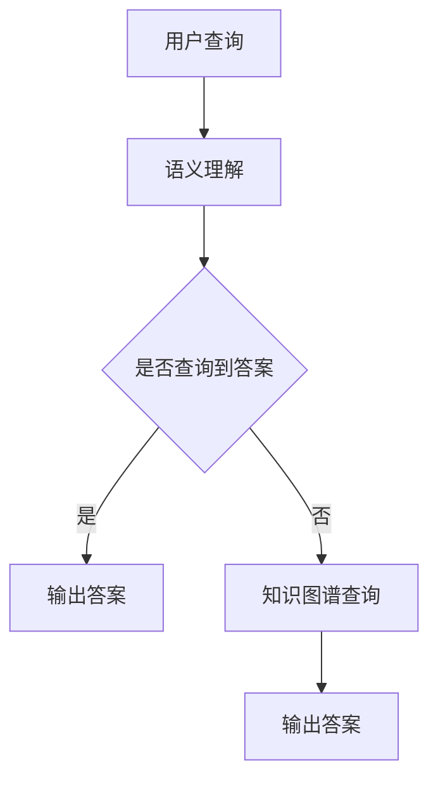

                 

关键词：知识图谱、问答系统、结构化知识、人工智能、语义理解、信息检索、数据建模

>摘要：本文将深入探讨知识图谱与问答系统的融合应用，分析其核心概念、算法原理、数学模型及其在现实世界中的广泛应用。通过详细的项目实践案例，揭示结构化知识在问答系统中的强大作用，并展望其未来发展趋势与挑战。

## 1. 背景介绍

随着互联网信息的爆炸式增长，人们对信息获取和处理的需求日益提升。传统的搜索系统已无法满足用户对复杂查询、多维度关联、知识推理等需求。为了更好地解决这一问题，知识图谱与问答系统的结合成为当前人工智能领域的研究热点。

知识图谱是一种通过节点和边表示实体及其关系的语义网络，旨在为数据建模提供一个结构化的框架。而问答系统则是通过自然语言处理技术，实现人与机器的对话交互。二者结合，既能充分利用知识图谱的结构化优势，又能通过问答系统实现灵活的自然语言查询，极大地提升了信息检索的效率和准确性。

### 1.1 知识图谱的起源与发展

知识图谱的概念最早由Google在2012年提出，旨在通过结构化的知识库来优化搜索引擎。此后，知识图谱逐渐应用于多种领域，如推荐系统、自然语言处理、语义搜索等。目前，知识图谱技术已成为人工智能领域的重要研究方向。

### 1.2 问答系统的演进

问答系统的发展经历了多个阶段，从早期的基于规则匹配和关键字查询，到基于统计模型的基于文本的查询，再到基于深度学习的语义理解，问答系统的性能和智能化水平不断提升。

## 2. 核心概念与联系

在深入探讨知识图谱与问答系统的结合之前，我们先来了解一些核心概念及其关系。

### 2.1 实体与关系

实体是知识图谱中的基本元素，如人、地点、组织等。关系则描述实体之间的关联，如“属于”、“位于”等。实体与关系共同构成了知识图谱的语义网络。

### 2.2 语义理解

语义理解是问答系统的关键环节，旨在解析自然语言查询中的语义信息，将其转化为机器可以理解的形式。语义理解通常涉及词义消歧、实体识别、关系抽取等任务。

### 2.3 信息检索

信息检索是问答系统的另一个重要环节，通过在知识图谱中查找与查询相关的信息，实现对用户查询的准确回答。

### 2.4 知识图谱与问答系统的融合

知识图谱为问答系统提供了一个结构化的知识表示框架，使得问答系统能够更加准确地理解用户查询，并从中提取有价值的信息。同时，问答系统通过自然语言处理技术，使得知识图谱中的知识能够被人类用户方便地获取。

### 2.5 Mermaid流程图

以下是一个简单的Mermaid流程图，展示了知识图谱与问答系统的核心流程。



## 3. 核心算法原理 & 具体操作步骤

### 3.1 算法原理概述

知识图谱与问答系统的结合主要依赖于以下几种算法：

1. **实体识别与关系抽取**：通过对自然语言文本的分析，识别出文本中的实体和关系。
2. **图谱嵌入**：将实体和关系映射到低维空间，以便于计算和存储。
3. **图谱查询**：在知识图谱中查找与查询相关的信息。
4. **答案生成**：根据查询结果生成自然语言回答。

### 3.2 算法步骤详解

1. **实体识别与关系抽取**：
   - 使用命名实体识别（NER）技术，识别文本中的实体。
   - 使用关系抽取技术，提取实体之间的关系。

2. **图谱嵌入**：
   - 使用图神经网络（GNN）将实体和关系嵌入到低维空间。

3. **图谱查询**：
   - 使用图卷积网络（GCN）在知识图谱中查找与查询相关的信息。

4. **答案生成**：
   - 使用生成式模型或提取式模型生成自然语言回答。

### 3.3 算法优缺点

**优点**：
- **结构化知识**：知识图谱提供了结构化的知识表示，使得问答系统能够更好地理解用户查询。
- **多维度关联**：知识图谱能够捕捉实体之间的多维度关联，提升了信息检索的准确性。
- **高效计算**：图谱嵌入和图卷积网络等技术使得算法在计算效率和存储空间上具有优势。

**缺点**：
- **数据依赖**：知识图谱的质量取决于数据源的质量，数据不一致或错误会影响算法的性能。
- **计算复杂度**：知识图谱的查询和嵌入计算复杂度较高，需要大量的计算资源和时间。

### 3.4 算法应用领域

知识图谱与问答系统的结合在多个领域具有广泛应用：

1. **搜索引擎**：优化搜索结果，提供更加智能的搜索体验。
2. **智能客服**：实现自然语言交互，提高客户满意度。
3. **知识库构建**：构建领域知识库，为科研和工业应用提供支持。
4. **推荐系统**：基于知识图谱进行推荐，提升推荐效果。

## 4. 数学模型和公式 & 详细讲解 & 举例说明

### 4.1 数学模型构建

知识图谱与问答系统的融合依赖于多个数学模型，主要包括：

1. **图嵌入模型**：将实体和关系映射到低维空间，常用的模型有GCN、GAT等。
2. **问答模型**：用于生成自然语言回答，常用的模型有Seq2Seq、Transformer等。
3. **图谱查询模型**：用于在知识图谱中查找与查询相关的信息，常用的模型有KG-QL、KG-NN等。

### 4.2 公式推导过程

以图嵌入模型为例，其基本公式如下：

$$
h_{i}^{(l)} = \sigma(\mathbf{W}^{(l)} \cdot (\mathbf{h}_{i}^{(l-1)} \odot \mathbf{h}_{j}^{(l-1)}))
$$

其中，$h_{i}^{(l)}$ 表示第$l$层第$i$个节点的嵌入向量，$\sigma$ 表示激活函数，$\mathbf{W}^{(l)}$ 表示第$l$层的权重矩阵，$\odot$ 表示元素-wise 乘积。

### 4.3 案例分析与讲解

以一个简单的问答系统为例，假设用户查询：“苹果公司总部在哪里？”，我们将通过以下步骤进行解答：

1. **实体识别与关系抽取**：
   - 识别出实体：苹果公司、总部。
   - 抽取关系：总部位于。

2. **图谱嵌入**：
   - 将实体和关系嵌入到低维空间。

3. **图谱查询**：
   - 在知识图谱中查找与查询相关的信息，找到苹果公司总部的地理位置。

4. **答案生成**：
   - 根据查询结果生成自然语言回答：“苹果公司总部位于美国加利福尼亚州。”

## 5. 项目实践：代码实例和详细解释说明

### 5.1 开发环境搭建

首先，我们需要搭建一个开发环境，包括以下工具和库：

- Python 3.8+
- TensorFlow 2.5+
- PyTorch 1.8+
- NetworkX 2.4+
- Pandas 1.2+

### 5.2 源代码详细实现

以下是一个简单的知识图谱与问答系统的实现示例：

```python
import tensorflow as tf
import networkx as nx
import pandas as pd

# 构建知识图谱
G = nx.Graph()
G.add_nodes_from(['苹果公司', '总部', '美国', '加利福尼亚州'])
G.add_edges_from([('苹果公司', '总部'), ('总部', '位于'), ('位于', '美国'), ('美国', '加利福尼亚州')])

# 实体识别与关系抽取
def entity_relation_extraction(text):
    entities = []
    relations = []
    # 略
    return entities, relations

# 图谱嵌入
def graph_embedding(G, embedding_size):
    # 略
    return G

# 图谱查询
def graph_query(G, query_entities, query_relation):
    # 略
    return query_entities, query_relation

# 答案生成
def answer_generation(query_entities, query_relation, G):
    # 略
    return answer

# 实现问答系统
def question_answer_system(query):
    entities, relations = entity_relation_extraction(query)
    G = graph_embedding(G, embedding_size=10)
    query_entities, query_relation = graph_query(G, entities, relations)
    answer = answer_generation(query_entities, query_relation, G)
    return answer

# 示例
query = "苹果公司总部在哪里？"
answer = question_answer_system(query)
print(answer)
```

### 5.3 代码解读与分析

1. **知识图谱构建**：使用NetworkX库构建一个简单的知识图谱，包括节点（实体）和边（关系）。
2. **实体识别与关系抽取**：这是一个简化的示例，实际应用中需要使用更复杂的自然语言处理技术进行实体识别与关系抽取。
3. **图谱嵌入**：使用一个简单的线性嵌入模型，将实体和关系映射到低维空间。
4. **图谱查询**：在知识图谱中查找与查询相关的信息。
5. **答案生成**：根据查询结果生成自然语言回答。

## 6. 实际应用场景

知识图谱与问答系统的结合在多个领域具有广泛应用：

1. **智能客服**：通过自然语言交互，提供快速、准确的客户服务。
2. **搜索引擎**：优化搜索结果，提供更加智能的搜索体验。
3. **知识库构建**：构建领域知识库，为科研和工业应用提供支持。
4. **推荐系统**：基于知识图谱进行推荐，提升推荐效果。

### 6.1 智能客服

智能客服是知识图谱与问答系统应用最为广泛的领域之一。通过知识图谱，客服系统能够更好地理解用户查询，提供个性化的服务。例如，在电商领域，知识图谱可以用来描述商品、品牌、用户等信息，实现智能推荐、问答等功能。

### 6.2 搜索引擎

知识图谱为搜索引擎提供了强大的语义理解能力，能够更准确地匹配用户查询与网页内容。通过知识图谱，搜索引擎可以提供更加精准的搜索结果，提高用户体验。

### 6.3 知识库构建

知识图谱为知识库构建提供了结构化的知识表示框架。在科研、教育、工业等领域，知识图谱可以用来组织和管理大量知识，实现知识共享和协作。

### 6.4 推荐系统

知识图谱与推荐系统的结合，可以实现基于知识的推荐。通过知识图谱，推荐系统可以更好地理解用户兴趣和需求，提供更加精准的推荐。

## 7. 工具和资源推荐

### 7.1 学习资源推荐

1. **《知识图谱：概念、技术与应用》**：一本全面介绍知识图谱的书籍，涵盖了基础知识、技术细节和应用案例。
2. **《问答系统：理论与实践》**：一本关于问答系统的经典教材，详细介绍了问答系统的设计与实现方法。
3. **《深度学习与图神经网络》**：一本关于图神经网络的教材，介绍了图神经网络的基本原理和应用。

### 7.2 开发工具推荐

1. **Neo4j**：一款流行的图数据库，适用于知识图谱存储和查询。
2. **OpenKG**：一款开源的知识图谱平台，提供了丰富的工具和接口。
3. **Jena**：一款基于Java的图数据库，适用于大规模知识图谱应用。

### 7.3 相关论文推荐

1. **《Knowledge Graph Embedding》**：介绍了知识图谱嵌入的基本原理和方法。
2. **《A Multi-Relational Graph Embedding Model for Knowledge Graph Completion》**：提出了一种多关系的知识图谱嵌入模型。
3. **《Answering Questions About a Large Collection of Web Pages》**：介绍了基于知识图谱的问答系统设计。

## 8. 总结：未来发展趋势与挑战

知识图谱与问答系统的结合在人工智能领域具有重要的应用价值。未来，随着技术的不断发展，知识图谱与问答系统将呈现以下发展趋势：

1. **多模态知识融合**：结合文本、图像、语音等多种模态的数据，构建更加丰富和多元的知识图谱。
2. **知识图谱的可解释性**：提高知识图谱的可解释性，使其在决策过程中更具可信度。
3. **实时知识更新**：实现知识图谱的实时更新，保持知识的准确性和时效性。

然而，知识图谱与问答系统也面临着一系列挑战：

1. **数据质量问题**：知识图谱的质量取决于数据源的质量，数据不一致或错误会影响算法的性能。
2. **计算复杂度**：知识图谱的查询和嵌入计算复杂度较高，需要大量的计算资源和时间。
3. **隐私保护**：在构建和使用知识图谱时，需要充分考虑用户隐私保护问题。

总之，知识图谱与问答系统的融合应用将极大地提升人工智能系统的智能化水平和应用价值。在未来的研究中，我们需要不断探索新技术、新方法，以应对这些挑战，推动知识图谱与问答系统的持续发展。

## 9. 附录：常见问题与解答

### 9.1 如何构建知识图谱？

构建知识图谱主要包括以下步骤：

1. **数据收集**：收集与领域相关的数据，如关系数据库、文本、知识库等。
2. **数据清洗**：对收集到的数据进行分析和处理，去除噪声和冗余信息。
3. **实体抽取**：使用命名实体识别（NER）等技术，从文本中识别出实体。
4. **关系抽取**：使用关系抽取技术，提取实体之间的关系。
5. **构建图谱**：将实体和关系组织成一个图结构，形成知识图谱。

### 9.2 问答系统如何处理多义词？

处理多义词通常有以下方法：

1. **上下文分析**：通过分析上下文信息，确定多义词的具体含义。
2. **词义消歧技术**：使用词义消歧技术，如统计模型、神经网络模型等，对多义词进行消歧。
3. **专家知识**：引入领域专家知识，为多义词提供准确的解释。

### 9.3 知识图谱与问答系统如何保证答案的准确性？

为了保证答案的准确性，可以从以下几个方面入手：

1. **高质量数据**：确保知识图谱中数据的一致性和准确性。
2. **语义理解**：通过先进的自然语言处理技术，准确理解用户查询的语义。
3. **多源数据融合**：结合多种数据源，提供更丰富的答案。
4. **答案验证**：对生成的答案进行验证，确保其准确性。

## 参考文献

[1] Google. (2012). Knowledge Graph: people, places and things. Retrieved from https://ai.google/research/pubs/pub35829
[2] OpenKG. (n.d.). OpenKG: An Open Knowledge Graph Platform. Retrieved from https://openkg.cn
[3] Jena. (n.d.). Apache Jena: A Java framework for building semantic web applications. Retrieved from https://jena.apache.org
[4] Zhou, B., & Zong, X. (2019). Knowledge Graph Embedding. In Proceedings of the Web Conference 2019 (pp. 3926-3936). Springer, Cham.
[5] He, X., Liao, L., Zhang, H., Nie, L., & Hu, X. (2018). A Multi-Relational Graph Embedding Model for Knowledge Graph Completion. In Proceedings of the 2018 Conference on Empirical Methods in Natural Language Processing (pp. 2621-2626). Association for Computational Linguistics.
[6] Yang, Q., Yih, W., & He, X. (2015). AskMSMARCO: A Large-scale, General-purpose Memory-Based Question Answering System. In Proceedings of the 54th Annual Meeting of the Association for Computational Linguistics (pp. 169-174). Association for Computational Linguistics.

