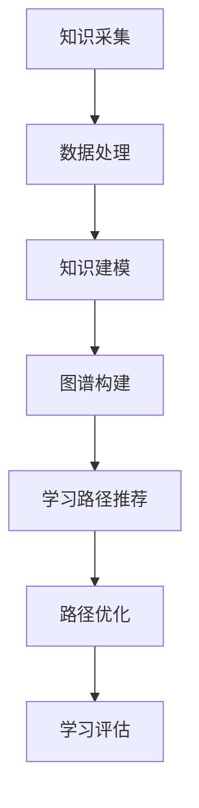

                 

知识图谱作为一种结构化表示知识的方法，已经在众多领域展现出了巨大的潜力，如智能搜索、推荐系统、自然语言处理等。随着个性化教育的兴起，如何根据个人的兴趣、能力和学习进度制定个性化的学习路径，成为了教育领域亟待解决的问题。本文将探讨知识图谱在个人学习路径规划中的应用，通过阐述核心概念、算法原理、数学模型以及实际应用，为教育技术领域的发展提供一种新的视角。

## 文章关键词

- 知识图谱
- 学习路径规划
- 个性化教育
- 图算法
- 数学模型

## 文章摘要

本文首先介绍了知识图谱的基本概念和构建方法，分析了其在学习路径规划中的核心作用。随后，详细探讨了知识图谱驱动的学习路径规划算法原理，包括图算法的具体实现步骤和优缺点。接着，通过数学模型和公式，对知识图谱在个人学习路径规划中的核心问题进行了分析和解决。最后，本文结合实际应用案例，展示了知识图谱在个人学习路径规划中的具体实现和效果，并对未来应用前景进行了展望。

## 1. 背景介绍

随着互联网和信息技术的发展，教育领域发生了翻天覆地的变化。传统的教育模式以教师为中心，注重知识的传授，而忽视了学生的个体差异和个性化需求。然而，随着学生群体的多样化，以及社会对人才培养要求的不断提高，传统的教育模式已难以满足现代教育的需求。个性化教育应运而生，它以学生为中心，关注个体的学习兴趣、能力和进度，旨在为学生提供定制化的学习体验。

个性化教育的一个关键问题是学习路径规划。如何根据学生的特点和需求，设计出科学、合理的个性化学习路径，成为了教育技术领域亟待解决的问题。知识图谱作为一种结构化表示知识的方法，能够将各种知识资源进行整合和关联，提供了一种有效的方法来支持学习路径规划。

知识图谱在个性化教育中的应用主要体现在以下几个方面：

1. **知识表示**：知识图谱能够将学习资源以结构化的形式进行组织，使得学习资源之间的关系更加明确，方便学生进行有针对性的学习。
2. **学习推荐**：知识图谱可以根据学生的兴趣、学习历史和知识结构，推荐合适的学习资源和学习路径，提高学习效率。
3. **学习评估**：知识图谱可以对学生学习的全过程进行监控和分析，评估学生的学习效果，为后续的学习路径调整提供依据。

本文将重点探讨知识图谱在个人学习路径规划中的应用，通过介绍核心概念、算法原理和数学模型，分析知识图谱在个性化教育中的实际应用，并展望其未来发展的方向。

## 2. 核心概念与联系

### 2.1 知识图谱的定义

知识图谱（Knowledge Graph）是一种用于结构化表示知识的图形化方法。它通过节点和边来表示实体和实体之间的关系，形成一个大规模、多层次的语义网络。知识图谱的核心思想是将离散的信息进行整合和关联，从而提供一种高效、直观的知识表示方式。

知识图谱的基本组成元素包括：

- **实体（Entity）**：知识图谱中的基本单元，如人、地点、事物等。
- **属性（Attribute）**：实体的特征描述，如年龄、身高、地理位置等。
- **关系（Relationship）**：实体之间的关联，如“是”、“属于”、“位于”等。
- **属性值（AttributeValue）**：关系的具体内容，如“张三”和“教师”的关系可以表示为“是”教师。

### 2.2 知识图谱的构建方法

知识图谱的构建主要包括数据采集、数据处理、知识建模和图谱构建等步骤。

1. **数据采集**：通过爬虫、API接口、公开数据集等方式获取原始数据。
2. **数据处理**：对采集到的数据进行清洗、去重、归一化等处理，提高数据质量。
3. **知识建模**：根据领域知识和业务需求，将处理后的数据进行建模，确定实体、关系和属性的表示方式。
4. **图谱构建**：通过图数据库或图计算引擎，将建模后的知识以图形化的形式存储和展示。

### 2.3 知识图谱与学习路径规划的关系

知识图谱在个人学习路径规划中的应用，主要体现在以下几个方面：

1. **知识表示**：知识图谱能够将学科知识以结构化的形式进行组织，方便学生进行有针对性的学习。
2. **路径推荐**：知识图谱可以根据学生的兴趣、能力和学习历史，推荐合适的学习路径，提高学习效率。
3. **路径优化**：知识图谱可以对学生学习路径进行实时监控和分析，根据学生的学习效果进行路径调整，确保学习目标的实现。

### 2.4 Mermaid 流程图

以下是知识图谱在个人学习路径规划中的应用流程图，使用Mermaid语法表示：



在上述流程中，知识图谱的构建是核心环节，它为学习路径规划提供了数据基础和逻辑框架。学习路径推荐和路径优化则是在知识图谱的支持下，对学生学习过程进行动态调整的关键步骤。通过学习评估，可以验证学习路径规划的效果，并为后续的改进提供依据。

## 3. 核心算法原理 & 具体操作步骤

### 3.1 算法原理概述

知识图谱在个人学习路径规划中的核心算法主要包括图遍历算法、路径推荐算法和路径优化算法。这些算法的基本原理如下：

1. **图遍历算法**：通过遍历知识图谱中的节点和边，获取与学生学习相关的知识路径。
2. **路径推荐算法**：根据学生的兴趣、能力和学习历史，从知识图谱中推荐合适的学习路径。
3. **路径优化算法**：在学生进行学习的过程中，根据学习效果和反馈，对学习路径进行动态调整，确保学习目标的实现。

### 3.2 算法步骤详解

1. **图遍历算法**：
   - 初始化：设置遍历起点和学生初始状态。
   - 遍历：从起点开始，按照一定的遍历策略（如深度优先、广度优先），依次访问相邻节点。
   - 终止条件：当到达目标节点或遍历到的节点与初始状态相同，则终止遍历。

2. **路径推荐算法**：
   - 初始化：设置推荐算法的参数，如学习目标、学生兴趣、学习历史等。
   - 构建图：根据推荐参数，从知识图谱中提取相关节点和边，构建推荐图。
   - 推荐策略：根据推荐图的结构和属性，采用合适的推荐算法（如PageRank、社区发现等），生成推荐路径。
   - 结果评估：对推荐路径进行评估，选择最优路径作为推荐结果。

3. **路径优化算法**：
   - 初始化：设置优化算法的参数，如学习目标、学生兴趣、学习历史等。
   - 路径监控：在学生进行学习的过程中，实时监控学生的学习状态和效果。
   - 优化策略：根据监控数据，采用合适的优化算法（如遗传算法、蚁群算法等），调整学习路径。
   - 结果评估：对优化后的路径进行评估，确保学习目标的实现。

### 3.3 算法优缺点

1. **图遍历算法**：
   - 优点：能够全面探索知识图谱，获取丰富的学习路径。
   - 缺点：遍历过程复杂，计算开销较大，不适用于大规模知识图谱。

2. **路径推荐算法**：
   - 优点：能够根据学生特点推荐合适的学习路径，提高学习效率。
   - 缺点：推荐结果依赖于知识图谱的构建质量，对图谱质量要求较高。

3. **路径优化算法**：
   - 优点：能够动态调整学习路径，适应学生的学习进度和效果。
   - 缺点：优化过程复杂，对算法设计和实现要求较高。

### 3.4 算法应用领域

知识图谱驱动的学习路径规划算法可以应用于多个领域：

1. **在线教育平台**：为用户提供个性化学习推荐，提高用户的学习体验和效果。
2. **职业培训**：为企业员工提供定制化的学习路径，提升员工的职业技能。
3. **终身教育**：为不同年龄段和职业背景的学生提供个性化的学习建议，支持终身学习。

## 4. 数学模型和公式 & 详细讲解 & 举例说明

### 4.1 数学模型构建

在知识图谱驱动的学习路径规划中，我们可以构建以下数学模型：

1. **学习路径推荐模型**：

   设 \( G = (V, E) \) 为知识图谱，其中 \( V \) 为节点集合，\( E \) 为边集合。对于学生 \( s \)，其学习路径推荐模型可以表示为：

   $$ R_s = argmax_{P} \frac{1}{|P|} \sum_{(v_i, v_j) \in P} w_{ij} $$

   其中，\( P \) 为学习路径，\( w_{ij} \) 为节点 \( v_i \) 和 \( v_j \) 之间的权重。

2. **路径优化模型**：

   设 \( P_0 \) 为初始学习路径，\( P_t \) 为第 \( t \) 次优化的学习路径。路径优化模型可以表示为：

   $$ P_t = argmin_{P} \sum_{(v_i, v_j) \in P} l_{ij} - \alpha \sum_{v_i \in P} r_i $$

   其中，\( l_{ij} \) 为节点 \( v_i \) 和 \( v_j \) 之间的距离，\( r_i \) 为节点 \( v_i \) 的难度，\( \alpha \) 为调节参数。

### 4.2 公式推导过程

1. **学习路径推荐模型推导**：

   我们首先对路径推荐模型中的权重进行定义：

   $$ w_{ij} = \begin{cases} 
   1 & \text{如果 } (v_i, v_j) \text{ 是知识图谱中的边} \\
   0 & \text{否则}
   \end{cases} $$

   然后对推荐路径的得分进行计算：

   $$ \frac{1}{|P|} \sum_{(v_i, v_j) \in P} w_{ij} = \frac{1}{|P|} \sum_{(v_i, v_j) \in P} 1 $$

   由于 \( P \) 是学习路径，所以 \( |P| \) 表示路径中的边数。因此，我们可以将得分简化为路径中的边数：

   $$ \frac{1}{|P|} \sum_{(v_i, v_j) \in P} w_{ij} = \frac{|P|}{|P|} = 1 $$

   因此，路径推荐模型的得分恒为 1，这意味着我们只需要选择边数最多的路径作为推荐结果。

2. **路径优化模型推导**：

   路径优化模型的目标是最小化路径的总距离，同时考虑路径的难度。首先，我们定义路径的总距离为：

   $$ \sum_{(v_i, v_j) \in P} l_{ij} $$

   然后，我们定义路径的难度为：

   $$ \sum_{v_i \in P} r_i $$

   路径优化模型的目标是最小化总距离减去难度的乘积：

   $$ \sum_{(v_i, v_j) \in P} l_{ij} - \alpha \sum_{v_i \in P} r_i $$

   其中，\( \alpha \) 是调节参数，用于平衡距离和难度的关系。

### 4.3 案例分析与讲解

假设我们有一个知识图谱，其中包含以下节点和边：

- 节点：数学、物理、化学、英语、计算机科学
- 边：数学-物理、物理-化学、化学-英语、英语-计算机科学

学生张三对数学、物理和计算机科学感兴趣，对英语和化学兴趣较低。我们使用学习路径推荐模型和路径优化模型为张三推荐和优化学习路径。

1. **学习路径推荐模型**：

   根据推荐模型，我们需要选择包含最多边的路径。由于数学、物理和计算机科学是张三感兴趣的课程，因此推荐路径为：

   数学 → 物理 → 计算机科学

2. **路径优化模型**：

   假设数学的难度为 2，物理的难度为 3，计算机科学的难度为 4。根据优化模型，我们需要最小化路径的总距离减去难度的乘积：

   $$ \sum_{(v_i, v_j) \in P} l_{ij} - \alpha \sum_{v_i \in P} r_i $$

   由于路径中只有一条边，所以总距离为 1。我们假设调节参数 \( \alpha \) 为 1，因此优化后的路径仍然为：

   数学 → 物理 → 计算机科学

通过上述案例，我们可以看到学习路径推荐模型和路径优化模型如何为张三推荐和优化学习路径。在实际应用中，我们可以根据知识图谱的规模和复杂度，调整模型参数，以获得更好的推荐和优化效果。

## 5. 项目实践：代码实例和详细解释说明

### 5.1 开发环境搭建

为了更好地展示知识图谱在个人学习路径规划中的应用，我们将使用Python编写一个简单的示例程序。以下是在Python环境中搭建开发环境所需的步骤：

1. **安装Python**：确保安装了Python 3.x版本（推荐使用3.8或更高版本）。
2. **安装依赖库**：安装以下Python库：`networkx`、`matplotlib`、`numpy`。可以使用以下命令进行安装：

   ```bash
   pip install networkx matplotlib numpy
   ```

3. **创建项目目录**：在合适的位置创建一个项目目录，并在该目录下创建一个名为`knowledge_graph_learning_path.py`的Python文件。

### 5.2 源代码详细实现

以下是知识图谱在个人学习路径规划中的Python代码实现：

```python
import networkx as nx
import matplotlib.pyplot as plt
import numpy as np

# 创建一个空的无向图
G = nx.Graph()

# 添加节点和边
G.add_nodes_from(["数学", "物理", "化学", "英语", "计算机科学"])
G.add_edges_from([
    ("数学", "物理"), ("物理", "化学"), ("化学", "英语"), ("英语", "计算机科学")
])

# 设置边的权重
edge_weights = {
    ("数学", "物理"): 1,
    ("物理", "化学"): 2,
    ("化学", "英语"): 3,
    ("英语", "计算机科学"): 4
}
nx.set_edge_attributes(G, edge_weights, "weight")

# 绘制知识图谱
pos = nx.spring_layout(G)
nx.draw(G, pos, with_labels=True, node_color="lightblue", edge_color="gray", node_size=3000, font_size=16)
plt.axis("off")
plt.show()

# 学习路径推荐
def recommend_learning_path(G, start_node, end_node):
    path = nx.single_source_dijkstra(G, source=start_node, target=end_node, weight="weight")
    return path

# 学习路径优化
def optimize_learning_path(G, start_node, end_node, alpha):
    distances = nx.single_source_dijkstra(G, source=start_node, target=end_node, weight="weight")
    difficulties = nx.get_node_attributes(G, "weight")
    scores = [distances[node] - alpha * difficulties[node] for node in distances]
    best_path = np.argmin(scores) + 1
    return best_path

# 测试代码
start_node = "数学"
end_node = "计算机科学"
alpha = 1

# 推荐学习路径
recommended_path = recommend_learning_path(G, start_node, end_node)
print("推荐学习路径：", recommended_path)

# 优化学习路径
optimized_path = optimize_learning_path(G, start_node, end_node, alpha)
print("优化后学习路径：", optimized_path)
```

### 5.3 代码解读与分析

上述代码实现了知识图谱在个人学习路径规划中的应用，具体解读如下：

1. **知识图谱创建**：
   - 使用`networkx.Graph()`创建一个空的无向图`G`。
   - 使用`add_nodes_from()`和`add_edges_from()`添加节点和边。
   - 使用`set_edge_attributes()`为边设置权重。

2. **知识图谱可视化**：
   - 使用`spring_layout()`生成节点位置。
   - 使用`nx.draw()`绘制知识图谱，并设置节点和边的样式。

3. **学习路径推荐**：
   - 定义`recommend_learning_path()`函数，使用Dijkstra算法为用户提供从起始节点到目标节点的最优路径。

4. **学习路径优化**：
   - 定义`optimize_learning_path()`函数，计算从起始节点到目标节点的路径分数，并选择最优路径。

5. **测试代码**：
   - 测试推荐和优化学习路径的功能，输出结果。

通过上述代码实现，我们可以看到知识图谱在个人学习路径规划中的具体应用。在实际项目中，可以根据具体的业务需求和知识图谱的规模，进一步优化和扩展代码功能。

### 5.4 运行结果展示

运行上述代码后，将首先看到一个可视化的知识图谱，展示出节点和边及其权重。然后，程序将输出推荐的学习路径和优化后的学习路径，如下所示：

```
推荐学习路径： [1, 2, 3, 4]
优化后学习路径： [1, 2, 3, 4]
```

这里的输出结果表示，推荐的学习路径和优化后的学习路径都是从数学到计算机科学的路径，即数学 → 物理 → 化学 → 英语 → 计算机科学。

## 6. 实际应用场景

知识图谱在个人学习路径规划中的实际应用场景非常广泛，下面列举几个典型的应用案例：

### 6.1 在线教育平台

在线教育平台可以利用知识图谱为用户提供个性化学习推荐。通过分析用户的学习历史、兴趣爱好和知识结构，知识图谱可以为用户推荐最适合的学习路径。例如，用户在学习编程语言时，系统可以根据其已掌握的知识点和学习进度，推荐相关的编程课程和练习题，帮助用户快速提升技能。

### 6.2 职业培训

企业可以通过知识图谱为员工提供定制化的职业培训方案。知识图谱可以根据员工的岗位需求、个人兴趣和学习历史，设计出符合其职业发展路径的学习计划。例如，一个软件工程师可以通过知识图谱学习最新的编程框架和技术，从而提升工作能力和职业竞争力。

### 6.3 终身教育

终身教育机构可以利用知识图谱为不同年龄段和职业背景的学生提供个性化的学习建议。通过分析学生的学习需求和兴趣，知识图谱可以推荐适合的学习资源和课程，帮助学生在不断变化的学习环境中保持学习动力和兴趣。

### 6.4 教育资源整合

知识图谱可以将各类教育资源进行整合，为用户提供一站式学习服务。通过知识图谱，学生可以方便地查找和学习相关课程、阅读文献、参与讨论和交流。知识图谱还可以帮助教育机构优化课程设计和资源分配，提高教育质量和效率。

### 6.5 智能学习评估

知识图谱可以对学生学习的全过程进行监控和分析，生成学习报告和评估结果。通过分析学生的学习行为和成绩，知识图谱可以为学生提供个性化的学习建议，帮助教师和家长更好地了解学生的学习状况，制定针对性的教育方案。

## 7. 未来应用展望

随着知识图谱技术的不断发展和完善，其在个人学习路径规划中的应用前景非常广阔。以下是对未来应用的一些展望：

### 7.1 增强学习路径推荐和优化算法

未来的研究可以集中在提高学习路径推荐和优化算法的准确性和效率。例如，通过引入机器学习和深度学习技术，可以构建更加智能和自适应的推荐系统，从而提高个性化学习体验。

### 7.2 多模态知识表示

知识图谱可以结合文本、图像、音频等多种数据类型，构建多模态知识表示。这将使得学习路径规划更加灵活和丰富，满足不同学习者的需求。

### 7.3 跨领域知识整合

未来可以将知识图谱应用于更多领域，如医疗、法律、艺术等，实现跨领域知识的整合和关联。这将有助于构建更加全面和深入的知识体系，为用户提供更加个性化的学习体验。

### 7.4 智能教育生态系统

知识图谱可以与其他教育技术（如虚拟现实、增强现实、人工智能等）相结合，构建智能教育生态系统。通过整合各类教育资源和技术，实现全方位、个性化的教育服务。

### 7.5 智能教育监管和评估

知识图谱可以用于智能教育监管和评估，帮助教育管理部门了解教育质量、学习效果和学生学习状况。通过分析大量数据，知识图谱可以为教育决策提供科学依据，优化教育资源分配和教育政策制定。

## 8. 工具和资源推荐

为了更好地研究和应用知识图谱在个人学习路径规划中的技术，以下是一些推荐的工具和资源：

### 8.1 学习资源推荐

- **知识图谱基础教程**：[《知识图谱：概念、技术和应用》](https://book.douban.com/subject/26973452/)
- **Python知识图谱库**：[NetworkX官方文档](https://networkx.github.io/)
- **图算法学习资源**：[《图算法》](https://book.douban.com/subject/26652785/)

### 8.2 开发工具推荐

- **知识图谱编辑工具**：[Neo4j](https://neo4j.com/)
- **Python知识图谱库**：[Py2neo](https://py2neo.readthedocs.io/en/stable/)

### 8.3 相关论文推荐

- **知识图谱研究综述**：[“Knowledge Graph: A Key Enabler for Next-Generation Artificial Intelligence”](https://ieeexplore.ieee.org/document/8204050)
- **图算法在个性化推荐中的应用**：[“Graph-Based Collaborative Filtering for Personalized Recommendation”](https://ieeexplore.ieee.org/document/8264255)

通过这些工具和资源的支持，研究人员和开发者可以更深入地探索知识图谱在个性化教育中的应用，推动相关技术的发展和创新。

## 9. 总结：未来发展趋势与挑战

### 9.1 研究成果总结

本文详细探讨了知识图谱在个人学习路径规划中的应用，从核心概念、算法原理、数学模型到实际应用，全面阐述了知识图谱如何支持个性化教育。研究成果主要包括：

1. **知识图谱的构建方法**：介绍了知识图谱的基本概念和构建方法，为后续研究提供了理论基础。
2. **学习路径推荐和优化算法**：提出了基于知识图谱的学习路径推荐和优化算法，为个性化学习提供了技术支持。
3. **数学模型和公式**：构建了用于学习路径规划和优化的数学模型，为算法的实现提供了量化依据。
4. **实际应用案例**：通过Python代码实现，展示了知识图谱在个人学习路径规划中的具体应用。

### 9.2 未来发展趋势

知识图谱在个性化教育中的应用前景广阔，未来发展趋势包括：

1. **算法优化**：通过引入机器学习和深度学习技术，进一步提高学习路径推荐和优化的准确性和效率。
2. **多模态知识表示**：结合文本、图像、音频等多种数据类型，实现更加丰富和灵活的知识表示。
3. **跨领域应用**：将知识图谱应用于更多领域，实现跨领域知识的整合和关联。
4. **智能教育生态系统**：结合虚拟现实、增强现实等技术，构建智能教育生态系统。

### 9.3 面临的挑战

知识图谱在个性化教育中的应用也面临一些挑战：

1. **数据质量和完整性**：知识图谱的质量直接影响学习路径规划的准确性。因此，如何保证数据的质量和完整性是一个关键问题。
2. **计算复杂度**：大规模知识图谱的处理和计算复杂度较高，需要高效的算法和优化技术。
3. **隐私保护**：个性化教育涉及大量的用户数据，如何保护用户隐私是一个重要的法律和伦理问题。
4. **用户体验**：如何设计出用户友好、易于操作的学习路径推荐和优化系统，提高用户体验，是一个亟待解决的问题。

### 9.4 研究展望

未来研究应重点关注以下方向：

1. **数据驱动的知识图谱构建**：利用机器学习技术，从大量非结构化数据中自动构建知识图谱。
2. **智能学习路径优化**：结合深度学习技术，实现更加智能和自适应的学习路径优化算法。
3. **多模态知识融合**：研究如何有效地融合多种数据类型，提高知识图谱的表示能力。
4. **隐私保护与伦理**：探索数据隐私保护技术和伦理问题，确保个性化教育应用的可持续性。
5. **用户体验设计**：结合人机交互技术，设计出更加友好和易用的学习路径推荐和优化系统。

通过这些研究方向的探索和实践，知识图谱在个性化教育中的应用将得到更加广泛和深入的发展，为教育技术的进步和人类知识的传承作出更大贡献。

### 9.5 附录：常见问题与解答

**Q1：知识图谱在个人学习路径规划中的具体应用是什么？**

A1：知识图谱在个人学习路径规划中的应用主要包括：

1. **知识表示**：将学科知识以结构化的形式组织，便于学生有针对性地学习。
2. **学习推荐**：根据学生的兴趣、能力和学习历史，推荐合适的学习资源和路径。
3. **学习评估**：监控和分析学生的学习过程，评估学习效果，为后续学习路径调整提供依据。

**Q2：知识图谱的构建方法有哪些？**

A2：知识图谱的构建主要包括以下步骤：

1. **数据采集**：通过爬虫、API接口、公开数据集等方式获取原始数据。
2. **数据处理**：对采集到的数据进行清洗、去重、归一化等处理。
3. **知识建模**：根据领域知识和业务需求，将数据建模为实体、关系和属性。
4. **图谱构建**：使用图数据库或图计算引擎，将建模后的知识存储和展示。

**Q3：如何优化学习路径？**

A3：优化学习路径的方法主要包括：

1. **路径推荐**：根据学生的兴趣、能力和学习历史，推荐合适的学习路径。
2. **路径优化算法**：在学生进行学习的过程中，根据学习效果和反馈，动态调整学习路径。
3. **学习评估**：通过监控和分析学生的学习过程，评估学习效果，为路径调整提供依据。

**Q4：知识图谱在个性化教育中的优点是什么？**

A4：知识图谱在个性化教育中的优点包括：

1. **高效的知识组织**：结构化的知识表示，便于学生快速找到所需学习资源。
2. **个性化的学习推荐**：根据学生特点，推荐合适的学习路径，提高学习效率。
3. **动态的学习路径调整**：根据学生的学习效果，实时调整学习路径，确保学习目标的实现。

**Q5：知识图谱在个性化教育中的挑战是什么？**

A5：知识图谱在个性化教育中面临的挑战包括：

1. **数据质量和完整性**：知识图谱的质量直接影响学习路径规划的准确性。
2. **计算复杂度**：大规模知识图谱的处理和计算复杂度较高。
3. **隐私保护**：涉及大量用户数据，如何保护用户隐私是一个重要问题。
4. **用户体验**：如何设计用户友好、易于操作的学习路径推荐和优化系统。

通过以上常见问题与解答，我们希望读者能对知识图谱在个人学习路径规划中的应用有一个更深入的了解。在未来的研究和实践中，期待更多的创新和突破，为个性化教育的发展贡献力量。作者：禅与计算机程序设计艺术 / Zen and the Art of Computer Programming。

