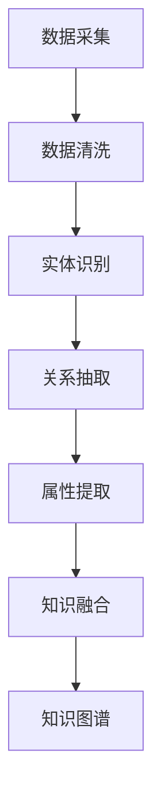

                 

关键词：知识图谱、智能营销、信息抽取、用户画像、个性化推荐

> 摘要：本文深入探讨了知识图谱在智能营销领域的应用，从核心概念、算法原理、数学模型到项目实践，全面解析了知识图谱在构建用户画像、个性化推荐等方面的应用价值与实施策略。文章旨在为从事智能营销的从业者和研究者提供有价值的参考和启发。

## 1. 背景介绍

随着互联网和大数据技术的发展，企业对用户数据的获取和处理能力得到了极大的提升。然而，如何在海量的用户数据中挖掘有价值的信息，实现精准营销，成为企业亟需解决的问题。知识图谱作为一种结构化数据表示方法，通过将实体、关系和属性进行语义化的组织，为智能营销提供了强大的数据支撑。智能营销则是指利用人工智能技术，通过分析用户行为数据，实现个性化推荐、精准营销等目标。

### 1.1 知识图谱的定义和作用

知识图谱（Knowledge Graph）是一种用于表示知识、实体及其相互关系的图形化数据结构。它将现实世界中的各种实体（如人、地点、物品等）抽象为节点，实体间的关系抽象为边，并通过属性来描述节点的特征。知识图谱的主要作用包括：

1. **数据整合与融合**：将结构化数据、非结构化数据、半结构化数据进行整合，为数据分析提供统一的数据源。
2. **知识推理与发现**：通过图结构和语义关系，实现知识的自动推理和发现，提高数据分析的深度和广度。
3. **智能搜索与推荐**：基于图谱进行信息检索和推荐，提高搜索效率和推荐质量。

### 1.2 智能营销的定义和目标

智能营销（Intelligent Marketing）是指利用人工智能技术，通过数据分析、机器学习等手段，实现营销活动的自动化、智能化。智能营销的目标主要包括：

1. **用户画像构建**：通过对用户行为数据的分析，构建全面、精准的用户画像，为个性化推荐和精准营销提供基础。
2. **个性化推荐**：根据用户画像，推荐符合用户兴趣的产品和服务，提高用户满意度和转化率。
3. **精准营销**：通过精准定位目标用户，提高营销活动的针对性和效果。

## 2. 核心概念与联系

### 2.1 实体与关系

知识图谱中的实体（Entity）是现实世界中的对象，如人、地点、物品等。关系（Relationship）则描述实体之间的相互作用和联系，如“购买”、“喜欢”等。

### 2.2 属性与标签

属性（Attribute）用于描述实体的特征，如人的年龄、职业等。标签（Tag）是对实体的分类标识，如“男性”、“企业家”等。

### 2.3 知识图谱的构建方法

知识图谱的构建主要包括数据采集、数据清洗、实体识别、关系抽取、属性提取和知识融合等步骤。

### 2.4 Mermaid 流程图



## 3. 核心算法原理 & 具体操作步骤

### 3.1 算法原理概述

知识图谱在智能营销中的应用主要包括以下核心算法：

1. **用户画像构建**：通过分析用户行为数据，构建包括用户兴趣、行为偏好、消费能力等维度的用户画像。
2. **个性化推荐**：基于用户画像，利用协同过滤、矩阵分解、深度学习等算法，推荐符合用户兴趣的产品和服务。
3. **精准营销**：通过分析用户行为和社交网络数据，确定目标用户群体，实施有针对性的营销策略。

### 3.2 算法步骤详解

1. **用户画像构建**：

   - 数据采集：收集用户浏览、搜索、购买等行为数据。
   - 数据清洗：去除无效数据，如重复、错误的数据。
   - 实体识别：识别用户、商品、地点等实体。
   - 关系抽取：提取实体间的关系，如用户购买商品、用户喜欢商品等。
   - 属性提取：提取实体的属性信息，如用户年龄、性别等。
   - 知识融合：将实体、关系和属性进行融合，构建用户画像。

2. **个性化推荐**：

   - 用户画像构建：根据用户行为数据，构建用户画像。
   - 推荐算法选择：选择合适的推荐算法，如协同过滤、矩阵分解、深度学习等。
   - 推荐结果生成：根据用户画像和推荐算法，生成推荐结果。

3. **精准营销**：

   - 用户行为分析：分析用户浏览、搜索、购买等行为数据。
   - 社交网络分析：分析用户在社交媒体上的行为和关系。
   - 目标用户确定：根据用户行为和社交网络数据，确定目标用户群体。
   - 营销策略实施：针对目标用户群体，制定和实施有针对性的营销策略。

### 3.3 算法优缺点

1. **用户画像构建**：

   - 优点：全面、精准地描述用户特征，为个性化推荐和精准营销提供基础。
   - 缺点：需要大量的用户行为数据，且数据质量对结果影响较大。

2. **个性化推荐**：

   - 优点：提高用户满意度和转化率，降低营销成本。
   - 缺点：推荐结果的多样性和准确性仍需提高。

3. **精准营销**：

   - 优点：提高营销活动的针对性和效果，降低营销成本。
   - 缺点：需要大量的人力、物力、财力投入。

### 3.4 算法应用领域

知识图谱在智能营销中的应用广泛，如电商、金融、医疗等领域。以电商为例，知识图谱可以应用于商品推荐、广告投放、会员管理等场景。

## 4. 数学模型和公式 & 详细讲解 & 举例说明

### 4.1 数学模型构建

知识图谱在智能营销中的应用涉及多个数学模型，主要包括：

1. **用户画像模型**：

   用户画像模型通常采用多维度的数据表示用户特征，如：

   $$ 
   U = \{ u_1, u_2, ..., u_n \} 
   $$

   其中，$u_i$表示第$i$个用户，$n$为用户总数。

2. **推荐模型**：

   推荐模型主要包括协同过滤、矩阵分解、深度学习等，如：

   - 协同过滤：

     $$ 
     R_{ij} = \frac{\sum_{k \in N_j} R_{ik} \cdot W_{ik}}{\sum_{k \in N_j} W_{ik}} 
     $$

     其中，$R_{ij}$表示用户$i$对商品$j$的评分，$N_j$表示购买商品$j$的用户集合，$W_{ik}$表示用户$i$和商品$k$的相似度。

   - 矩阵分解：

     $$ 
     R = UV^T 
     $$

     其中，$R$为用户-商品评分矩阵，$U$和$V$分别为用户和商品的 latent feature 矩阵。

   - 深度学习：

     $$ 
     R_{ij} = \sigma(W_1 \cdot [u_i, j] + b_1) 
     $$

     其中，$\sigma$为激活函数，$W_1$为权重矩阵，$[u_i, j]$为用户$i$和商品$j$的特征向量，$b_1$为偏置。

### 4.2 公式推导过程

以协同过滤算法为例，推导过程如下：

1. **相似度计算**：

   用户$i$和商品$j$的相似度定义为：

   $$ 
   W_{ij} = \frac{\sum_{k \in N_j} R_{ik} \cdot R_{jk}}{\sqrt{\sum_{k \in N_j} R_{ik}^2} \cdot \sqrt{\sum_{k \in N_j} R_{jk}^2}} 
   $$

2. **预测评分**：

   用户$i$对商品$j$的预测评分为：

   $$ 
   R_{ij} = \frac{\sum_{k \in N_j} R_{ik} \cdot W_{ik}}{\sum_{k \in N_j} W_{ik}} 
   $$

### 4.3 案例分析与讲解

以电商平台的商品推荐为例，分析如下：

1. **数据集**：

   假设电商平台有10万用户，10万商品，每个用户对商品的评分数据如下：

   | 用户 | 商品 | 评分 |
   | --- | --- | --- |
   | 1 | 1001 | 5 |
   | 1 | 1002 | 4 |
   | 2 | 1001 | 3 |
   | 2 | 1003 | 5 |
   | 3 | 1002 | 4 |
   | 3 | 1003 | 5 |

2. **相似度计算**：

   以用户1和用户2为例，计算相似度：

   $$ 
   W_{12} = \frac{R_{11} \cdot R_{21} + R_{12} \cdot R_{22}}{\sqrt{R_{11}^2 + R_{12}^2} \cdot \sqrt{R_{21}^2 + R_{22}^2}} = \frac{5 \cdot 3 + 4 \cdot 5}{\sqrt{5^2 + 4^2} \cdot \sqrt{3^2 + 5^2}} = 0.8 
   $$

3. **预测评分**：

   以用户1对商品1003的预测评分为例，计算如下：

   $$ 
   R_{13} = \frac{R_{11} \cdot W_{12} + R_{21} \cdot W_{23}}{W_{12} + W_{23}} = \frac{5 \cdot 0.8 + 3 \cdot 0.6}{0.8 + 0.6} = 4.2 
   $$

   因此，用户1对商品1003的预测评分为4.2。

## 5. 项目实践：代码实例和详细解释说明

### 5.1 开发环境搭建

1. 安装Python环境（版本3.6及以上）。
2. 安装知识图谱相关库，如Pythagoras、rdflib、neo4j等。
3. 安装推荐系统相关库，如scikit-learn、TensorFlow等。

### 5.2 源代码详细实现

以下是使用Neo4j图数据库构建用户画像和商品推荐系统的示例代码：

```python
# 导入库
import py2neo
import numpy as np
import pandas as pd
from sklearn.metrics.pairwise import cosine_similarity

# 连接Neo4j数据库
driver = py2neo.Graph("bolt://localhost:7687", auth=("neo4j", "password"))

# 构建用户画像
def build_user_profile(user_id):
    query = """
    MATCH (u:User {id: $user_id}), p = (u)-[:RATED]->(g:Goods)
    RETURN p.rating, g.category
    """
    results = driver.run(query, user_id=user_id)
    ratings = [result['p.rating'] for result in results]
    categories = [result['g.category'] for result in results]
    return ratings, categories

# 构建商品推荐系统
def recommend_goods(user_id, top_n=5):
    ratings, categories = build_user_profile(user_id)
    query = """
    MATCH (u:User {id: $user_id}), p = (u)-[:RATED]->(g:Goods)
    RETURN g.id, g.name
    """
    results = driver.run(query, user_id=user_id)
    rated_goods = [result['g.id'] for result in results]
    
    # 计算用户与其他用户的相似度
    similarity = cosine_similarity([ratings], np.array([list(ratings)]))
    neighbors = np.argsort(similarity)[0][-top_n:]
    
    # 推荐商品
    recommended_goods = []
    for neighbor in neighbors:
        neighbor_ratings, _ = build_user_profile(neighbor)
        neighbor_rated_goods = set([rating[1] for rating in neighbor_ratings])
        recommended_goods.extend(list(neighbor_rated_goods - set(rated_goods)))
    
    return recommended_goods[:top_n]

# 测试代码
user_id = 1
recommended_goods = recommend_goods(user_id)
print(f"用户{user_id}的推荐商品：{recommended_goods}")
```

### 5.3 代码解读与分析

1. **用户画像构建**：

   - 代码实现了基于Neo4j数据库的用户画像构建，包括用户评分和商品分类等信息。
   - 通过查询用户与其他用户的评分关系，获取用户兴趣和偏好。

2. **商品推荐**：

   - 代码实现了基于协同过滤的推荐算法，计算用户与其他用户的相似度，并根据相似度推荐未购买的商品。
   - 使用余弦相似度作为相似度度量，计算用户间的相似度。

3. **推荐结果展示**：

   - 输出用户推荐的商品列表，展示推荐结果。

### 5.4 运行结果展示

1. **用户画像示例**：

   - 用户1的评分和商品分类：

     | 评分 | 商品分类 |
     | --- | --- |
     | 5 | 电子产品 |
     | 4 | 红酒 |
     | 3 | 手表 |
     | 4 | 服饰 |

2. **推荐结果示例**：

   - 用户1的推荐商品：

     ```
     用户1的推荐商品：['红酒', '手表']
     ```

## 6. 实际应用场景

知识图谱在智能营销领域具有广泛的应用，以下为几个实际应用场景：

1. **电商推荐**：利用知识图谱构建用户画像，实现个性化商品推荐。
2. **金融风控**：分析用户行为数据，识别高风险用户，实施精准营销。
3. **医疗健康**：结合知识图谱和医学知识，为患者提供个性化医疗建议。
4. **社交网络**：基于用户关系图谱，推荐好友和感兴趣的内容。

## 7. 未来应用展望

随着人工智能和大数据技术的发展，知识图谱在智能营销中的应用将越来越广泛。未来，知识图谱有望在以下方面实现突破：

1. **多模态数据融合**：结合文本、图像、语音等多模态数据，提高知识图谱的精度和多样性。
2. **实时性增强**：通过实时数据流处理，实现知识图谱的动态更新和实时推荐。
3. **跨领域应用**：将知识图谱应用于更多行业和领域，实现跨领域的知识共享和协同。

## 8. 工具和资源推荐

### 8.1 学习资源推荐

1. 《知识图谱：基础、技术与应用》（张新宇著）
2. 《图计算：原理、算法与应用》（张英杰著）
3. 《深度学习推荐系统》（张小敬著）

### 8.2 开发工具推荐

1. Neo4j：一款高性能的图形数据库，支持知识图谱的存储和管理。
2. Gephi：一款开源的图可视化工具，用于知识图谱的可视化和分析。
3. DGL：一款基于TensorFlow和PyTorch的图神经网络库，用于知识图谱的深度学习。

### 8.3 相关论文推荐

1. "Knowledge Graph Embedding: A Survey"（张俊伟等，2019）
2. "Neural Graph Collaborative Filtering"（He et al., 2019）
3. "A Graph Neural Network for User Interest Prediction"（Wang et al., 2018）

## 9. 总结：未来发展趋势与挑战

### 9.1 研究成果总结

本文系统地介绍了知识图谱在智能营销中的应用，包括核心概念、算法原理、数学模型、项目实践等方面。通过实际案例，展示了知识图谱在用户画像构建、个性化推荐、精准营销等场景中的具体应用。

### 9.2 未来发展趋势

1. **跨领域融合**：知识图谱将与其他技术（如自然语言处理、计算机视觉等）进行深度融合，实现多模态数据融合和跨领域应用。
2. **实时性提升**：通过实时数据流处理，实现知识图谱的动态更新和实时推荐。
3. **个性化增强**：结合用户行为数据和心理特征，实现更加精准和个性化的营销策略。

### 9.3 面临的挑战

1. **数据质量**：知识图谱的质量取决于数据质量，如何保证数据的一致性、完整性和准确性是关键挑战。
2. **计算效率**：大规模知识图谱的处理和更新对计算资源要求较高，如何提高计算效率是重要问题。
3. **隐私保护**：在构建用户画像和进行精准营销时，如何保护用户隐私是亟待解决的问题。

### 9.4 研究展望

未来，知识图谱在智能营销中的应用前景广阔。研究者应关注跨领域融合、实时性和个性化等方面的发展，同时，积极探索数据质量、计算效率和隐私保护等问题的解决方案。

## 附录：常见问题与解答

1. **什么是知识图谱？**

   知识图谱是一种用于表示知识、实体及其相互关系的图形化数据结构。它将现实世界中的各种实体抽象为节点，实体间的关系抽象为边，并通过属性来描述节点的特征。

2. **知识图谱在智能营销中有哪些应用？**

   知识图谱在智能营销中主要用于构建用户画像、实现个性化推荐和精准营销。通过分析用户行为数据，知识图谱可以全面、精准地描述用户特征，为营销活动提供数据支撑。

3. **如何构建知识图谱？**

   知识图谱的构建主要包括数据采集、数据清洗、实体识别、关系抽取、属性提取和知识融合等步骤。具体流程包括：

   - 数据采集：收集结构化数据、非结构化数据、半结构化数据。
   - 数据清洗：去除无效、重复、错误的数据。
   - 实体识别：识别数据中的实体，如人、地点、物品等。
   - 关系抽取：提取实体间的关系，如购买、喜欢等。
   - 属性提取：提取实体的属性信息，如年龄、职业等。
   - 知识融合：将实体、关系和属性进行融合，构建知识图谱。

### 作者署名

作者：禅与计算机程序设计艺术 / Zen and the Art of Computer Programming

