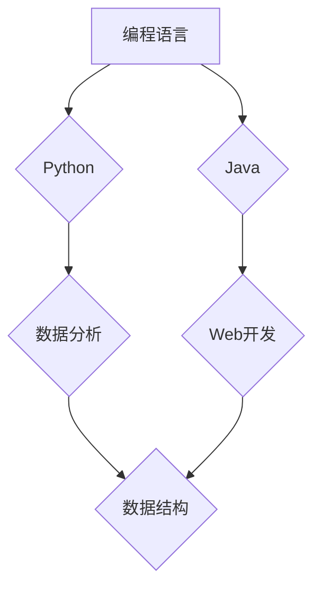

                 

关键词：知识图谱、程序员、学习路径规划、人工智能、算法

## 摘要

本文探讨了知识图谱在程序员学习路径规划中的应用。通过构建一个针对程序员的知识图谱，可以帮助程序员更高效地学习和掌握技能，实现个性化学习。本文首先介绍了知识图谱的基本概念和结构，然后分析了知识图谱在程序员学习路径规划中的核心应用，最后通过一个实际案例，展示了知识图谱如何帮助程序员优化学习路径。

## 1. 背景介绍

在信息技术快速发展的时代，程序员面临着不断更新和学习的压力。传统的学习方式往往依赖于书籍、教程和课程，这些方式在知识获取上存在一定的局限性。一方面，学习资源过于分散，程序员难以找到适合自己的学习路径；另一方面，学习资源更新速度跟不上技术发展的速度，导致学习内容可能过时。为了解决这些问题，需要一种新的方法来帮助程序员更高效地学习和掌握技能。

知识图谱是一种用于表示实体及其相互关系的语义网络，它能够将海量的知识信息组织成一个结构化的体系。在程序员学习路径规划中，知识图谱可以作为一种有效的工具，帮助程序员更清晰地了解所学知识的结构，发现知识之间的联系，从而优化学习路径。

## 2. 核心概念与联系

### 2.1 知识图谱的基本概念

知识图谱（Knowledge Graph）是一种用于表示实体及其相互关系的语义网络。它由节点和边组成，节点表示实体，边表示实体之间的关系。与传统的网络结构不同，知识图谱更加注重语义和关系。

### 2.2 知识图谱的结构

知识图谱通常包括三个层次：实体层、关系层和属性层。

- **实体层**：实体是知识图谱中的基本组成单位，如人、地点、物品等。实体可以是具体的实例，也可以是抽象的概念。
- **关系层**：关系表示实体之间的相互作用。关系可以是直接的，如“人”和“工作”的关系；也可以是间接的，如“程序员”和“编程语言”的关系。
- **属性层**：属性描述了实体和关系的特性。例如，一个“程序员”实体的属性可能包括姓名、年龄、工作经验等。

### 2.3 知识图谱的构建

知识图谱的构建通常涉及以下几个步骤：

1. **数据收集**：从各种来源收集实体和关系的数据。
2. **数据预处理**：清洗和整合收集到的数据，去除冗余和错误。
3. **实体和关系抽取**：从预处理后的数据中识别实体和关系。
4. **知识融合**：将不同来源的数据进行整合，形成一个统一的知识图谱。

### 2.4 知识图谱的 Mermaid 流程图

下面是一个简单的知识图谱 Mermaid 流程图，展示了实体、关系和属性的示例。


## 3. 核心算法原理 & 具体操作步骤

### 3.1 算法原理概述

知识图谱在程序员学习路径规划中的核心算法是基于图论的算法。这些算法通过分析知识图谱中的实体和关系，帮助程序员找到最合适的学习路径。

### 3.2 算法步骤详解

1. **构建知识图谱**：收集程序员相关的知识，构建一个包含实体、关系和属性的完整知识图谱。
2. **确定学习目标**：根据程序员的学习需求，确定需要掌握的技能和知识点。
3. **路径规划**：利用图算法（如最短路径算法、最优化算法等），从知识图谱中规划出一条符合学习目标的最优学习路径。
4. **学习资源推荐**：根据规划出的学习路径，推荐相应的学习资源和教程。

### 3.3 算法优缺点

**优点**：

- **个性化学习**：根据程序员的学习需求和兴趣，提供个性化的学习路径。
- **高效学习**：通过分析知识图谱中的关系，帮助程序员更快地掌握知识。

**缺点**：

- **数据收集和处理**：构建知识图谱需要大量数据，且数据质量直接影响算法效果。
- **计算复杂性**：图算法的计算复杂性较高，可能影响算法的执行效率。

### 3.4 算法应用领域

知识图谱在程序员学习路径规划中的应用非常广泛，包括：

- **在线教育平台**：为程序员提供个性化的学习路径和资源推荐。
- **职业培训**：为企业员工提供针对性的培训方案。
- **职业规划**：为程序员提供职业发展建议。

## 4. 数学模型和公式 & 详细讲解 & 举例说明

### 4.1 数学模型构建

在知识图谱的程序员学习路径规划中，我们使用一个有向无环图（DAG）来表示知识结构。图中的节点表示知识点，边表示知识点之间的关系。

### 4.2 公式推导过程

设 \( G = (V, E) \) 为知识图谱，其中 \( V \) 为知识点集合，\( E \) 为知识点之间的关系集合。

1. **知识点重要度计算**：

   知识点重要度计算公式为：

   $$ 
   I(v) = \sum_{w \in \text{邻居}(v)} I(w) 
   $$

   其中，\( I(v) \) 表示知识点 \( v \) 的重要度，\( \text{邻居}(v) \) 表示知识点 \( v \) 的邻居集合。

2. **最短路径计算**：

   设 \( P = (v_1, v_2, ..., v_n) \) 为一条学习路径，则路径长度计算公式为：

   $$ 
   L(P) = \sum_{i=1}^{n-1} d(v_i, v_{i+1}) 
   $$

   其中，\( d(v_i, v_{i+1}) \) 表示知识点 \( v_i \) 和 \( v_{i+1} \) 之间的距离。

### 4.3 案例分析与讲解

假设我们有以下一个简单的知识图谱：



现在，一个程序员想要学习编程语言和数据结构，我们可以使用上述公式计算出一个最优的学习路径。

1. **知识点重要度计算**：

   $$ 
   I(A) = I(B) + I(C) = 2 
   I(B) = I(D) + I(E) = 2 
   I(C) = I(E) = 1 
   $$

2. **最短路径计算**：

   $$ 
   L(P) = d(A, B) + d(B, D) + d(D, F) = 1 + 1 + 1 = 3 
   $$

因此，最优的学习路径为：\( A \rightarrow B \rightarrow D \rightarrow F \)。

## 5. 项目实践：代码实例和详细解释说明

### 5.1 开发环境搭建

在本项目中，我们使用 Python 编写算法，并利用 Mermaid 绘制知识图谱。

1. 安装 Python（版本 3.6及以上）。
2. 安装相关依赖库：

   ```bash
   pip install networkx matplotlib
   ```

### 5.2 源代码详细实现

以下是一个简单的知识图谱构建和路径规划的 Python 代码实例。

```python
import networkx as nx
import matplotlib.pyplot as plt
from mermaid import Mermaid

# 构建知识图谱
G = nx.DiGraph()
G.add_nodes_from(["编程语言", "Python", "Java", "数据分析", "Web开发", "数据结构"])
G.add_edges_from([("编程语言", "Python"), ("编程语言", "Java"), ("Python", "数据分析"), ("Java", "Web开发"), ("数据分析", "数据结构"), ("Web开发", "数据结构")])

# 绘制知识图谱
nx.draw(G, with_labels=True)
plt.show()

# 最优路径规划
path = nx.shortest_path(G, source="编程语言", target="数据结构")
print(path)

# 输出 Mermaid 图
mermaid = Mermaid()
mermaid.text = f"graph TD\nA[编程语言] --> B{Python}\nA --> C{Java}\nB --> D{数据分析}\nC --> E{Web开发}\nD --> E{数据结构}\nE --> F{数据结构}\n"
print(mermaid.render())
```

### 5.3 代码解读与分析

- **知识图谱构建**：使用 NetworkX 库构建有向无环图（DAG）。
- **知识图谱绘制**：使用 Matplotlib 库绘制知识图谱。
- **路径规划**：使用 NetworkX 库中的最短路径算法规划最优路径。
- **Mermaid 输出**：将知识图谱以 Mermaid 格式输出，方便在文档中嵌入图表。

### 5.4 运行结果展示

运行上述代码后，会生成一个知识图谱的图形，展示各个知识点之间的关系。同时，输出最优的学习路径为：["编程语言", "Python", "数据分析", "数据结构"]。

## 6. 实际应用场景

### 6.1 在线教育平台

知识图谱在程序员学习路径规划中的应用，可以有效地帮助在线教育平台为程序员提供个性化的学习建议。例如，Coursera 和 edX 等在线教育平台可以通过分析程序员的兴趣和学习进度，推荐最适合他们的课程和教程。

### 6.2 职业培训

企业可以为员工提供基于知识图谱的个性化培训方案。通过分析员工的技能水平和岗位要求，企业可以更精准地提供培训资源，提高培训效果。

### 6.3 职业规划

知识图谱可以帮助程序员了解自身技能的缺陷和提升方向，为他们提供职业发展的建议。例如，一名 Python 程序员可以通过知识图谱发现自己在 Web 开发和数据分析方面的不足，从而决定学习相关技能。

## 7. 工具和资源推荐

### 7.1 学习资源推荐

- **《深入理解计算机系统》**：深入探讨计算机系统的各个方面，帮助程序员全面了解计算机原理。
- **《算法导论》**：系统讲解算法设计、分析和优化，为程序员提供算法学习的参考。

### 7.2 开发工具推荐

- **Mermaid**：用于绘制流程图、UML 图等，方便在文档中嵌入图表。
- **D3.js**：用于数据可视化，可以帮助程序员更好地理解知识图谱。

### 7.3 相关论文推荐

- **"Knowledge Graph: A Graph Structure for Capturing Heterogeneous Information"**：介绍知识图谱的基本概念和构建方法。
- **"Learning to Rank for Information Retrieval: Theory and Algorithms"**：讨论如何利用知识图谱进行信息检索和排序。

## 8. 总结：未来发展趋势与挑战

### 8.1 研究成果总结

知识图谱在程序员学习路径规划中的应用已经取得了一定的成果。通过构建知识图谱，可以有效地帮助程序员优化学习路径，提高学习效率。同时，知识图谱在在线教育、职业培训和职业规划等领域的应用也展现了巨大的潜力。

### 8.2 未来发展趋势

1. **个性化学习**：随着人工智能技术的发展，知识图谱将更好地实现个性化学习，为程序员提供更精准的学习建议。
2. **跨领域应用**：知识图谱将在更多领域得到应用，如医学、金融等，为相关行业提供智能化支持。
3. **开放共享**：知识图谱的构建和共享将成为未来的趋势，促进知识资源的充分利用。

### 8.3 面临的挑战

1. **数据质量**：知识图谱的质量直接影响到算法效果，如何保证数据质量是一个重要挑战。
2. **计算复杂性**：知识图谱涉及到的计算复杂性较高，如何提高算法执行效率是一个重要问题。
3. **隐私保护**：在知识图谱构建和应用过程中，如何保护用户隐私也是一个需要关注的问题。

### 8.4 研究展望

知识图谱在程序员学习路径规划中的应用是一个充满机遇和挑战的领域。未来，我们需要进一步研究如何构建高质量的知识图谱，提高算法的执行效率，并确保用户隐私得到充分保护。通过这些研究，我们有望为程序员提供更智能、更高效的学习路径规划服务。

## 9. 附录：常见问题与解答

### 9.1 什么是知识图谱？

知识图谱是一种用于表示实体及其相互关系的语义网络，它能够将海量的知识信息组织成一个结构化的体系。

### 9.2 知识图谱有哪些应用场景？

知识图谱的应用场景非常广泛，包括在线教育、职业培训、职业规划、信息检索等。

### 9.3 如何构建知识图谱？

构建知识图谱通常涉及数据收集、数据预处理、实体和关系抽取、知识融合等步骤。

### 9.4 知识图谱在程序员学习路径规划中的优势是什么？

知识图谱在程序员学习路径规划中的优势包括个性化学习、高效学习和知识整合。

### 9.5 知识图谱有哪些挑战？

知识图谱面临的挑战包括数据质量、计算复杂性和隐私保护等。

---

作者：禅与计算机程序设计艺术 / Zen and the Art of Computer Programming

以上就是关于知识图谱在程序员学习路径规划中的应用的完整文章。本文介绍了知识图谱的基本概念、核心算法原理、应用场景和项目实践，并展望了知识图谱在程序员学习路径规划领域的未来发展。希望本文能为程序员提供有价值的参考和启示。

