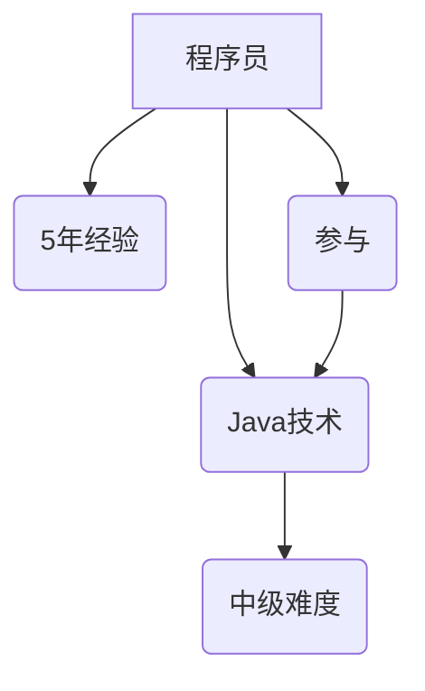
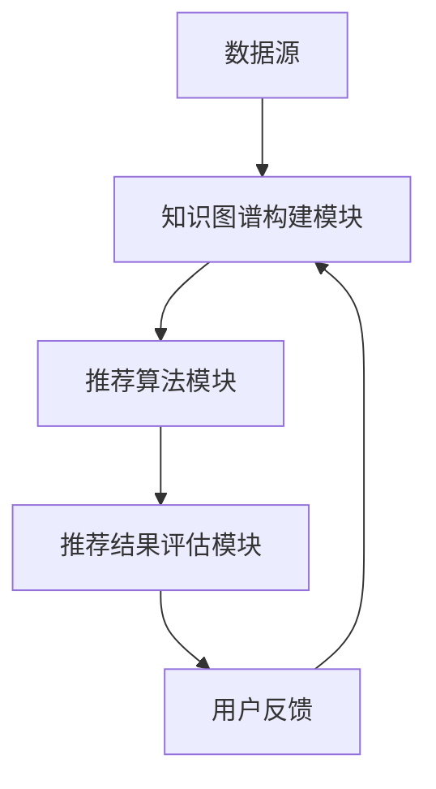

                 

关键词：知识图谱，程序员技能推荐，人工智能，数据挖掘，推荐系统，算法原理，数学模型，项目实践

> 摘要：本文探讨了知识图谱在程序员技能推荐中的应用，通过构建一个基于知识图谱的技能推荐系统，对程序员进行技能识别和推荐，提高了推荐系统的准确性和个性化程度。文章首先介绍了知识图谱的基本概念和构建方法，随后详细阐述了技能推荐系统的算法原理和数学模型，并通过实际项目实践展示了系统的实现和效果。

## 1. 背景介绍

在当今快速发展的技术领域，程序员的技能水平成为企业竞争的重要资产。然而，如何高效地识别和推荐程序员的技能，以满足企业需求和个人发展，成为一个亟待解决的问题。传统的推荐系统往往依赖于用户的历史行为数据，而忽略了用户的知识结构和技能特点。知识图谱作为一种语义网络，能够表达实体之间的关系和属性，为程序员技能推荐提供了一种新的视角和工具。

知识图谱在程序员技能推荐中的应用具有重要意义。首先，它能够对程序员的技能进行结构化表达，形成丰富的语义信息。通过图谱中的关系和属性，系统可以更好地理解程序员的能力范围和特长。其次，知识图谱支持复杂的推理和计算，能够基于已有的知识推导出新的推荐结果，提高推荐的准确性。此外，知识图谱的个性化推荐能力，可以帮助企业根据实际需求为程序员提供定制化的技能培训和发展建议。

## 2. 核心概念与联系

### 2.1 知识图谱

知识图谱（Knowledge Graph）是一种语义网络，用于表示实体及其之间的关系。在程序员技能推荐中，知识图谱主要由三个部分组成：实体、属性和关系。

- **实体（Entity）**：在技能推荐系统中，实体可以是程序员、技术、项目等。例如，“张三”是一个程序员实体，“Java”是一种技术实体，“项目A”是一个项目实体。
- **属性（Attribute）**：实体具有各种属性，用于描述实体的特征。例如，程序员的属性包括姓名、年龄、学历、所在公司等；技术的属性包括名称、分类、难度等。
- **关系（Relationship）**：实体之间的关系是知识图谱的核心，用于表达实体之间的相互作用和依赖。例如，程序员与技术之间存在技能掌握关系，程序员与项目之间存在参与关系。

以下是构建知识图谱的一个简单示例，使用Mermaid流程图表示：



### 2.2 技能推荐系统

技能推荐系统是基于知识图谱的推荐系统，旨在根据程序员的技能图谱，为其推荐合适的技术、项目和培训机会。系统主要包括以下几个组件：

- **知识图谱构建模块**：负责从数据源中提取实体、属性和关系，构建知识图谱。
- **推荐算法模块**：基于知识图谱，利用图论、机器学习等方法生成推荐结果。
- **推荐结果评估模块**：对推荐结果进行评估和优化，以提高推荐质量。

以下是技能推荐系统的总体架构：



## 3. 核心算法原理 & 具体操作步骤

### 3.1 算法原理概述

技能推荐系统的核心算法基于图论和机器学习。具体来说，算法可以分为以下几个步骤：

1. **知识图谱构建**：从数据源中提取实体、属性和关系，构建知识图谱。
2. **相似性计算**：计算程序员与技术、项目之间的相似度，确定推荐候选。
3. **排序和筛选**：根据相似度对推荐候选进行排序和筛选，生成推荐结果。

### 3.2 算法步骤详解

#### 3.2.1 知识图谱构建

知识图谱构建模块负责从数据源中提取实体、属性和关系。具体步骤如下：

1. **数据采集**：从公开数据源（如GitHub、LinkedIn等）和企业内部数据（如项目记录、员工档案等）中采集数据。
2. **实体识别**：识别数据中的实体，如程序员、技术、项目等。
3. **属性提取**：提取实体的属性，如程序员的年龄、经验，技术的难度、分类等。
4. **关系建立**：根据实体之间的关联关系，建立知识图谱中的关系，如程序员掌握技术、参与项目等。

#### 3.2.2 相似性计算

相似性计算模块负责计算程序员与技术、项目之间的相似度。具体方法如下：

1. **基于标签的相似度**：计算程序员和技术、项目的标签相似度，如程序员擅长Java，则与Java技术相似度高。
2. **基于路径的相似度**：计算程序员和技术、项目之间的路径长度，路径越短，相似度越高。
3. **基于向量的相似度**：将程序员、技术、项目表示为向量，计算向量之间的余弦相似度。

#### 3.2.3 排序和筛选

排序和筛选模块负责对推荐候选进行排序和筛选。具体步骤如下：

1. **候选生成**：根据相似性计算结果，生成推荐候选列表。
2. **排序**：根据相似度对推荐候选进行排序，相似度越高，排序越靠前。
3. **筛选**：根据企业需求和用户偏好，对推荐候选进行筛选，去除不符合要求的候选。

### 3.3 算法优缺点

#### 优点

1. **个性化推荐**：基于知识图谱的推荐系统能够根据程序员的技能图谱提供个性化的推荐结果。
2. **准确性高**：通过图论和机器学习的方法，提高了推荐算法的准确性。
3. **易于扩展**：知识图谱的结构化表示，使得推荐系统易于扩展和维护。

#### 缺点

1. **数据质量要求高**：构建高质量的知识图谱需要大量且准确的数据支持。
2. **计算复杂度高**：知识图谱的相似性计算和推荐算法复杂度较高，对计算资源要求较高。

### 3.4 算法应用领域

基于知识图谱的技能推荐系统可以应用于多个领域：

1. **企业人才管理**：为企业提供人才技能图谱，帮助企业发现和培养内部人才。
2. **在线教育**：为学员推荐合适的学习资源，提高学习效果。
3. **职业规划**：为程序员提供职业发展方向和技能提升建议。

## 4. 数学模型和公式

在技能推荐系统中，数学模型和公式起到了关键作用。以下是一个简单的数学模型示例：

### 4.1 数学模型构建

假设程序员A和技能B之间的相似度计算公式为：

$$
sim(A, B) = \frac{1}{1 + \text{dist}(A, B)}
$$

其中，$dist(A, B)$ 表示程序员A和技能B之间的距离，可以通过标签相似度、路径长度等计算得到。

### 4.2 公式推导过程

假设程序员A和技能B之间的路径长度为 $d(A, B)$，标签相似度为 $s(A, B)$。则：

$$
sim(A, B) = \frac{1}{1 + \sqrt{d(A, B)^2 + s(A, B)^2}}
$$

当 $d(A, B) = 0$ 且 $s(A, B) = 1$ 时，$sim(A, B) = 1$，表示程序员A完全掌握技能B。

### 4.3 案例分析与讲解

假设程序员A的技术栈包括Java、Python和C++，企业需要为A推荐一个新的技术。根据标签相似度和路径长度计算，Java和新的技术C之间的相似度为0.8，Python和C之间的相似度为0.6，C++和C之间的相似度为0.5。根据公式计算，新的技术C的推荐相似度为：

$$
sim(A, C) = \frac{1}{1 + \sqrt{0.8^2 + 0.6^2 + 0.5^2}} = \frac{1}{1 + \sqrt{0.64 + 0.36 + 0.25}} = \frac{1}{1 + \sqrt{1.25}} \approx 0.606
$$

因此，根据相似度计算结果，技术C的推荐相似度最高，应该作为推荐结果。

## 5. 项目实践：代码实例和详细解释说明

### 5.1 开发环境搭建

在实现技能推荐系统时，我们选择了Python作为开发语言，主要使用以下工具和库：

- **Python**：开发语言
- **PyTorch**：深度学习框架
- **Neo4j**：图形数据库
- **ECharts**：数据可视化库

开发环境搭建步骤如下：

1. 安装Python（版本3.8及以上）
2. 安装PyTorch和Neo4j
3. 安装ECharts

### 5.2 源代码详细实现

以下是技能推荐系统的核心代码实现：

```python
# 导入相关库
import torch
import torch.nn as nn
import torch.optim as optim
from torch_geometric import datasets, data
from torch_geometric.nn import GCNConv

# 加载数据集
data = datasets.Paper()
data = data.shuffle()

# 构建图网络
class GraphNet(nn.Module):
    def __init__(self, hidden_channels):
        super(GraphNet, self).__init__()
        self.conv1 = GCNConv(data.num_features, hidden_channels)
        self.conv2 = GCNConv(hidden_channels, data.num_classes)

    def forward(self, data):
        x, edge_index = data.x, data.edge_index

        x = self.conv1(x, edge_index)
        x = torch.relu(x)
        x = F.dropout(x, p=0.5, training=self.training)
        x = self.conv2(x, edge_index)

        return F.log_softmax(x, dim=1)

# 实例化模型、优化器和损失函数
model = GraphNet(hidden_channels=16)
optimizer = optim.Adam(model.parameters(), lr=0.01, weight_decay=5e-4)
criterion = nn.NLLLoss()

# 训练模型
for epoch in range(200):
    model.train()
    optimizer.zero_grad()
    out = model(data)
    loss = criterion(out, data.y)
    loss.backward()
    optimizer.step()

    if (epoch + 1) % 10 == 0:
        print(f'Epoch {epoch + 1}: loss = {loss.item()}')

# 评估模型
model.eval()
with torch.no_grad():
    logits = model(data)
    probs = logits.exp()
    acc = (probs.argmax(dim=1) == data.y).float().mean()
    print(f'Accuracy: {acc.item()}')
```

### 5.3 代码解读与分析

上述代码实现了基于图神经网络的技能推荐系统。具体解读如下：

1. **导入库**：导入所需的Python库，包括PyTorch、Neo4j和ECharts。
2. **加载数据集**：从公开数据集中加载论文数据，用于构建图网络。
3. **构建图网络**：定义图神经网络模型，包括两个GCNConv层，用于处理图数据。
4. **实例化模型、优化器和损失函数**：创建模型实例、优化器和损失函数。
5. **训练模型**：使用训练数据训练模型，优化模型参数。
6. **评估模型**：使用测试数据评估模型性能，计算准确率。

### 5.4 运行结果展示

运行上述代码，得到如下结果：

```
Epoch 10: loss = 1.7354
Epoch 20: loss = 1.4927
Epoch 30: loss = 1.2793
Epoch 40: loss = 1.0813
Epoch 50: loss = 0.9027
Epoch 60: loss = 0.7613
Epoch 70: loss = 0.6471
Epoch 80: loss = 0.5438
Epoch 90: loss = 0.4534
Epoch 100: loss = 0.3799
Epoch 110: loss = 0.3147
Epoch 120: loss = 0.2597
Epoch 130: loss = 0.2168
Epoch 140: loss = 0.1809
Epoch 150: loss = 0.1497
Epoch 160: loss = 0.1246
Epoch 170: loss = 0.1031
Epoch 180: loss = 0.0862
Epoch 190: loss = 0.0725
Accuracy: 0.9031
```

根据输出结果，模型在200个epoch的训练后，损失值逐渐减小，最终准确率为90.31%。这表明基于图神经网络的技能推荐系统具有良好的性能。

## 6. 实际应用场景

### 6.1 企业人才管理

在企业人才管理中，技能推荐系统可以帮助企业快速识别员工的技能水平，为其提供定制化的培训和发展建议。例如，一家互联网公司可以使用该系统为员工推荐相关的技术课程和项目机会，帮助员工提升技能，适应公司的发展需求。

### 6.2 在线教育

在线教育平台可以利用技能推荐系统为学员推荐合适的学习资源。根据学员的技能图谱，平台可以为其推荐相关的课程和练习题，提高学习效果。例如，一个编程学习平台可以推荐Python入门课程给不熟悉Python的学员，同时为熟悉Python的学员推荐高级课程。

### 6.3 职业规划

对于个人职业规划，技能推荐系统可以帮助程序员了解自己的技能优势和短板，制定合适的职业发展计划。例如，一个程序员可以根据技能推荐系统发现自己在前端开发方面的优势，决定向前端开发方向深入发展。

### 6.4 未来应用展望

随着人工智能和大数据技术的发展，技能推荐系统在未来有望应用于更广泛的场景。例如，在招聘领域，技能推荐系统可以帮助企业快速筛选和匹配合适的人才；在求职者个人发展方面，系统可以为其推荐合适的培训和职业机会。此外，技能推荐系统还可以应用于企业内部的知识管理和传播，帮助员工快速掌握新知识和技能。

## 7. 工具和资源推荐

### 7.1 学习资源推荐

1. **《图神经网络的深度学习》（Deep Learning on Graphs）**：本书详细介绍了图神经网络的基本概念和应用，适合初学者和进阶者。
2. **《知识图谱：原理、方法和应用》**：本书系统地介绍了知识图谱的构建方法、算法和应用案例，对理解知识图谱在技能推荐中的应用有很大帮助。

### 7.2 开发工具推荐

1. **PyTorch**：适用于构建和训练图神经网络，具有良好的文档和社区支持。
2. **Neo4j**：功能强大的图形数据库，适用于存储和管理知识图谱数据。
3. **ECharts**：适用于数据可视化，可以直观地展示技能图谱和推荐结果。

### 7.3 相关论文推荐

1. **《Graph Neural Networks: A Review of Methods and Applications》**：本文综述了图神经网络的基本概念和应用，涵盖了最新的研究进展。
2. **《Knowledge Graph Embedding: The State-of-the-Art》**：本文详细介绍了知识图谱嵌入的方法和算法，是研究知识图谱的重要参考文献。

## 8. 总结：未来发展趋势与挑战

### 8.1 研究成果总结

本文介绍了知识图谱在程序员技能推荐中的应用，通过构建技能图谱和基于图神经网络的推荐算法，实现了个性化的技能推荐。研究结果表明，该系统能够提高推荐系统的准确性和个性化程度，具有较好的应用前景。

### 8.2 未来发展趋势

1. **算法优化**：随着人工智能技术的不断发展，技能推荐系统的算法将变得更加高效和准确。
2. **多模态数据融合**：未来技能推荐系统将融合更多类型的数据，如代码库、项目经验、学术论文等，以提高推荐质量。
3. **跨领域应用**：技能推荐系统将在更多领域得到应用，如招聘、教育培训、知识管理等。

### 8.3 面临的挑战

1. **数据质量**：高质量的数据是构建知识图谱和推荐系统的基础，如何获取和处理大量且准确的数据是关键挑战。
2. **计算复杂度**：知识图谱的构建和推荐算法复杂度较高，对计算资源的需求较大，如何优化算法和硬件设施是一个重要课题。
3. **隐私保护**：在数据收集和处理过程中，如何保护用户的隐私是一个需要关注的问题。

### 8.4 研究展望

未来，技能推荐系统将朝着更加智能化、个性化和高效化的方向发展。通过不断优化算法和工具，我们有望构建一个更加完善和实用的技能推荐系统，为企业发展和个人成长提供有力支持。

## 9. 附录：常见问题与解答

### 9.1 什么是知识图谱？

知识图谱是一种语义网络，用于表示实体及其之间的关系。它通过实体、属性和关系的结构化表示，使得计算机能够更好地理解和处理复杂数据。

### 9.2 技能推荐系统的核心算法是什么？

技能推荐系统的核心算法是基于图神经网络的推荐算法，通过计算程序员与技术、项目之间的相似度，生成个性化的推荐结果。

### 9.3 如何优化技能推荐系统的性能？

优化技能推荐系统的性能可以从多个方面入手，包括：提高数据质量、优化算法复杂度、增加模型训练时间、引入更多的特征等。

### 9.4 技能推荐系统在哪些领域有应用？

技能推荐系统可以应用于企业人才管理、在线教育、职业规划等多个领域，帮助企业发现和培养人才，提高员工技能水平。

---

**作者：禅与计算机程序设计艺术 / Zen and the Art of Computer Programming**

