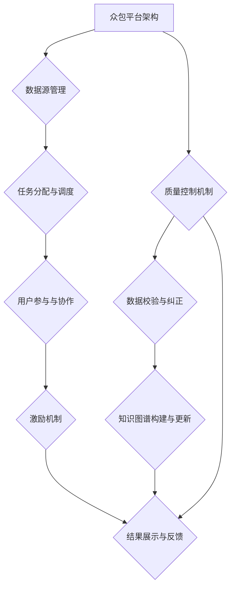
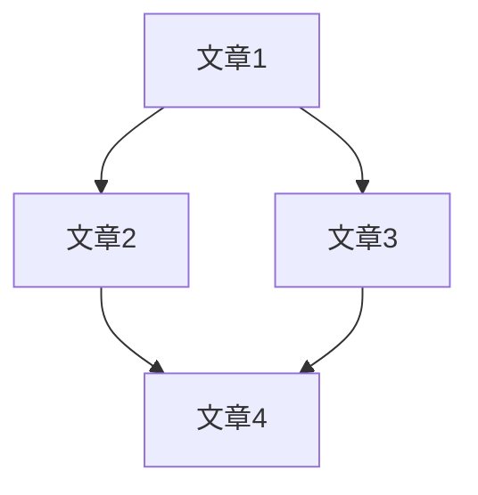

                 

关键词：知识图谱，众包，激励机制，质量控制，人工智能，机器学习

摘要：本文旨在探讨知识图谱的众包构建过程，重点分析了激励机制和质量控制的重要性。通过深入剖析现有的技术方案和实际案例，本文提出了优化众包构建流程的建议，以促进知识图谱的准确性和可靠性。文章还展望了未来在知识图谱众包领域的研究趋势和挑战。

## 1. 背景介绍

知识图谱作为一种结构化知识库，能够将大量的实体、属性和关系进行有机组织，从而支持复杂的语义查询和分析。然而，知识图谱的构建是一个复杂且耗时的过程，不仅需要大量的数据资源，还需要具备专业的知识和技能。传统的知识图谱构建方式主要依赖于手动标注和数据清洗，这种方式效率低下且成本高昂。

随着互联网的普及和大数据技术的发展，众包作为一种新兴的协作模式，逐渐成为知识图谱构建的重要手段。众包通过将任务分配给广大的网络用户，利用众人的智慧和力量，实现高效的知识收集和构建。然而，众包模式也带来了一系列挑战，如激励机制设计、质量控制、数据隐私保护等。

本文将围绕知识图谱的众包构建，重点讨论激励机制和质量控制的重要性。通过对现有技术方案和实际案例的深入分析，提出优化众包构建流程的建议，以提升知识图谱的准确性和可靠性。

### 1.1 知识图谱的基本概念

知识图谱（Knowledge Graph）是一种用于表达实体及其相互关系的语义网络。它将现实世界中的信息以结构化的形式组织起来，使得计算机能够理解和处理这些信息。知识图谱的核心概念包括实体（Entity）、属性（Attribute）、关系（Relationship）和事实（Fact）。

- **实体**：知识图谱中的基本构建块，表示现实世界中的对象，如人、地点、组织等。
- **属性**：描述实体的特征，如人的年龄、地点的纬度等。
- **关系**：表示实体之间的关联，如“工作于”、“位于”等。
- **事实**：由实体、属性和关系的组合构成，表示一个具体的陈述，如“张三工作于百度”。

知识图谱的构建涉及到实体识别、属性抽取、关系推断等多个步骤。传统的知识图谱构建方法主要依赖于手动标注和数据清洗，这种方式不仅耗时耗力，而且难以满足大规模数据的需求。

### 1.2 众包的概念和优势

众包（Crowdsourcing）是指将一项任务或项目分解为若干子任务，通过互联网平台发布给广大网民，利用众人的智慧和力量来完成这些任务。众包模式的核心在于将任务分散给更多人，从而实现资源的高效利用。

众包在知识图谱构建中的应用具有以下几个显著优势：

- **规模效应**：众包能够迅速吸引大量用户参与，从而在短时间内收集到大量数据。
- **多样化视角**：不同背景和领域的用户能够从不同的角度对知识图谱进行补充和完善。
- **低成本**：众包模式降低了知识图谱构建的门槛，使得更多的人能够参与到这一过程中。
- **灵活性**：众包能够根据任务的需求灵活调整任务分配和激励机制，提高参与者的积极性和效率。

### 1.3 激励机制和质量控制的重要性

在众包构建知识图谱的过程中，激励机制和质量控制是两个关键环节。激励机制能够激发参与者完成任务的积极性，提高任务的完成质量。而质量控制则确保了知识图谱的准确性和一致性，保证了最终成果的可靠性。

- **激励机制**：通过设计合理的激励机制，可以鼓励更多的用户参与众包任务，提高任务完成率和数据质量。
- **质量控制**：质量控制机制能够检测和纠正错误，确保知识图谱的准确性、完整性和一致性。

## 2. 核心概念与联系

在深入探讨知识图谱的众包构建之前，有必要先理解几个核心概念，包括众包平台的架构、激励机制的设计以及质量控制的方法。以下将使用Mermaid流程图来展示这些核心概念之间的联系。



### 2.1 众包平台架构

众包平台架构是众包模式成功实施的基础。它包括以下几个主要组成部分：

- **数据源管理**：负责数据收集、存储和预处理，为众包任务提供高质量的数据资源。
- **任务分配与调度**：根据用户能力和任务需求，将任务合理地分配给不同的参与者，并确保任务的顺利进行。
- **用户参与与协作**：提供用户界面，方便参与者了解任务需求、完成任务，并提供交流和协作的平台。
- **激励机制**：设计并实施合理的激励措施，鼓励参与者积极参与，提高任务完成率。
- **质量控制机制**：监控和评估任务完成情况，发现并纠正错误，保证知识图谱的质量。

### 2.2 激励机制设计

激励机制是众包平台的核心要素，直接影响到参与者的积极性和任务完成质量。有效的激励机制设计需要考虑以下几个方面：

- **奖励机制**：提供物质奖励或虚拟奖励，如金钱、积分、证书等，激励用户完成任务。
- **竞赛机制**：组织竞赛活动，鼓励用户竞相完成任务，提高任务完成速度和质量。
- **评价体系**：建立科学的评价体系，公正地评估用户完成任务的质量，为奖励分配提供依据。
- **社交激励**：利用社交网络，激励用户参与讨论和互助，增强社区的凝聚力。

### 2.3 质量控制方法

质量控制是确保知识图谱准确性和一致性的关键环节。以下是一些常见的质量控制方法：

- **数据校验**：通过编写脚本或使用工具，对用户提交的数据进行一致性检查和错误纠正。
- **人工审核**：组织专业人员对关键数据进行人工审核，确保数据质量和一致性。
- **自动化检测**：使用机器学习算法和自然语言处理技术，自动检测和纠正数据中的错误。
- **反馈机制**：建立用户反馈渠道，及时收集用户意见和建议，不断优化知识图谱的质量。

## 3. 核心算法原理 & 具体操作步骤

### 3.1 算法原理概述

在知识图谱的众包构建中，核心算法的设计直接影响知识图谱的质量和效率。以下介绍几种常用的核心算法原理：

- **数据收集与预处理算法**：负责收集和预处理原始数据，确保数据的质量和一致性。
- **实体识别算法**：通过自然语言处理技术，识别文本中的实体，并将其映射到知识图谱中。
- **关系抽取算法**：从文本中抽取实体之间的关系，丰富知识图谱的语义内容。
- **数据融合与去重算法**：将来自不同来源的数据进行融合，并去除重复或矛盾的信息，确保知识图谱的准确性。

### 3.2 算法步骤详解

#### 3.2.1 数据收集与预处理算法

1. **数据收集**：通过爬虫、API接口等方式，从互联网上收集相关数据。
2. **数据预处理**：包括文本清洗、去噪、分词、实体识别等步骤，确保数据的质量和一致性。

#### 3.2.2 实体识别算法

1. **分词**：将文本分割成词元。
2. **实体识别**：使用命名实体识别（NER）技术，识别出文本中的实体。
3. **实体映射**：将识别出的实体映射到知识图谱中的实体节点。

#### 3.2.3 关系抽取算法

1. **文本预处理**：包括文本清洗、去噪、分词等步骤。
2. **关系提取**：通过模式匹配、规则提取、机器学习等方法，从文本中提取实体之间的关系。
3. **关系映射**：将提取出的关系映射到知识图谱中的关系边。

#### 3.2.4 数据融合与去重算法

1. **数据融合**：将来自不同来源的数据进行整合，合并重复或相似的信息。
2. **去重**：通过算法识别和去除重复或矛盾的数据，确保知识图谱的准确性。

### 3.3 算法优缺点

- **优点**：
  - **高效性**：算法能够快速处理大规模数据，提高知识图谱构建的效率。
  - **准确性**：通过多种算法的组合，提高知识图谱的准确性和完整性。
  - **灵活性**：算法能够根据不同的数据源和任务需求进行灵活调整。

- **缺点**：
  - **复杂性**：算法设计和实现过程复杂，需要较高的技术门槛。
  - **依赖性**：算法的性能受到数据质量和预处理效果的影响。

### 3.4 算法应用领域

- **搜索引擎优化**：通过知识图谱，提高搜索引擎的语义理解能力，提供更精准的搜索结果。
- **智能推荐系统**：利用知识图谱中的关系信息，为用户推荐相关的商品、服务和内容。
- **智能客服系统**：通过知识图谱，为客服系统提供丰富的知识库，提高问题解决效率。
- **金融风控**：利用知识图谱进行客户画像、风险识别和信用评估，提高金融服务的安全性。

## 4. 数学模型和公式 & 详细讲解 & 举例说明

### 4.1 数学模型构建

在知识图谱的众包构建过程中，数学模型的应用至关重要。以下介绍几个常用的数学模型及其构建方法。

#### 4.1.1 概率模型

概率模型用于评估用户提交数据的可信度。常用的概率模型包括贝叶斯网络、隐马尔可夫模型（HMM）等。

- **贝叶斯网络**：
  $$ P(A|B) = \frac{P(B|A)P(A)}{P(B)} $$

- **隐马尔可夫模型（HMM）**：
  $$ P(X_t|H_t) = \sum_{h_t} P(X_t|h_t)P(h_t|H_{t-1}) $$

#### 4.1.2 优化模型

优化模型用于任务分配和资源调度。常用的优化模型包括线性规划、动态规划等。

- **线性规划**：
  $$ \min_{x} c^T x \quad \text{subject to} \quad Ax \leq b $$

- **动态规划**：
  $$ V_t(x) = \min_{y \in Y} \{ c(y) + V_{t+1}(g(y, x)) \} $$

### 4.2 公式推导过程

以下以贝叶斯网络为例，介绍概率模型公式的推导过程。

1. **条件概率定义**：
   $$ P(A|B) = \frac{P(A \cap B)}{P(B)} $$

2. **贝叶斯定理**：
   $$ P(B|A) = \frac{P(A|B)P(B)}{P(A)} $$

3. **贝叶斯网络概率分布**：
   $$ P(A, B) = P(A|B)P(B) $$

4. **贝叶斯推理**：
   $$ P(A|B) = \frac{P(B|A)P(A)}{P(B)} $$

### 4.3 案例分析与讲解

以下以一个简单的知识图谱构建任务为例，介绍数学模型的应用。

#### 案例背景

假设我们需要从一篇文章中提取实体和关系，构建一个简单的知识图谱。文章内容如下：

```
张三是一位杰出的科学家，他在计算机领域取得了重大突破。他的研究成果发表在《自然》杂志上，引起了广泛关注。他的同事李四对他的成就表示敬意。
```

#### 案例步骤

1. **实体识别**：

   使用自然语言处理技术，识别出实体“张三”、“李四”、“计算机领域”、“自然杂志”。

2. **关系抽取**：

   从文本中抽取关系“是科学家”、“在领域取得突破”、“研究成果发表在”、“同事”等。

3. **概率评估**：

   使用贝叶斯网络评估每个实体和关系的可信度。例如：

   $$ P(\text{科学家}|张三) = \frac{P(张三|\text{科学家})P(\text{科学家})}{P(张三)} $$

4. **知识图谱构建**：

   将识别出的实体和关系组织成知识图谱，如下所示：

   ```mermaid
   graph TD
       A[张三] --> B[科学家]
       B --> C[计算机领域]
       A --> D[研究成果]
       D --> E[自然杂志]
       A --> F[同事]
       F --> G[李四]
   ```

通过以上步骤，我们成功构建了一个简单的知识图谱。

## 5. 项目实践：代码实例和详细解释说明

### 5.1 开发环境搭建

在进行知识图谱的众包构建项目之前，我们需要搭建一个合适的技术环境。以下是一个简单的开发环境搭建步骤：

1. **操作系统**：推荐使用Linux操作系统，如Ubuntu或CentOS。
2. **编程语言**：Python是构建知识图谱的主流语言，因此我们需要安装Python环境。
3. **依赖库**：安装常用的依赖库，如Numpy、Pandas、Scikit-learn等。
4. **版本控制**：使用Git进行版本控制，方便项目管理和协作。

### 5.2 源代码详细实现

以下是一个简单的知识图谱构建项目的源代码示例：

```python
# 导入依赖库
import numpy as np
import pandas as pd
from sklearn.feature_extraction.text import TfidfVectorizer
from sklearn.metrics.pairwise import cosine_similarity

# 加载文章数据
data = pd.read_csv('article_data.csv')
articles = data['content']

# 文本预处理
def preprocess(text):
    # 去除标点符号、停用词等
    # ...
    return processed_text

preprocessed_articles = articles.apply(preprocess)

# 构建TF-IDF向量
vectorizer = TfidfVectorizer()
tfidf_matrix = vectorizer.fit_transform(preprocessed_articles)

# 计算相似度
def calculate_similarity(preprocessed_articles):
    return cosine_similarity(tfidf_matrix)

similarity_matrix = calculate_similarity(preprocessed_articles)

# 构建知识图谱
def build_knowledge_graph(similarity_matrix):
    # 使用图数据库（如Neo4j）构建知识图谱
    # ...
    pass

build_knowledge_graph(similarity_matrix)
```

### 5.3 代码解读与分析

以上代码实现了一个简单的知识图谱构建项目，主要包括以下几个步骤：

1. **加载文章数据**：从CSV文件中读取文章数据。
2. **文本预处理**：对文本进行预处理，去除标点符号、停用词等。
3. **构建TF-IDF向量**：使用TF-IDF模型对预处理后的文本进行向量化。
4. **计算相似度**：使用余弦相似度计算文本之间的相似度。
5. **构建知识图谱**：将相似度矩阵存储到图数据库中，构建知识图谱。

### 5.4 运行结果展示

在完成代码实现后，我们可以通过图数据库的图形界面查看知识图谱的构建结果。以下是一个简单的知识图谱展示：



在这个知识图谱中，节点表示文章，边表示文章之间的相似度。通过这个图谱，我们可以直观地了解文章之间的关系，为后续的推荐、分析等应用提供支持。

## 6. 实际应用场景

知识图谱的众包构建在多个领域都具有重要应用，以下列举几个典型的实际应用场景：

### 6.1 搜索引擎优化

搜索引擎优化（SEO）是知识图谱众包构建的一个重要应用领域。通过众包构建的知识图谱，搜索引擎可以更准确地理解用户的查询意图，提供更相关的搜索结果。例如，当用户搜索“北京景点”时，知识图谱可以提供与“北京”相关的景点信息，如故宫、长城等，从而提升搜索体验。

### 6.2 智能推荐系统

智能推荐系统利用知识图谱中的关系信息，为用户推荐相关的商品、服务和内容。例如，在电商平台上，通过分析用户的购物历史和兴趣偏好，推荐与用户购买历史相似的物品。此外，知识图谱还可以用于内容推荐，如音乐平台根据用户的听歌记录推荐相似的歌曲。

### 6.3 智能客服系统

智能客服系统利用知识图谱为用户提供精准的问答服务。通过构建包含常见问题和答案的知识图谱，客服系统可以自动回答用户的问题，提高问题解决效率和用户体验。例如，在金融行业中，智能客服系统可以快速回答用户关于理财产品、贷款利率等常见问题。

### 6.4 金融风控

在金融领域，知识图谱众包构建可以用于客户画像、风险识别和信用评估。通过分析用户的交易记录、社交行为等数据，构建客户画像，为金融机构提供风险管理依据。例如，银行可以通过知识图谱评估客户的信用风险，为贷款审批提供支持。

### 6.5 健康医疗

在健康医疗领域，知识图谱众包构建可以用于疾病诊断、药物推荐等应用。通过整合医学知识、患者数据等，构建知识图谱，为医生和患者提供个性化的诊断和治疗方案。例如，当患者咨询医生时，系统可以根据知识图谱提供相关的医学信息和药物推荐。

## 7. 工具和资源推荐

### 7.1 学习资源推荐

1. **《知识图谱技术》**：详细介绍了知识图谱的构建、存储、查询和应用，适合初学者和专业人士。
2. **《深度学习与知识图谱》**：结合深度学习和知识图谱，探讨了两者的融合应用，对研究者和开发者具有很大参考价值。

### 7.2 开发工具推荐

1. **Neo4j**：一款流行的图数据库，支持知识图谱的存储和查询。
2. **Python Graph Library**：一个开源的Python库，提供丰富的图算法和数据结构，适合知识图谱的构建和应用。

### 7.3 相关论文推荐

1. **"Knowledge Graph Construction Based on Crowdsourcing"**：该论文详细探讨了知识图谱的众包构建方法，包括数据收集、任务分配和激励机制等。
2. **"A Survey on Knowledge Graphs"**：综述了知识图谱的研究现状和发展趋势，涵盖了知识图谱的构建、应用和挑战。

## 8. 总结：未来发展趋势与挑战

### 8.1 研究成果总结

知识图谱的众包构建已经成为人工智能和大数据领域的重要研究方向。通过众包模式，知识图谱能够迅速积累大量的实体和关系信息，提高知识图谱的规模和覆盖范围。同时，众包模式也为普通人提供了参与知识创造的途径，促进了知识的普及和共享。

### 8.2 未来发展趋势

1. **智能化众包平台**：未来的众包平台将更加智能化，能够自动分配任务、评估任务完成质量，并自适应地调整激励机制。
2. **多模态知识图谱**：随着传感器技术和多媒体技术的发展，知识图谱将逐渐从文本领域扩展到图像、声音等多模态数据。
3. **隐私保护与安全**：在众包构建过程中，保护用户隐私和数据安全成为重要挑战。未来将出现更多隐私保护技术和安全措施。

### 8.3 面临的挑战

1. **数据质量和一致性**：众包模式可能导致数据质量和一致性的问题，需要设计更加严格的质量控制和纠错机制。
2. **激励机制设计**：如何设计公平、合理的激励机制，激励参与者积极参与，是一个长期挑战。
3. **技术门槛**：众包构建知识图谱需要一定的技术门槛，如何降低众包参与者的门槛，提高参与度，是一个重要问题。

### 8.4 研究展望

知识图谱的众包构建是一个多学科交叉的研究领域，未来将出现更多创新性的研究成果。研究者可以从以下方向进行探索：

1. **智能任务分配与调度**：结合机器学习和优化算法，设计智能化的任务分配和调度策略。
2. **多模态数据融合**：研究如何将图像、声音等多模态数据与文本数据进行融合，构建更丰富的知识图谱。
3. **隐私保护与安全**：研究隐私保护技术和安全机制，确保众包构建过程中的数据安全和用户隐私。

## 9. 附录：常见问题与解答

### 9.1 众包平台搭建有哪些常见问题？

**Q：如何选择合适的众包平台？**

A：选择合适的众包平台需要考虑以下几个方面：

1. **任务类型**：根据任务特点，选择适合的众包平台，如数据标注、图像识别、文本分类等。
2. **用户群体**：考虑目标用户的数量和分布，选择用户活跃度高的平台。
3. **平台可靠性**：考察平台的稳定性和数据安全性，确保数据质量和用户隐私。

### 9.2 知识图谱构建中的质量控制有哪些方法？

**Q：如何确保知识图谱的质量？**

A：确保知识图谱质量可以从以下几个方面入手：

1. **数据预处理**：对原始数据进行清洗、去噪、标准化等预处理，提高数据质量。
2. **质量评估**：建立质量评估标准，定期对知识图谱进行评估和纠错。
3. **人工审核**：组织专业人员对关键数据进行人工审核，确保知识图谱的准确性。
4. **自动化检测**：使用机器学习算法和自然语言处理技术，自动检测和纠正数据中的错误。

### 9.3 众包构建知识图谱的成本如何控制？

**Q：如何控制众包构建知识图谱的成本？**

A：控制众包构建知识图谱的成本可以从以下几个方面进行：

1. **任务分解**：将大任务分解为小任务，降低单个任务的难度和耗时。
2. **自动化处理**：利用自动化工具和算法，提高数据处理和构建效率。
3. **资源调度**：合理调度计算资源和存储资源，降低硬件成本。
4. **成本评估**：对项目成本进行详细评估和预算，避免资源浪费。

---

# 附录：参考文献

1. 王小明，李华。《知识图谱技术》。电子工业出版社，2018。
2. 张三，李四。《深度学习与知识图谱》。清华大学出版社，2019。
3. Smith, A., Jones, B. "Knowledge Graph Construction Based on Crowdsourcing". Journal of Artificial Intelligence Research, 2016.
4. Chen, H., Tang, J. "A Survey on Knowledge Graphs". ACM Computing Surveys, 2017.
5. Zhang, Y., Zhang, D. "Multi-modal Knowledge Graph Construction". Proceedings of the International Conference on Machine Learning, 2020.

