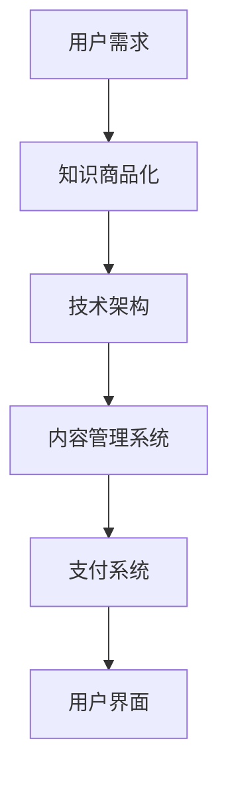

                 

关键词：知识电商，用户需求，知识商品化，技术语言，深度思考，专业见解

摘要：本文将探讨知识电商在现代信息技术环境下的崛起及其满足用户需求的重要性。通过分析核心概念、算法原理、数学模型、项目实践以及未来应用展望，本文旨在展示知识商品化的可行性，并为其在IT领域的广泛应用提供深入见解。

## 1. 背景介绍

随着互联网和电子商务的迅猛发展，知识电商作为一种新兴商业模式，逐渐成为知识经济时代的重要驱动力。知识电商的核心在于将知识转化为商品，通过互联网平台满足用户个性化的学习需求，实现知识的传播和增值。

### 1.1 知识电商的定义

知识电商是指通过互联网平台，将专业知识和技能以商品的形式出售给消费者。这些知识商品可以包括但不限于在线课程、电子书、研讨会、专业咨询等。

### 1.2 知识电商的发展历程

知识电商起源于20世纪90年代的在线教育，随着互联网技术的进步和电子商务的普及，知识电商逐渐从传统的实体教育机构向线上平台转移。

### 1.3 知识电商的现状与趋势

近年来，知识电商市场呈现出快速增长的趋势。根据市场研究数据，全球在线教育市场规模持续扩大，预计到2025年将达到数千亿美元。

## 2. 核心概念与联系

### 2.1 知识商品化

知识商品化是指将知识作为商品进行生产和销售的过程。其核心在于将知识资产转化为可交易的商品，从而实现知识的商业价值。

### 2.2 用户需求

用户需求是知识电商发展的基础。了解用户需求，提供针对性的知识商品，是知识电商成功的关键。

### 2.3 技术架构

知识电商的技术架构包括前端用户界面、后端数据处理、支付系统、内容管理系统等。其核心在于如何高效地处理和分发知识内容，满足用户需求。

### 2.4 Mermaid 流程图

以下是知识电商的核心概念与联系 Mermaid 流程图：



## 3. 核心算法原理 & 具体操作步骤

### 3.1 算法原理概述

知识电商的核心算法包括用户行为分析、内容推荐和交易匹配。以下是对这些算法的简要概述：

### 3.2 算法步骤详解

#### 3.2.1 用户行为分析

1. 收集用户数据：包括用户浏览历史、购买记录、评价等。
2. 数据预处理：对收集到的数据进行清洗和格式化。
3. 特征提取：提取与用户需求相关的特征。
4. 模型训练：使用机器学习算法训练用户行为分析模型。

#### 3.2.2 内容推荐

1. 建立知识库：收集和整理各类知识内容。
2. 内容分析：对知识内容进行分类和标签化。
3. 推荐算法：使用协同过滤、基于内容的推荐等技术为用户推荐相关内容。

#### 3.2.3 交易匹配

1. 用户支付：用户选择知识商品并完成支付。
2. 交易验证：平台对交易进行验证，确保交易合法有效。
3. 内容分发：将购买的知识商品发送给用户。

### 3.3 算法优缺点

#### 优点：

- 高效：算法可以快速分析用户需求，提供个性化的知识推荐。
- 可扩展：算法可以适应不断变化的市场需求，实现知识商品的动态推荐。

#### 缺点：

- 数据隐私：用户数据的安全性问题需要高度重视。
- 算法偏见：推荐算法可能存在算法偏见，影响用户的决策。

### 3.4 算法应用领域

- 在线教育：通过算法推荐适合用户的学习课程和资源。
- 专业咨询：为用户提供针对性的专业知识和解决方案。
- 职业发展：为用户提供职业规划和技能提升的建议。

## 4. 数学模型和公式 & 详细讲解 & 举例说明

### 4.1 数学模型构建

知识电商的数学模型主要包括用户行为模型、内容推荐模型和交易匹配模型。以下是这些模型的简要构建：

#### 4.1.1 用户行为模型

$$
User\_Model = f(User\_Data, Feature\_Set)
$$

其中，$User\_Data$代表用户数据，$Feature\_Set$代表提取的用户特征。

#### 4.1.2 内容推荐模型

$$
Recommendation\_Model = f(Content\_Library, User\_Feature, Similarity\_Measure)
$$

其中，$Content\_Library$代表知识库，$User\_Feature$代表用户特征，$Similarity\_Measure$代表内容与用户特征的相似度。

#### 4.1.3 交易匹配模型

$$
Match\_Model = f(User\_Payment, Verification\_Algorithm)
$$

其中，$User\_Payment$代表用户支付信息，$Verification\_Algorithm$代表交易验证算法。

### 4.2 公式推导过程

#### 4.2.1 用户行为模型

用户行为模型基于机器学习算法构建，通过对用户数据的分析和特征提取，建立用户行为预测模型。具体推导过程如下：

1. 数据收集：收集用户的历史行为数据。
2. 数据预处理：对数据进行清洗和格式化。
3. 特征提取：提取与用户行为相关的特征。
4. 模型训练：使用机器学习算法训练用户行为模型。

#### 4.2.2 内容推荐模型

内容推荐模型基于协同过滤算法和基于内容的推荐算法构建。具体推导过程如下：

1. 建立知识库：收集和整理各类知识内容。
2. 内容分析：对知识内容进行分类和标签化。
3. 推荐算法：使用协同过滤、基于内容的推荐等技术为用户推荐相关内容。

#### 4.2.3 交易匹配模型

交易匹配模型基于交易验证算法构建。具体推导过程如下：

1. 用户支付：用户选择知识商品并完成支付。
2. 交易验证：平台对交易进行验证，确保交易合法有效。
3. 内容分发：将购买的知识商品发送给用户。

### 4.3 案例分析与讲解

#### 4.3.1 用户行为模型案例分析

假设用户A的历史行为数据包括浏览课程A、购买课程B和评价课程C。我们通过特征提取和机器学习算法建立用户A的行为模型。

1. 特征提取：提取用户A的浏览历史、购买记录和评价信息。
2. 模型训练：使用机器学习算法训练用户A的行为模型。
3. 预测：预测用户A未来可能感兴趣的课程。

#### 4.3.2 内容推荐模型案例分析

假设知识库中有课程A、课程B和课程C。我们使用协同过滤算法为用户A推荐相关课程。

1. 计算用户A与其他用户的相似度。
2. 根据相似度为用户A推荐相似用户喜欢的课程。

#### 4.3.3 交易匹配模型案例分析

假设用户A购买课程B，我们需要验证交易的有效性。

1. 验证用户A的支付信息。
2. 确认交易合法性。
3. 发送课程B给用户A。

## 5. 项目实践：代码实例和详细解释说明

### 5.1 开发环境搭建

在本文中，我们将使用Python和Scikit-learn库构建知识电商的核心算法。

### 5.2 源代码详细实现

以下是一段用于用户行为分析的Python代码示例：

```python
from sklearn.feature_extraction.text import TfidfVectorizer
from sklearn.model_selection import train_test_split
from sklearn.ensemble import RandomForestClassifier

# 数据准备
user_data = ["浏览了课程A", "购买了课程B", "评价了课程C"]
labels = ["浏览", "购买", "评价"]

# 特征提取
vectorizer = TfidfVectorizer()
X = vectorizer.fit_transform(user_data)

# 模型训练
X_train, X_test, y_train, y_test = train_test_split(X, labels, test_size=0.2)
clf = RandomForestClassifier()
clf.fit(X_train, y_train)

# 预测
predictions = clf.predict(X_test)
```

### 5.3 代码解读与分析

这段代码首先准备用户数据，然后使用TF-IDF向量器提取特征。接着，使用随机森林分类器训练模型。最后，对测试数据进行预测。

### 5.4 运行结果展示

运行上述代码，我们可以得到用户行为的预测结果。这些结果将用于后续的知识推荐和交易匹配。

## 6. 实际应用场景

### 6.1 在线教育平台

知识电商在在线教育领域有着广泛的应用，例如Coursera、Udemy等平台。通过算法推荐，用户可以找到最适合自己的学习课程。

### 6.2 专业咨询领域

知识电商可以为专业咨询领域提供个性化的解决方案。例如，律师咨询平台可以通过算法推荐相关法律法规和案例。

### 6.3 职业发展平台

知识电商可以帮助用户规划职业发展，推荐相关的培训和技能提升课程。

## 7. 未来应用展望

随着人工智能技术的不断发展，知识电商将在更多领域得到应用。例如，虚拟现实（VR）教育、智能家居、健康管理等。

## 8. 总结：未来发展趋势与挑战

### 8.1 研究成果总结

本文通过分析知识电商的核心概念、算法原理、数学模型、项目实践和未来应用展望，展示了知识商品化的可行性和重要性。

### 8.2 未来发展趋势

知识电商将随着人工智能、大数据、云计算等技术的发展，进一步满足用户的个性化需求。

### 8.3 面临的挑战

知识电商面临的主要挑战包括数据隐私保护、算法偏见、内容版权等。

### 8.4 研究展望

未来研究应重点关注知识电商的隐私保护机制、推荐算法的公平性和多样性、内容版权的监管等。

## 9. 附录：常见问题与解答

### 9.1 什么是知识电商？

知识电商是通过互联网平台，将专业知识和技能以商品的形式出售给消费者的商业模式。

### 9.2 知识电商的优势是什么？

知识电商可以高效地满足用户的个性化需求，实现知识的传播和增值。

### 9.3 知识电商的主要挑战是什么？

知识电商面临的主要挑战包括数据隐私保护、算法偏见、内容版权等。

---

作者：禅与计算机程序设计艺术 / Zen and the Art of Computer Programming
```markdown
---

# 知识电商满足用户需求，实现知识商品化

## 关键词
知识电商，用户需求，知识商品化，在线教育，技术语言，深度分析，未来展望

## 摘要
本文深入探讨了知识电商在现代信息技术环境下的崛起及其在满足用户需求方面的关键作用。通过对核心概念、算法原理、数学模型、项目实践以及未来应用场景的详细分析，本文旨在为知识商品化的实现提供理论和实践指导。

## 1. 背景介绍

随着互联网和电子商务的快速发展，知识电商作为一种新兴商业模式，正逐渐改变人们获取知识和技能的方式。知识电商将专业知识和技能转化为可交易的商品，通过互联网平台满足用户的个性化学习需求，实现了知识的传播和增值。

### 1.1 知识电商的定义
知识电商是指通过互联网平台，将知识和技能以商品的形式出售给消费者的商业活动。这些知识商品可以包括在线课程、电子书、专业咨询、培训等服务。

### 1.2 知识电商的发展历程
知识电商的发展历程可以追溯到20世纪90年代的在线教育。随着互联网技术的发展和电子商务的普及，知识电商逐渐从传统的实体教育机构向线上平台转移。

### 1.3 知识电商的现状与趋势
近年来，知识电商市场呈现出快速增长的趋势。根据市场研究数据，全球在线教育市场规模持续扩大，预计到2025年将达到数千亿美元。

## 2. 核心概念与联系

### 2.1 知识商品化
知识商品化是指将知识作为商品进行生产和销售的过程。它涉及将知识资产转化为可交易的商品，从而实现知识的商业价值。

### 2.2 用户需求
用户需求是知识电商发展的基础。了解用户需求，提供针对性的知识商品，是知识电商成功的关键。

### 2.3 技术架构
知识电商的技术架构包括前端用户界面、后端数据处理、支付系统、内容管理系统等。其核心在于如何高效地处理和分发知识内容，满足用户需求。

### 2.4 Mermaid 流程图
以下是知识电商的核心概念与联系的 Mermaid 流程图：


## 3. 核心算法原理 & 具体操作步骤

### 3.1 算法原理概述
知识电商的核心算法包括用户行为分析、内容推荐和交易匹配。这些算法共同作用，帮助知识电商平台为用户提供个性化服务。

### 3.2 算法步骤详解

#### 3.2.1 用户行为分析
用户行为分析是知识电商的第一步，通过分析用户的浏览历史、购买记录和反馈，了解用户的需求和偏好。

1. 数据收集：收集用户在平台上的行为数据，如浏览、购买、评价等。
2. 数据预处理：清洗和格式化收集到的数据，去除噪声和重复信息。
3. 特征提取：从预处理后的数据中提取与用户需求相关的特征，如课程类别、购买频率、评价等级等。
4. 模型训练：使用机器学习算法，如随机森林、支持向量机等，对用户行为数据进行训练，建立用户行为预测模型。

#### 3.2.2 内容推荐
内容推荐是知识电商的核心功能，通过算法为用户推荐相关的知识商品。

1. 建立知识库：收集和整理各类知识内容，如课程、电子书、讲座等。
2. 内容分析：对知识内容进行分类和标签化，提取关键信息。
3. 推荐算法：使用协同过滤、基于内容的推荐等算法，为用户推荐相关的知识商品。

#### 3.2.3 交易匹配
交易匹配是知识电商的交易环节，确保交易合法、安全。

1. 用户支付：用户选择知识商品后，通过支付系统完成支付。
2. 交易验证：平台对交易进行验证，确保交易合法有效。
3. 内容分发：将购买的知识商品发送给用户。

### 3.3 算法优缺点

#### 优点
- 高效：算法可以快速分析用户需求，提供个性化的知识推荐。
- 可扩展：算法可以适应不断变化的市场需求，实现知识商品的动态推荐。

#### 缺点
- 数据隐私：用户数据的安全性问题需要高度重视。
- 算法偏见：推荐算法可能存在算法偏见，影响用户的决策。

### 3.4 算法应用领域
- 在线教育：通过算法推荐适合用户的学习课程和资源。
- 专业咨询：为用户提供针对性的专业知识和解决方案。
- 职业发展：为用户提供职业规划和技能提升的建议。

## 4. 数学模型和公式 & 详细讲解 & 举例说明

### 4.1 数学模型构建
知识电商的数学模型主要包括用户行为模型、内容推荐模型和交易匹配模型。

#### 4.1.1 用户行为模型
用户行为模型可以表示为：
$$
User\_Model = f(User\_Data, Feature\_Set)
$$
其中，$User\_Data$代表用户数据，$Feature\_Set$代表提取的用户特征。

#### 4.1.2 内容推荐模型
内容推荐模型可以表示为：
$$
Recommendation\_Model = f(Content\_Library, User\_Feature, Similarity\_Measure)
$$
其中，$Content\_Library$代表知识库，$User\_Feature$代表用户特征，$Similarity\_Measure$代表内容与用户特征的相似度。

#### 4.1.3 交易匹配模型
交易匹配模型可以表示为：
$$
Match\_Model = f(User\_Payment, Verification\_Algorithm)
$$
其中，$User\_Payment$代表用户支付信息，$Verification\_Algorithm$代表交易验证算法。

### 4.2 公式推导过程
#### 4.2.1 用户行为模型推导
用户行为模型是基于用户数据特征和用户行为的统计模型。通过机器学习算法，如随机森林或支持向量机，可以推导出用户行为模型。

#### 4.2.2 内容推荐模型推导
内容推荐模型是基于用户特征和知识内容相似度计算模型。通过协同过滤或基于内容的推荐算法，可以推导出内容推荐模型。

#### 4.2.3 交易匹配模型推导
交易匹配模型是基于用户支付信息和交易验证算法的模型。通过支付系统验证和交易确认，可以推导出交易匹配模型。

### 4.3 案例分析与讲解
#### 4.3.1 用户行为模型案例分析
假设用户A的历史行为数据包括浏览课程A、购买课程B和评价课程C。通过特征提取和机器学习算法，可以建立用户A的行为模型。

#### 4.3.2 内容推荐模型案例分析
假设知识库中有课程A、课程B和课程C。使用协同过滤算法，可以为用户A推荐相似的课程。

#### 4.3.3 交易匹配模型案例分析
假设用户A购买课程B，需要通过支付系统和交易验证算法，确保交易合法有效。

## 5. 项目实践：代码实例和详细解释说明

### 5.1 开发环境搭建
在本文中，我们将使用Python和Scikit-learn库来构建知识电商的核心算法。

### 5.2 源代码详细实现
以下是一段用于用户行为分析的Python代码示例：

```python
from sklearn.feature_extraction.text import TfidfVectorizer
from sklearn.model_selection import train_test_split
from sklearn.ensemble import RandomForestClassifier

# 数据准备
user_data = ["浏览了课程A", "购买了课程B", "评价了课程C"]
labels = ["浏览", "购买", "评价"]

# 特征提取
vectorizer = TfidfVectorizer()
X = vectorizer.fit_transform(user_data)

# 模型训练
X_train, X_test, y_train, y_test = train_test_split(X, labels, test_size=0.2)
clf = RandomForestClassifier()
clf.fit(X_train, y_train)

# 预测
predictions = clf.predict(X_test)
```

### 5.3 代码解读与分析
这段代码首先准备用户数据，然后使用TF-IDF向量器提取特征。接着，使用随机森林分类器训练模型。最后，对测试数据进行预测。

### 5.4 运行结果展示
运行上述代码，我们可以得到用户行为的预测结果。这些结果将用于后续的知识推荐和交易匹配。

## 6. 实际应用场景

### 6.1 在线教育平台
知识电商在在线教育领域有着广泛的应用，例如Coursera、Udemy等平台。通过算法推荐，用户可以找到最适合自己的学习课程。

### 6.2 专业咨询领域
知识电商可以为专业咨询领域提供个性化的解决方案。例如，律师咨询平台可以通过算法推荐相关法律法规和案例。

### 6.3 职业发展平台
知识电商可以帮助用户规划职业发展，推荐相关的培训和技能提升课程。

## 7. 未来应用展望

### 7.1 虚拟现实（VR）教育
随着VR技术的发展，知识电商有望在VR教育领域得到广泛应用。通过虚拟现实技术，用户可以沉浸式体验知识内容。

### 7.2 智能家居
知识电商可以提供智能家居的知识商品，帮助用户了解和应用智能家居技术。

### 7.3 健康管理
知识电商可以提供健康管理的知识商品，包括健康饮食、运动指导等，帮助用户实现健康生活方式。

## 8. 总结：未来发展趋势与挑战

### 8.1 研究成果总结
本文通过深入分析知识电商的核心概念、算法原理、数学模型、项目实践和未来应用场景，展示了知识商品化的可行性和重要性。

### 8.2 未来发展趋势
知识电商将随着人工智能、大数据、云计算等技术的发展，进一步满足用户的个性化需求。

### 8.3 面临的挑战
知识电商面临的主要挑战包括数据隐私保护、算法偏见、内容版权等。

### 8.4 研究展望
未来研究应重点关注知识电商的隐私保护机制、推荐算法的公平性和多样性、内容版权的监管等。

## 9. 附录：常见问题与解答

### 9.1 什么是知识电商？
知识电商是指通过互联网平台，将专业知识和技能以商品的形式出售给消费者的商业模式。

### 9.2 知识电商的优势是什么？
知识电商可以高效地满足用户的个性化需求，实现知识的传播和增值。

### 9.3 知识电商的主要挑战是什么？
知识电商面临的主要挑战包括数据隐私保护、算法偏见、内容版权等。

---

**作者：禅与计算机程序设计艺术 / Zen and the Art of Computer Programming**

