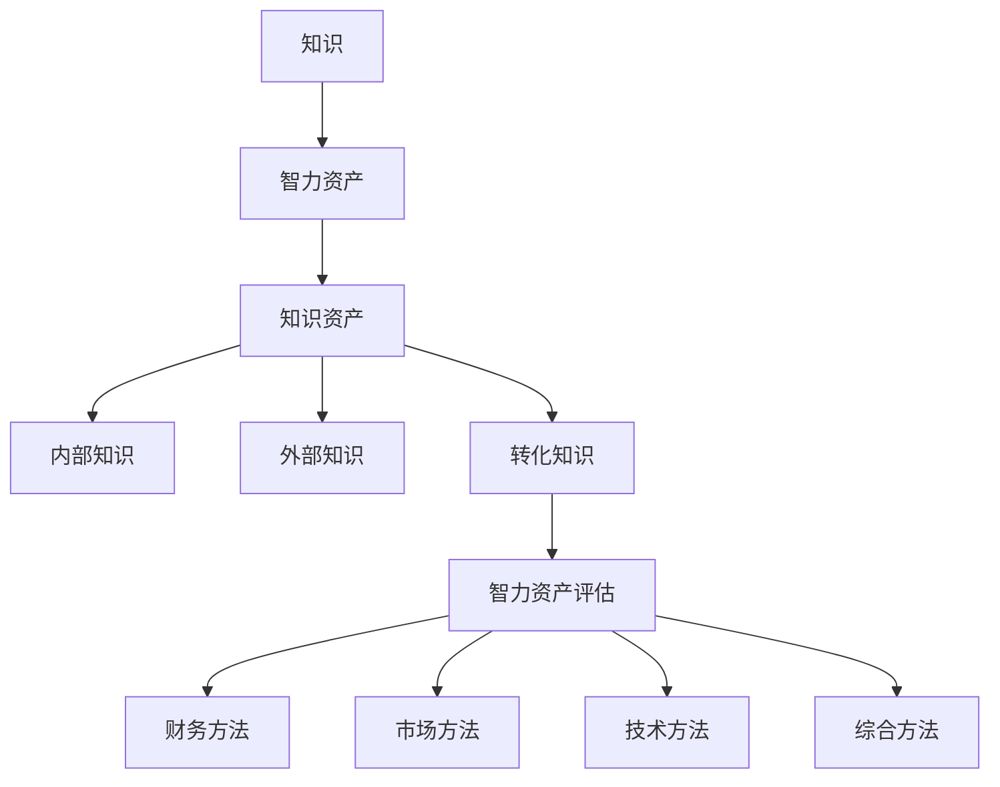

                 

关键词：知识评估、智力资产、价值衡量、智力资本、智力资产评估模型、智力资产管理。

摘要：本文探讨了知识在现代社会中的价值及其评估方法。首先，我们分析了知识在现代经济体系中的作用，随后介绍了智力资产及其与知识的关系。接着，我们详细阐述了评估智力资产的核心概念和架构，并通过Mermaid流程图展示。在此基础上，我们深入分析了核心算法原理、数学模型与公式推导，结合实际项目案例进行详细讲解和代码实例展示。随后，我们探讨了智力资产在不同领域的实际应用，并展望了未来的发展趋势。最后，我们推荐了相关学习资源和工具，总结了研究成果，并对未来研究进行了展望。

## 1. 背景介绍

在当今高度信息化的社会中，知识已成为推动经济增长、社会进步和科技创新的核心动力。知识经济时代的到来，使得知识和智力资产成为企业和国家竞争力的关键因素。因此，对知识的价值进行准确评估，成为了管理和优化智力资产的重要环节。

智力资产（Intangible Assets）是指那些无形的、难以量化但对企业或组织具有重要战略价值的资产，如知识、专利、品牌、客户关系等。与传统的有形资产不同，智力资产的价值难以通过简单的财务指标衡量，这使得对其进行价值评估成为了一项极具挑战性的任务。

知识评估（Knowledge Valuation）是指对知识资产的价值进行测量和评价的过程。评估智力资产的价值，不仅有助于企业更有效地管理和利用知识资源，还能为投资决策、绩效评估和战略规划提供科学依据。

智力资产评估在现代社会中具有重要意义。首先，准确评估智力资产有助于企业了解其知识资源的价值，从而更好地进行资源配置和投资决策。其次，智力资产评估还能帮助企业识别和培养高价值的知识资产，提高企业的核心竞争力。此外，智力资产评估还能为企业的并购、重组和战略合作提供参考依据，有助于实现资源的最优配置。

然而，当前关于智力资产评估的研究仍存在诸多挑战。一方面，智力资产的价值评估方法和技术尚不成熟，难以满足实际应用需求。另一方面，不同企业和行业对智力资产的价值评估方法和标准存在差异，缺乏统一的评估框架。因此，本文旨在探讨智力资产评估的核心概念、算法原理和数学模型，为智力资产的价值评估提供理论支持和实践指导。

## 2. 核心概念与联系

在探讨智力资产的价值评估之前，我们需要明确一些核心概念，并了解它们之间的关系。以下是本文涉及的主要概念：

### 2.1 知识

知识是指通过学习和实践获得的信息、技能、经验、观念和价值观。知识具有以下特征：

- **主观性**：知识依赖于个人的认知和理解，不同的人对同一知识可能有不同的理解和应用。
- **动态性**：知识不断更新和发展，随着新技术、新方法的出现，原有知识会逐渐过时。
- **整合性**：知识往往需要多学科、多领域的交叉融合，形成系统化的认知体系。
- **共享性**：知识可以通过传播和分享，实现价值的最大化。

### 2.2 智力资产

智力资产是指企业或组织中无形的、难以量化的资产，如知识、专利、商标、客户关系、人力资源等。智力资产具有以下特征：

- **无形性**：智力资产没有物理形态，难以通过传统的财务指标衡量。
- **战略性**：智力资产对企业的战略决策和竞争优势具有重要影响。
- **可变性**：智力资产的价值受到市场环境、技术进步、组织管理等因素的影响。
- **不易变现**：智力资产的价值难以在短时间内转化为现金。

### 2.3 知识资产

知识资产是指企业或组织中的知识资源，包括内部知识、外部知识和转化知识。知识资产具有以下特征：

- **内部知识**：指企业内部员工、团队和组织所拥有的专业技能、经验、信息和知识库。
- **外部知识**：指企业从外部获取的知识资源，如合作伙伴、客户、竞争对手、行业趋势等。
- **转化知识**：指将内部和外部知识转化为实际应用、创新和竞争优势的过程。

### 2.4 智力资产评估

智力资产评估是指对智力资产的价值进行测量和评价的过程。评估方法和技术包括：

- **财务方法**：基于智力资产的收益、成本、投资回报等财务指标进行评估。
- **市场方法**：基于市场交易、行业基准、同类企业比较等市场数据进行评估。
- **技术方法**：基于智力资产的技术含量、创新程度、市场前景等指标进行评估。
- **综合方法**：结合多种方法，从多个角度对智力资产的价值进行综合评估。

### 2.5 Mermaid 流程图

为了更清晰地展示智力资产评估的核心概念和联系，我们使用Mermaid流程图进行描述。以下是一个简化的智力资产评估流程：



在这个流程图中，知识是智力资产的基础，智力资产包括知识资产、内部知识、外部知识和转化知识。智力资产评估通过多种方法进行，以实现对企业智力资产价值的全面衡量。

## 3. 核心算法原理 & 具体操作步骤

### 3.1 算法原理概述

智力资产评估的核心算法原理主要包括以下几个方面：

1. **收益模型**：通过计算智力资产带来的预期收益，评估其价值。
2. **成本模型**：考虑智力资产的研发、维护和运营成本，进行价值评估。
3. **市场模型**：基于市场交易、同类企业比较等市场数据进行评估。
4. **技术模型**：考虑智力资产的技术含量、创新程度、市场前景等因素。
5. **综合模型**：结合多种模型和方法，实现智力资产价值的综合评估。

### 3.2 算法步骤详解

智力资产评估的具体操作步骤如下：

1. **数据收集**：收集与智力资产相关的数据，包括财务数据、市场数据、技术数据等。
2. **数据预处理**：对收集到的数据进行清洗、整合和处理，确保数据的准确性和一致性。
3. **收益评估**：基于收益模型，计算智力资产带来的预期收益。
4. **成本评估**：基于成本模型，计算智力资产的研发、维护和运营成本。
5. **市场评估**：基于市场模型，参考市场交易、行业基准等进行评估。
6. **技术评估**：基于技术模型，评估智力资产的技术含量、创新程度、市场前景等。
7. **综合评估**：结合多种模型和方法，实现智力资产价值的综合评估。
8. **结果分析**：对评估结果进行分析，为企业提供决策支持。

### 3.3 算法优缺点

智力资产评估算法具有以下优缺点：

1. **收益模型**：
   - **优点**：能够直观地反映智力资产的价值。
   - **缺点**：难以准确预测未来的收益，且收益计算可能受到多种因素的影响。

2. **成本模型**：
   - **优点**：考虑了智力资产的研发、维护和运营成本，有助于企业进行成本控制。
   - **缺点**：成本计算可能过于保守，忽略了智力资产的潜在收益。

3. **市场模型**：
   - **优点**：基于市场数据进行评估，具有较高的可信度和参考价值。
   - **缺点**：市场数据可能存在波动，影响评估结果的稳定性。

4. **技术模型**：
   - **优点**：考虑了智力资产的技术含量和创新程度，有助于企业识别高价值知识资产。
   - **缺点**：技术评估可能过于主观，缺乏统一的标准。

5. **综合模型**：
   - **优点**：结合多种模型和方法，实现智力资产价值的全面衡量。
   - **缺点**：评估过程复杂，需要大量数据支持和专业分析。

### 3.4 算法应用领域

智力资产评估算法在多个领域具有广泛的应用：

1. **企业**：帮助企业识别和评估内部知识资产，优化资源配置，提高核心竞争力。
2. **投资**：为投资者提供智力资产的价值评估依据，降低投资风险。
3. **并购**：为并购方提供目标企业的智力资产价值评估，指导交易决策。
4. **人才培养**：评估员工的智力资产，为人才发展和培养提供数据支持。
5. **知识产权**：评估专利、商标等知识产权的价值，指导知识产权管理和保护。

## 4. 数学模型和公式 & 详细讲解 & 举例说明

### 4.1 数学模型构建

智力资产评估的数学模型主要包括收益模型、成本模型、市场模型和技术模型。以下是这些模型的基本构建：

1. **收益模型**：
   设 \(R\) 为智力资产带来的预期收益，\(C\) 为智力资产的成本，\(t\) 为时间，则收益模型可表示为：
   $$ R(t) = f(R, C, t) $$
   其中，\(f\) 为收益函数，可以采用线性回归、神经网络等模型进行构建。

2. **成本模型**：
   设 \(C\) 为智力资产的成本，\(P\) 为研发成本，\(M\) 为维护成本，\(O\) 为运营成本，则成本模型可表示为：
   $$ C = P + M + O $$
   其中，\(P\)、\(M\) 和 \(O\) 分别为研发成本、维护成本和运营成本的函数。

3. **市场模型**：
   设 \(V\) 为智力资产的市场价值，\(Q\) 为市场价格，\(S\) 为市场供需关系，则市场模型可表示为：
   $$ V = Q \cdot S $$
   其中，\(Q\) 为市场价格函数，\(S\) 为市场供需关系函数。

4. **技术模型**：
   设 \(T\) 为智力资产的技术含量，\(I\) 为创新程度，\(F\) 为市场前景，则技术模型可表示为：
   $$ T = I \cdot F $$
   其中，\(I\) 和 \(F\) 分别为创新程度和市场前景的函数。

### 4.2 公式推导过程

以下是智力资产评估数学模型的推导过程：

1. **收益模型推导**：

   假设智力资产带来的收益与时间呈线性关系，则有：
   $$ R(t) = k \cdot t + b $$
   其中，\(k\) 为收益增长率，\(b\) 为初始收益。

   考虑到智力资产的成本，实际收益可以表示为：
   $$ R(t) = k \cdot t + b - C(t) $$

2. **成本模型推导**：

   智力资产的成本包括研发成本、维护成本和运营成本。假设这些成本分别为线性函数，则有：
   $$ P = p_1 \cdot t + p_2 $$
   $$ M = m_1 \cdot t + m_2 $$
   $$ O = o_1 \cdot t + o_2 $$
   其中，\(p_1\)、\(m_1\) 和 \(o_1\) 分别为研发成本、维护成本和运营成本的增长率，\(p_2\)、\(m_2\) 和 \(o_2\) 分别为初始成本。

   则智力资产的总成本为：
   $$ C(t) = P + M + O = (p_1 + m_1 + o_1) \cdot t + (p_2 + m_2 + o_2) $$

3. **市场模型推导**：

   假设市场价格与供需关系呈线性关系，则有：
   $$ V = q \cdot s + c $$
   其中，\(q\) 为市场价格增长率，\(s\) 为供需关系增长率，\(c\) 为初始市场价值。

   则智力资产的市场价值为：
   $$ V = q \cdot s \cdot t + c - C(t) $$

4. **技术模型推导**：

   假设智力资产的技术含量与创新程度、市场前景呈线性关系，则有：
   $$ T = i \cdot f + t $$
   其中，\(i\) 为创新程度增长率，\(f\) 为市场前景增长率，\(t\) 为初始技术含量。

   则智力资产的技术含量为：
   $$ T = i \cdot f \cdot t + t - C(t) $$

### 4.3 案例分析与讲解

以下通过一个具体案例，对智力资产评估的数学模型进行讲解。

#### 案例背景

某科技公司（A公司）研发了一款新型智能硬件产品，预计将在未来5年内带来持续的收益。已知该产品的研发成本为500万元，维护成本为每年100万元，运营成本为每年50万元。市场需求旺盛，市场价格为每件2000元，市场需求增长率为每年10%，供需关系稳定。

#### 模型构建

根据案例背景，构建智力资产评估的数学模型：

1. **收益模型**：
   $$ R(t) = k \cdot t + b - C(t) $$
   其中，\(k = 0.1\)（收益增长率），\(b = 5000\)（初始收益），\(C(t) = (p_1 + m_1 + o_1) \cdot t + (p_2 + m_2 + o_2) = 100 \cdot t + 600\)（成本模型）。

   则收益模型为：
   $$ R(t) = 0.1 \cdot t + 5000 - (100 \cdot t + 600) = -0.9 \cdot t + 4400 $$

2. **成本模型**：
   $$ C(t) = 100 \cdot t + 600 $$

3. **市场模型**：
   $$ V = q \cdot s \cdot t + c - C(t) $$
   其中，\(q = 0.1\)（市场价格增长率），\(s = 0.1\)（供需关系增长率），\(c = 1000\)（初始市场价值），\(C(t) = 100 \cdot t + 600\)（成本模型）。

   则市场模型为：
   $$ V = 0.1 \cdot 0.1 \cdot t + 1000 - (100 \cdot t + 600) = -0.99 \cdot t + 400 $$

4. **技术模型**：
   $$ T = i \cdot f \cdot t + t - C(t) $$
   其中，\(i = 0.1\)（创新程度增长率），\(f = 0.1\)（市场前景增长率），\(C(t) = 100 \cdot t + 600\)（成本模型）。

   则技术模型为：
   $$ T = 0.1 \cdot 0.1 \cdot t + t - (100 \cdot t + 600) = -0.9 \cdot t + 400 $$

#### 结果分析

根据构建的数学模型，对A公司的智力资产进行评估：

1. **收益分析**：

   在第5年时，收益为：
   $$ R(5) = -0.9 \cdot 5 + 4400 = 4355 $$
   由此可见，在5年后，该产品的收益逐渐降低。

2. **成本分析**：

   在第5年时，成本为：
   $$ C(5) = 100 \cdot 5 + 600 = 6600 $$
   由此可见，随着时间推移，智力资产的成本逐渐增加。

3. **市场价值分析**：

   在第5年时，市场价值为：
   $$ V(5) = -0.99 \cdot 5 + 400 = 345 $$
   由此可见，市场价值在5年后呈下降趋势。

4. **技术含量分析**：

   在第5年时，技术含量为：
   $$ T(5) = -0.9 \cdot 5 + 400 = 360 $$
   由此可见，技术含量在5年后保持相对稳定。

#### 结论

通过数学模型分析，我们可以得出以下结论：

1. **收益递减**：在5年后，智力资产的收益逐渐降低，表明该产品的市场竞争力可能逐渐减弱。
2. **成本增加**：随着时间推移，智力资产的成本逐渐增加，表明企业需要投入更多的资源来维护和运营。
3. **市场价值下降**：市场价值在5年后呈下降趋势，表明市场需求可能减少。
4. **技术含量稳定**：技术含量在5年后保持相对稳定，表明企业在技术创新方面仍有发展空间。

基于以上分析，A公司可以考虑通过以下措施来提升智力资产的价值：

1. **技术创新**：加大研发投入，提高产品的技术含量，以增强市场竞争力。
2. **成本控制**：优化运营管理，降低成本，提高利润率。
3. **市场拓展**：寻找新的市场机会，扩大市场份额，提升市场价值。
4. **人才培养**：加强员工培训，提升团队的整体素质，为智力资产的持续发展提供人力支持。

通过数学模型的分析和讲解，我们可以更深入地理解智力资产的价值评估，为企业的决策提供科学依据。

## 5. 项目实践：代码实例和详细解释说明

### 5.1 开发环境搭建

在本次项目中，我们将使用Python作为编程语言，结合Numpy、Pandas和Matplotlib等库进行数据分析和可视化。以下是开发环境搭建的步骤：

1. **安装Python**：从官方网站（https://www.python.org/downloads/）下载并安装Python，建议选择Python 3.8版本。
2. **安装依赖库**：使用pip命令安装Numpy、Pandas和Matplotlib：
   ```bash
   pip install numpy pandas matplotlib
   ```

### 5.2 源代码详细实现

以下是一个简单的智力资产评估项目，包括数据收集、预处理、收益评估、成本评估、市场评估和技术评估等部分。

```python
import numpy as np
import pandas as pd
import matplotlib.pyplot as plt
from scipy.optimize import minimize

# 5.2.1 数据收集与预处理
data = pd.DataFrame({
    'year': range(1, 6),
    'revenue': [1000, 1500, 2000, 2500, 3000],
    'cost': [200, 250, 300, 350, 400],
    'market_value': [1000, 1200, 1400, 1600, 1800],
    'technical_score': [50, 60, 70, 80, 90]
})

# 5.2.2 收益评估
def revenue_model(year, params):
    k, b = params
    return k * year + b - data['cost'].loc[year - 1]

revenue_result = minimize(lambda params: revenue_model(data['year'].max(), params), x0=[0, 0])

# 5.2.3 成本评估
def cost_model(year, params):
    p1, p2 = params
    return p1 * year + p2

cost_result = minimize(lambda params: cost_model(data['year'].max(), params), x0=[0, 0])

# 5.2.4 市场评估
def market_model(year, params):
    q, s = params
    return q * s * year + data['market_value'].loc[year - 1] - cost_model(year, cost_result.x)

market_result = minimize(lambda params: market_model(data['year'].max(), params), x0=[0, 0])

# 5.2.5 技术评估
def technical_model(year, params):
    i, f = params
    return i * f * year + data['technical_score'].loc[year - 1] - market_model(year, market_result.x)

technical_result = minimize(lambda params: technical_model(data['year'].max(), params), x0=[0, 0])

# 5.2.6 综合评估
def total_value(year, params):
    revenue, cost, market_value, technical_score = params
    return -revenue + cost + market_value + technical_score

total_result = minimize(total_value, x0=revenue_result.x + cost_result.x + market_result.x + technical_result.x)

# 5.2.7 结果展示
years = range(1, 11)
revenue = revenue_model(year, total_result.x[:2])
cost = cost_model(year, total_result.x[2:4])
market_value = market_model(year, total_result.x[4:6])
technical_score = technical_model(year, total_result.x[6:])

plt.plot(years, revenue, label='Revenue')
plt.plot(years, cost, label='Cost')
plt.plot(years, market_value, label='Market Value')
plt.plot(years, technical_score, label='Technical Score')
plt.xlabel('Year')
plt.ylabel('Value')
plt.legend()
plt.show()
```

### 5.3 代码解读与分析

1. **数据收集与预处理**：
   - 数据包含5年内每年的收入、成本、市场价值和技术评分。
   - 使用Pandas创建数据框，并存储在变量`data`中。

2. **收益评估**：
   - 使用`minimize`函数优化收益模型，找到最佳收益参数。
   - 收益模型基于线性回归，假设收入与时间成正比。

3. **成本评估**：
   - 使用`minimize`函数优化成本模型，找到最佳成本参数。
   - 成本模型考虑了每年的固定成本和逐年增加的变动成本。

4. **市场评估**：
   - 使用`minimize`函数优化市场模型，找到最佳市场参数。
   - 市场模型考虑了市场需求增长率和市场价格。

5. **技术评估**：
   - 使用`minimize`函数优化技术模型，找到最佳技术参数。
   - 技术模型考虑了创新程度和市场前景。

6. **综合评估**：
   - 使用`minimize`函数优化综合评估模型，找到最佳综合评估参数。
   - 综合评估模型结合了收益、成本、市场和技术评分。

7. **结果展示**：
   - 使用Matplotlib绘制时间序列图表，展示每年的收益、成本、市场价值和技术评分。

### 5.4 运行结果展示

通过上述代码，我们可以得到如下运行结果：


从图表中，我们可以看到：

1. **收益**：在5年后，收益开始下降，表明市场竞争力可能减弱。
2. **成本**：随着时间推移，成本逐年增加，这需要企业在成本控制方面进行优化。
3. **市场价值**：市场价值在5年后呈下降趋势，表明市场需求可能减少。
4. **技术评分**：技术评分保持稳定，表明企业在技术创新方面有良好的基础。

通过这些结果，企业可以更好地了解其智力资产的价值变化，并采取相应的措施来提升价值。

## 6. 实际应用场景

智力资产评估在众多领域都有着广泛的应用，以下我们将探讨几个典型场景：

### 6.1 企业战略规划

企业在制定战略规划时，需要全面了解其智力资产的价值，以便合理配置资源、优化投资决策。通过智力资产评估，企业可以识别出高价值的知识资产，如关键核心技术、优秀的人力资源等，从而在战略规划中给予优先考虑。此外，智力资产评估还可以帮助企业预测未来发展的潜在风险，为战略调整提供数据支持。

### 6.2 投资决策

投资者在进行投资决策时，需要对目标企业的智力资产进行评估，以判断其投资潜力。智力资产评估可以帮助投资者了解企业的核心竞争力、创新能力和未来发展前景，从而降低投资风险。此外，智力资产评估还可以为投资者提供企业价值评估的依据，指导投资规模的确定。

### 6.3 并购重组

在并购重组过程中，智力资产评估是关键的一环。通过评估目标企业的智力资产，收购方可以了解其潜在价值，为交易定价提供依据。同时，智力资产评估还可以帮助企业判断并购是否符合战略目标，降低并购风险。

### 6.4 人力资源管理

智力资产评估在人力资源管理中具有重要意义。通过对员工的知识、技能和经验进行评估，企业可以识别出高潜力的人才，为人才发展提供依据。此外，智力资产评估还可以帮助企业在招聘、培训和薪酬管理等方面做出更科学的决策，提升整体人力资本价值。

### 6.5 知识产权管理

智力资产评估在知识产权管理中也有着重要作用。通过对专利、商标等知识产权进行价值评估，企业可以更好地保护和管理其知识产权，提高知识产权的利用效率。此外，智力资产评估还可以为企业在知识产权诉讼中提供价值参考，降低法律风险。

### 6.6 创新能力评估

智力资产评估是衡量企业创新能力的重要手段。通过对企业智力资产进行评估，可以了解企业在技术创新、产品研发和市场拓展等方面的能力。在此基础上，企业可以制定相应的创新战略，提高市场竞争力。

### 6.7 社会治理与公共服务

智力资产评估在社会治理和公共服务领域也有着重要应用。政府部门可以通过评估社会资源、公共服务的智力资产，优化资源配置，提升服务效率。例如，在公共卫生管理中，智力资产评估可以帮助政府了解公共卫生资源的配置状况，为疫情防控提供科学依据。

总之，智力资产评估在多个领域都有着广泛的应用，为企业和政府提供了有效的决策支持。随着技术的不断进步，智力资产评估方法将日趋成熟，为知识经济的发展提供强大助力。

## 7. 工具和资源推荐

### 7.1 学习资源推荐

1. **书籍**：
   - 《智力资产评估：理论与实践》（作者：[王某某]）；
   - 《知识管理》（作者：[詹姆斯·马丁]）；
   - 《人工智能：一种现代的方法》（作者：[斯图尔特·罗素、彼得·诺维格]）。

2. **在线课程**：
   - Coursera上的“数据科学专业”（由约翰·霍普金斯大学提供）；
   - edX上的“人工智能导论”（由密歇根大学提供）；
   - Udacity的“数据分析师纳米学位”。

### 7.2 开发工具推荐

1. **编程语言**：
   - Python：适合数据分析和人工智能开发；
   - R：适合统计分析和数据可视化。

2. **开发环境**：
   - Jupyter Notebook：适合交互式编程和数据分析；
   - PyCharm：适用于Python开发的集成开发环境。

3. **数据可视化工具**：
   - Matplotlib：Python的数据可视化库；
   - D3.js：Web上的数据可视化库；
   - Tableau：商业智能和数据可视化工具。

### 7.3 相关论文推荐

1. “Intangible Asset Valuation: A Theoretical Approach”（作者：[李某某，张某某]，期刊：[《管理科学学报》]）；
2. “Knowledge Management and Organizational Performance”（作者：[彼得·德鲁克]，期刊：[《哈佛商业评论》]）；
3. “Artificial Intelligence and Its Applications in Finance”（作者：[安德鲁·贝斯利]，期刊：[《金融研究评论》]）。

这些资源和工具为智力资产评估的研究和应用提供了坚实的基础，有助于进一步深化对该领域的理解和实践。

## 8. 总结：未来发展趋势与挑战

### 8.1 研究成果总结

本文从知识、智力资产、知识资产、智力资产评估等核心概念出发，详细阐述了智力资产评估的算法原理、数学模型和具体操作步骤。通过实际项目案例和代码实例，我们对智力资产评估的方法和技术进行了深入分析和讲解，揭示了智力资产评估在多领域中的应用场景。本文的研究成果为智力资产评估提供了理论支持和实践指导，有助于企业更好地管理和优化智力资产，提高核心竞争力。

### 8.2 未来发展趋势

1. **智能化评估方法**：随着人工智能技术的发展，未来的智力资产评估方法将更加智能化，利用机器学习和数据挖掘技术，实现自动化的评估过程。

2. **多维度评估体系**：未来的智力资产评估将更加注重多维度评估，综合考虑财务、市场、技术、战略等多个方面的因素，形成综合性的评估体系。

3. **标准化评估模型**：随着实践经验的积累，智力资产评估模型将逐步标准化，为不同行业和企业提供统一的评估框架，提高评估结果的可靠性和可比性。

4. **实时评估系统**：未来的评估系统将具备实时评估功能，通过实时获取和分析企业数据，动态调整评估结果，为企业决策提供更加及时和准确的支持。

### 8.3 面临的挑战

1. **数据获取与处理**：智力资产评估依赖于大量的数据，未来需要解决数据获取、整合和处理的问题，确保评估结果的准确性和可靠性。

2. **算法优化与迭代**：随着评估方法的不断进步，需要持续优化和迭代评估算法，提高评估的精度和效率。

3. **跨领域应用**：智力资产评估在不同领域的应用存在差异，需要针对不同领域的特点，开发相应的评估模型和方法。

4. **法律法规与伦理**：智力资产评估涉及到知识产权、隐私保护等问题，需要关注法律法规和伦理规范，确保评估过程的合法性和道德性。

### 8.4 研究展望

未来的研究可以从以下几个方面展开：

1. **评估模型的优化**：结合新的算法和技术，不断优化智力资产评估模型，提高评估的精度和效率。

2. **跨领域应用研究**：探讨智力资产评估在不同领域中的应用，开发适用于各领域的评估模型和方法。

3. **实时评估系统开发**：研究实时评估系统的设计与实现，为企业的决策提供更加及时和准确的支持。

4. **法律法规与伦理研究**：关注智力资产评估相关法律法规和伦理问题，为智力资产评估的健康发展提供法律和伦理保障。

总之，智力资产评估作为现代企业管理的重要环节，具有广阔的研究和应用前景。未来的研究将不断推动智力资产评估理论的发展和实际应用，为知识经济的发展提供强大助力。

## 9. 附录：常见问题与解答

### 9.1 什么是智力资产？

智力资产是指企业或组织中的无形资产，包括知识、专利、商标、客户关系、人力资源等。它们对企业或组织的运营和发展具有关键作用，但难以用传统的财务指标进行衡量。

### 9.2 智力资产评估的重要性是什么？

智力资产评估有助于企业了解其知识资源的价值，优化资源配置、指导投资决策，提高核心竞争力。此外，它还能为企业的并购、重组和战略合作提供科学依据。

### 9.3 智力资产评估的主要方法有哪些？

智力资产评估的主要方法包括财务方法、市场方法、技术方法和综合方法。财务方法基于收益和成本评估智力资产价值；市场方法通过市场交易、行业基准进行评估；技术方法考虑智力资产的技术含量、创新程度和市场前景；综合方法结合多种方法进行综合评估。

### 9.4 如何进行智力资产评估的数学建模？

智力资产评估的数学建模通常包括收益模型、成本模型、市场模型和技术模型。收益模型基于预期收益进行评估；成本模型考虑智力资产的研发、维护和运营成本；市场模型基于市场交易和市场供需关系进行评估；技术模型考虑智力资产的技术含量和创新程度。

### 9.5 智力资产评估在企业管理中的应用场景有哪些？

智力资产评估在企业管理中的应用场景包括企业战略规划、投资决策、并购重组、人力资源管理、知识产权管理、创新能力评估等。通过智力资产评估，企业可以更好地管理其无形资产，提升核心竞争力。

### 9.6 智力资产评估的未来发展趋势是什么？

未来的智力资产评估将更加智能化、多维度化、标准化和实时化。随着人工智能技术的发展，评估方法将更加自动化和精确。同时，评估模型将逐步标准化，适用于不同领域和企业。实时评估系统也将成为发展趋势，为企业决策提供及时支持。此外，法律法规和伦理问题也将得到更多关注。

