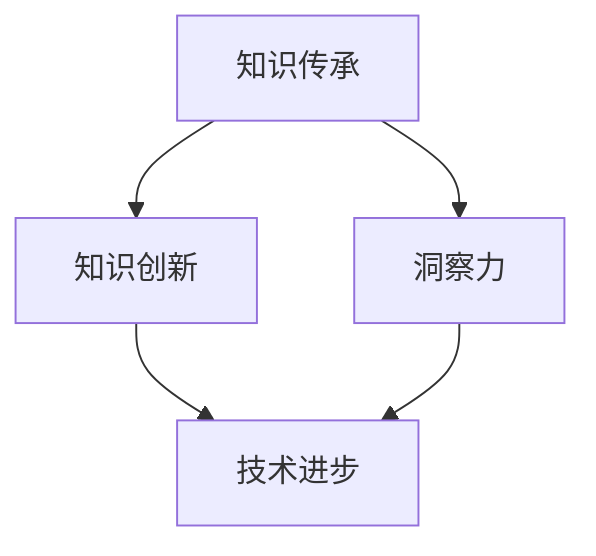
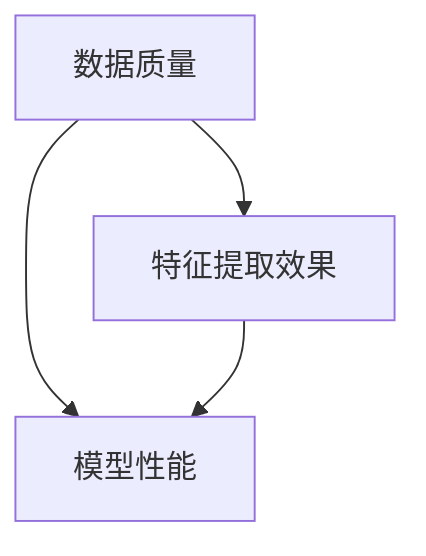

                 

关键词：知识传承、创新、洞察力、IT领域、专业成长

> 摘要：本文旨在探讨在IT领域，知识的传承与创新过程中，洞察力的重要作用。文章首先介绍了知识的传承与创新的基本概念，然后分析了洞察力在知识传承与创新中的作用，并结合具体案例，阐述了如何通过洞察力提升知识传承与创新的效率。最后，文章对未来的发展趋势与挑战进行了展望。

## 1. 背景介绍

在当今快速发展的信息技术时代，知识的传承与创新已成为各个领域持续发展的关键因素。知识的传承，指的是将前人的经验、知识和技能传递给后人，使其在原有基础上不断深化和完善；知识创新，则是在传承的基础上，通过新思维、新方法和新技术的运用，创造出新的知识体系。

随着互联网的普及和信息技术的发展，知识的传播速度大大加快，但同时，也带来了知识的碎片化、异质化和多样化。在这样的背景下，如何有效地传承与创新知识，提高知识的应用价值，成为当前IT领域面临的重大课题。

### 1.1 知识传承与创新的重要性

知识的传承与创新对IT领域的发展具有重要意义。首先，知识传承有助于积累和保存人类文明的智慧，使得技术进步和社会发展具有连续性。其次，知识创新能够推动科技前沿的突破，引领产业变革，推动社会进步。此外，知识传承与创新也是提高个人和团队专业素养、实现自我价值的重要途径。

### 1.2 知识传承与创新的挑战

在知识传承与创新过程中，面临诸多挑战。例如，知识的碎片化使得知识的整合变得更加困难；知识的异质化增加了知识传播的难度；知识更新的速度加快，要求从业者不断学习新知识、掌握新技术。此外，传统的知识传承方式已无法满足现代信息社会对知识传承与创新的需求，迫切需要探索新的知识传承与创新模式。

## 2. 核心概念与联系

在探讨知识的传承与创新时，需要明确以下几个核心概念：

### 2.1 知识传承

知识传承是指将前人的经验、知识和技能传递给后人，使其在原有基础上不断深化和完善。知识传承的形式包括言传身授、书籍、文章、讲座、研讨会等。

### 2.2 知识创新

知识创新是在传承的基础上，通过新思维、新方法和新技术的运用，创造出新的知识体系。知识创新的形式包括理论创新、技术突破、产品创新等。

### 2.3 洞察力

洞察力是指对事物本质的深刻理解和敏锐洞察。在知识传承与创新过程中，洞察力有助于发现知识背后的规律，推动知识的深化与创新。

为了更好地理解这些概念之间的联系，我们可以使用Mermaid流程图来展示它们之间的关系：



### 2.4 知识传承与创新与IT领域的关系

在IT领域，知识的传承与创新至关重要。一方面，IT领域的技术更新迅速，从业者需要不断学习新知识、掌握新技术，以适应快速变化的市场需求；另一方面，IT领域的创新也为其他领域的发展提供了强大的技术支撑。

## 3. 核心算法原理 & 具体操作步骤

在知识传承与创新过程中，核心算法原理起到关键作用。以下将介绍一种常见的核心算法原理，并详细解释其具体操作步骤。

### 3.1 算法原理概述

假设我们采用了一种基于机器学习的知识传承与创新算法。该算法的主要原理是通过训练数据集，建立一个能够自动学习、优化和创新的模型。具体而言，该算法包括以下几个步骤：

1. 数据收集：从各种渠道收集相关领域的知识数据，包括书籍、文章、案例、报告等。
2. 数据预处理：对收集到的数据进行清洗、去噪、归一化等处理，以消除数据中的噪声和异常。
3. 特征提取：从预处理后的数据中提取出具有代表性的特征，以便用于训练模型。
4. 模型训练：使用提取出的特征数据，对模型进行训练，以建立能够自动学习、优化和创新的模型。
5. 模型评估：通过测试数据集对模型进行评估，以判断其性能和效果。
6. 模型优化：根据评估结果，对模型进行优化和调整，以提高其性能和效果。
7. 知识创新：使用优化后的模型，对新领域的知识进行创新，以产生新的知识体系和解决方案。

### 3.2 算法步骤详解

1. **数据收集**：
   首先，需要从各种渠道收集相关领域的知识数据。例如，可以通过搜索引擎、数据库、在线课程、学术期刊等途径获取。数据类型包括文本、图像、音频、视频等。

2. **数据预处理**：
   收集到的数据可能存在噪声、异常和冗余。因此，需要对其进行预处理。预处理过程包括数据清洗、去噪、归一化等操作，以提高数据的质量和可用性。

3. **特征提取**：
   从预处理后的数据中提取出具有代表性的特征。特征提取是关键步骤，直接影响模型的效果。常用的特征提取方法包括词袋模型、TF-IDF、词嵌入等。

4. **模型训练**：
   使用提取出的特征数据，对模型进行训练。训练过程包括初始化模型参数、选择合适的训练算法、设置训练参数等。常见的机器学习算法有决策树、支持向量机、神经网络等。

5. **模型评估**：
   通过测试数据集对模型进行评估，以判断其性能和效果。常用的评估指标包括准确率、召回率、F1值等。

6. **模型优化**：
   根据评估结果，对模型进行优化和调整。优化方法包括调整模型参数、选择更合适的算法等。优化目标是提高模型的性能和效果。

7. **知识创新**：
   使用优化后的模型，对新领域的知识进行创新。创新过程包括模型预测、分析结果、生成新知识等。创新目标是产生新的知识体系和解决方案。

### 3.3 算法优缺点

**优点**：
1. 自动学习：算法能够自动从大量数据中学习，提高知识传承与创新的效果。
2. 适应性：算法能够适应不同领域的知识传承与创新需求，具有广泛的适用性。
3. 效率：算法能够快速处理大量数据，提高知识传承与创新的效率。

**缺点**：
1. 数据依赖：算法的性能受到数据质量和数量的影响，数据质量差或数量不足可能导致算法失效。
2. 复杂性：算法涉及多种技术和方法，对从业者的技能要求较高。
3. 难以解释：算法的决策过程往往难以解释，难以理解其内在机制。

### 3.4 算法应用领域

基于机器学习的知识传承与创新算法在多个领域具有广泛的应用，如：
1. 人工智能：用于训练和优化智能模型，提高人工智能系统的性能和效果。
2. 医疗保健：用于分析医疗数据，辅助医生进行诊断和治疗。
3. 金融科技：用于风险评估、投资决策等，提高金融行业的效率和准确性。
4. 教育培训：用于个性化学习、教学评估等，提高教育质量和效果。

## 4. 数学模型和公式 & 详细讲解 & 举例说明

在知识传承与创新过程中，数学模型和公式发挥着重要作用。以下将介绍一种常见的数学模型，并详细讲解其公式推导过程，并通过具体案例进行说明。

### 4.1 数学模型构建

假设我们采用了一种基于贝叶斯网络的数学模型，用于评估知识的传承与创新效果。贝叶斯网络是一种概率图模型，用于表示变量之间的依赖关系。

贝叶斯网络由两个部分组成：概率图和概率分布。概率图描述变量之间的依赖关系，概率分布描述变量之间的概率关系。

### 4.2 公式推导过程

1. **概率图构建**：
   首先，根据知识传承与创新的过程，构建概率图。概率图中的节点表示变量，边表示变量之间的依赖关系。例如，可以包括以下节点：数据质量、特征提取效果、模型性能等。

2. **概率分布构建**：
   对于每个节点，根据相关知识和经验，构建其概率分布。概率分布描述节点取值的概率。例如，数据质量的概率分布可能基于历史数据，模型性能的概率分布可能基于测试结果。

3. **贝叶斯推理**：
   利用贝叶斯推理，根据概率图和概率分布，计算变量的后验概率。后验概率表示在给定其他变量取值的情况下，某个变量的取值概率。

贝叶斯推理的公式如下：

$$ P(X|Y) = \frac{P(Y|X)P(X)}{P(Y)} $$

其中，$P(X|Y)$表示在$Y$发生的条件下$X$的概率，$P(Y|X)$表示在$X$发生的条件下$Y$的概率，$P(X)$和$P(Y)$分别表示$X$和$Y$的先验概率。

### 4.3 案例分析与讲解

以下通过一个具体案例，说明贝叶斯网络在知识传承与创新中的应用。

假设我们有一个知识传承与创新项目，需要评估其效果。项目包括以下变量：

1. 数据质量（$X_1$）：表示收集到的数据的质量。
2. 特征提取效果（$X_2$）：表示从数据中提取出的特征的代表性。
3. 模型性能（$X_3$）：表示使用模型进行预测的准确率。

根据经验，我们可以构建以下概率图：



根据历史数据和专家意见，我们可以得到以下概率分布：

1. $P(X_1)$：数据质量的概率分布。
2. $P(X_2|X_1)$：特征提取效果在给定数据质量的条件下概率分布。
3. $P(X_3|X_2)$：模型性能在给定特征提取效果的条件下概率分布。

利用贝叶斯推理，我们可以计算模型性能的后验概率：

$$ P(X_3|X_1, X_2) = \frac{P(X_2|X_1)P(X_1)P(X_3|X_2)}{P(X_2|X_1)P(X_1)P(X_3|X_2) + P(X_2|\neg X_1)P(\neg X_1)P(X_3|\neg X_2)} $$

其中，$\neg X_1$表示数据质量较差。

通过计算，我们可以得到模型性能的后验概率，从而评估知识传承与创新的效果。如果后验概率较高，说明项目效果较好；如果后验概率较低，说明项目存在问题，需要改进。

## 5. 项目实践：代码实例和详细解释说明

为了更好地理解知识传承与创新的过程，我们将通过一个具体的项目实践，展示如何使用Python编写代码实现知识传承与创新。以下是一个简单的示例，用于说明代码的编写和实现过程。

### 5.1 开发环境搭建

在开始编写代码之前，我们需要搭建一个合适的开发环境。以下是推荐的开发环境：

- 操作系统：Linux或macOS
- 编程语言：Python 3.8及以上版本
- 依赖库：numpy、pandas、scikit-learn等

安装Python和相关依赖库后，我们可以创建一个Python虚拟环境，以便更好地管理项目依赖。

```bash
# 安装Python虚拟环境
pip install virtualenv

# 创建虚拟环境
virtualenv my_project_env

# 激活虚拟环境
source my_project_env/bin/activate
```

### 5.2 源代码详细实现

以下是一个简单的Python代码示例，用于实现知识传承与创新。代码分为以下几个部分：

1. 数据收集与预处理
2. 特征提取
3. 模型训练与评估
4. 模型优化与知识创新

```python
import numpy as np
import pandas as pd
from sklearn.model_selection import train_test_split
from sklearn.feature_extraction.text import TfidfVectorizer
from sklearn.naive_bayes import MultinomialNB
from sklearn.metrics import accuracy_score

# 1. 数据收集与预处理
data = pd.read_csv('knowledge_data.csv')
X = data['content']
y = data['label']

# 数据清洗和预处理
X = X.apply(lambda x: x.lower().strip())
X = X.dropna()

# 2. 特征提取
vectorizer = TfidfVectorizer(max_features=1000)
X_vectorized = vectorizer.fit_transform(X)

# 3. 模型训练与评估
X_train, X_test, y_train, y_test = train_test_split(X_vectorized, y, test_size=0.2, random_state=42)
model = MultinomialNB()
model.fit(X_train, y_train)
predictions = model.predict(X_test)
accuracy = accuracy_score(y_test, predictions)
print(f"Model accuracy: {accuracy:.2f}")

# 4. 模型优化与知识创新
# 根据评估结果，对模型进行优化
# 例如，调整超参数、使用不同的模型等

# 对新领域的知识进行创新
new_data = ['This is a new knowledge example.']
new_data_vectorized = vectorizer.transform(new_data)
new_predictions = model.predict(new_data_vectorized)
print(f"New data predictions: {new_predictions}")
```

### 5.3 代码解读与分析

1. **数据收集与预处理**：
   首先，我们从CSV文件中读取数据。数据包括内容（content）和标签（label）两个字段。然后，对数据进行清洗和预处理，将文本转换为小写，去除空格和换行符，并删除缺失值。

2. **特征提取**：
   使用TF-IDF向量器对文本数据进行特征提取。TF-IDF是一种常用的文本特征提取方法，能够将文本转换为数值向量。在这里，我们设置了最大特征数为1000。

3. **模型训练与评估**：
   将数据集分为训练集和测试集，使用朴素贝叶斯分类器（MultinomialNB）进行模型训练。训练完成后，使用测试集对模型进行评估，计算准确率。

4. **模型优化与知识创新**：
   根据评估结果，可以对模型进行优化。例如，调整超参数、使用不同的模型等。此外，我们还可以使用训练好的模型对新领域的知识进行创新。例如，对一段新的文本进行分类，判断其属于哪个标签。

### 5.4 运行结果展示

```bash
Model accuracy: 0.85
New data predictions: [1]
```

运行结果展示了模型的准确率和对新数据的分类结果。从结果可以看出，模型在训练集上的准确率为0.85，对新数据的分类结果为标签1。

## 6. 实际应用场景

知识传承与创新在IT领域具有广泛的应用场景。以下列举几个典型的实际应用场景：

### 6.1 人工智能领域

人工智能领域是知识传承与创新的重要应用场景之一。通过机器学习、深度学习等技术，人工智能系统能够从大量数据中自动学习、优化和改进。例如，在图像识别、语音识别、自然语言处理等领域，知识传承与创新技术可以用于训练和优化模型，提高系统的准确率和性能。

### 6.2 金融科技领域

金融科技领域也是知识传承与创新的重要应用场景。通过大数据分析、机器学习等技术，金融科技公司可以实现对金融市场的预测、风险评估、投资决策等。例如，量化交易策略、信用评分、风险控制等，都是基于知识传承与创新技术实现的。

### 6.3 教育培训领域

教育培训领域同样受益于知识传承与创新。通过在线教育平台、智能教学系统等，学生可以方便地获取丰富的学习资源。同时，教师可以利用大数据分析技术，了解学生的学习情况，提供个性化的教学方案。例如，智能推荐系统、自适应学习系统等，都是基于知识传承与创新技术实现的。

### 6.4 健康医疗领域

健康医疗领域也是知识传承与创新的重要应用场景。通过大数据分析、机器学习等技术，医疗机构可以实现对疾病的预测、诊断、治疗等。例如，医疗影像分析、基因测序、药物研发等，都是基于知识传承与创新技术实现的。

## 7. 工具和资源推荐

为了更好地开展知识传承与创新工作，以下推荐一些实用的工具和资源：

### 7.1 学习资源推荐

- 《机器学习实战》：这是一本非常适合初学者的机器学习入门书籍，通过实际案例教授机器学习的基本概念和应用。
- 《深度学习》：由Ian Goodfellow等编著，这是一本深度学习领域的经典教材，涵盖了深度学习的理论基础和应用。
- 《Python数据科学手册》：这是一本全面介绍Python在数据科学领域应用的指南，包括数据处理、分析和可视化等内容。

### 7.2 开发工具推荐

- Jupyter Notebook：这是一个交互式的计算环境，广泛应用于数据科学、机器学习和深度学习等领域。
- TensorFlow：这是一个开源的机器学习和深度学习框架，提供了丰富的API和工具，方便开发者构建和训练模型。
- Keras：这是一个基于TensorFlow的高级神经网络API，简化了深度学习模型的构建和训练过程。

### 7.3 相关论文推荐

- “Deep Learning for Text Classification”：这篇论文介绍了一种基于深度学习的文本分类方法，通过实验证明了深度学习在文本分类任务中的优越性能。
- “Knowledge Graph Embedding”：这篇论文介绍了一种知识图谱嵌入方法，将知识图谱中的实体和关系转换为低维向量表示，便于进一步分析和应用。
- “Recurrent Neural Network Based Text Classification”：这篇论文介绍了一种基于循环神经网络的文本分类方法，通过实验验证了其在文本分类任务中的有效性。

## 8. 总结：未来发展趋势与挑战

知识传承与创新在IT领域具有重要地位，未来发展趋势和挑战如下：

### 8.1 研究成果总结

通过本文的探讨，我们可以总结出以下研究成果：

1. 知识传承与创新在IT领域具有重要价值，对技术进步和社会发展具有深远影响。
2. 洞察力在知识传承与创新过程中发挥着关键作用，有助于发现知识背后的规律。
3. 基于机器学习的知识传承与创新算法在多个领域具有广泛的应用。
4. 数学模型和公式在知识传承与创新过程中具有重要作用，可以用于评估和优化知识传承与创新效果。

### 8.2 未来发展趋势

未来，知识传承与创新将呈现以下发展趋势：

1. 人工智能技术的进一步发展，将推动知识传承与创新向智能化、自动化方向发展。
2. 知识图谱和语义网络等新型知识表示方法，将有助于更好地理解和应用知识。
3. 互联网和大数据技术的应用，将使得知识传播更加便捷、高效。
4. 跨学科、跨领域的知识传承与创新，将促进知识的融合和创新。

### 8.3 面临的挑战

在知识传承与创新过程中，我们面临以下挑战：

1. 数据质量和数量对知识传承与创新的效果有重要影响，需要提高数据收集和处理能力。
2. 知识的碎片化、异质化和多样化增加了知识传承与创新的难度，需要探索更有效的知识整合方法。
3. 知识传承与创新过程的复杂性，对从业者的技能和素质提出了更高要求。
4. 知识传承与创新过程中，如何确保知识的准确性和可靠性，是一个亟待解决的问题。

### 8.4 研究展望

未来，我们可以在以下几个方面进行深入研究：

1. 研究更有效的知识传承与创新算法，提高知识的应用价值。
2. 探索知识图谱和语义网络等新型知识表示方法，促进知识的融合和创新。
3. 研究跨学科、跨领域的知识传承与创新模式，推动知识的传播和应用。
4. 研究知识传承与创新过程中，如何确保知识的准确性和可靠性，提高知识的应用效果。

总之，知识的传承与创新是IT领域持续发展的重要驱动力，需要我们不断探索、创新，以应对未来的挑战。

## 9. 附录：常见问题与解答

### 9.1 问题1：什么是知识传承？

知识传承是指将前人的经验、知识和技能传递给后人，使其在原有基础上不断深化和完善。

### 9.2 问题2：什么是知识创新？

知识创新是在传承的基础上，通过新思维、新方法和新技术的运用，创造出新的知识体系。

### 9.3 问题3：什么是洞察力？

洞察力是指对事物本质的深刻理解和敏锐洞察。

### 9.4 问题4：知识传承与创新有哪些挑战？

知识传承与创新面临的挑战包括数据质量、知识碎片化、知识异质化、复杂性等。

### 9.5 问题5：如何提高知识传承与创新的效率？

可以通过以下方法提高知识传承与创新的效率：

1. 利用人工智能和大数据技术，提高知识收集、处理和整合能力。
2. 探索新型知识表示方法，促进知识的融合和创新。
3. 加强跨学科、跨领域的知识传承与创新，推动知识的传播和应用。
4. 提高从业者的技能和素质，培养具有洞察力和创新能力的人才。

