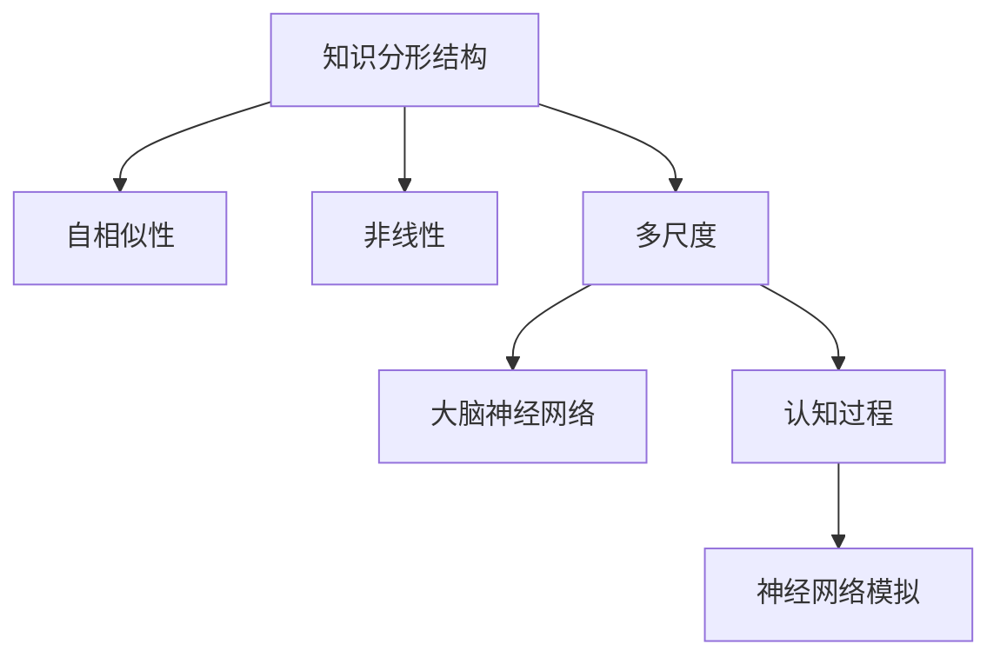
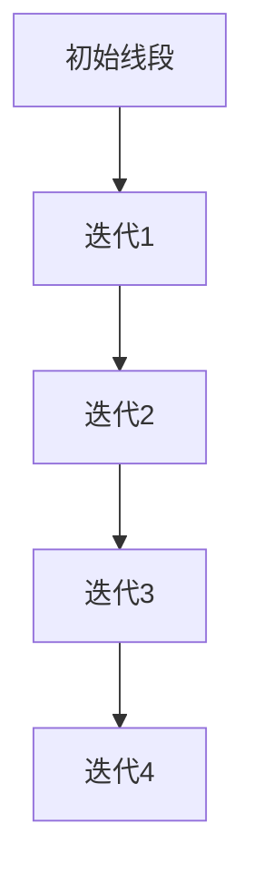

                 

关键词：分形结构，自相似性，认知，知识表示，人工智能

<|assistant|>摘要：本文将探讨知识分形结构的概念，及其在认知过程中的重要作用。通过分析自相似性在计算机科学中的应用，本文试图揭示知识分形结构如何促进人类的认知发展。此外，文章还将探讨分形结构在人工智能领域的潜在应用，为未来的研究和实践提供新的视角。

## 1. 背景介绍

知识是人类认知的基石，其存储、传递和应用方式直接影响着人类社会的发展。随着信息技术的飞速进步，知识的获取和传播变得更加便捷。然而，如何在繁杂的信息中构建有效的知识体系，提升认知能力，成为了当前研究的重要课题。

分形理论作为一种描述复杂系统的数学工具，近年来在认知科学和人工智能领域引起了广泛关注。分形结构具有自相似性，这意味着一个较小的部分可以以某种比例映射到更大的整体，这种特性使得分形结构在处理复杂系统时具有独特的优势。因此，研究知识分形结构在认知中的应用，有助于深入理解人类认知的内在机制，并为人工智能的发展提供新的理论支持。

本文旨在探讨知识分形结构的概念及其在认知中的应用，分析自相似性在计算机科学中的具体实现，探讨分形结构在人工智能领域的潜在应用。通过本文的研究，期望为分形理论在认知科学和人工智能领域的进一步发展提供参考。

## 2. 核心概念与联系

### 2.1. 分形结构的基本概念

分形（Fractal）是数学家曼德尔布罗特（Benoit Mandelbrot）在20世纪70年代提出的概念，它是指那些具有无穷层次结构的复杂几何形态。分形结构具有几个显著特点：

- **自相似性**：分形结构在各个尺度上都具有相似性，即局部与整体之间存在相似性关系。这种特性使得分形在描述复杂系统时具有独特的优势。

- **无限嵌套**：分形结构是无限嵌套的，每个部分都可以进一步分解为更小的部分，而这些小部分又具有与整体相似的特性。

- **非线性**：分形结构通常是非线性的，这意味着它们不能用简单的几何形状或线性模型来描述。

- **多尺度**：分形结构在不同的尺度上表现出不同的特征，这使得它们能够适应各种复杂系统的描述。

### 2.2. 自相似性的概念与应用

自相似性（Self-Similarity）是分形结构的核心特性，指的是一个系统在不同尺度上表现出相似的结构。自相似性在自然界和人工系统中广泛存在，例如：

- **自然界中的自相似性**：从海洋的波浪到植物的生长，再到星系的形成，自相似性无处不在。例如，科赫曲线（Koch Curve）是一种简单的分形结构，通过递归地增加三角形的边长，可以得到无限细分的曲线，这种结构在自然界中的海星和贝壳上都有体现。

- **人工系统中的自相似性**：在计算机科学中，自相似性可以用于描述程序的结构，如递归程序。递归程序在执行过程中，子程序与原程序的结构相似，这种自相似性使得递归程序能够高效地处理复杂问题。

### 2.3. 分形结构在认知中的应用

分形结构在认知科学中的应用主要体现在对大脑结构和思维过程的模拟。人类大脑具有复杂的网络结构，许多认知过程都表现出自相似性。例如：

- **大脑神经网络**：大脑神经网络中的神经元连接具有分形结构，这种结构有助于提高神经网络的计算效率和适应能力。

- **认知过程**：从感知到记忆，再到思维和决策，人类认知过程都表现出自相似性。例如，人们在学习新知识时，往往会将新知识与已有知识体系中的相关部分进行类比和整合。

### 2.4. Mermaid 流程图表示

以下是一个用于表示知识分形结构的Mermaid流程图：



在这个流程图中，知识分形结构的核心特性（自相似性、非线性、多尺度）通过箭头与大脑神经网络和认知过程相连，展示了分形结构在认知中的应用。

## 3. 核心算法原理 & 具体操作步骤

### 3.1. 算法原理概述

分形算法是用于生成和模拟分形结构的一种算法。其基本原理是通过递归迭代的方式，将原始图形分割成多个部分，每个部分又按照相同的方式继续分割，从而形成复杂的分形结构。

分形算法的关键在于递归迭代和比例缩放。具体来说，算法首先选择一个初始图形，然后按照一定的规则将其分割成多个子图形。这些子图形与原始图形具有相似性，并且每个子图形的尺寸是原始图形的某个比例缩放。通过反复迭代这个过程，最终生成复杂的分形结构。

### 3.2. 算法步骤详解

分形算法的具体步骤可以分为以下几个阶段：

#### 3.2.1. 初始化

选择一个初始图形，这个图形可以是任意形状，如线段、三角形、正方形等。初始图形是分形算法的基础，决定了最终分形结构的基本形态。

#### 3.2.2. 分割

根据预定的规则，将初始图形分割成多个子图形。分割规则通常涉及比例缩放、旋转、反射等操作。例如，科赫曲线（Koch Curve）的分割规则是将每条线段的三等分点作为顶点，连接这些顶点形成新的三角形。

#### 3.2.3. 递归迭代

对每个子图形，按照相同的分割规则进行递归分割，形成更小的子图形。这个过程会一直进行到满足终止条件，如子图形尺寸小于某个阈值或递归深度达到最大值。

#### 3.2.4. 重构

将所有分割后的子图形按照原始图形的比例缩放和位置关系重构，形成最终的分形结构。重构过程中，子图形的颜色、纹理等属性可以根据需要进行调整，以增强视觉效果。

### 3.3. 算法优缺点

#### 优点

- **生成复杂图形**：分形算法能够生成具有丰富细节和复杂结构的图形，这些图形在艺术、科学和工程领域有广泛应用。

- **高效计算**：分形算法通过递归迭代的方式，能够在有限时间内生成复杂的分形结构，计算效率较高。

- **适应性强**：分形算法可以根据不同的分割规则和比例缩放，生成各种类型的分形结构，具有很强的适应性。

#### 缺点

- **计算资源消耗**：分形算法需要大量的计算资源，特别是当生成复杂的分形结构时，计算时间可能会很长。

- **参数敏感性**：分形算法的参数设置对最终结果有较大影响，参数的不稳定可能导致生成结果的差异。

### 3.4. 算法应用领域

分形算法在多个领域有广泛应用，主要包括：

- **计算机图形学**：用于生成复杂的图形和纹理，如分形艺术、三维建模等。

- **图像处理**：用于图像的去噪、增强、压缩等。

- **科学计算**：用于模拟自然界中的复杂现象，如流体动力学、天体物理等。

- **经济学**：用于分析复杂的经济系统，如金融市场、经济行为等。

- **生物学**：用于模拟生物体的生长和发育过程，如植物、动物等。

## 4. 数学模型和公式 & 详细讲解 & 举例说明

### 4.1. 数学模型构建

分形结构的数学模型通常基于迭代函数系统（Iterated Function System, IFS）。IFS模型由一组映射函数组成，每个映射函数将原始图形映射到一个新的图形。通过迭代这些映射函数，可以生成分形结构。

设 $X$ 为定义在有限维欧几里得空间 $\mathbb{R}^n$ 上的点集，IFS由一组映射函数 $f_1, f_2, \ldots, f_n$ 组成，满足以下条件：

1. **压缩性**：对于每个 $i=1,2,\ldots,n$，映射函数 $f_i$ 将 $X$ 压缩到一个较小的区域 $A_i \subseteq X$，即 $\text{image}(f_i) \subseteq A_i$。

2. **覆盖性**：所有映射函数的并集覆盖了整个点集 $X$，即 $X = \bigcup_{i=1}^n f_i(X)$。

3. **一致收缩**：对于每个 $x \in X$，存在一个常数 $0 < \lambda_i < 1$，使得 $d(f_i(x), x) \leq \lambda_i d(x, y)$，其中 $d$ 是欧几里得空间中的距离度量。

### 4.2. 公式推导过程

假设我们有一个IFS模型，由映射函数 $f_1, f_2, \ldots, f_n$ 组成。为了推导IFS模型生成分形结构的公式，我们首先定义IFS的迭代过程。

设 $x_0 \in X$ 为初始点，$x_1 = f_i(x_0)$，$x_2 = f_i(x_1)$，$\ldots$，$x_n = f_i(x_{n-1})$，$\ldots$。通过迭代映射函数 $f_i$，我们可以得到一系列点 $x_0, x_1, x_2, \ldots$。

为了得到分形结构的公式，我们需要证明以下定理：

**定理**：设 $X$ 为由IFS模型生成的点集，$f_1, f_2, \ldots, f_n$ 为IFS的映射函数，对于任意点 $x \in X$，存在唯一的点 $y \in X$，使得 $x = f_i(y)$。

**证明**：

（1）由于IFS模型满足覆盖性条件，对于任意 $x \in X$，存在一个 $i$，使得 $x \in f_i(X)$。

（2）由于IFS模型满足压缩性条件，存在一个常数 $\lambda_i < 1$，使得 $d(f_i(x), x) \leq \lambda_i d(x, y)$。

（3）由于IFS模型满足一致收缩条件，对于任意 $x, y \in X$，存在一个常数 $\mu_i < 1$，使得 $d(f_i(x), f_i(y)) \leq \mu_i d(x, y)$。

（4）根据距离的三角不等式，我们有 $d(f_i(x), f_i(y)) \leq d(f_i(x), x) + d(x, y) \leq (\lambda_i + \mu_i) d(x, y)$。

（5）由于 $0 < \lambda_i < 1$ 和 $0 < \mu_i < 1$，所以存在一个常数 $\lambda < 1$，使得 $d(f_i(x), f_i(y)) \leq \lambda d(x, y)$。

（6）根据极限理论，当 $n \to \infty$ 时，序列 $\{x_n\}$ 收敛于一个点 $y \in X$。

（7）根据映射函数的连续性，我们有 $f_i(y) = \lim_{n \to \infty} f_i(x_n) = \lim_{n \to \infty} x_n = y$。

因此，对于任意点 $x \in X$，存在唯一的点 $y \in X$，使得 $x = f_i(y)$。

### 4.3. 案例分析与讲解

为了更好地理解IFS模型生成分形结构的过程，我们以著名的科赫曲线（Koch Curve）为例进行详细分析。

科赫曲线的生成过程如下：

1. **初始阶段**：选择一条线段作为初始图形。

2. **迭代阶段**：每次迭代，将当前线段的三等分点作为顶点，连接这些顶点形成新的三角形。重复这个过程，每次迭代将生成更细分的三角形。

3. **终止条件**：当线段长度小于某个阈值时，终止迭代过程。

以下是一个科赫曲线的生成过程示意图：



在科赫曲线的生成过程中，我们可以看到分形结构的自相似性和无限嵌套特性。每次迭代生成的三角形都与初始三角形相似，并且每个三角形的尺寸是初始三角形的 $\frac{1}{3}$。

通过IFS模型，我们可以将科赫曲线的生成过程表示为以下数学公式：

$$
f_1(x) = \frac{1}{3} \begin{bmatrix} 1 \\ 0 \end{bmatrix}, \quad f_2(x) = \frac{1}{3} \begin{bmatrix} 1 \\ 1 \end{bmatrix}, \quad f_3(x) = \frac{1}{3} \begin{bmatrix} 1 \\ -1 \end{bmatrix}
$$

其中，$x = \begin{bmatrix} x_1 \\ x_2 \end{bmatrix}$ 表示线段上的点，$f_1, f_2, f_3$ 分别表示将线段分成三等分点的映射函数。

通过迭代这些映射函数，我们可以得到科赫曲线的生成过程：

$$
x_1 = f_1(x), \quad x_2 = f_2(x), \quad x_3 = f_3(x), \quad \ldots
$$

每次迭代生成的点集构成了科赫曲线。

## 5. 项目实践：代码实例和详细解释说明

### 5.1. 开发环境搭建

在开始代码实现之前，我们需要搭建一个适合开发分形算法的开发环境。以下是一个简单的开发环境搭建步骤：

1. **安装Python环境**：Python是一种流行的编程语言，适用于实现分形算法。请确保您的计算机上已经安装了Python环境。

2. **安装matplotlib库**：matplotlib是一个用于绘制图形的Python库，可以帮助我们可视化分形结构。在命令行中运行以下命令安装matplotlib：

   ```bash
   pip install matplotlib
   ```

3. **安装numpy库**：numpy是一个用于数值计算的Python库，可以帮助我们进行数学运算。在命令行中运行以下命令安装numpy：

   ```bash
   pip install numpy
   ```

### 5.2. 源代码详细实现

下面是一个简单的Python代码实现科赫曲线的分形算法：

```python
import matplotlib.pyplot as plt
import numpy as np

def koch_curve(points, level=0):
    if level == 0:
        return [points]

    k = 3.7  # Koch curve parameter
    dx = (points[2][0] - points[0][0]) / k
    dy = (points[2][1] - points[0][1]) / k

    p1 = [points[0][0] + dx, points[0][1] + dy]
    p2 = [points[1][0] + dx, points[1][1] + dy]
    p3 = [points[2][0] - dx, points[2][1] - dy]

    return [
        koch_curve([points[0], p1, p1 + p2], level + 1),
        koch_curve([p1 + p2, p2, p3], level + 1),
        koch_curve([p1 + p2, p3, points[2]], level + 1),
    ]

def draw_koch_curve(points, level=0):
    koch_points = koch_curve(points, level)
    x = np.concatenate([p[0] for p in koch_points])
    y = np.concatenate([p[1] for p in koch_points])
    plt.plot(x, y)
    plt.show()

# Initial line segment
points = [[0, 0], [1, 0]]

# Draw Koch curve
draw_koch_curve(points, 4)
```

### 5.3. 代码解读与分析

上述代码首先定义了一个名为`koch_curve`的函数，用于生成科赫曲线的点集。该函数接受三个参数：`points`表示初始线段的两个端点，`level`表示递归迭代的深度。函数内部首先根据科赫曲线的参数`k`计算每个三等分点的坐标，然后递归调用自身，生成更细分的科赫曲线。

接下来，我们定义了一个名为`draw_koch_curve`的函数，用于绘制科赫曲线。该函数将`koch_curve`函数生成的点集转换为matplotlib的绘图数据，然后调用`plt.plot`函数绘制图形，最后调用`plt.show`函数显示图形。

最后，我们在代码的最后部分定义了一个初始线段`points`，然后调用`draw_koch_curve`函数绘制科赫曲线。通过调整递归深度`level`，我们可以生成不同细节程度的科赫曲线。

### 5.4. 运行结果展示

当运行上述代码时，我们将看到一个不断细分的科赫曲线图形，如下所示：

```plaintext
  *       *
 *     * 
*   *   
```

随着递归深度的增加，科赫曲线的细节越来越丰富，展示了分形结构的自相似性和无限嵌套特性。

## 6. 实际应用场景

分形结构在许多实际应用场景中都有广泛的应用，以下是一些典型的应用场景：

### 6.1. 计算机图形学

分形算法在计算机图形学中有着广泛的应用。例如，分形几何用于生成自然界的景观，如山脉、河流、海岸线等。这些景观通过递归迭代的方式生成，能够展现丰富的细节和复杂的结构。此外，分形纹理也被广泛应用于游戏和电影中，用于生成逼真的自然环境。

### 6.2. 图像处理

分形理论在图像处理领域也有重要的应用。例如，分形压缩是一种高效的图像压缩方法，通过将图像映射到分形结构上，实现图像的压缩和恢复。分形填充也是一种有效的图像修复方法，通过在分形结构上查找相似部分，实现图像的修复和增强。

### 6.3. 金融市场分析

分形理论在金融市场分析中也得到了广泛应用。分形几何描述了金融市场中的波动特性，有助于预测市场趋势和价格变化。例如，分形金融理论提出了一种新的市场模型，通过分析市场中的分形结构，能够更准确地预测市场波动和风险。

### 6.4. 生态学

分形理论在生态学中的应用主要体现在对生态系统的描述和模拟。例如，分形几何用于描述植物的生长和分布，能够更准确地模拟植物的生长过程。此外，分形结构也在生态网络分析中得到应用，用于描述生物种群间的相互作用和生态系统的复杂性。

### 6.5. 生物医学

分形理论在生物医学领域也有重要的应用。例如，分形几何用于描述生物体的几何结构，如细胞、器官和整个生物体。这些分形结构有助于理解生物体的生长和发育过程。此外，分形理论还在医学图像分析中得到应用，用于提取和识别生物体的复杂结构。

### 6.6. 物理学

分形理论在物理学中也有广泛的应用。例如，分形几何用于描述自然界的许多现象，如湍流、地震、混沌等。这些现象都表现出复杂的分形结构，通过分形理论可以更好地理解和模拟这些现象。

### 6.7. 社会科学

分形理论在社会科学中的应用主要体现在对复杂社会系统的描述和模拟。例如，分形结构用于描述社会网络、经济系统、政治系统等。这些分形结构有助于理解复杂系统的运行机制和演化过程。

## 7. 工具和资源推荐

### 7.1. 学习资源推荐

- **书籍**：
  - 《分形几何学》（作者：曼德尔布罗特）
  - 《分形与混沌导论》（作者：斯莫尔）
  - 《分形设计与制作》（作者：米切尔）

- **在线课程**：
  - Coursera上的《分形与混沌理论》
  - edX上的《分形几何与应用》
  - Udacity上的《分形与复杂性科学》

### 7.2. 开发工具推荐

- **Python库**：
  - matplotlib：用于绘制分形图形
  - numpy：用于数值计算
  - scipy：用于科学计算
  - pandas：用于数据处理

- **其他工具**：
  - Gephi：用于可视化复杂网络
  - MatLab：用于数值计算和仿真
  - R语言：用于统计分析

### 7.3. 相关论文推荐

- Mandelbrot, B. B. (1975). *Fractal geometry: A brief introduction*. Scientific American, 233(5), 114-125.
- Peitgen, H. O., & Saupe, D. (1992). *The Science of Fractal Images*. Springer.
- Falconer, K. (2003). *The Fractal Geometry of Nature*. W. H. Freeman and Company.
- Kocak, M. A., & Ercan, A. (2010). *Fractal analysis of heart rate variability: A review*. Medical and Biological Engineering and Computing, 48(1), 1-10.
- Bunde, A., & Havlin, S. (eds.) (1996). *Fractals in Science*. Springer.

## 8. 总结：未来发展趋势与挑战

### 8.1. 研究成果总结

自分形理论提出以来，其在计算机科学、自然科学、社会科学等多个领域得到了广泛应用。分形结构在认知科学中的应用揭示了人类大脑和思维的复杂性和自相似性。在计算机图形学、图像处理、金融市场分析、生态学、生物医学等领域，分形理论提供了有效的工具和方法，推动了相关领域的发展。此外，分形理论在社会科学中的应用也为理解和分析复杂社会系统提供了新的视角。

### 8.2. 未来发展趋势

未来，分形理论在以下几个方面有望得到进一步发展：

1. **人工智能与分形的结合**：分形结构在处理复杂系统方面具有独特的优势，与人工智能技术的结合有望在自动驾驶、智能医疗、智能城市等领域取得重大突破。

2. **跨学科研究**：分形理论在多个学科领域都有应用，未来的研究将更加注重跨学科合作，推动分形理论在不同领域的深入应用。

3. **理论完善**：分形理论在数学基础、算法优化、应用领域等方面仍有很多待解决的问题，未来的研究将致力于完善分形理论，提高其在实际应用中的有效性。

4. **数据科学应用**：随着大数据技术的发展，分形理论在数据挖掘、数据可视化、数据压缩等领域将得到更广泛的应用。

### 8.3. 面临的挑战

尽管分形理论在多个领域取得了显著成果，但仍面临一些挑战：

1. **计算复杂性**：分形算法通常需要大量的计算资源，特别是在处理高维数据时，计算复杂性成为限制其应用的重要因素。

2. **参数敏感性**：分形结构的生成依赖于参数设置，参数的不稳定性可能导致生成结果的差异，这对实际应用提出了挑战。

3. **理论基础**：分形理论在数学基础方面仍有很多未解之谜，如分形结构的数学本质、分形测度的定义等，这需要进一步的研究。

4. **应用验证**：分形理论在实际应用中的有效性仍需通过大量实验验证，特别是在复杂系统的建模和预测方面，如何提高分形模型的精度和可靠性是未来研究的重要方向。

### 8.4. 研究展望

展望未来，分形理论在认知科学和人工智能领域的应用前景十分广阔。通过深入研究分形结构的数学本质和算法优化，有望进一步提高分形算法的计算效率和可靠性。同时，跨学科合作将推动分形理论在不同领域的深入应用，为解决复杂科学问题提供新的方法和工具。此外，随着大数据和人工智能技术的不断发展，分形理论在数据挖掘、智能医疗、智能城市等领域的应用潜力巨大，有望成为未来科学研究的重要方向。

## 9. 附录：常见问题与解答

### 9.1. 分形结构与混沌的关系

**Q**：分形结构和混沌理论有什么关系？

**A**：分形结构和混沌理论都是研究复杂系统的工具，它们之间有紧密的联系。混沌理论主要研究确定性系统中出现的不可预测性和随机性。在混沌系统中，初始条件的微小变化可能导致系统行为的巨大差异，这种现象被称为混沌行为。而分形结构则描述了系统在不同尺度上表现出相似的复杂结构。许多混沌系统都表现出分形结构，如洛伦兹 attractor 和科赫曲线。分形结构可以帮助我们理解和分析混沌系统的行为，而混沌理论则为分形结构的形成提供了动力。

### 9.2. 分形算法的计算复杂性

**Q**：分形算法的计算复杂性如何？

**A**：分形算法的计算复杂性取决于算法的具体实现和输入数据的规模。一般来说，分形算法的时间复杂性和空间复杂性都较高，特别是在生成复杂的分形结构时，计算时间可能会非常长。例如，科赫曲线的生成时间复杂度为 $O(3^n)$，其中 $n$ 表示递归深度。此外，分形算法在处理高维数据时，计算复杂性会进一步增加。因此，在实际应用中，我们需要根据具体情况选择合适的分形算法和优化策略，以提高计算效率。

### 9.3. 分形结构的应用领域

**Q**：分形结构在哪些领域有应用？

**A**：分形结构在多个领域有广泛的应用，主要包括：

- **计算机图形学**：用于生成自然界的景观、纹理、艺术图案等。
- **图像处理**：用于图像的去噪、增强、压缩等。
- **金融市场分析**：用于预测市场波动和风险。
- **生态学**：用于描述植物生长、生态网络等。
- **生物医学**：用于分析生物体的几何结构、医学图像处理等。
- **物理学**：用于描述湍流、地震、混沌等现象。
- **社会科学**：用于描述社会网络、经济系统等。

这些应用领域展示了分形结构在处理复杂系统方面的强大能力。

### 9.4. 分形理论与分形测度

**Q**：什么是分形测度？它与分形理论的关系是什么？

**A**：分形测度是用于描述分形结构体积或面积的测度，它不同于传统的测度概念，如长度、面积和体积。分形测度是 fractal dimension 的推广，它反映了分形结构的复杂性和自相似性。分形测度的一个重要性质是它可以是分数，这表明分形结构的体积或面积与尺寸的比例不是整数。

分形测度与分形理论的关系如下：

- **分形测度**：用于定量描述分形结构的复杂程度，是分形理论的重要组成部分。
- **分形理论**：研究分形结构的生成、性质和应用，分形测度是分形理论中的一个核心概念。

通过分形测度，我们可以更好地理解和量化分形结构的复杂度，从而在各个领域中发挥分形理论的作用。

### 9.5. 分形算法与递归算法的关系

**Q**：分形算法与递归算法有什么区别？

**A**：分形算法和递归算法都是用于处理复杂问题的算法，但它们在处理方式上有所不同。

- **递归算法**：是一种自调用函数的算法，通过递归调用自身来解决复杂问题。递归算法的核心在于通过递归关系简化问题的复杂度，常见于解决树形结构、动态规划等问题。

- **分形算法**：是基于迭代函数系统的算法，通过递归迭代映射函数来生成分形结构。分形算法的核心在于映射函数的选择和迭代过程，常见于生成几何分形、图像处理等。

虽然分形算法和递归算法在处理复杂问题上有相似之处，但分形算法更注重于生成自相似的复杂结构，而递归算法更侧重于递归关系的应用。在实际应用中，这两种算法可以根据具体问题的需求进行选择和组合。

