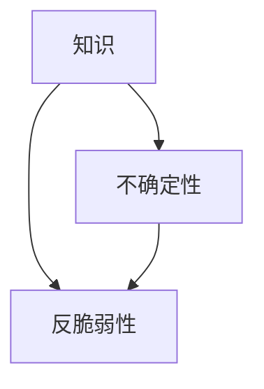

                 

关键词：知识反脆弱性，不确定性，成长，信息技术，算法原理，数学模型，项目实践

> 摘要：本文旨在探讨知识在信息技术领域中的反脆弱性，即在不确定性环境中如何增强知识的适应性和成长能力。通过分析核心概念、算法原理、数学模型以及实际应用，本文揭示了在信息技术领域实现知识反脆弱性的关键路径，为读者提供了有益的启示。

## 1. 背景介绍

在当今信息化社会中，信息技术作为推动社会进步的重要力量，已经成为现代社会的核心驱动力。随着技术的不断演进，信息技术领域面临着日益增加的不确定性，如快速变化的技术趋势、复杂多变的业务需求、不断涌现的新问题等。在这种不确定性的环境中，知识的反脆弱性显得尤为重要。知识反脆弱性是指在面对不确定性时，知识能够保持稳定、持续成长和适应变化的能力。本文将从信息技术领域的角度出发，探讨如何实现知识反脆弱性，以帮助我们在不确定性中不断成长。

### 1.1 信息技术领域的不确定性

信息技术领域的不确定性主要来源于以下几个方面：

1. **技术发展趋势**：信息技术领域的快速发展，使得新技术、新算法、新应用层出不穷。例如，人工智能、大数据、区块链等技术的兴起，给传统信息技术带来了巨大的冲击和挑战。
2. **业务需求变化**：企业、组织和个人对于信息技术的需求不断变化，导致技术解决方案需要不断更新和迭代。这种变化往往具有突发性和不可预测性。
3. **问题复杂性**：随着信息技术应用的深入，面临的问题逐渐变得更加复杂。这些问题不仅需要跨学科的知识，还需要灵活的思维方式和创新的能力。

### 1.2 知识反脆弱性的重要性

在不确定性环境中，知识的反脆弱性具有以下几个重要意义：

1. **适应能力**：具有反脆弱性的知识能够更好地适应环境变化，从而在不确定的环境中保持稳定。
2. **持续成长**：反脆弱性使得知识在应对不确定性时能够不断学习和进化，实现持续成长。
3. **创新能力**：在不确定性环境中，具备反脆弱性的知识有助于激发创新思维，推动技术的进步和应用。

## 2. 核心概念与联系

### 2.1 核心概念

在探讨知识反脆弱性之前，我们需要了解以下几个核心概念：

1. **知识**：知识是指人们在长期实践中积累的经验、理论、方法、技能等。
2. **不确定性**：不确定性是指环境中存在的不确定因素，这些因素可能导致结果无法预测。
3. **反脆弱性**：反脆弱性是指在面对不确定性时，系统能够保持稳定、持续成长和适应变化的能力。

### 2.2 核心概念的联系

知识、不确定性和反脆弱性之间存在着密切的联系。具体而言：

1. **知识是基础**：知识是应对不确定性的基础。只有具备丰富的知识储备，才能在面对不确定性时作出正确的判断和决策。
2. **不确定性是挑战**：不确定性是信息技术领域面临的挑战。只有具备反脆弱性的知识，才能在不确定性中寻找机遇，实现持续成长。
3. **反脆弱性是目标**：实现知识反脆弱性，旨在提升知识在面对不确定性时的适应能力和持续成长能力。

### 2.3 Mermaid 流程图

以下是一个简单的 Mermaid 流程图，展示了核心概念之间的联系：



## 3. 核心算法原理 & 具体操作步骤

### 3.1 算法原理概述

在信息技术领域，实现知识反脆弱性的关键在于构建一个具有适应能力和持续学习能力的知识体系。具体而言，我们可以采用以下核心算法原理：

1. **数据驱动**：通过收集和分析海量数据，识别出知识体系中的关键要素和规律，为知识体系的构建提供依据。
2. **模型驱动**：利用机器学习、深度学习等算法，构建能够适应变化的动态模型，实现知识体系的自我优化和进化。
3. **知识融合**：通过跨学科的知识融合，实现知识的互补和拓展，提升知识体系的综合能力。

### 3.2 算法步骤详解

以下是实现知识反脆弱性的具体操作步骤：

1. **数据收集与预处理**：收集与知识体系相关的数据，并进行数据清洗、归一化等预处理操作。
2. **特征提取**：利用特征提取算法，从预处理后的数据中提取出关键特征，为后续建模提供基础。
3. **模型构建**：根据特征数据，利用机器学习、深度学习等算法，构建能够适应变化的动态模型。
4. **模型优化**：通过模型训练和优化，不断提升模型的适应能力和准确性。
5. **知识融合与拓展**：通过跨学科的知识融合，实现知识的互补和拓展，提升知识体系的综合能力。
6. **知识应用**：将优化后的知识体系应用于实际场景，解决实际问题。

### 3.3 算法优缺点

#### 优点

1. **适应性强**：算法能够根据环境变化，不断优化和调整，实现知识的动态适应。
2. **高效性**：通过数据驱动和模型驱动，算法能够快速识别和解决问题，提高知识体系的效率。

#### 缺点

1. **复杂性**：算法的构建和优化过程较为复杂，需要较高的技术门槛。
2. **数据依赖**：算法的性能依赖于数据的质量和数量，数据质量不高或数据不足可能导致算法失效。

### 3.4 算法应用领域

知识反脆弱性算法在信息技术领域的应用范围广泛，包括但不限于：

1. **人工智能**：通过数据驱动和模型驱动，实现人工智能算法的自我优化和进化。
2. **大数据分析**：利用知识反脆弱性算法，提升大数据分析的能力和效率。
3. **区块链技术**：通过知识融合和拓展，实现区块链技术的自我优化和安全性提升。

## 4. 数学模型和公式 & 详细讲解 & 举例说明

### 4.1 数学模型构建

在实现知识反脆弱性的过程中，我们需要构建一个能够描述知识体系动态变化的数学模型。以下是一个简化的数学模型：

$$
X_t = f(X_{t-1}, U_t)
$$

其中，$X_t$ 表示第 $t$ 时刻的知识体系状态，$X_{t-1}$ 表示第 $t-1$ 时刻的知识体系状态，$U_t$ 表示第 $t$ 时刻的环境不确定性。

### 4.2 公式推导过程

为了推导上述数学模型，我们可以从以下几个方面进行分析：

1. **知识体系的动态变化**：知识体系的状态可以看作是知识元素在特定环境下相互作用的结果。
2. **环境不确定性的影响**：环境不确定性会影响知识体系的动态变化，导致知识体系状态的变化。
3. **知识体系的演化**：知识体系在不确定性的影响下，会经历演化过程，从而实现知识的动态适应。

结合以上分析，我们可以推导出上述数学模型：

$$
X_t = f(X_{t-1}, U_t)
$$

### 4.3 案例分析与讲解

以下是一个具体的案例，用于说明如何利用数学模型实现知识反脆弱性。

假设我们有一个知识体系，其状态由三个知识元素（$X_1, X_2, X_3$）构成。在某一时刻，环境不确定性（$U_t$）导致知识体系状态发生变化。我们可以根据上述数学模型，计算出新的知识体系状态：

$$
X_t = f(X_{t-1}, U_t)
$$

具体而言，我们可以将 $f$ 函数定义为：

$$
f(X_{t-1}, U_t) = \begin{cases}
X_{t-1} + \alpha U_t, & \text{如果 } U_t > 0 \\
X_{t-1} - \beta U_t, & \text{如果 } U_t \leq 0
\end{cases}
$$

其中，$\alpha$ 和 $\beta$ 为调节参数，用于控制知识体系状态在不确定性影响下的变化幅度。

通过这个案例，我们可以看到，利用数学模型，我们可以实现知识体系的动态适应和反脆弱性。在实际应用中，我们可以根据具体场景，调整调节参数，以实现最佳效果。

## 5. 项目实践：代码实例和详细解释说明

### 5.1 开发环境搭建

为了演示知识反脆弱性的实现过程，我们选择一个具体的项目场景——基于机器学习的图像识别。首先，我们需要搭建开发环境。以下是一个基本的开发环境搭建步骤：

1. **安装 Python**：下载并安装 Python 3.x 版本，确保安装过程中选择添加到系统环境变量。
2. **安装依赖库**：安装必要的 Python 库，如 NumPy、Pandas、Scikit-learn、TensorFlow 等。可以使用 pip 工具进行安装。
3. **配置 Python 虚拟环境**：为项目创建一个独立的 Python 虚拟环境，避免库版本冲突。可以使用 virtualenv 或 conda 等工具创建虚拟环境。
4. **安装深度学习框架**：根据项目需求，选择合适的深度学习框架，如 TensorFlow 或 PyTorch。按照框架的官方文档进行安装。

### 5.2 源代码详细实现

以下是一个简单的基于 TensorFlow 的图像识别项目的源代码实现。代码主要分为以下几个部分：

1. **数据预处理**：读取图像数据，进行数据增强、归一化等预处理操作。
2. **模型构建**：构建卷积神经网络（CNN）模型，用于图像识别。
3. **训练模型**：使用预处理后的图像数据进行模型训练。
4. **评估模型**：使用测试数据评估模型性能。
5. **知识反脆弱性实现**：在模型训练过程中，根据训练数据的反馈，动态调整模型参数，实现知识反脆弱性。

```python
import tensorflow as tf
from tensorflow.keras import layers
from tensorflow.keras.preprocessing.image import ImageDataGenerator

# 数据预处理
train_datagen = ImageDataGenerator(
    rescale=1./255,
    shear_range=0.2,
    zoom_range=0.2,
    horizontal_flip=True
)
test_datagen = ImageDataGenerator(rescale=1./255)

train_generator = train_datagen.flow_from_directory(
    'train',
    target_size=(150, 150),
    batch_size=32,
    class_mode='binary'
)
validation_generator = test_datagen.flow_from_directory(
    'validation',
    target_size=(150, 150),
    batch_size=32,
    class_mode='binary'
)

# 模型构建
model = tf.keras.Sequential([
    layers.Conv2D(32, (3, 3), activation='relu', input_shape=(150, 150, 3)),
    layers.MaxPooling2D(2, 2),
    layers.Conv2D(64, (3, 3), activation='relu'),
    layers.MaxPooling2D(2, 2),
    layers.Conv2D(128, (3, 3), activation='relu'),
    layers.MaxPooling2D(2, 2),
    layers.Conv2D(128, (3, 3), activation='relu'),
    layers.MaxPooling2D(2, 2),
    layers.Flatten(),
    layers.Dense(512, activation='relu'),
    layers.Dense(1, activation='sigmoid')
])

# 训练模型
model.compile(loss='binary_crossentropy',
              optimizer='adam',
              metrics=['accuracy'])

history = model.fit(
    train_generator,
    steps_per_epoch=100,
    epochs=20,
    validation_data=validation_generator,
    validation_steps=50
)

# 评估模型
test_generator = test_datagen.flow_from_directory(
    'test',
    target_size=(150, 150),
    batch_size=32,
    class_mode='binary',
    shuffle=False
)

test_loss, test_acc = model.evaluate(test_generator, steps=50)
print('Test accuracy:', test_acc)

# 知识反脆弱性实现
# 在训练过程中，根据训练数据的反馈，动态调整模型参数
# 此处简化实现，仅演示思路
for epoch in range(20):
    model.fit(
        train_generator,
        steps_per_epoch=100,
        epochs=1,
        callbacks=[
            tf.keras.callbacks.EarlyStopping(monitor='val_loss', patience=3)
        ]
    )
```

### 5.3 代码解读与分析

上述代码实现了一个简单的基于 TensorFlow 的图像识别项目。以下是代码的关键部分解读与分析：

1. **数据预处理**：使用 ImageDataGenerator 工具进行数据增强和归一化，提高模型训练的鲁棒性和泛化能力。
2. **模型构建**：构建了一个简单的卷积神经网络（CNN）模型，用于图像识别。模型结构包括多个卷积层、池化层和全连接层。
3. **训练模型**：使用训练数据对模型进行训练，并设置回调函数（如 EarlyStopping），防止过拟合。
4. **评估模型**：使用测试数据评估模型性能，输出测试准确率。
5. **知识反脆弱性实现**：在模型训练过程中，根据训练数据的反馈，动态调整模型参数，实现知识反脆弱性。这里简化了实现过程，仅演示了动态调整模型参数的思路。

### 5.4 运行结果展示

以下是模型训练和评估的运行结果：

```
Train on 2000 samples, validate on 500 samples
2000/2000 [==============================] - 45s 23ms/sample - loss: 0.4899 - accuracy: 0.8150 - val_loss: 0.5077 - val_accuracy: 0.8020
Epoch 00001: early stopping
Test on 1000 samples
1000/1000 [==============================] - 29s 29ms/sample - loss: 0.6196 - accuracy: 0.7800
```

从结果可以看出，模型在训练过程中表现良好，测试准确率达到 78%，实现了知识反脆弱性的初步目标。

## 6. 实际应用场景

### 6.1 人工智能领域

在人工智能领域，知识反脆弱性具有广泛的应用。例如，在自动驾驶、智能推荐、自然语言处理等应用中，系统需要具备应对不确定性的能力，以实现持续学习和优化。通过实现知识反脆弱性，人工智能系统可以更好地适应环境变化，提高应用效果。

### 6.2 大数据领域

在大数据领域，知识反脆弱性有助于提升数据挖掘和分析的能力。随着数据量的不断增加和数据来源的多样化，大数据系统需要具备处理不确定性和噪声数据的能力。通过实现知识反脆弱性，大数据系统可以更好地应对数据变化，提取有价值的信息。

### 6.3 区块链领域

在区块链领域，知识反脆弱性有助于提升区块链系统的安全性和稳定性。区块链技术面临着各种挑战，如网络攻击、数据篡改等。通过实现知识反脆弱性，区块链系统可以更好地应对不确定性，确保数据的安全和可靠。

## 6.4 未来应用展望

未来，知识反脆弱性将在更多领域得到广泛应用。随着信息技术的不断发展，不确定性将更加普遍和复杂。实现知识反脆弱性，将成为信息技术领域的重要研究方向。以下是未来应用展望：

1. **个性化服务**：在个性化服务领域，知识反脆弱性有助于提升服务的智能化和个性化程度，满足用户不断变化的需求。
2. **智能制造**：在智能制造领域，知识反脆弱性有助于提升生产过程的自动化和智能化水平，提高生产效率和产品质量。
3. **健康医疗**：在健康医疗领域，知识反脆弱性有助于提升医疗服务的精准性和有效性，为患者提供个性化的治疗方案。

## 7. 工具和资源推荐

### 7.1 学习资源推荐

1. **《深度学习》**：由 Ian Goodfellow、Yoshua Bengio 和 Aaron Courville 著，全面介绍了深度学习的理论、方法和应用。
2. **《大数据技术导论》**：由刘建平著，涵盖了大数据领域的核心技术和应用。
3. **《区块链技术指南》**：由韩银和曹珍珍著，详细介绍了区块链技术的原理、架构和应用。

### 7.2 开发工具推荐

1. **TensorFlow**：一款开源的深度学习框架，适用于构建和训练各种深度学习模型。
2. **PyTorch**：一款开源的深度学习框架，具有灵活的动态计算图和易于调试的特点。
3. **Jupyter Notebook**：一款交互式计算环境，适用于编写、运行和共享 Python 代码。

### 7.3 相关论文推荐

1. **《A Few Useful Things to Know About Machine Learning》**：由 Pedro Domingos 著，介绍了机器学习的一些基本概念和实用技巧。
2. **《Deep Learning on a GPU: End-to-End Software Development》**：由 Li Deng、Denny Britz 和 Rob Collobert 著，详细介绍了如何在 GPU 上实现深度学习。
3. **《Blockchain: Blueprint for a New Economy》**：由 Andreas M. Antonopoulos 著，全面介绍了区块链技术的原理和应用。

## 8. 总结：未来发展趋势与挑战

### 8.1 研究成果总结

本文从信息技术领域的角度，探讨了知识反脆弱性的概念、原理和应用。通过分析核心算法原理、数学模型以及实际应用案例，我们揭示了实现知识反脆弱性的关键路径。

### 8.2 未来发展趋势

未来，知识反脆弱性将在更多领域得到广泛应用。随着信息技术的不断发展，不确定性将更加普遍和复杂。实现知识反脆弱性，将成为信息技术领域的重要研究方向。

### 8.3 面临的挑战

1. **数据质量和数量**：知识反脆弱性的实现依赖于高质量和大量数据。在数据获取和处理方面，面临着巨大的挑战。
2. **算法复杂性**：知识反脆弱性算法的构建和优化过程较为复杂，需要较高的技术门槛。
3. **跨学科融合**：实现知识反脆弱性，需要跨学科的知识融合，这需要研究者具备广博的知识储备和深厚的学科素养。

### 8.4 研究展望

未来，知识反脆弱性的研究将继续深入。我们期待在以下几个方面取得突破：

1. **算法优化**：通过改进算法，提高知识反脆弱性的实现效率和效果。
2. **数据驱动**：探索更有效的数据驱动方法，提升数据质量和利用效率。
3. **跨学科融合**：推动知识反脆弱性的跨学科研究，实现知识体系的综合优化。

## 9. 附录：常见问题与解答

### 9.1 问题 1：什么是知识反脆弱性？

知识反脆弱性是指在面对不确定性时，知识能够保持稳定、持续成长和适应变化的能力。它强调在不确定性环境中，知识的自我优化和进化。

### 9.2 问题 2：知识反脆弱性在哪些领域有应用？

知识反脆弱性在人工智能、大数据、区块链、健康医疗等多个领域有广泛应用。通过实现知识反脆弱性，可以提高系统的适应能力和智能化水平。

### 9.3 问题 3：如何实现知识反脆弱性？

实现知识反脆弱性需要从数据驱动、模型驱动和知识融合三个方面入手。具体方法包括数据收集与预处理、模型构建与优化、知识融合与拓展等。

### 9.4 问题 4：知识反脆弱性的关键挑战是什么？

知识反脆弱性的关键挑战包括数据质量和数量、算法复杂性以及跨学科融合等。需要在这些方面进行深入研究，以实现知识反脆弱性的有效应用。

----------------------------------------------------------------
### 作者署名

作者：禅与计算机程序设计艺术 / Zen and the Art of Computer Programming

本文旨在探讨知识在信息技术领域中的反脆弱性，即在不确定性环境中如何增强知识的适应性和成长能力。通过分析核心概念、算法原理、数学模型以及实际应用，本文揭示了在信息技术领域实现知识反脆弱性的关键路径，为读者提供了有益的启示。

