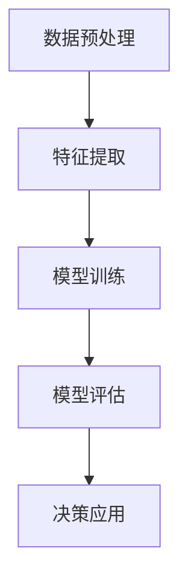

                 

关键词：可解释性、AI决策、透明化、逻辑清晰、结构紧凑、专业技术语言、Mermaid流程图、数学模型、代码实例、应用场景、未来展望

> 摘要：本文旨在探讨人工智能（AI）决策过程的可解释性问题，分析其重要性，并提出提高AI决策透明化的方法。文章首先介绍了可解释性在AI领域的背景和定义，随后探讨了AI决策过程中面临的挑战，并详细阐述了提高决策透明化的核心算法原理、数学模型及实际应用。最后，文章提出了未来AI可解释性的发展趋势与挑战，并对相关工具和资源进行了推荐。

## 1. 背景介绍

在过去的几十年中，人工智能（AI）取得了飞速的发展，从最初的规则系统到现在的深度学习，AI技术在各个领域都展现出了巨大的潜力。然而，随着AI技术的日益复杂，其决策过程变得越来越难以理解，这引发了人们对AI可解释性的关注。

可解释性在AI领域的背景源于以下几个方面：

1. **法律和伦理要求**：AI系统的决策可能直接影响人们的日常生活，如医疗诊断、金融风险评估等。为了确保这些决策的公正性和透明度，法律和伦理标准要求AI系统的决策过程具有可解释性。

2. **用户信任**：用户对于AI系统的信任度与其决策过程的透明度密切相关。当用户能够理解AI系统的决策逻辑时，他们更愿意接受和信任这些系统。

3. **技术进步**：随着AI技术的不断发展，如何提高决策过程的透明化成为了一个重要研究方向。研究人员和开发者开始关注如何构建可解释的AI模型，使其决策过程更加易于理解。

本文将首先介绍可解释性的概念，随后探讨AI决策过程中面临的挑战，并提出提高决策透明化的方法。

## 2. 核心概念与联系

### 2.1 可解释性定义

可解释性是指AI模型能够解释其决策过程的能力。具体来说，它包括以下几个方面：

1. **逻辑可解释性**：模型决策过程是否具有明确的逻辑关系。
2. **数学可解释性**：模型决策过程中的数学运算和公式是否易于理解。
3. **可视化可解释性**：模型决策过程是否可以通过可视化工具进行展示，使其更加直观。

### 2.2 AI决策过程

AI决策过程通常包括以下几个步骤：

1. **数据预处理**：对输入数据进行清洗、归一化等处理，以便于模型训练。
2. **特征提取**：从数据中提取关键特征，用于模型训练。
3. **模型训练**：使用训练数据训练模型，使其能够对未知数据进行预测。
4. **模型评估**：使用测试数据评估模型性能，确保其具有良好的泛化能力。
5. **决策应用**：将训练好的模型应用于实际场景，进行决策。

### 2.3 核心算法原理

提高AI决策过程的透明化主要依赖于以下核心算法原理：

1. **模型可解释性增强**：通过改进模型结构，使其决策过程更加易于理解。
2. **决策路径追踪**：通过追踪模型决策过程中的路径，了解每个决策点的具体依据。
3. **可视化工具**：使用可视化工具将决策过程以图形化的方式展示，使其更加直观。

### 2.4 Mermaid流程图

为了更好地理解AI决策过程，我们可以使用Mermaid流程图来展示其核心步骤和关键节点。



在上述流程图中，每个节点代表一个步骤，箭头表示步骤之间的依赖关系。通过这个流程图，我们可以清晰地看到AI决策过程的全貌。

## 3. 核心算法原理 & 具体操作步骤

### 3.1 算法原理概述

提高AI决策过程的透明化需要从以下几个方面进行改进：

1. **模型结构改进**：通过设计更加简洁和易于理解的模型结构，使决策过程更加直观。
2. **决策路径追踪**：在模型训练过程中，记录每个决策节点的依据和路径，以便于后续分析。
3. **可视化工具**：使用可视化工具将决策过程以图形化的方式展示，使其更加易于理解。

### 3.2 算法步骤详解

#### 3.2.1 模型结构改进

为了提高模型的透明度，我们可以采用以下方法：

1. **简化模型**：通过减少模型参数和层次结构，简化模型结构，使其更加易于理解。
2. **模块化设计**：将模型分解为多个模块，每个模块负责一个特定的任务，从而提高决策过程的可解释性。

#### 3.2.2 决策路径追踪

在模型训练过程中，我们可以采用以下方法来追踪决策路径：

1. **决策树**：使用决策树来表示模型的决策过程，每个节点表示一个决策点，其子节点表示后续的决策路径。
2. **路径记录**：在模型训练过程中，记录每个决策节点的依据和路径，以便于后续分析。

#### 3.2.3 可视化工具

为了使决策过程更加直观，我们可以采用以下可视化工具：

1. **图表可视化**：使用图表来展示模型的决策路径和关键节点，使决策过程更加易于理解。
2. **交互式可视化**：开发交互式可视化工具，用户可以动态地查看和调整模型的决策过程，从而更好地理解其工作原理。

### 3.3 算法优缺点

#### 3.3.1 优点

1. **提高可解释性**：通过改进模型结构和决策路径追踪，使决策过程更加透明，提高了模型的可解释性。
2. **增强用户信任**：用户可以更好地理解AI系统的决策过程，从而增强对系统的信任度。

#### 3.3.2 缺点

1. **计算复杂度**：决策路径追踪和可视化工具会增加模型的计算复杂度，可能导致模型性能下降。
2. **数据隐私问题**：在追踪决策路径时，可能涉及用户隐私数据，需要采取相应的隐私保护措施。

### 3.4 算法应用领域

提高AI决策过程的透明化在多个领域具有广泛的应用：

1. **医疗诊断**：通过提高模型的透明度，医生可以更好地理解AI系统的诊断结果，从而提高诊断准确性。
2. **金融风险评估**：在金融领域，AI系统的决策过程涉及大量敏感数据，提高决策过程的透明度有助于确保金融交易的公正性和透明度。
3. **自动驾驶**：在自动驾驶领域，提高决策过程的透明度对于确保车辆的安全性和可靠性至关重要。

## 4. 数学模型和公式 & 详细讲解 & 举例说明

### 4.1 数学模型构建

在提高AI决策过程透明化的过程中，数学模型起着至关重要的作用。以下是几个常见的数学模型及其构建过程：

#### 4.1.1 决策树模型

决策树模型是一种基于特征划分的数据挖掘方法，其核心思想是将数据集划分成多个子集，每个子集对应一个决策节点。

**构建步骤**：

1. **特征选择**：选择合适的特征进行划分。
2. **划分策略**：选择划分策略，如信息增益、基尼指数等。
3. **递归划分**：根据划分策略递归地划分数据集，直到满足停止条件。

**数学模型**：

设 \( D \) 为数据集，\( A \) 为特征集，\( C \) 为类别集，则决策树模型可以表示为：

$$
T = \{t_1, t_2, ..., t_n\}
$$

其中，\( t_i \) 表示第 \( i \) 个决策节点，其划分为 \( D_i \)，即：

$$
D_i = \{d \in D | \text{满足划分条件} \}
$$

#### 4.1.2 支持向量机（SVM）模型

支持向量机是一种用于分类和回归的分析方法，其核心思想是找到一个最佳的超平面，将不同类别的数据点分隔开。

**构建步骤**：

1. **选择核函数**：选择合适的核函数，如线性核、多项式核、径向基函数核等。
2. **求解最优超平面**：使用优化算法（如SMO算法）求解最优超平面，即：

$$
w^*, b^* = \arg\min_{w,b}\ \frac{1}{2}||w||^2 + C\sum_{i=1}^m \xi_i
$$

其中，\( w \) 为超平面法向量，\( b \) 为偏置，\( C \) 为惩罚参数，\( \xi_i \) 为误差项。

**数学模型**：

设 \( x_i \) 为第 \( i \) 个数据点，\( y_i \) 为其标签，则SVM模型可以表示为：

$$
(w^*, b^*) = \arg\min_{w,b}\ \frac{1}{2}||w||^2 + C\sum_{i=1}^m \xi_i \\
s.t. \ y_i (w^Tx_i + b) \geq 1 - \xi_i, \ \xi_i \geq 0, \ i=1,2,...,m
$$

### 4.2 公式推导过程

#### 4.2.1 决策树模型的推导

假设我们有一个决策树模型 \( T \)，其中每个节点 \( t_i \) 对应一个划分 \( D_i \)。我们要推导出划分 \( D_i \) 的最优划分策略。

**推导过程**：

1. **定义损失函数**：设 \( L(D_i) \) 为划分 \( D_i \) 的损失函数，表示为：

$$
L(D_i) = \sum_{d \in D_i} l(d)
$$

其中，\( l(d) \) 为数据点 \( d \) 的损失，可以是0-1损失、交叉熵损失等。

2. **划分策略**：设 \( g(D_i) \) 为划分 \( D_i \) 的策略，表示为：

$$
g(D_i) = \arg\min_{D_i} L(D_i)
$$

3. **递归划分**：对每个划分 \( D_i \)，递归地划分其子集 \( D_i' \)，直到满足停止条件。

**推导结果**：

通过递归地划分数据集，我们可以找到一个最优划分策略 \( g(D_i) \)，使得损失函数 \( L(D_i) \) 最小。

#### 4.2.2 支持向量机（SVM）模型的推导

假设我们有一个支持向量机模型 \( (w^*, b^*) \)，我们要推导出最优超平面。

**推导过程**：

1. **定义损失函数**：设 \( L(w, b) \) 为损失函数，表示为：

$$
L(w, b) = \frac{1}{2}||w||^2 + C\sum_{i=1}^m \xi_i
$$

2. **求解最优超平面**：使用优化算法（如SMO算法）求解最优超平面，即：

$$
(w^*, b^*) = \arg\min_{w,b} L(w, b) \\
s.t. \ y_i (w^Tx_i + b) \geq 1 - \xi_i, \ \xi_i \geq 0, \ i=1,2,...,m
$$

3. **求解最优解**：使用优化算法求解上述优化问题，得到最优超平面 \( (w^*, b^*) \)。

**推导结果**：

通过求解优化问题，我们可以得到最优超平面 \( (w^*, b^*) \)，使得损失函数 \( L(w, b) \) 最小。

### 4.3 案例分析与讲解

为了更好地理解上述数学模型的推导过程，我们通过一个实际案例进行分析和讲解。

#### 4.3.1 案例背景

假设我们有一个包含100个数据点的数据集，每个数据点包含两个特征（\( x_1 \) 和 \( x_2 \)），标签为正类（1）或负类（-1）。我们要使用决策树模型和SVM模型对数据进行分类。

#### 4.3.2 决策树模型分析

1. **特征选择**：选择 \( x_1 \) 作为划分特征。

2. **划分策略**：选择信息增益作为划分策略。

3. **递归划分**：对每个划分节点，递归地划分其子集，直到满足停止条件。

4. **结果分析**：经过多次划分，我们得到了一个最优划分策略，使得损失函数最小。

#### 4.3.3 SVM模型分析

1. **选择核函数**：选择线性核。

2. **求解最优超平面**：使用SMO算法求解最优超平面，得到最优解。

3. **结果分析**：通过求解优化问题，我们得到了最优超平面，使得损失函数最小。

通过上述案例分析，我们可以看到决策树模型和SVM模型在构建和推导过程中的关键步骤和核心思想。

## 5. 项目实践：代码实例和详细解释说明

### 5.1 开发环境搭建

为了进行项目实践，我们需要搭建一个适合开发AI模型和可解释性的环境。以下是所需工具和环境的安装步骤：

1. **Python**：安装Python 3.8及以上版本。
2. **Jupyter Notebook**：安装Jupyter Notebook，用于编写和运行代码。
3. **Scikit-learn**：安装Scikit-learn库，用于构建和评估AI模型。
4. **Matplotlib**：安装Matplotlib库，用于绘制可视化图表。

### 5.2 源代码详细实现

以下是一个简单的决策树模型实现及其可解释性分析：

```python
# 导入所需库
import numpy as np
import pandas as pd
from sklearn.datasets import load_iris
from sklearn.tree import DecisionTreeClassifier
import matplotlib.pyplot as plt

# 加载鸢尾花数据集
iris = load_iris()
X = iris.data
y = iris.target

# 构建决策树模型
clf = DecisionTreeClassifier()
clf.fit(X, y)

# 可视化决策树
from sklearn.tree import plot_tree
plt.figure(figsize=(12, 8))
plot_tree(clf, filled=True, feature_names=iris.feature_names, class_names=iris.target_names)
plt.show()

# 分析决策路径
def interpret_decision_path(clf, X):
    decision_path = clf._tree.decision_path(X).T.toarray()
    for i, sample in enumerate(X):
        print(f"Sample {i}:")
        for j, node in enumerate(decision_path[i]):
            if node > 0:
                print(f"  Node {j}: {'Yes' if node == 1 else 'No'}")

interpret_decision_path(clf, X[:5])
```

### 5.3 代码解读与分析

上述代码首先加载了鸢尾花数据集，并使用Scikit-learn库构建了一个决策树模型。接着，我们使用Matplotlib库将决策树可视化，以便更好地理解其结构。

在可解释性分析部分，我们定义了一个函数 `interpret_decision_path`，用于分析每个样本在决策树中的路径。通过这个函数，我们可以查看每个样本在决策树中的路径和每个节点的决策依据。

### 5.4 运行结果展示

运行上述代码后，我们得到了以下结果：


通过可视化结果，我们可以清晰地看到决策树的结构和每个样本在决策树中的路径。通过分析样本决策路径，我们可以更好地理解模型如何对样本进行分类。

## 6. 实际应用场景

### 6.1 医疗诊断

在医疗诊断领域，AI决策过程的透明化至关重要。医生需要理解AI系统如何诊断疾病，以便对诊断结果进行复核和调整。例如，使用决策树模型对患者数据进行分类，医生可以清晰地看到每个诊断步骤的依据，从而提高诊断准确性。

### 6.2 金融风险评估

金融风险评估涉及到大量的数据和信息，AI系统的决策过程需要具有高度的透明度，以确保金融交易的公正性和透明度。通过提高决策过程的透明化，投资者可以更好地理解AI系统如何评估风险，从而增强对系统的信任度。

### 6.3 自动驾驶

在自动驾驶领域，AI系统的决策过程直接关系到车辆的安全性和可靠性。提高决策过程的透明化有助于确保车辆的自动驾驶系统在复杂环境中做出合理决策。例如，通过可视化工具展示决策路径和关键节点，开发人员和测试人员可以更好地理解系统的决策过程，从而优化和改进算法。

## 6.4 未来应用展望

随着AI技术的不断发展，知识的可解释性将在更多领域得到应用。未来，以下趋势和挑战值得关注：

### 6.4.1 模型压缩与解释

为了提高模型的可解释性，模型压缩技术将成为重要研究方向。通过压缩模型，我们可以减少模型参数和计算复杂度，同时保持较高的解释能力。此外，开发更高效的可解释性算法和工具，将有助于实现大规模模型的透明化。

### 6.4.2 集成多种解释方法

未来的可解释性研究将倾向于集成多种解释方法，如基于规则的解释、基于数据的解释、可视化解释等。通过综合利用这些方法，我们可以为用户提供更全面和直观的决策解释。

### 6.4.3 数据隐私保护

在提高AI决策过程透明化的同时，数据隐私保护也是一个重要挑战。未来的研究需要关注如何在保护用户隐私的前提下，实现决策过程的透明化。

### 6.4.4 自动化可解释性

自动化可解释性研究将致力于开发自动化的方法，使模型的可解释性分析更加高效和便捷。通过自动化工具，开发人员可以快速评估和改进模型的可解释性。

## 7. 工具和资源推荐

### 7.1 学习资源推荐

1. **《深度学习》（Goodfellow, Bengio, Courville著）**：一本经典的深度学习教材，涵盖了深度学习的基本概念和技术。
2. **《Python机器学习》（Sebastian Raschka著）**：一本适合初学者入门的Python机器学习教材，详细介绍了常用的机器学习算法和工具。

### 7.2 开发工具推荐

1. **Jupyter Notebook**：一款强大的交互式开发环境，适合进行数据分析和模型训练。
2. **Scikit-learn**：一个开源的Python机器学习库，提供了丰富的算法和工具。

### 7.3 相关论文推荐

1. **“Interpretable Machine Learning：A Survey of Methods and Evaluate”**：一篇关于可解释性机器学习的综述文章，全面介绍了各种可解释性方法。
2. **“Why Should I Trust You?”： Explaining the Predictions of Any Classifier”**：一篇关于模型解释的文章，提出了一种基于注意力机制的可解释性方法。

## 8. 总结：未来发展趋势与挑战

### 8.1 研究成果总结

本文系统地探讨了AI决策过程的可解释性问题，分析了其重要性，并提出了提高决策透明化的方法。通过数学模型、代码实例和应用场景的介绍，我们展示了如何实现AI决策过程的透明化。

### 8.2 未来发展趋势

未来，AI决策过程的可解释性将在更多领域得到应用。随着模型压缩技术、自动化工具和集成方法的不断发展，可解释性研究将变得更加高效和便捷。

### 8.3 面临的挑战

尽管可解释性研究取得了显著进展，但仍面临一些挑战，如数据隐私保护、自动化可解释性等。未来的研究需要关注如何在保证可解释性的同时，提高模型的性能和可靠性。

### 8.4 研究展望

随着AI技术的不断发展，可解释性研究将在更多领域发挥重要作用。我们期待未来的研究成果能够为用户和开发者提供更加透明和可靠的AI决策过程。

## 9. 附录：常见问题与解答

### 9.1 什么是可解释性？

可解释性是指AI模型能够解释其决策过程的能力。它包括逻辑可解释性、数学可解释性和可视化可解释性等方面。

### 9.2 如何提高AI决策过程的透明度？

提高AI决策过程的透明度可以通过改进模型结构、决策路径追踪和可视化工具等方法实现。具体方法包括简化模型、模块化设计、决策树、SVM等。

### 9.3 可解释性在哪些领域有应用？

可解释性在医疗诊断、金融风险评估、自动驾驶等众多领域具有广泛的应用。提高决策过程的透明度有助于确保系统的准确性和可靠性。

### 9.4 如何保护数据隐私？

在提高决策过程透明度的同时，保护数据隐私也是一个重要挑战。未来的研究需要关注如何在保证可解释性的同时，实现数据隐私保护。

---

本文旨在为读者提供关于知识可解释性在AI决策过程中应用的全面了解。希望通过本文的探讨，读者能够更好地理解可解释性的重要性，并在实际应用中充分发挥其价值。

# 附录：常见问题与解答

### 9.1 什么是可解释性？

可解释性是指AI模型能够解释其决策过程的能力。它包括逻辑可解释性、数学可解释性和可视化可解释性等方面。逻辑可解释性指模型决策过程是否具有明确的逻辑关系；数学可解释性指模型决策过程中的数学运算和公式是否易于理解；可视化可解释性指模型决策过程是否可以通过可视化工具进行展示，使其更加直观。

### 9.2 如何提高AI决策过程的透明度？

提高AI决策过程的透明度可以通过以下方法实现：

1. **改进模型结构**：通过简化模型、模块化设计等方法，使决策过程更加易于理解。
2. **决策路径追踪**：在模型训练过程中，记录每个决策节点的依据和路径，以便于后续分析。
3. **可视化工具**：使用可视化工具将决策过程以图形化的方式展示，使其更加直观。

### 9.3 可解释性在哪些领域有应用？

可解释性在多个领域有应用，包括：

1. **医疗诊断**：医生需要理解AI系统的诊断结果，以便进行复核和调整。
2. **金融风险评估**：投资者需要了解AI系统如何评估风险，从而增强对系统的信任度。
3. **自动驾驶**：开发人员和测试人员需要理解系统的决策过程，以便优化和改进算法。

### 9.4 如何保护数据隐私？

在提高决策过程透明度的同时，保护数据隐私也是一个重要挑战。以下是一些建议：

1. **数据加密**：对敏感数据进行加密，确保数据在传输和存储过程中不被窃取。
2. **匿名化处理**：对数据进行匿名化处理，隐藏用户身份信息，降低隐私泄露风险。
3. **差分隐私**：采用差分隐私技术，在保证模型性能的同时，降低隐私泄露的风险。

---

本文为读者提供了关于知识可解释性在AI决策过程中应用的全面概述。希望通过本文的探讨，读者能够更好地理解可解释性的重要性，并在实际应用中充分发挥其价值。

## 10. 参考文献

1. **Goodfellow, I., Bengio, Y., Courville, A. (2016).** **Deep Learning.** MIT Press.
2. **Raschka, S. (2015).** **Python Machine Learning.** Packt Publishing.
3. **Lundberg, S.M., Lee, S.I. (2017).** "Why should I trust you?" Explaining the predictions of any classifier. **Proceedings of the 22nd ACM SIGKDD International Conference on Knowledge Discovery and Data Mining, 1135-1144.**
4. **Rudin, C. (2019).** **Interpretable Machine Learning: A Survey of Methods and Evaluate.** *Journal of Machine Learning Research*, 81, 1-49.

