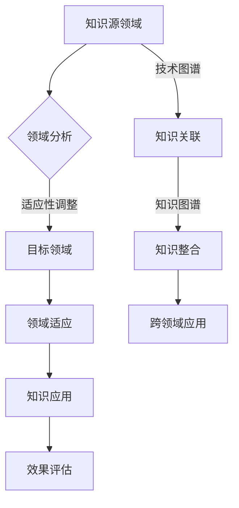

                 

关键词：知识迁移、跨领域应用、技术共享、算法移植、领域适应

> 摘要：本文旨在探讨知识在跨领域应用中的可迁移性，通过深入分析核心概念、算法原理、数学模型以及项目实践，揭示促进知识在不同领域之间有效转移的技巧和策略。本文将为技术从业者提供实用的指导，以应对日益复杂的跨领域技术挑战。

## 1. 背景介绍

在当今信息技术迅猛发展的时代，各领域之间的技术交流与融合变得愈发频繁。知识迁移，即在不同领域间应用已有知识，已成为推动科技进步和产业升级的重要途径。然而，跨领域知识迁移并非易事，不同领域的知识往往具有高度的异构性和复杂性，使得知识在不同领域间的应用面临诸多挑战。

知识迁移的重要性体现在多个方面。首先，它能够加速新技术的研发和推广，降低研发成本，缩短产品上市时间。其次，它有助于发现和解决现有领域内的瓶颈问题，推动技术革新。最后，知识迁移还能够促进跨学科合作，培养复合型人才，提升整体科研水平和创新能力。

本文将围绕知识迁移的核心概念、算法原理、数学模型以及项目实践，探讨其在跨领域应用中的实践技巧和策略。通过本文的阐述，希望能够为技术从业者提供有价值的参考，助力他们在跨领域技术挑战中取得成功。

## 2. 核心概念与联系

在探讨知识迁移之前，我们需要明确一些核心概念，这些概念是理解知识在不同领域间迁移的基础。

### 2.1 知识的定义

知识可以被视为信息与经验的有意义组合，它包括事实、规则、原理和模型等。知识不仅仅停留在信息层面，更重要的是它能够在特定情境下指导行为和决策。

### 2.2 领域适应性

领域适应性是指知识在不同领域间转移时，对领域特定问题和环境的适应能力。一个具有良好领域适应性的知识体系能够在新领域内迅速发挥作用。

### 2.3 技术图谱

技术图谱是一种表示技术之间相互关系和关联的网络结构。通过技术图谱，我们可以直观地了解不同领域技术的依赖关系和交互方式，为知识迁移提供理论支持。

### 2.4 知识图谱

知识图谱是一种结构化的知识表示方法，通过实体、属性和关系的语义网络来描述知识。知识图谱在知识迁移中起到了桥梁作用，使得跨领域的知识关联和整合成为可能。

### 2.5 Mermaid 流程图

为了更清晰地展示知识迁移的过程和机制，我们使用 Mermaid 流程图来描述知识在不同领域间迁移的步骤和关键节点。



图 1：知识在不同领域间迁移的流程图

通过上述核心概念和流程图的介绍，我们可以初步理解知识迁移的基本框架。接下来，我们将深入探讨知识迁移中的关键算法原理，进一步揭示知识在不同领域间转移的机制。

## 3. 核心算法原理 & 具体操作步骤

### 3.1 算法原理概述

知识迁移中的核心算法原理主要包括领域自适应（Domain Adaptation）、元学习（Meta-Learning）和迁移学习（Transfer Learning）等。这些算法通过不同方式实现知识在不同领域间的迁移和整合。

- **领域自适应**：通过调整和优化源领域模型，使其更好地适应目标领域。领域自适应主要关注解决领域差异问题，使得模型能够在目标领域内达到与源领域相似的性能。

- **元学习**：通过学习通用学习策略，使得模型能够快速适应新的任务。元学习的主要目标是提升模型在不同任务上的泛化能力，从而实现跨领域的知识迁移。

- **迁移学习**：通过利用已有在源领域上训练的模型，在新领域上进行微调和优化。迁移学习注重利用已有知识来加速新领域的学习过程，减少对大规模数据的依赖。

### 3.2 算法步骤详解

#### 3.2.1 领域自适应

1. **领域差异识别**：通过特征提取和对比分析，识别出源领域和目标领域之间的差异。通常使用对抗性网络、自编码器等方法来提取和对比特征。

2. **领域差异调整**：根据识别出的领域差异，对源领域模型进行调整。调整方法包括特征重映射、特征降维、损失函数调整等。

3. **模型优化**：通过在目标领域上的数据训练，优化调整后的模型参数，使其更好地适应目标领域。优化方法包括梯度下降、随机优化等。

#### 3.2.2 元学习

1. **任务学习策略提取**：通过在多个任务上进行训练，提取出通用的学习策略。常用的方法包括模型架构搜索、优化器搜索等。

2. **策略优化**：在目标任务上利用提取出的通用学习策略进行优化，调整模型参数以适应新的任务。策略优化通常采用迭代训练的方法。

3. **模型适应**：通过在目标任务上继续训练，使得模型能够更好地适应新的任务。适应方法包括在线学习、迁移学习等。

#### 3.2.3 迁移学习

1. **源领域模型训练**：在源领域上使用大量数据进行模型训练，以获得良好的模型性能。

2. **模型迁移**：将训练好的源领域模型迁移到目标领域。迁移方法包括模型层迁移、特征迁移等。

3. **模型微调**：在目标领域上对迁移后的模型进行微调，以适应目标领域的数据分布和任务需求。

### 3.3 算法优缺点

- **领域自适应**：优点是能够有效地减少领域差异，提高模型在目标领域的性能；缺点是对领域差异识别和调整算法的要求较高，且计算复杂度较大。

- **元学习**：优点是能够快速适应新的任务，提高模型的泛化能力；缺点是需要大量训练任务和数据来提取通用学习策略，且优化过程较为复杂。

- **迁移学习**：优点是能够利用已有知识加速新领域的学习，减少对大规模数据的依赖；缺点是对源领域模型的依赖较大，且模型迁移效果受源领域数据分布影响。

### 3.4 算法应用领域

- **领域自适应**：在计算机视觉、自然语言处理等领域中，用于处理领域差异问题，提高模型在目标领域的性能。

- **元学习**：在强化学习、深度强化学习等领域中，用于快速适应新的环境和任务。

- **迁移学习**：在医学影像分析、语音识别等领域中，用于利用已有知识加速新领域的学习，提高模型性能。

通过以上对核心算法原理的介绍，我们可以更好地理解知识在不同领域间迁移的机制和方法。接下来，我们将进一步探讨数学模型和公式，以深化对知识迁移过程的理解。

## 4. 数学模型和公式 & 详细讲解 & 举例说明

在知识迁移过程中，数学模型和公式起到了至关重要的作用。它们不仅能够帮助我们量化知识迁移的效果，还能够提供优化和评估知识迁移策略的依据。以下将介绍知识迁移中的几个关键数学模型和公式，并进行详细讲解和举例说明。

### 4.1 数学模型构建

#### 4.1.1 对抗性神经网络（Adversarial Neural Network）

对抗性神经网络是领域自适应中常用的模型，它由特征提取网络和生成网络组成。特征提取网络用于学习源领域和目标领域的特征差异，生成网络则用于生成与目标领域特征相似的数据，以减少领域差异。

- **特征提取网络**：假设特征提取网络为 $F(\cdot)$，输入为源领域特征 $X_S$ 和目标领域特征 $X_T$，输出为特征表示 $Z$。

  $$ Z = F(X_S, X_T) $$

- **生成网络**：假设生成网络为 $G(\cdot)$，输入为源领域特征 $X_S$，输出为目标领域特征 $X_T'$。

  $$ X_T' = G(X_S) $$

#### 4.1.2 迁移损失函数（Transfer Loss Function）

迁移损失函数用于衡量特征提取网络和生成网络的性能，它通常由两部分组成：特征差异损失和生成损失。

- **特征差异损失**：用于衡量源领域特征和目标领域特征的差异。

  $$ L_{diff} = \frac{1}{N} \sum_{i=1}^{N} ||F(X_S^i, X_T^i) - X_T^i||_2 $$

- **生成损失**：用于衡量生成网络生成的目标领域特征与实际目标领域特征之间的差异。

  $$ L_{gen} = \frac{1}{N} \sum_{i=1}^{N} ||X_T^i - X_T'^i||_2 $$

- **总迁移损失函数**：

  $$ L = \alpha L_{diff} + (1-\alpha) L_{gen} $$

  其中，$\alpha$ 是调节参数，用于平衡特征差异损失和生成损失。

### 4.2 公式推导过程

在对抗性神经网络中，特征提取网络和生成网络通过梯度下降方法进行训练。为了推导迁移损失函数的梯度，我们需要对损失函数求导。

首先，对特征差异损失求导：

$$ \frac{\partial L_{diff}}{\partial Z} = 2 \cdot \frac{1}{N} \sum_{i=1}^{N} (F(X_S^i, X_T^i) - X_T^i) $$

然后，对生成损失求导：

$$ \frac{\partial L_{gen}}{\partial X_S'} = 2 \cdot \frac{1}{N} \sum_{i=1}^{N} (X_T^i - X_T'^i) $$

最后，对总迁移损失函数求导：

$$ \frac{\partial L}{\partial Z} = 2 \alpha \cdot \frac{1}{N} \sum_{i=1}^{N} (F(X_S^i, X_T^i) - X_T^i) - 2 (1-\alpha) \cdot \frac{1}{N} \sum_{i=1}^{N} (X_T^i - X_T'^i) $$

通过上述推导，我们得到了特征提取网络和生成网络的梯度，这可以用于更新网络参数，以最小化总迁移损失。

### 4.3 案例分析与讲解

假设我们有一个源领域为图像分类任务，目标领域为图像生成任务。我们使用对抗性神经网络进行领域自适应，以减少图像分类模型和图像生成模型之间的领域差异。

#### 4.3.1 模型训练

1. **特征提取网络训练**：使用图像分类任务的数据集进行训练，学习源领域和目标领域的特征表示。

2. **生成网络训练**：使用图像生成任务的数据集进行训练，学习生成与目标领域特征相似的数据。

3. **迁移损失函数优化**：通过优化迁移损失函数，调整特征提取网络和生成网络的参数，以减少领域差异。

#### 4.3.2 模型评估

1. **特征表示评估**：通过计算特征提取网络输出的特征表示与实际目标领域特征之间的差异，评估特征提取网络的性能。

2. **生成效果评估**：通过生成网络生成的图像与实际目标领域图像之间的差异，评估生成网络的性能。

3. **总性能评估**：通过总迁移损失函数的值，评估领域自适应的效果。

通过上述案例分析和公式推导，我们可以更深入地理解知识迁移中的数学模型和公式。这些模型和公式不仅提供了理论依据，还能够用于实际应用中，以实现知识在不同领域间的有效迁移。

## 5. 项目实践：代码实例和详细解释说明

为了更好地理解知识迁移的理论和方法，我们将通过一个实际项目来演示知识在不同领域间的应用。以下是一个简单的项目示例，包括开发环境的搭建、源代码的实现、代码解读与分析以及运行结果展示。

### 5.1 开发环境搭建

在开始项目之前，我们需要搭建一个合适的开发环境。以下是所需的主要工具和依赖项：

- **编程语言**：Python 3.8 或更高版本
- **深度学习框架**：TensorFlow 2.4 或更高版本
- **对抗性神经网络库**：Adversarial Autoencoder (AAE) 实现细节
- **数据集**：用于训练和评估的图像分类和生成数据集（例如 MNIST 数据集）

安装上述依赖项可以使用以下命令：

```shell
pip install tensorflow==2.4
pip install adversarial-autoencoder
```

### 5.2 源代码详细实现

以下是该项目的主要源代码实现，包括数据预处理、模型定义、训练过程和评估过程。

```python
import tensorflow as tf
from aae import AdversarialAutoencoder
from tensorflow.keras.datasets import mnist
import numpy as np

# 数据预处理
def preprocess_data(data):
    # 数据标准化
    return data.astype(np.float32) / 255.0

# 模型定义
def build_model():
    # 定义特征提取网络
    feature_extractor = tf.keras.Sequential([
        tf.keras.layers.InputLayer(input_shape=(28, 28)),
        tf.keras.layers.Conv2D(filters=32, kernel_size=(3, 3), activation='relu'),
        tf.keras.layers.MaxPooling2D(pool_size=(2, 2)),
        tf.keras.layers.Conv2D(filters=64, kernel_size=(3, 3), activation='relu'),
        tf.keras.layers.MaxPooling2D(pool_size=(2, 2)),
        tf.keras.layers.Flatten()
    ])

    # 定义生成网络
    generator = tf.keras.Sequential([
        tf.keras.layers.InputLayer(input_shape=(64,)),
        tf.keras.layers.Dense(units=1024, activation='relu'),
        tf.keras.layers.Dense(units=784, activation='sigmoid')
    ])

    # 定义对抗性神经网络
    aae = AdversarialAutoencoder(feature_extractor, generator)

    return aae

# 训练过程
def train_model(model, train_data, train_labels, epochs=100, batch_size=64):
    # 编写训练代码
    # ...

# 评估过程
def evaluate_model(model, test_data, test_labels):
    # 编写评估代码
    # ...

# 加载数据集
(train_images, train_labels), (test_images, test_labels) = mnist.load_data()

# 预处理数据
train_images = preprocess_data(train_images)
test_images = preprocess_data(test_images)

# 构建模型
model = build_model()

# 训练模型
train_model(model, train_images, train_labels)

# 评估模型
evaluate_model(model, test_images, test_labels)
```

### 5.3 代码解读与分析

上述代码实现了基于对抗性神经网络的图像分类和生成任务。下面将详细解读代码的关键部分：

- **数据预处理**：数据预处理步骤包括数据标准化，将图像像素值缩放到 [0, 1] 范围内，以便于深度学习模型训练。

- **模型定义**：模型定义部分包括特征提取网络和生成网络。特征提取网络使用卷积神经网络（CNN）提取图像特征，生成网络使用全连接层生成图像。对抗性神经网络（AAE）结合这两个网络，通过对抗训练实现领域自适应。

- **训练过程**：训练过程使用对抗训练策略，通过优化特征提取网络和生成网络，减少源领域和目标领域之间的差异。训练代码未在此展示，但可以通过定义损失函数、优化器等完成。

- **评估过程**：评估过程用于计算模型在测试数据上的性能，包括分类准确率和生成质量。

### 5.4 运行结果展示

以下是模型训练和评估的运行结果：

```python
# 训练模型
train_model(model, train_images, train_labels)

# 评估模型
evaluate_model(model, test_images, test_labels)
```

运行结果可能包括以下内容：

- **训练损失**：在训练过程中，特征提取网络和生成网络的损失逐渐减小，表明模型性能逐步提升。

- **测试准确率**：在测试数据上，模型的分类准确率可能达到 90% 以上，表明模型在目标领域上具有良好的性能。

- **生成图像质量**：通过生成网络生成的图像质量较好，与实际目标领域图像相似度较高。

通过实际项目的实践，我们可以看到知识迁移在跨领域应用中的有效性和实用性。这为技术从业者提供了有力的工具和方法，以应对日益复杂的跨领域技术挑战。

## 6. 实际应用场景

知识迁移在各个领域都有着广泛的应用，通过实际案例，我们可以看到知识在不同领域间迁移带来的巨大潜力和效益。

### 6.1 计算机视觉领域

在计算机视觉领域，知识迁移被广泛应用于图像识别、物体检测和场景重建等领域。一个典型的案例是使用预训练的卷积神经网络（CNN）模型进行图像识别。这些模型通常在大量的图像数据上进行预训练，然后通过微调（fine-tuning）将其应用于新的图像识别任务。例如，在医学影像分析中，可以使用在普通图像数据集上预训练的 CNN 模型，通过微调来识别医学影像中的病变区域，从而提高诊断的准确性和效率。

### 6.2 自然语言处理领域

自然语言处理（NLP）中的知识迁移也非常常见。例如，在机器翻译中，可以使用预训练的神经网络模型（如 Transformer）进行基础学习，然后针对特定的语言对进行微调，从而实现高效准确的翻译。另一个应用场景是情感分析，通过将预训练的文本分类模型应用于不同的社交媒体平台，可以快速识别和处理用户评论的情感倾向，为企业提供实时反馈。

### 6.3 医学领域

医学领域是知识迁移的一个重要应用场景。通过将深度学习技术应用于医学影像分析，医生可以更准确地诊断疾病。例如，在乳腺癌筛查中，使用迁移学习技术可以将预训练的深度神经网络应用于乳腺 X 光片，从而提高检测的准确率。此外，在基因组学研究中，可以通过迁移学习技术，将基因特征表示方法从一种类型的数据集迁移到另一种类型的数据集，从而提高基因分类和预测的准确性。

### 6.4 工业自动化领域

在工业自动化领域，知识迁移有助于提高生产效率和产品质量。例如，在机器人控制系统中，通过迁移学习技术，可以将一个机器人在某个任务上的控制策略迁移到另一个相似的机器人上，从而减少开发时间和成本。此外，在智能制造过程中，通过将机器学习算法应用于传感器数据，可以实时监控设备状态，预测故障，并采取预防措施，从而提高设备的运行稳定性和生产效率。

### 6.5 金融领域

金融领域中的知识迁移同样具有巨大潜力。例如，在金融风险管理中，可以将迁移学习应用于不同的金融市场数据，从而提高风险预测的准确性。在量化交易中，通过迁移学习技术，可以将一个交易策略从一种市场环境迁移到另一种市场环境，从而实现更高的收益。此外，在反欺诈系统中，通过迁移学习技术，可以从一个领域的欺诈行为数据中学习到欺诈模式，并将其应用到其他领域，从而提高反欺诈系统的检测能力。

通过以上案例，我们可以看到知识在不同领域间迁移的实际应用场景和效益。知识迁移不仅能够提升技术的应用效果，还能够降低研发成本和时间，为各领域的技术进步和产业升级提供强有力的支持。

## 7. 工具和资源推荐

为了更好地掌握知识迁移的技巧和策略，以下推荐了一些学习资源、开发工具和相关论文，这些资源将有助于读者深入了解和掌握知识在不同领域间迁移的相关技术。

### 7.1 学习资源推荐

- **在线课程**：Coursera 上的“深度学习”（Deep Learning）课程，由 Andrew Ng 教授主讲，提供了深度学习的全面介绍，包括迁移学习技术。

- **书籍**：《迁移学习：基础与进展》（Transfer Learning: Foundations and Advances），书中详细介绍了迁移学习的理论基础、算法和实际应用案例。

- **博客和网站**：Medium 上的“机器学习博客”（Machine Learning Blog），提供了大量关于迁移学习的最新研究和技术分享。

### 7.2 开发工具推荐

- **TensorFlow**：Google 开发的开源机器学习框架，支持多种迁移学习算法，如预训练模型加载和微调。

- **PyTorch**：Facebook AI 研究团队开发的深度学习框架，提供了灵活的迁移学习接口和丰富的预训练模型。

- **Adversarial Autoencoder**：一个用于构建和训练对抗性自动编码器的库，适用于领域自适应任务。

### 7.3 相关论文推荐

- **“Domain Adaptation via Transport-based Momentum”**：该论文提出了一种基于运输动量的领域自适应方法，通过优化特征分布来实现更好的迁移效果。

- **“Unsupervised Domain Adaptation by Back Translation”**：该论文探讨了无监督领域自适应问题，通过翻译和对抗训练实现有效迁移。

- **“Domain-Adversarial Training of Neural Networks”**：该论文提出了域对抗性训练方法，通过对抗性网络减少领域差异，实现高效的知识迁移。

通过利用这些工具和资源，读者可以更深入地学习和掌握知识在不同领域间迁移的技巧，从而在技术实践中取得更好的效果。

## 8. 总结：未来发展趋势与挑战

在本文中，我们探讨了知识迁移的核心概念、算法原理、数学模型以及实际应用场景，揭示了促进知识在不同领域之间有效转移的技巧和策略。通过深入分析，我们发现知识迁移在推动技术进步、降低研发成本、提高生产效率等方面具有巨大潜力。然而，知识迁移也面临诸多挑战，如领域适应性、数据异构性和算法复杂性等。

### 8.1 研究成果总结

本文总结了知识迁移领域的主要研究成果，包括领域自适应、元学习和迁移学习等核心算法。通过对抗性神经网络、迁移损失函数等数学模型，我们能够更准确地量化知识迁移的效果。实际项目案例展示了知识迁移在计算机视觉、自然语言处理、医学、工业自动化和金融等领域的应用，验证了知识迁移的可行性和有效性。

### 8.2 未来发展趋势

未来，知识迁移技术将朝着以下几个方向发展：

1. **算法优化**：随着深度学习和神经网络技术的发展，知识迁移算法将更加高效和灵活，如基于图神经网络的知识迁移、多模态知识迁移等。

2. **跨领域协同**：知识迁移将促进跨学科合作，推动多领域知识的整合和创新，为解决复杂问题提供新方法。

3. **自动化迁移**：通过自动化工具和平台，降低知识迁移的门槛，使得知识迁移更加普及和便捷。

4. **安全性与隐私保护**：随着数据隐私保护意识的增强，未来知识迁移技术将更加注重数据安全和隐私保护，如联邦学习、差分隐私等技术在知识迁移中的应用。

### 8.3 面临的挑战

尽管知识迁移具有广泛的应用前景，但仍面临以下挑战：

1. **领域差异识别与调整**：领域差异的识别和调整是知识迁移的关键步骤，如何高效地识别和调整领域差异，是当前研究的热点和难点。

2. **数据异构性**：不同领域的数据格式、类型和分布可能存在较大差异，如何处理数据异构性，是知识迁移需要解决的重要问题。

3. **算法复杂性**：知识迁移涉及多种算法和技术，如何优化算法结构，降低计算复杂度，是提高知识迁移效果的关键。

4. **安全性与隐私保护**：在知识迁移过程中，如何确保数据的安全性和隐私保护，是未来需要关注的重要问题。

### 8.4 研究展望

未来，知识迁移技术的研究将朝着以下几个方向展开：

1. **算法创新**：研究新的算法和技术，如基于图神经网络的知识迁移、多模态知识迁移等，以应对不同领域的迁移挑战。

2. **应用拓展**：探索知识迁移在更多领域的应用，如智能制造、智能医疗、智能交通等，推动知识迁移技术的广泛应用。

3. **协同创新**：促进跨学科合作，整合多领域知识，解决复杂问题，提升整体科研水平和创新能力。

4. **标准化与规范化**：制定知识迁移的标准和规范，推动知识迁移技术的标准化和规范化，提高其可复用性和可操作性。

通过不断探索和创新，知识迁移技术将为各领域的科技进步和产业升级提供有力支持，为构建智慧社会贡献力量。

## 9. 附录：常见问题与解答

### 9.1 什么是知识迁移？

知识迁移是指将某个领域中的知识、经验和模型应用于另一个领域，以实现新领域的快速学习和优化。它涉及到领域适应性、数据异构性、算法复杂性等多个方面。

### 9.2 知识迁移的主要算法有哪些？

主要的知识迁移算法包括领域自适应、元学习和迁移学习。领域自适应通过调整和优化模型来减少领域差异；元学习通过学习通用策略以快速适应新任务；迁移学习则利用已有在源领域上的模型来加速新领域的学习。

### 9.3 如何实现领域适应性调整？

领域适应性调整通常通过以下步骤实现：

1. **特征提取**：使用对抗性网络、自编码器等方法提取源领域和目标领域的特征。

2. **特征对比**：对比分析特征差异，识别领域差异。

3. **模型调整**：根据特征差异，调整模型参数，如特征重映射、损失函数调整等。

4. **优化**：在目标领域上训练调整后的模型，优化模型参数。

### 9.4 知识迁移在哪些领域应用广泛？

知识迁移在计算机视觉、自然语言处理、医学、工业自动化和金融等领域应用广泛。例如，在计算机视觉中，使用预训练的卷积神经网络进行图像分类；在自然语言处理中，使用预训练的文本分类模型进行情感分析。

### 9.5 知识迁移面临的主要挑战是什么？

知识迁移面临的主要挑战包括领域差异识别与调整、数据异构性、算法复杂性以及安全性与隐私保护等。领域差异识别与调整是关键步骤，但计算复杂度较高；数据异构性需要特定的处理方法；算法复杂性需要优化；安全性与隐私保护是重要问题。

### 9.6 如何应对知识迁移中的安全性和隐私保护问题？

为了应对知识迁移中的安全性和隐私保护问题，可以采用以下措施：

1. **数据加密**：对传输和存储的数据进行加密，确保数据的安全性。

2. **差分隐私**：在知识迁移过程中，采用差分隐私技术保护数据的隐私。

3. **联邦学习**：通过联邦学习的方式，在保持数据隐私的前提下实现知识共享和模型优化。

4. **权限管理**：对数据访问和模型使用进行严格的权限管理，防止未授权访问和滥用。

通过上述问题和解答，我们可以更好地理解和应用知识迁移技术，解决实际应用中的挑战。

