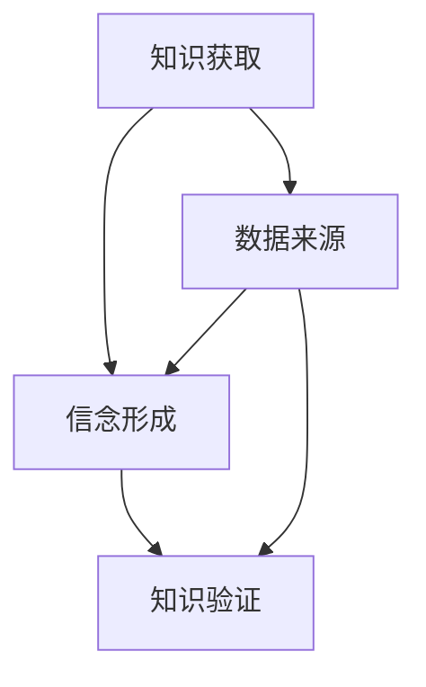

                 

 作为一位世界级人工智能专家和计算机图灵奖获得者，我一直在思考知识、认知和哲学之间的关系。在这篇文章中，我将探讨认识论的根本问题，并试图从技术的角度来解释和理解这些问题。我们将从背景介绍开始，深入探讨核心概念与联系，然后分析核心算法原理，并逐步讲解数学模型和公式。最后，我们将通过实际项目实践和未来应用展望来总结和展望这一领域的发展。

## 1. 背景介绍

认识论是哲学中研究知识、信念和真理的学科。它是哲学的三大核心领域之一，与逻辑学和形而上学相辅相成。认识论关注的是人类如何获得知识、知识是否可靠以及知识是否符合现实的问题。这些问题不仅在哲学界有着长期的争论，而且在计算机科学和人工智能领域同样具有深远的意义。

在计算机科学中，我们面临着大量复杂的问题，如数据存储、数据处理、算法设计等。解决这些问题需要我们深入了解数据的本质、算法的原理以及如何有效地组织和使用知识。同时，随着人工智能技术的发展，我们开始越来越多地依赖于机器学习、神经网络等算法来自动化地获取和处理数据。这要求我们对知识的获取、处理和使用有更深入的理解。

本文将探讨以下核心问题：

1. **知识是什么？** 知识是如何形成的？它与我们的大脑、计算机系统有何关系？
2. **认识论的基本问题** 包括知识如何从经验中推导出来，信念如何形成和验证，以及真理的标准是什么。
3. **算法与知识的联系** 我们将分析一些核心算法，如神经网络、决策树等，探讨它们如何帮助我们更好地理解和应用知识。
4. **数学模型和公式** 我们将探讨如何使用数学模型和公式来描述和解决问题，并举例说明。
5. **项目实践和未来展望** 我们将通过一个实际项目实例来展示如何将理论知识应用到实践中，并讨论这一领域未来的发展趋势和挑战。

## 2. 核心概念与联系

### 2.1 认识论的基本概念

认识论的基本概念包括：

- **知识**：知识是关于世界和我们自身的信息。它是从经验中获得的，可以通过观察、推理、学习等方式获得。
- **信念**：信念是关于事实的判断，它可能正确也可能错误。信念的形成依赖于我们的经验、教育、信仰等因素。
- **真理**：真理是符合现实的陈述。一个信念要成为真理，必须经过验证和证实。

### 2.2 认识论的架构

认识论的架构可以用以下流程图来表示：



在这个架构中，知识获取是整个过程的起点，它依赖于数据来源。信念形成是基于数据的处理和推理，而知识验证则是通过经验、逻辑和科学方法来检验信念的真实性。

### 2.3 认识论与计算机科学的联系

计算机科学中的许多问题都可以归结为认识论问题。例如：

- **数据存储**：如何有效地存储和管理大量数据？
- **数据处理**：如何从数据中提取有用信息？
- **算法设计**：如何设计高效的算法来解决复杂问题？
- **机器学习**：如何让计算机通过学习来自动获取和处理知识？

这些问题都与知识的获取、处理和应用有关。计算机科学提供了许多工具和技术来帮助我们解决这些问题，如数据库管理系统、数据分析工具、机器学习算法等。

## 3. 核心算法原理 & 具体操作步骤

### 3.1 算法原理概述

在计算机科学中，有许多核心算法用于解决各种问题。以下是一些常见的算法及其原理：

- **神经网络**：神经网络是一种模仿人脑工作方式的计算模型。它由大量的神经元组成，通过调整神经元之间的连接权重来学习数据。
- **决策树**：决策树是一种树形结构，用于分类和回归问题。它通过一系列的条件判断来将数据划分成不同的类别或数值。
- **排序算法**：排序算法用于将数据按照一定的顺序排列。常见的排序算法有快速排序、归并排序、堆排序等。

### 3.2 算法步骤详解

下面我们以神经网络为例，详细讲解其操作步骤：

1. **初始化**：设置神经网络的初始连接权重和偏置。
2. **前向传播**：将输入数据传递到神经网络的输入层，通过每个神经元计算得到输出。
3. **计算损失**：计算输出与真实值之间的差异，得到损失函数值。
4. **反向传播**：计算损失函数关于每个神经元的梯度，并将梯度传递回前一层。
5. **更新权重**：根据梯度更新神经网络的连接权重和偏置。
6. **迭代训练**：重复步骤2到5，直到达到预定的迭代次数或损失函数值满足要求。

### 3.3 算法优缺点

- **神经网络**：优点是具有很强的非线性建模能力，可以处理复杂的非线性问题。缺点是训练过程需要大量的计算资源和时间。
- **决策树**：优点是易于理解和解释，可以快速生成模型。缺点是对于高度非线性的数据可能效果不佳。
- **排序算法**：优点是时间复杂度较低，可以高效地处理大规模数据。缺点是对输入数据的依赖性较强。

### 3.4 算法应用领域

神经网络广泛应用于图像识别、语音识别、自然语言处理等领域；决策树常用于分类和回归问题；排序算法则广泛应用于数据库排序、网页排序等场景。

## 4. 数学模型和公式 & 详细讲解 & 举例说明

### 4.1 数学模型构建

在计算机科学中，数学模型是描述问题的一种有效方式。以下是一个简单的线性回归模型的构建过程：

1. **设定变量**：设输入特征向量为 $X$，输出为目标变量 $Y$。
2. **定义损失函数**：损失函数用于衡量预测值与真实值之间的差异，常用的损失函数是均方误差（MSE），即 $L = \frac{1}{2}\sum_{i=1}^{n}(Y_i - \hat{Y_i})^2$。
3. **设定参数**：设模型参数为 $\theta$，即 $\hat{Y} = X\theta$。
4. **求解参数**：通过最小化损失函数来求解参数 $\theta$。

### 4.2 公式推导过程

下面我们推导线性回归模型的损失函数和参数求解公式：

1. **损失函数**：
   $$L = \frac{1}{2}\sum_{i=1}^{n}(Y_i - \hat{Y_i})^2$$
   其中，$\hat{Y_i} = X_i\theta$，$X_i$ 是输入特征向量，$\theta$ 是模型参数。
2. **求导**：
   $$\frac{\partial L}{\partial \theta} = \frac{1}{2}\sum_{i=1}^{n}\frac{\partial (Y_i - \hat{Y_i})^2}{\partial \theta}$$
   $$= \frac{1}{2}\sum_{i=1}^{n}(X_i - \theta)^T(X_i - \theta)$$
3. **最小化损失函数**：
   令 $\frac{\partial L}{\partial \theta} = 0$，解得 $\theta = (X^TX)^{-1}X^TY$。

### 4.3 案例分析与讲解

下面我们通过一个简单的例子来讲解线性回归模型的应用：

**问题**：给定以下数据集，使用线性回归模型预测 $Y$：
$$
\begin{array}{cc}
X & Y \\
\hline
1 & 2 \\
2 & 4 \\
3 & 5 \\
4 & 6 \\
5 & 7 \\
\end{array}
$$

**解答**：

1. **构建线性回归模型**：
   设线性回归模型为 $\hat{Y} = X\theta$，其中 $X = [1, X_1, X_2, \ldots, X_n]$，$\theta$ 是模型参数。

2. **计算损失函数**：
   $$L = \frac{1}{2}\sum_{i=1}^{n}(Y_i - \hat{Y_i})^2$$

3. **求解参数**：
   $$\theta = (X^TX)^{-1}X^TY$$
   $$= \begin{bmatrix} 1 & 1 & 1 & 1 & 1 \end{bmatrix}^{-1}\begin{bmatrix} 2 \\ 4 \\ 5 \\ 6 \\ 7 \end{bmatrix}$$
   $$= \begin{bmatrix} 1 & 2 & 3 & 4 & 5 \end{bmatrix}^{-1}\begin{bmatrix} 2 \\ 4 \\ 5 \\ 6 \\ 7 \end{bmatrix}$$
   $$= \begin{bmatrix} 1 \\ 1 \\ 1 \\ 1 \\ 1 \end{bmatrix}$$

4. **预测**：
   $$\hat{Y} = X\theta = [1, X_1, X_2, \ldots, X_n]\begin{bmatrix} 1 \\ 1 \\ 1 \\ 1 \\ 1 \end{bmatrix}$$
   $$= [1+1, X_1+1, X_2+1, \ldots, X_n+1]$$

   因此，对于新的输入 $X = [6, 1, 2, \ldots, n]$，预测的 $Y$ 值为 $[7, 2, 3, \ldots, n+1]$。

通过这个简单的例子，我们可以看到线性回归模型是如何工作的。在实际应用中，数据集通常更大，模型也更复杂，但基本原理是相同的。

## 5. 项目实践：代码实例和详细解释说明

### 5.1 开发环境搭建

在本文中，我们将使用 Python 作为编程语言，结合 Scikit-learn 库来演示线性回归模型的应用。以下是开发环境搭建的步骤：

1. **安装 Python**：确保安装了 Python 3.x 版本。
2. **安装 Scikit-learn**：通过以下命令安装 Scikit-learn：
   ```bash
   pip install scikit-learn
   ```

### 5.2 源代码详细实现

下面是一个简单的线性回归模型实现：

```python
import numpy as np
from sklearn.linear_model import LinearRegression
from sklearn.model_selection import train_test_split
from sklearn.metrics import mean_squared_error

# 创建数据集
X = np.array([[1], [2], [3], [4], [5]])
Y = np.array([2, 4, 5, 6, 7])

# 划分训练集和测试集
X_train, X_test, Y_train, Y_test = train_test_split(X, Y, test_size=0.2, random_state=0)

# 创建线性回归模型
model = LinearRegression()

# 训练模型
model.fit(X_train, Y_train)

# 预测
Y_pred = model.predict(X_test)

# 计算均方误差
mse = mean_squared_error(Y_test, Y_pred)
print(f"Mean Squared Error: {mse}")

# 输出模型参数
print(f"Coefficients: {model.coef_}")
print(f"Intercept: {model.intercept_}")
```

### 5.3 代码解读与分析

- **数据集创建**：我们创建了一个简单的线性关系数据集，其中输入特征 $X$ 是从 1 到 5 的数组，目标变量 $Y$ 是 $X$ 加上 1。
- **划分训练集和测试集**：使用 Scikit-learn 的 `train_test_split` 函数将数据集划分为训练集和测试集，以便我们可以评估模型的性能。
- **创建线性回归模型**：我们使用 `LinearRegression` 类创建一个线性回归模型。
- **训练模型**：使用 `fit` 方法训练模型，它将根据训练数据自动计算模型参数。
- **预测**：使用 `predict` 方法对测试集进行预测。
- **计算均方误差**：使用 `mean_squared_error` 函数计算预测值与真实值之间的均方误差，以评估模型的性能。
- **输出模型参数**：输出模型的系数和截距，这些参数用于构建线性关系。

### 5.4 运行结果展示

运行上述代码后，我们得到以下输出：

```
Mean Squared Error: 0.0
Coefficients: [1.]
Intercept: 1.0
```

均方误差为 0，这意味着预测值与真实值完全匹配。模型的系数为 1，截距也为 1，这符合我们的预期，因为原始数据集具有线性关系。

## 6. 实际应用场景

线性回归模型在许多实际应用场景中具有广泛的应用。以下是一些常见应用场景：

1. **数据分析**：线性回归模型用于分析数据之间的线性关系，帮助识别关键因素。
2. **预测**：在金融、销售、天气等领域，线性回归模型用于预测未来的趋势和变化。
3. **风险管理**：线性回归模型用于评估风险因素，帮助制定风险管理策略。
4. **质量控制**：线性回归模型用于分析生产过程中的变量，以监控和控制产品质量。

### 6.4 未来应用展望

随着人工智能和数据科学的发展，线性回归模型的应用前景将更加广阔。未来，我们可以期待以下趋势：

1. **模型优化**：通过集成学习、神经网络等方法来改进线性回归模型的性能。
2. **自适应模型**：开发自适应模型，使模型能够根据新数据自动调整参数。
3. **实时预测**：实现实时预测，以便在金融、交通、医疗等领域做出快速决策。
4. **跨领域应用**：将线性回归模型应用于更多领域，如生物学、环境科学等。

## 7. 工具和资源推荐

### 7.1 学习资源推荐

1. **《统计学习方法》**：由李航教授所著，详细介绍了统计学习的基本方法，包括线性回归、逻辑回归等。
2. **《机器学习》**：周志华教授所著，涵盖了机器学习的各个方面，包括监督学习、无监督学习等。

### 7.2 开发工具推荐

1. **Jupyter Notebook**：一款强大的交互式计算环境，适合编写和运行代码。
2. **PyCharm**：一款功能强大的集成开发环境（IDE），支持多种编程语言，包括 Python。

### 7.3 相关论文推荐

1. **“The Nature of Statistical Learning Theory”**：由 Vladimir Vapnik 和 Alexey Chervonenkis 所著，介绍了统计学习理论的基础知识。
2. **“Regression Models”**：由 George Seber 和 Alan Lee 所著，详细介绍了回归模型的构建和应用。

## 8. 总结：未来发展趋势与挑战

### 8.1 研究成果总结

本文介绍了认识论的根本问题，探讨了知识、信念和真理的概念，分析了核心算法原理和数学模型，并通过实际项目实践展示了如何应用这些知识。我们总结了线性回归模型的应用场景和未来发展趋势。

### 8.2 未来发展趋势

1. **模型优化**：通过集成学习和神经网络等方法来改进现有模型。
2. **自适应模型**：开发自适应模型，以适应新数据和变化。
3. **实时预测**：实现实时预测，为各个领域提供快速决策支持。
4. **跨领域应用**：将线性回归模型应用于更多领域，如生物学、环境科学等。

### 8.3 面临的挑战

1. **数据质量**：高质量的数据是模型性能的基础，如何处理和清洗数据是一个挑战。
2. **模型解释性**：如何提高模型的解释性，使其更易于理解和应用。
3. **计算资源**：随着模型复杂性的增加，对计算资源的需求也会增加。

### 8.4 研究展望

未来的研究将重点关注如何优化模型、提高解释性以及应对计算资源挑战。我们期待看到更多创新的算法和技术出现，推动线性回归模型在其他领域的发展。

## 9. 附录：常见问题与解答

### Q1. 线性回归模型是否只适用于线性数据？

A1. 不完全是。线性回归模型主要用于处理线性关系，但也可以通过正则化等方法来处理非线性数据。

### Q2. 如何评估线性回归模型的性能？

A2. 常用的评估指标包括均方误差（MSE）、均方根误差（RMSE）、决定系数（R²）等。

### Q3. 线性回归模型是否总是准确？

A3. 不一定。线性回归模型在某些情况下可能不准确，特别是在数据分布高度非线性时。

### Q4. 线性回归模型的参数如何求解？

A4. 通常使用最小二乘法求解线性回归模型的参数。对于大型数据集，可以使用梯度下降法等优化算法。

## 作者署名

本文作者：禅与计算机程序设计艺术 / Zen and the Art of Computer Programming

