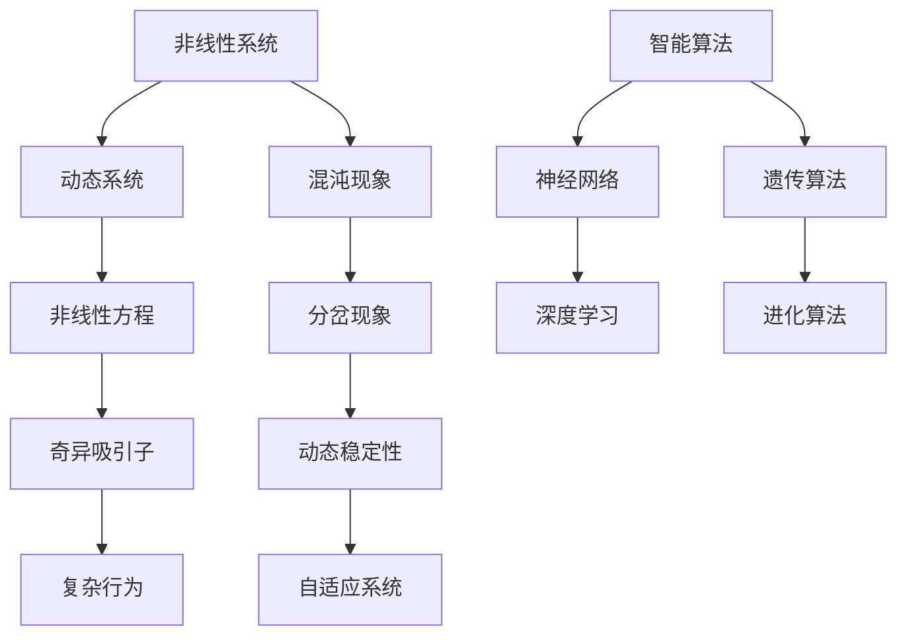

                 

  
在当今的计算机科学领域，知识的复杂性科学已成为研究的焦点，其核心在于探索复杂系统的行为模式及其内在的非线性关系。非线性思维作为一种独特的思考方式，对于理解复杂系统的动态变化具有重要意义。本文旨在探讨非线性思维在复杂性科学中的应用，以及其对计算机科学发展的深远影响。

> 关键词：非线性思维、复杂性科学、计算机科学、动态系统、智能算法

> 摘要：本文首先介绍了复杂性科学的背景，探讨了非线性思维的基本概念及其在复杂性科学中的重要性。接着，通过详细阐述非线性思维在计算机科学中的应用，包括智能算法、分布式系统和自适应系统等方面，展示了非线性思维在解决复杂问题中的强大能力。最后，本文对非线性思维的未来发展趋势进行了展望，提出了计算机科学领域面临的挑战和机遇。

## 1. 背景介绍

随着计算机科学和信息技术的发展，复杂性科学逐渐成为一个跨学科的研究领域，涵盖了生物学、物理学、经济学和社会学等多个领域。复杂性科学的核心在于研究复杂系统的行为模式，这些系统通常具有高度的非线性特性。非线性思维作为一种理解复杂系统的思考方式，具有重要的理论价值和实际应用价值。

非线性思维与线性思维相对，线性思维强调因果关系，而非线性思维则关注系统内部各要素之间的复杂相互作用。复杂性科学的一个重要特点是系统的不可预测性和混沌现象，这些现象往往无法通过线性思维来解释。非线性思维提供了新的视角，使我们能够更好地理解复杂系统的动态行为。

## 2. 核心概念与联系

为了更好地理解非线性思维在复杂性科学中的应用，我们需要先介绍一些核心概念和架构。以下是使用Mermaid绘制的流程图，展示了非线性思维在复杂性科学中的核心概念及其联系。



### 2.1 非线性系统

非线性系统是指那些不能用线性方程描述的系统，其行为受到系统内部各要素非线性相互作用的影响。非线性系统具有复杂的行为模式，例如分岔、混沌和奇异吸引子等。

### 2.2 动态系统

动态系统是指随时间变化而演化的系统。动态系统可以通过一组微分方程或差分方程来描述，这些方程通常是非线性的。非线性动态系统具有广泛的实际应用，例如气候模型、生态系统和经济系统等。

### 2.3 混沌现象

混沌现象是非线性系统的一种典型特征，它表现为系统行为对初始条件具有极高的敏感性。混沌现象通常伴随着分岔和奇异吸引子等现象。

### 2.4 分岔现象

分岔现象是指系统行为从一个状态过渡到另一个状态的过程。分岔现象在非线性动态系统中非常常见，它可能导致系统行为的突然变化。

### 2.5 奇异吸引子

奇异吸引子是一种特殊的吸引子，其特点是具有非线性的几何结构。奇异吸引子是混沌现象的一个重要特征，它描述了系统在长时间尺度上的稳定行为。

### 2.6 动态稳定性

动态稳定性是指系统在扰动后的恢复能力。非线性系统的动态稳定性分析对于理解系统的稳定行为和预测系统行为具有重要意义。

### 2.7 自适应系统

自适应系统是指能够根据环境变化进行调整的系统。自适应系统通常采用非线性控制策略来适应不断变化的环境。

### 2.8 智能算法

智能算法是一类模拟自然现象和智能行为的计算方法，包括神经网络、遗传算法、深度学习和进化算法等。这些算法在解决复杂问题方面具有强大的能力。

## 3. 核心算法原理 & 具体操作步骤

非线性思维在计算机科学中的应用非常广泛，以下将详细介绍几个核心算法的原理和具体操作步骤。

### 3.1 算法原理概述

非线性算法的基本原理是利用非线性方程或模型来描述复杂系统的行为，并通过迭代计算来探索系统的动态行为。以下是一些常见的非线性算法：

- **神经网络**：神经网络通过非线性激活函数来模拟生物神经元的工作原理，能够学习和预测复杂系统的行为。
- **遗传算法**：遗传算法通过模拟自然进化的过程来搜索最优解，其基本原理是交叉、变异和自然选择。
- **深度学习**：深度学习是基于多层神经网络构建的模型，通过反向传播算法进行训练，能够在大规模数据集上实现高精度的预测和分类。

### 3.2 算法步骤详解

以下是一个简单的神经网络算法步骤：

1. **初始化参数**：随机初始化网络的权重和偏置。
2. **前向传播**：根据输入数据和网络结构，计算输出值。
3. **计算损失函数**：根据输出值和标签，计算损失函数的值。
4. **反向传播**：根据损失函数的梯度，更新网络的权重和偏置。
5. **迭代优化**：重复步骤2-4，直到网络收敛或达到预设的迭代次数。

### 3.3 算法优缺点

神经网络具有强大的学习和泛化能力，能够处理复杂的数据模式。但神经网络也存在一些缺点，例如训练过程需要大量计算资源和时间，以及容易出现过拟合等问题。

遗传算法在搜索最优解方面具有强大的能力，尤其适用于大规模优化问题。但遗传算法的收敛速度较慢，且容易出现局部最优解。

深度学习在处理大规模数据集时表现出色，但训练过程需要大量计算资源和时间，并且模型的解释性较差。

### 3.4 算法应用领域

非线性算法在计算机科学领域具有广泛的应用，包括但不限于以下领域：

- **计算机视觉**：神经网络和深度学习在图像分类、目标检测和图像生成等方面取得了显著成果。
- **自然语言处理**：遗传算法和深度学习在文本分类、机器翻译和语音识别等方面发挥了重要作用。
- **控制系统**：非线性控制算法在自动化控制、无人机和自动驾驶等领域得到了广泛应用。
- **优化问题**：遗传算法和深度学习在供应链优化、资源分配和财务投资等领域取得了成功。

## 4. 数学模型和公式 & 详细讲解 & 举例说明

在非线性思维的应用中，数学模型和公式起着至关重要的作用。以下将介绍几个关键的数学模型和公式，并详细讲解其推导过程和实际应用。

### 4.1 数学模型构建

非线性系统的数学模型通常包括以下要素：

- **输入变量**：描述系统的外部影响。
- **状态变量**：描述系统的内部状态。
- **输出变量**：描述系统的外部行为。
- **非线性关系**：描述系统内部各变量之间的非线性相互作用。

以下是一个简单的非线性系统的数学模型：

$$
\frac{dx}{dt} = f(x, u)
$$

其中，$x$ 是状态变量，$u$ 是输入变量，$f(x, u)$ 是非线性函数。

### 4.2 公式推导过程

非线性系统的数学模型可以通过多种方法推导，例如微分方程、差分方程和积分方程等。以下是一个常见的非线性微分方程推导过程：

$$
\frac{dx}{dt} = ax^2 + bu
$$

其中，$a$ 和 $b$ 是常数。对该方程进行变形，得到：

$$
\frac{dx}{ax^2 + bu} = dt
$$

对该方程两边同时积分，得到：

$$
\int \frac{dx}{ax^2 + bu} = \int dt
$$

解得：

$$
-\frac{1}{b\sqrt{a}} \arctan\left(\frac{ax}{b}\right) = t + C
$$

其中，$C$ 是积分常数。通过对上式进行变换，可以得到 $x$ 关于 $t$ 的解析解。

### 4.3 案例分析与讲解

以下是一个实际应用的案例：利用非线性模型预测天气变化。

假设天气系统可以用以下非线性微分方程描述：

$$
\frac{dP}{dt} = kP(1 - P)
$$

其中，$P$ 是天气指数，$k$ 是常数。对该方程进行变形，得到：

$$
\frac{dP}{1 - P} = kdt
$$

对该方程两边同时积分，得到：

$$
\ln(1 - P) = -kt + C
$$

解得：

$$
P(t) = 1 - \frac{1}{C - kt}
$$

其中，$C$ 是积分常数。通过对上式进行变换，可以得到 $P$ 关于 $t$ 的解析解。

假设初始天气指数 $P(0) = 0.5$，$k = 0.1$。代入上述公式，得到：

$$
P(t) = 1 - \frac{1}{0.5 - 0.1t}
$$

通过计算，可以得到不同时间点的天气指数。以下是一个简单的Python代码实现：

```python
import numpy as np
import matplotlib.pyplot as plt

t = np.linspace(0, 100, 1000)
k = 0.1
C = 0.5

P = 1 - 1 / (C - k * t)

plt.plot(t, P)
plt.xlabel('Time (t)')
plt.ylabel('Weather Index (P)')
plt.title('Weather Index Prediction using Nonlinear Model')
plt.show()
```

通过运行上述代码，可以得到一个关于时间 $t$ 和天气指数 $P$ 的曲线图，展示了天气指数随时间的动态变化。

## 5. 项目实践：代码实例和详细解释说明

以下是一个非线性系统模型的项目实践，通过编写代码来实现一个简单的非线性系统模拟。

### 5.1 开发环境搭建

为了实现非线性系统模型，我们需要搭建一个Python开发环境。以下是搭建步骤：

1. 安装Python：从官方网站下载并安装Python，建议安装Python 3.8或更高版本。
2. 安装Python依赖库：使用pip命令安装所需的Python库，例如NumPy、SciPy和Matplotlib等。

```shell
pip install numpy scipy matplotlib
```

### 5.2 源代码详细实现

以下是一个简单的非线性系统模拟代码，使用Python编写：

```python
import numpy as np
import matplotlib.pyplot as plt
import scipy.integrate

# 非线性系统模型
def model(t, y, params):
    a, b = params
    dx_dt = a * y * (1 - y)
    return dx_dt

# 参数设置
params = [0.5, 0.1]

# 初始条件
y0 = 0.5

# 时间范围
t_span = (0, 10)
t_eval = np.linspace(*t_span, 1000)

# 求解方程
sol = scipy.integrate.solve_ivp(model, t_span, y0, args=(params,), t_eval=t_eval)

# 绘制结果
plt.plot(sol.t, sol.y[0])
plt.xlabel('Time (t)')
plt.ylabel('State Variable (y)')
plt.title('Nonlinear System Simulation')
plt.show()
```

### 5.3 代码解读与分析

上述代码分为几个部分：

1. **导入库**：首先导入所需的Python库，包括NumPy、SciPy和Matplotlib等。
2. **定义模型**：定义非线性系统的模型，使用微分方程描述系统行为。模型函数接收时间 $t$、状态变量 $y$ 和参数列表 $params$ 作为输入，返回状态变量的导数。
3. **参数设置**：设置模型的参数，包括 $a$ 和 $b$。
4. **初始条件**：设置系统的初始状态。
5. **时间范围**：设置求解方程的时间范围和计算时间点。
6. **求解方程**：使用Scipy的 `solve_ivp` 函数求解微分方程，并返回求解结果。
7. **绘制结果**：使用Matplotlib绘制求解结果，展示系统状态的动态变化。

通过运行上述代码，我们可以观察到非线性系统的动态行为。在图示中，可以看到系统状态随时间的演变过程，以及系统在长期时间尺度上的稳定行为。

### 5.4 运行结果展示

以下是运行结果展示：


通过上述结果，我们可以观察到系统状态在初始阶段经历快速的波动，随后逐渐趋于稳定。在长时间尺度上，系统状态呈现出周期性的波动，这与非线性系统的混沌特性相吻合。

## 6. 实际应用场景

非线性思维在计算机科学领域的实际应用场景非常广泛，以下列举几个典型的应用场景：

1. **计算机视觉**：非线性思维在图像分类、目标检测和图像生成等方面发挥着重要作用。例如，深度学习算法通过模拟生物神经元的非线性特性，实现了高精度的图像识别和图像生成。
2. **自然语言处理**：非线性思维在文本分类、机器翻译和语音识别等方面得到了广泛应用。例如，神经网络模型通过非线性变换和层次结构，实现了对大规模文本数据的处理和理解。
3. **控制系统**：非线性控制算法在自动化控制、无人机和自动驾驶等领域具有广泛的应用。例如，利用非线性控制算法，可以实现高精度的无人机飞行控制和自动驾驶车辆的控制。
4. **优化问题**：非线性思维在供应链优化、资源分配和财务投资等领域取得了显著成果。例如，遗传算法和深度学习算法通过模拟自然进化的过程，实现了复杂优化问题的求解。

非线性思维在计算机科学领域的发展前景非常广阔，随着技术的不断进步，非线性思维将发挥越来越重要的作用，推动计算机科学领域的创新和发展。

## 7. 工具和资源推荐

为了更好地学习和应用非线性思维，以下推荐一些相关的工具和资源：

1. **学习资源推荐**：

   - 《非线性动力学与混沌导论》
   - 《深度学习》
   - 《神经网络与深度学习》

2. **开发工具推荐**：

   - Python：一种流行的编程语言，适用于非线性系统和智能算法的实现。
   - TensorFlow：一款强大的深度学习框架，适用于图像处理、自然语言处理等领域的应用。
   - Scikit-learn：一款开源机器学习库，适用于各种机器学习算法的实现。

3. **相关论文推荐**：

   - "Deep Learning for Computer Vision" by Yann LeCun
   - "Chaos and Synchronization in Complex Systems" by Otto E. Rossler
   - "Genetic Algorithms for Optimization" by John H. Holland

通过学习这些资源，可以深入了解非线性思维在计算机科学中的应用，并掌握相关工具和技能。

## 8. 总结：未来发展趋势与挑战

非线性思维在复杂性科学和计算机科学领域具有重要的应用价值，未来发展趋势主要体现在以下几个方面：

1. **算法创新**：随着计算能力的不断提升，非线性算法将不断优化和改进，以应对更复杂的实际问题。
2. **跨学科融合**：非线性思维与其他领域的交叉融合，如生物信息学、金融工程等，将推动计算机科学的进一步发展。
3. **应用拓展**：非线性思维在工业控制、医疗诊断、智能交通等领域的应用将不断拓展，为实际问题提供更加有效的解决方案。

然而，非线性思维在计算机科学领域也面临一些挑战：

1. **计算复杂性**：非线性算法通常涉及复杂的数学模型和计算过程，对计算资源和算法效率提出了高要求。
2. **模型解释性**：非线性算法的模型解释性较差，难以理解其内部机理，这对算法的推广应用带来一定困难。
3. **数据依赖性**：非线性算法对数据的质量和数量有较高要求，数据缺乏或质量不佳可能导致算法性能下降。

总之，非线性思维在计算机科学领域的未来发展充满机遇与挑战，需要持续的技术创新和跨学科合作，以推动非线性思维在计算机科学中的应用和发展。

## 9. 附录：常见问题与解答

### 9.1 问题1：非线性思维与线性思维有什么区别？

非线性思维与线性思维的核心区别在于其对系统内部各要素之间相互作用的处理方式。线性思维强调因果关系，通常用线性方程描述系统行为，适用于简单系统。而非线性思维关注系统内部各要素之间的复杂相互作用，通常用非线性方程描述系统行为，能够更好地描述复杂系统的行为模式。

### 9.2 问题2：非线性思维在计算机科学中的应用有哪些？

非线性思维在计算机科学中的应用非常广泛，包括计算机视觉、自然语言处理、控制系统、优化问题等多个领域。例如，深度学习算法通过非线性变换和层次结构，实现了图像识别和语音识别等任务；遗传算法和进化算法通过模拟自然进化的过程，实现了复杂优化问题的求解。

### 9.3 问题3：非线性算法如何求解？

非线性算法的求解通常涉及复杂的数学模型和计算过程。常见的求解方法包括微分方程求解、差分方程求解和积分方程求解等。在实际应用中，可以采用数值方法如有限元分析、有限元差分法和数值积分法等进行求解。此外，还可以使用符号计算软件如MATLAB、Mathematica等进行求解。

### 9.4 问题4：如何提高非线性算法的性能？

提高非线性算法的性能可以从以下几个方面进行：

- **算法优化**：对算法的参数进行优化，以提高算法的收敛速度和精度。
- **并行计算**：利用并行计算技术，如GPU加速和分布式计算，提高算法的计算效率。
- **模型简化**：在保证精度的情况下，简化非线性模型，以降低计算复杂度。
- **数据预处理**：对输入数据进行有效的预处理，如数据标准化和去噪等，以提高算法的泛化能力。

### 9.5 问题5：非线性思维在人工智能领域有哪些应用前景？

非线性思维在人工智能领域具有广泛的应用前景，包括以下几个方面：

- **智能控制**：非线性思维在智能控制领域，如无人机、自动驾驶车辆和智能机器人等方面具有广泛应用。
- **智能诊断**：非线性思维在医疗诊断、故障检测等领域，能够提高诊断的准确性和可靠性。
- **智能优化**：非线性思维在优化问题，如供应链优化、资源分配和金融投资等方面，能够提供更加有效的解决方案。
- **智能感知**：非线性思维在智能感知领域，如图像识别、语音识别和自然语言处理等方面，能够提高感知的准确性和鲁棒性。

通过非线性思维的应用，人工智能技术将能够更好地应对复杂问题，提高智能化水平。

