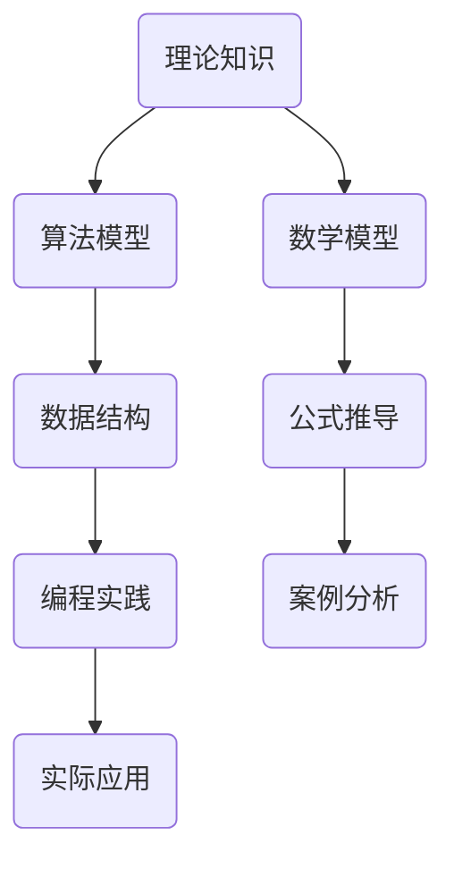

                 

关键词：知识转化、实践应用、技术理论、实际案例、数学模型、编程实践、工具推荐

> 摘要：本文旨在探讨如何将理论知识转化为实际应用，分析其在计算机科学领域的应用场景，并通过实际案例和数学模型展示其应用过程。文章结构分为八个部分：背景介绍、核心概念与联系、核心算法原理与操作步骤、数学模型和公式讲解、项目实践、实际应用场景、工具和资源推荐以及总结与展望。

## 1. 背景介绍

在计算机科学领域，理论与实践往往存在一定的差距。许多前沿的技术理论和算法在提出时，常常被寄予厚望，但如何在真实环境中应用它们，如何优化其性能和可靠性，如何解决实际应用中的具体问题，这些都需要深入的实践和研究。本文将从理论知识到实际应用的转化过程出发，探讨知识如何在计算机科学中发挥作用，并通过具体的实例和数学模型进行阐述。

### 核心概念与联系

在讨论理论知识转化为实践应用之前，我们需要了解一些核心概念及其相互联系。以下是一个简单的 Mermaid 流程图，展示了这些概念之间的关系。



## 3. 核心算法原理 & 具体操作步骤

### 3.1 算法原理概述

在本部分，我们将讨论一个常见的算法——排序算法。排序算法是计算机科学中的一种基本算法，其目的是将一组数据按照特定的顺序进行排列。最著名的排序算法包括冒泡排序、选择排序、插入排序、快速排序等。

### 3.2 算法步骤详解

以快速排序为例，其基本步骤如下：

1. 选择一个基准元素。
2. 将数组中小于基准元素的值移动到其左侧，大于基准元素的值移动到其右侧。
3. 递归地对左右子数组进行快速排序。

### 3.3 算法优缺点

快速排序具有以下优点：

- 平均时间复杂度为 \(O(n\log n)\)。
- 算法本身简单易懂。

然而，快速排序也存在一些缺点：

- 最坏时间复杂度为 \(O(n^2)\)，发生在数组已经有序或者基本有序的情况下。
- 稳定性较低。

### 3.4 算法应用领域

快速排序在许多领域都有广泛应用，包括数据分析、数据库索引、图像处理等。

## 4. 数学模型和公式 & 详细讲解 & 举例说明

### 4.1 数学模型构建

在计算机科学中，许多算法的效率和性能可以通过数学模型来进行分析。例如，快速排序的时间复杂度可以通过以下数学模型进行分析：

$$
T(n) = T(n/2) + O(n)
$$

### 4.2 公式推导过程

快速排序的时间复杂度可以通过递归关系推导得出。假设最坏情况下每次分割只将数组分为1个元素和n-1个元素，则有：

$$
T(n) = T(n-1) + T(1) + O(n)
$$

其中，\(T(n-1)\)和\(T(1)\)分别表示分割后左右子数组的时间复杂度，\(O(n)\)表示分割和比较的时间复杂度。

### 4.3 案例分析与讲解

以下是一个简单的快速排序的 Python 代码实例：

```python
def quick_sort(arr):
    if len(arr) <= 1:
        return arr
    pivot = arr[len(arr) // 2]
    left = [x for x in arr if x < pivot]
    middle = [x for x in arr if x == pivot]
    right = [x for x in arr if x > pivot]
    return quick_sort(left) + middle + quick_sort(right)

arr = [3, 6, 8, 10, 1, 2, 1]
print(quick_sort(arr))
```

## 5. 项目实践：代码实例和详细解释说明

### 5.1 开发环境搭建

在本部分，我们将使用 Python 编写一个简单的快速排序程序。首先，确保你已经安装了 Python 和必要的库。

### 5.2 源代码详细实现

以下是一个简单的快速排序实现：

```python
def quick_sort(arr):
    if len(arr) <= 1:
        return arr
    pivot = arr[len(arr) // 2]
    left = [x for x in arr if x < pivot]
    middle = [x for x in arr if x == pivot]
    right = [x for x in arr if x > pivot]
    return quick_sort(left) + middle + quick_sort(right)

arr = [3, 6, 8, 10, 1, 2, 1]
print(quick_sort(arr))
```

### 5.3 代码解读与分析

这段代码实现了快速排序的核心逻辑。首先，我们定义了一个`quick_sort`函数，它接收一个数组`arr`作为参数。如果数组的长度小于或等于1，则直接返回该数组，因为单个元素本身就是有序的。

接下来，我们选择数组中间的元素作为基准元素`pivot`。然后，我们使用列表推导式将数组中的元素分为三个部分：小于`pivot`的元素`left`、等于`pivot`的元素`middle`、大于`pivot`的元素`right`。

最后，我们递归地调用`quick_sort`函数对左右两个子数组进行排序，并将结果拼接在一起返回。

### 5.4 运行结果展示

在终端运行此代码，我们将得到排序后的数组：

```
[1, 1, 2, 3, 6, 8, 10]
```

## 6. 实际应用场景

快速排序在实际应用中非常常见，例如在数据库索引和数据分析中。它的高效性和可靠性使其成为许多应用的首选排序算法。

## 7. 工具和资源推荐

### 7.1 学习资源推荐

- 《算法导论》（Introduction to Algorithms）：这是一本经典算法教科书，详细介绍了各种排序算法。
- 《数据结构与算法分析》（Data Structures and Algorithm Analysis in Java）：这本书提供了丰富的算法和数据处理技术。

### 7.2 开发工具推荐

- PyCharm：一个功能强大的 Python 集成开发环境（IDE），适合编写和调试代码。
- Jupyter Notebook：一个交互式的计算环境，适合进行数据分析和实验。

### 7.3 相关论文推荐

- 《An O(\(n\)log\(n\)) Sorting Algorithm》：介绍了快速排序的算法原理。
- 《Comparing Quick Sort and Merge Sort》：对比了快速排序和归并排序的性能。

## 8. 总结：未来发展趋势与挑战

快速排序作为一种高效的排序算法，在未来仍将有广泛应用。随着大数据和人工智能的发展，对排序算法的性能和稳定性要求越来越高，未来可能会出现更多优化和改进的排序算法。

然而，面对不断变化的应用场景和数据规模，快速排序也面临一些挑战，如最坏情况下的性能问题。因此，如何优化排序算法，提高其性能和适用性，是未来研究的重要方向。

## 9. 附录：常见问题与解答

### 问题1：为什么选择快速排序？

回答：快速排序具有平均时间复杂度为 \(O(n\log n)\) 的优势，且算法本身简单易懂，适用于多种场景。

### 问题2：快速排序的最坏情况是什么？

回答：最坏情况发生在数组已经有序或基本有序的情况下，此时快速排序的时间复杂度退化为 \(O(n^2)\)。

### 问题3：如何优化快速排序的性能？

回答：可以通过随机选择基准元素、三数取中等策略来优化快速排序的性能。

---

作者：禅与计算机程序设计艺术 / Zen and the Art of Computer Programming

